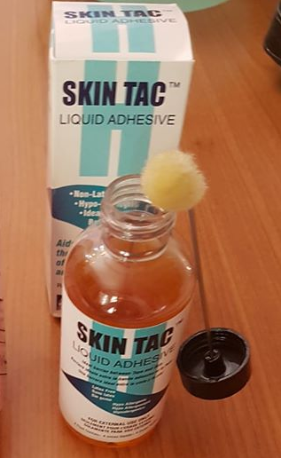
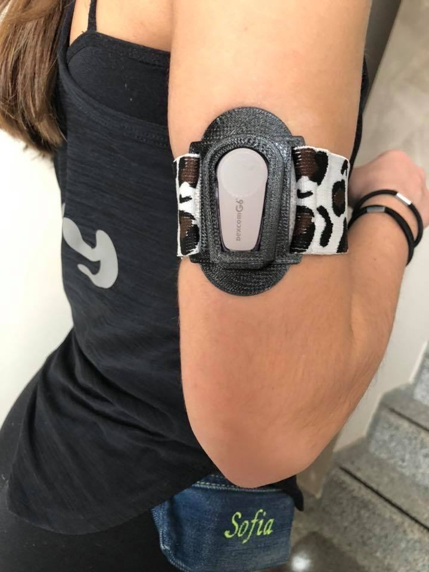

# Dexcom G6: ancoraggio del sensore

Alcuni sensori Dexcom G6 tendono a staccarsi prima della scadenza, soprattutto con la sudorazione o l'attività fisica. Ecco due soluzioni segnalate dagli utenti del gruppo Facebook per ancorare meglio il sensore alla pelle.

## Skin Tac

**Skin Tac** è un adesivo ipoallergenico, usato e venduto negli Stati Uniti. La versione liquida (acquistabile su eBay) si stende in uno strato sottile sulla pelle, prima di applicare il sensore, facendo un riquadro attorno alla zona e lasciando libera la parte dove verrà inserito:

## Fascia da braccio

Una fascia in gomma morbida, personalizzabile, tiene il sensore in posizione. È prodotta dal papà di una bambina con diabete di tipo 1, e parte dei proventi è destinata alla ricerca. Per informazioni, contatta la pagina Facebook [`https://www.facebook.com/new3d.it/`](https://www.facebook.com/new3d.it/):

Vedi anche: [Dexcom G6: riavvio del sensore](./dexcom-g6-riavvio).
