# Glicemia al polso: quale smartwatch?

Gli smartwatch che possono mostrare la glicemia sul quadrante rientrano in quattro grandi categorie. Ecco una panoramica per orientarti prima dell'acquisto, con i rimandi alle guide dedicate.

## 1. Amazfit e smartband con Zepp OS

Utilizzabili **solo con smartphone Android**.

La lista aggiornata dei modelli compatibili è disponibile su [`https://watchdrip.org`](https://watchdrip.org): aprendo ogni modello puoi vedere i quadranti disponibili. Più quadranti ci sono, maggiore è il supporto e l'interesse degli sviluppatori: lo sviluppo segue spesso la richiesta degli utilizzatori.

Per la configurazione vedi la [guida dedicata](../documentation/amazfit/smartwatch-amazfit-zepp-os).

## 2. Smartwatch con Wear OS

Anche questi funzionano **solo con smartphone Android**.

In genere consigliamo i **Samsung Galaxy Watch** (serie 4 e successive), perché abbiamo riscontri diretti sul funzionamento e possibilità di test.

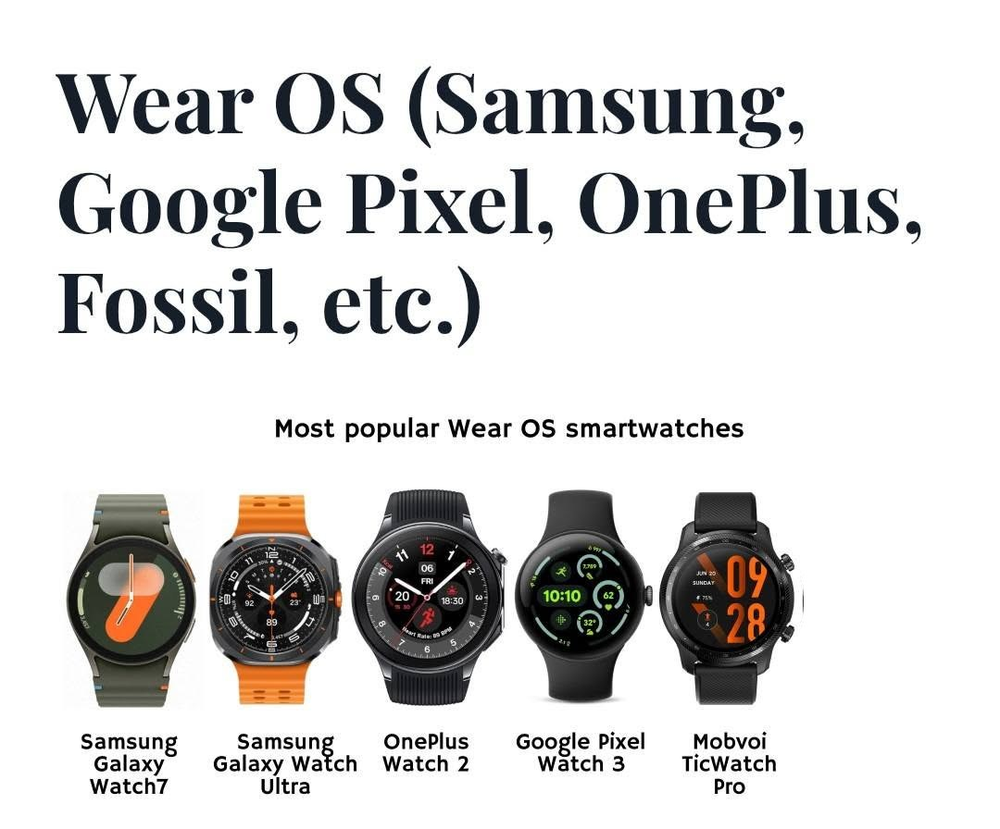

Oltre a Samsung esistono altri marchi con Wear OS: Google Pixel, OnePlus, Mobvoi, Xiaomi (solo i modelli Watch 2 e Watch 2 Pro) e Fossil (uscita dal mercato degli smartwatch nel 2024: si trova ormai solo di seconda mano).

> ⚠️ **Attenzione**: al momento dell'acquisto è fondamentale verificare che l'orologio riporti chiaramente la dicitura **Wear OS**. Questo è il logo ufficiale:

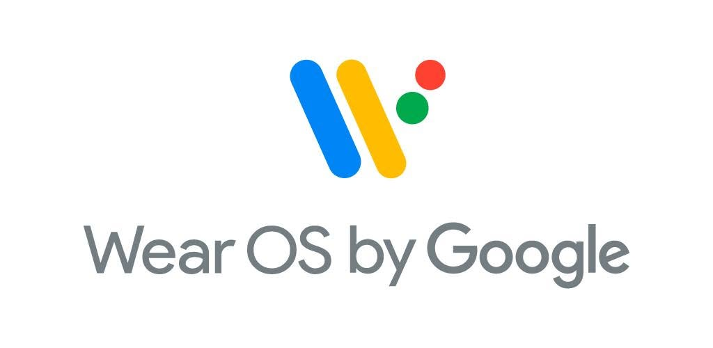

Per iniziare vedi la [guida Wear OS](../documentation/wearos/glicemia-su-smartwatch-wear-os), dove trovi i quadranti e le app consigliati per ogni sorgente dati (xDrip, GlucoDataHandler, app Dexcom, Nightscout, Gluroo) e i passaggi di installazione.

## 3. Garmin

Molto diffusi tra chi pratica sport. Compatibili **sia con Android sia con iPhone**.

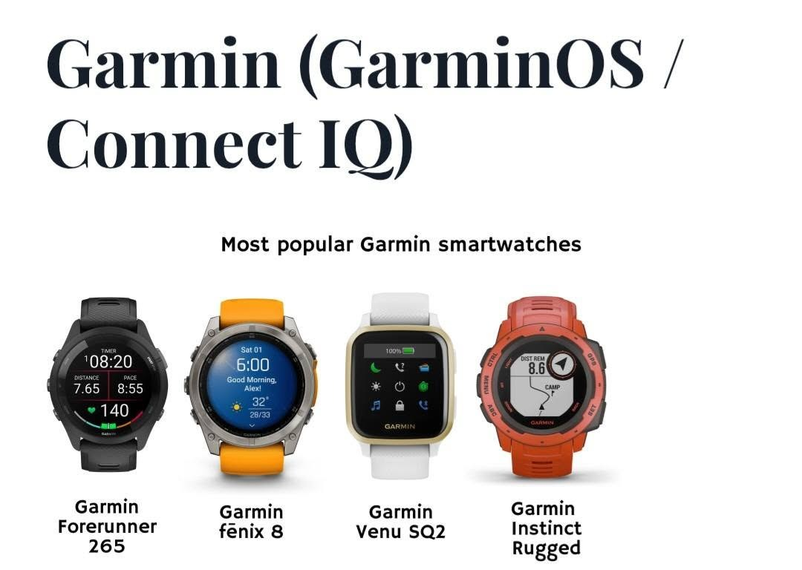

Non è possibile fornire una lista precisa dei modelli compatibili: Garmin è molto versatile, ma il supporto da parte degli sviluppatori volontari è limitato e le soluzioni ufficiali sono poche. In base al sensore utilizzato, all'app che legge il sensore e all'eventuale microinfusore possiamo indicarti le soluzioni disponibili e aiutarti a verificare quali modelli sono supportati: inizia dalla [guida Garmin](../documentation/garmin/come-leggere-la-glicemia-con-i-dispositivi-garmin-1), dove trovi le app consigliate per ogni sorgente dati (xDrip, Nightscout, Dexcom Share, LLink e altre) e tutti i passaggi di installazione e configurazione.

## 4. Apple Watch

Funziona **solo con iPhone**.

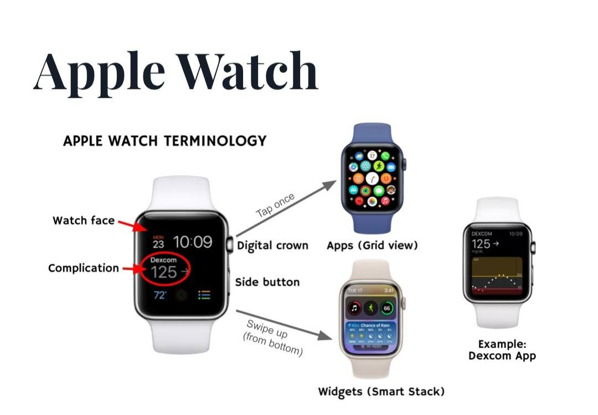

Alcuni sensori hanno soluzioni ufficiali e molti utenti sono soddisfatti:

- **Dexcom G7** con **Direct to Watch**: il sensore trasmette direttamente all'orologio (serve Apple Watch serie 6 o successiva, SE 2ª generazione o successiva, oppure Ultra, con watchOS 10 o superiore)
- **MiniMed Mobile** (Medtronic) con complicazione dedicata sul quadrante
- **Simplera** (Medtronic) con visualizzazione della glicemia e degli avvisi su Apple Watch
- altri sistemi simili

### Esempi di quadranti con le app ufficiali

**Dexcom G7**: la glicemia come complicazione sul quadrante **Modulare** e su un quadrante analogico, e l'app sull'orologio con valore e grafico:

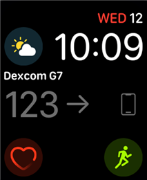 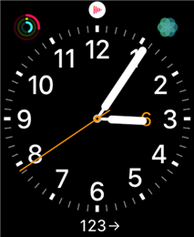 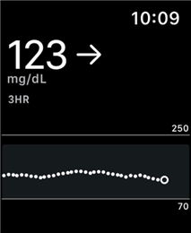

**MiniMed Mobile**: grafico e tempo in range direttamente al polso:

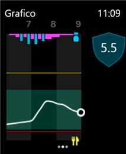 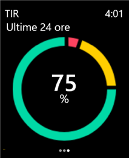

**Simplera**: gli avvisi di glicemia bassa o alta arrivano anche sull'orologio:

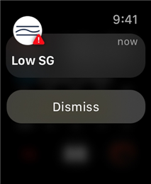

In diversi casi servono app di terze parti per mostrare il valore sul quadrante: vedi ad esempio [xDrip4iOS con sensori Dex](../documentation/xdrip4ios/letture-dexcom) e [Visualizzare Nightscout su Apple Watch](../documentation/apple-watch/come-visualizzare-la-pagina-nightscout-su-apple-watch).

> ℹ️ **Nota**: su Apple Watch alcune soluzioni richiedono un abbonamento. Non sponsorizziamo questi servizi, ma talvolta sono le uniche opzioni funzionanti.

## 5. Sensori FSL e smartwatch con Android

Non esistono orologi che ricevono la glicemia direttamente dal sensore FSL: servono applicazioni di terze parti, non ufficiali, che si **aggiungono** a quelle che già usi per la lettura della glicemia e la condivisione a distanza (non le sostituiscono).

Prima di acquistare l'orologio devi provare sul telefono una o entrambe queste soluzioni:

1. **xDrip impostato come web follower**, seguendo la guida [xDrip follower FSL 2 e 3](../documentation/xdrip/xdrip-follower-fsl). Sul telefono che vuoi collegare all'orologio installa xDrip e imposta come fonte dati **Web Follower**. Come dati di accesso usa quelli dell'account follower LLink; solo se non funziona prova con quelli dell'app principale collegata al sensore. Se non hai un account follower, nella guida trovi il riferimento alla documentazione ufficiale per crearne uno.
2. **GlucoDataHandler**, seguendo la [guida dedicata](../documentation/glucodatahandler/glucodatahandler): prende i dati dallo stesso account follower LLink.

Segui la guida passo passo e facci sapere se hai difficoltà o dubbi. Quando vedi i valori sul telefono, puoi passare alla scelta dell'orologio:

- **Amazfit con Zepp OS**: la lista sempre aggiornata dei modelli è su [`https://watchdrip.org`](https://watchdrip.org), la guida per impostarli è [sul nostro sito](../documentation/amazfit/smartwatch-amazfit-zepp-os).
- **Orologi marchiati Wear OS**, non necessariamente Samsung: vedi la [guida Wear OS](../documentation/wearos/glicemia-su-smartwatch-wear-os) e [questo post nel gruppo](https://www.facebook.com/groups/nightscout/posts/1378344615920724/).
- **Hai già un orologio Garmin?** La scelta consigliata è **CGM Connect**, che legge i dati dal follower LLink: app, alternative e configurazione sono nella [guida Garmin](../documentation/garmin/come-leggere-la-glicemia-con-i-dispositivi-garmin-1).

## 6. Sensori FSL e smartwatch con iPhone

Con un sensore FSL 2, 2+ o 3 e un iPhone si possono utilizzare due tipi di smartwatch: **Apple Watch** e **Garmin**.

### Apple Watch

- La modalità più semplice è **GlucoWatch**: [`https://glucowatch.labaste.fr/index_it.html`](https://glucowatch.labaste.fr/index_it.html), disponibile sull'[App Store](https://apps.apple.com/it/app/glucowatch/id1609222678).
- Molto simile è **FLwatch** ([`https://flwatch.app/it/`](https://flwatch.app/it/)), per cui però non abbiamo molti riscontri.
- Puoi usare **xDrip4iOS** (sull'App Store si chiama Zukka): vedi [Installare xDrip4iOS](../documentation/xdrip4ios/installare-xdrip4ios).
- In alternativa **Gluroo** ([guida](../documentation/gluroo/gluroo)) può prelevare i valori dal follower LLink e renderli disponibili, tramite l'indirizzo Nightscout fornito da Gluroo, a xDrip4iOS oppure a **Nightguard** ([`https://github.com/nightscout/nightguard`](https://github.com/nightscout/nightguard)) sull'Apple Watch.
- Oppure puoi mostrare il valore con una complicazione sui quadranti modulari: [`https://gluroo.com/support/apple_watch_any_watchface/`](https://gluroo.com/support/apple_watch_any_watchface/).

Ecco alcuni esempi di come queste app mostrano la glicemia su Apple Watch.

**GlucoWatch** — complicazioni su un quadrante analogico e app sull'orologio:

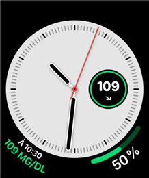 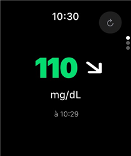

**FLwatch** — complicazioni su quadrante analogico e modulare:

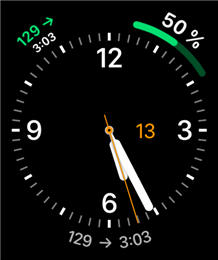 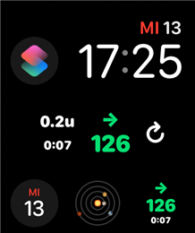

**xDrip4iOS** — app sull'orologio con valore, variazione e grafico:

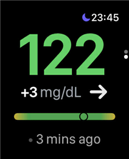 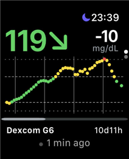

**Gluroo** — valore sul quadrante tramite la complicazione con la foto del contatto:

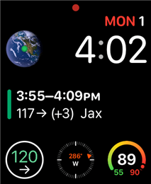 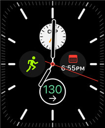

**Nightguard** — complicazione sul quadrante Infograph e app con grafico Nightscout:

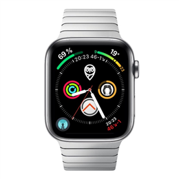 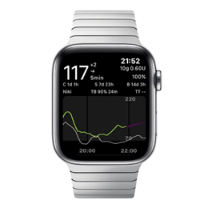

### Garmin con iPhone

Anche con iPhone la scelta consigliata è **CGM Connect**, che legge i dati dal follower LLink; in alternativa, con Gluroo attivo, puoi usare i quadranti Nightscout di Connect IQ. Trovi app e configurazione nella [guida Garmin](../documentation/garmin/come-leggere-la-glicemia-con-i-dispositivi-garmin-1).

## 7. Riepilogo

| Categoria | Telefono | Supporto glicemia sul quadrante | Modelli consolidati / note | Pro e contro |
|---|---|---|---|---|
| Amazfit (Zepp OS) | Solo Android | Buono, dipende dal modello e dalla community | Lista su [`https://watchdrip.org`](https://watchdrip.org) | **Pro**: economici, buona autonomia **Contro**: supporto variabile da modello a modello |
| Wear OS | Solo Android | Ottimo, molto supporto | Samsung Galaxy Watch 4 e successivi, Google Pixel, OnePlus, Mobvoi | **Pro**: ampia compatibilità, quadranti stabili **Contro**: verificare che sia davvero Wear OS |
| Garmin | Android e iPhone | Limitato e non uniforme | Dipende da sensore, app e microinfusore | **Pro**: autonomia eccellente, ideali per lo sport **Contro**: supporto non standard, verifiche caso per caso |
| Apple Watch | Solo iPhone | Ottimo con soluzioni ufficiali e di terze parti | Serie 6 o successive, SE e Ultra | **Pro**: soluzioni ufficiali per Dexcom, MiniMed e Simplera **Contro**: alcune soluzioni richiedono un abbonamento |
