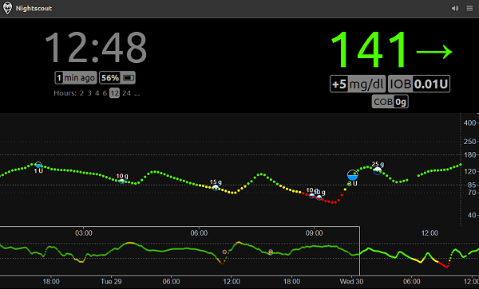
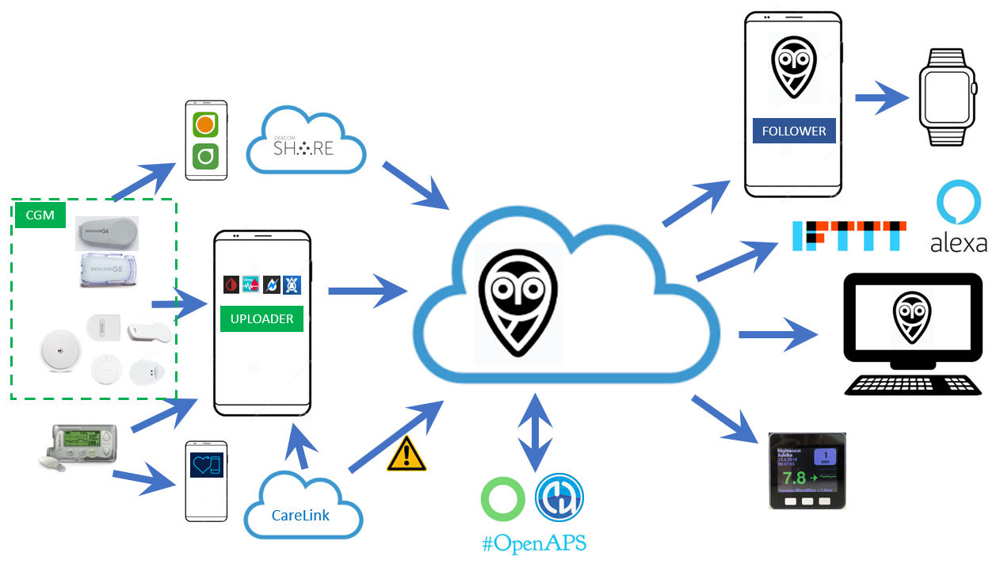

# Nightscout — introduzione generale

**Nightscout** è un'applicazione nel cloud, [open source](https://github.com/nightscout/cgm-remote-monitor), che permette di collegare diversi sistemi tra di loro e offre una soluzione universale per la condivisione e la visualizzazione della glicemia a distanza.

> ⚠️ **Attenzione**: l'utilizzo è a esclusiva responsabilità personale.

Nightscout è nato come soluzione fai-da-te e gratuita. Se non riesci a crearla da solo, esistono anche servizi gestiti a pagamento, come **NS10BE** (Martin Schiftan) e **Nightscout.pro** (Andy Low).

Puoi anche creare il tuo Nightscout su diverse piattaforme cloud (MongoDB Atlas per il database, con Heroku, Azure, Railway, Northflank, Fly.io, Render, ecc.) oppure su un server fisico o virtuale (Oracle, Google, Ionos, DigitalOcean, ecc.).

## Heroku

Heroku era la soluzione più utilizzata, finché non è stato rimosso l'account gratuito: ora è disponibile solo a pagamento, circa 5$ al mese. Vedi la guida: [Nightscout – Aggiornamento con Heroku](../documentation/nightscout/heroku-aggiornare-nightscout).

> ℹ️ **Nota**: valuta un sito gestito invece di pagare per il fai-da-te.

## Railway

Railway era semplice da usare ed era gratuito; ormai è disponibile solo a pagamento, circa 5$ al mese.

> ℹ️ **Nota**: valuta un sito gestito invece di pagare per il fai-da-te.

## Google Cloud

Il team xDrip mantiene questa soluzione, creata da "Jon" (@jamorham). Non è semplicissima da configurare, ma nemmeno impossibile seguendo la guida passo passo. Costa da 1 a 3 centesimi al mese, ed è l'implementazione fai-da-te di Nightscout più affidabile al momento. Vedi la guida: [Nightscout su Google Cloud](../documentation/nightscout/nightscoutgooglecloud).

## Azure

Azure era una soluzione originale, abbandonata per motivi di costo, ma oggi è possibile usarla gratuitamente. Vedi la guida: [Nightscout su Azure + Atlas](../documentation/nightscout/nightscoutazureatlas).

## NS10BE

Se ti serve un Nightscout funzionante senza doverci pensare, e puoi permetterti circa 5€ al mese, considera [`https://ns.10be.de/en/index.html`](https://ns.10be.de/en/index.html). Vedi la guida: [Nightscout su Zehn.be – Abbonamento gestito](../documentation/nightscout/nightscoutzehnbe).

## Nightscout.pro

Una soluzione completamente gestita, tutto incluso a 4€ al mese: [`https://nightscout.pro/`](https://nightscout.pro/). Vedi la guida: [Nightscout Pro – Abbonamento gestito](../documentation/nightscout/nightscoutpro).
