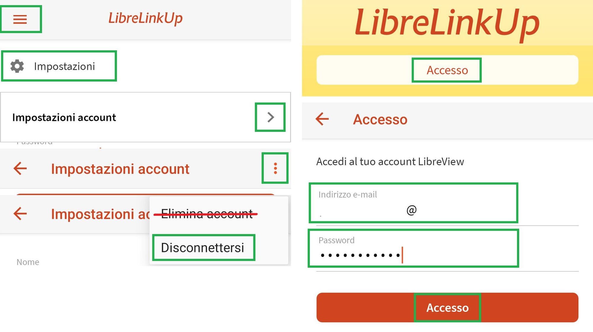

# Problemi con il follower LLink?

Il telefono follower non riceve più la glicemia con LLink? Prima di reinstallare tutto, prova questa semplice procedura: nella maggior parte dei casi basta disconnettersi e riaccedere.

## 1. Prima di iniziare

- Assicurati di conoscere l'e-mail e la password dell'**account follower** usato nell'app LLink.
- In alternativa, tieni sotto mano il telefono **master**: potrai sempre rimandare un invito di condivisione.

## 2. Disconnettiti e riaccedi

1. Apri l'app follower LLink.
2. Tocca il menu **☰** in alto a sinistra e vai in **Impostazioni**.
3. Tocca **Impostazioni account**.
4. Tocca i tre puntini **⋮** in alto a destra e scegli **Disconnettersi** (attenzione: **non** toccare **Elimina account**!).
5. Esci completamente dall'app e riaprila.
6. Tocca **Accesso** e rientra con lo stesso account follower di prima (e-mail e password).

> ℹ️ **Nota**: se al nuovo accesso ti viene chiesto di accettare delle nuove condizioni d'uso, è probabilmente proprio questa la ragione per la quale l'app non riceveva più i dati.

## 3. Se non basta

Se dopo la riconnessione i dati continuano a non arrivare, probabilmente serve reinstallare tutto: sia l'app sul telefono master (LLink o l'app del sensore FSL3) sia l'app follower.

In questo caso conviene farsi seguire dal call center del produttore durante la manovra: così, se il sensore non comunica più dopo la reinstallazione, ci pensano loro 😉.
