Una soluzione fai da te per condividere la glicemia con altri telefoni e visualizzare la glicemia su Apple Watch con il calendario o una complicazione.

# Condividere le letture di Dex con [xDrip4iOS](https://www.facebook.com/groups/853994615056838/)

Dex One, per la mancanza del sistema di condivisione Dex Share a cui siamo abituati dai suoi predecessori Dex G5/6, ha bisogno di una soluzione fai da te per condividere la glicemia con altri telefoni e visualizzare la glicemia su Apple Watch con il calendario o una complicazione.

Questa guida passo passo spiega come impostare l’app xDrip4iOS, per poter condividere la glicemia.

Il sensore deve essere stato avviato con l’app Dexcom. Assicurarsi che funzioni correttamente prima di andare avanti.

- [Installare xDrip4iOS](#installare-xdrip4ios)
- [Disabilitare l'app Dex solo per Dex G6 / Dex One](#disabilitare-lapp-dexcom-solo-per-dexcom-g6-dexcom-one)
- [Abbinare il trasmettitore con xDrip4iOS](#abbinare-il-trasmettitore)
- [Opzione "Segui l'app Dexcom" / Read from Dex app](#opzione-segui-lapp-dexcom-read-from-dexcom-app)

# Installare xDrip4iOS

# Disabilitare l'app Dex solo per Dex G6 / Dex One

Per Dex G7 / Dex One + (plus) vedi in seguito

Per evitare problemi con l'app master Dex G6/ONE che "ruba" la connessione Bluetooth da xDrip4iOS, dobbiamo assicurarci che abbia le autorizzazioni Bluetooth disabilitate.

Vai alle Impostazioni del tuo iPhone e scorri verso il basso e cerca l’elenco delle applicazioni. Seleziona l'app Dex e, nelle opzioni, disattiva il Bluetooth. Potrai riattivarlo in seguito, se lo desideri.

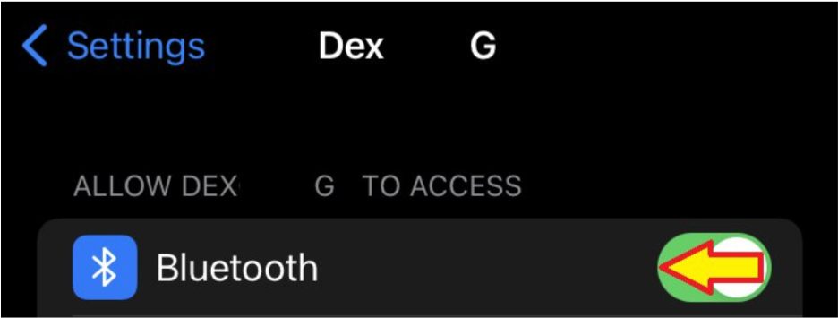

# Abbinare il trasmettitore con xDrip4iOS

Accedere alla scheda Bluetooth dell’app xDrip4iOS e fare clic sul pulsante + per aggiungere un nuovo tipo di dispositivo.

Seleziona CGM e poi scegli il tuo sistema Dex (G5/G6/One) dall'elenco.

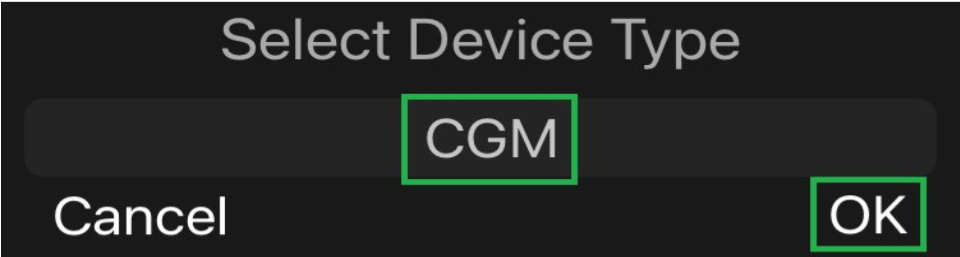

Ti verrà richiesto di inserire l'ID del trasmettitore (ad esempio: 80H9W4), inserisci il tuo.

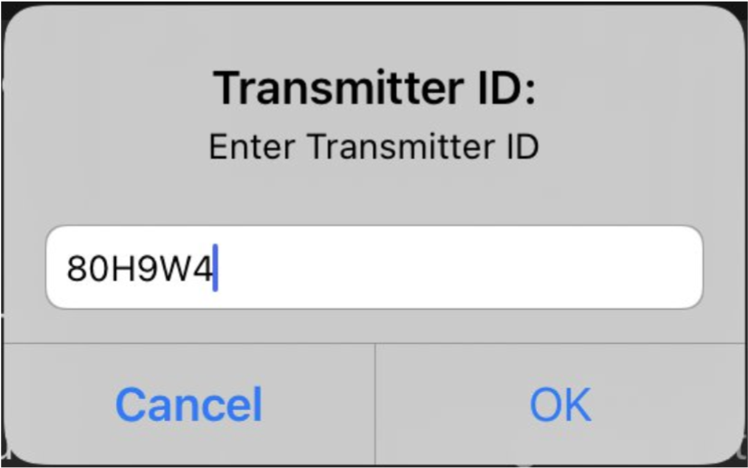

Una volta inserito l'ID del trasmettitore, verrà visualizzato un messaggio che ti chiede di mantenere aperto xDrip4iOS mentre viene trovato il trasmettitore e viene stabilita una connessione Bluetooth. Lascia il tuo iPhone sul tavolo e prendi un caffè. NON giocare a Roblox, guardare Netflix o ascoltare Spotify. Metti giù il telefono senza toccarlo e restagli vicino.

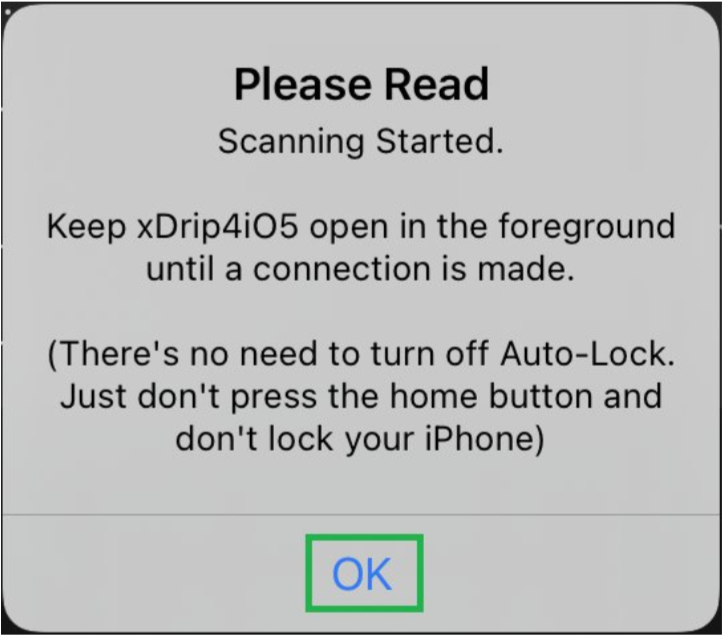

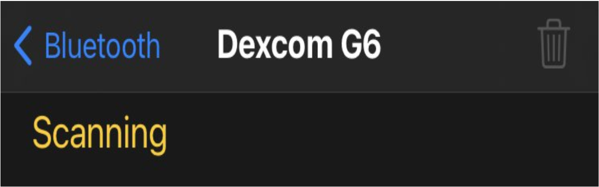

Quando xDrip4iOS trova il tuo trasmettitore, riceverai un messaggio che dice che è stato collegato correttamente. Fare clic su OK.

Una volta connesso, vedrai sempre il suo stato come Scansione poiché comunica solo per un breve periodo di tempo ogni 5 minuti.

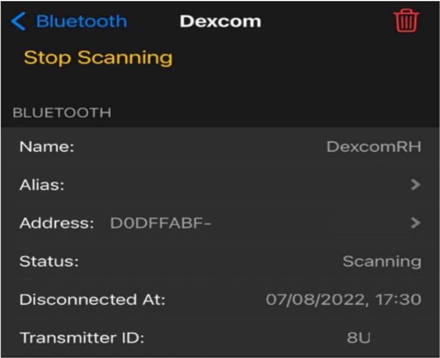
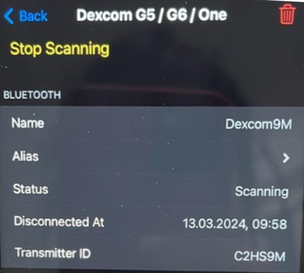

Se utilizzi un sensore Dex G6 o ONE, ti verrà richiesto di inserire il codice di calibrazione riportato sulla scatola del sensore una volta completato il riscaldamento.

# Opzione "Segui l'app Dexcom" / Read from Dex app

Una volta accoppiato il trasmettitore, puoi abilitare Follow Dex app/ Read from Dex app e riattivare il Bluetooth nell'app Dex sul tuo telefono. Sia xDrip4iOS che l'app Dex saranno collegati al sensore. Ciò ti consente di utilizzare il meglio di entrambi i mondi (caricamenti Clarity e funzionalità uniche di xDrip4iOS). In questo caso, xDrip4iOS spierà semplicemente le comunicazioni tra il trasmettitore e l'app Dexcom.

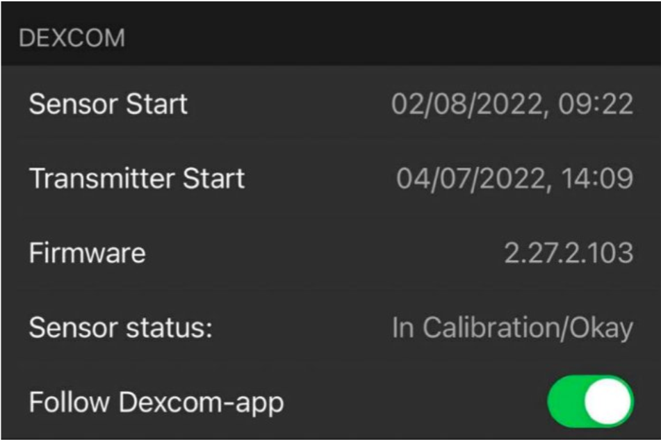

Nota: se non hai l'app Dex ufficiale installata sul tuo iPhone e collegata al trasmettitore, non abilitare questa opzione altrimenti non riceverai alcuna lettura.

È possibile che i valori non siano subito presenti nella schermata principale ma solo il grafico e in basso viene riconosciuto il sensore e presente anche TIR.

Funziona, recupererà anche il numero.

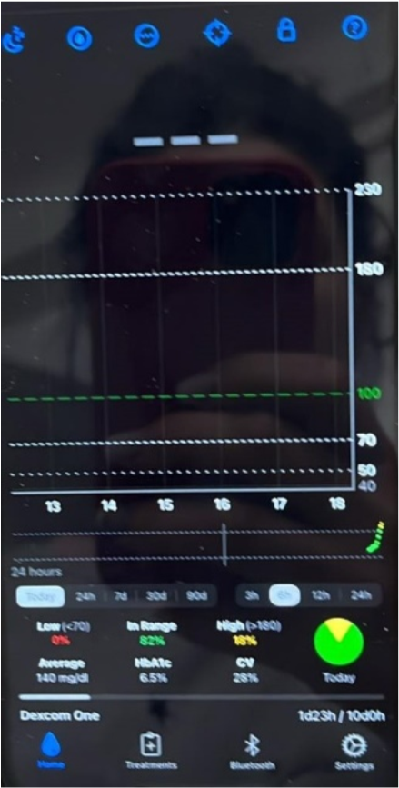

Se non hai ancora sul telefono la schermata precedente o i valori, dopo aver seguito tutti i passaggi correttamente, puoi disinstallare l’app Dex senza fermare il sensore e riprendere la procedura per xDrip4iOS. Appena xDrip4iOS sarà funzionale puoi reinstallare l’app Dex e abilitare Follow Dex app/ Read from Dex app in xDrip4iOS.

Dex G6 ha il suo sistema di condivisione tramite Dex share server che manda i dati dall'app Dex G6 (collegata al sensore) all'app Dex Follow usata dai genitori/caregiver per seguire a distanza.

Questo è un sistema molto valido rispetto ad altri sensori finché funziona; i problemi sorgono quando, raramente è vero, il sistema è fermo per vari motivi (manutenzione programmata, guasti, ecc.).

In questo modo hai sempre attivi due sistemi di condivisione, con la condizione che l'app Dex funzioni.

Se l'app Dex non funziona, ricordiamo che xDrip4iOS può essere collegato direttamente al sensore; è consigliato solo in casi particolari, altrimenti l'app Dex ufficiale è la soluzione più semplice e stabile.

# Abbinare il trasmettitore per Dex G7 / ONE+

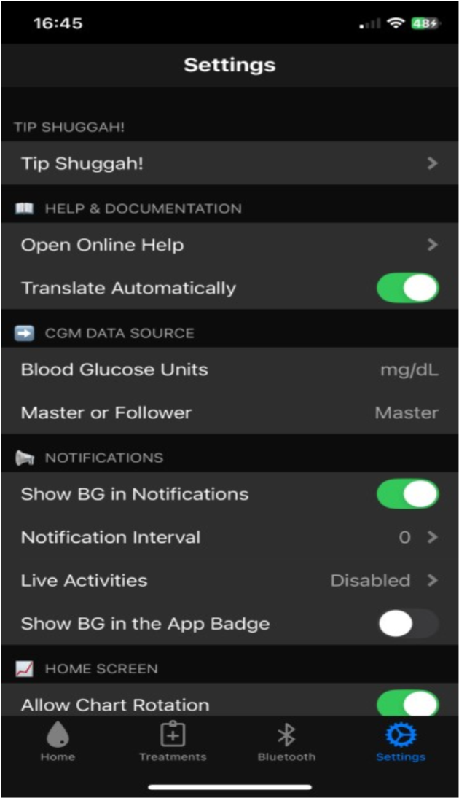

Accedere alla scheda Bluetooth dell’app xDrip4iOS e fare clic sul pulsante + per aggiungere un nuovo tipo di dispositivo.

Seleziona CGM e poi scegli G7 / ONE+ / Stelo.
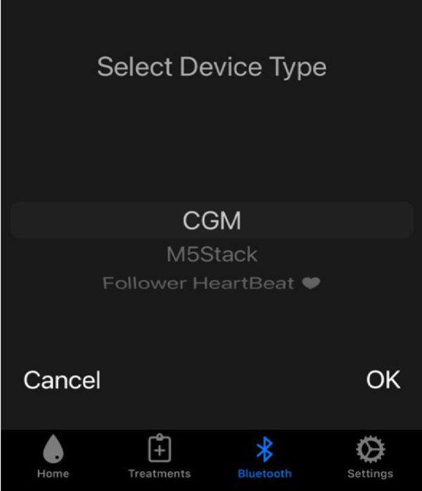
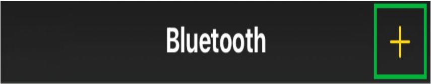
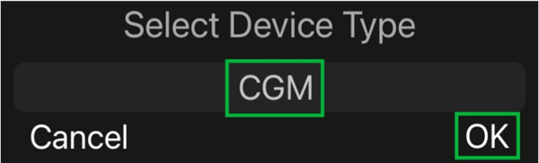
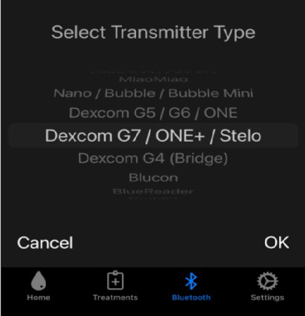

Scegliere ‘Scanning’ e selezionare OK al messaggio successivo.
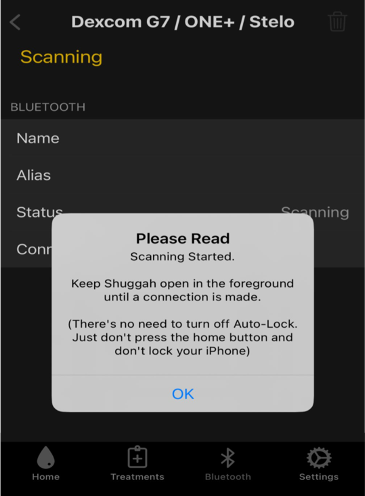

Se possibile, non uscire dalla schermata. Aspetta…

Una volta collegato, darà una schermata così.

Il codice del sensore è presente nei dispositivi BT

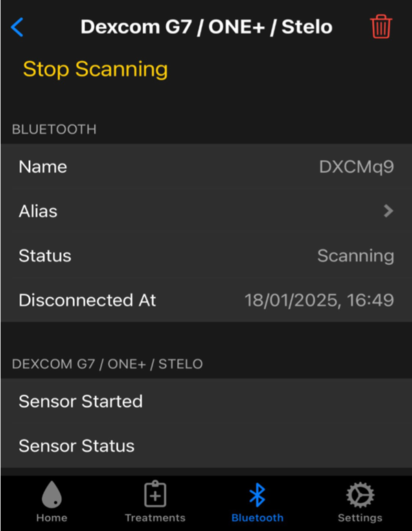
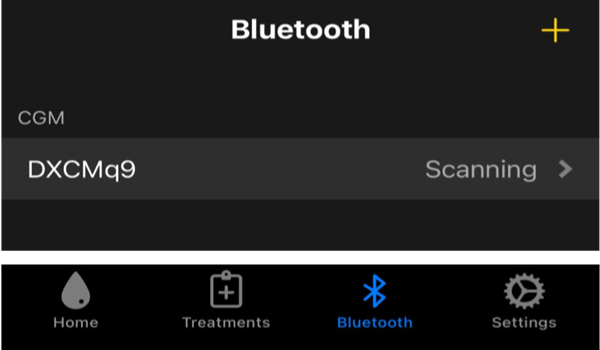

Torna alla schermata principale dell’app.

Dovrebbe essere presente la glicemia e un solo valore sul grafico.

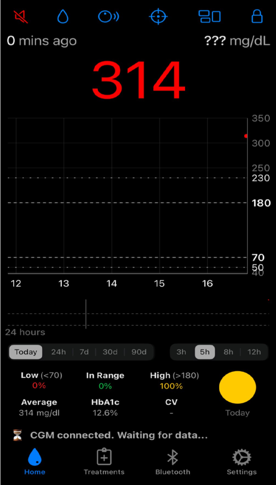

Per condividere la glicemia con altri telefoni e utilizzare smartwatch diversi da Apple Watch (Fitbit, Garmin, Samsung Gear) serve Nightscout [https://www.glicemiadistanza.it/nightscout/](https://www.glicemiadistanza.it/nightscout/) o Gluroo [https://www.glicemiadistanza.it/gluroo/](https://www.glicemiadistanza.it/gluroo/)

La documentazione originale (link con traduttore automatico): [https://xdrip4ios-readthedocs-io.translate.goog/en/latest/connect/cgm/?_x_tr_sl=auto&_x_tr_tl=it](https://xdrip4ios-readthedocs-io.translate.goog/en/latest/connect/cgm/?_x_tr_sl=auto&_x_tr_tl=it)

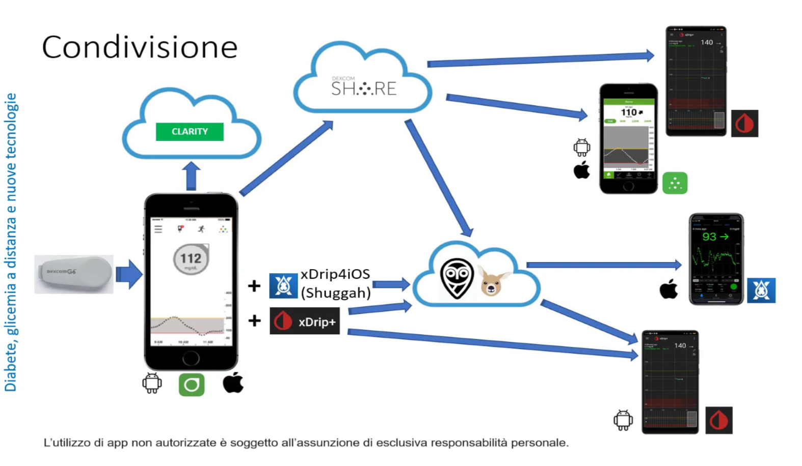

**L'utilizzo è soggetto all'assunzione di esclusiva responsabilità personale.**

Contatti [Diabete, glicemia a distanza e nuove tecnologie](https://www.facebook.com/groups/nightscout)
