# Glicemia su Alexa con Dexcom G5 o xDrip+

Questa guida spiega come far leggere ad **Alexa** (lo speaker Amazon) il valore di glicemia in tempo reale, partendo dall'app **Dexcom G5 Mobile** o da **xDrip+**.

La comunicazione funziona tramite **Sugarmate**, che riceve i dati da Dexcom Share. Serve quindi un account Dexcom anche se usi xDrip+ con un sensore FSL.

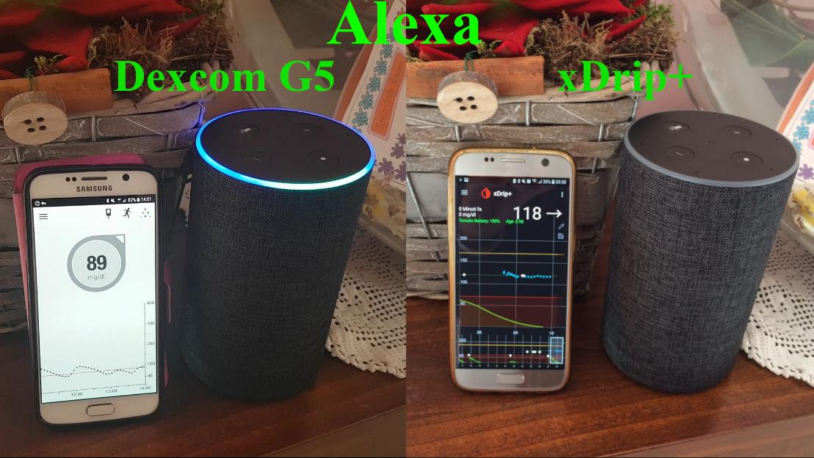

---

## 1. Crea un account Dexcom (solo se non ne hai uno)

Se usi xDrip+ e non hai un account Dexcom, creane uno su `http://www.dexcom.eu/`: seleziona **Italia**, poi **Crea Account**. Inserisci la tua email e segui le istruzioni.

Salva con cura username e password (rispettando maiuscole e caratteri speciali): ti serviranno in seguito.

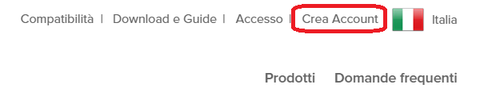

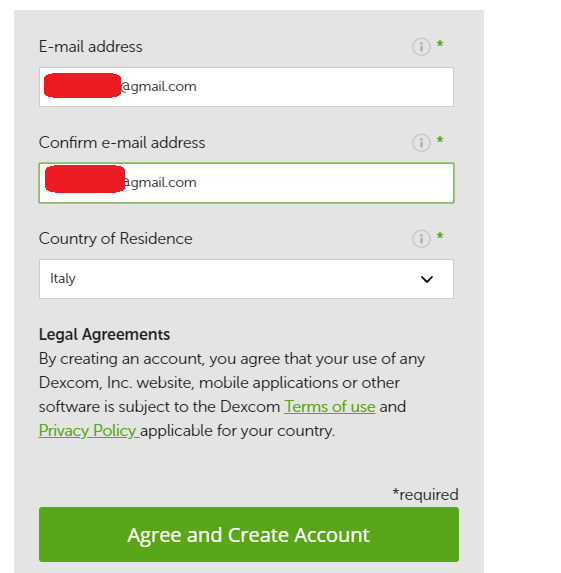

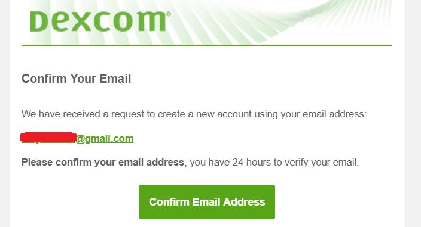

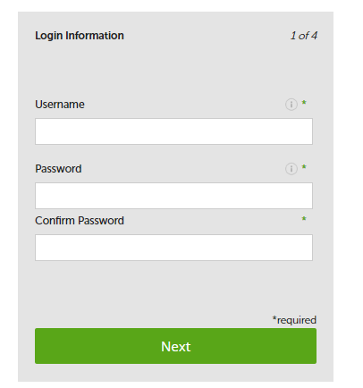

---

## 2. Abilita la condivisione dati Dexcom

Accedi al tuo account su `https://uam2.dexcom.com/`, clicca **Profile**, scorri fino a **Data Share** e accetta la condivisione.

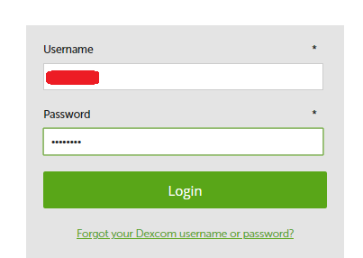

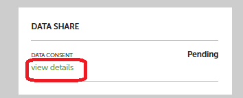

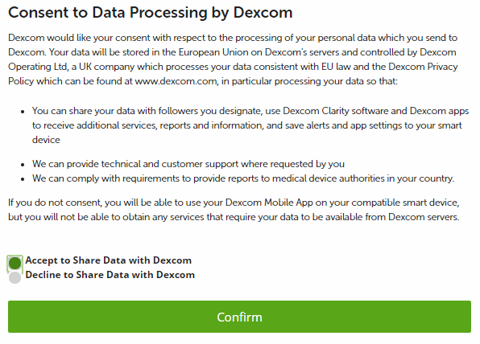

---

## 3. Configura xDrip+ per inviare a Dexcom Share

Se usi xDrip+, vai in **Impostazioni → Cloud Upload → Upload in Dexcom Share Server** e:
- Abilita la prima opzione (caricamento su Dexcom Share).
- **Disabilita** la seconda opzione.
- Inserisci il tuo **username** e **password** Dexcom.

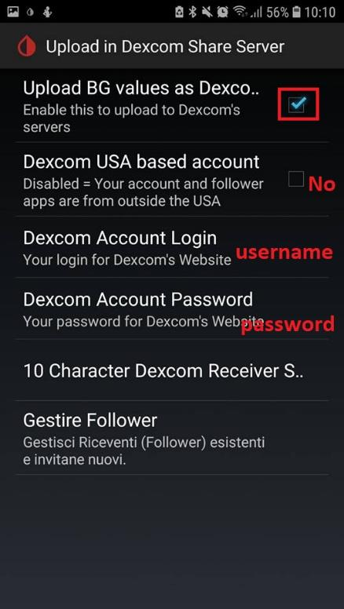

---

## 4. Crea un account Sugarmate

1. Vai su `https://sugarmate.io/` e clicca **Sign in** in alto a sinistra.
2. Clicca **Iscriviti**, accetta le condizioni e prosegui.
3. Verrà mostrato un indirizzo email generato da Sugarmate: **copialo**, ti servirà nel passo successivo.

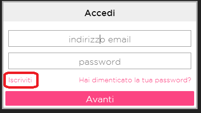

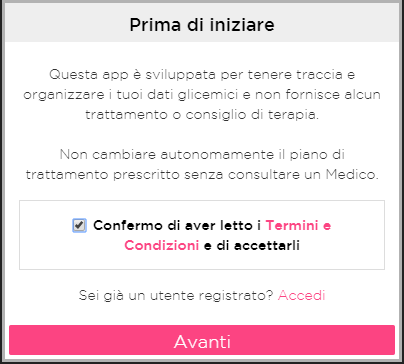

---

## 5. Aggiungi Sugarmate come follower Dexcom

**Se usi xDrip+:** vai in **Impostazioni → Cloud Upload → Dexcom Share Server → Gestire Follower**. Clicca **Invite a follower**, inserisci come nome `Sugarmate`, come tuo nome e l'email di Sugarmate copiata prima. Clicca **Send Invite**.

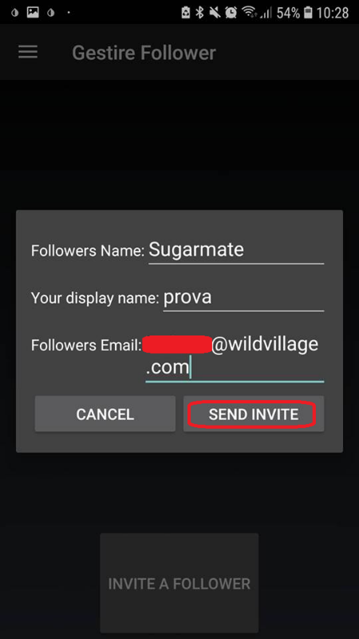

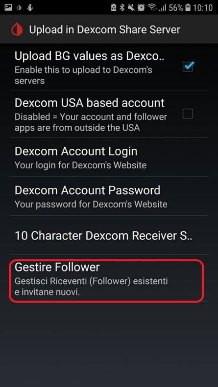

**Se usi Dexcom G5 Mobile:** apri l'app, clicca sul triangolo in alto a destra, poi sul pulsante di aggiunta follower. Inserisci l'email di Sugarmate e invia l'invito.

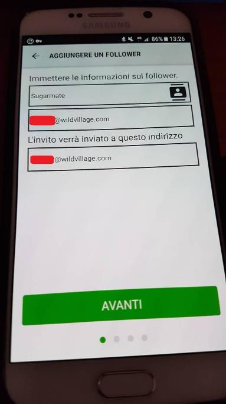

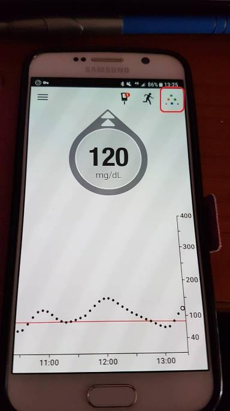

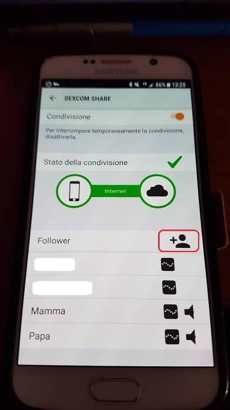

---

## 6. Completa la configurazione Sugarmate

Torna su Sugarmate e clicca **Fatto**. Inserisci la tua email e scegli una password per l'account Sugarmate, poi clicca **Avanti**. Dopo qualche minuto inizieranno ad arrivare i dati di glicemia.

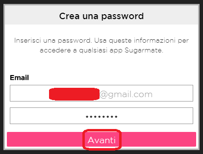

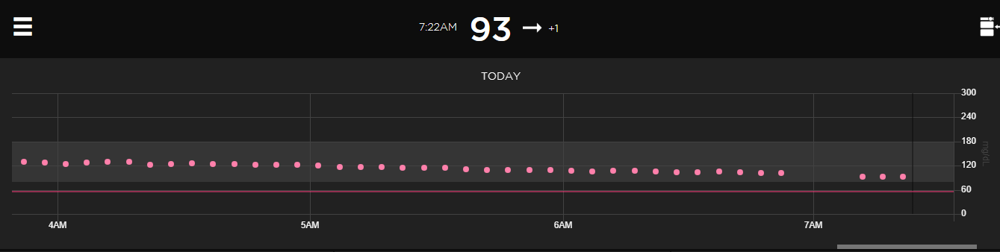

---

## 7. Attiva la skill Sugarmate su Alexa

Apri l'app **Amazon Alexa**, cerca la skill **Sugarmate**, seleziona **Attiva** e inserisci email e password del tuo account Sugarmate.

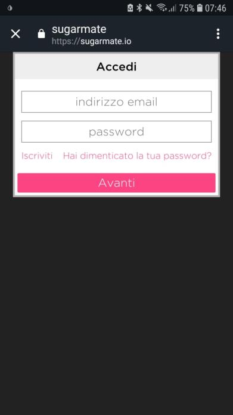

---

## Usare Alexa

Puoi chiedere:

- *"Alexa, chiedi a Sugarmate quanto è l'ultimo valore"*
- *"Alexa, chiedi a Sugarmate quanto ho di glicemia"*
