# Glicemia su Alexa con Dexcom o xDrip

Questa guida spiega come far leggere ad **Alexa** (lo speaker Amazon) il valore di glicemia in tempo reale, partendo dall'app **Dexcom** o da **xDrip**.

La comunicazione funziona tramite **Sugarmate**, che riceve i dati da Dexcom Share. Serve quindi un account Dexcom, anche se usi xDrip con un sensore FSL.

> ⚠️ **Attenzione**: Dexcom Share funziona solo con un account che sia già stato usato con un vero trasmettitore/sensore Dexcom. Se non hai già un account Dexcom funzionante in questo senso, **non creartene uno apposta**: non funzionerà. Questa guida non fa al caso tuo se non hai mai usato un sensore Dexcom.

Il risultato finale: Alexa che legge la glicemia sia da Dexcom sia da xDrip, mostrata a confronto sui rispettivi telefoni:

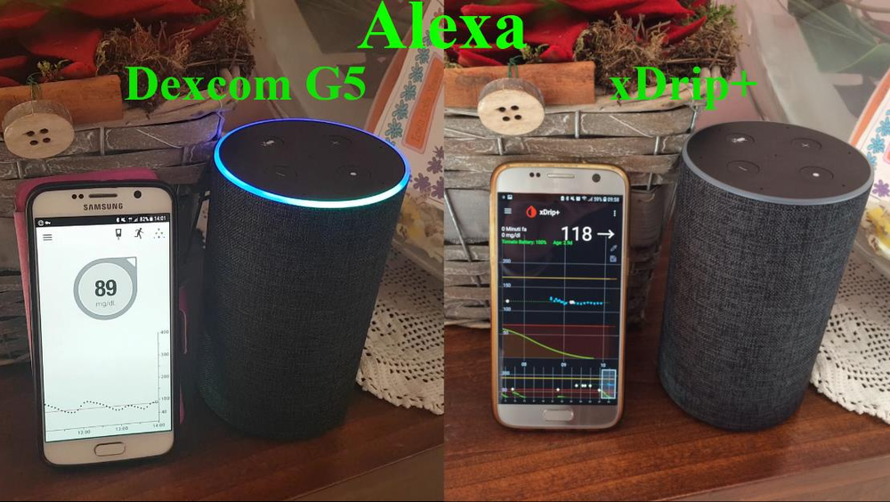

---

## 1. Abilita la condivisione dati Dexcom

Accedi al tuo account su [`https://uam2.dexcom.com/`](https://uam2.dexcom.com/):

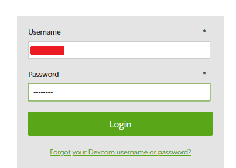

Clicca **Profile** nel menu in alto:

Nella sezione **Data Share**, clicca **view details**:

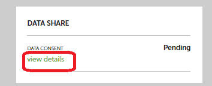

Seleziona **Accept to Share Data with Dexcom** e clicca **Confirm**:

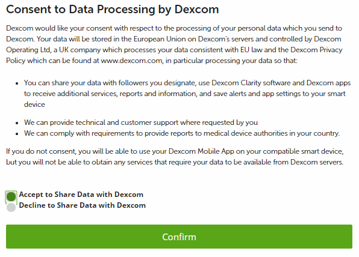

---

## 2. Configura xDrip per inviare a Dexcom Share

Se usi xDrip, vai in **Impostazioni → Cloud Upload → Upload in Dexcom Share Server** e:
- Abilita la prima opzione (caricamento su Dexcom Share).
- **Disabilita** la seconda opzione.
- Inserisci il tuo **username** e **password** Dexcom.

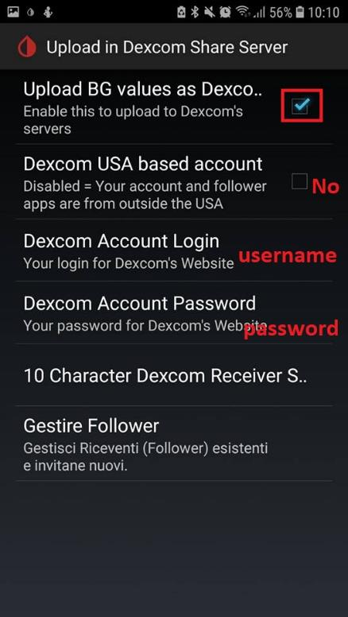

---

## 3. Crea un account Sugarmate

1. Vai su [`https://sugarmate.io/`](https://sugarmate.io/) e clicca **Sign in** in alto a sinistra.
2. Clicca **Iscriviti**, accetta le condizioni e prosegui.
3. Verrà mostrato un indirizzo email generato da Sugarmate: **copialo**, ti servirà nel passo successivo.

Clicca **sign in** in alto a sinistra della pagina:

Nel modulo **Accedi**, clicca **Iscriviti** per creare un nuovo account:

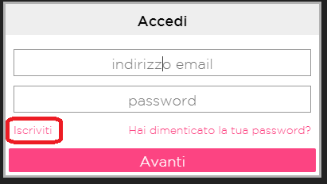

Spunta la conferma di aver letto i **Termini e Condizioni** e clicca **Avanti**:

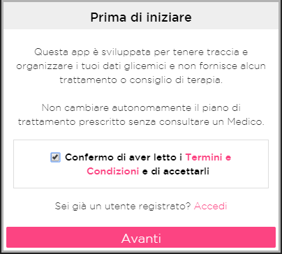

Sugarmate genera un indirizzo email da usare come follower: copialo e clicca **Fatto!**:

---

## 4. Aggiungi Sugarmate come follower Dexcom

**Se usi xDrip:** vai in **Impostazioni → Cloud Upload → Dexcom Share Server → Gestire Follower**. Clicca **Invite a follower**, inserisci come nome `Sugarmate`, come tuo nome e l'email di Sugarmate copiata prima. Clicca **Send Invite**.

Nelle impostazioni di **Upload in Dexcom Share Server**, tocca **Gestire Follower**:

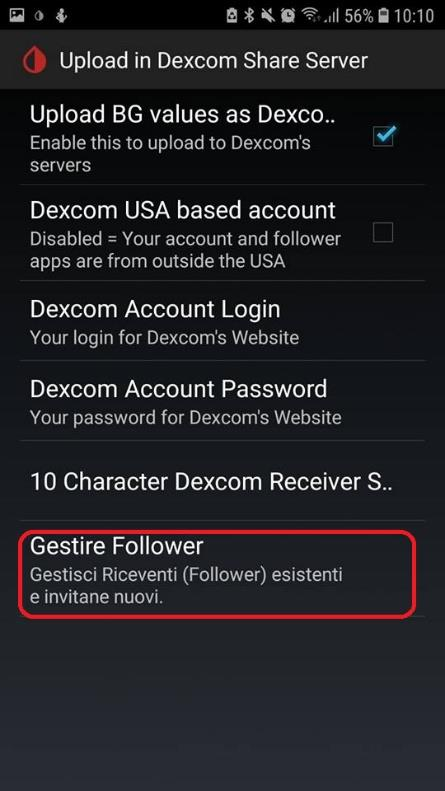

Tocca **INVITE A FOLLOWER**:

Compila **Followers Name** (`Sugarmate`), **Your display name** e **Followers Email** (l'indirizzo copiato da Sugarmate), poi tocca **SEND INVITE**:

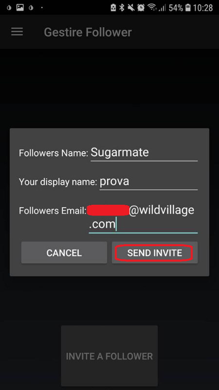

**Se usi l'app Dexcom ufficiale (G6, G7):** apri l'app, clicca sull'icona in alto a destra, poi sul pulsante di aggiunta follower. Inserisci l'email di Sugarmate e invia l'invito.

Nella schermata principale dell'app Dexcom, tocca l'icona in alto a destra:

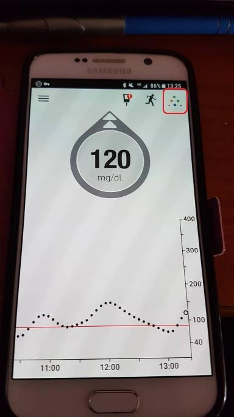

Nella schermata **Dexcom Share**, tocca l'icona **+ Follower**:

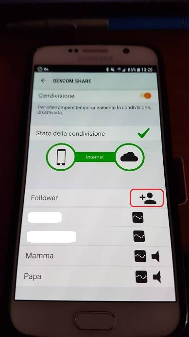

Inserisci l'indirizzo email di Sugarmate nel modulo **Aggiungere un follower** e tocca **AVANTI**:

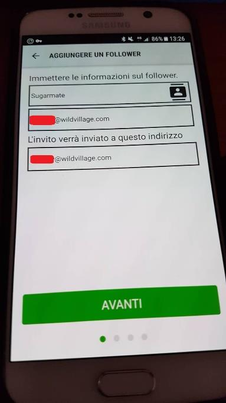

---

## 5. Completa la configurazione Sugarmate

Torna su Sugarmate e clicca **Fatto**. Inserisci la tua email e scegli una password per l'account Sugarmate, poi clicca **Avanti**. Dopo qualche minuto inizieranno ad arrivare i dati di glicemia.

Torna sulla pagina di Sugarmate con l'indirizzo email generato e clicca di nuovo **Fatto!**:

Nella schermata **Crea una password**, inserisci la tua email e una password per l'account Sugarmate, poi clicca **Avanti**:

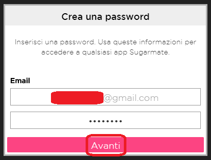

Dopo qualche minuto, il grafico di Sugarmate inizia a mostrare i valori di glicemia ricevuti da Dexcom Share:

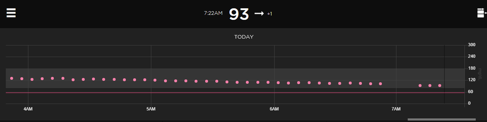

---

## 6. Attiva la skill Sugarmate su Alexa

Apri l'app **Amazon Alexa**, cerca la skill **Sugarmate**, seleziona **Attiva** e inserisci email e password del tuo account Sugarmate.

Nella scheda della skill, tocca **ABILITA ALL'USO**:

Inserisci l'email e la password del tuo account Sugarmate e tocca **Avanti**:

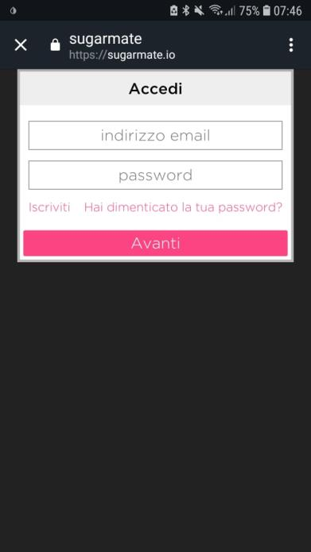

Compare la conferma che la skill è stata collegata con successo:

---

## Usare Alexa

Puoi chiedere:

- *"Alexa, chiedi a Sugarmate quanto è l'ultimo valore"*
- *"Alexa, chiedi a Sugarmate quanto ho di glicemia"*
