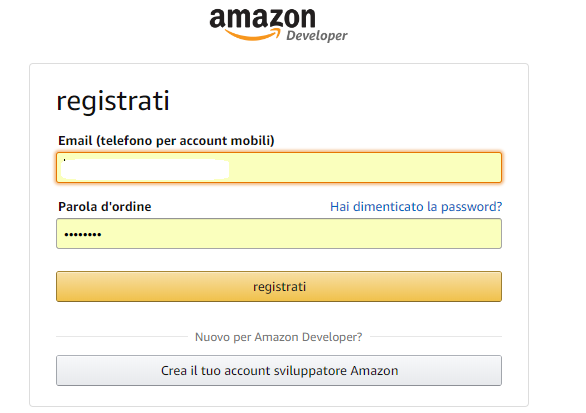
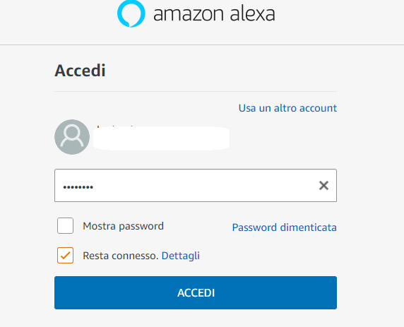
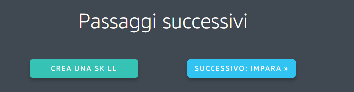
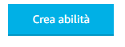
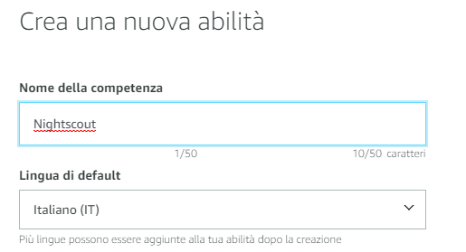
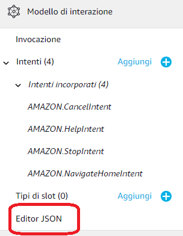
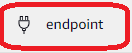
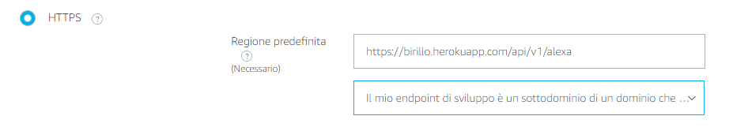
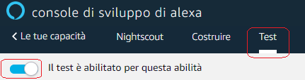
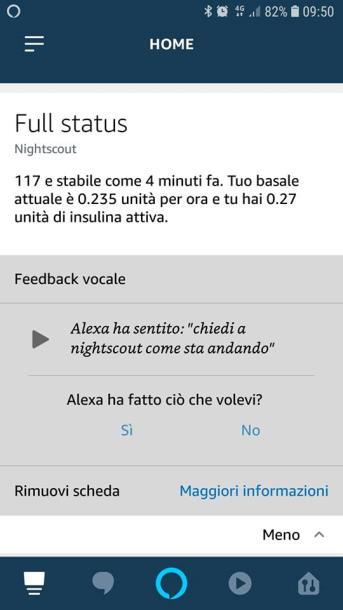

# Alexa e Nightscout in italiano

Questa guida spiega come far leggere ad **Alexa** (lo speaker Amazon) le glicemie di Nightscout in italiano.

Basata sulla documentazione ufficiale: [`https://github.com/nightscout/cgm-remote-monitor/blob/master/lib/plugins/alexa-plugin.md`](https://github.com/nightscout/cgm-remote-monitor/blob/master/lib/plugins/alexa-plugin.md)

**Requisiti:**
- Account Amazon
- Dispositivo Alexa registrato sull'account
- Sito Nightscout

---

## 1. Abilita il plugin Alexa su Nightscout

Aggiungi `alexa` alla variabile **ENABLE** del tuo Nightscout.

Segui le [istruzioni](https://nightscout-github-io.translate.goog/nightscout/setup_variables/?_x_tr_sl=auto&_x_tr_tl=it) se usi un sito fai-da-te, oppure contatta il tuo [fornitore](https://nightscout-github-io.translate.goog/?_x_tr_sl=auto&_x_tr_tl=it#nightscout-as-a-service) per un sito a pagamento.

---

## 2. Crea un account sviluppatore Amazon

Vai su [`https://developer.amazon.com/it/`](https://developer.amazon.com/it/) e registrati con i dati del tuo account Amazon. Accetta le condizioni di utilizzo.

Nel modulo **registrati** di Amazon Developer, inserisci email e password del tuo account Amazon:



---

## 3. Registra il tuo Alexa sull'account sviluppatore

Accedi ad Alexa con lo stesso account sviluppatore su [`https://alexa.amazon.it`](https://alexa.amazon.it).

Nella pagina **Accedi** di Amazon Alexa, inserisci la password del tuo account e tocca **ACCEDI**:



---

## 4. Crea una nuova Alexa Skill

1. Vai al portale sviluppatori Alexa: [`https://developer.amazon.com/it/alexa`](https://developer.amazon.com/it/alexa)
2. Seleziona **Alexa Skills Kit**.
3. Clicca **Crea una Skill** in fondo alla pagina, poi **Crea un'abilità** nella console.
4. Assegna il nome **Nightscout** e imposta la lingua su italiano. Clicca **Crea abilità**.

Nella pagina del portale sviluppatori, seleziona la scheda **Alexa Skills Kit**:


In fondo alla pagina, tra i **Passaggi successivi**, clicca **CREA UNA SKILL**:



Nella console, clicca il pulsante **Crea abilità**:



Nel modulo **Crea una nuova abilità**, assegna il nome `Nightscout` e imposta **Lingua di default** su **Italiano (IT)**:



---

## 5. Configura il modello di interazione

Nella nuova skill, clicca **Editor JSON**, cancella il contenuto esistente e incolla il seguente JSON:

Nel pannello **Modello di interazione**, clicca la voce **Editor JSON** in basso a sinistra:



```json
{
  "interactionModel": {
    "languageModel": {
      "invocationName": "nightscout",
      "intents": [
        {"name": "NSStatus", "slots": [], "samples": ["Come sta andando"]},
        {"name": "UploaderBattery", "slots": [], "samples": ["Quanta batteria ha ancora il mio dispositivo"]},
        {"name": "PumpBattery", "slots": [], "samples": ["Quanta batteria ha ancora il mio microinfusore"]},
        {"name": "LastLoop", "slots": [], "samples": ["Quando è stato ultimo loop"]},
        {"name": "MetricNow", "slots": [{"name": "metric", "type": "LIST_OF_METRICS"}], "samples": ["Quanto ha {metric}", "Quanto è {metric}", "Come è {metric}", "Quanto ha di {metric}"]},
        {"name": "InsulinRemaining", "slots": [{"name": "pwd", "type": "AMAZON.FirstName"}], "samples": ["Quanta insulina rimasta", "Quanta insulina ancora", "Quanta insulina {pwd} ha ancora"]}
      ],
      "types": [
        {"name": "LIST_OF_METRICS", "values": [
          {"name": {"value": "blood glucose", "synonyms": ["Valore", "Glicemia"]}},
          {"name": {"value": "bg", "synonyms": ["Glicemia"]}},
          {"name": {"value": "number", "synonyms": ["Numeri"]}},
          {"name": {"value": "iob"}},
          {"name": {"value": "insulin on board", "synonyms": ["Insulina attiva"]}},
          {"name": {"value": "current Basal", "synonyms": ["Basale attuale"]}},
          {"name": {"value": "basal", "synonyms": ["Basale"]}},
          {"name": {"value": "cob", "synonyms": ["Carboidrati"]}},
          {"name": {"value": "carbs on board", "synonyms": ["Carboidrati attivi"]}},
          {"name": {"value": "carbhoydrates on board", "synonyms": ["Cob"]}},
          {"name": {"value": "ar2 forecast", "synonyms": ["previsione ar2"]}},
          {"name": {"value": "forecast", "synonyms": ["Previsione", "Predizione", "Predizione loop"]}},
          {"name": {"value": "raw bg", "synonyms": ["dato grezzo"]}}
        ]}
      ]
    }
  }
}
```

Clicca **Salva modello**, poi **Costruisci modello** e attendi il completamento.

---

## 6. Collega la skill al tuo Nightscout

1. Nel menu a sinistra, clicca **Endpoint**.
2. Seleziona **HTTPS** e inserisci l'URL del tuo Nightscout in questo formato:
   [`https://nomesito.herokuapp.com/api/v1/alexa`](https://nomesito.herokuapp.com/api/v1/alexa)
3. Seleziona la seconda opzione nel menu a discesa sotto l'URL.
4. Clicca **Salva**.

Nel menu a sinistra della console, clicca la voce **Endpoint**:



Seleziona **HTTPS**, inserisci l'URL del tuo Nightscout nel campo **Regione predefinita** e scegli la seconda opzione nel menu a discesa sottostante:



---

## 7. Testa la skill

Vai alla pagina **Test** e abilita la skill. Ora puoi chiedere ad Alexa:

*"Alexa, chiedi a Nightscout come sta andando"*

Nella console di sviluppo, vai sulla scheda **Test** e attiva l'interruttore **Il test è abilitato per questa abilità**:



Nell'app Alexa, dopo aver posto la domanda, compare la card **Full status** con il valore di glicemia, il basale attuale e l'insulina attiva:



---

*Ringraziamento ad Alessandro Rapellino per la traduzione e l'integrazione in italiano.*
