# Leggere la glicemia di Nightscout con Siri

Questa guida spiega come configurare una **scorciatoia Siri** per richiamare il valore di glicemia attuale da Nightscout, sia sull'**iPhone** che sull'**Apple Watch** abbinato.

**Requisiti:** iPhone con iOS 12 o superiore.

---

## 1. Scarica la scorciatoia

Apri questo link dall'iPhone: `https://www.icloud.com/shortcuts/7b178e6b76374c37902740bcc950f866`

Premi **Ottieni comando rapido**.

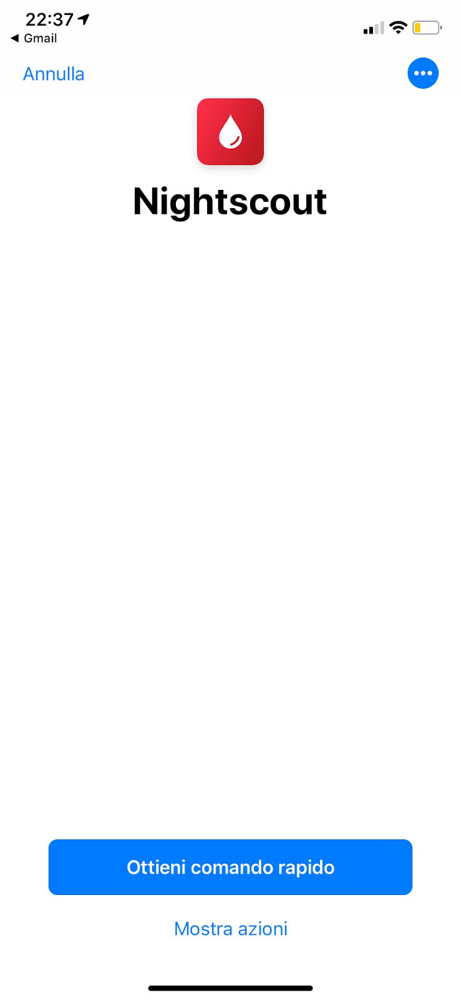

---

## 2. Configura la scorciatoia

Nella schermata di configurazione inserisci:
- **URL Nightscout** — il tuo indirizzo Nightscout (es. `https://miosito.azurewebsites.net`)
- **Fuso orario** — imposta `2` per l'ora italiana

Premi **Fine**.

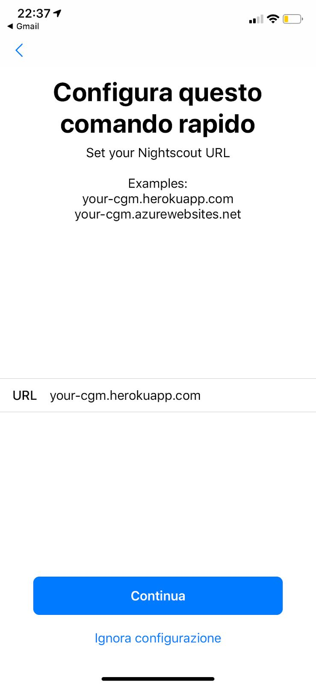

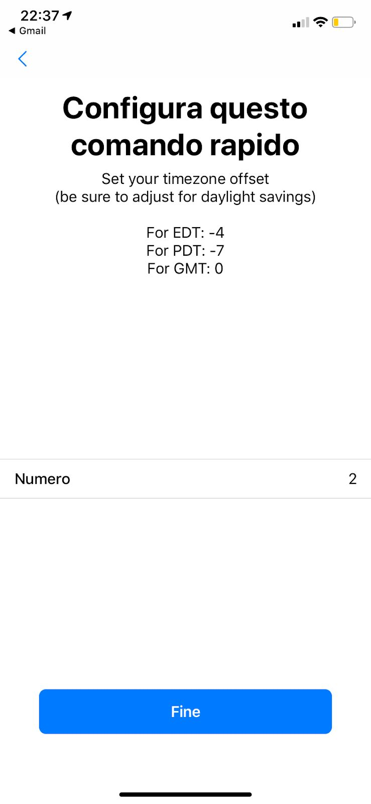

---

## 3. Aggiungi il comando vocale a Siri

1. Nella libreria delle scorciatoie (in basso a sinistra), trova la scorciatoia **Nightscout**.
2. Tocca i **tre punti** in alto a destra sulla scorciatoia per aprirne il menu interno.
3. Tocca la freccia per entrare nel menu interno.
4. Premi **Aggiungi a Siri**.
5. Registra la tua voce con una parola o frase di tua scelta (non deve per forza essere "Nightscout").
6. Premi **Fine** per tornare al menu precedente, poi di nuovo **Fine** per tornare alla libreria.

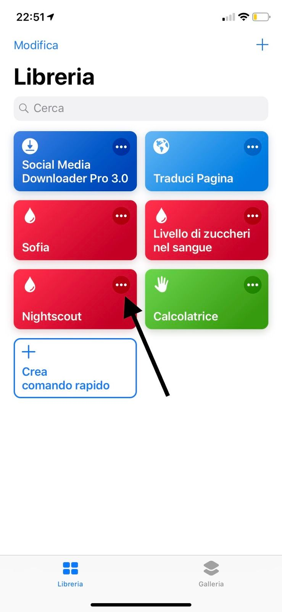

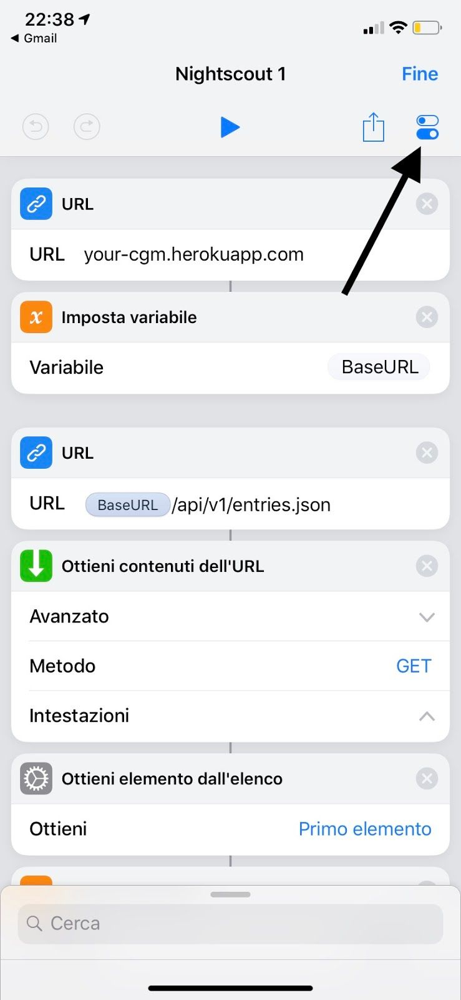

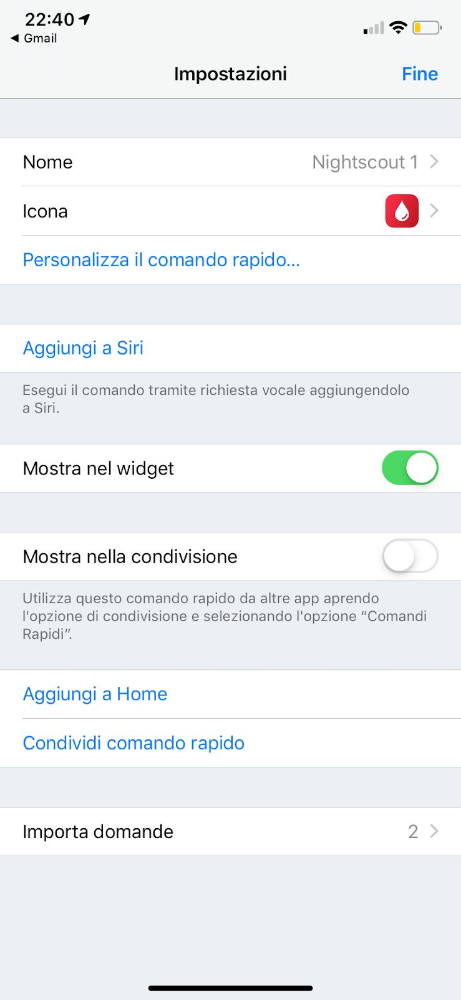

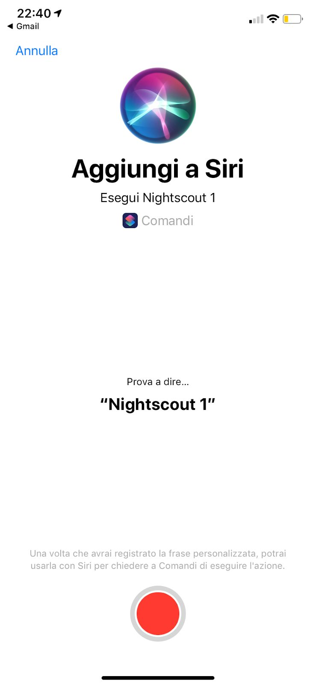

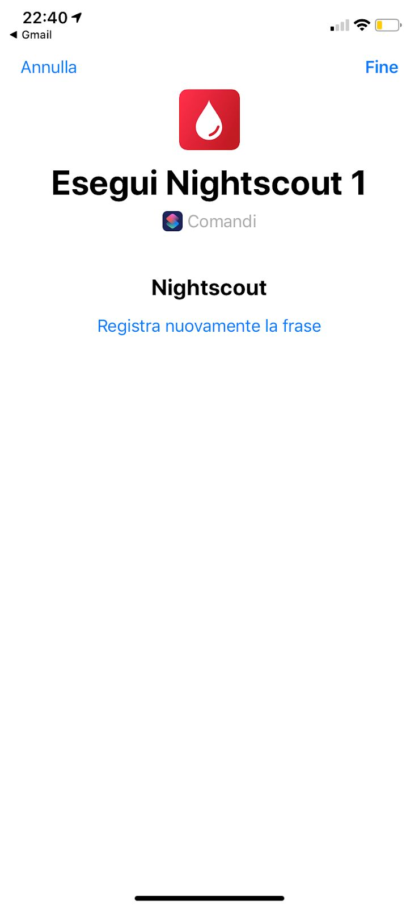

---

## 4. Usa la scorciatoia

Puoi richiamare la glicemia in tre modi:
- **Toccando** l'immagine della scorciatoia nella libreria.
- **Parlando a Siri** sull'iPhone con la frase che hai registrato.
- **Parlando a Siri sull'Apple Watch** con la stessa frase.

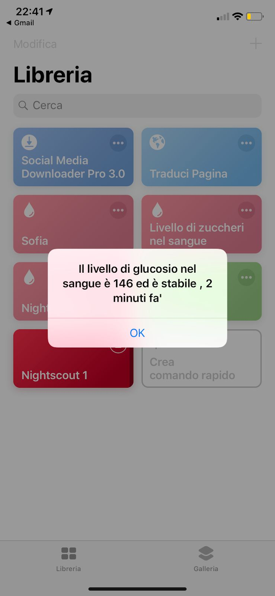

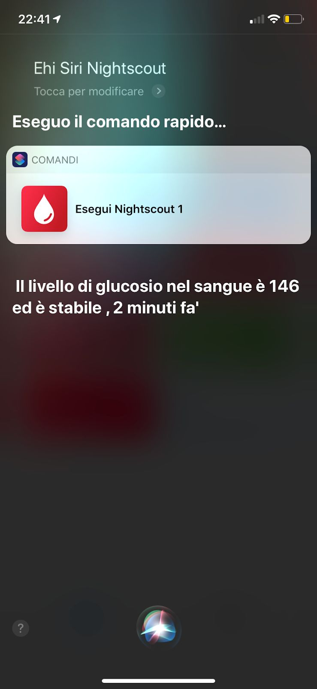

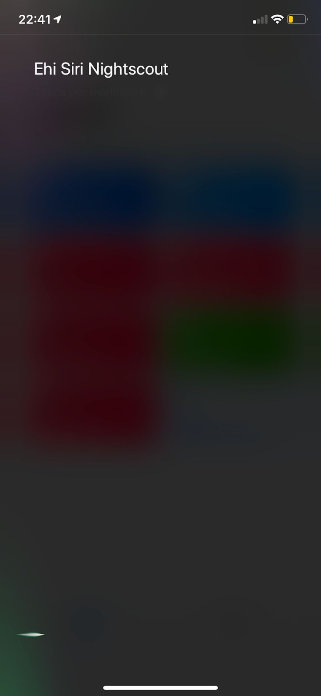

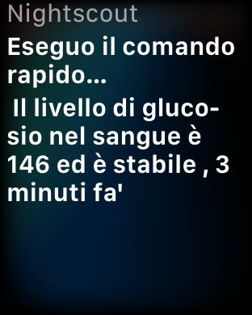

> ℹ️ **Nota**: Puoi anche aggiungere la scorciatoia al **menu Widget** dell'iPhone (premi **Modifica** in basso nel menu di sinistra) così che appaia subito senza aprire l'app.

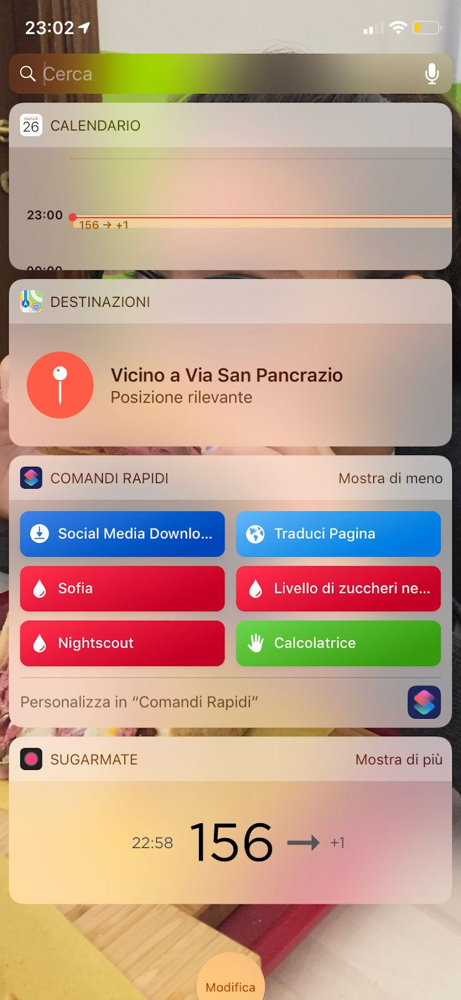
