# Leggere la glicemia di Nightscout con Siri

> ⚠️ **Attenzione**: la scorciatoia usata in questa guida **non è più disponibile** su iCloud, quindi al momento la procedura non può essere seguita. Lasciamo la guida come riferimento in attesa di una scorciatoia sostitutiva.

Questa guida spiega come configurare una **scorciatoia Siri** per richiamare il valore di glicemia attuale da Nightscout, sia sull'**iPhone** che sull'**Apple Watch** abbinato.

**Requisiti:** iPhone con iOS 12 o superiore.

---

## 1. Scarica la scorciatoia

Apri questo link dall'iPhone: [`https://www.icloud.com/shortcuts/7b178e6b76374c37902740bcc950f866`](https://www.icloud.com/shortcuts/7b178e6b76374c37902740bcc950f866)

Premi **Ottieni comando rapido**.

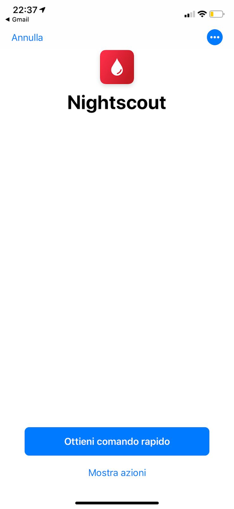

---

## 2. Configura la scorciatoia

Nella prima schermata inserisci l'**URL Nightscout**, il tuo indirizzo Nightscout (es. [`https://miosito.azurewebsites.net`](https://miosito.azurewebsites.net)):

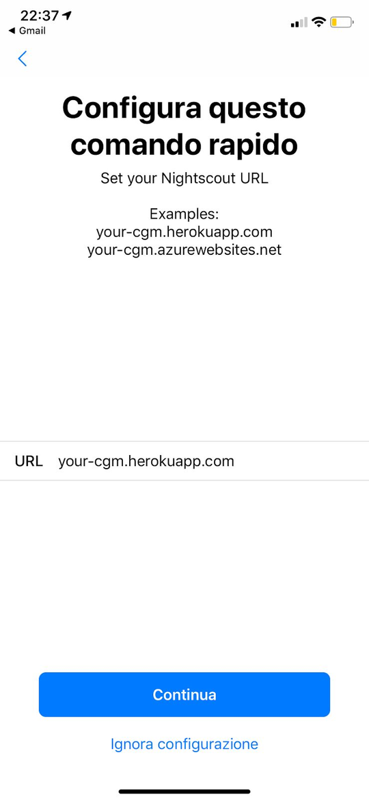

Nella schermata successiva inserisci il **fuso orario**: imposta `2` per l'ora italiana, poi premi **Fine**:

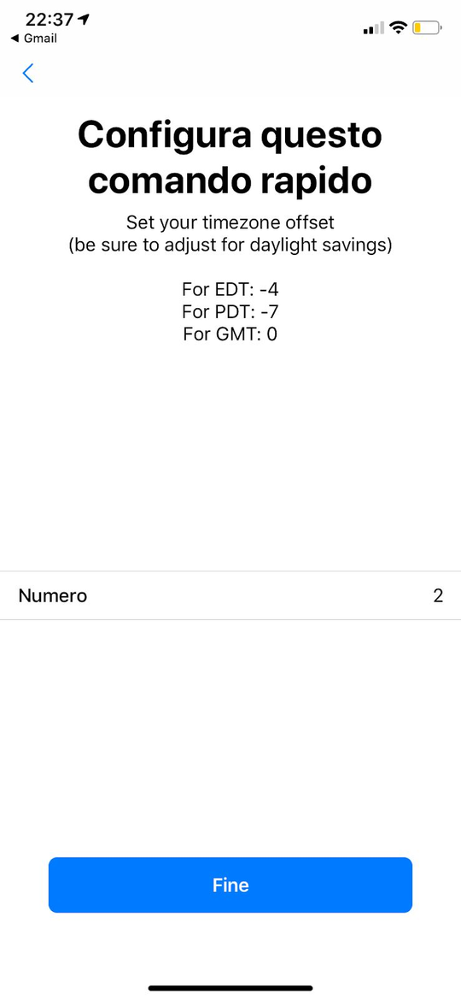

---

## 3. Aggiungi il comando vocale a Siri

1. Nella libreria delle scorciatoie (in basso a sinistra), trova la scorciatoia **Nightscout**.
2. Tocca i **tre punti** in alto a destra sulla scorciatoia per aprirne il menu interno.
3. Tocca l'icona degli **interruttori** in alto a destra per entrare nelle impostazioni.
4. Premi **Aggiungi a Siri**.
5. Registra la tua voce con una parola o frase di tua scelta (non deve per forza essere "Nightscout").
6. Premi **Fine** per tornare al menu precedente, poi di nuovo **Fine** per tornare alla libreria.

Nella libreria, tocca i **tre punti** sulla card **Nightscout**:

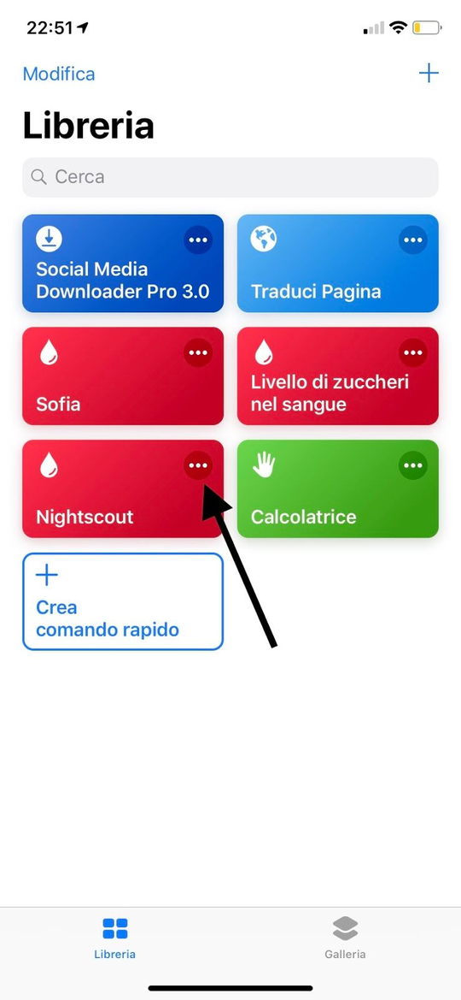

Si apre l'editor della scorciatoia: tocca l'icona degli **interruttori** in alto a destra:

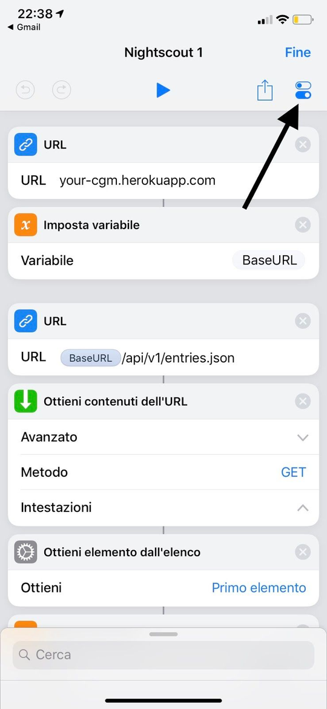

Nel pannello **Impostazioni**, tocca **Aggiungi a Siri**:

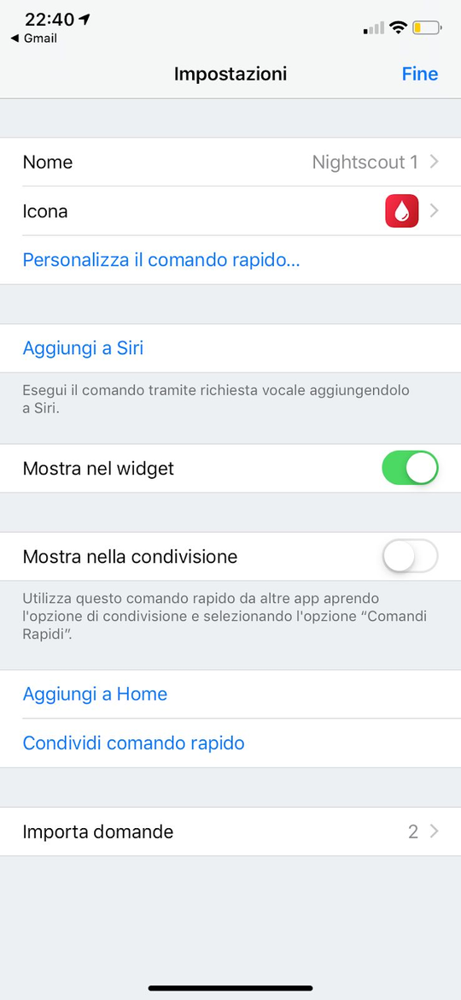

Tieni premuto il pulsante rosso e registra la frase con cui vuoi richiamare la scorciatoia (nell'esempio "Nightscout 1"):

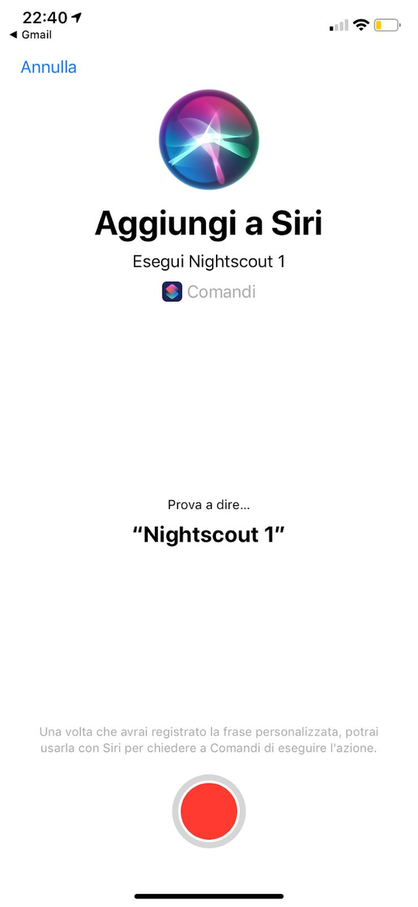

La frase risulta registrata: premi **Fine** per confermare e tornare alla libreria:

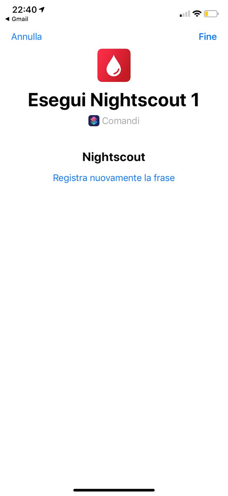

---

## 4. Usa la scorciatoia

Puoi richiamare la glicemia in tre modi:
- **Toccando** l'immagine della scorciatoia nella libreria.
- **Parlando a Siri** sull'iPhone con la frase che hai registrato.
- **Parlando a Siri sull'Apple Watch** con la stessa frase.

Toccando la card **Nightscout 1** nella libreria, compare subito il valore in un avviso a comparsa:

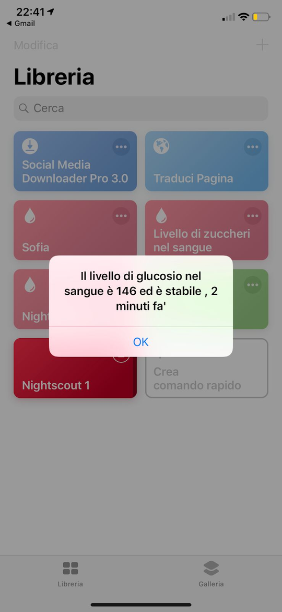

Dicendo "Ehi Siri, Nightscout" sull'iPhone, Siri avvia l'esecuzione del comando rapido:

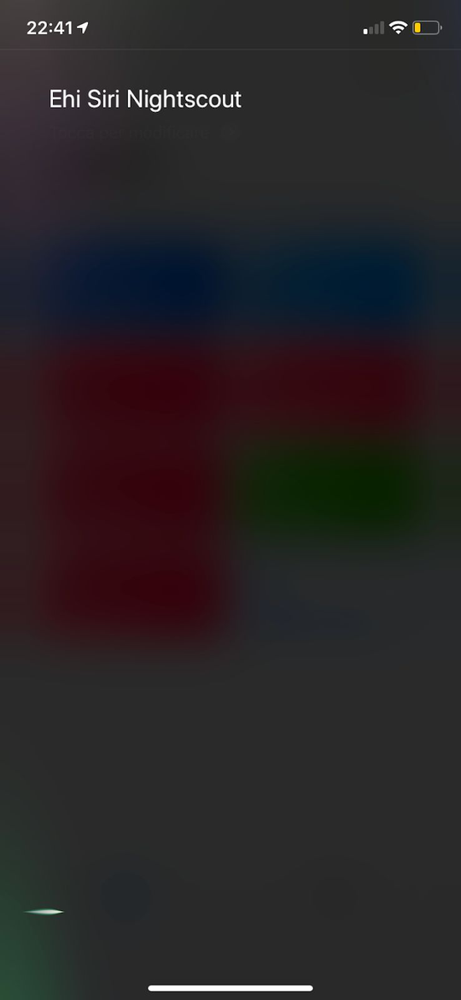

Dopo pochi istanti, Siri mostra il risultato con il valore di glicemia, il trend e i minuti trascorsi dall'ultima lettura:

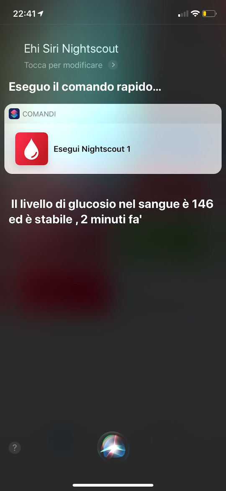

Allo stesso modo, dicendo la stessa frase all'Apple Watch, Siri esegue il comando rapido e mostra il valore direttamente sul quadrante:

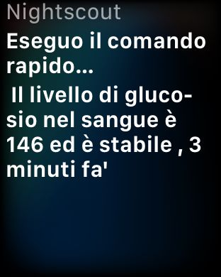

> ℹ️ **Nota**: Puoi anche aggiungere la scorciatoia al **menu Widget** dell'iPhone (premi **Modifica** in basso nel menu di sinistra) così che appaia subito senza aprire l'app.

Nel menu Widget della schermata Oggi, il riquadro **Comandi Rapidi** mostra il pulsante **Nightscout** pronto all'uso insieme agli altri comandi rapidi disponibili:

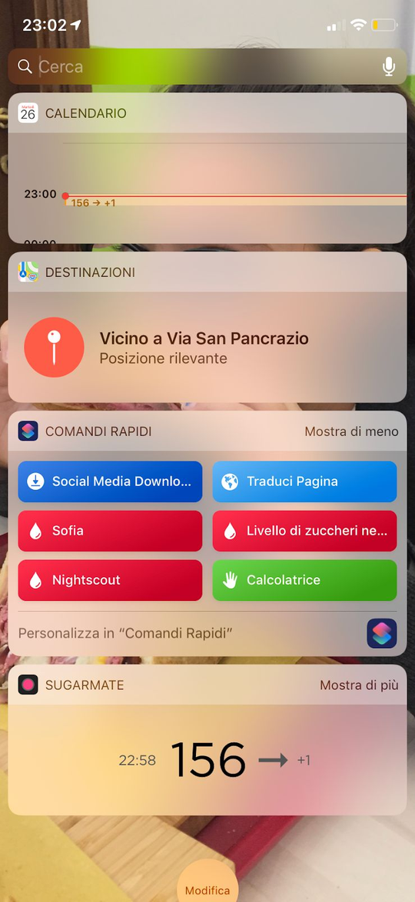
