# Amazfit con Zepp OS e xDrip tramite WatchDrip+

Questa guida spiega come visualizzare la glicemia di xDrip su smartwatch **Amazfit con sistema operativo Zepp OS**, usando WatchDrip+.

Progetto originale di Artem (GitHub: @bigdigital).

Dispositivi compatibili:
- Amazfit GTR3 PRO, GTR3, GTR4
- Amazfit GTS3, GTS4, GTS4 Mini
- Amazfit TRex2
- Amazfit Band7
- Amazfit Falcon

**Requisiti:** telefono Android 5 o superiore con Bluetooth 4.2 (BLE). Carica completamente il dispositivo prima di iniziare.

---

## 1. Installa e configura xDrip

Segui la [guida base di installazione](../xdrip/installare-xdrip-android). **Non proseguire fino a quando non vedi la glicemia in xDrip.**

Assicurati di avere una versione di xDrip non precedente al 10 luglio 2022. Per aggiornare, vai su [`https://github.com/NightscoutFoundation/xDrip/releases`](https://github.com/NightscoutFoundation/xDrip/releases).

Poi:
1. Vai in **Menu → Caratteristiche → Smartwatch → MiBand** e **disabilita** l'opzione **Usa MiBand** (la vecchia integrazione diretta non funziona con i dispositivi Zepp OS).

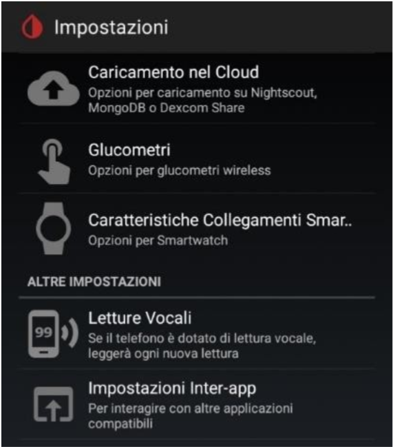

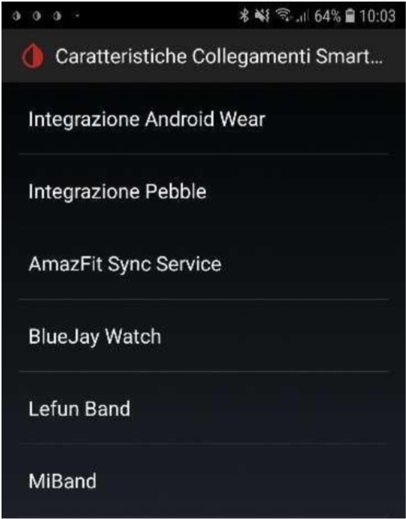

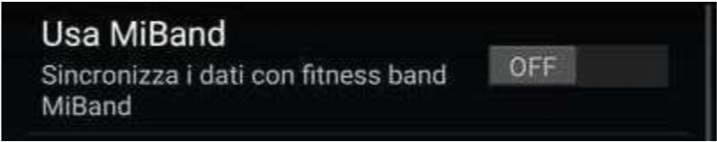

2. Vai in **Menu → Impostazioni → Inter-app settings** e abilita **Servizio di trasmissione API** (in fondo alla pagina).

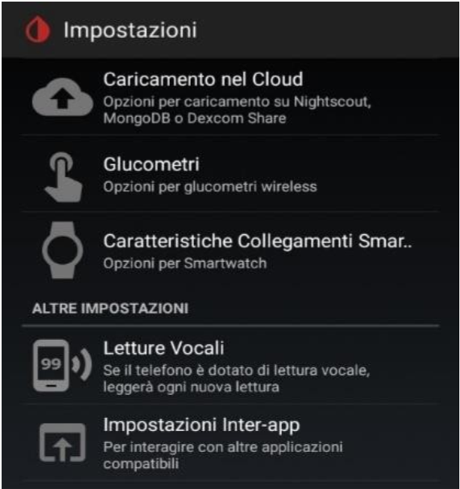

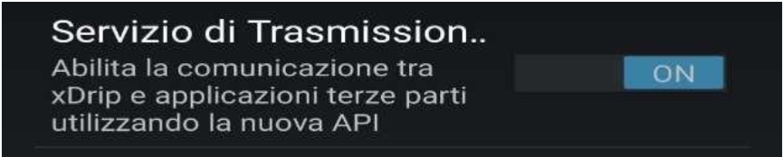

---

## 2. Installa e configura WatchDrip+

1. Scarica l'ultima versione di WatchDrip+ dal sito del progetto:
   [`https://bigdigital.home.blog/2022/06/16/watchdrip-a-new-application-for-xdrip-watch-integration/#changelog`](https://bigdigital.home.blog/2022/06/16/watchdrip-a-new-application-for-xdrip-watch-integration/#changelog)
2. Installa il file `.apk`.
3. Apri WatchDrip+ e abilita il **servizio** quando richiesto.
4. Abilita **Enable web server** nella schermata principale.
5. **Disabilita** l'opzione **Enable device**: i dispositivi Zepp OS non comunicano direttamente con WatchDrip+, usano l'app Zepp come intermediario.
6. Autorizza tutti i permessi richiesti (accesso notifiche, **Non disturbare**, ecc.) e torna nell'app.

La schermata di WatchDrip+ dovrebbe avere questo aspetto, con **Abilita servizio** e **Enable web server** attivi e **Enable device** disattivato:

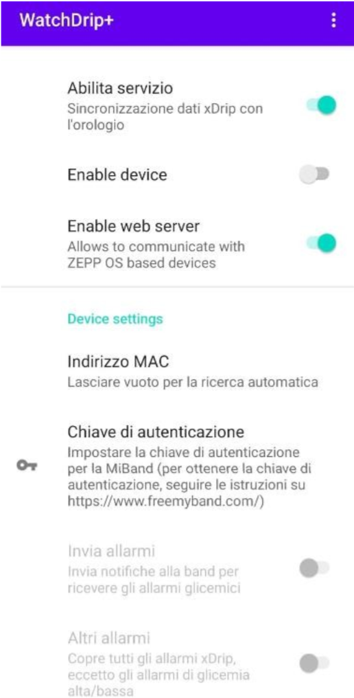

---

## 3. Installa e configura l'app Zepp

1. Installa l'app **Zepp** dal Google Play Store e collega il tuo smartwatch.

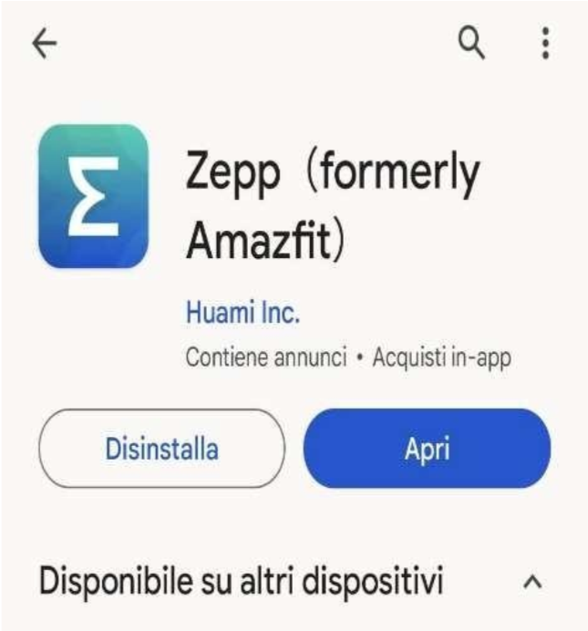

2. **Abilita la modalità sviluppatore** in Zepp: vai in **Profilo → Impostazioni → Informazioni** e tocca l'icona Zepp **7 volte di seguito** fino a quando compare un avviso di abilitazione.

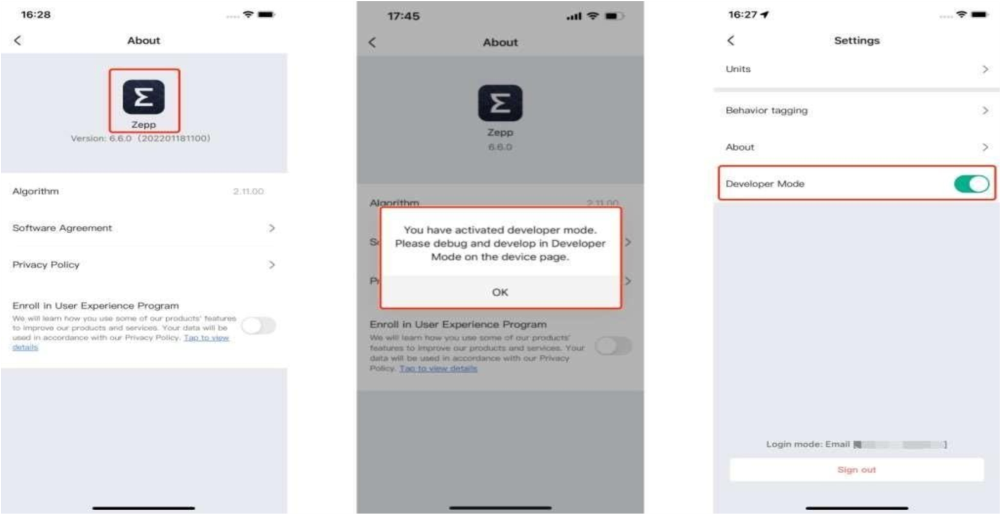

3. Adesso l'app Zepp può scansionare e installare quadranti personalizzati tramite il codice QR:
   - Vai su **Home** (in basso a sinistra)
   - Tocca **Dispositivo** (in basso a destra)
   - Scorri fino a **Generali**
   - Tocca **Modalità sviluppatore**
   - Tocca **+** in alto a destra per aprire **Scan**

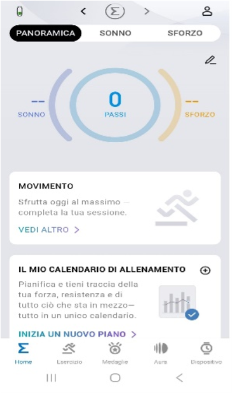

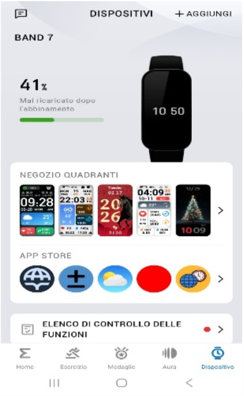

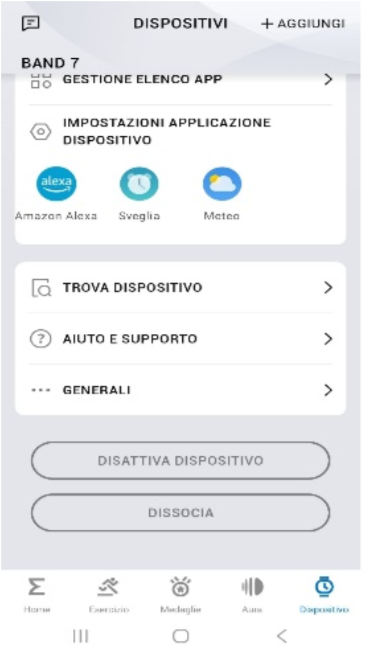

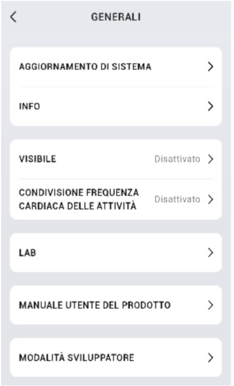

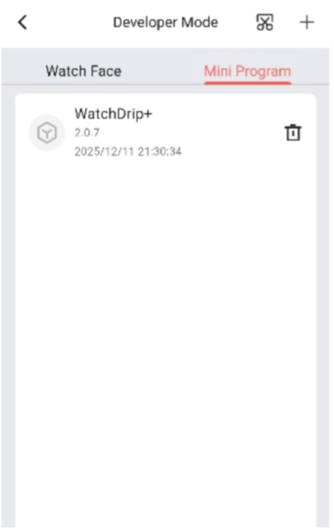

---

## 4. Installa l'app WatchDrip+ sull'orologio

Nell'app Zepp, usa la funzione **Scan** per scansionare il codice QR dell'app WatchDrip+ per l'orologio.

L'app è universale per tutti i dispositivi Amazfit Zepp OS. Il codice QR si trova nel sito del progetto WatchDrip+: [`https://watchdrip.org/apps/watchdrip-app/`](https://watchdrip.org/apps/watchdrip-app/).

> ⚠️ **Attenzione**: se ricevi l'errore **Download failed – invalid ZIP file format**, ti serve la versione più recente dell'app (`v2.1.0` o successive), disponibile sulla stessa pagina.

Per l'installazione è necessaria la versione `v7.7.0` o successive dell'app Zepp.

---

## 5. Installa il quadrante (watchface)

1. Vai su [`https://watchdrip.org`](https://watchdrip.org) per trovare il quadrante adatto al tuo modello.

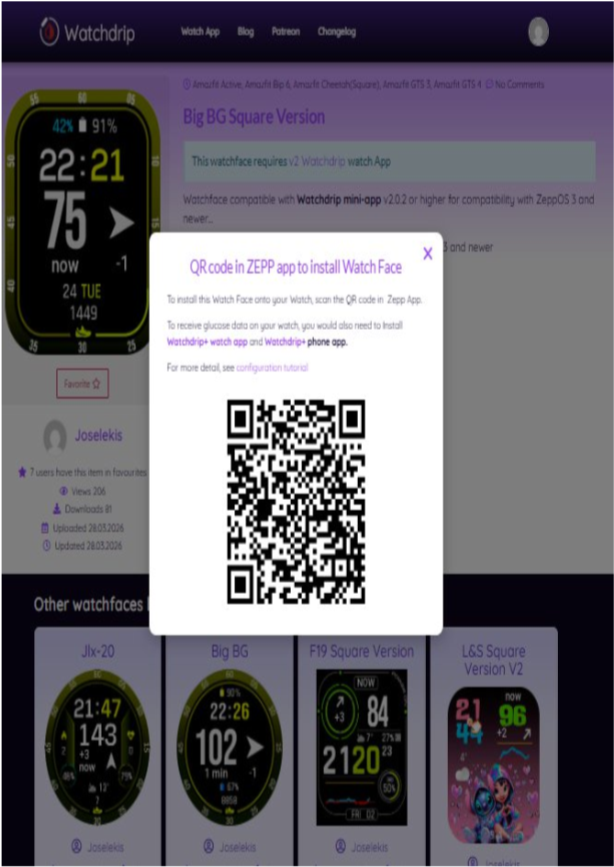

2. Nell'app Zepp, scansiona il codice QR del quadrante scelto con la funzione **Scan**.
3. Nella pagina del quadrante, clicca **Installa** per installarlo sul dispositivo.

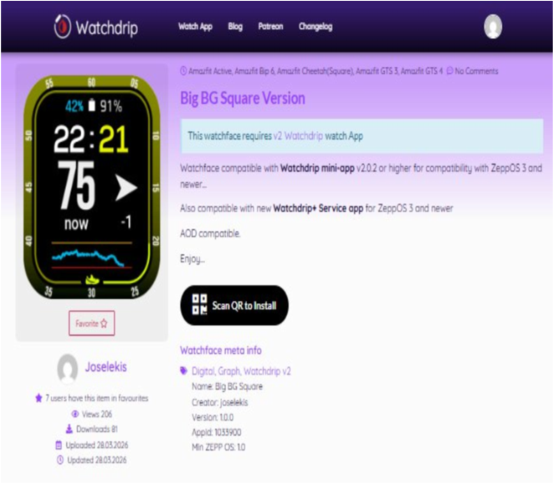

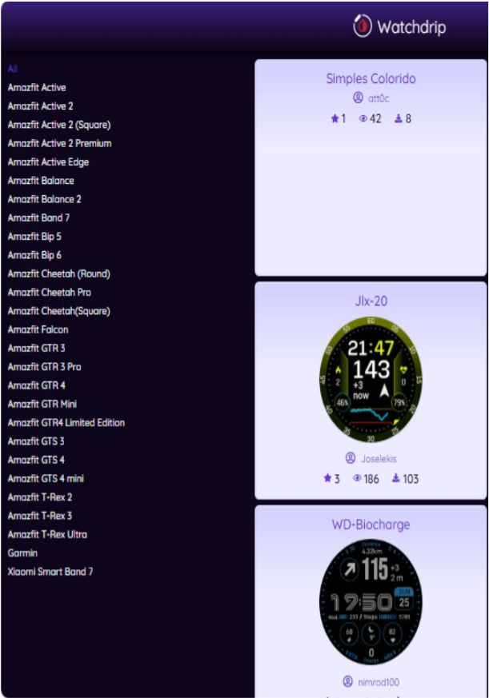

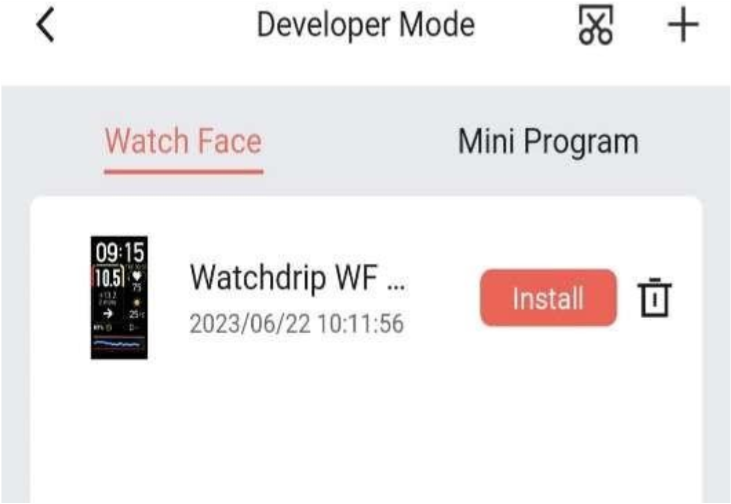

> ℹ️ Se non esiste un watchface specifico per il tuo modello, puoi visualizzare il valore della glicemia direttamente nell'app WatchDrip Watch sull'orologio.

Adesso cerca la mini app WatchDrip+ sull'orologio e aprila per visualizzare i valori:

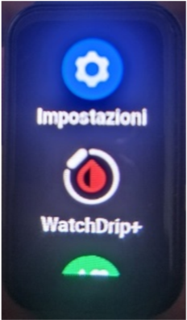

Una volta collegato, aspetta la prossima lettura di xDrip: il valore comparirà sia in WatchDrip+ che sullo smartwatch, con un aspetto simile a questo (varia in base al quadrante scelto):

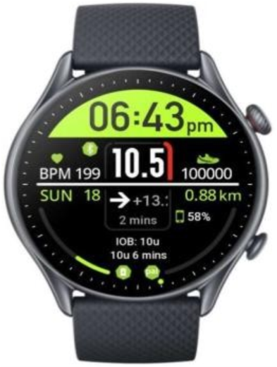

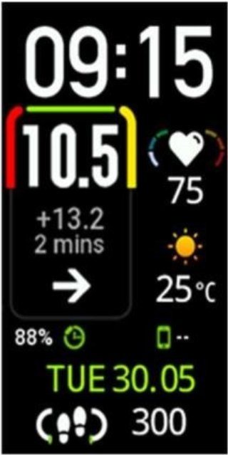

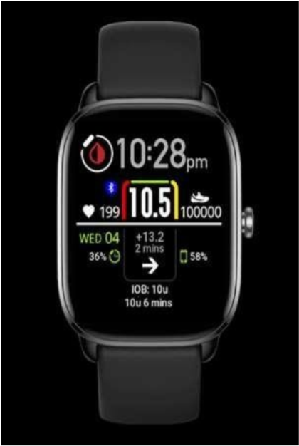

> ⚠️ **Attenzione**: l'elenco dei dispositivi compatibili si aggiorna periodicamente. Controlla sempre la pagina [`https://watchdrip.org/apps/watchdrip-service/`](https://watchdrip.org/apps/watchdrip-service/) per le novità. Tra i modelli aggiunti di recente: Active Max, Active 3 Premium, T-Rex Ultra 2, Cheetah 2 Pro e Ultra, Bip Max. Questi quadranti non sono ancora testati dalla community, quindi ti consigliamo di acquistare con possibilità di reso perché la compatibilità non è garantita.

---

## Sezione speciale — Xiaomi Smart Band 7

La Xiaomi Smart Band 7 usa lo stesso sistema operativo Zepp degli Amazfit, ma l'app Zepp Life (per Xiaomi) non ha le API di comunicazione necessarie per WatchDrip+. Tuttavia è possibile farlo funzionare mascherando la Band 7 come un Amazfit Band 7.

### Procedura

1. Se hai già l'app Zepp installata, disinstallala.
2. Se la Band 7 è già abbinata, apri **Zepp Life** e annulla l'abbinamento.
3. Scarica e installa l'**app Zepp modificata** da melianmiko (link nel blog di Artem).
4. Accedi con il tuo account Zepp o Zepp Life e associa la Mi Band 7.
5. Dopo l'associazione, vedrai il dispositivo elencato come **Amazfit Band7** nell'app.
6. Disinstalla l'app modificata e installa l'**app Zepp originale** (non Zepp Life) dal Play Store.
7. Accedi con lo stesso account usato durante l'abbinamento.
8. Ora puoi installare l'app WatchDrip Watch e il quadrante come descritto sopra.

> ℹ️ Se non riesci ad abbinare con l'app modificata, prova l'app alternativa creata da Artem (disponibile sul suo blog: bigdigital.home.blog).
