# Glicemia al polso con xDrip e Android Wear

Questa guida spiega come visualizzare la glicemia su uno smartwatch **Wear OS** (Android Wear) con xDrip, e come far leggere il sensore direttamente dallo smartwatch (modalità *standalone collector*), anche senza telefono.

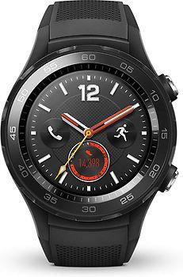

> ℹ️ **Nota**: La guida è stata realizzata con uno smartwatch **Huawei Watch 2 LTE**, ma vale per qualsiasi smartwatch Wear OS. Fa eccezione la parte sulla condivisione dati senza telefono, che richiede una SIM nell'orologio. Il Huawei Watch 2 esisteva in due versioni: solo WiFi oppure LTE/WiFi con SIM. Attenzione: il Huawei non può configurare gli APN della SIM (vedi la sezione 8).

**Prerequisiti:**

- xDrip deve essere già installato e funzionante sul telefono, con la glicemia visibile.
- La guida è pensata per FSL con MiaoMiao o Bubble.

> ⚠️ **Attenzione**: Non funziona con FSL2 senza MiaoMiao/Bubble.

---

## 1. Installa xDrip sullo smartwatch

Segui la guida [Android Wear OS: come impostare un quadrante con l'app Dexcom, xDrip o AAPS](../xdrip/dexcom-xdrip-on-wear-watch).

> ℹ️ **Nota**: Per installare app sullo smartwatch serve ADB: vedi [Installare ADB Debug](installare-adb-debug) e [Abilitare ADB sullo smartwatch Huawei Watch 2](abilitare-adb-sullo-smartwatch-huawei-watch-2).

---

## 2. Installa OOP2 sullo smartwatch

Segui la guida [Usare un algoritmo esterno con xDrip](../xdrip/xdrip-algoritmo-esterno).

---

## 3. Abilita l'integrazione Android Wear

Nell'app xDrip sul telefono, abilita **solo** l'integrazione Android Wear. Per il momento non selezionare altre opzioni.

Apri il menù di xDrip e vai in **Impostazioni**:

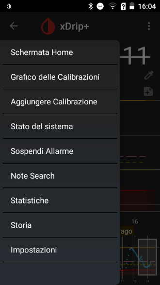

Apri **Caratteristiche Collegamenti Smartwatch**:

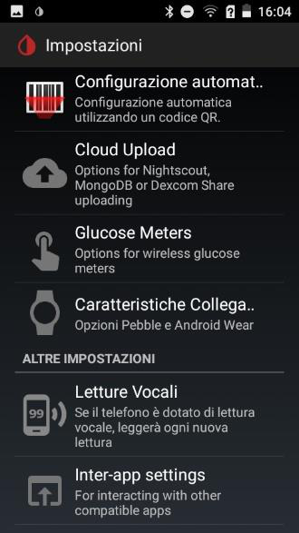

Seleziona **Integrazione Android Wear**:

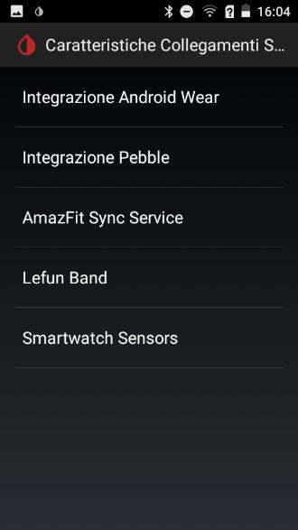

Attiva **Integrazione Android Wear** e lascia deselezionate le voci **Abilita Indossare** e **Forza Indossare**:

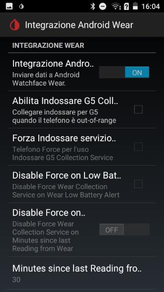

---

## 4. Imposta il quadrante xDrip

Adesso puoi selezionare il quadrante xDrip sullo smartwatch.

Dalla schermata di base (orologio), scorri verso l'alto per far comparire il menù, oppure raggiungi le applicazioni con il tasto in alto a destra:

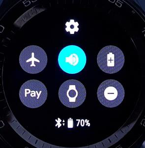

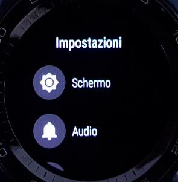

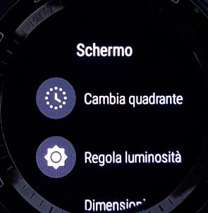

> ℹ️ **Nota**: Puoi anche arrivare alla scelta del quadrante con un tocco lungo sulla schermata di base.

Scorri la lista verso destra fino a **Scopri altri quadranti** e selezionala. Scorri in basso fino ai quadranti xDrip e selezionane uno:

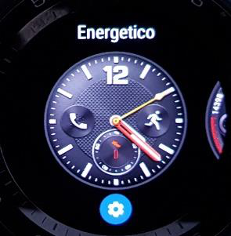

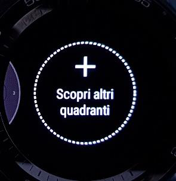

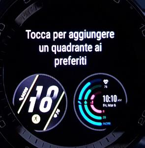

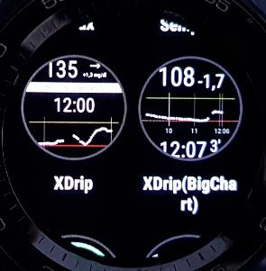

Conferma la selezione e torna alla schermata dell'orologio. Dopo poco tempo comparirà la glicemia:

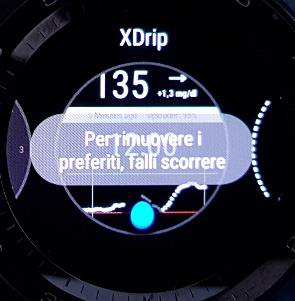

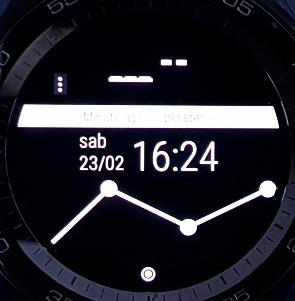

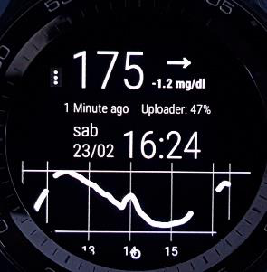

Hai adesso la glicemia al polso. La lettura viene eseguita dal telefono, che la trasmette allo smartwatch.

---

## 5. Abilita la lettura diretta dallo smartwatch

In questa modalità lo smartwatch legge direttamente il sensore tramite MiaoMiao/Bubble, anche in assenza del telefono.

Sul telefono, torna in xDrip. È molto importante che l'integrazione Android Wear sia abilitata e le letture siano visibili sullo smartwatch **prima** di proseguire: il grafico deve essere completo, aspetta una nuova lettura.

Se la collezione era già abilitata: deseleziona **Forza Indossare** e **Abilita Indossare**, poi disabilita e riabilita l'**Integrazione Android Wear** (vedi sezione 3 per il percorso).

Una volta verificata la buona trasmissione delle letture (aspetta una nuova lettura: la curva deve essere completa sullo smartwatch), posiziona lo smartwatch vicino al MiaoMiao e abilita la collezione selezionando **Abilita Indossare** e **Forza Indossare**:

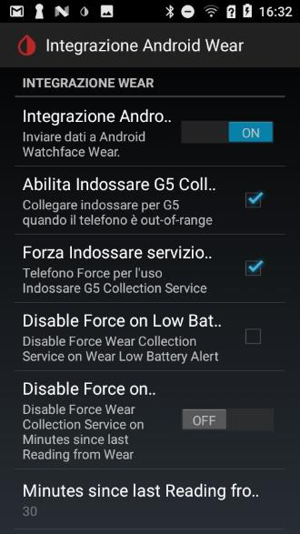

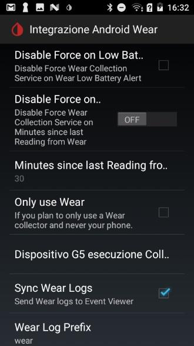

> ℹ️ **Nota (solo Blucon)**: Sullo smartwatch vai nelle impostazioni **Bluetooth**, cerca il trasmettitore e abbinalo allo smartwatch.

Dopo alcuni minuti, nel log di xDrip (menù → **Visualizza eventi Log**) vedrai arrivare eventi di lettura della glicemia con intestazione `wearjamorham`:

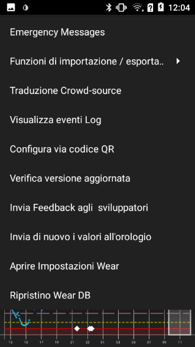

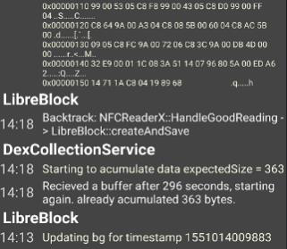

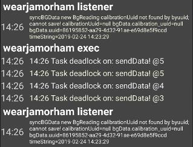

Lo smartwatch funziona ora in modalità *standalone collector*: legge direttamente la glicemia e la condivide con il telefono tramite Bluetooth.

Se non ti serve condividere la lettura, lo smartwatch funziona autonomamente anche in assenza di telefono o a telefono spento.

---

## 6. Condividi le letture a distanza

Se invece ti serve la condivisione della lettura, lo smartwatch e il telefono devono essere collegati tra di loro tramite rete dati o WiFi.

In Wear OS, verifica lo stato di collegamento dello smartwatch (a sinistra smartwatch vicino al telefono, a destra lontano):

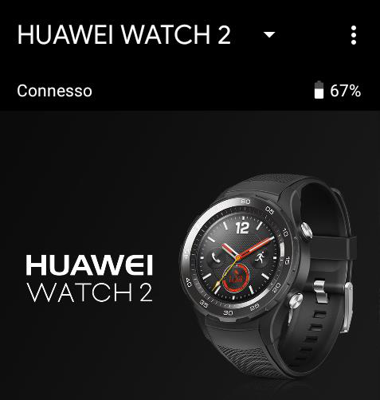

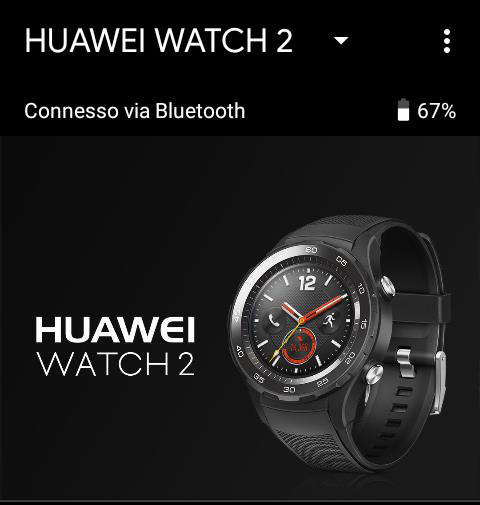

> ℹ️ **Nota**: Questa caratteristica è indipendente da xDrip e deve funzionare di per sé.

Per abilitarla, nell'app Wear OS vai in **Impostazioni avanzate** → **Privacy e dati personali** e verifica che la sincronizzazione nel cloud sia abilitata:

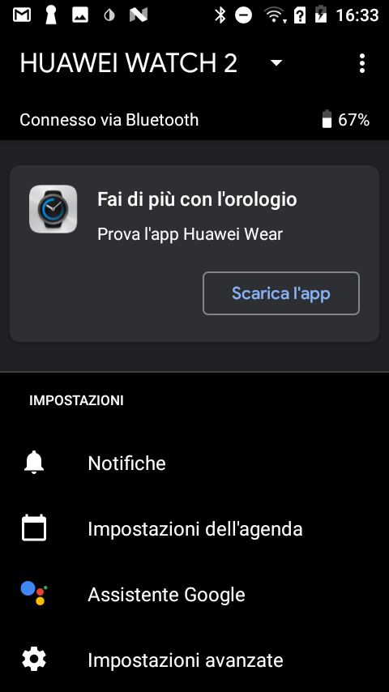

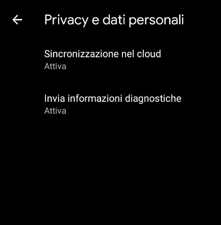

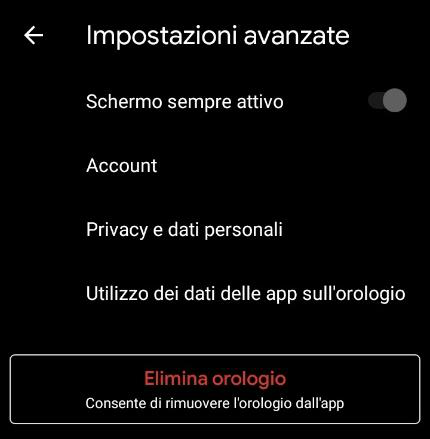

Lo smartwatch manda le letture al telefono tramite i servizi Google Play; il telefono manda i dati a Nightscout e permette di seguire la glicemia a distanza. In questo caso il telefono deve essere acceso per la condivisione, anche se non vicino allo smartwatch:

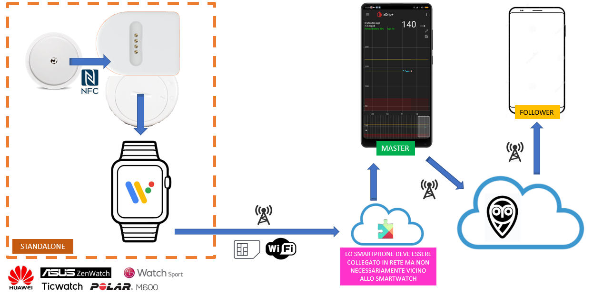

---

## 7. Disabilita la lettura dallo smartwatch

La sequenza è altrettanto importante, per evitare di lasciare il MiaoMiao scollegato dal telefono ma ancora collegato allo smartwatch quando lo spegni. Se succede, è necessario fare un reset per ripristinare il collegamento.

1. Assicurati di avere il telefono master vicino al MiaoMiao.
2. Deseleziona **Forza Indossare** e **Abilita Indossare** (vedi sezione 3 per il percorso).

Puoi lasciare abilitata l'**Integrazione Android Wear** se vuoi continuare a visualizzare la glicemia sullo smartwatch, senza che legga direttamente il MiaoMiao.

> ⚠️ **Attenzione**: Se vuoi spegnere lo smartwatch, disabilita prima l'integrazione Wear.

---

## 8. Altre impostazioni dello smartwatch

Per un uso silenzioso, abilita la vibrazione e azzera il volume:

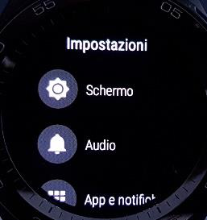

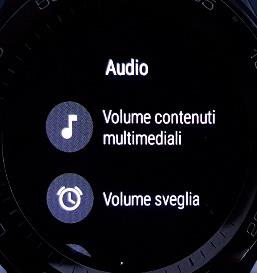

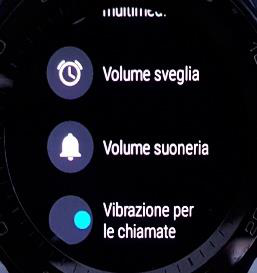

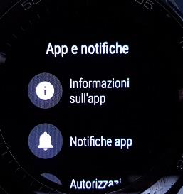

Verifica le impostazioni di connettività:

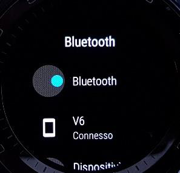

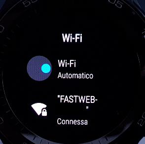

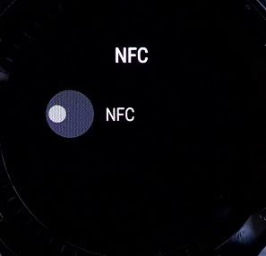

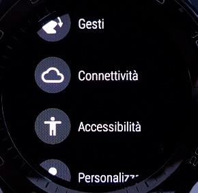

Con la SIM inserita, verifica la presenza degli APN (esempio con TIM):

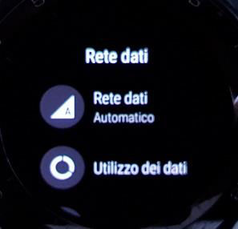

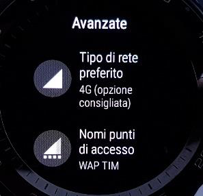

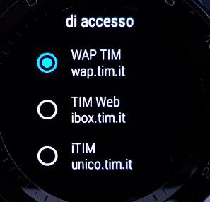

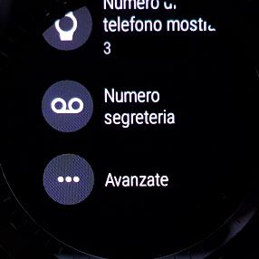

Se non sono presenti APN, contatta il fornitore della SIM per verificare che non sia necessario un SMS di configurazione: il Huawei non lo supporta e servirà un'altra SIM.

> ℹ️ **Nota**: Abbiamo provato con successo TIM, Vodafone e Wind. Con Fastweb non va (è un esempio di operatore virtuale).
