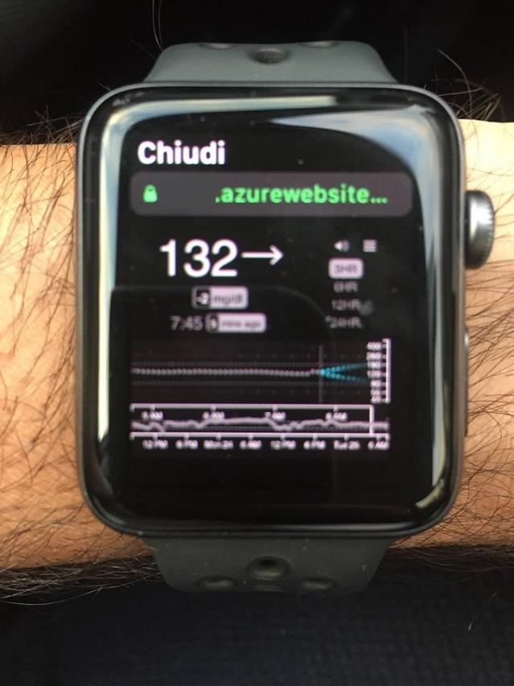
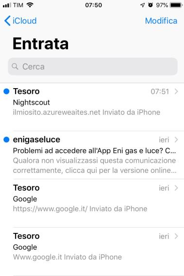
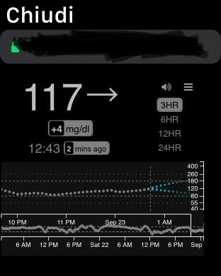
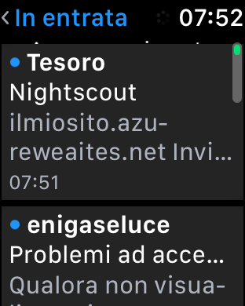
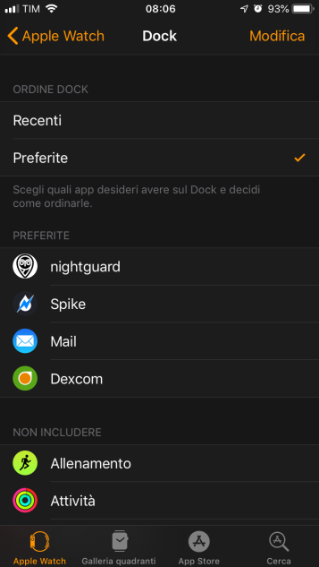
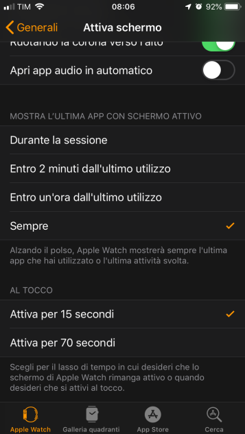
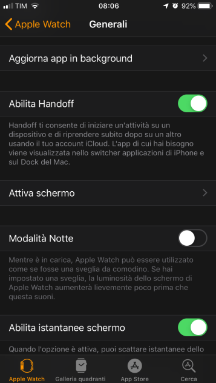

# Visualizzare Nightscout su Apple Watch

Questa guida spiega come aprire il sito Nightscout direttamente sull'**Apple Watch**, senza installare app aggiuntive.

> ⚠️ **Questo metodo non ha allarmi glicemici.** Per gli allarmi, usa un'app dedicata come Nightguard o xDrip4iOS.

---

## Come aprire Nightscout sull'Apple Watch

1. Sull'iPhone, apri l'app **Mail** e inviati un'email con l'URL del tuo sito Nightscout (es. `https://miosito.azurewebsites.net`).
2. Sull'Apple Watch, apri l'app **Mail**, trova l'email che ti sei inviato e toccal'URL.
3. Il Watch aprirà il browser e mostrerà la pagina Nightscout come su un computer.

---

## Suggerimento: tenere Nightscout sempre a portata di mano

Per accedere rapidamente a Nightscout senza riaprire ogni volta l'email:

1. Nell'app **Apple Watch** sull'iPhone, vai in **Generale → Attiva schermo** e imposta **Mostra ultima app con schermo attivo**.
2. Vai in **Dock → Preferiti** e aggiungi l'app **Mail** ai preferiti.

In questo modo, ruotando il polso riappare l'ultima app aperta. Se la pagina Nightscout si è chiusa, premi il **tasto laterale** dell'Apple Watch per richiamare le app nel dock.

> ℹ️ La pagina Nightscout **non si aggiorna automaticamente** a ogni attivazione dello schermo: dovrai scorrerla manualmente o riaprire il browser per aggiornare il valore.
