# Glicemia su Fitbit Versa e Ionic

Questa guida spiega come visualizzare la glicemia su uno smartwatch **Fitbit Versa** o **Ionic** abbinato a un telefono Android o iPhone.

Sorgenti compatibili: Dexcom, xDrip+, Diabox, Spike, Nightscout.

Verifica la compatibilità del tuo telefono con il tuo Fitbit: `https://www.fitbit.com/it/devices`

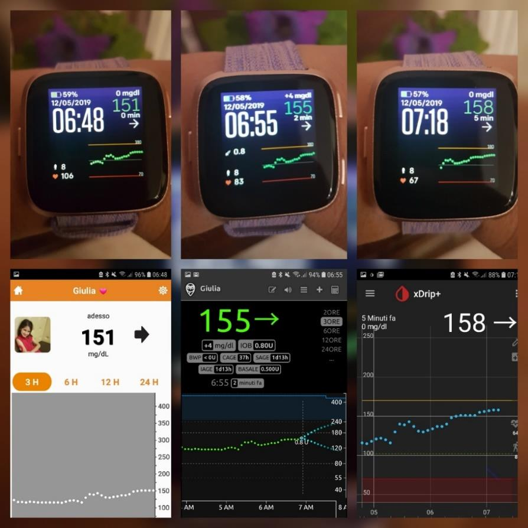

---

## 1. Abbina il Fitbit al telefono

Installa l'app **Fitbit** (disponibile per Android e iPhone) e abbina il tuo Versa o Ionic seguendo le istruzioni dell'app.

> ⚠️ **Se usi xDrip+**: esiste un bug con le versioni recenti dell'app Fitbit. Devi installare la versione **3.58** dell'app Fitbit, che trovi su Aptoide: `https://fitbit.it.aptoide.com/versions`. Dopo l'installazione, **disabilita l'aggiornamento automatico** dell'app nel Play Store.

> ℹ️ **Se usi l'app Dexcom Mobile**: devi avere almeno un follower attivo nell'app per poter inviare i dati al Fitbit.

---

## 2. Abilita la condivisione dati dall'app sorgente

Configura l'app che gestisce la glicemia sul telefono:

**Se usi Spike:**
- Apri Spike → **Settings → Integration** → abilita **Internal HTTP Server**.

**Se usi xDrip+:**
- Vai in **Impostazioni → Impostazioni Inter-app** → abilita **xDrip Web Service**.

**Se usi Diabox:**
- Nel menu integrazione, abilita la condivisione dati con gli smartwatch.
- Se usi Diabox insieme a xDrip+: **disabilita** il web service di xDrip+ (altrimenti ci sono conflitti).

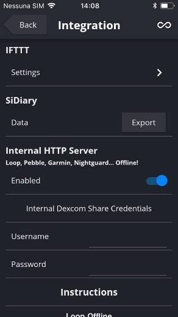

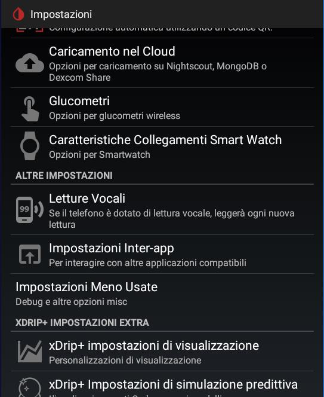

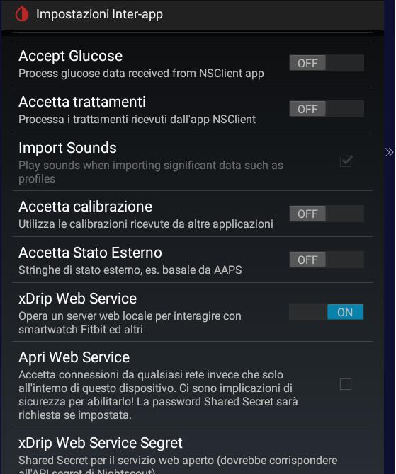

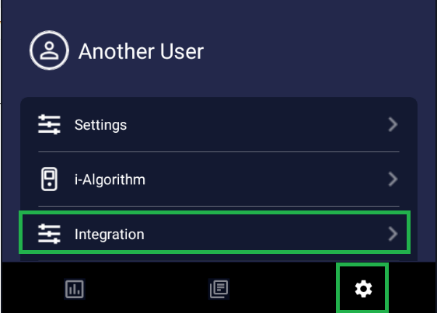

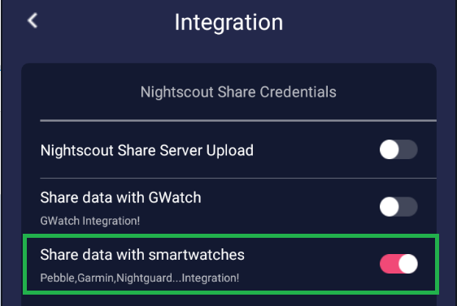

---

## 3. Installa il quadrante glicemia sul Fitbit

### Fitbit Sense e Versa 3

Dall'app Fitbit, cerca il quadrante **Glance**, installalo e concedi tutti i permessi.

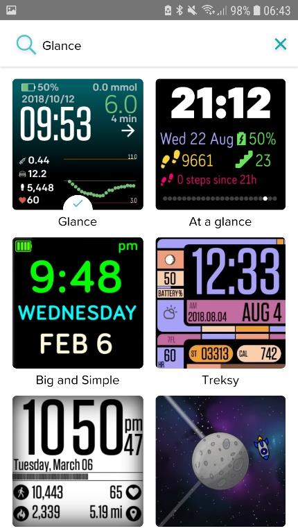

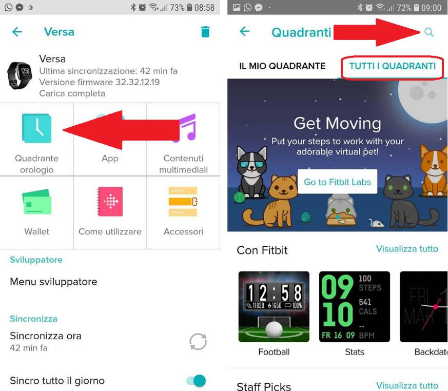

### Fitbit Versa, Versa 2, Versa Lite e Ionic

Installa il quadrante da:
`https://gallery.fitbit.com/details/7b5d9822-7e8e-41f9-a2a7-e823548c001c`

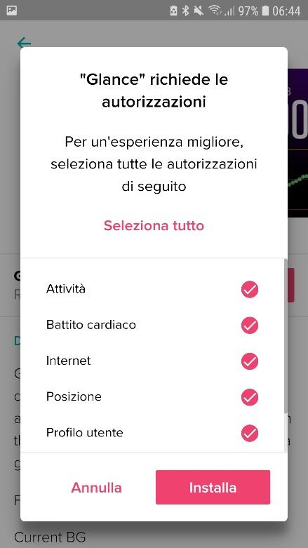

---

## 4. Configura il quadrante

Apri le impostazioni del quadrante dall'app Fitbit e seleziona la sorgente dei dati:

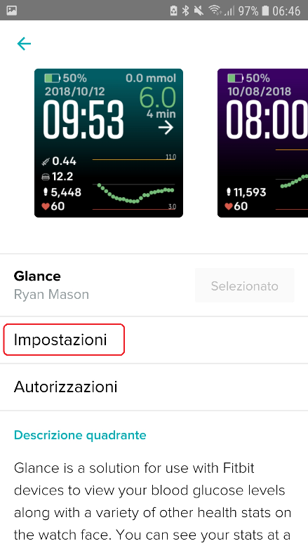

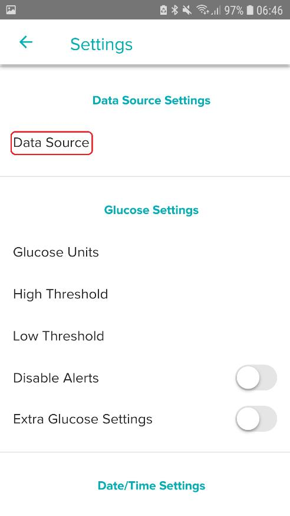

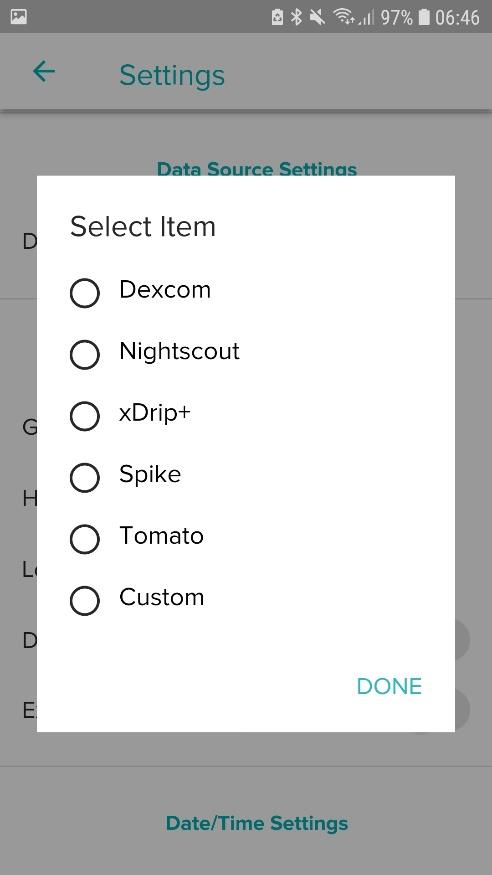

| Sorgente | Nota |
|---|---|
| **Dexcom** | Inserisci le credenziali Dexcom Share |
| **Nightscout** | Inserisci l'URL del sito (mantieni lo `/` finale) |
| **Spike** | Seleziona Spike come sorgente |
| **xDrip+ / Diabox** | Seleziona xDrip+ come sorgente |

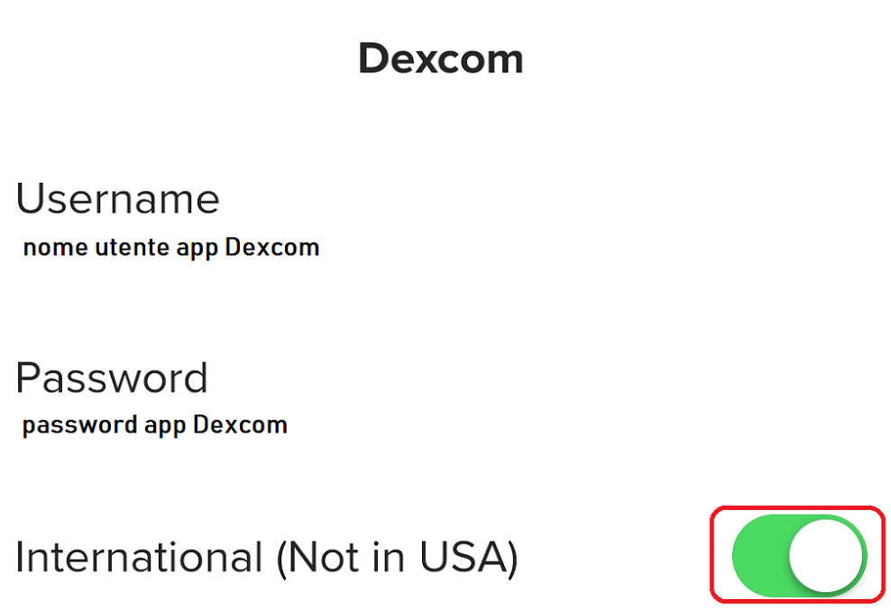

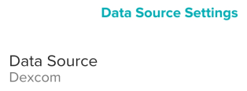

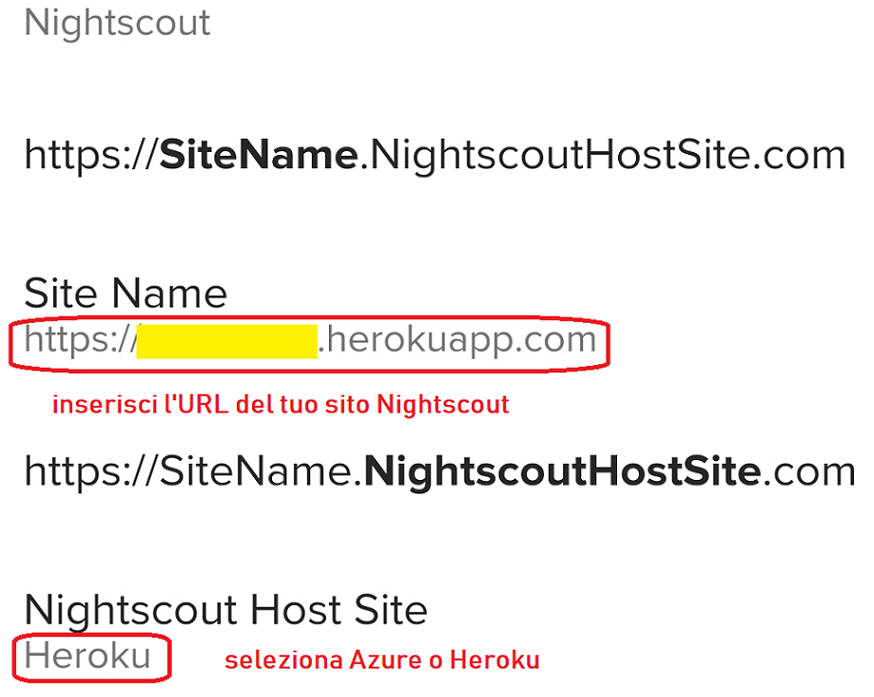

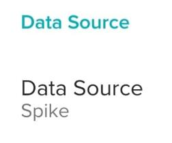

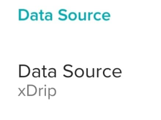

### Altre impostazioni disponibili

| Impostazione | Descrizione |
|---|---|
| Unità di misura | mg/dL |
| Livello glicemia alta | Soglia valore alto |
| Livello glicemia bassa | Soglia valore basso |
| Allarmi | Abilitazione e soglie per ipoglicemia e iperglicemia |
| Tempo di ripetizione allarme | Intervallo dopo il primo snooze |
| Allarme salita/discesa rapida | Avviso per variazioni rapide |
| Allarme dati mancanti | Minuti senza lettura prima dell'avviso |
| Disabilita allarmi quando in range | Silenzia quando la glicemia è nei limiti |
| Visualizzazione ora | 12 o 24 ore |
| Visualizzazione data e giorno | Abilitabile/disabilitabile |
| Grafico esteso | Premendo il display si apre il grafico |
| Colore dello sfondo | Personalizzabile |

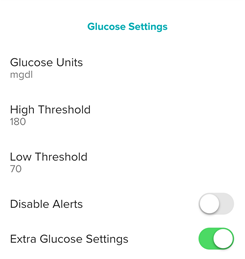

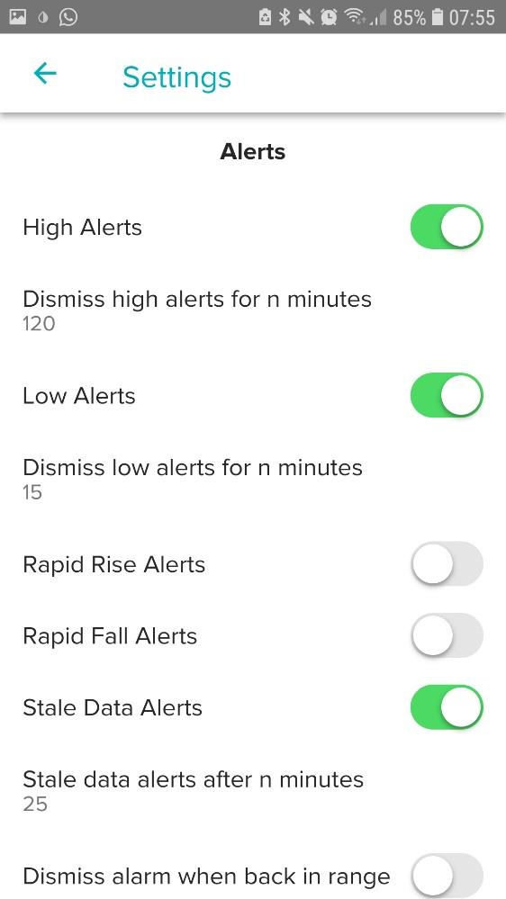

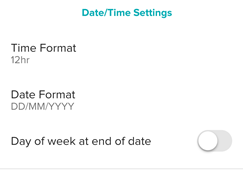

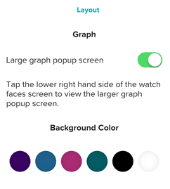
