# Glicemia su Fitbit Versa e Ionic

Questa guida spiega come visualizzare la glicemia su uno smartwatch **Fitbit Versa** o **Ionic** abbinato a un telefono Android o iPhone.

Sorgenti compatibili: Dexcom, xDrip, Diabox, Spike, Nightscout.

> ⚠️ **Attenzione**: da maggio 2026 l'app Fitbit è stata sostituita dall'app **Google Health**, e dal 15 luglio 2026 le versioni vecchie dell'app Fitbit (precedenti alla 5.0) hanno smesso del tutto di funzionare. Se il tuo telefono ha **Android 9 o precedente**, il vecchio espediente di installare la versione `3.58` per far funzionare le sorgenti locali (xDrip, Diabox, Spike) **non è più possibile**: usa **Nightscout** o **Dexcom Share** come sorgente dati. Con Android 10 o superiore le sorgenti locali dovrebbero continuare a funzionare, ma il comportamento della nuova app Google Health non è ancora verificato. Ricordiamo che sconsigliamo l'acquisto di nuovi dispositivi Fitbit.

Verifica la compatibilità del tuo telefono con il tuo Fitbit: [`https://www.fitbit.com/it/devices`](https://www.fitbit.com/it/devices)

Un esempio del risultato finale: il quadrante sullo smartwatch (a sinistra) e le rispettive app sorgente sul telefono (a destra), con lo stesso valore di glicemia mostrato su entrambi:

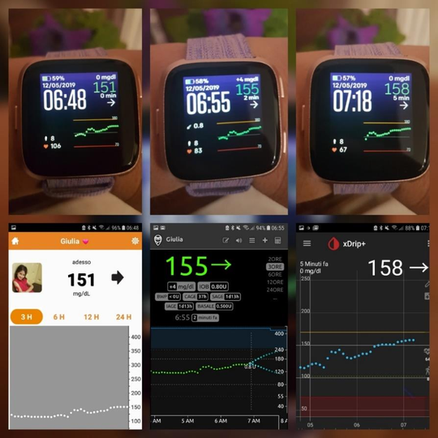

---

## 1. Abbina il Fitbit al telefono

Installa l'app **Fitbit** (oggi sostituita dall'app **Google Health**, disponibile per Android e iPhone) e abbina il tuo Versa o Ionic seguendo le istruzioni dell'app.

> ⚠️ **Attenzione**: in passato, sui telefoni con **Android 9 o precedente**, per usare xDrip come sorgente serviva installare la vecchia versione `3.58` dell'app Fitbit. Dal 15 luglio 2026 le versioni dell'app precedenti alla 5.0 non funzionano più, quindi questo espediente non è più possibile: su questi telefoni carica i dati su Nightscout o su Dexcom Share e usa quella come sorgente. Con Android 10 o superiore questo passaggio non è mai stato necessario.

> ℹ️ **Nota**: Se usi l'app Dexcom Mobile, devi avere almeno un follower attivo nell'app per poter inviare i dati al Fitbit.

---

## 2. Abilita la condivisione dati dall'app sorgente

Configura l'app che gestisce la glicemia sul telefono:

**Se usi Spike:**
- Apri Spike → **Settings → Integration** → abilita **Internal HTTP Server**.

Nella sezione **Integration** di Spike, attiva **Internal HTTP Server**:

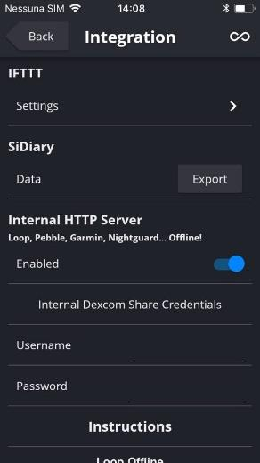

**Se usi xDrip:**
- Vai in **Impostazioni → Impostazioni Inter-app** → abilita **xDrip Web Service**.

Dal menu **Impostazioni** di xDrip, entra in **Impostazioni Inter-app**:

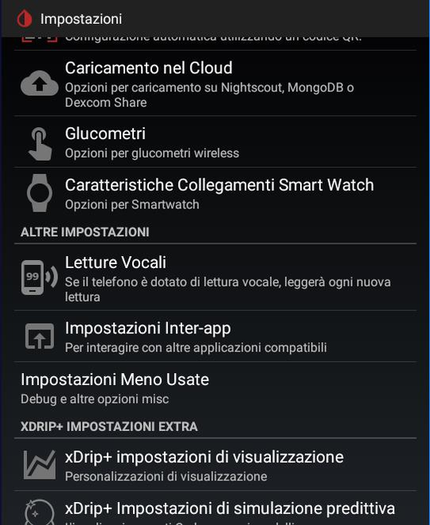

Attiva l'interruttore **xDrip Web Service**:

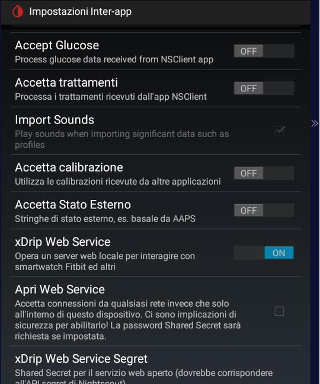

**Se usi Diabox:**
- Nel menu integrazione, abilita la condivisione dati con gli smartwatch.
- Se usi Diabox insieme a xDrip: **disabilita** il web service di xDrip (altrimenti ci sono conflitti).

Dal menu delle impostazioni di Diabox, entra in **Integration**:

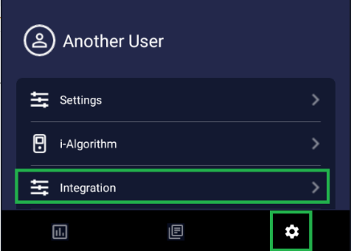

Attiva **Share data with smartwatches**:

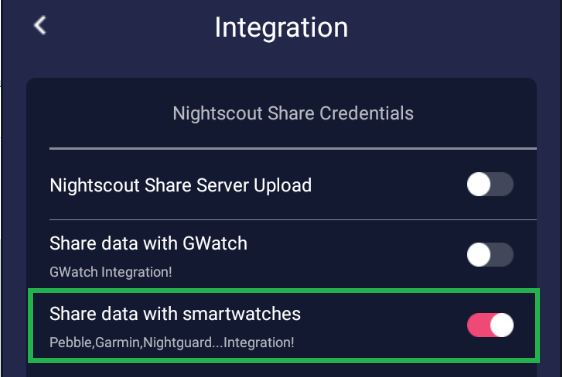

---

## 3. Installa il quadrante glicemia sul Fitbit

### Fitbit Sense e Versa 3

Dall'app Fitbit, cerca il quadrante **Glance**, installalo e concedi tutti i permessi.

Dalla pagina del tuo dispositivo, tocca **Quadrante orologio** e poi la lente di ricerca in **Tutti i quadranti**:

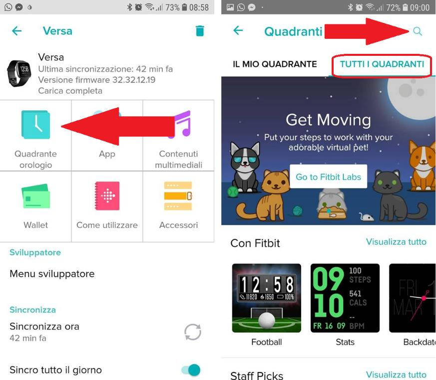

Cerca "Glance" e seleziona il quadrante tra i risultati:

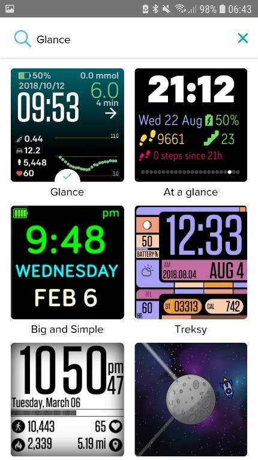

Concedi tutte le autorizzazioni richieste (Attività, Battito cardiaco, Internet, Posizione, Profilo utente) e tocca **Installa**:

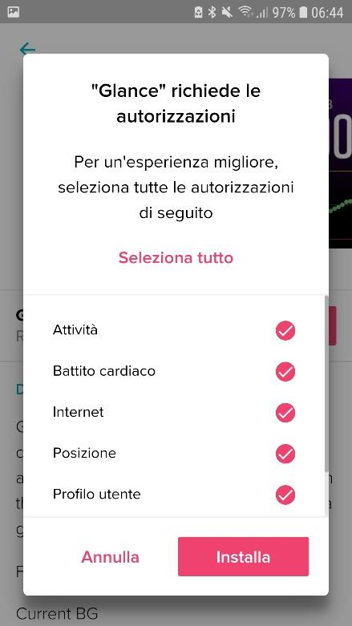

### Fitbit Versa, Versa 2, Versa Lite e Ionic

Installa il quadrante da:
[`https://gallery.fitbit.com/details/7b5d9822-7e8e-41f9-a2a7-e823548c001c`](https://gallery.fitbit.com/details/7b5d9822-7e8e-41f9-a2a7-e823548c001c)

---

## 4. Configura il quadrante

Apri le impostazioni del quadrante dall'app Fitbit e seleziona la sorgente dei dati:

Nella scheda del quadrante **Glance** appena installato, tocca **Impostazioni**:

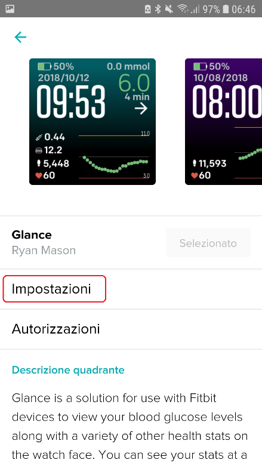

Nella pagina **Settings**, tocca **Data Source** sotto **Data Source Settings**:

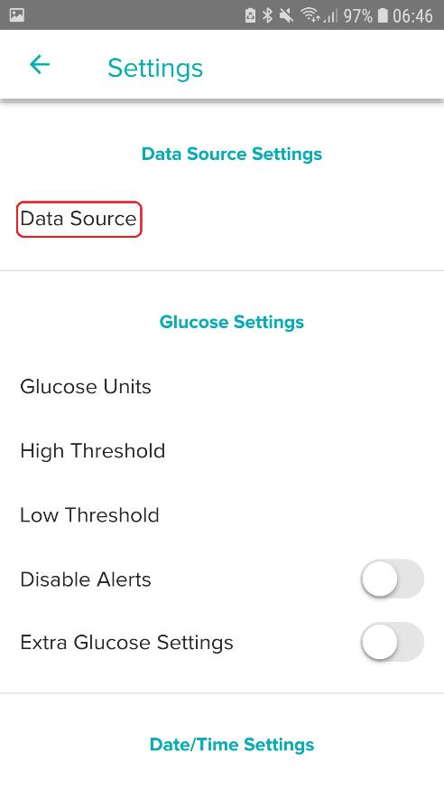

Scegli la sorgente dati tra **Dexcom**, **Nightscout**, **xDrip+**, **Spike**, **Tomato** o **Custom**:

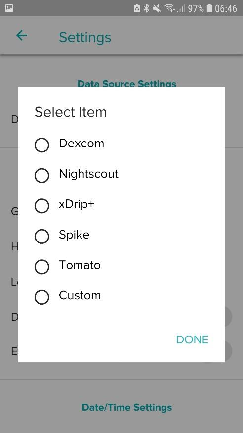

| Sorgente | Nota |
|---|---|
| **Dexcom** | Inserisci le credenziali Dexcom Share |
| **Nightscout** | Inserisci l'URL del sito (mantieni lo `/` finale) |
| **Spike** | Seleziona Spike come sorgente |
| **xDrip / Diabox** | Seleziona xDrip come sorgente |

Se scegli **Dexcom**, inserisci username e password dell'app Dexcom e attiva **International (Not in USA)**:

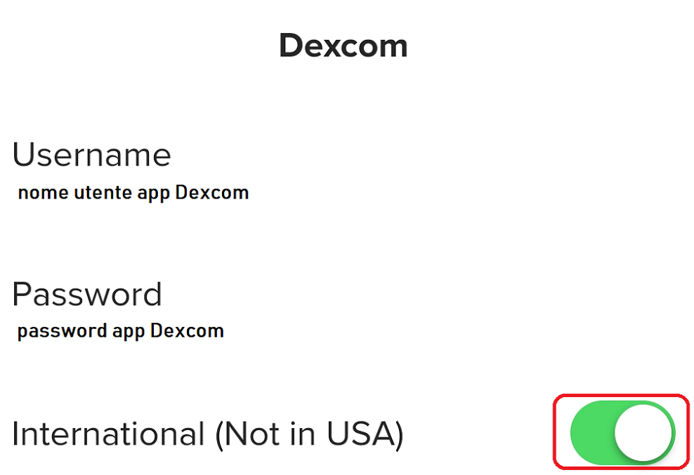

La sorgente impostata comparirà così nella pagina delle impostazioni:

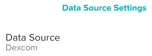

Se scegli **Nightscout**, inserisci solo il **Site Name** (la parte prima di `.herokuapp.com` o del tuo host) senza il resto dell'indirizzo:

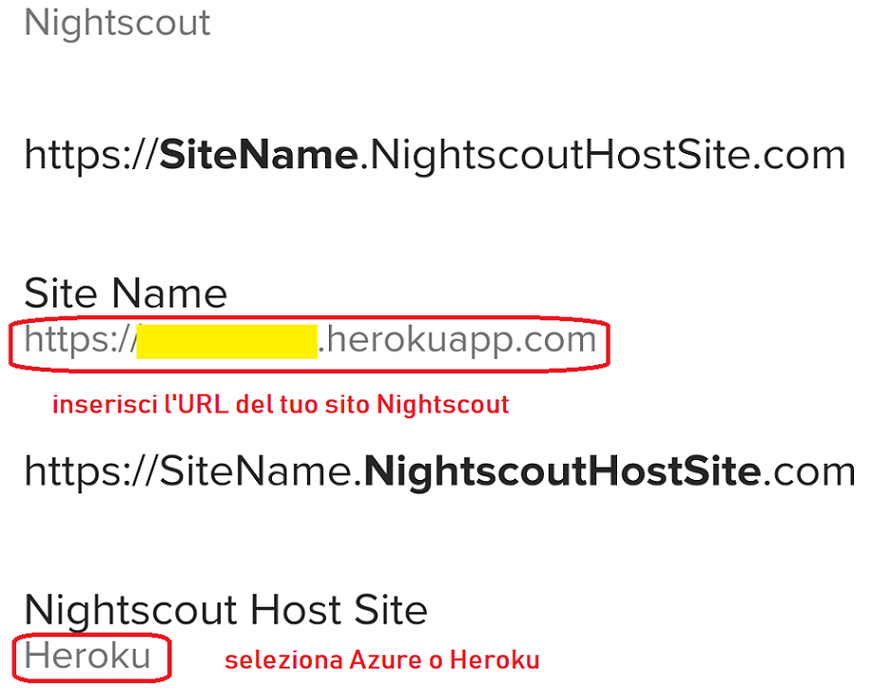

Anche in questo caso, la sorgente impostata comparirà così:

Se scegli **Spike**, la sorgente comparirà così (nessun altro dato da inserire):

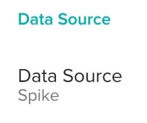

Se scegli **xDrip** (o Diabox tramite xDrip), la sorgente comparirà così:

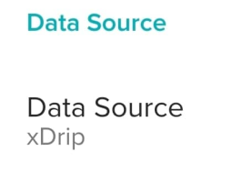

### Altre impostazioni disponibili

| Impostazione | Descrizione |
|---|---|
| Unità di misura | mg/dL |
| Livello glicemia alta | Soglia valore alto |
| Livello glicemia bassa | Soglia valore basso |
| Allarmi | Abilitazione e soglie per ipoglicemia e iperglicemia |
| Tempo di ripetizione allarme | Intervallo dopo il primo snooze |
| Allarme salita/discesa rapida | Avviso per variazioni rapide |
| Allarme dati mancanti | Minuti senza lettura prima dell'avviso |
| Disabilita allarmi quando in range | Silenzia quando la glicemia è nei limiti |
| Visualizzazione ora | 12 o 24 ore |
| Visualizzazione data e giorno | Abilitabile/disabilitabile |
| Grafico esteso | Premendo il display si apre il grafico |
| Colore dello sfondo | Personalizzabile |

Nella sezione **Glucose Settings** imposti unità di misura e soglie alto/basso:

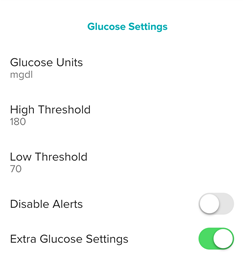

Nella sezione **Alerts** configuri gli allarmi (alto, basso, salita/discesa rapida, dati mancanti) e i relativi tempi di ripetizione:

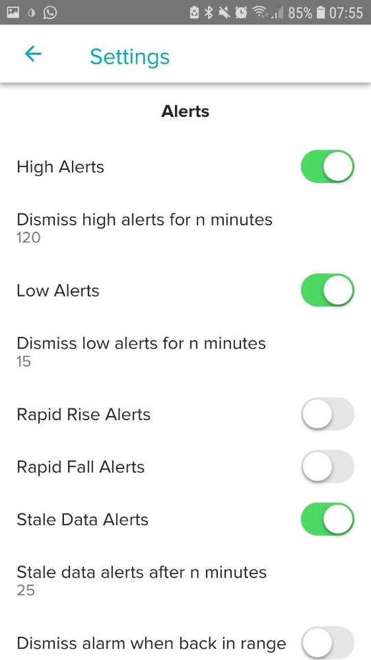

Nella sezione **Date/Time Settings** scegli il formato di ora e data:

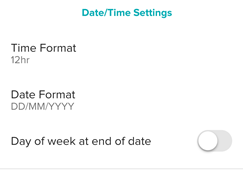

Nella sezione **Layout** puoi attivare il grafico esteso a schermo intero e scegliere il colore di sfondo del quadrante:

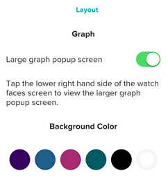
