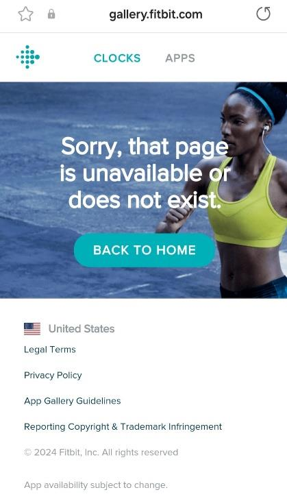
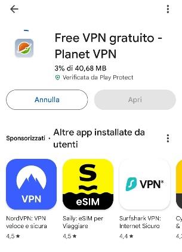
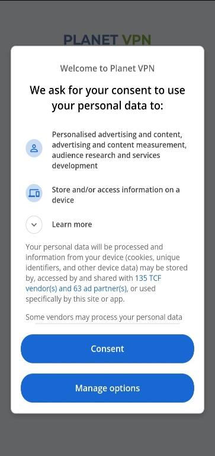
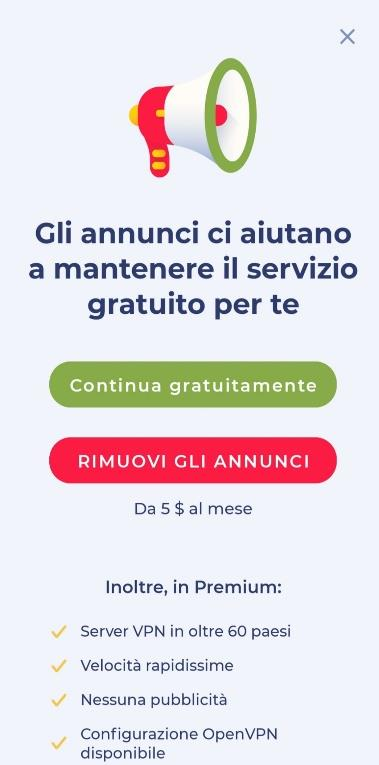
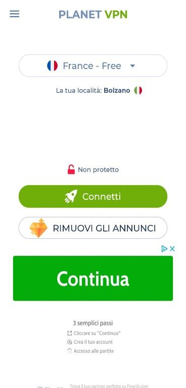
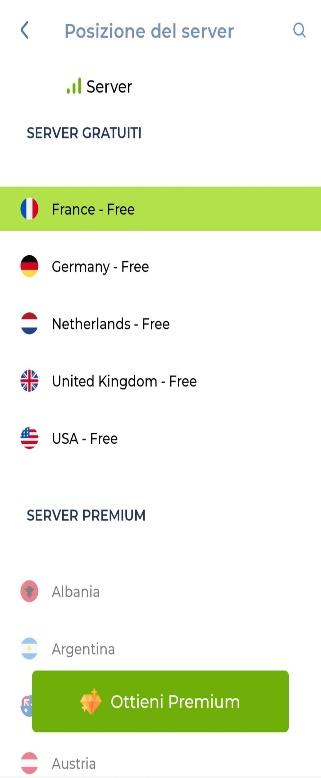
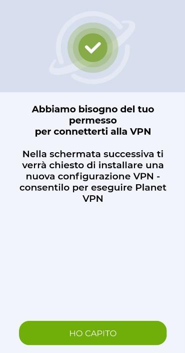
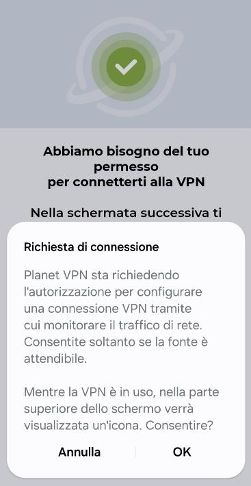
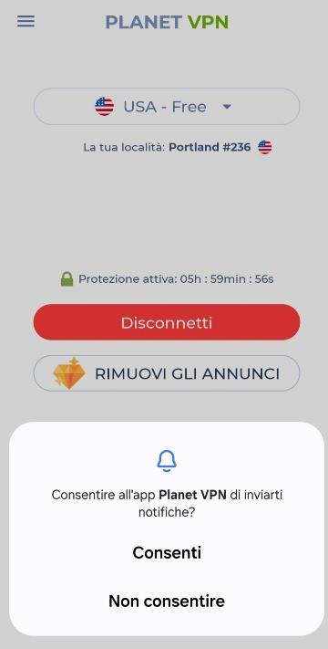
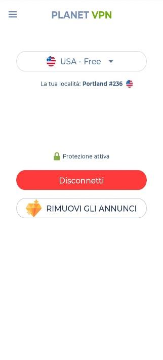

# Fitbit: come sbloccare l'installazione dei quadranti personalizzati

Google ha eliminato dalla galleria app di Fitbit i quadranti e le app di terze parti per gli utenti nello Spazio Economico Europeo (SEE), quindi anche i quadranti dedicati alla glicemia (Glance, Sentinel, ecc.).

> ⚠️ **Attenzione**: sconsigliamo l'acquisto di nuovi dispositivi Fitbit, proprio a causa di questa limitazione.

Se hai provato a installare un quadrante Glance o Sentinel, avrai sicuramente visto questo messaggio:

Per sbloccare l'installazione serve una **VPN**: nascondendo il tuo indirizzo IP dietro una rete privata virtuale, puoi navigare come se ti trovassi negli Stati Uniti, dove Google non ha applicato questa restrizione.

## 1. Installa una VPN gratuita

Scarica **Planet VPN** dal Play Store:

[`https://play.google.com/store/apps/details?id=com.freevpnplanet`](https://play.google.com/store/apps/details?id=com.freevpnplanet)

## 2. Configura la VPN

Apri l'app e accetta le condizioni sul trattamento dei dati toccando **Consent**:

Tocca **Continua gratuitamente** (puoi ignorare l'offerta premium a pagamento):

Nella schermata principale, tocca la freccia accanto al server selezionato:

Dall'elenco dei **server gratuiti**, scegli **USA - Free**:

## 3. Connetti la VPN

Tocca **Connetti** e leggi l'avviso sul permesso necessario: tocca **HO CAPITO**:

Il sistema chiederà di confermare la richiesta di connessione VPN: tocca **OK**:

Se richiesto, consenti anche l'invio di notifiche da Planet VPN:

A connessione riuscita vedrai **Protezione attiva**, con la tua nuova posizione (es. `USA - Free`, `Portland`):

> ℹ️ **Nota**: la versione gratuita di Planet VPN offre **6 ore** di connessione: è sufficiente per scaricare e installare tutti i quadranti che ti servono.

## 4. Installa i quadranti glicemia

Con la VPN attiva, apri questi link dal telefono per installare i quadranti compatibili con il tuo Fitbit:

- **Glance**: [`https://gallery.fitbit.com/details/7b5d9822-7e8e-41f9-a2a7-e823548c001c`](https://gallery.fitbit.com/details/7b5d9822-7e8e-41f9-a2a7-e823548c001c)
- **Sentinel PRO** (Versa 2 e precedenti): [`https://gallery.fitbit.com/details/22b3679c-3bed-4408-985b-0a9f35102207`](https://gallery.fitbit.com/details/22b3679c-3bed-4408-985b-0a9f35102207)
- **Sentinel ELITE** (Sense & Versa 3): [`https://gallery.fitbit.com/details/cf8b889b-b193-4893-abf8-90031d85fe3b`](https://gallery.fitbit.com/details/cf8b889b-b193-4893-abf8-90031d85fe3b)
- **Sentinel ESSENTIAL** (Versa 2, Versa, Ionic, Versa Lite): [`https://gallery.fitbit.com/details/fcd215cc-913f-4345-8d4b-a50e4bf26e0a`](https://gallery.fitbit.com/details/fcd215cc-913f-4345-8d4b-a50e4bf26e0a)
- **Sentinel Basic X**: [`https://gallery.fitbit.com/details/690a4c2a-7f9d-4aa7-9b9a-9b92dd4dbf6a`](https://gallery.fitbit.com/details/690a4c2a-7f9d-4aa7-9b9a-9b92dd4dbf6a)
- **Sentinel One X**: [`https://gallery.fitbit.com/details/0ce56270-984f-4c55-b495-649b3071ec36`](https://gallery.fitbit.com/details/0ce56270-984f-4c55-b495-649b3071ec36)
- **Sentinel 2023** (Sense, Sense 2, Versa 3 e 4): [`https://gallery.fitbit.com/details/3f9f72a0-ecf5-4ff9-aec5-5d553988c85a`](https://gallery.fitbit.com/details/3f9f72a0-ecf5-4ff9-aec5-5d553988c85a)

Per impostare i vari quadranti, segui la guida [Fitbit: Le glicemie di Dexcom, xDrip o Nightscout](./fitbit-le-glicemie-di-dexcom-spike-xdrip-o-nightscout-su-smartwach-versa-e-ionic).
