# Sentinel Pro — Guida utenti

> ⚠️ **Attenzione**: Sentinel ormai è a pagamento.

> ⚠️ **Attenzione**: da maggio 2026 l'app Fitbit è stata sostituita dall'app **Google Health** e le versioni vecchie dell'app non funzionano più. Sui telefoni con **Android 9 o precedente** le sorgenti dati locali (xDrip, Diabox) non sono più utilizzabili: usa **Nightscout** o **Dexcom Share**. Con Android 10 o superiore le sorgenti locali dovrebbero continuare a funzionare, ma il comportamento della nuova app Google Health non è ancora verificato.

**Versione:** `0.1.2`
**Autore:** Ryan Chen — questa guida è stata tradotta dall'originale da glicemiadistanza.it.

Sentinel Pro è un quadrante per orologi Fitbit che ti permette di seguire fino a 3 persone contemporaneamente, con glicemia, grafico e freccia di tendenza per ognuna:

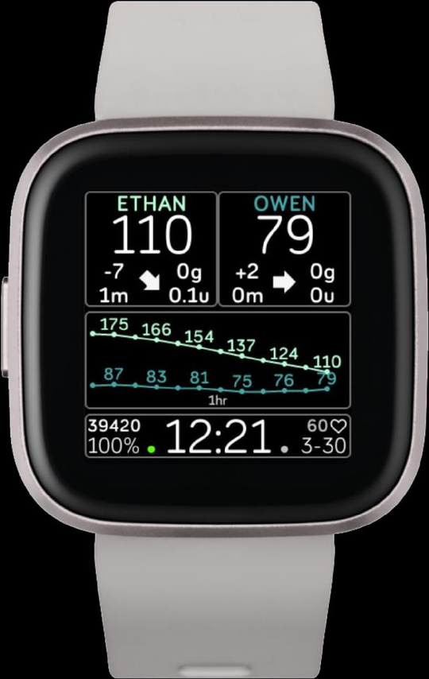

## 1. Caratteristiche

**Sorgenti dati supportate:** Nightscout, Dexcom Share, xDrip, Diabox

**Orologi supportati:** Versa, Versa 2, Versa Lite, Ionic

**Funzionalità principali:**

- Segui da 1 a 3 persone
- Integrazione con Nightscout Careportal
- Visualizzazione dei CHO attivi, ultimo bolo, insulina attiva, ultimo controllo capillare
- Grafico da 30 min, 1 h, 2 h
- Passi giornalieri
- Battito cardiaco

Se segui una sola persona, il quadrante dedica più spazio al grafico (qui a 30 minuti):

Con due persone il quadrante si divide a metà, ognuna con la propria curva sul grafico a 1 ora:

Con 3 persone seguite contemporaneamente (qui Ethan, Owen e un profilo di prova "Robot"), lo spazio per ciascuna curva si riduce ulteriormente:

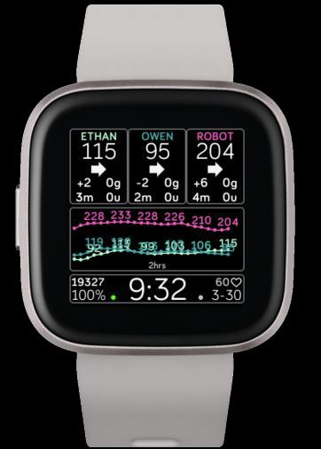

**Allarmi e Snooze:**

- Allarme glucosio alto
- Allarme glucosio basso
- Allarme Delta crescente (soglia definita dall'utente)
- Allarme Delta calante (soglia definita dall'utente)
- Allarme freccia in su (tendenza)
- Allarme freccia in giù (tendenza)
- Allarme dati vecchi (soglia definita dall'utente)
- Allarme Ninja (nuovo): nessun messaggio pop-up né tasto di conferma

## 2. Visualizzazione

Gli elementi visualizzati sul quadrante sono:

- **Nome account** — il nome assegnato alla persona seguita
- **Glicemia da sensore** — visualizzabile in mg/dl o mmol
- **Carboidrati attivi (COB)** — dati provenienti da Nightscout
- **Delta glicemico** — differenza tra 2 valori glicemici consecutivi
- **Insulina attiva (IOB)** — dati provenienti da Nightscout
- **Tempo dall'ultima lettura** — minuti trascorsi dall'ultimo dato glicemico ricevuto (tipicamente 0-5 min)
- **Freccia di tendenza** — freccia di tendenza standard, può variare
- **Contapassi (STEPS)** — passi giornalieri
- **Grafico** — visualizzabile a 30 min, 1 h o 2 h
- **Battito cardiaco**
- **Data**
- **Batteria orologio**
- **Indicatore di connessione** — mostra la richiesta e ricezione dati tra telefono e orologio
- **Ora** — formato 12HR o 24HR

### Inviare i trattamenti a Nightscout

Dal quadrante puoi inviare trattamenti a Nightscout tramite Careportal, senza dover usare il telefono. Ecco le schermate di inserimento:

- Menu **CAREPORTAL** da cui scegliere il tipo di trattamento (**BG**, **CARBS**, **MEAL**, **BOLUS**):

- Inserimento carboidrati (**CARBS**):

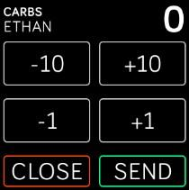

- Controllo capillare (**BG CHECK**):

- Inserimento bolo (**BOLUS**):

- Riepilogo **HISTORY & CAREPORTAL**: mostra l'ultimo carico di carboidrati, l'insulina e la glicemia inseriti, con il tempo trascorso:

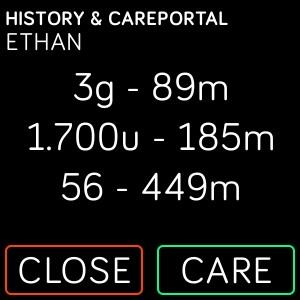

- Quando l'invio va a buon fine, il quadrante conferma con **CAREPORTAL ENTRY RECEIVED**:

## 3. Funzioni

### Tasto Account

Toccando il riquadro dell'account accedi allo storico (history) e a Nightscout Careportal per l'inserimento dei trattamenti. Nelle impostazioni del telefono (**MISC SETTINGS**) puoi anche personalizzare gli incrementi del bolo:

### Tasto Grafico

Toccando il grafico cambi l'ampiezza tra 30 min, 1 h e 2 h. A 2 ore:

A 1 ora:

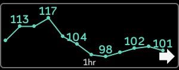

A 30 minuti:

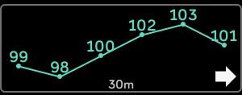

### Allarme Ninja

L'allarme Ninja annulla tutti gli altri allarmi: niente messaggi pop-up né tasto di conferma. Si imposta nelle impostazioni dell'app del telefono. Durante un allarme attivo i riquadri diventano rossi: tieni premuto per attivare la funzione Ninja. Il quadrato verde sul quadrante indica che l'allarme Ninja è attivo:

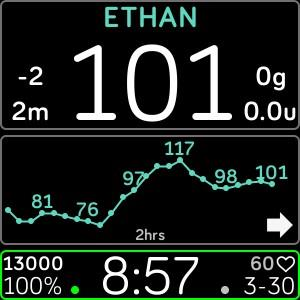

Nelle impostazioni del telefono puoi regolare la durata dello snooze e della vibrazione (buzz) del Ninja:

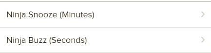

Ecco il quadrante Sentinel Pro visto direttamente su un Fitbit Versa al polso, con due persone seguite:

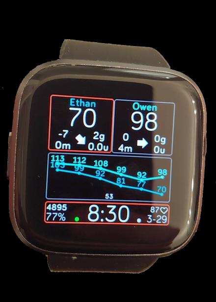

E lo stesso quadrante con due persone seguite e il grafico a 1 ora:

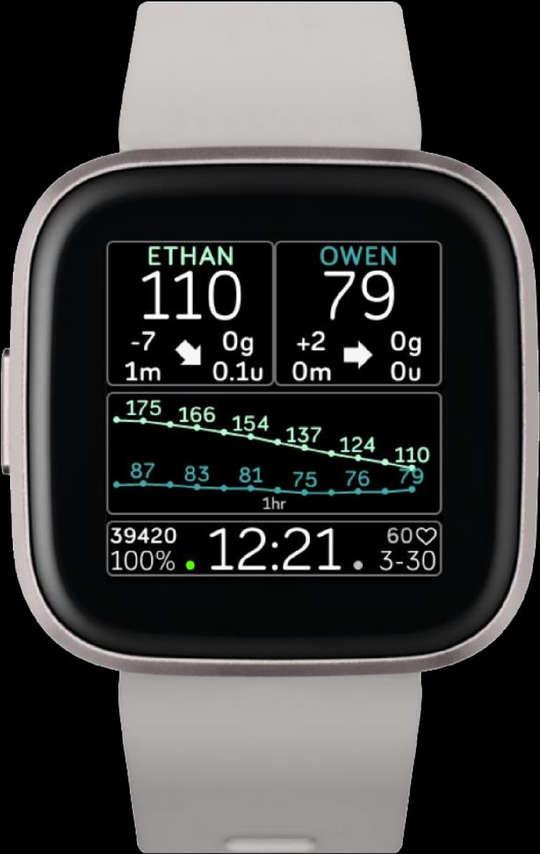

## 4. Indicatori

### Connessione e comunicazione

L'indicatore di connessione mostra lo stato del canale di comunicazione (Peersocket) tra orologio e telefono, con la richiesta e ricezione dei dati:

| Stato Peersocket | Modalità | Operazione |
|---|---|---|
| APERTO | Usa messaggi | Richiesta dati / Ricezione dati |
| CHIUSO | Trasferimento file | Richiesta dati / Prova trasferimento file |
| ERRORE | — | Fallimento richiesta |
| NESSUNO STATO | — | Standby |

### Uso con Nightscout protetto da token

Se la tua pagina Nightscout è protetta, devi creare un token di accesso e inserirlo nelle impostazioni del quadrante:

1. Vai alla tua pagina Nightscout, apri il menu in alto a destra e clicca su **Admin Tools**:

2. Premi **Add new Subject** (Aggiungi nuovo soggetto), scrivi il nome e nel campo **Roles** scrivi `admin`, poi premi **Save**:

3. Il nuovo soggetto compare nella tabella **Subjects**: copia il codice generato sotto **Access Token** (Gettone d'accesso):

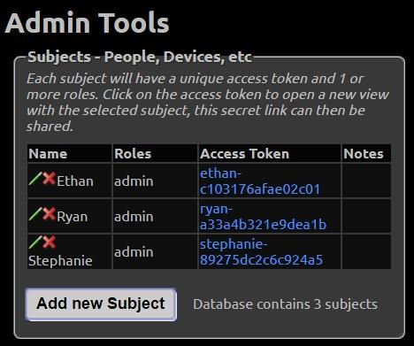

4. Incolla il token nelle impostazioni del quadrante sul telefono, nel campo **NS Careportal Token**, e salva:

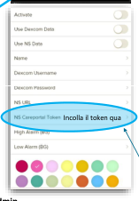

Nella stessa schermata di impostazioni trovi anche l'indirizzo di Nightscout (**NS URL**), le credenziali Dexcom e le soglie di allarme:

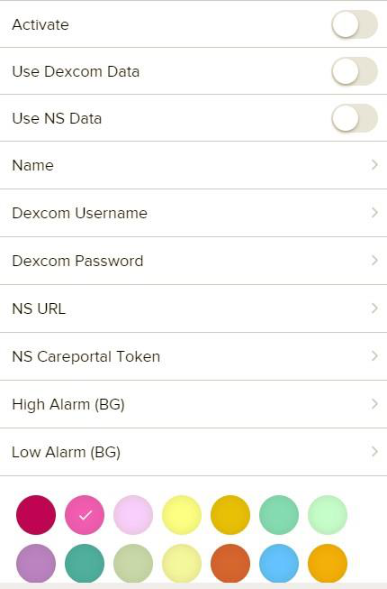

## 5. Careportal

Ecco il menu Careportal visto direttamente sull'orologio:

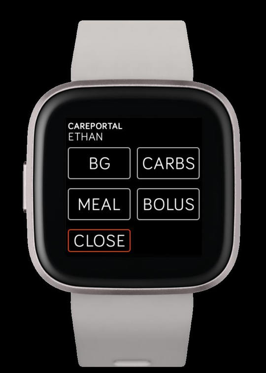

### Impostazioni degli account

Prima imposta tutto, dopo abilita **Activate**:

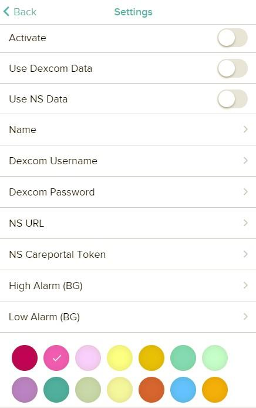

> ⚠️ **Attenzione**: IMPORTANTE! Ricordati di attivare l'interruttore **Activate**, altrimenti l'account non viene visualizzato.

- Si possono usare contemporaneamente sia Dexcom Share che Nightscout: in questo modo puoi avere le glicemie da Dexcom e i trattamenti da Nightscout tramite NS Careportal.
- È presente un allarme automatico se Dexcom Share non è disponibile (down).
- Nel campo **NS URL** non inserire la `/` finale: l'indirizzo deve terminare con `.com`.
- Se usi Dexcom Share come sorgente dati, devi attivare la condivisione (Share) dall'app Dexcom: dal telefono master devi avere almeno un telefono follower attivo.

### Impostazioni degli allarmi

Ogni account ha le proprie soglie di allarme. Puoi impostare gli intervalli di ripetizione (**SET ALARM SNOOZE INTERVALS**) per ogni tipo di allarme, inclusi lo snooze e il buzz del Ninja:

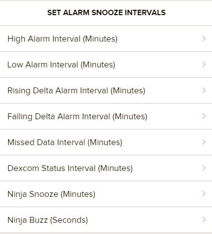

Puoi attivare o disattivare singolarmente ogni allarme (**ACTIVATE / DISABLE ALARMS**), incluso lo spegnimento automatico degli allarmi durante la carica (**Alarms OFF when CHARGING**):

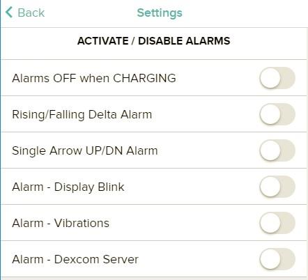

E puoi impostare le soglie numeriche degli allarmi Delta crescente, Delta calante e dati mancanti (**SET BG ALARM THRESHOLDS**):

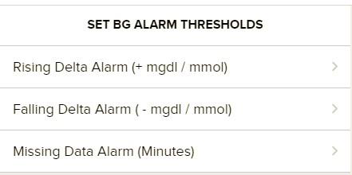

### Impostazioni varie

Nelle impostazioni varie (**MISC SETTINGS**) trovi gli incrementi personalizzati del bolo — utili per chi usa la penna, ad esempio `1u` o `0.5u` — le unità mmol, l'orologio a 24 ore e la compatibilità con Nightscout in modalità legacy (`API v1`):

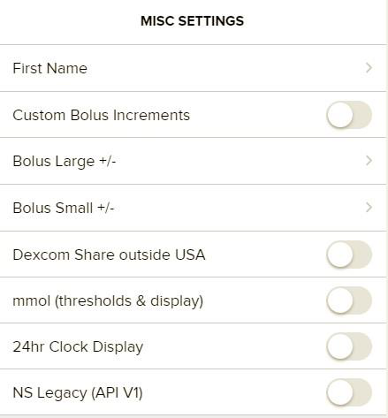

> ⚠️ **Attenzione**: Per favore prenditi il tempo per inserire tutti i dati nelle impostazioni prima di usare il quadrante.

## 6. Informazioni e supporto

Sentinel Pro (marzo 2020) indossato su un Fitbit Ionic, con le barre di soglia allarme visibili accanto a ogni grafico:

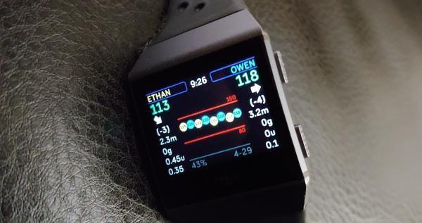

Il quadrante Sentinel per il Fitbit è stato creato da Ryan Chen, papà di due bambini con diabete di tipo 1, Ethan e Owen, ed è ancora adesso in sviluppo. Se hai domande o commenti, per favore pubblicali nella pagina Facebook del gruppo Sentinel:

[`https://www.facebook.com/groups/3185325128159614/`](https://www.facebook.com/groups/3185325128159614/)

> ⚠️ **Attenzione**: Questo quadrante è solo per supporto e non deve essere usato per prendere decisioni mediche.

Preparati a errori di connessione che capiteranno di tanto in tanto:

1. Qualche volta sarà necessario cambiare quadrante e poi tornare al quadrante Sentinel per risolvere alcuni problemi.
2. In altri casi sarà necessario riavviare l'app del telefono, o riavviare il telefono, per risolvere il problema.

### Le versioni di Sentinel

Oltre a Sentinel Pro esistono altre versioni del quadrante: **Sentinel Classic** (la versione originale, di aprile 2019), **Sentinel One** e **Sentinel Basic**:

All'epoca della guida originale Sentinel era gratis per tutti (ora è a pagamento). Se vuoi supportare il progetto puoi fare una donazione tramite PayPal: [`https://paypal.me/ryanwchen`](https://paypal.me/ryanwchen)
