# Sentinel One — Guida utenti

> ⚠️ **Attenzione**: Sentinel ormai è a pagamento.

**Versione:** 1.0
**Autore:** Ryan Chen — guida adattata e tradotta per glicemiadistanza.it.

Sentinel One è un quadrante per Fitbit creato da Ryan Chen come variante di Sentinel, il quadrante che permette di monitorare la glicemia di 1-3 persone. Sentinel One è dedicato al monitoraggio di una sola persona: glicemia, freccia di tendenza e grafico sono ben in vista, con caratteri grandi e icone semplici:

## 1. Compatibilità

**Smartwatch supportati:** Fitbit Ionic, Sense, Versa/Versa 2, Versa Lite

Ecco il quadrante su Fitbit Ionic:

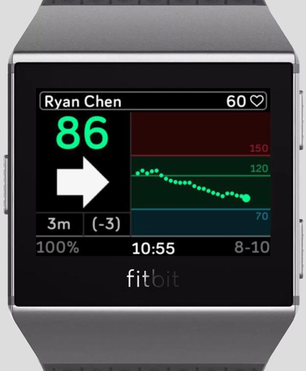

Su Versa Lite:

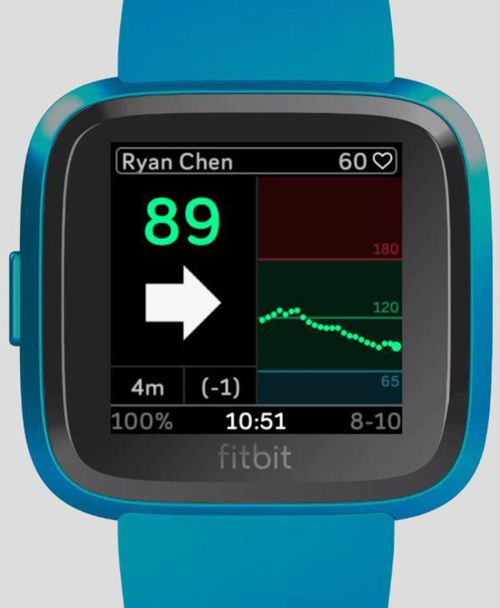

E su Versa:

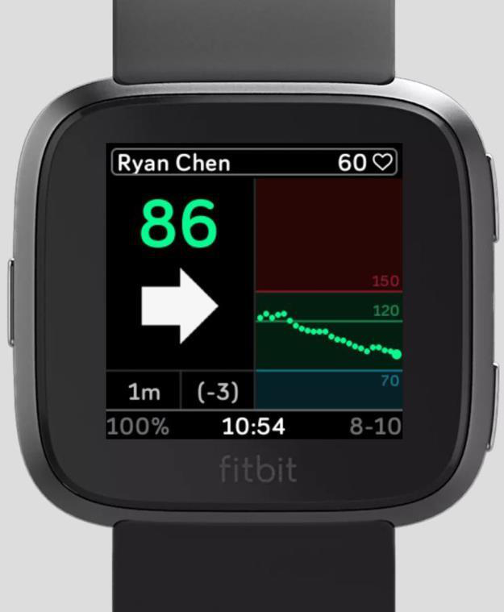

## 2. Perché Sentinel One?

Sentinel One è stato creato pensando ai bambini con diabete di tipo 1: serve a controllare la glicemia, imparare a rispondere agli allarmi, leggere il grafico e mandare messaggi e trattamenti a Nightscout in autonomia. Offre:

- **Aspetto pulito** e minimalista
- **Supporto per Nightscout Careportal**
- **Icone semplici** e intuitive

L'icona goccia di sangue richiama subito il controllo capillare della glicemia, anche per i bambini più piccoli:

Le pastiglie di glucosio hanno la loro icona dedicata:

L'obiettivo è che anche a scuola, in classe, il quadrante sia facile da leggere e da usare in autonomia:

## 3. Installazione

> ⚠️ **Attenzione**: in passato, sui telefoni con **Android 9 o precedente**, per usare xDrip come sorgente dati serviva installare la vecchia versione `3.58` dell'app Fitbit. Dal 15 luglio 2026 le versioni dell'app precedenti alla 5.0 non funzionano più (l'app Fitbit è stata sostituita dall'app **Google Health**), quindi questo espediente non è più possibile: su questi telefoni usa **Nightscout** o **Dexcom Share** come sorgente dati. Se usi Nightscout, Dexcom Share o hai Android 10 o superiore, questo passaggio non è necessario.

Con il telefonino abbinato al Fitbit, vai al link corrispondente al tuo orologio per installare il quadrante:

- **Sentinel PRO** (Versa 2 e precedenti): [`https://gallery.fitbit.com/details/22b3679c-3bed-4408-985b-0a9f35102207`](https://gallery.fitbit.com/details/22b3679c-3bed-4408-985b-0a9f35102207)
- **Sentinel ELITE** (Sense & Versa 3): [`https://gallery.fitbit.com/details/cf8b889b-b193-4893-abf8-90031d85fe3b`](https://gallery.fitbit.com/details/cf8b889b-b193-4893-abf8-90031d85fe3b)
- **Sentinel ESSENTIAL** (Versa 2, Versa, Ionic, Versa Lite): [`https://gallery.fitbit.com/details/fcd215cc-913f-4345-8d4b-a50e4bf26e0a`](https://gallery.fitbit.com/details/fcd215cc-913f-4345-8d4b-a50e4bf26e0a)
- **Sentinel X**: [`https://gallery.fitbit.com/details/9d579c8f-57e8-434b-9494-d0213c8064af`](https://gallery.fitbit.com/details/9d579c8f-57e8-434b-9494-d0213c8064af)
- **Sentinel Basic X**: [`https://gallery.fitbit.com/details/690a4c2a-7f9d-4aa7-9b9a-9b92dd4dbf6a`](https://gallery.fitbit.com/details/690a4c2a-7f9d-4aa7-9b9a-9b92dd4dbf6a)
- **Sentinel One X**: [`https://gallery.fitbit.com/details/0ce56270-984f-4c55-b495-649b3071ec36`](https://gallery.fitbit.com/details/0ce56270-984f-4c55-b495-649b3071ec36)

1. Apri il link dal telefono: si apre la pagina della galleria Fitbit con il quadrante e il tasto **OPEN APP**.

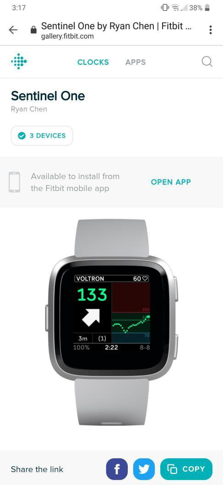

2. Nell'app Fitbit tocca la miniatura del quadrante per vederne i dettagli, poi premi **Select** per installarlo sull'orologio.

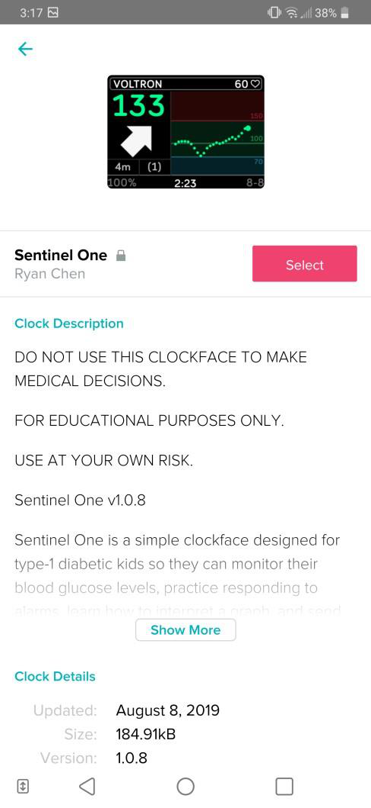

3. Una volta installato, il tasto mostra **Selected**: da qui puoi accedere anche a **Settings** e **Permissions**.

4. Tocca **Settings** per aprire la schermata di configurazione (**USER ACCOUNT 1**), dove imposterai la tua sorgente dati:

## 4. Impostazioni e sorgenti dati

Nella schermata **Settings** trovi tutti i campi dell'account:

- **Activate** — attiva l'account (da abilitare per ultimo, quando tutto è configurato)
- **Use Local xDrip+** — legge i dati direttamente da xDrip (o Diabox) sul telefono
- **Use Dexcom Data** — legge i dati dai server Dexcom Share
- **Use NS Data** — legge i dati da Nightscout
- **Use NS Raw BG** — legge anche i dati grezzi del sensore da Nightscout
- **Name** — il nome visualizzato sul quadrante
- **Dexcom Username** / **Dexcom Password** — le credenziali Dexcom
- **NS URL** — l'indirizzo della tua pagina Nightscout
- **NS Careportal Token** — il token di accesso a Careportal (opzionale)

In fondo alla schermata puoi anche scegliere il colore del quadrante. Le sezioni che seguono spiegano come impostare le diverse sorgenti di dati.

### Sorgente dati: Nightscout

1. In **Name** inserisci il nome da visualizzare sul quadrante.
2. In **NS URL** metti l'indirizzo della tua pagina Nightscout.
3. Metti **on** l'interruttore **Use NS Data**.
4. Metti **on** l'interruttore **Activate**.
5. (Opzionale) Se hai un token di accesso a Careportal, mettilo in **NS Careportal Token**.

La schermata configurata per Nightscout è questa:

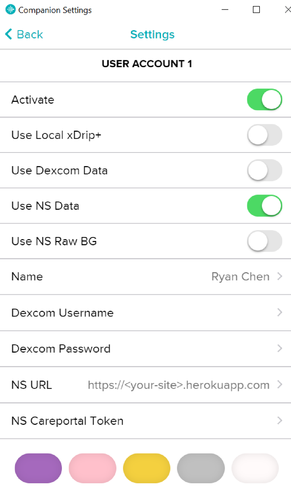

Il token si crea dalla tua pagina Nightscout in **Admin Tools**, con un soggetto con ruolo `admin`: copia il codice della colonna **Access Token**. Trovi la procedura passo-passo nella [guida di Sentinel Pro](sentinel-pro-userguide1.md#uso-con-nightscout-protetto-da-token).

### Sorgente dati: Dexcom Share

> ℹ️ **Nota**: ricordati che per usare il quadrante devi avere un follower attivo nell'app Dexcom.

Verifica che la condivisione (**Condivisione**) sia attiva nell'app Dexcom e che ci sia almeno un follower connesso:

1. In **Name** inserisci il nome da visualizzare sul quadrante.
2. In **Dexcom Username** e **Dexcom Password** metti login e password Dexcom Share (verifica che siano giusti facendo login su Dexcom Clarity).
3. Metti **on** l'interruttore **Use Dexcom Data**.
4. Metti **on** l'interruttore **Activate**.

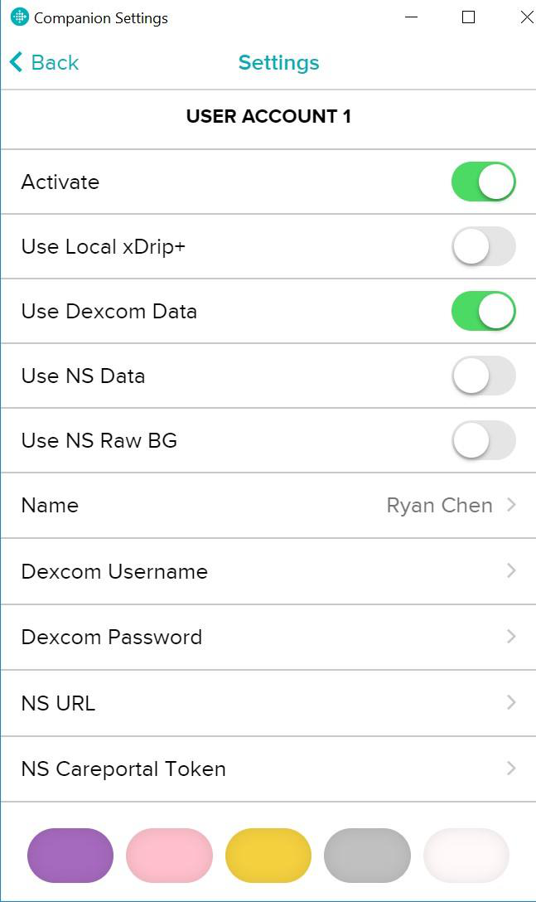

> ⚠️ **Attenzione**: verifica di avere abilitato il server Dexcom Share fuori dagli USA: scorri in fondo alle impostazioni e metti **on** l'interruttore **Dexcom Share outside USA** (vedi la sezione 6).

### Sorgente dati: Nightscout + Dexcom Share

Puoi usare le due sorgenti insieme: le glicemie arrivano da Dexcom Share e i trattamenti da Nightscout Careportal.

1. In **Name** inserisci il nome da visualizzare sul quadrante.
2. In **Dexcom Username** e **Dexcom Password** metti login e password Dexcom Share (verifica con Clarity).
3. In **NS URL** metti l'indirizzo della tua pagina Nightscout.
4. (Opzionale) In **NS Careportal Token** metti il token Nightscout.
5. Metti **on** gli interruttori **Use Dexcom Data**, **Use NS Data** e per ultimo **Activate**.

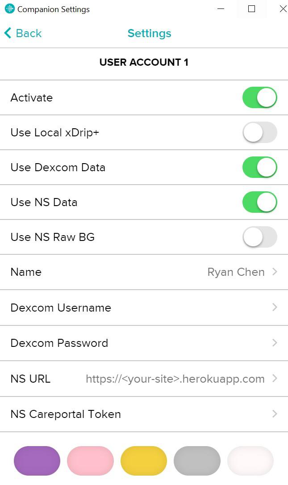

### Sorgente dati: xDrip o Diabox (Local Web Server)

In questa modalità il quadrante legge i dati direttamente dal servizio web locale (`Local Web Server`) di xDrip o Diabox sul telefono, senza passare da Nightscout. Assicurati che in xDrip il servizio web locale sia abilitato.

1. In **Name** inserisci il nome da visualizzare sul quadrante.
2. Metti **on** l'interruttore **Use Local xDrip+**.
3. Metti **on** l'interruttore **Activate**.

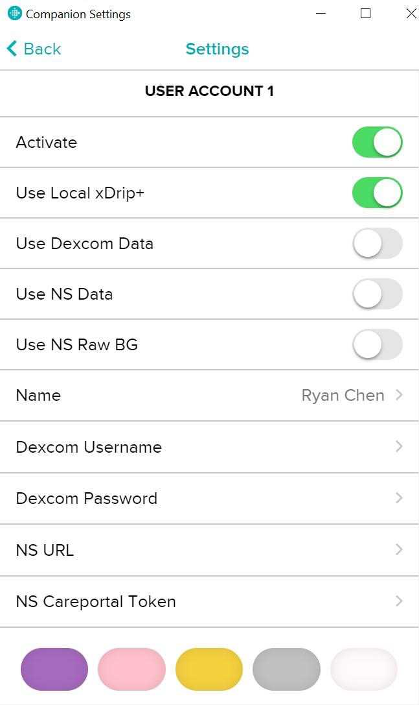

### Sorgente dati: xDrip + Nightscout (Uploader to NS)

In questa modalità xDrip carica i dati su Nightscout (`Uploader to NS`) e il quadrante li legge dalla tua pagina Nightscout.

1. In **Name** inserisci il nome da visualizzare sul quadrante.
2. In **NS URL** metti l'indirizzo della tua pagina Nightscout.
3. Metti **on** l'interruttore **Use NS Data**.
4. Metti **on** l'interruttore **Activate**.
5. (Opzionale) Metti **on** l'interruttore **Use NS Raw BG** per leggere anche i dati grezzi: solo per FSL e Dexcom G5.

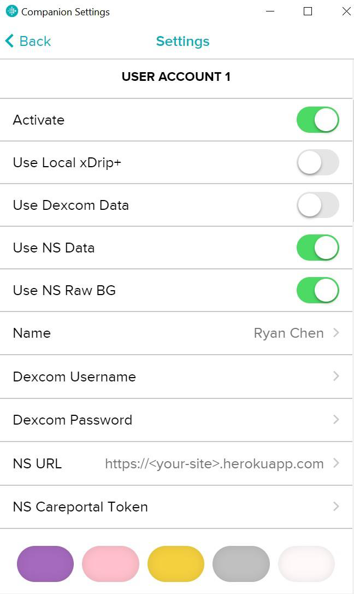

## 5. Allarmi

### Abilitare e disabilitare gli allarmi

Nella schermata **ACTIVATE / DISABLE ALARMS** puoi attivare o disattivare singolarmente ogni allarme:

- **Alarms OFF when CHARGING** — allarmi disabilitati durante la carica
- **Rising/Falling Delta Alarm** — allarme salita o discesa veloce (Delta)
- **Single Arrow UP/DN Alarm** — allarme salita o discesa (freccia di tendenza)
- **Active Alarm Display** — fa lampeggiare il display per un allarme
- **Active Alarm Haptics** — vibrazione per un allarme

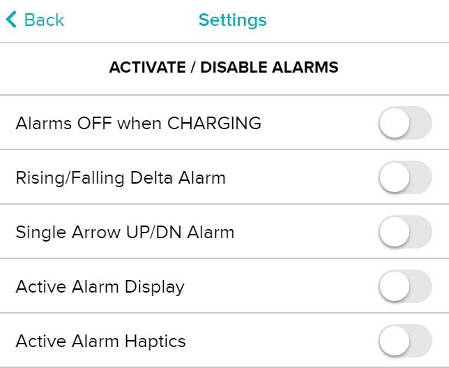

### Soglie di allarme e silenziamento

Nella schermata **SET BG ALARM THRESHOLDS** imposti le soglie di allarme:

- **Target (BG)** — il valore obiettivo della glicemia
- **High Alarm (BG)** — soglia dell'allarme glicemia alta
- **Low Alarm (BG)** — soglia dell'allarme glicemia bassa
- **Rising Delta Alarm** — soglia di salita veloce (+ `mgdl`/`mmol`)
- **Falling Delta Alarm** — soglia di discesa veloce (− `mgdl`/`mmol`)
- **Missing Data Alarm (Minutes)** — allarme dati mancanti, in minuti

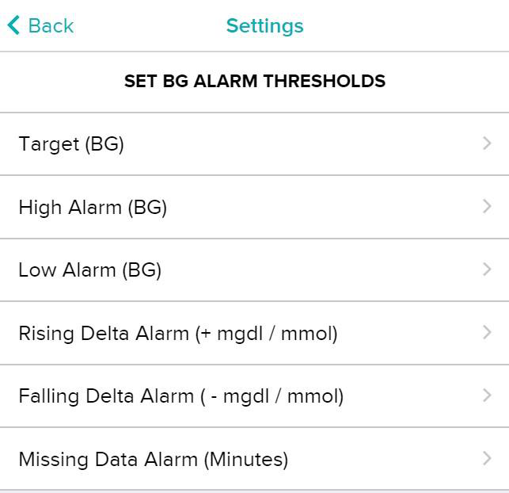

E nella schermata **SET ALARM SNOOZE INTERVALS** gli intervalli di ripetizione (snooze) in minuti per ciascun tipo di allarme, così da non essere avvisato troppo spesso per lo stesso evento:

## 6. Impostazioni varie e Careportal

Nella schermata **MISC SETTINGS** trovi le impostazioni di Careportal e le altre opzioni:

- **First Name** — nome visualizzato per i trattamenti in Careportal
- **Use Careportal** — abilita/disabilita NS Careportal
- **Use NS Messages** — abilita/disabilita le note in NS Careportal
- **Use NS Heart Rate** — abilita/disabilita l'invio del battito cardiaco a NS Careportal
- **Heart Rate Interval (Minutes)** e **Heart Rate Threshold (BPM)** — intervallo e soglia del battito cardiaco
- **Dexcom Share outside USA** — server Dexcom Share internazionale
- **mmol (thresholds & display)** — unità `mmol` per soglie e visualizzazione
- **24hr Clock Display** — ora in formato 24 ore

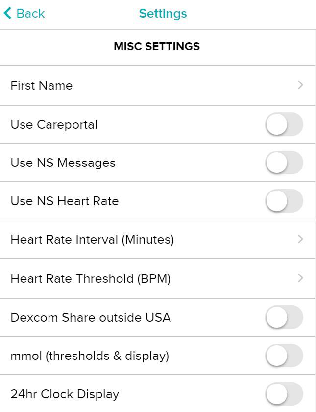

> ⚠️ **Attenzione**: IMPORTANTE, per gli utenti fuori dagli USA l'interruttore **Dexcom Share outside USA** deve essere ABILITATO.

## 7. Mandare note e trattamenti a Nightscout

Dal quadrante puoi mandare note (messaggi) e trattamenti a Nightscout Careportal, senza usare il telefono.

### Versa e Versa Lite: mandare note

Dal quadrante:

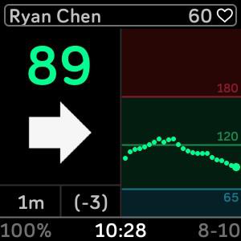

si apre la schermata **REPORTING OPTIONS**, con le due scelte **Message** (note) e **Careportal** (trattamenti):

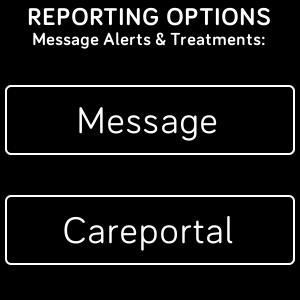

Se scegli **Message**, puoi mandare a Nightscout una conferma (**Confirm**) o il tuo stato (**Status**):

Con **Confirm** confermi di aver finito uno spuntino (**SNACK**), il glucosio (**GLUCOSE**), un pasto (**MEAL**) o un succo (**JUICE**):

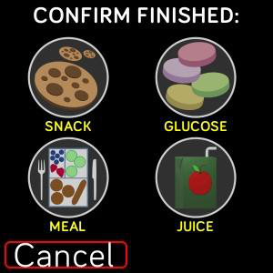

Con **Status** indichi cosa stai facendo in quel momento: mangiare (**EATING**), essere in classe (**IN CLASS**), fare attività (**PLAYING**) o sentirti in ipoglicemia (**FEEL LOW**):

La nota arriva subito su Nightscout: qui ad esempio uno stato di ipoglicemia (**"Ryan reports feeling LOW!"**) mostrato in cima alla pagina:

### Versa e Versa Lite: mandare trattamenti

Dal quadrante:

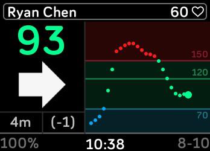

apri **REPORTING OPTIONS** e scegli **Careportal**: puoi inviare un controllo glicemico (**BG CHECK**), un pasto (**MEAL**), i carboidrati (**CARBS**) o un bolo (**BOLUS**). In alto vedi il riepilogo dell'ultimo bolo e degli ultimi carboidrati inseriti:

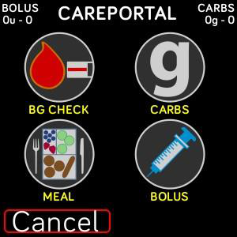

Ogni voce apre un tastierino dedicato. Per il controllo glicemico regoli il valore con **±1** e **±10**, poi premi **Send**:

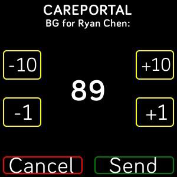

Per i carboidrati regoli i grammi con **±1** e **±10**, poi premi **Next**:

E per il bolo regoli le unità a piccoli (**±Sm**) o grandi (**±Lg**) incrementi, poi premi **Send**. Con **MEAL** inserisci prima i carboidrati e poi il bolo, in sequenza:

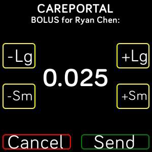

Il trattamento compare subito su Nightscout: il pasto inserito appare sul grafico (**MEAL ENTRY ADDED**, qui `12 g` e `0.6 U`):

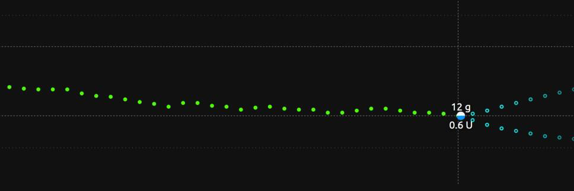

E i carboidrati e l'insulina attivi (**COB** e **IOB**) si aggiornano:

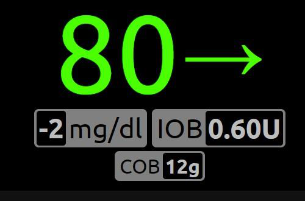

### Ionic: mandare note e trattamenti

Su Fitbit Ionic le schermate sono le stesse, in formato orizzontale. Il menu **Careportal**:

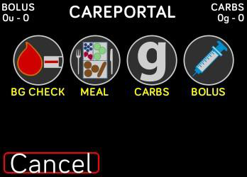

Le note **Confirm**:

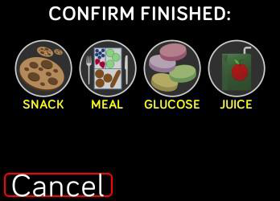

Le note **Status**:

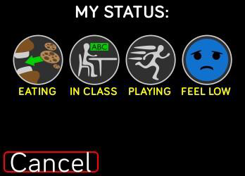

Il tastierino del bolo:

Il tastierino del controllo glicemico:

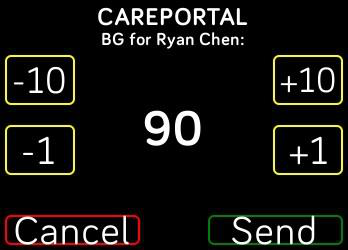

E il tastierino dei carboidrati:

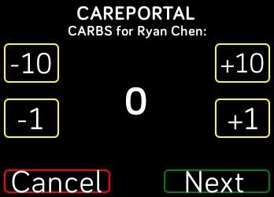

## 8. Tornare alla pagina delle impostazioni

Se hai bisogno di modificare le impostazioni del quadrante in un secondo momento:

1. Apri l'app **Fitbit** sul telefono e tocca l'icona del tuo orologio, in alto a destra.

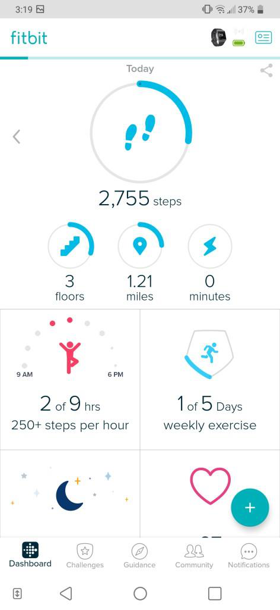

2. Nella pagina dell'orologio tocca **Clock Faces** (quadranti).

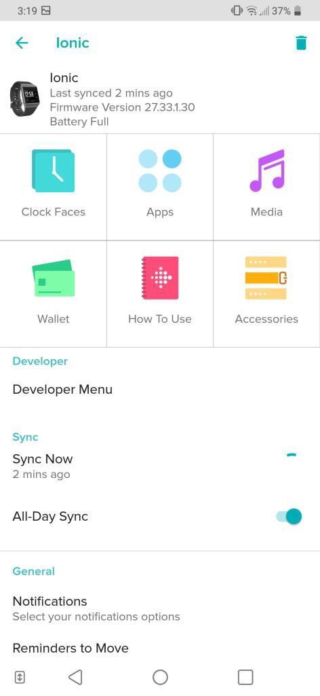

3. Nella scheda **MY IONIC** (o del tuo orologio) tocca il quadrante attivo.

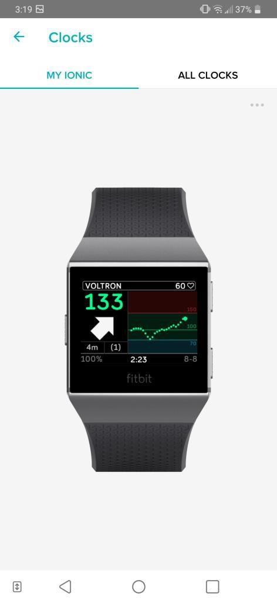

4. Nella pagina di Sentinel One tocca **Settings**.

5. Si riapre la pagina delle impostazioni, con le sorgenti dati, gli allarmi e le impostazioni varie.

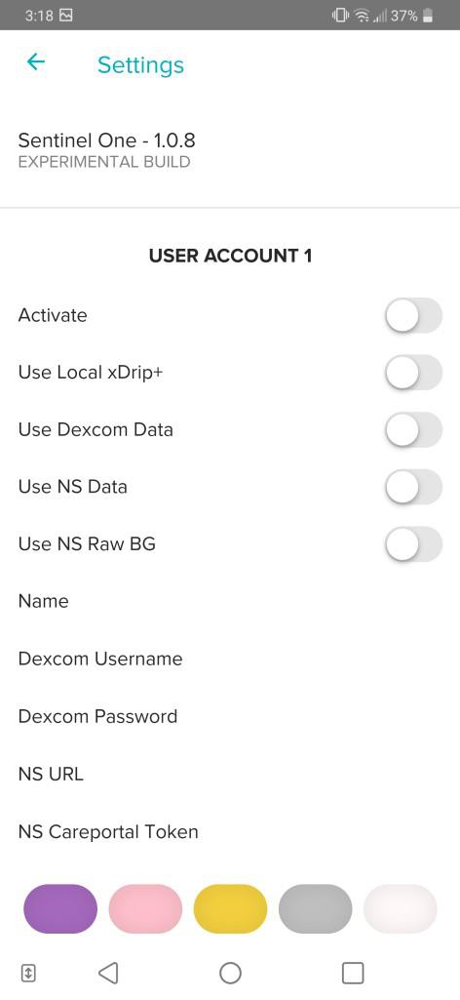

## 9. Avviso legale

> ⚠️ **Attenzione**: *Sentinel One è a solo scopo informativo. Non usarlo per prendere decisioni mediche. L'uso è a proprio rischio. Questo quadrante è ancora in sviluppo. Per aggiornamenti e supporto, unisciti al gruppo Facebook Sentinel: [`https://www.facebook.com/groups/3185325128159614`](https://www.facebook.com/groups/3185325128159614)*

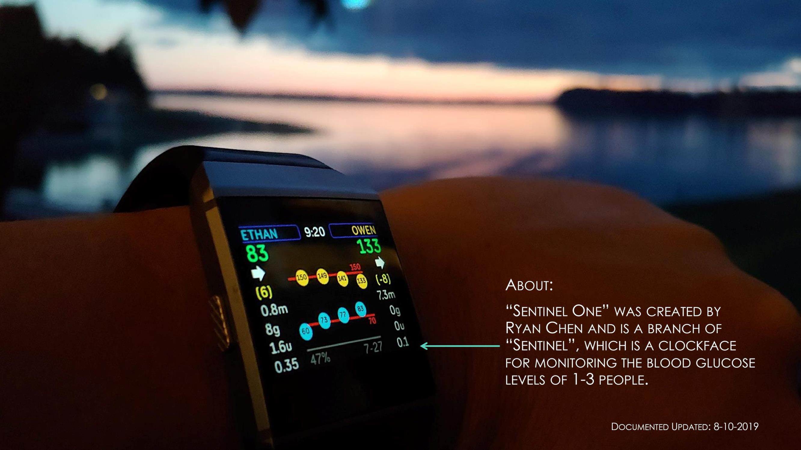
