# Glicemia su smartwatch Garmin tramite Nightscout

Questa guida spiega come visualizzare i valori di glicemia trasmessi da Nightscout sui modelli Garmin compatibili, tramite le app disponibili su **Connect IQ** (lo store ufficiale di Garmin).

Traduzione e integrazione della guida originale di Paweł Babańczyk: [`http://nightscout.pl/smartwatch/garmin/`](http://nightscout.pl/smartwatch/garmin/)

Autore: Gianluca Curci.

Dispositivi confermati dalla comunità:
- Vivoactive HR
- Garmin Fenix 3, Fenix 5
- Forerunner 630, 735XT, 750

Le istruzioni seguenti si basano sul modello **Forerunner 735XT** su Android. Su iPhone il procedimento è analogo tramite l'app Garmin Connect da App Store.

---

## 1. Installa Garmin Connect

Installa l'app **Garmin Connect** dal Google Play Store (o App Store su iPhone).

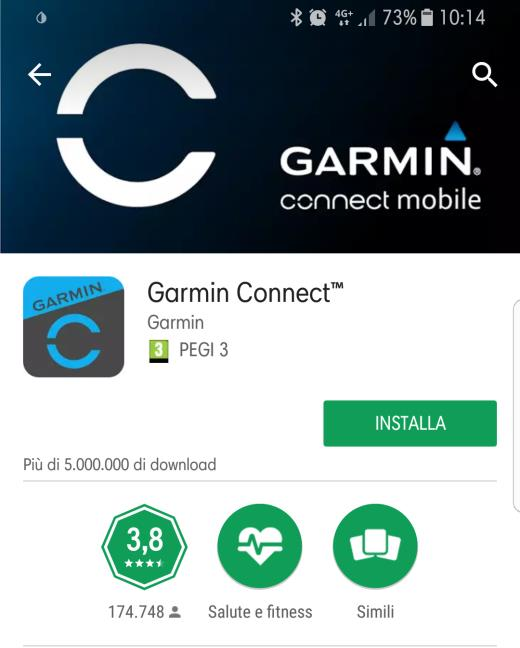

---

## 2. Crea un account e abbina il dispositivo

Apri l'app, crea un account Garmin o accedi se ne hai già uno. Questo account registrerà le sessioni sportive e i dati del dispositivo, ma non i valori di glicemia.

Alla prima apertura ti viene chiesto di creare un account o accedere:

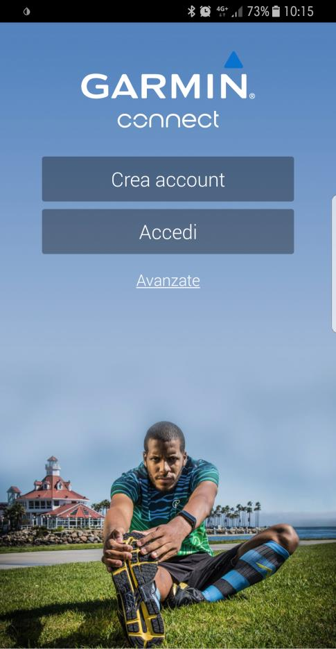

Accetta l'EULA e conferma di avere almeno 16 anni:

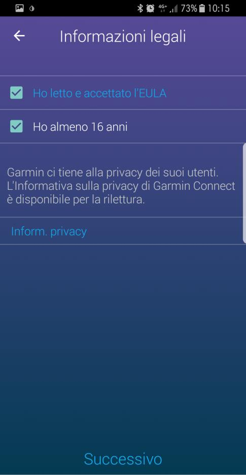

Inserisci email e password (oppure accedi con Facebook o Google):

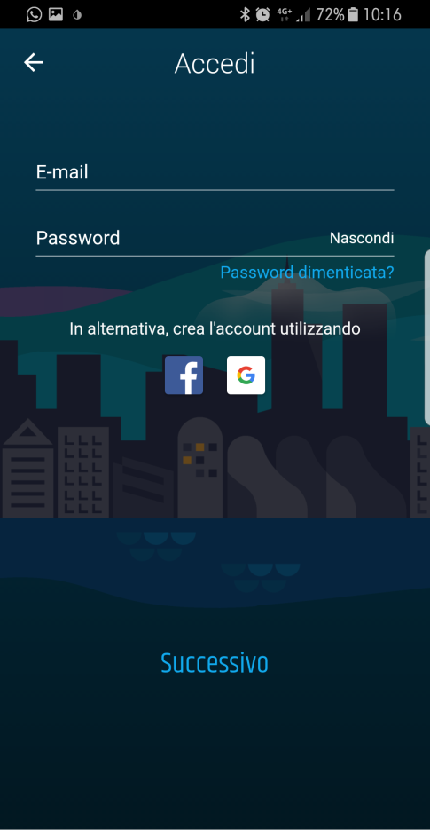

Abbina il tuo Garmin: vai in **Gestione dispositivi → Aggiungi dispositivo**, seleziona il tuo modello dalla lista (o usa **Cerca tutti i dispositivi compatibili**) e segui le istruzioni a schermo.

L'app avvia la configurazione guidata del dispositivo:

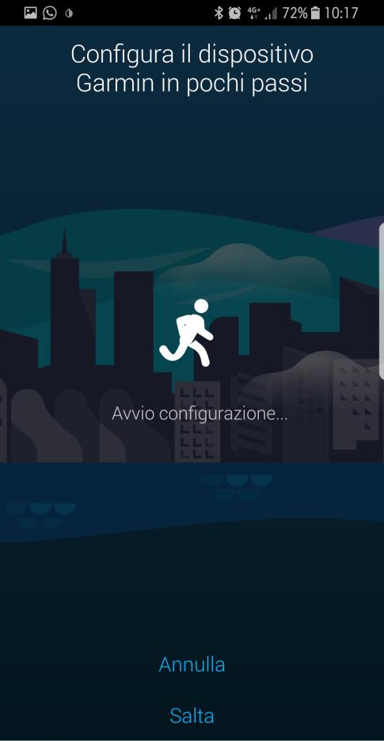

Seleziona il tuo modello dall'elenco dei dispositivi Garmin supportati:

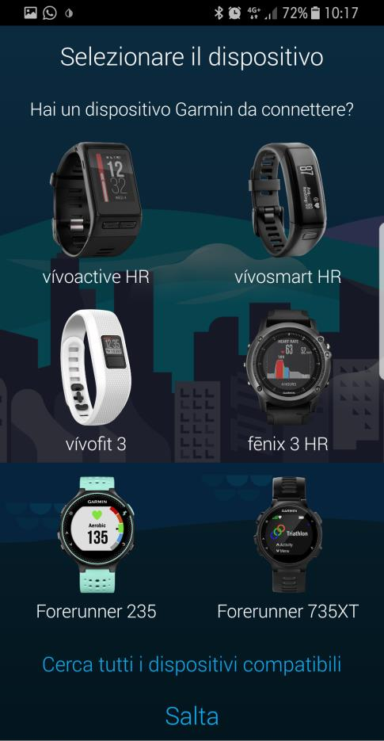

---

## 3. Attiva la modalità di associazione sul Garmin

Vai nelle impostazioni Bluetooth del dispositivo Garmin (consulta il manuale del tuo modello) e abilita la modalità di associazione. L'app avvierà la prima sincronizzazione in automatico.

Sull'orologio, entra nel menu **Impostazioni**:

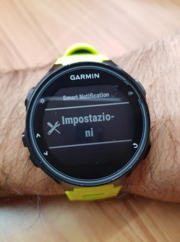

Vai su **Sensori e accessori → Bluetooth**:

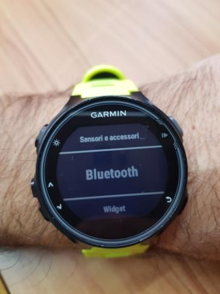

L'orologio si mette in attesa di un dispositivo da associare:

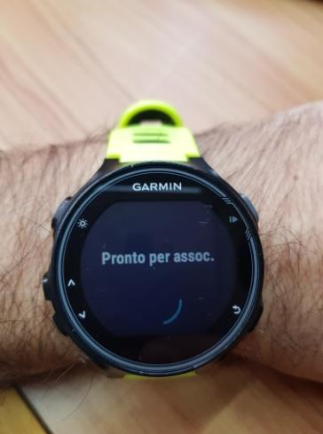

Compare un avviso di connessione per l'associazione con il telefono:

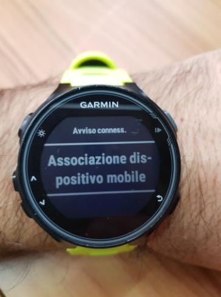

Sul telefono, conferma di voler procedere con l'associazione al Forerunner 735XT:

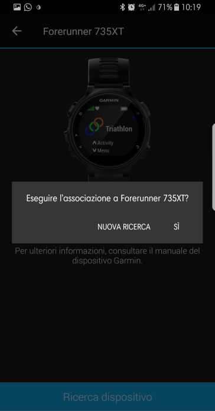

L'orologio mostra lo stato di collegamento in corso:

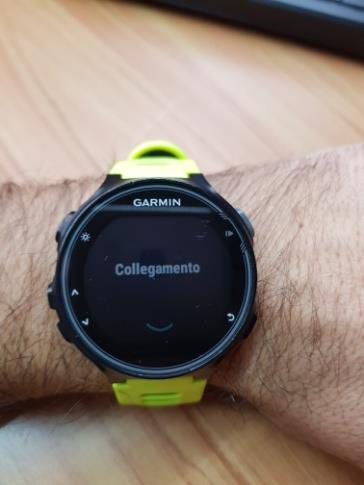

A seconda del modello, il telefono può chiederti di inserire un PIN (prova `0000` o `1234`)...

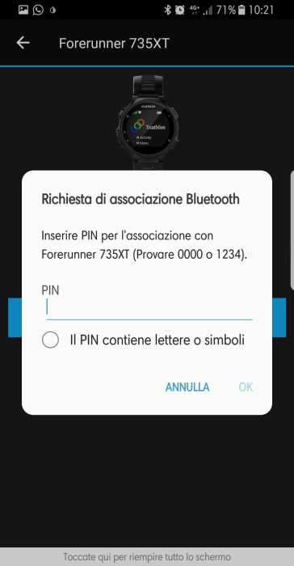

...oppure l'orologio mostra un codice da confrontare con quello sul telefono:

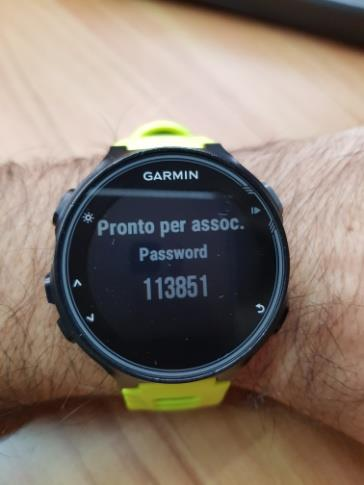

Al termine, il telefono conferma che l'associazione è riuscita:

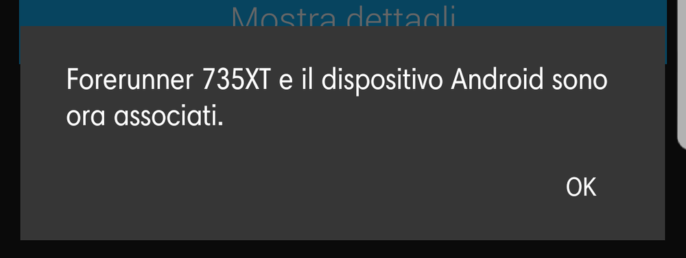

---

## 4. Apri Connect IQ Store

Nell'app Garmin Connect, apri il menu in alto a sinistra (tre linee) e seleziona **Store Connect IQ**.

> ℹ️ **Nota**: In Connect IQ puoi trovare sia **widget** sia **applicazioni**:
> - I **widget** sono disponibili nel menu rapido dell'orologio e si chiudono automaticamente dopo qualche secondo.
> - Le **applicazioni** rimangono attive sullo schermo più a lungo.

Apri il menu laterale dell'app Garmin Connect:

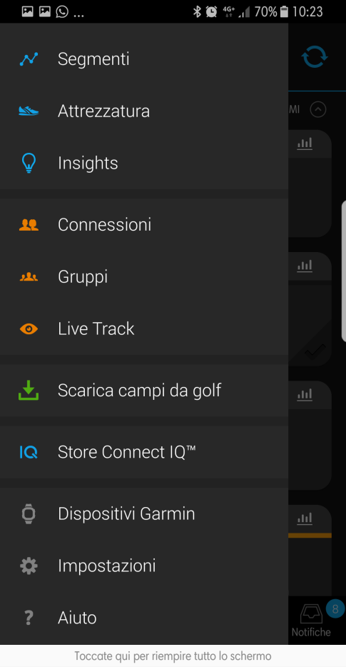

Seleziona **Store Connect IQ™** dall'elenco:

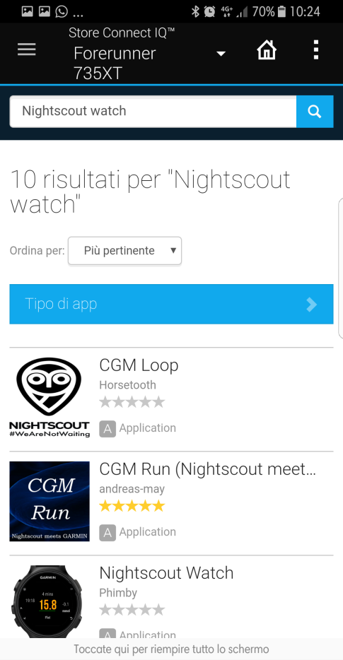

Nello store, cerca "Nightscout watch" per vedere le app disponibili per il tuo modello:

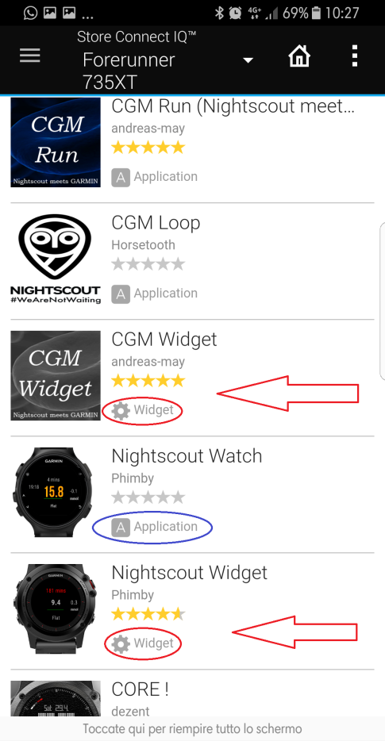

---

## 5. Cerca e scarica l'app o il widget Nightscout

Cerca nel Connect IQ Store le app o i widget compatibili con Nightscout. Le due più diffuse sono:

### Widget e app di Phimpy
Cerca "Nightscout" o "Phimpy" nel Connect IQ Store.

Nella pagina web dello store puoi vedere tutte le app pubblicate da Phimby, incluse **Nightscout Watch** e **Nightscout Widget**:

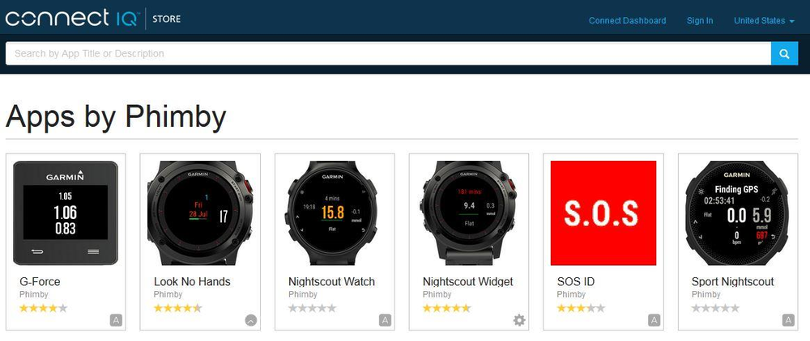

### CGM Widget di Andreas-May
Cerca "CGM Widget" o "Andreas-May" nel Connect IQ Store.

Allo stesso modo, questa è la pagina con tutte le app pubblicate da andreas-may, tra cui **CGM Widget**:

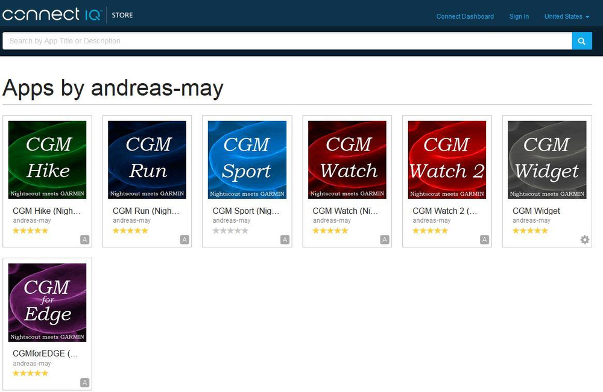

Seleziona quello che preferisci, clicca **Scarica** e accetta i termini e le autorizzazioni.

Nei risultati di ricerca, individua l'app o il widget desiderato (nell'esempio, il **CGM Widget** e il **Nightscout Widget** sono contrassegnati dall'icona a forma di ingranaggio):

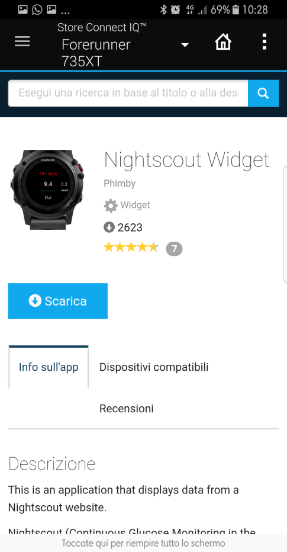

Apri la sua scheda e tocca **Scarica**:

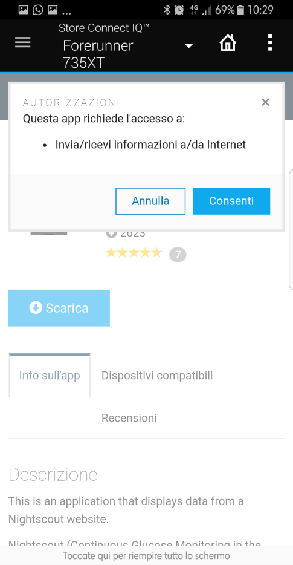

Concedi l'autorizzazione richiesta per inviare e ricevere dati da Internet:

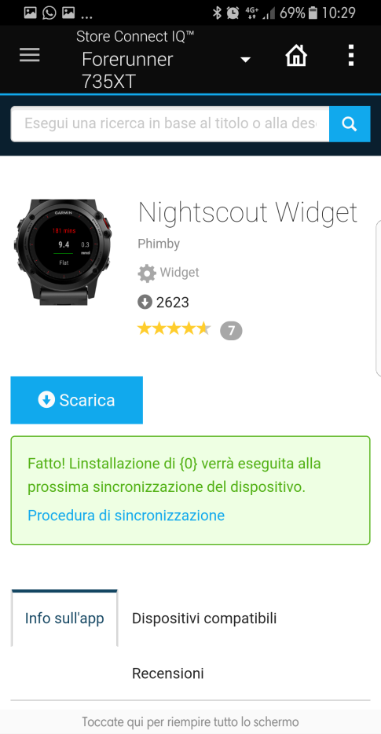

Compare la conferma che l'installazione avverrà alla prossima sincronizzazione:

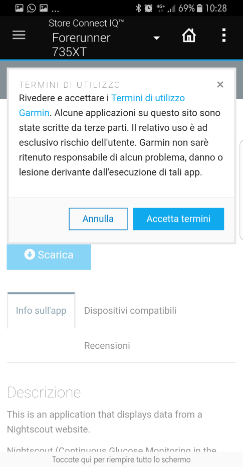

---

## 6. Sincronizza il dispositivo

Torna alla schermata principale di Garmin Connect e clicca il tasto **Sincronizza** in alto a destra. Attendi il completamento.

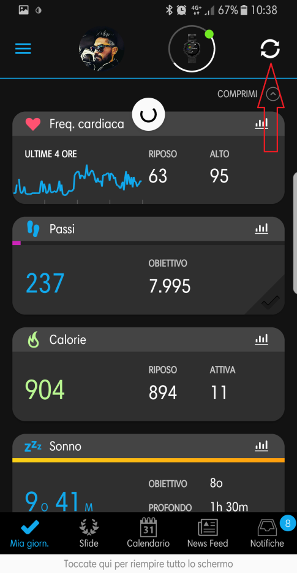

---

## 7. Configura il widget o l'app

Clicca sull'icona del tuo dispositivo nella schermata principale dell'app, poi vai in **Activities & App Management**. Cerca il widget o l'app appena installata e clicca su **Impostazioni**.

Apri la scheda del tuo dispositivo, dove trovi la voce **Activities & App Management**:

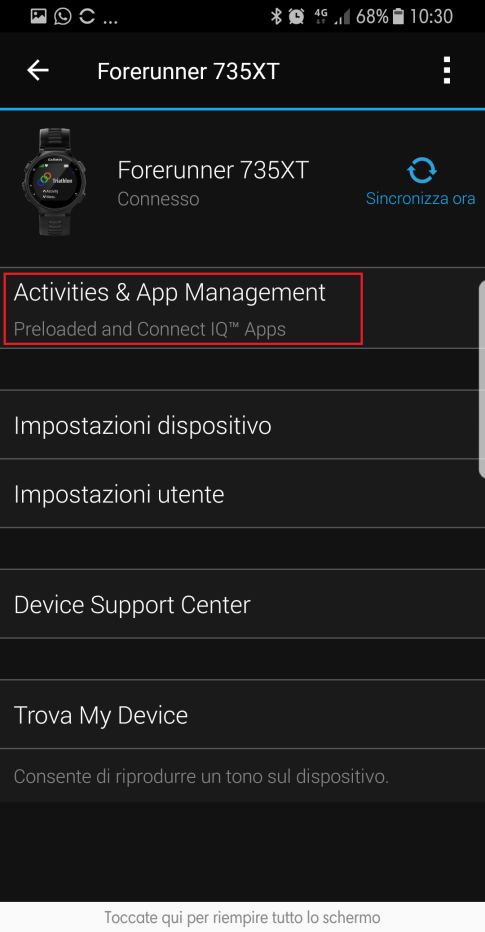

Entra nella sezione **Widget**:

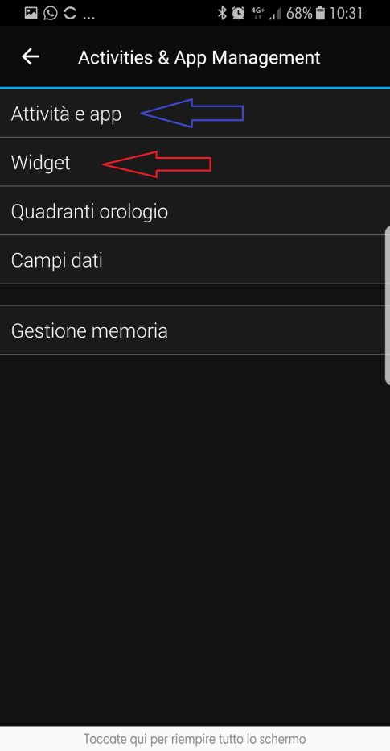

Trova il widget appena installato (es. **Nightscout Widget**) ed entra nella sua scheda:

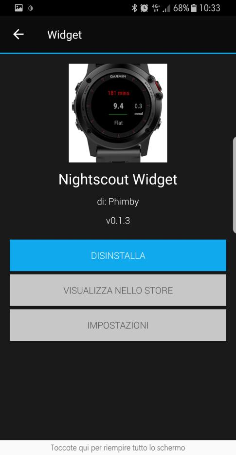

Puoi anche riordinare i widget attivi sull'orologio trascinandoli dall'icona a destra:

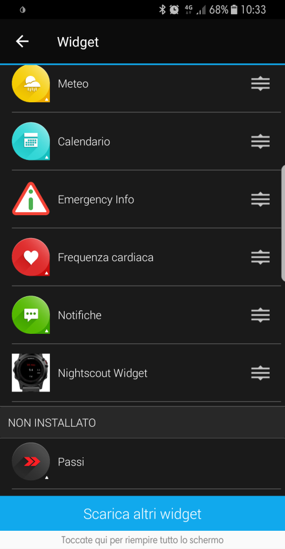

Tocca **Impostazioni** per aprire la configurazione del widget:

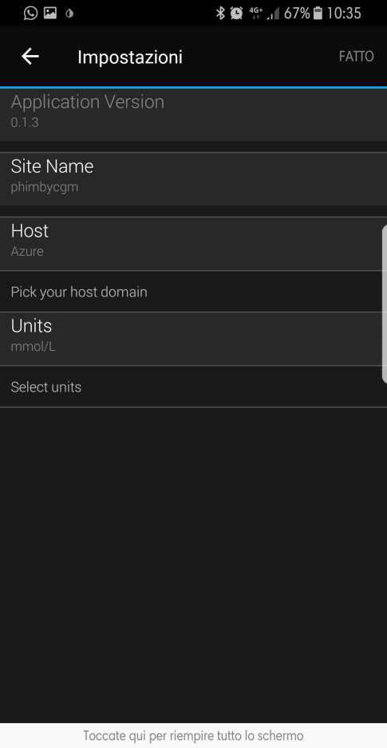

### Configurazione widget Nightscout (di Phimpy)

Inserisci i seguenti parametri:

- **Site Name** — solo il nome del sito, senza l'estensione Azure o Heroku (es. `birillo`)
- **Host** — seleziona `azure` o `heroku` in base al tuo Nightscout
- **Units** — l'unità di misura preferita (`mg/dL` o `mmol/L`)

Le impostazioni del **Nightscout Widget**, con i campi **Site Name**, **Host** e **Units**:

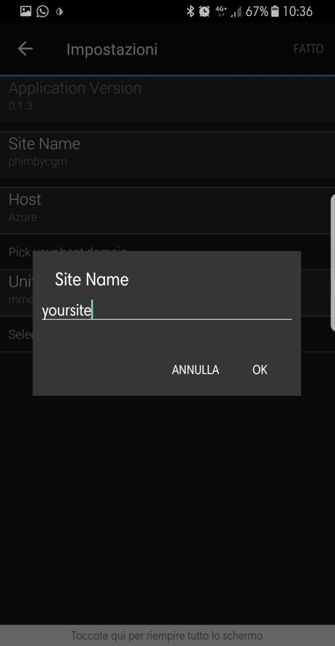

Tocca **Site Name** e inserisci il nome del tuo sito Nightscout:

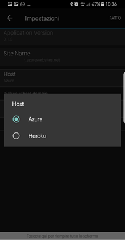

Tocca **Host** e scegli tra **Azure** e **Heroku** in base a dove è ospitato il tuo Nightscout:

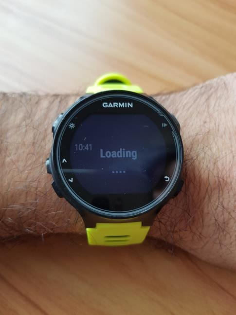

Dopo la sincronizzazione, sull'orologio il widget mostra brevemente **Loading**...

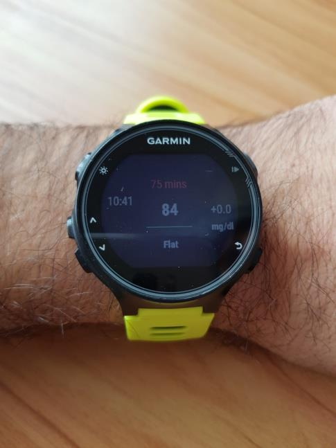

...e poi il valore corrente di glicemia con trend e minuti trascorsi dall'ultima lettura:

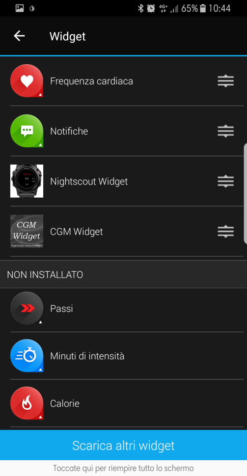

### Configurazione CGM Widget (di Andreas-May)

Inserisci la stringa completa comprensiva di dominio (es. [`https://birillo.herokuapp.com`](https://birillo.herokuapp.com)). Puoi anche configurare l'unità di misura e i limiti del range target.

Nella scheda del **CGM Widget**, tocca **Impostazioni**:

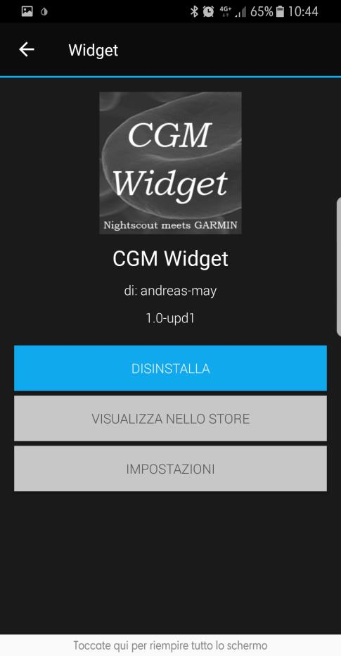

Inserisci l'indirizzo completo del tuo Nightscout nel campo **Nightscout website**:

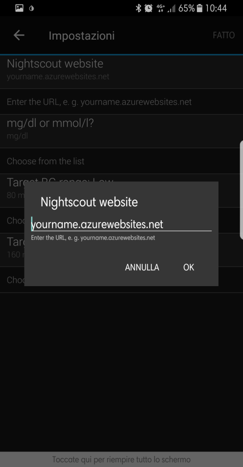

---

## 8. Sincronizza di nuovo e verifica

Torna alla schermata principale di Garmin Connect e sincronizza nuovamente il dispositivo. Trova il widget sul tuo Garmin: dopo qualche minuto dovrebbe apparire il valore di glicemia corrente.

Sull'orologio, il **CGM Widget** si connette e mostra un valore provvisorio mentre scarica i dati aggiornati...

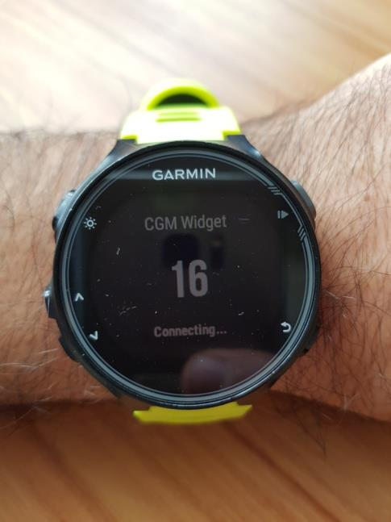

...per poi mostrare la glicemia corrente con la freccia di trend e i minuti trascorsi dall'ultima lettura:

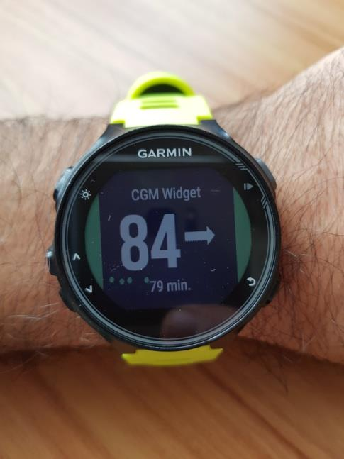
