# Glicemia al polso con GlucoDataHandler

**GlucoDataHandler** è un'app che porta la glicemia sul tuo smartwatch Wear OS in modo semplice. Sostituisce xDrip per gli smartwatch già supportati da WatchDrip+, e in più accetta molte altre sorgenti dati.

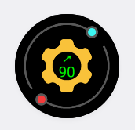

Questa guida è stata realizzata con uno smartwatch simulato Wear OS 5, ma vale per qualsiasi smartwatch **Wear OS 2 o superiore**.

> ⚠️ **Attenzione**: L'utilizzo è a esclusiva responsabilità personale.

## 1. Sorgenti dati supportate

GlucoDataHandler può ricevere la glicemia da diverse app, sullo stesso telefono o dal cloud:

**App sul telefonino:**
- Notifiche delle app Dexcom, Eversense, Medtronic e CamAPS FX
- Juggluco (collegamento diretto a FSL2 e FSL3, G7 e ONE+, Eversense, Accu-Chek, Sibionics)
- xDrip (collegato direttamente al sensore FSL2), oppure follower Dexcom Share, LView, CareLink
- AAPS, Eversense ESEL / G6 BYODA, Diabox

**App da server nel cloud:**
- LLink
- Dexcom Share
- Nightscout
- Medtrum EasyFollow/EasyView
- Yuwell Anytime

## 2. Installa GlucoDataHandler sul telefonino

Installa l'app dal Play Store. Verifica che l'autore sia **pachi81**:

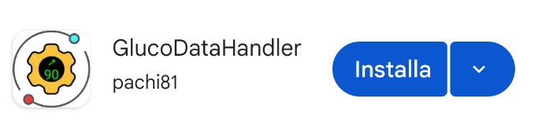

Se vedi la nota dello sviluppatore, leggila e tocca **OK**:

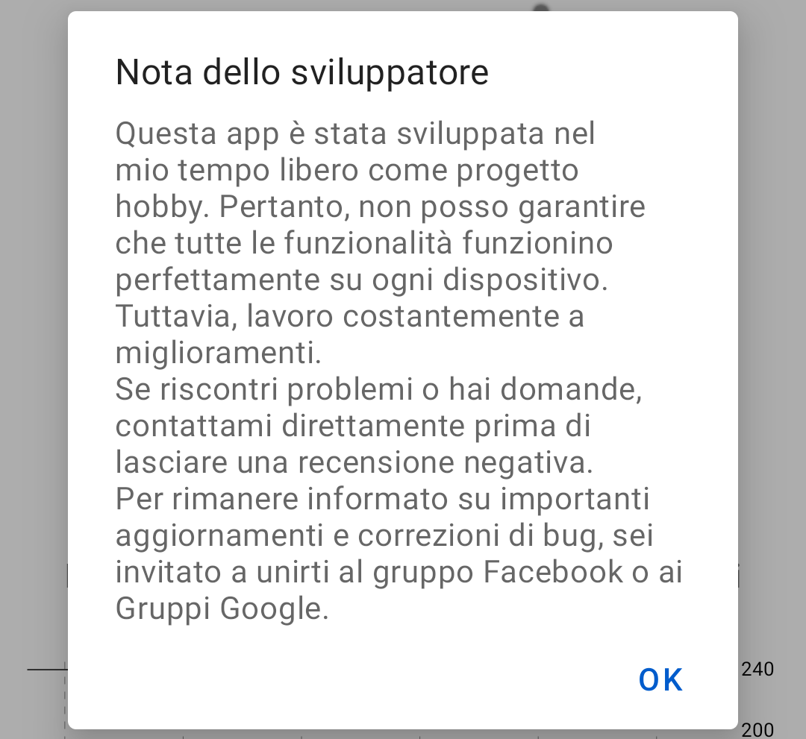

Se vedi questo avviso, significa che devi disabilitare l'ottimizzazione della batteria per l'app:

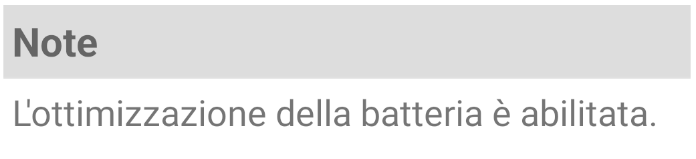

Vai nelle **Impostazioni** Android e cerca **GlucoDataHandler**:

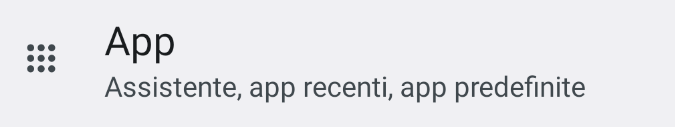

Entra nella pagina dell'app e tocca **Batteria**:

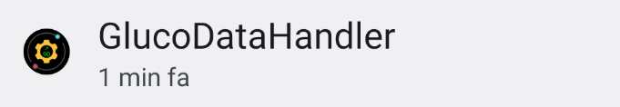

Nella pagina Batteria, tocca **Gestisci utilizzo batteria**:

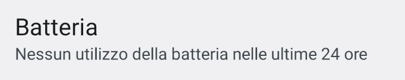

Seleziona **Senza limitazioni**:

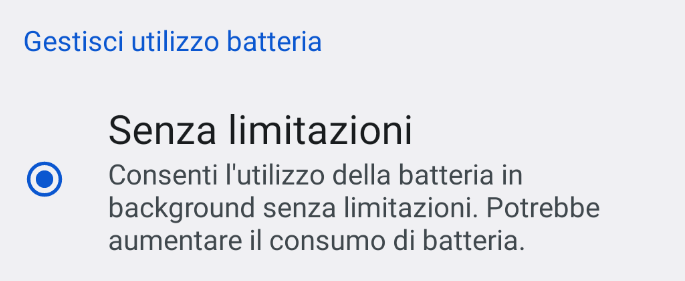

A questo punto apri l'app: ti mostrerà che non ha ancora ricevuto dati e ti propone di configurare una sorgente. Tocca **SORGENTI**:

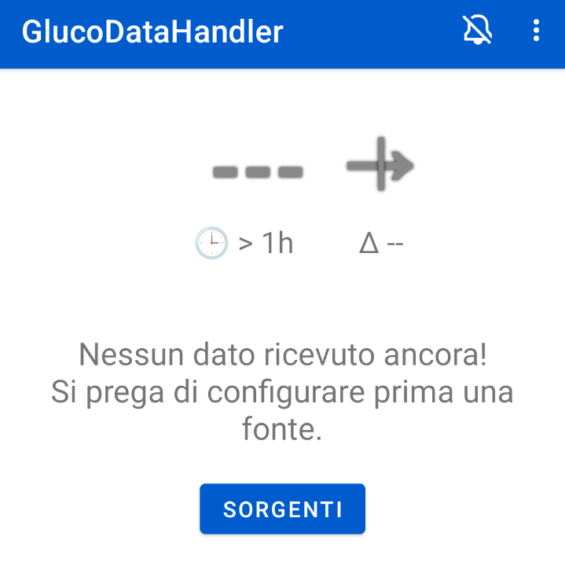

## 3. Scelta della sorgente dati

### Applicazioni locali

Nella pagina **Sorgenti**, la sezione **Applicazioni locali** raccoglie le app sullo stesso telefono che forniscono la glicemia come messaggio interno (Juggluco, xDrip, AAPS e simili):

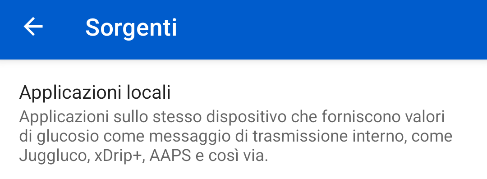

#### Juggluco

Entra in **Juggluco** e attiva **Abilita**:

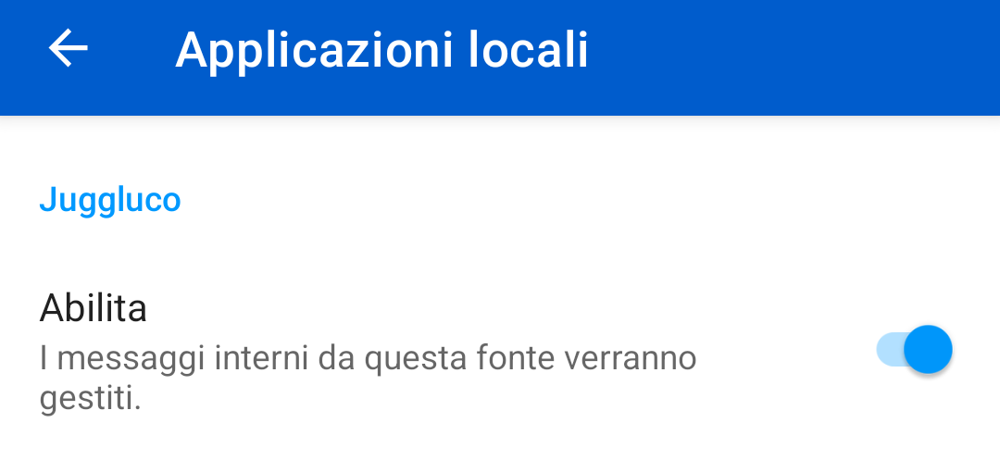

Poi, dentro l'app Juggluco: apri il **Menu 1 → Impostazione → Exchange data**, e nella sezione EverSense spunta **Glucodata broadcast**, poi tocca **Salva**:

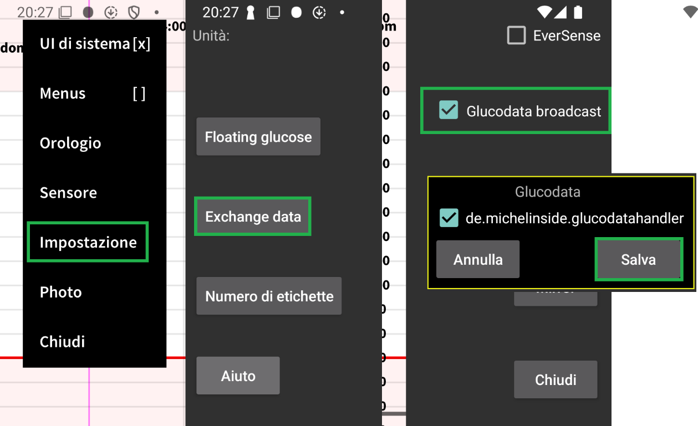

#### xDrip

Con xDrip hai due opzioni, puoi abilitarle entrambe: **1) API del servizio di trasmissione** (per ricevere anche l'IOB) e **2) Alternativa: trasmissione locale**:

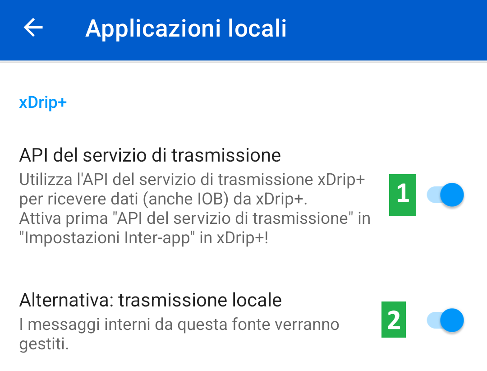

In xDrip, vai in **Impostazioni → Impostazioni Inter-app** e attiva **Trasmetti localmente** (1) e **Servizio di Trasmissione API** (2):

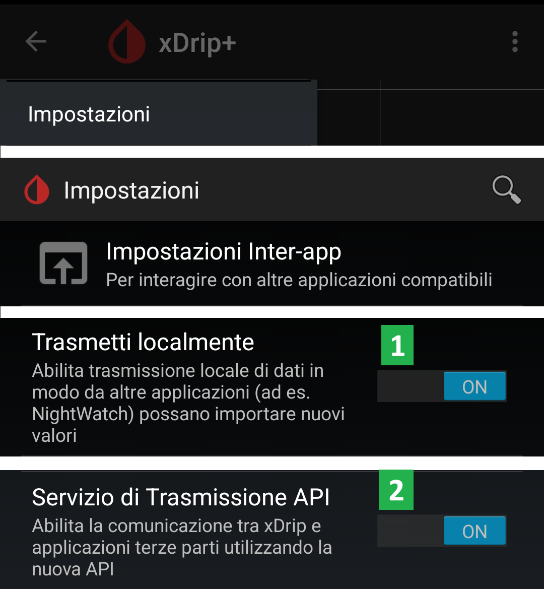

#### AAPS

In AndroidAPS, dal **Configuratore strutturale → Sincronizzazione**, spunta **Samsung Tizen** (il canale di broadcast usato anche da GlucoDataHandler):

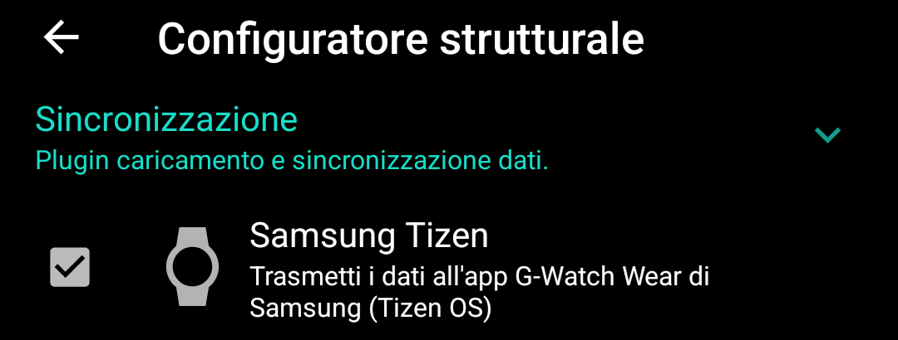

Poi, in GlucoDataHandler, entra in **AndroidAPS** e attiva **Abilita**:

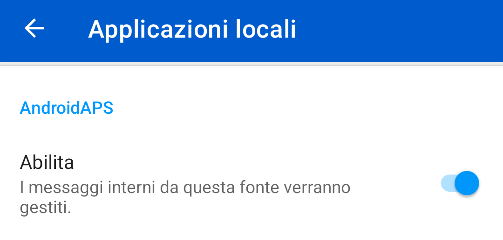

#### App modificata BYODA G6

Se hai creato la tua [app Dexcom modificata](../xdrip/dexcom-g6-g7-app-modificata), nel modulo di richiesta scegli di trasmettere anche ad Android APS (oppure a entrambi xDrip e Android APS):

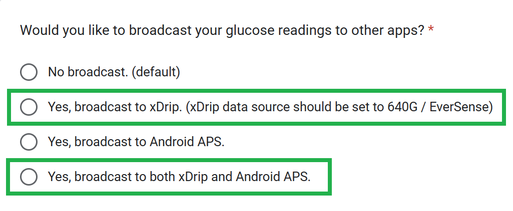

Poi, in GlucoDataHandler, entra in **Eversense (ESEL)/Dexcom BYODA (xDrip)** e attiva **Abilita**:

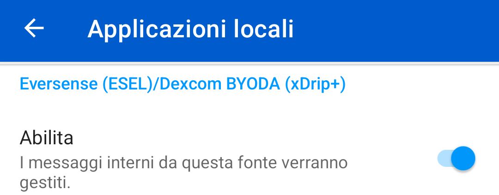

### Servizi cloud

La sezione **Servizi cloud** raccoglie le sorgenti che forniscono la glicemia via Internet, come LLink, Dexcom Share e Nightscout:

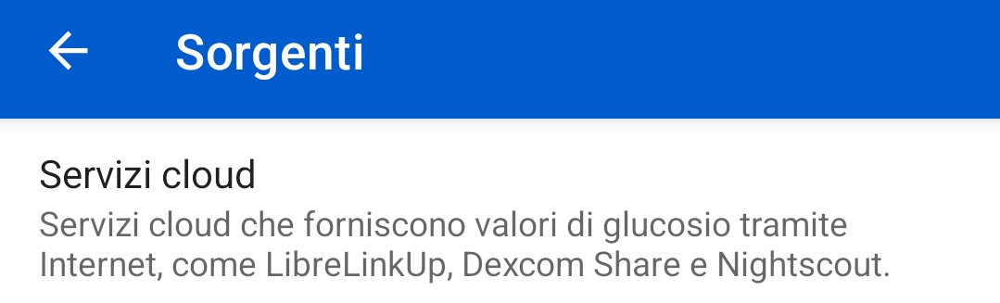

Per ciascun servizio, attiva **Abilita** e apri **Avanzate** per inserire le credenziali (nome utente e password per LLink/Dexcom Share, oppure URL e `API_SECRET` per Nightscout):

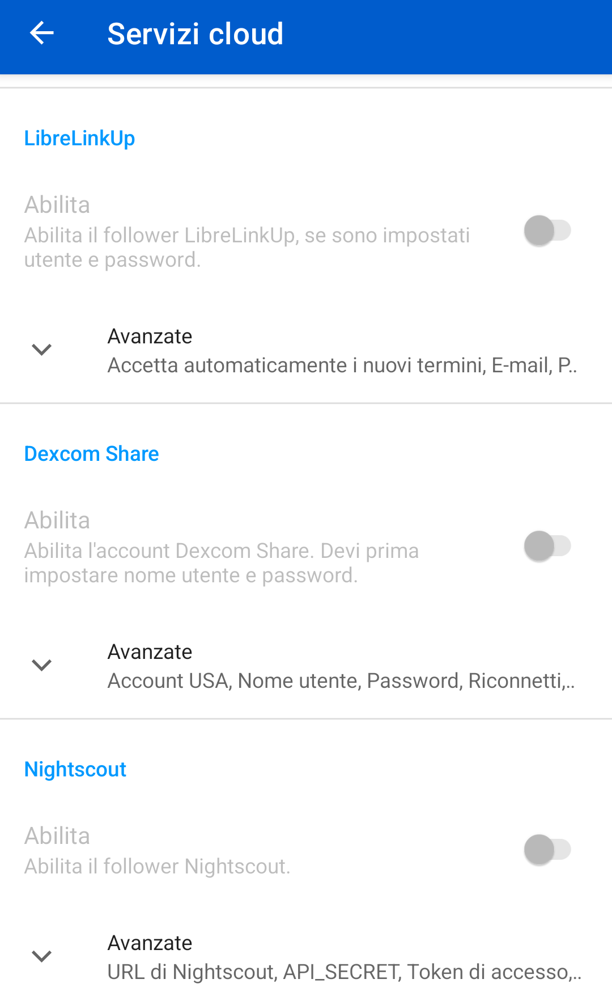

### Lettore di notifiche

In alternativa, GlucoDataHandler può leggere la glicemia direttamente dalle notifiche di un'altra app (es. l'app ufficiale Dexcom). Vai in **Lettore di notifiche (Beta) → Applicazione** e tocca **Seleziona**:

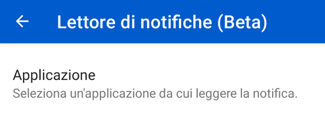

Attiva **Mostra tutto** se non trovi la tua app nell'elenco, poi seleziona l'app da cui leggere la notifica (nell'esempio, **Dexcom G7**):

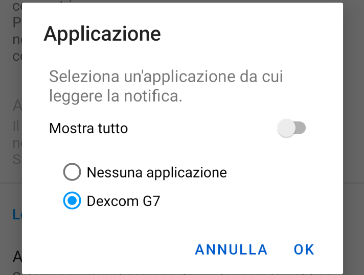

Attiva **Abilita lettore di notifiche**:

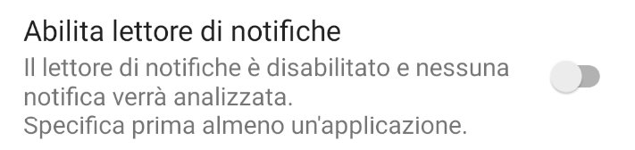

Nelle notifiche del telefono, cerca **GlucoDataHandler**: vedrai che l'autorizzazione non è ancora concessa:

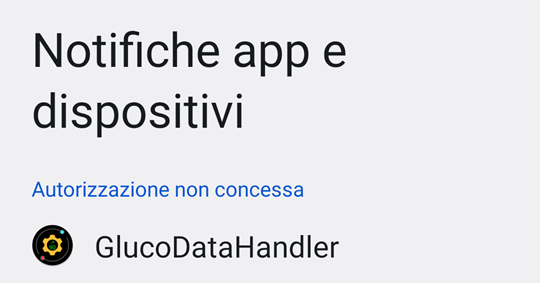

Attiva **Consenti l'accesso alle notifiche**:

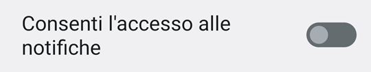

Conferma toccando **Consenti** nella finestra di dialogo:

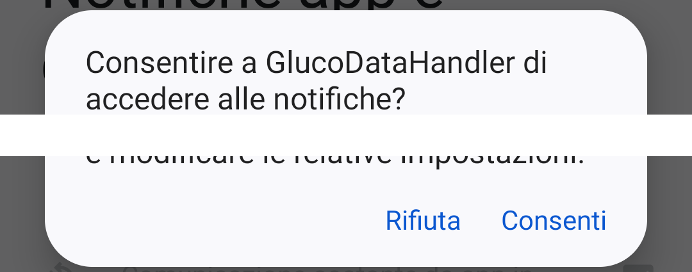

> ℹ️ **Nota**: L'app avrà accesso a tutte le notifiche del telefonino, ma userà solo quelle necessarie a leggere il valore di glicemia.

## 4. Impostazioni e widget

Dopo aver configurato una sorgente, la glicemia comparirà nella schermata principale di GlucoDataHandler:

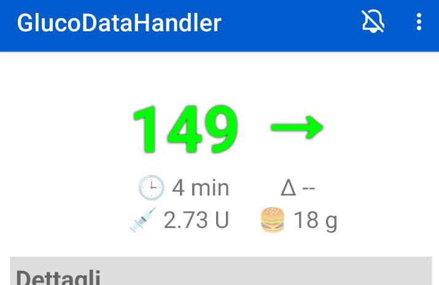

Puoi anche creare un **widget** sulla schermata Home del telefono: tieni premuto sulla Home, scegli **Widget** e cerca GlucoDataHandler tra i 6 formati disponibili:

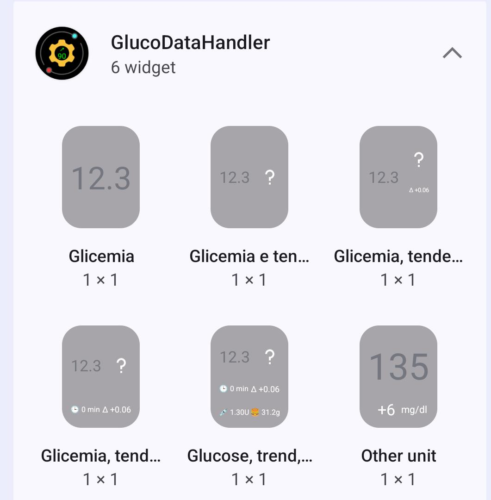

## 5. GlucoDataHandler su Wear OS

### Installa l'app sullo smartwatch

Se non si installa automaticamente, installala dal Play Store dello smartwatch. Dalla schermata **Recents**, apri **Play Store**:

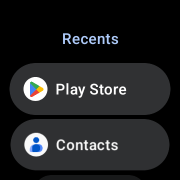

Tocca la lente di ricerca:

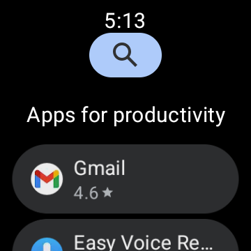

Tocca l'icona della tastiera:

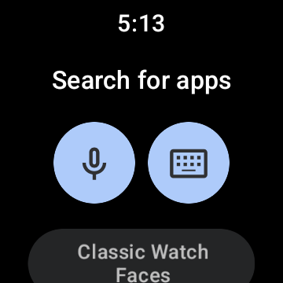

Digita `Glucodatahandler`:

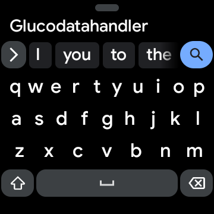

Seleziona il risultato **GlucoDataHandler** (autore **pachi81**) e tocca **Install**:

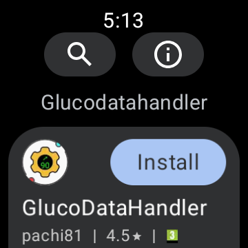

Una volta installata, vedrai la glicemia sullo smartwatch come sul telefonino. Questo però **non è ancora un quadrante**: è solo l'app che gira in background per recuperare la glicemia.

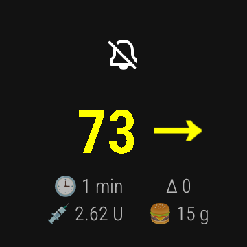

### Imposta una complicazione

Scegli un quadrante personalizzabile sullo smartwatch e passa in modalità modifica tenendolo premuto:

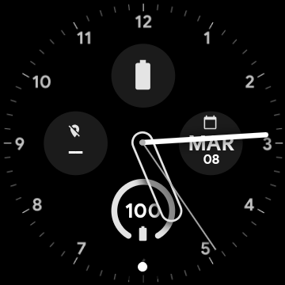

Tocca la matita per modificare i campi del quadrante:

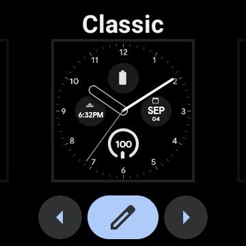

Per ogni campo puoi scegliere cosa visualizzare (qui i quattro slot: batteria, data, passi e la complicazione principale):

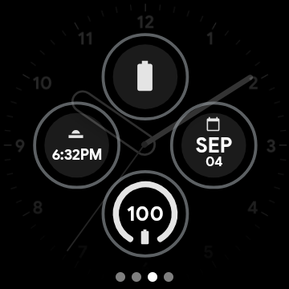

Toccando un campo si apre l'elenco delle complicazioni disponibili:

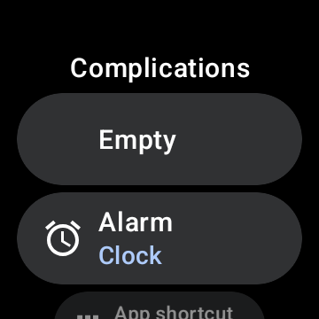

Tra le complicazioni troverai una grande varietà di indicatori di GlucoDataHandler (glicemia semplice, glicemia con tendenza, ecc.):

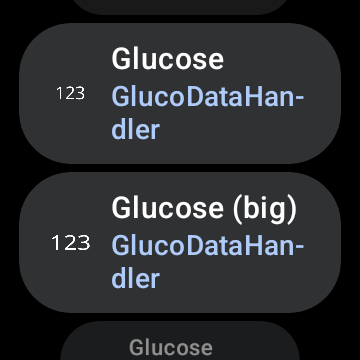

Un esempio di quadrante completo, con glicemia, tendenza, insulina/carboidrati e passi:

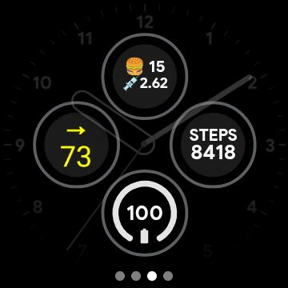

> ℹ️ **Nota**: Apri l'app GlucoDataHandler con il tasto app dello smartwatch, oppure toccando uno dei campi della complicazione, per cambiare le impostazioni, gli allarmi, ecc.

## 6. Altri quadranti supportati

Se vuoi quadranti più evoluti (con grafico), vai in **Orologio → Orologi Wear OS → Quadranti di orologio**:

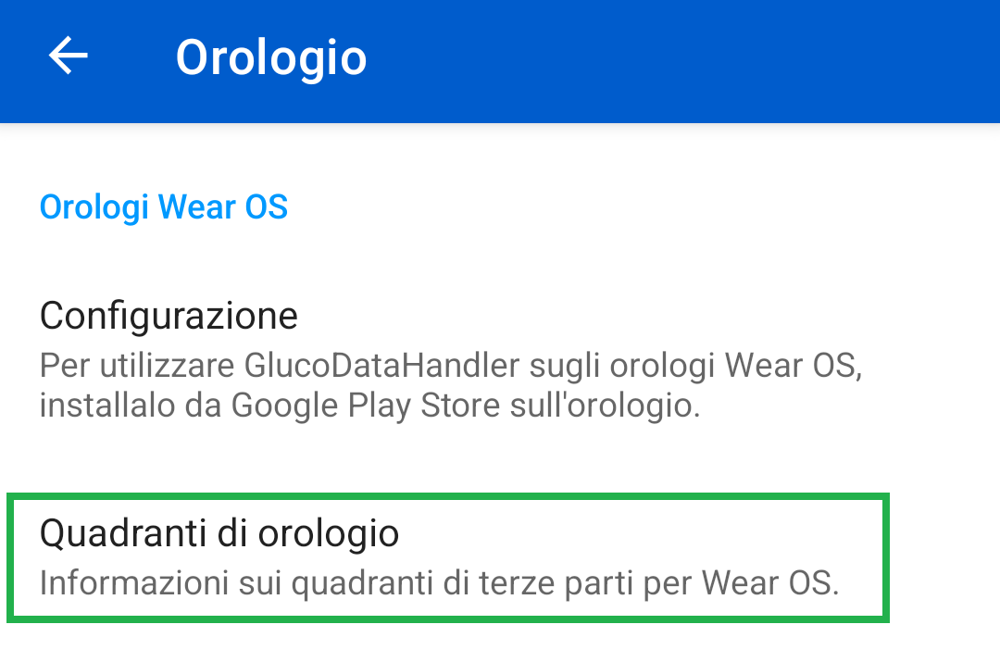

Oltre a **Pujie** (cerca nella libreria i quadranti che iniziano con `GDH_`; non compatibile con Wear OS 5), ci sono app di terze parti progettate apposta per GlucoDataHandler: **Diabetic Masked Man** e i **Quadranti GDC**, entrambi con link diretto al Play Store dalla stessa pagina:

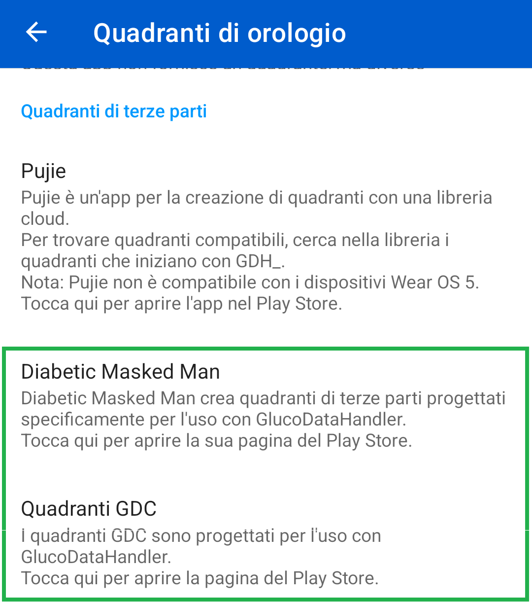

## 7. WatchDrip+

Se non vuoi usare xDrip, oppure trovi GlucoDataHandler più semplice, puoi mandare i dati a **WatchDrip+** nello stesso modo (senza grafico). Devi comunque abbinare lo smartwatch a WatchDrip+ (con Zepp o Mifit) come faresti normalmente, ma non serve più xDrip.

In **Orologio → Orologi MiBand e Amazfit**, attiva **WatchDrip+**. **Importante**: dopo aver attivato questa opzione, abilita anche **Abilita servizio** dentro l'app WatchDrip+:

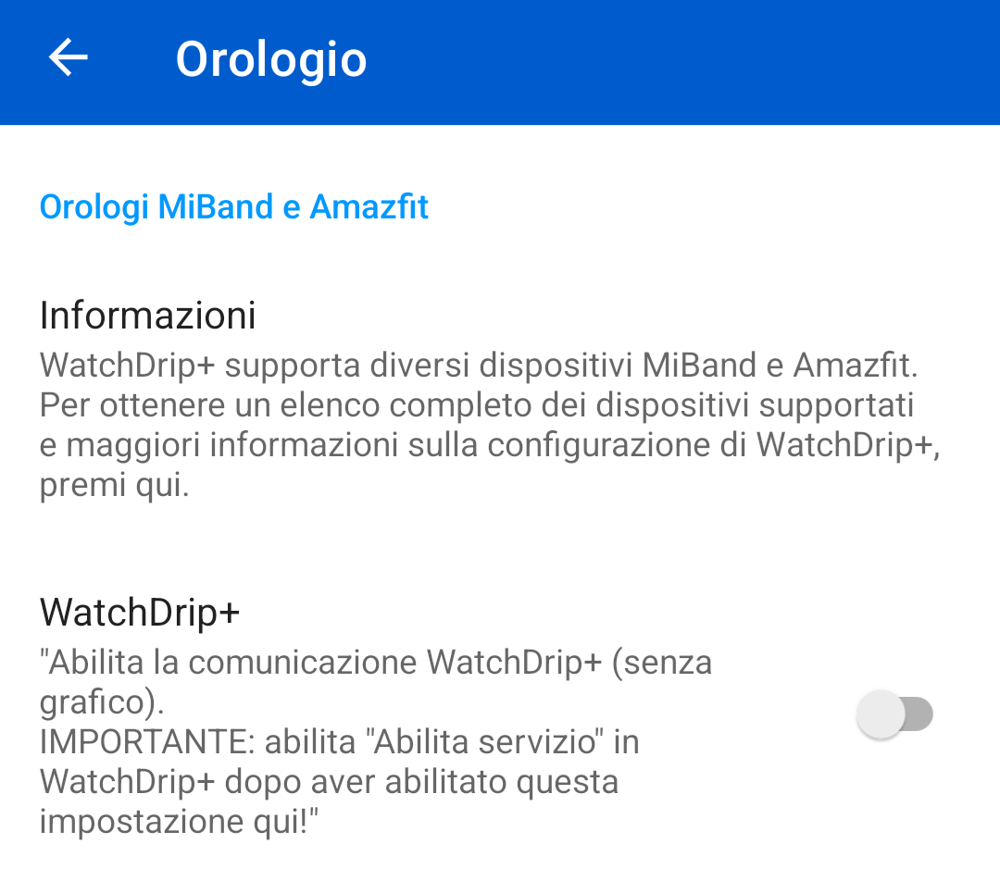

## 8. Garmin e Fitbit

GlucoDataHandler può anche imitare il web service di xDrip sul telefono: in **Orologio → Orologi Garmin e Fitbit**, attiva il **web service locale**. A quel punto qualsiasi quadrante o campo dati Garmin che supporta xDrip come sorgente (e il quadrante Glance per Fitbit, scegliendo xDrip come sorgente) funziona con GlucoDataHandler al posto di xDrip.

## 9. Android Auto

L'integrazione con Android Auto oggi è affidata a un'app separata dello stesso autore, **GlucoDataAuto**, disponibile solo su GitHub (non sul Play Store per le regole di Google): [`https://github.com/pachi81/GlucoDataAuto`](https://github.com/pachi81/GlucoDataAuto). Riceve i dati da GlucoDataHandler e li mostra in Android Auto.

Ci sono tante altre possibilità con GlucoDataHandler: scoprile e condividile nel gruppo Facebook [Diabete, glicemia a distanza e nuove tecnologie](https://www.facebook.com/groups/nightscout/).
