# Gluroo come alternativa a Nightscout

**Gluroo** è un'app gratuita creata da Greg Badros che funziona come una versione semplificata di Nightscout: puoi usarla per condividere la glicemia, visualizzarla su smartwatch e sul monitor M5Stack, senza gestire un server.

Sorgenti dati compatibili: Dexcom Share, FSL 2, FSL 3 (tramite LView), Nightscout.

Documento originale di Didier Frétigné.

> ⚠️ L'utilizzo è a esclusiva responsabilità personale.

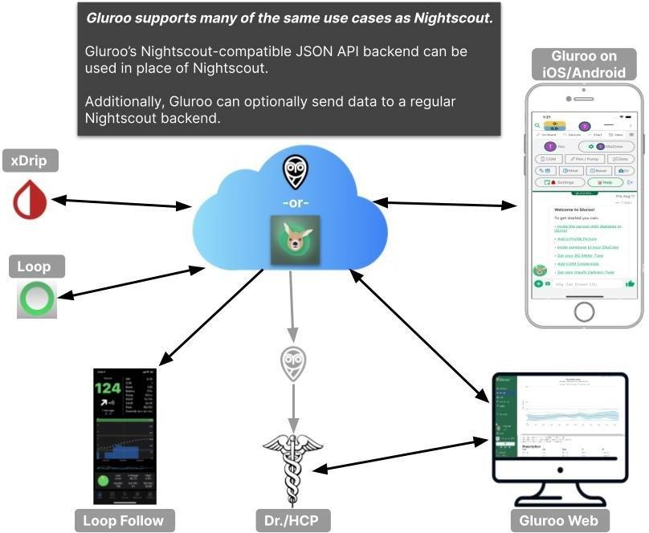

---

## 1. Installa Gluroo

Cerca **Gluroo** nel Google Play Store o nell'Apple App Store. Se i link non sono aggiornati, vai su `https://gluroo.com`.

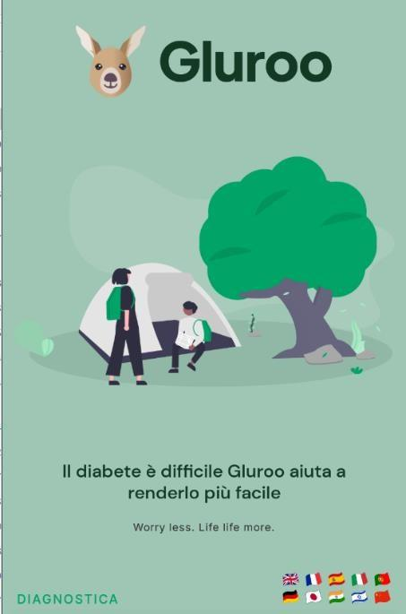

Accetta le condizioni, poi accedi con **Google** o **Apple**. Se l'app chiede un codice di attivazione, usa: `buongiorno_gluroo`

Dalla schermata principale, seleziona **CGM** e prosegui.

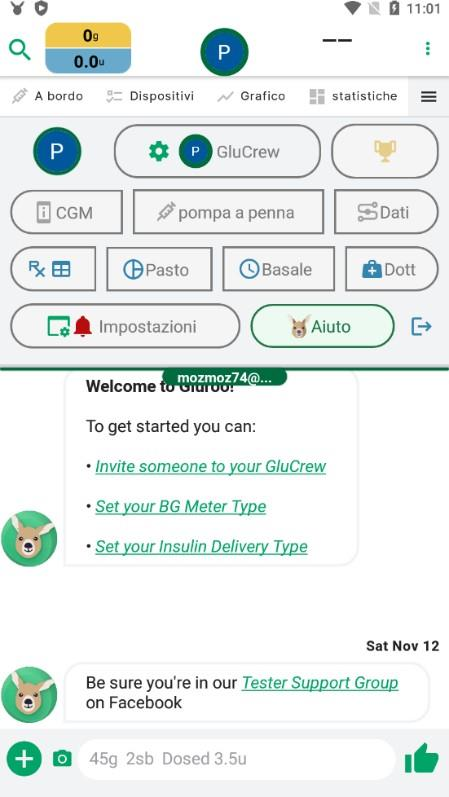

---

## 2. Configura la sorgente dati

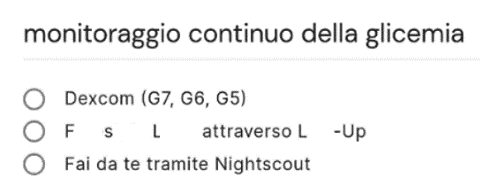

### Se usi Dexcom Share

Puoi inserire Gluroo come follower dell'app Dexcom, senza usare altre app.

1. Inserisci il tuo **login Dexcom Share** (lo stesso usato sull'app master).
2. Inserisci la **password** corrispondente.
3. Se usi server europei, abilita l'opzione per server non USA.

> ℹ️ Per usare Dexcom Share serve almeno un follower attivo. Puoi aggiungere te stesso come follower, verificare che funzioni e poi disinstallare l'app follower. La condivisione deve rimanere attiva nell'app master.

4. Clicca **Verifica accesso**. A breve dovresti vedere la glicemia in Gluroo.

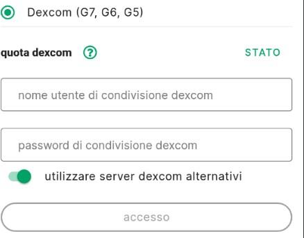

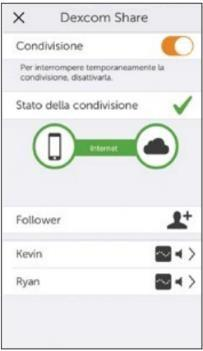

### Se usi LView (FSL 2 o FSL 3)

Puoi inserire Gluroo come follower di LView.

1. Crea un account follower in LView e invia un invito a te stesso.
2. In Gluroo, inserisci il **login follower LView** (l'invito ricevuto) e la **password** corrispondente.
3. Clicca **Verifica accesso**. A breve dovresti vedere la glicemia in Gluroo.

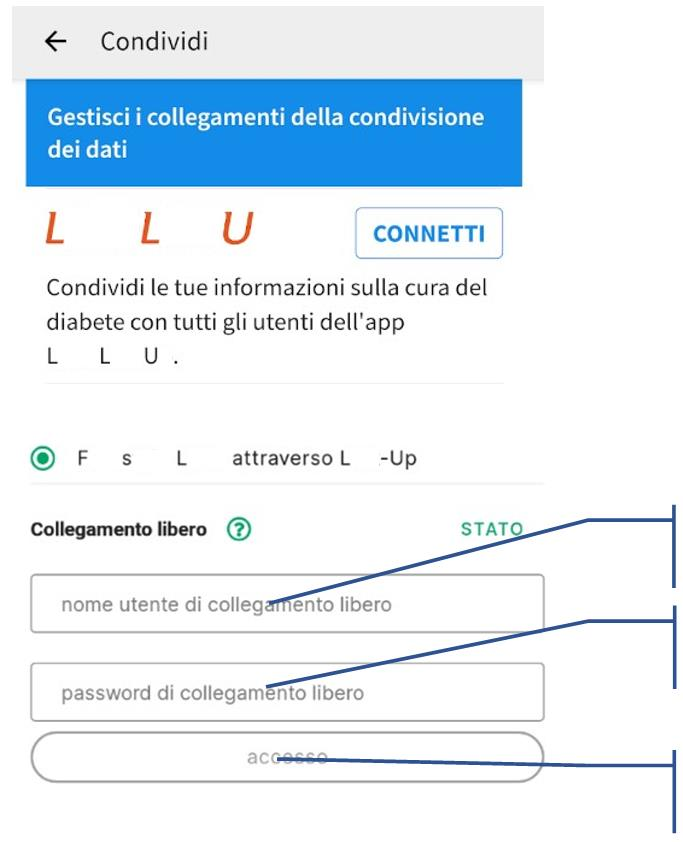

### Modalità "Fai da te" (equivalente Nightscout)

Questa modalità crea un endpoint compatibile con Nightscout: puoi usare l'indirizzo Gluroo come se fosse il tuo sito Nightscout.

- **Indirizzo Nightscout:** il tuo indirizzo Gluroo (formato: `https://xxxx.xx.gluroo.com:porta`)
- **API_SECRET:** la password mostrata nell'app

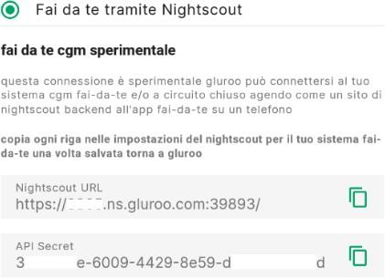

> ℹ️ Usa l'icona di copia per mandare questi valori a te stesso via SMS o email, così puoi inserirli facilmente sugli altri dispositivi.

**Compatibilità (verificata a settembre 2023):**

| App / Dispositivo | Come master | Come follower |
|---|---|---|
| xDrip+ | ✓ | ✓ |
| xDrip4iOS (Shuggah) | ✓ | ✓ |
| Loop | ✓ | ✓ |
| Diabox | ✓ | ✓ |
| Nightguard (Apple Watch) | ✓ | ✓ |
| Nightwatch | ✓ | ✓ |
| M5Stack NightscoutMon | — | ✓ (firmware nov. 2022 o successivo) |
| Garmin | — | ✓ |
| Samsung Watch (G-Watch) | — | ✓ |
| FitBit | — | ✗ |

> ℹ️ Se usi Dexcom Share o LView come sorgente, non hai bisogno di un master separato.

Per vedere la glicemia in una pagina web, usa **Gluroo Web**: c'è anche una modalità semplificata con solo il valore corrente.

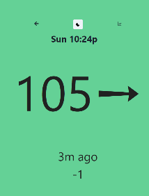

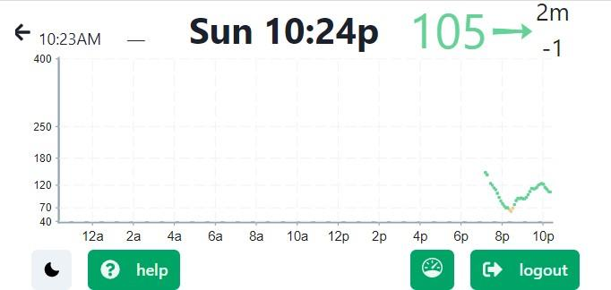

---

## 3. Configura xDrip+ con Gluroo

Con xDrip+ usa questi formati di URL:

- **Master:** `https://API_SECRET@xxxx.xx.gluroo.com:porta/api/v1`
- **Follower:** `https://API_SECRET@xxxx.xx.gluroo.com:porta`

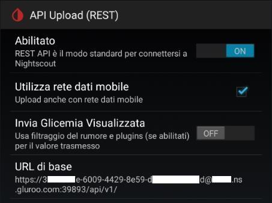

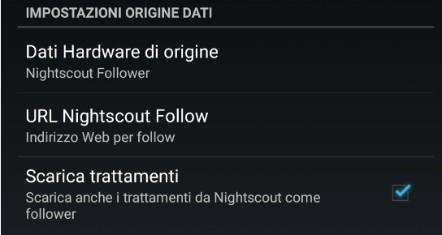

### Nightguard e Nightwatch

Inserisci l'indirizzo così: `https://xxxx.xx.gluroo.com:porta?token=API_SECRET`

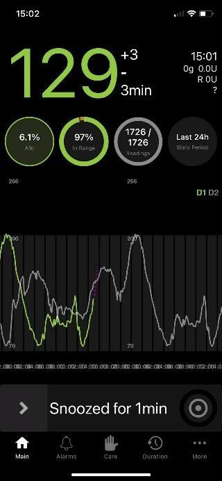

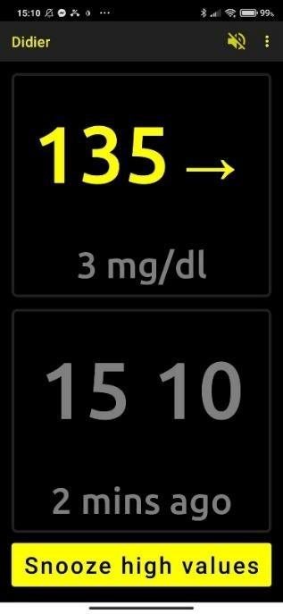

### M5Stack NightscoutMon

Nella configurazione web dell'M5Stack (`http://m5ns.local`):
- **Nightscout URL:** il tuo indirizzo Gluroo
- **API_SECRET:** la password corrispondente

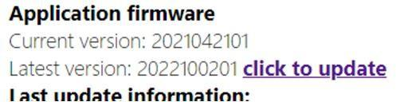

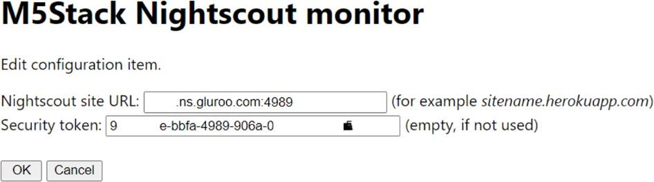

Assicurati di avere il firmware aggiornato (per aggiornarlo, apri `http://m5ns.local` e segui la [guida M5Stack](../../nightscout/monitor-nightscout-m5stack)).

---

## Maggiori informazioni

- Gruppo Facebook di Gluroo: `https://www.facebook.com/groups/1326762991077589`
- Blog ufficiale: `https://www.gluroo.com/blog/nightscout_heroku_alternative_free/index.html`
