# Gluroo come alternativa a Nightscout

**Gluroo** è un'app gratuita creata da Greg Badros che funziona come una versione semplificata di Nightscout: puoi usarla per condividere la glicemia, visualizzarla su smartwatch e sul monitor M5Stack, senza gestire un server.

Sorgenti dati compatibili: Dexcom Share, FSL2, FSL3 (tramite LView), Nightscout.

Documento originale di Didier Frétigné.

> ⚠️ **Attenzione**: L'utilizzo è a esclusiva responsabilità personale.

Lo schema del sistema: Gluroo fa da ponte tra le sorgenti dati (xDrip, Loop) e i dispositivi di visualizzazione (app su telefono, follower, pagina web):

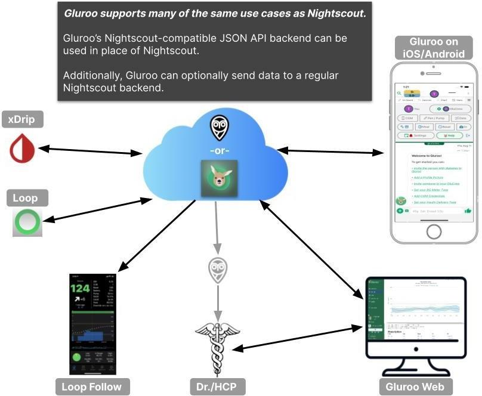

---

## 1. Installa Gluroo

Cerca **Gluroo** nel Google Play Store o nell'Apple App Store. Se i link non sono aggiornati, vai su [`https://gluroo.com`](https://gluroo.com).

La schermata di benvenuto dell'app:

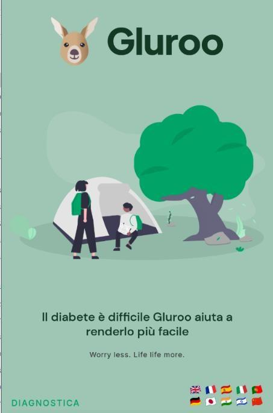

Accetta le condizioni, poi accedi con **Google** o **Apple**. Se l'app chiede un codice di attivazione, usa: `buongiorno_gluroo`

Dalla schermata principale, seleziona **CGM** e prosegui.

La schermata principale di Gluroo con il menu aperto: la voce **CGM** è in alto a sinistra tra i pulsanti:

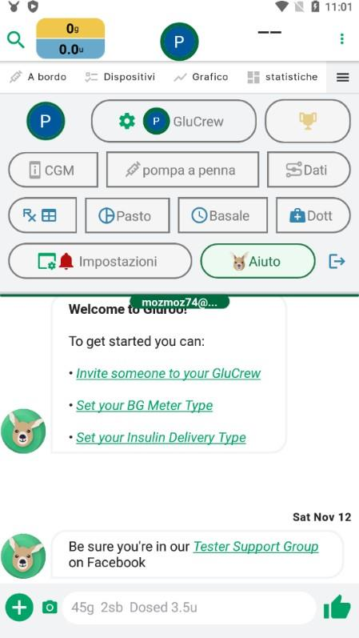

---

## 2. Configura la sorgente dati

Il menu **monitoraggio continuo della glicemia** propone tre sorgenti: **Dexcom**, **FSL tramite LLink** e **Fai da te tramite Nightscout**:

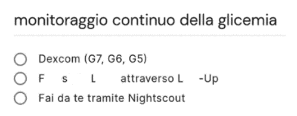

### Se usi Dexcom Share

Puoi inserire Gluroo come follower dell'app Dexcom, senza usare altre app.

1. Inserisci il tuo **login Dexcom Share** (lo stesso usato sull'app master).
2. Inserisci la **password** corrispondente.
3. Se usi server europei, abilita l'opzione per server non USA.

Selezionando **Dexcom**, compaiono i campi per nome utente e password di condivisione e l'interruttore per i server alternativi (non USA):

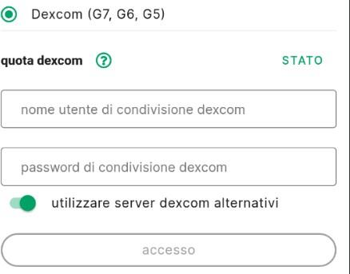

> ℹ️ **Nota**: Per usare Dexcom Share serve almeno un follower attivo. Puoi aggiungere te stesso come follower, verificare che funzioni e poi disinstallare l'app follower. La condivisione deve rimanere attiva nell'app master.

La schermata **Dexcom Share** dell'app Dexcom, con la condivisione attiva e l'elenco dei follower:

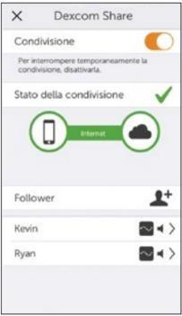

4. Clicca **Verifica accesso**. A breve dovresti vedere la glicemia in Gluroo.

### Se usi LView (FSL2 o FSL3)

Puoi inserire Gluroo come follower di LView.

1. Crea un account follower in LView e invia un invito a te stesso.
2. In Gluroo, inserisci il **login follower LView** (l'invito ricevuto) e la **password** corrispondente.
3. Clicca **Verifica accesso**. A breve dovresti vedere la glicemia in Gluroo.

In alto, la schermata **Condividi** dell'app del fornitore per gestire i collegamenti; in basso, i campi di Gluroo per il nome utente e la password del collegamento follower:

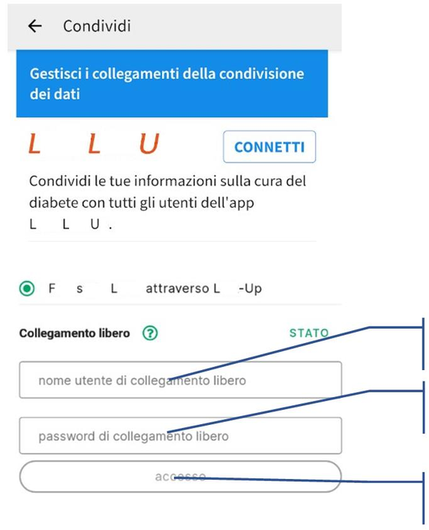

### Modalità "Fai da te" (equivalente Nightscout)

Questa modalità crea un endpoint compatibile con Nightscout: puoi usare l'indirizzo Gluroo come se fosse il tuo sito Nightscout.

- **Indirizzo Nightscout:** il tuo indirizzo Gluroo (formato: [`https://xxxx.xx.gluroo.com:porta`](https://xxxx.xx.gluroo.com:porta))
- `API_SECRET`: la password mostrata nell'app

Selezionando **Fai da te tramite Nightscout**, l'app mostra il tuo **Nightscout URL** e l'**API Secret**, con le icone per copiarli:

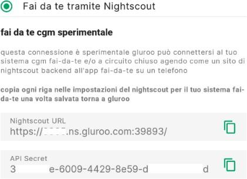

> ℹ️ **Nota**: Usa l'icona di copia per mandare questi valori a te stesso via SMS o email, così puoi inserirli facilmente sugli altri dispositivi.

**Compatibilità (verificata a settembre 2023):**

| App / Dispositivo | Come master | Come follower |
|---|---|---|
| xDrip | ✓ | ✓ |
| xDrip4iOS (Shuggah) | ✓ | ✓ |
| Loop | ✓ | ✓ |
| Diabox | ✓ | ✓ |
| Nightguard (Apple Watch) | ✓ | ✓ |
| Nightwatch | ✓ | ✓ |
| M5Stack NightscoutMon | — | ✓ (firmware nov. 2022 o successivo) |
| Garmin | — | ✓ |
| Samsung Watch (G-Watch) | — | ✓ |
| FitBit | — | ✗ |

> ℹ️ **Nota**: Se usi Dexcom Share o LView come sorgente, non hai bisogno di un master separato.

Per vedere la glicemia in una pagina web, usa **Gluroo Web**: c'è anche una modalità semplificata con solo il valore corrente.

La pagina **Gluroo Web** con il grafico delle ultime 24 ore:

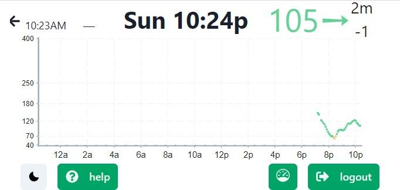

La modalità semplificata, con solo il valore corrente, il trend e i minuti dall'ultima lettura:

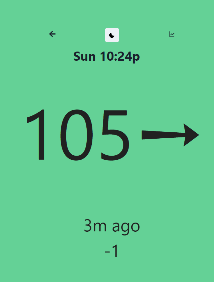

---

## 3. Configura xDrip con Gluroo

Con xDrip usa questi formati di URL:

- **Master:** [`https://API_SECRET@xxxx.xx.gluroo.com:porta/api/v1`](https://API_SECRET@xxxx.xx.gluroo.com:porta/api/v1)
- **Follower:** [`https://API_SECRET@xxxx.xx.gluroo.com:porta`](https://API_SECRET@xxxx.xx.gluroo.com:porta)

Come master: in **API Upload (REST)** di xDrip, abilita il caricamento e inserisci l'indirizzo Gluroo (con `/api/v1` finale) nel campo **URL di base**:

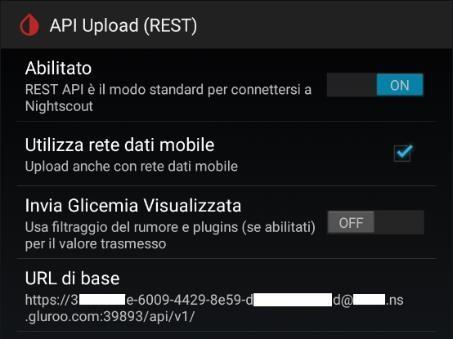

Come follower: in **Impostazioni Origine Dati**, imposta **Nightscout Follower** come sorgente e inserisci l'indirizzo Gluroo in **URL Nightscout Follow**:

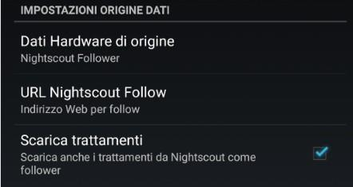

### xDrip4iOS (Shuggah)

Anche con xDrip4iOS (Shuggah) puoi collegarti a Gluroo come master o come follower, dalle impostazioni dell'app.

Per usarlo come master, vai su **Settings** e nella sezione **Nightscout** inserisci l'indirizzo Gluroo come URL e la password come `API_SECRET`.

Nella sezione **Nightscout** delle impostazioni, attiva **Enable Nightscout** e compila **URL** e **API_SECRET**:

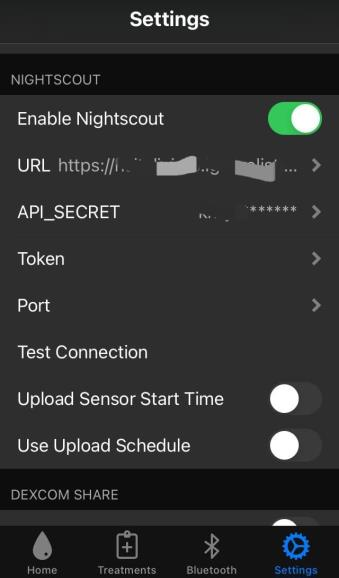

Nella sezione **CGM Data Source**, seleziona **Master**.

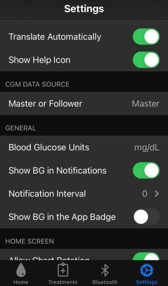

Per usarlo invece come follower, seleziona **Follower** e imposta **Nightscout** come origine dati.

In **CGM Data Source**, imposta **Master or Follower** su **Follower** e **Follower Data Source** su **Nightscout**:

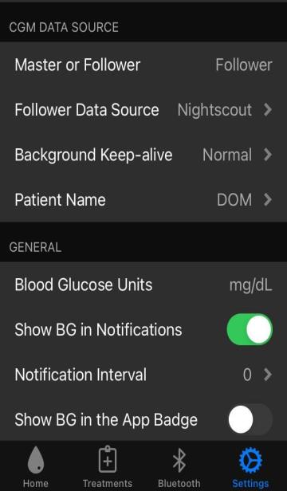

### Nightguard e Nightwatch

Inserisci l'indirizzo così: [`https://xxxx.xx.gluroo.com:porta?token=API_SECRET`](https://xxxx.xx.gluroo.com:porta?token=API_SECRET)

Nightguard su iPhone mostra il valore corrente, le statistiche e il grafico ricevuti da Gluroo:

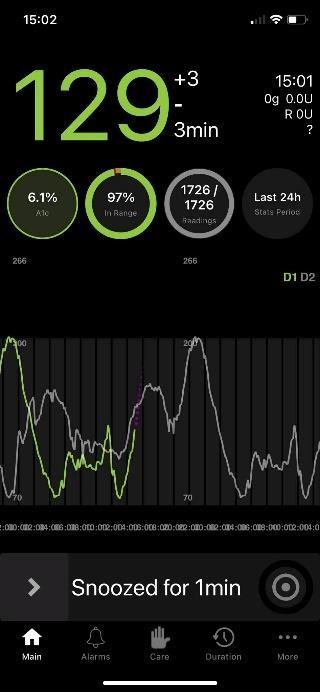

Nightwatch su Android mostra il valore corrente a schermo intero, con orario e minuti dall'ultima lettura:

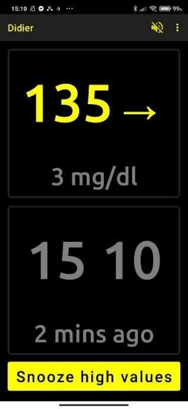

### M5Stack NightscoutMon

Nella configurazione web dell'M5Stack ([`http://m5ns.local`](http://m5ns.local)):
- **Nightscout URL:** il tuo indirizzo Gluroo
- `API_SECRET`: la password corrispondente

Nella pagina di configurazione, inserisci l'indirizzo Gluroo in **Nightscout site URL** e la password in **Security token**:

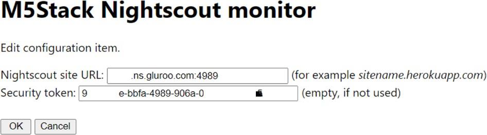

Assicurati di avere il firmware aggiornato (per aggiornarlo, apri [`http://m5ns.local`](http://m5ns.local) e segui la [guida M5Stack](../nightscout/monitor-nightscout-m5stack)).

Nella sezione **Application firmware** della stessa pagina puoi verificare la versione installata e aggiornarla con **click to update**:

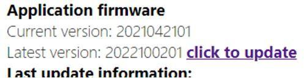

---

## 4. Maggiori informazioni

- Gruppo Facebook di Gluroo: [`https://www.facebook.com/groups/1326762991077589`](https://www.facebook.com/groups/1326762991077589)
- Blog ufficiale: [`https://www.gluroo.com/blog/nightscout_heroku_alternative_free/index.html`](https://www.gluroo.com/blog/nightscout_heroku_alternative_free/index.html)
