# Juggluco per Android con FSL 2

Guida base passo passo per l'installazione di Juggluco su Android con un sensore FSL2. Puoi anche usare Juggluco solo per scansionare un sensore FSL 1 o FSL2, senza abbinarlo stabilmente.

> ⚠️ È necessario un telefono Android dalla versione 4.4 in su, con supporto Bluetooth 4.2 (BLE) e lettore NFC.

> ⚠️ Come qualsiasi app di terza parte, l'uso con un sensore FSL2 **disabiliterà gli allarmi di LLink definitivamente**, senza possibilità di ripristino. L'abbinamento di un sensore FSL2 a Juggluco invalida la garanzia e non si può chiedere la sostituzione per problemi di allarmi mancanti.

> ⚠️ Se vuoi installare Juggluco sul telefonino di un bambino, Play Protect va disabilitato temporaneamente.

Documentazione originale: [`http://jkaltes.byethost16.com/Juggluco/`](http://jkaltes.byethost16.com/Juggluco/)

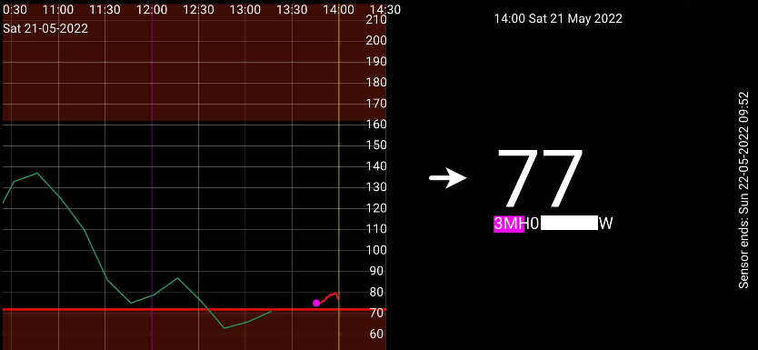

## Contenuto della guida

1. [Prerequisito](#1-prerequisito)
2. [Installare Juggluco](#2-installare-juggluco)
3. [Collegare il sensore](#3-collegare-il-sensore)
4. [Configurare Juggluco](#4-configurare-juggluco)

## 1. Prerequisito

Juggluco usa le librerie di **LLink**: conviene installarlo su un telefono dove l'app LLink è già presente (con la geolocalizzazione o il Bluetooth disabilitati per LLink, da **Impostazioni Android → App → LLink**).

Versioni delle librerie richieste:
- **FSL2 USA e Canada:** LLink versione `2.5.2`, `2.5.3` o `2.7.1`.
- **Altri sensori** (Italia inclusa): LLink versione `2.4.0`, `2.4.1` o `2.4.2` (le versioni successive funzionano comunque, ma consumano più batteria). Il codice del paese non fa differenza.

Se non hai già LLink installata, puoi scaricare l'apk da una lista di link su [`http://jkaltes.byethost16.com/Juggluco/urls.html`](http://jkaltes.byethost16.com/Juggluco/urls.html) — scegli una versione **non-US** (ricorda che APKPure è bloccato in Italia).

## 2. Installare Juggluco

Juggluco è disponibile nel Google Play Store. Aprilo e cerca "juggluco" oppure segui questo link:

[`https://play.google.com/store/apps/details?id=tk.glucodata`](https://play.google.com/store/apps/details?id=tk.glucodata)

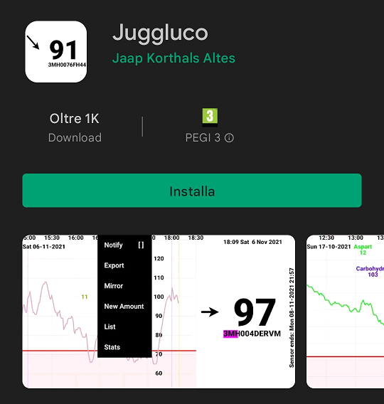

Una volta installata, l'app compare così, con i pulsanti **Disinstalla** e **Apri**:

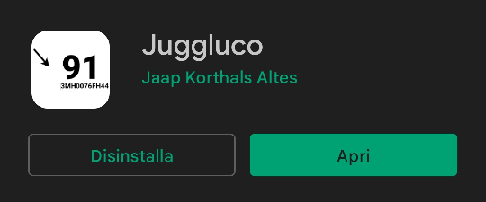

Apri Juggluco. Autorizza il collegamento e l'accesso alla posizione:

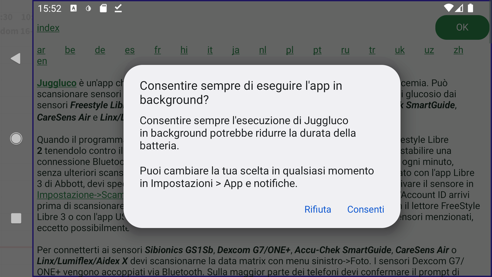

Autorizza anche Juggluco a non essere ottimizzata dalla batteria, così può restare in esecuzione in background:

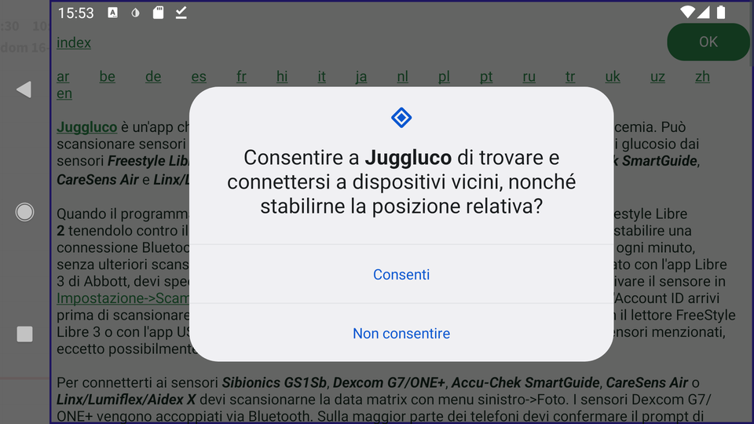

Alla primissima apertura, l'app mostra le versioni di libreria richieste (vedi [Prerequisito](#1-prerequisito)) e due pulsanti: **Senza sensore** (modalità follower, senza accesso diretto al sensore) e **Apri**. Scegli **Apri**:

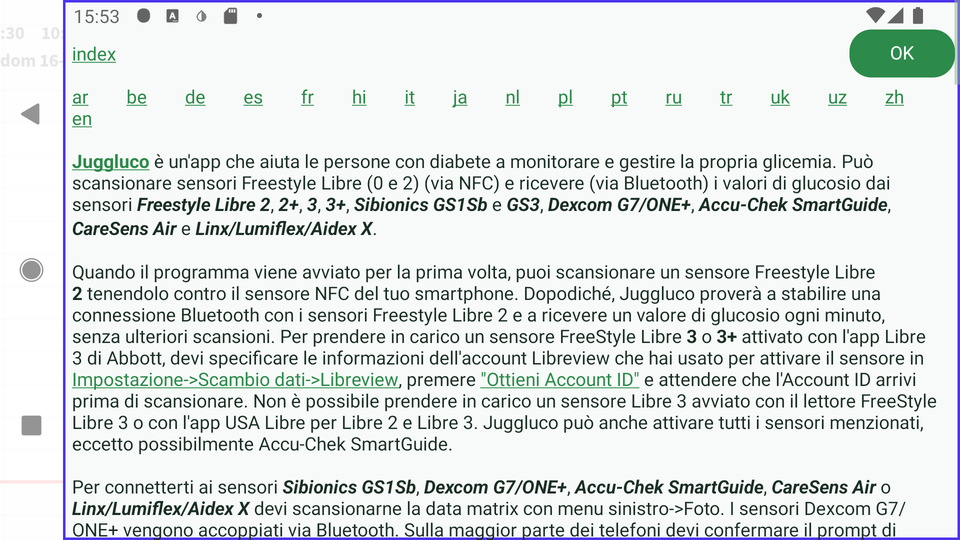

Si apre la schermata principale di Juggluco, in modalità orizzontale (non è possibile passare alla modalità verticale):

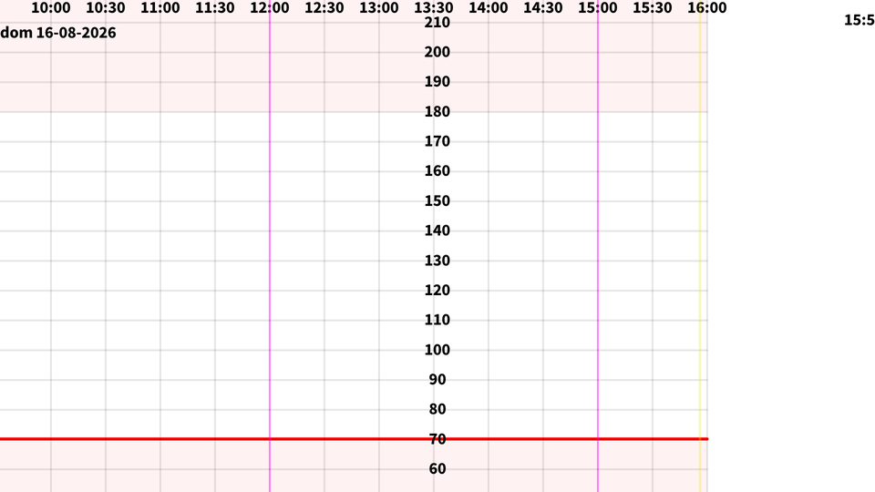

> ℹ️ **Nota**: Se invece si apre il contenuto **Downloads** del telefono, vuol dire che non hai installato LLink. Torna indietro, vai su [`http://jkaltes.byethost16.com/Juggluco/urls.html`](http://jkaltes.byethost16.com/Juggluco/urls.html) e scarica una versione qualsiasi della lista **non-US**. Torna sulla schermata con **Apri** e, quando ti riporta nella cartella Download, seleziona l'app LLink che hai scaricato.

## 3. Collegare il sensore

Lascia Juggluco aperto e scansiona il sensore. Servono due scansioni per collegare un nuovo sensore.

Dopo la prima scansione dovrebbe comparire una schermata di conferma: fai **OK**.

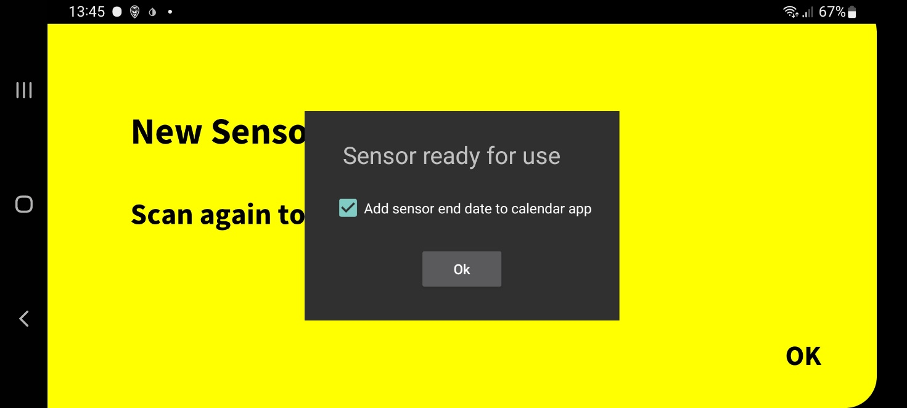

Se vedi un messaggio che chiede quale app usare (durante qualsiasi scansione), seleziona **Juggluco** (non LLink):

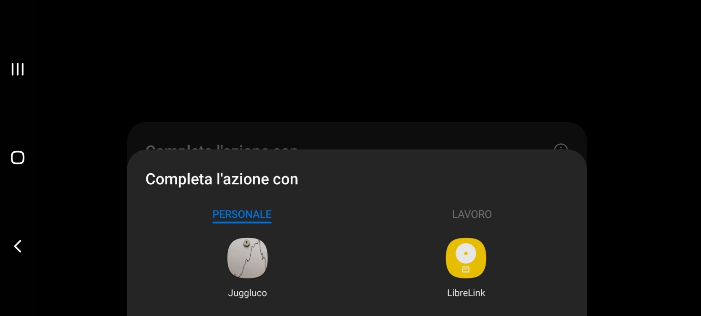

Dopo la seconda scansione dovresti vedere la curva di glicemia: fai **OK**.

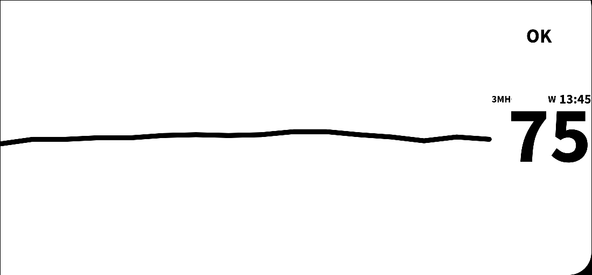

Una volta tornato al grafico principale, la scansione compare con un punto verde:

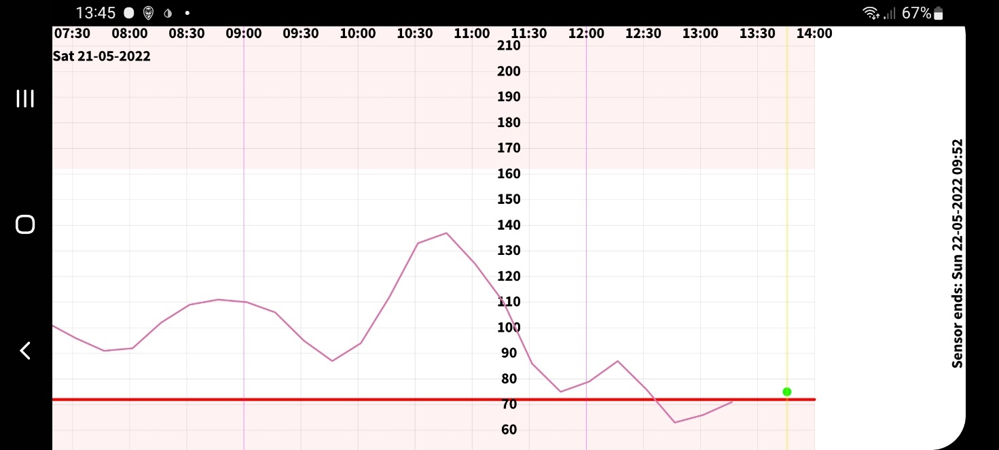

Entro un minuto dovresti vedere i valori in tempo reale (scorri il grafico verso sinistra):

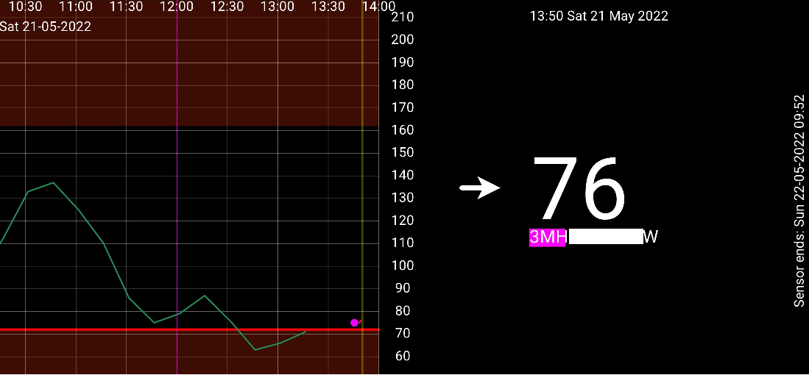

Se dopo qualche minuto non hai dati:

1. Verifica che l'app LLink sia disabilitata, senza accesso alla geolocalizzazione, oppure disinstallata.
2. Prova a scansionare di nuovo il sensore.
3. Prova a riavviare il telefono e scansionare di nuovo.

La glicemia compare nella tendina delle notifiche. Tocca **JUGGLUCO** per aprire l'app:

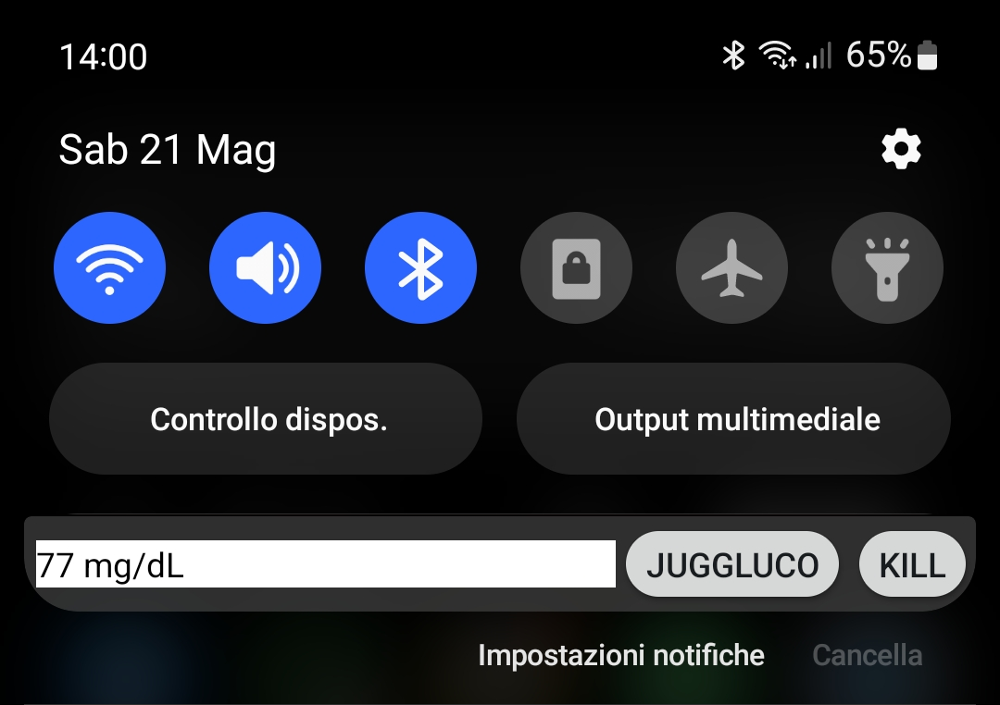

Se il tuo telefono lo supporta, il valore appare anche nelle icone in alto a sinistra:

## 4. Configurare Juggluco

Ci sono 4 menu, raggiungibili con un tocco in 4 diverse zone dello schermo (angoli in alto a sinistra, in alto a destra, in basso a sinistra e in basso a destra):

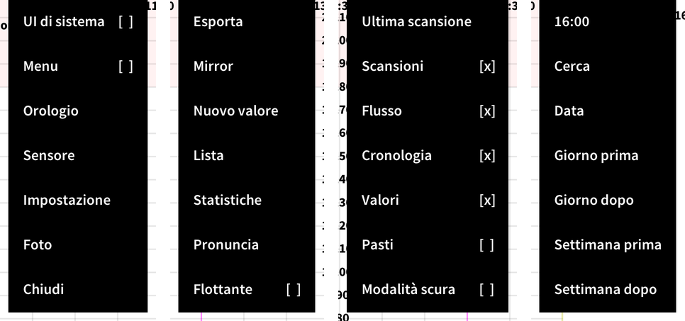

### Menu 1

**System UI:** attiva o disattiva la vista a schermo pieno.

**Watch:**

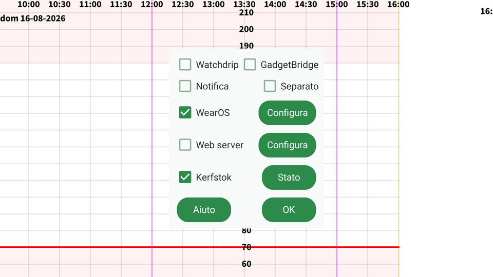

- **WearOS** permette di configurare il quadrante Juggluco su uno smartwatch Android Wear. Nel menu **WearOS Config**, scegli il tuo dispositivo e fai **Init watch app** (non usare *Direct sensor-watch connection*). Lo smartwatch dovrebbe ricevere la glicemia dal telefono tramite Bluetooth.

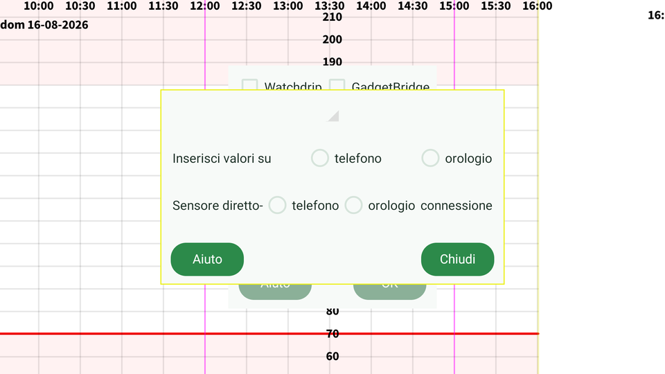

  - In alternativa, puoi installare Juggluco dal Google Play Store dello smartwatch abbinato al telefono (cerca "Juggluco"). Con i vecchi smartwatch, puoi installarlo anche dalle app presenti sul telefono.

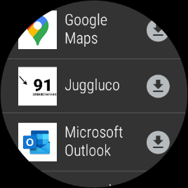

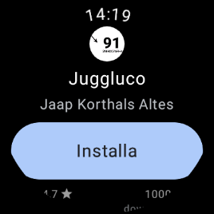

  - Una volta installato, il quadrante mostra il grafico direttamente sull'orologio:

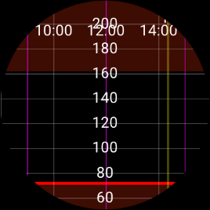

  - *Nota: questo metodo potrebbe non funzionare con tutti i dispositivi.*
- **xDrip webserver** permette di collegare smartwatch Fitbit e Samsung usando xDrip come sorgente dati.
- **Kerfstok** è un quadrante per Garmin: [`https://apps.garmin.com/en-UK/apps/b6348ccc-86d8-4780-8013-d9e19fed5260`](https://apps.garmin.com/en-UK/apps/b6348ccc-86d8-4780-8013-d9e19fed5260)

**Sensor:** mostra informazioni sul sensore e lo stato del collegamento.

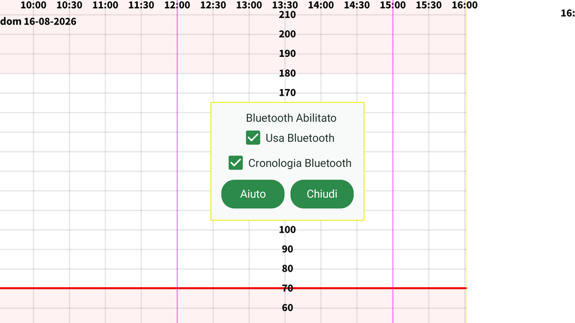

- **Use Bluetooth** deve essere abilitato.
- Se vuoi cambiare sensore, fai **Forget** prima.
- Se hai perso il collegamento, prova **Reenable** e scansiona il sensore.
- Nella colonna **Last success** dovresti vedere l'orario dell'ultima lettura.

**Settings:** il menu di configurazione permette di impostare diversi parametri.

- **Unità di misura** (mg/dL o mmol/L).

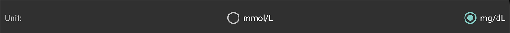

- **Scala verticale**: manuale (seleziona **Glucose** e inserisci i valori in **Graph range**) o automatica. Puoi anche fissare la scala automatica a un intervallo di tempo (deseleziona **Time**).

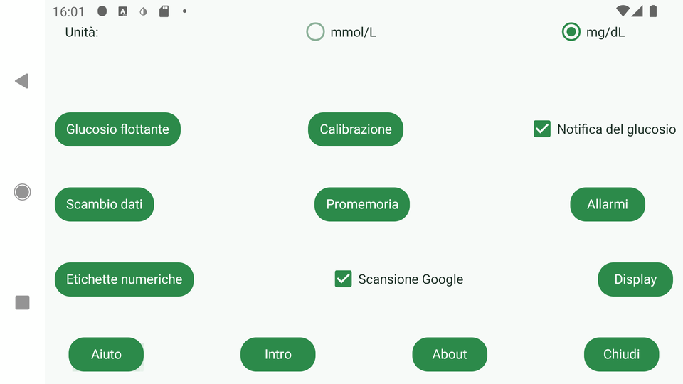

- **Range** target (visibile in bianco o nero sul grafico).

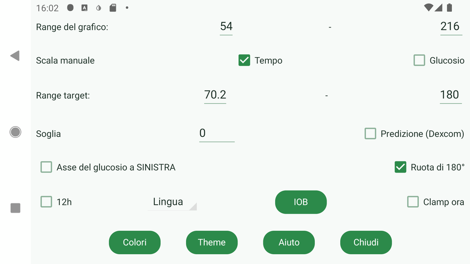

- Numeri della scala di glicemia a sinistra, e trasmissione delle letture a xDrip: per questa opzione, configura xDrip con sorgente dati "app Libre patchata".

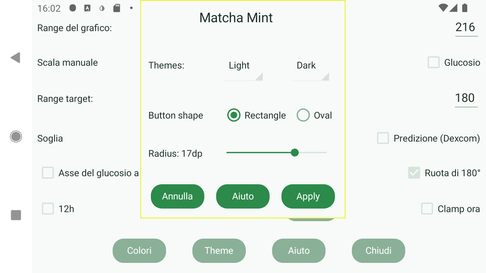

- **Scanning starts app**: fa aprire Juggluco quando si scansiona il sensore; puoi abilitare anche un suono alla scansione NFC.

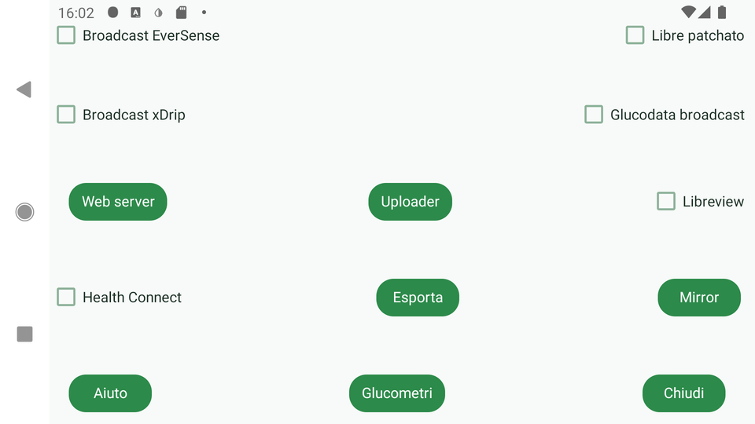

- **Invert screen**: passa in modalità scura. Da questa stessa schermata si apre anche il menu **Reminders** (promemoria).

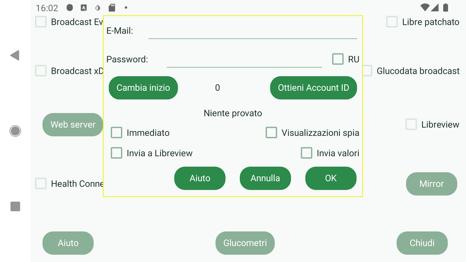

- **Sensor via Bluetooth**: obbligatorio per il collegamento diretto con il FSL2; opzionale se usi Juggluco solo per scansionare il sensore. Da qui si apre anche il menu **Alarms** (allarmi).

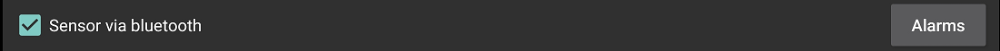

- Puoi personalizzare i colori del display (**Colors**), creare scorciatoie per dosi e quantità (**Shortcuts**) e modificare l'elenco delle azioni per i promemoria (**Number Labels**).

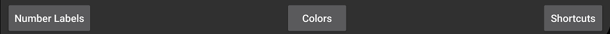

### Menu Reminders

Puoi impostare dei promemoria per ricordarti di fare determinate azioni, con allarme se te ne dimentichi.

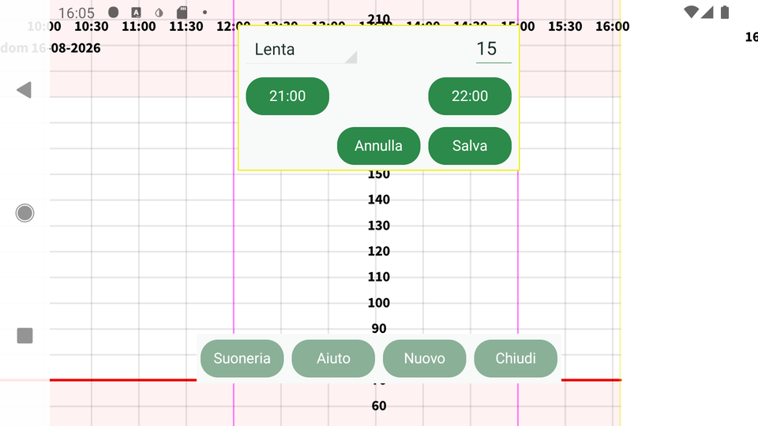

Con **New** puoi creare un nuovo promemoria:

1. Scegli nella lista l'azione da ricordare.
2. Inserisci un valore in `x` (unità, CHO, tempo, ecc.).
3. In **1**: decidi da quando puoi eseguire l'azione.
4. In **2**: decidi entro quando devi eseguirla.

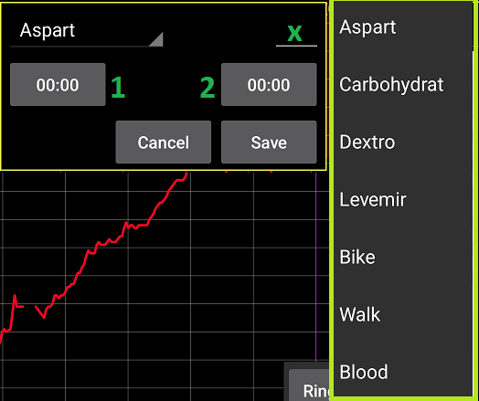

Se non hai registrato l'azione in Juggluco entro l'orario indicato in **2**, l'app suonerà un allarme.

Esempio: Levemir 15 unità (insulina lenta) dalle 21:00 alle 22:00.

Tocca **Ringtone** su un promemoria per personalizzarne la suoneria:

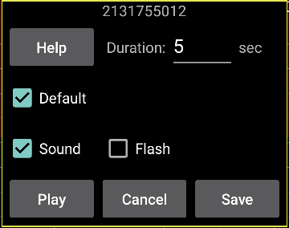

- **Duration**: durata della suoneria.
- Se rimuovi **Default**, puoi selezionare la suoneria che preferisci.
- Se non è attivato **Sound**, l'app non suona.
- **Flash**: fa lampeggiare il flash della fotocamera.

### Menu Allarmi

Tocca **Ringtone** su un allarme per configurarne la suoneria. Per l'allarme di glicemia bassa è disponibile anche **Minutes deactivated** (durata del silenziamento dopo che l'allarme è scattato):

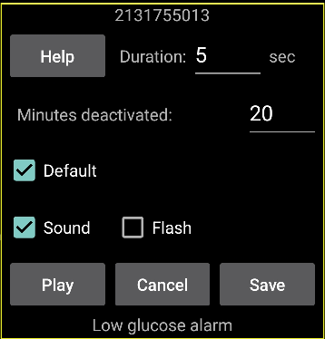

Tipi di allarme disponibili:

- Allarme glicemia bassa, con valore soglia:

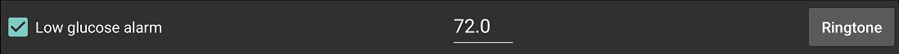

- Allarme glicemia alta, con valore soglia:

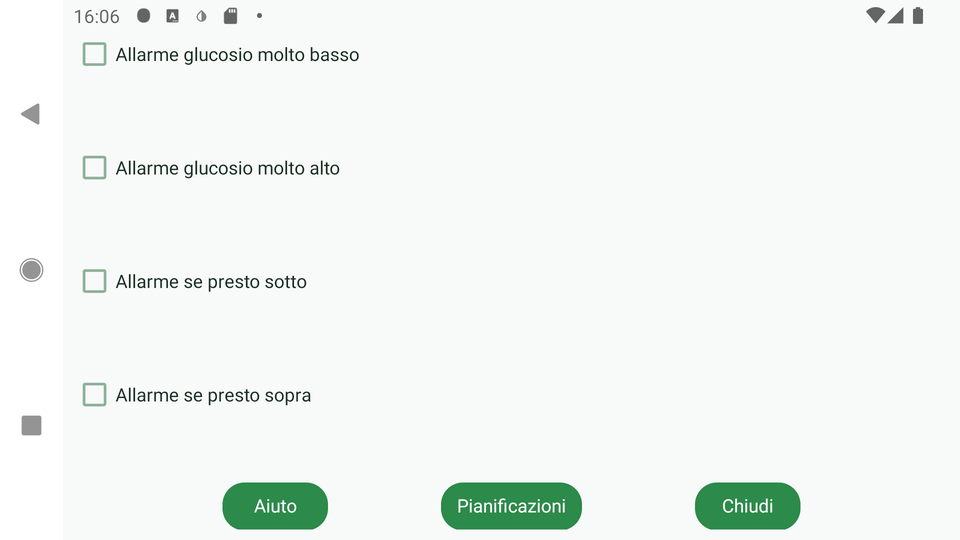

- Allarme lettura assente dopo tot minuti:

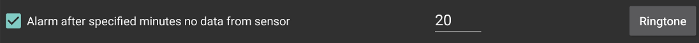

- Allarme valori disponibili (avvisa quando i dati tornano dopo un'interruzione); da qui puoi anche mostrare la glicemia nella barra di stato Android:

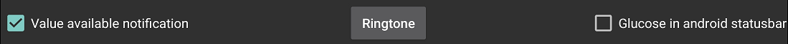

> ⚠️ **Off touch** disabilita l'allarme toccando il grafico: fai attenzione a non farlo per sbaglio.

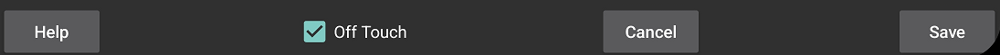

### Menu 2

Il menu in alto a destra (vedi il diagramma a inizio sezione) include: **Notify**, **Export**, **Mirror**, **New Amount**, **List**, **Statistics**. La documentazione originale non descrive nel dettaglio queste voci; **New Amount** apre la stessa schermata di creazione promemoria vista sopra ([Menu Reminders](#menu-reminders)).

### Menu 3 e Menu 4

Toccando gli angoli in basso a sinistra e in basso a destra si aprono altri due menu, visibili nel diagramma a inizio sezione:

- **In basso a sinistra:** Last Scan, Scans, Stream, History, Amounts, Meals, Dark mode.
- **In basso a destra:** Search, Date, Day back, Day later, Week back, Week later.

Anche questi non sono descritti nel dettaglio nella documentazione originale, ma i nomi sono abbastanza intuitivi: navigazione tra le date del grafico e riepiloghi delle scansioni/pasti registrati.
