# Juggluco con FSL 2 e xDrip+ per Android

Questa guida spiega come usare **Juggluco** per leggere un sensore **FSL 2** e inviare i dati a **xDrip+**, che gestirà condivisione, allarmi e visualizzazione sullo smartwatch.

> ℹ️ L'app FSL 2 ufficiale (LLink) ora supporta la lettura continua senza scansionare il sensore. Usare Juggluco per questo scopo non è più indispensabile, ma rimane utile per chi vuole integrare xDrip+ nel proprio sistema.

> ⚠️ Come qualsiasi app di terza parte, collegare un sensore FSL 2 a Juggluco **disabilita definitivamente gli allarmi dell'app ufficiale** per quel sensore. Se vuoi ripristinare la funzionalità, prova a disinstallare Juggluco e reinstallare l'app ufficiale con lo stesso account — ma il recupero non è garantito. L'abbinamento invalida la garanzia: non potrai richiedere la sostituzione del sensore per problemi di allarmi mancanti.

> ⚠️ Se installi Juggluco sul telefono di un bambino, disabilita temporaneamente **Play Protect** prima dell'installazione.

**Requisiti:** telefono Android 4.4 o superiore, con Bluetooth 4.2 (BLE) e lettore NFC.

Documentazione originale: `http://jkaltes.byethost16.com/Juggluco/`

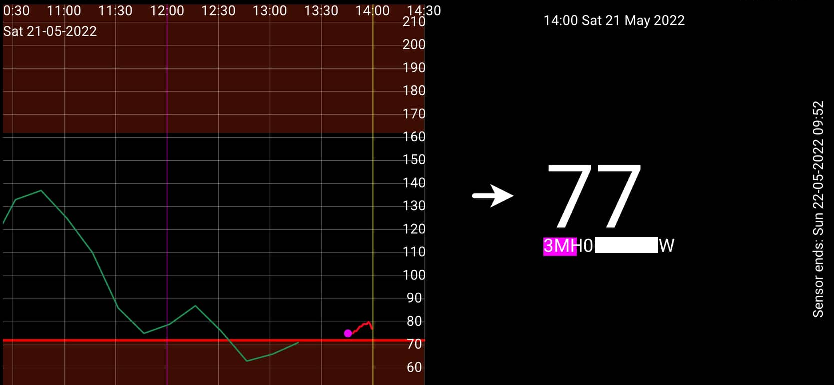

---

## 1. Prerequisito — Disinstalla o disabilita l'app LLink

Disinstalla l'app LLink (o disabilitala togliendole l'accesso alla geolocalizzazione). Se LLink è attiva in background, interferirà con Juggluco.

---

## 2. Installa Juggluco

Juggluco non è disponibile nel Google Play Store. Scaricala dal sito ufficiale:

`https://www.juggluco.nl/Juggluco/download.html`

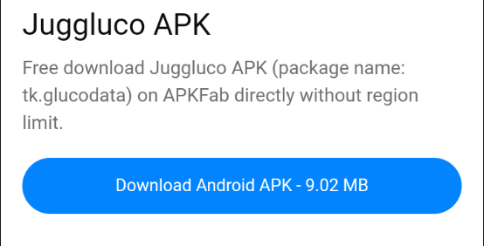

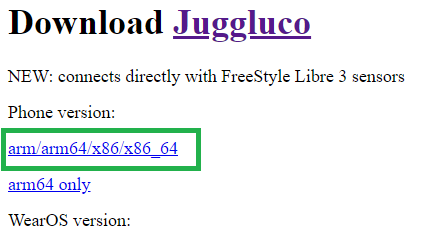

Installa il file `.apk` e apri l'app. Autorizza il collegamento, l'accesso alla posizione e consenti a Juggluco di non essere ottimizzata dalla batteria.

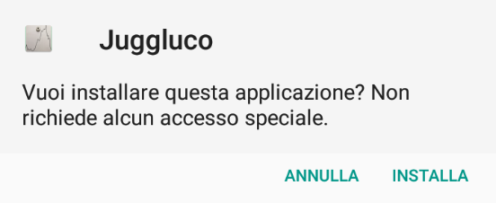

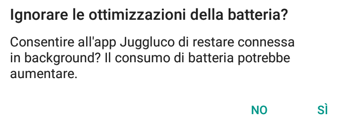

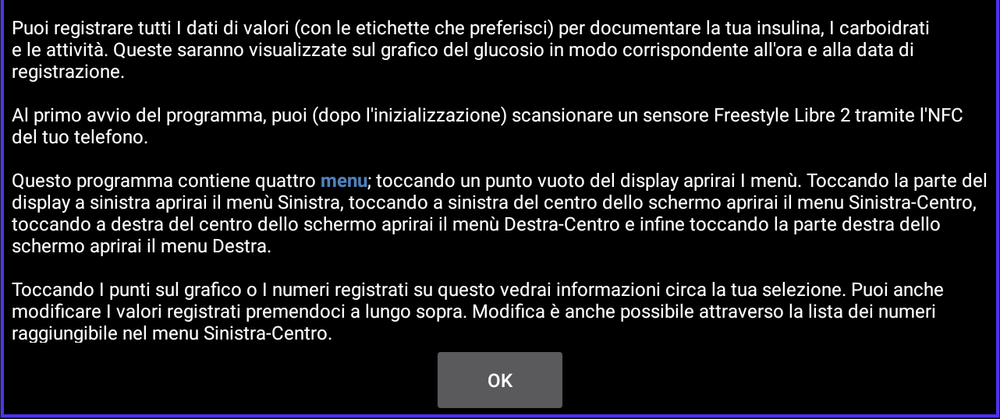

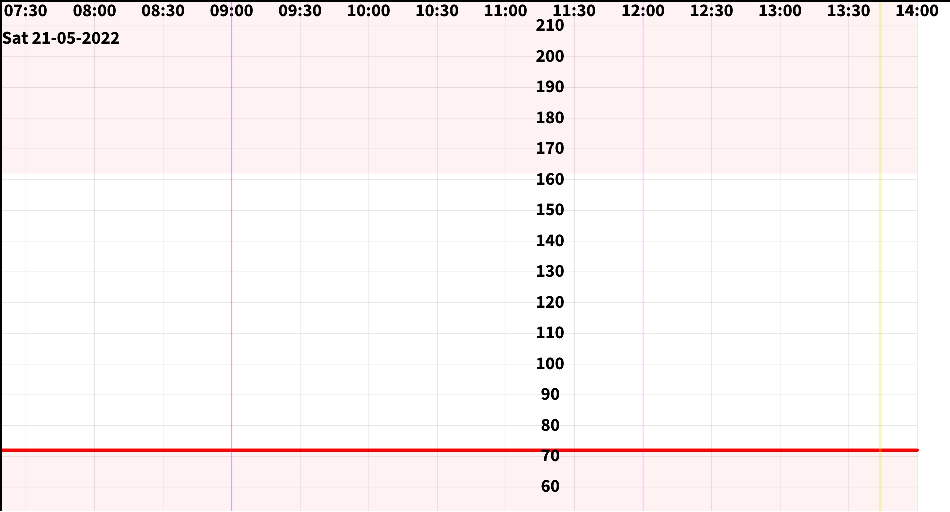

---

## 3. Collega il sensore

Con Juggluco aperto, scansiona il sensore con l'NFC del telefono. Sono necessarie due scansioni per collegare un nuovo sensore.

- Dopo la **prima scansione** compare una schermata di conferma: fai **OK**.

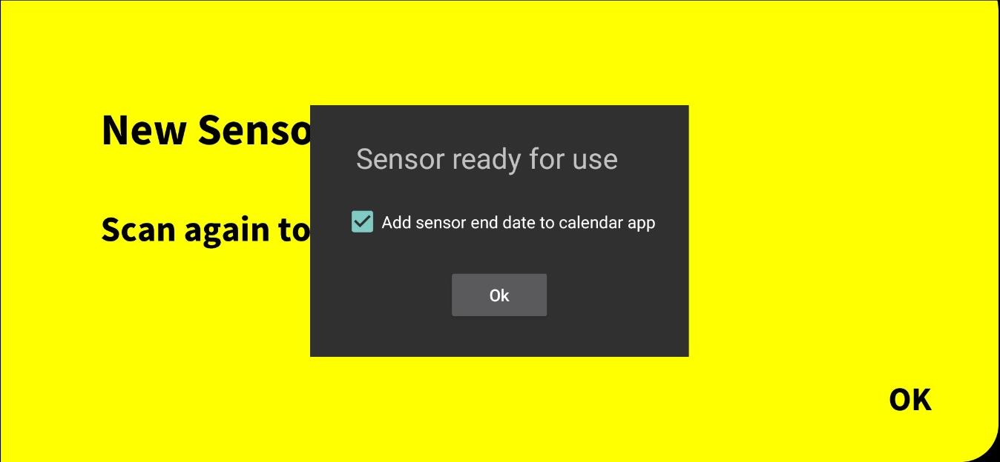

- Se appare un messaggio che chiede quale app usare, seleziona **Juggluco** (non LLink).

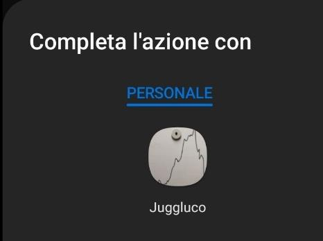

- Dopo la **seconda scansione** comparirà la curva di glicemia: fai **OK**.

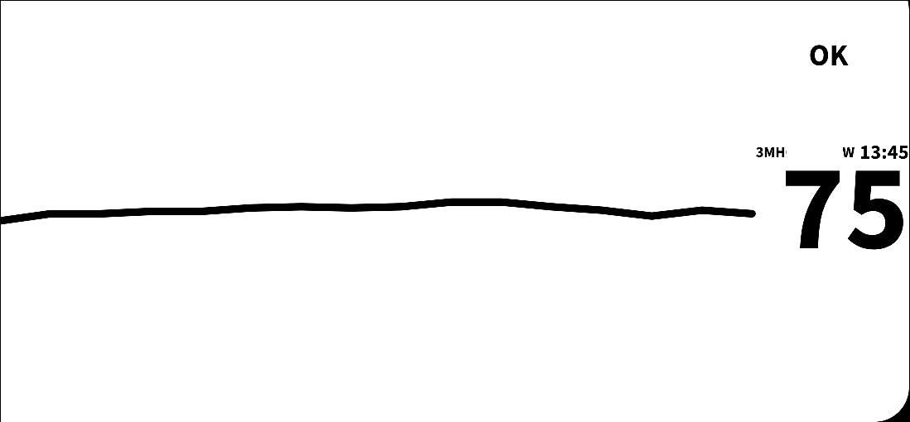

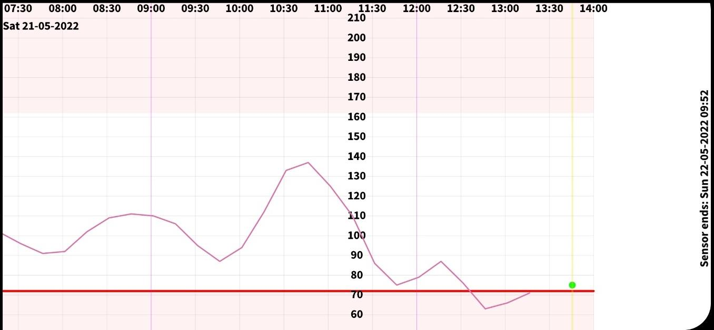

Entro un minuto dovresti vedere i valori in tempo reale (scorri il grafico verso sinistra).

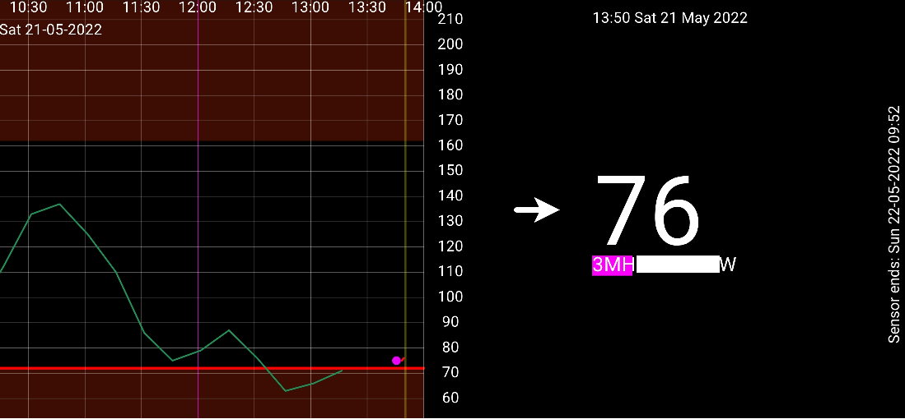

Se dopo qualche minuto non hai dati:
1. Verifica che LLink sia disabilitata o disinstallata.
2. Prova a scansionare di nuovo il sensore.
3. Prova a riavviare il telefono e scansionare di nuovo.

---

## 4. Configura Juggluco

Apri il **Menu 1** (tocca in alto a sinistra nello schermo).

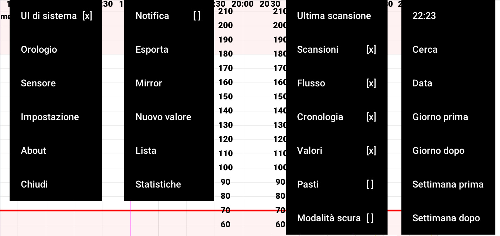

In **Sensore**:
- Verifica che **Usa Bluetooth** sia abilitato.
- Se hai perso il collegamento, prova **Riabilita** e poi scansiona il sensore.
- La colonna **Ultimo successo** deve mostrare l'orario dell'ultima lettura.

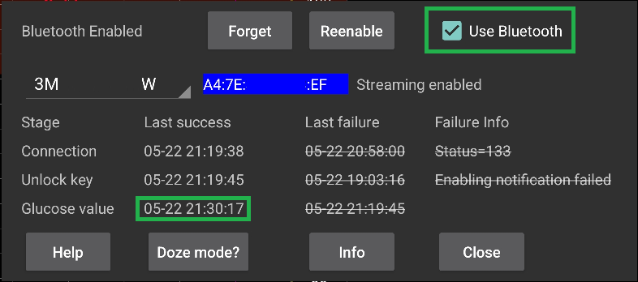

In **Impostazioni**:
- Abilita **Trasmissione letture a xDrip+** (nelle versioni più recenti l'opzione può avere un nome leggermente diverso).

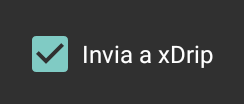

- **Inverti schermo** attiva la modalità scura.

- Abilita **Sensore via Bluetooth** — obbligatorio per il collegamento diretto con FSL 2.

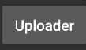

> ℹ️ Nel menu **Orologio** trovi WatchDrip+ per la compatibilità con Amazfit/MiBand, Kerfstok per Garmin, e GlucoDataHandler per Wear OS e Samsung Gear.

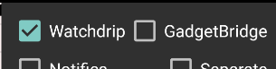

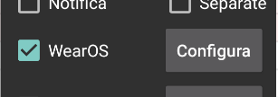

---

## 5. Configura xDrip+

Se non hai ancora xDrip+, installalo seguendo la [guida base](../xdrip/installare-xdrip-android).

Nell'app xDrip+, scegli come sorgente dati **App Libre patchata** — questa è l'opzione che riceve i dati da Juggluco.

Se non ricevi le letture di Juggluco in xDrip+, vai nel menù di xDrip+ e fai **Avvia nuovo sensore (non avviato oggi)**.

> ℹ️ Puoi applicare una correzione di calibrazione tra −40 e +20 mg/dL se il sensore non è ben allineato con la glicemia capillare. Esegui la calibrazione **solo a glicemia stabile, nel range 80–140 mg/dL**.

---

## Condivisione con altri dispositivi

Con xDrip+ puoi condividere la glicemia con altri telefoni Android tramite **xDrip+ Sync** (guida: Condivisione con xDrip+).

Per condividere con iPhone, è necessario Nightscout.
