# Juggluco con FSL 2 e xDrip per Android

Questa guida spiega come usare **Juggluco** per leggere un sensore **FSL 2** e inviare i dati a **xDrip**, che gestirà condivisione, allarmi e visualizzazione sullo smartwatch.

> ℹ️ L'app FSL 2 ufficiale (LLink) ora supporta la lettura continua senza scansionare il sensore. Usare Juggluco per questo scopo non è più indispensabile, ma rimane utile per chi vuole integrare xDrip nel proprio sistema.

> ⚠️ Come qualsiasi app di terza parte, collegare un sensore FSL 2 a Juggluco **disabilita definitivamente gli allarmi dell'app ufficiale** per quel sensore. Se vuoi ripristinare la funzionalità, prova a disinstallare Juggluco e reinstallare l'app ufficiale con lo stesso account — ma il recupero non è garantito. L'abbinamento invalida la garanzia: non potrai richiedere la sostituzione del sensore per problemi di allarmi mancanti.

> ⚠️ Se installi Juggluco sul telefono di un bambino, disabilita temporaneamente **Play Protect** prima dell'installazione.

**Requisiti:** telefono Android 4.4 o superiore, con Bluetooth 4.2 (BLE) e lettore NFC.

Documentazione originale: [`http://jkaltes.byethost16.com/Juggluco/`](http://jkaltes.byethost16.com/Juggluco/)

Un esempio della schermata principale di Juggluco, con il grafico della glicemia e il valore corrente in tempo reale:

---

## 1. Prerequisito — Disinstalla o disabilita l'app LLink

Disinstalla l'app LLink (o disabilitala togliendole l'accesso alla geolocalizzazione). Se LLink è attiva in background, interferirà con Juggluco.

---

## 2. Installa Juggluco

Juggluco non è disponibile nel Google Play Store. Scaricala dal [sito ufficiale](https://www.juggluco.nl/Juggluco/download.html).

> ⚠️ **Attenzione**: Cercando "Juggluco" online potresti trovare pagine di terze parti (store APK generici) che offrono il file da scaricare, come questa: usa sempre il sito ufficiale collegato sopra, per evitare di scaricare versioni modificate o non aggiornate.

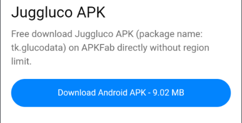

Sul sito ufficiale, nella sezione **Download Juggluco**, scegli la versione **Phone** adatta al tuo telefono (`arm/arm64/x86/x86_64`):

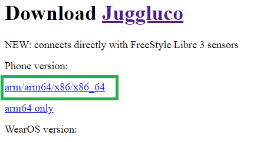

Installa il file `.apk` e apri l'app. Autorizza il collegamento, l'accesso alla posizione e consenti a Juggluco di non essere ottimizzata dalla batteria.

Conferma l'installazione del file `.apk`:

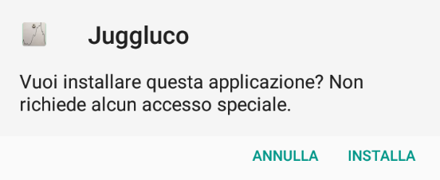

Concedi l'autorizzazione per accedere alla posizione, necessaria per il Bluetooth:

Consenti a Juggluco di restare connessa in background, ignorando le ottimizzazioni della batteria:

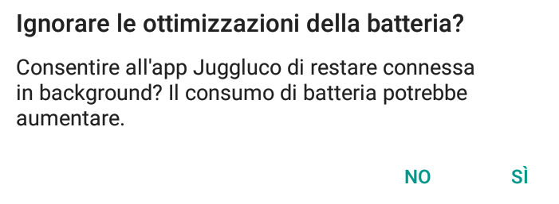

Al primo avvio, l'app mostra una schermata informativa su come registrare i dati e navigare tra i quattro menu (toccando le diverse zone dello schermo): tocca **OK** per proseguire:

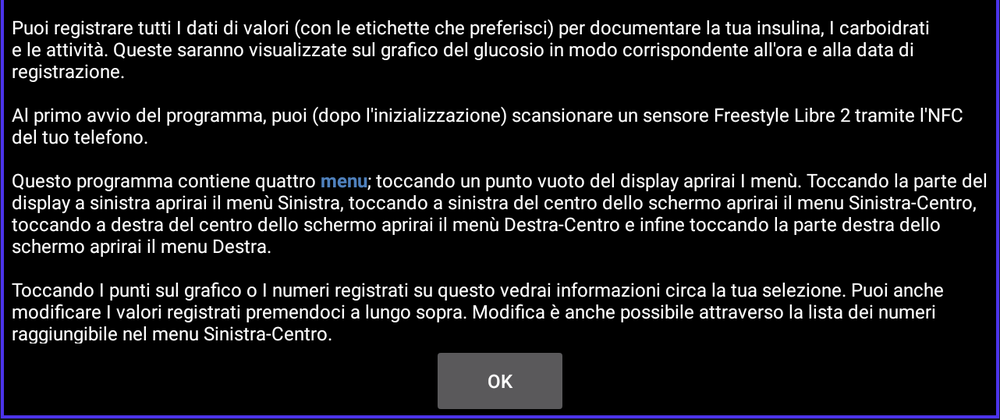

---

## 3. Collega il sensore

Con Juggluco aperto, scansiona il sensore con l'NFC del telefono. Sono necessarie due scansioni per collegare un nuovo sensore.

Prima della scansione, il grafico di Juggluco è ancora vuoto:

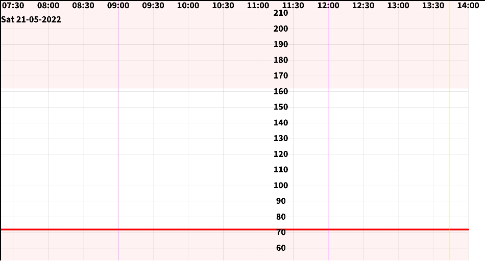

- Dopo la **prima scansione** compare una schermata di conferma: fai **OK**.

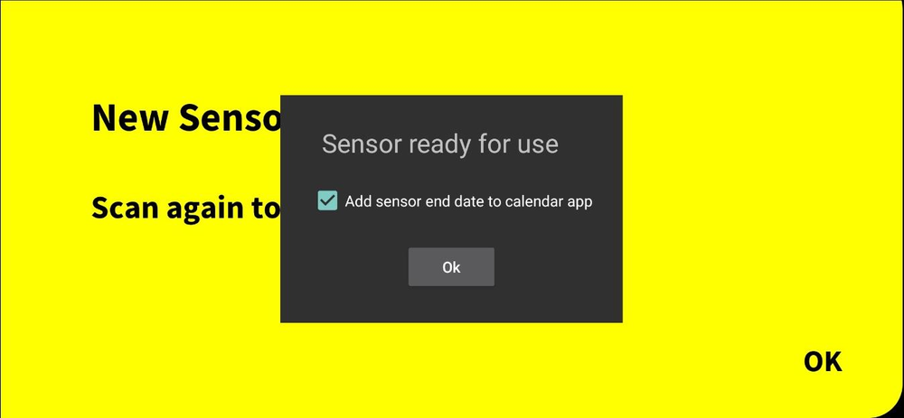

- Se appare un messaggio che chiede quale app usare, seleziona **Juggluco** (non LLink).

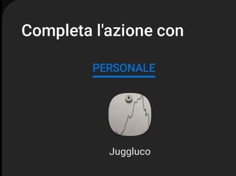

- Dopo la **seconda scansione** comparirà la curva di glicemia: fai **OK**.

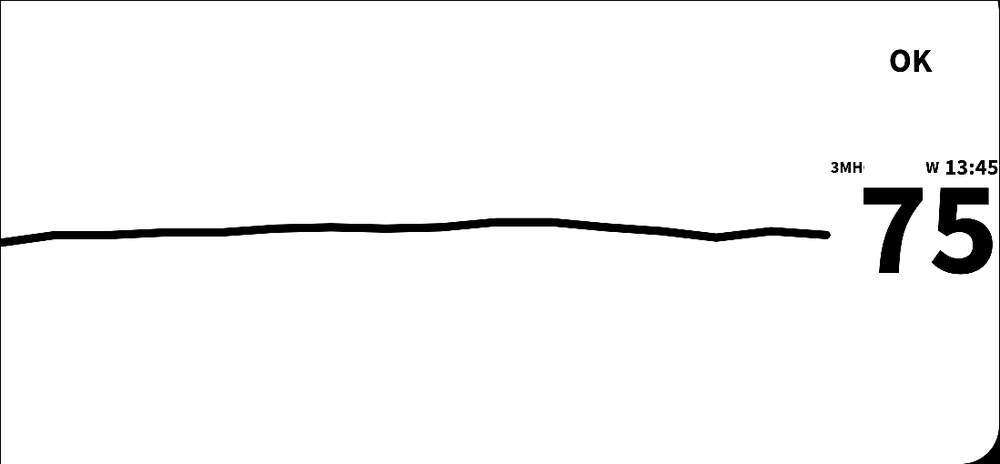

Entro un minuto dovresti vedere i valori in tempo reale (scorri il grafico verso sinistra).

Il grafico si popola con le letture della giornata, con il valore più recente evidenziato dal pallino verde:

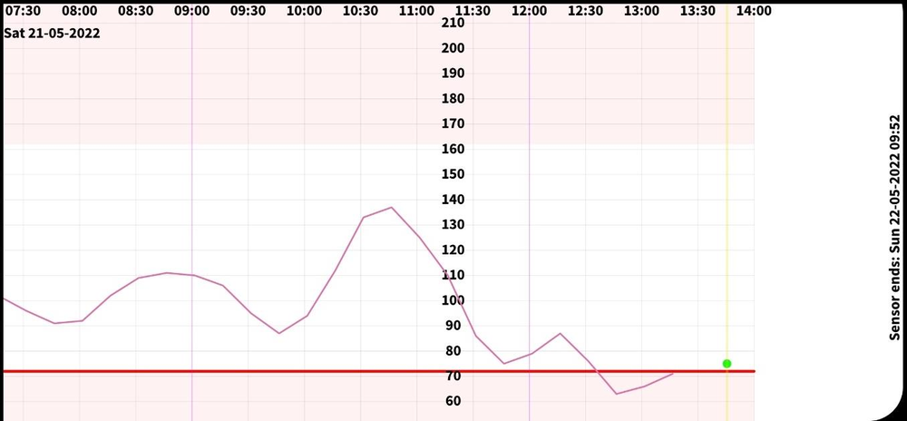

Toccando il grafico puoi vedere il dettaglio del valore e dell'orario di ogni singola lettura:

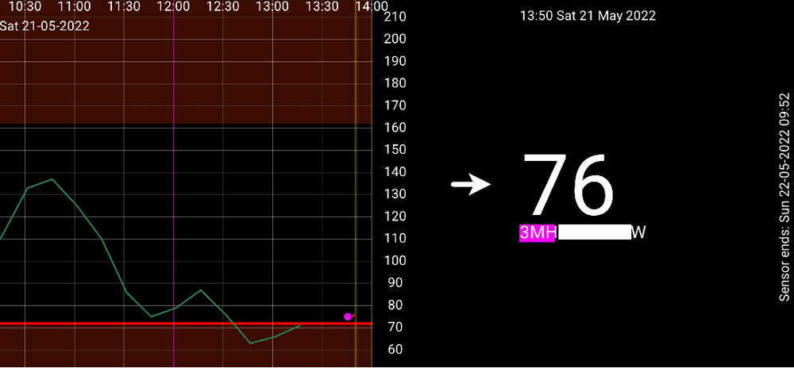

Juggluco mostra il valore anche in una notifica persistente e nella barra di stato del telefono.

Nel pannello delle notifiche compare una voce persistente con il valore corrente, oltre ai tasti **JUGGLUCO** e **KILL**:

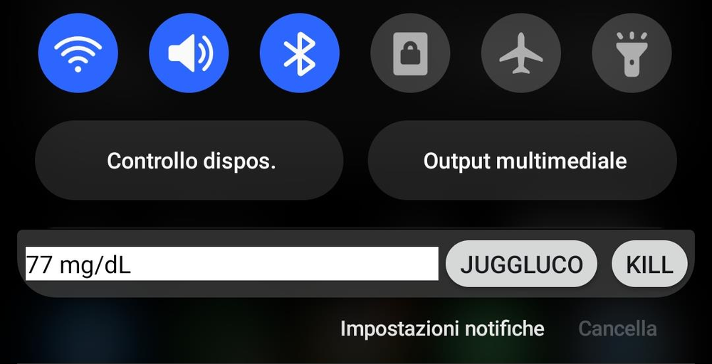

Il valore compare anche nella barra di stato, accanto all'orario:

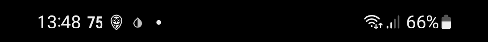

Se dopo qualche minuto non hai dati:
1. Verifica che LLink sia disabilitata o disinstallata.
2. Prova a scansionare di nuovo il sensore.
3. Prova a riavviare il telefono e scansionare di nuovo.

---

## 4. Configura Juggluco

Apri il **Menu 1** (tocca in alto a sinistra nello schermo).

Il **Menu 1** raggruppa in quattro colonne le voci principali dell'app: **Orologio**, **Sensore**, **Impostazione** e altre funzioni di esportazione, ricerca e navigazione tra i giorni:

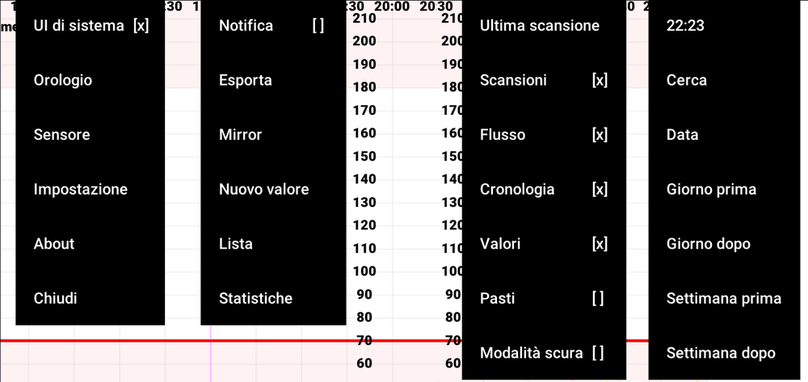

In **Sensore**:
- Verifica che **Usa Bluetooth** sia abilitato.
- Se hai perso il collegamento, prova **Riabilita** e poi scansiona il sensore.
- La colonna **Ultimo successo** deve mostrare l'orario dell'ultima lettura.

Il pannello **Sensore** mostra lo stato della connessione Bluetooth e gli orari delle ultime letture riuscite:

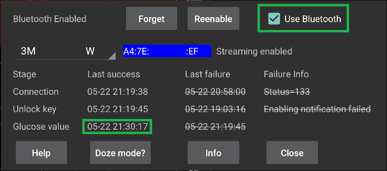

In **Impostazioni**:
- Abilita **Trasmissione letture a xDrip** (nelle versioni più recenti l'opzione può avere un nome leggermente diverso).

Nella colonna **Impostazione**, spunta **Invia a xDrip**:

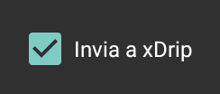

Nelle versioni più recenti la stessa opzione compare come **Patched Libre Broadcast**:

- **Inverti schermo** attiva la modalità scura.

Spunta **Inverti schermo** per passare alla modalità scura:

- Abilita **Sensore via Bluetooth** — obbligatorio per il collegamento diretto con FSL 2.

Assicurati che **Sensore via bluetooth** sia spuntato:

Se preferisci inviare i dati direttamente a Nightscout senza passare da xDrip, nella stessa sezione **Impostazioni** trovi anche i campi per l'indirizzo Nightscout e l'`api_secret`.

Tocca il pulsante **Uploader**:

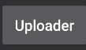

Inserisci l'indirizzo del tuo sito Nightscout e l'**api_secret**, poi tocca **Salva**:

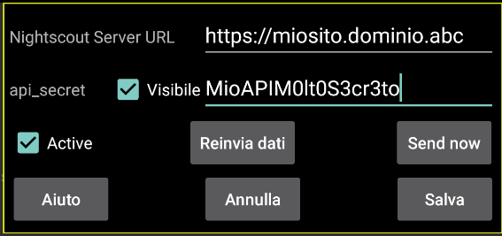

> ℹ️ Nel menu **Orologio** trovi WatchDrip+ per la compatibilità con Amazfit/MiBand, Kerfstok per Garmin, e GlucoDataHandler per Wear OS e Samsung Gear.

Per Amazfit e MiBand, spunta **Watchdrip** (o **GadgetBridge**):

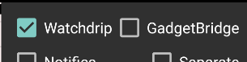

Per Garmin (Kerfstok), spunta **Web server** e tocca **Configura**:

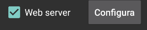

Per Wear OS e Samsung Gear (GlucoDataHandler), spunta **WearOS** e tocca **Configura**:

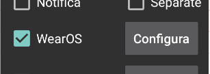

---

## 5. Configura xDrip

Se non hai ancora xDrip, installalo seguendo la [guida base](../xdrip/installare-xdrip-android).

Nell'app xDrip, scegli come sorgente dati **App Libre patchata** — questa è l'opzione che riceve i dati da Juggluco.

Nell'elenco delle sorgenti dati di xDrip, seleziona **Libre2 Patched (App LibreLink patchata)**:

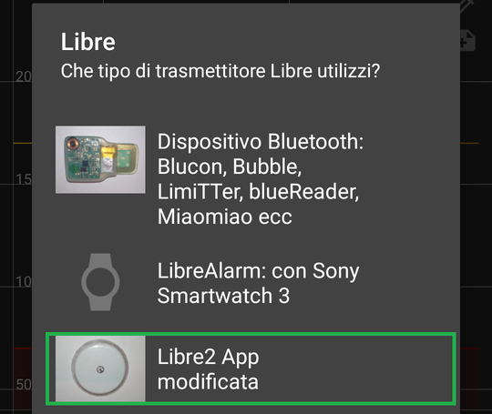

Se non ricevi le letture di Juggluco in xDrip, vai nel menù di xDrip e fai **Avvia nuovo sensore (non avviato oggi)**.

> ℹ️ Puoi applicare una correzione di calibrazione tra −40 e +20 mg/dL se il sensore non è ben allineato con la glicemia capillare. Esegui la calibrazione **solo a glicemia stabile, nel range 80–140 mg/dL**.

---

## Condivisione con altri dispositivi

Con xDrip puoi condividere la glicemia con altri telefoni Android tramite **xDrip Sync** (guida: Condivisione con xDrip).

Per condividere con iPhone, è necessario Nightscout.
