# Medtronic 640/670 G — Glicemie a distanza o su orologio

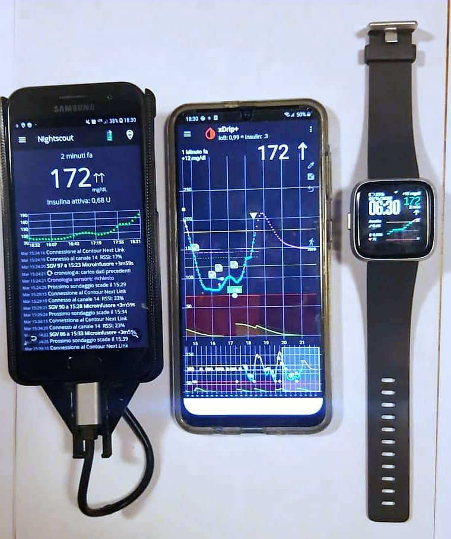

Questa guida aiuta nella configurazione del dispositivo Medtronic 640/670G collegato con il sensore Enlite. Non è una guida completa e non sostituisce la documentazione originale disponibile qui: https://github.com/pazaan/640gAndroidUploader/wiki/Getting-Started:-Installation

In caso di incongruenze tra questa guida e quella originale, fa fede quella originale. Medtronic non è collegata a questo progetto in alcun modo.

## Cosa occorre per cominciare?

- **Smartphone Android** 4.0.3 o superiore con supporto OTG (funzionalità che permette di collegare un dispositivo USB al telefono). Consulta la lista dei telefoni testati: https://docs.google.com/document/d/13OeqBaq01rpzcfsA1quDZgCJ3saJVgFob0IEqA4MCv8/edit
- **Cavo OTG** micro-USB maschio a USB femmina.
- **Glucometro Contour Next Link 2.4 USB.** Si raccomanda vivamente di usarne uno di ricambio per il caricamento dei dati dal 640/670G, e non quello principale. Il glucometro deve essere registrato sul sito CareLink e deve essere stato usato almeno una volta per il caricamento dati.
- **Microinfusore Medtronic 640/670G.** Anche se l'app Android legge solo le informazioni dal glucometro, per sicurezza si consiglia di disattivare la funzione di bolo remoto seguendo questi passaggi:
  1. Assicurati che glucometro e microinfusore siano collegati.
  2. Vai alla schermata **Bolo remoto** sul 640G: **Menu → Utilità → Bolo remoto**.
  3. Seleziona **Bolo remoto** per disattivare la funzione.
  4. Seleziona **Salva**.

## Configurazione dell'app

L'uploader è un'app per smartphone Android che, collegando il glucometro Bayer ContourNext Link 2.4 USB allo smartphone tramite cavo OTG, legge i dati memorizzati nel microinfusore 640/670G.

1. Apri il browser dello smartphone e vai a: https://github.com/pazaan/640gAndroidUploader/releases
   (La versione usata in questa guida è la 0.7.3.)
2. Seleziona **assets** e poi il file `.apk` più recente: partirà il download.

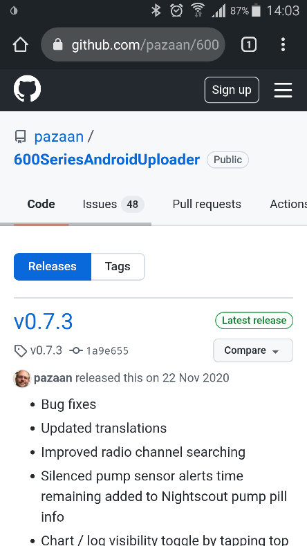

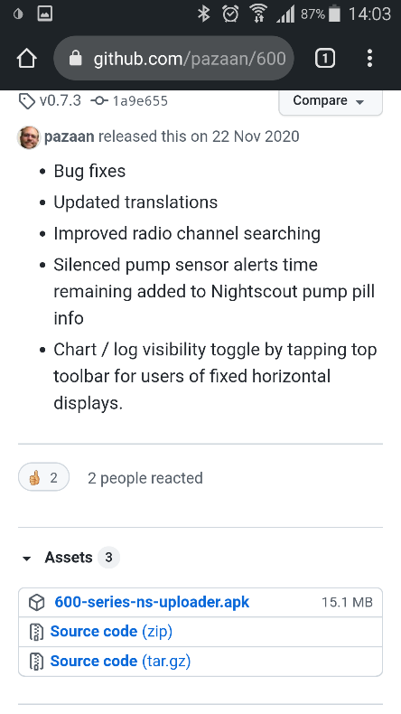

3. A download completato, abbassa l'area di notifica e seleziona il file scaricato.

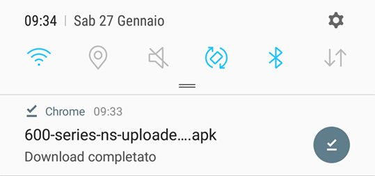

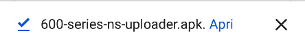

4. Se l'installazione viene bloccata (impostazioni predefinite), vai in **Impostazioni**, abilita **Sorgenti sconosciute** e seleziona **OK** nella schermata successiva.

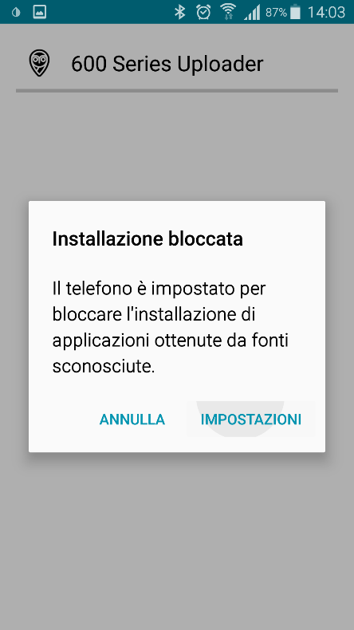

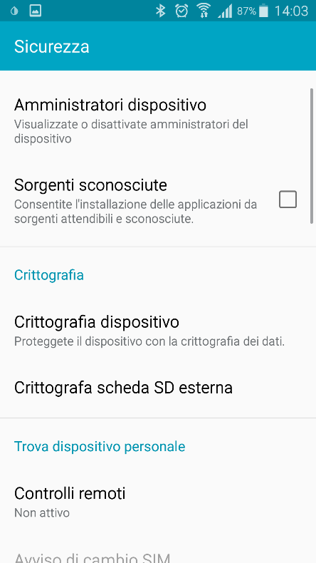

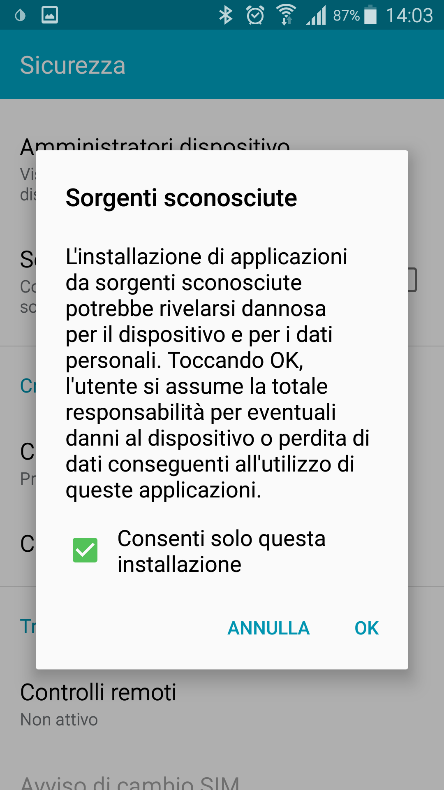

5. Conferma e prosegui con l'installazione.

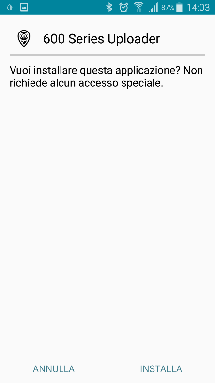

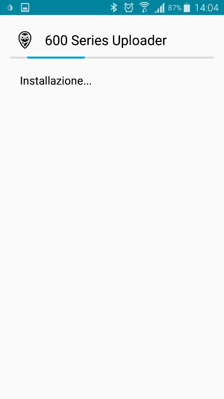

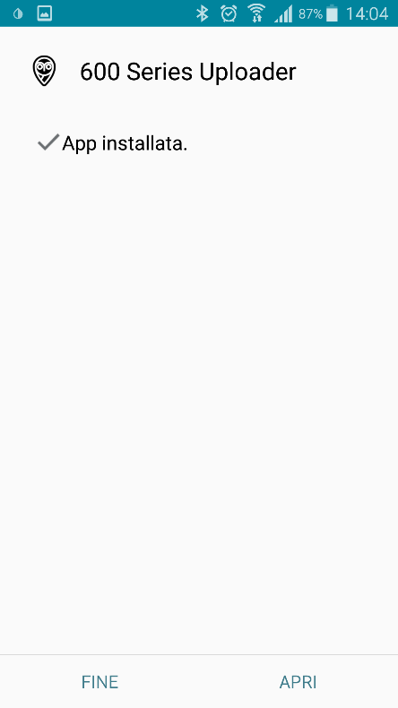

> ⚠️ **All'apertura dell'app** verrà chiesto di escluderla dall'ottimizzazione della batteria: rispondi **Sì**. In caso contrario l'app si bloccherà o non funzionerà correttamente.

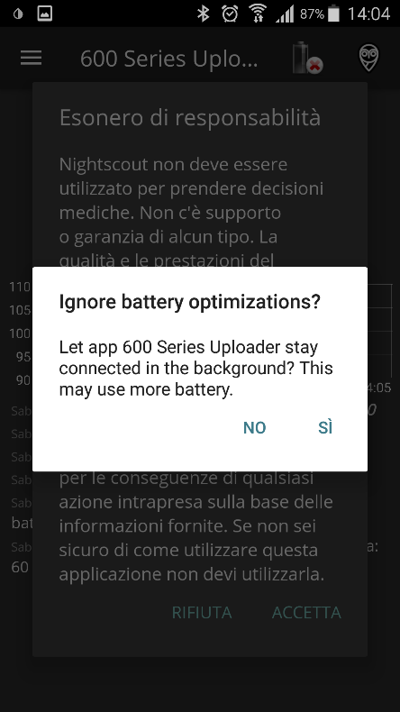

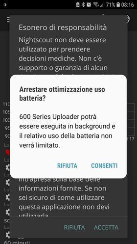

Leggi l'esonero di responsabilità e, se sei d'accordo, seleziona **Accetta**. L'esonero di responsabilità si intende valido anche per l'uso di questa app 600 Series Uploader.

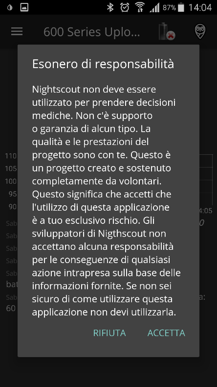

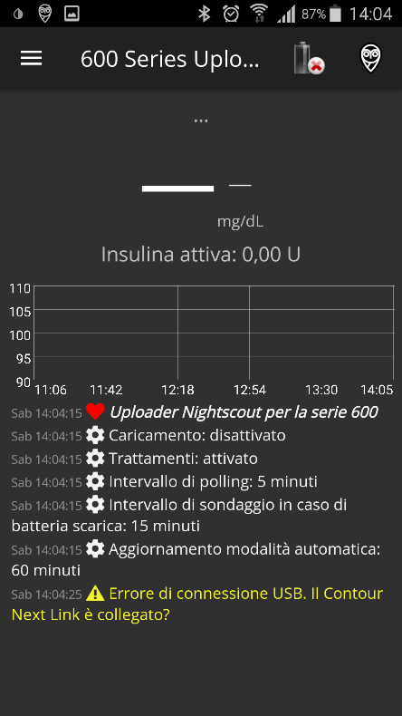

In questa versione non è richiesto l'accesso a CareLink. Inseriti i dati, collega il ContourNext Link 2.4 al tuo dispositivo Android tramite cavo OTG e accetta la lettura USB seguendo le istruzioni a schermo. Dovresti vedere la glicemia e il grafico nella schermata principale.

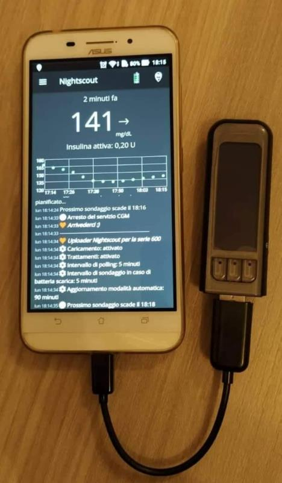

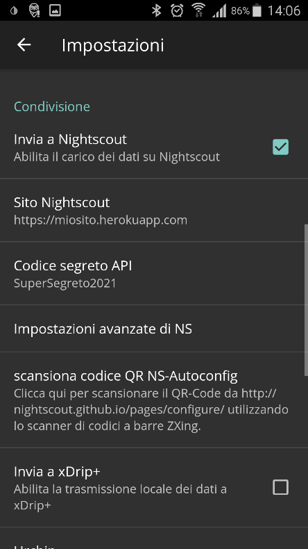

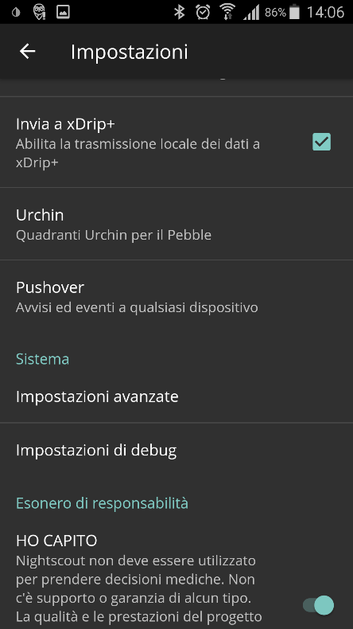

Per abilitare la condivisione delle glicemie:

1. Apri il menu in alto a sinistra e seleziona **Impostazioni**.

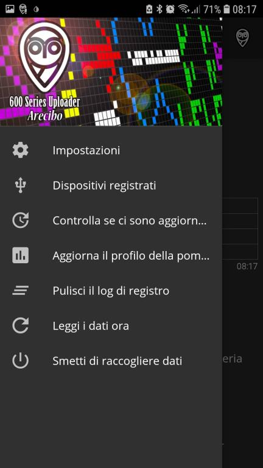

2. Abilita **Trasmissione dati a xDrip+**.

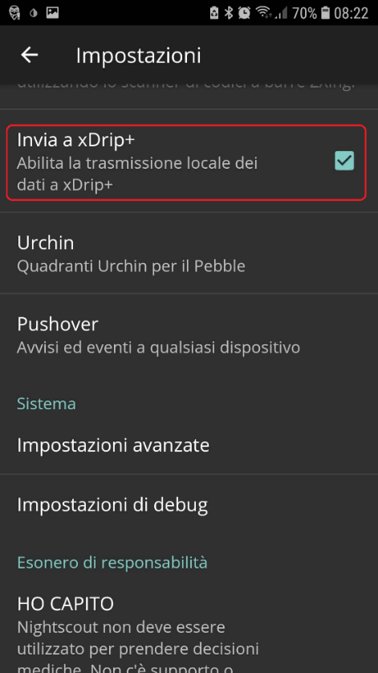

3. Chiudi l'app.

Dopo qualche istante dovresti vedere le glicemie arrivare su xDrip+.

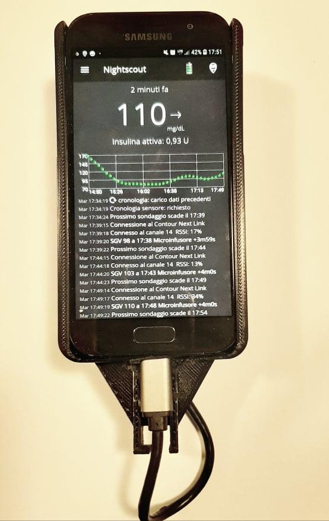

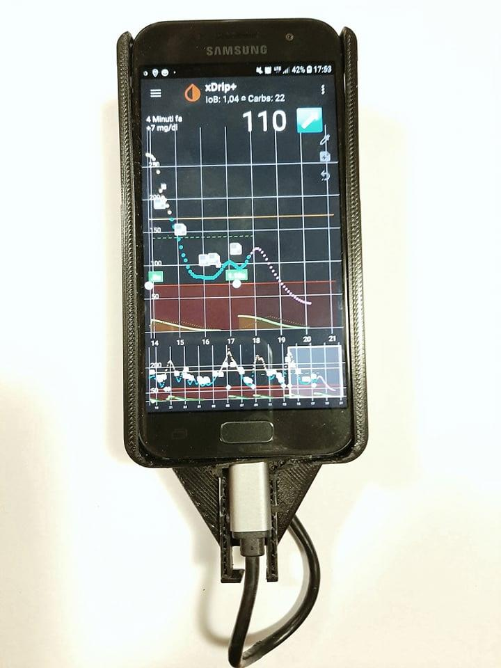

## Come condividere le glicemie con un altro telefono Android

Segui questa guida: https://www.glicemiadistanza.it/condivisione-della-glicemia-tra-telefonini-android-con-xdrip/

## Condivisione universale con Nightscout

Segui la guida base: https://www.glicemiadistanza.it/nighscout-con-heroku-e-mongodb-atlas-nuova-guida/

Al termine della procedura, vai alla videata principale di Heroku: https://dashboard.heroku.com/apps

1. Clicca sul nome della tua app.

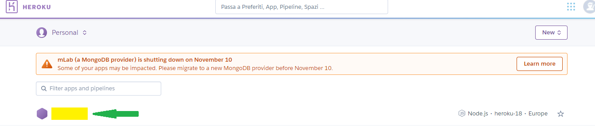

2. Clicca su **Settings**.
3. Clicca su **Reveal Config Vars** per accedere alle variabili di configurazione dell'app.

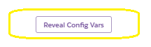

4. Aggiungi le seguenti variabili:

   | Variabile | Valore |
   |---|---|
   | `DEVICESTATUS_ADVANCED` | `true` |
   | `AUTH_DEFAULT_ROLES` | `readable devicestatus-upload` |
   | `PUMP_FIELDS` | `reservoir battery clock status device` |
   | `PUMP_ENABLE_ALERTS` | `true` |

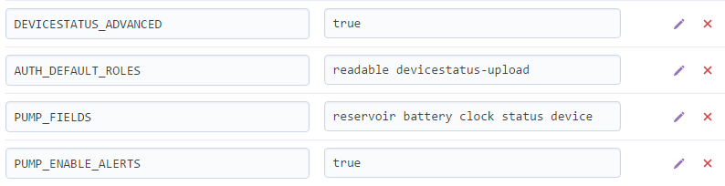

5. Scorri fino alla sezione **Condivisione** e abilita **Invia a Nightscout**.

6. Nel campo **Nightscout URL** inserisci l'indirizzo della tua pagina Nightscout, ad esempio: `https://nomesito.herokuapp.com`
7. Nel campo **API secret** inserisci il codice API creato su Heroku, ad esempio: `ThisisMyCode`

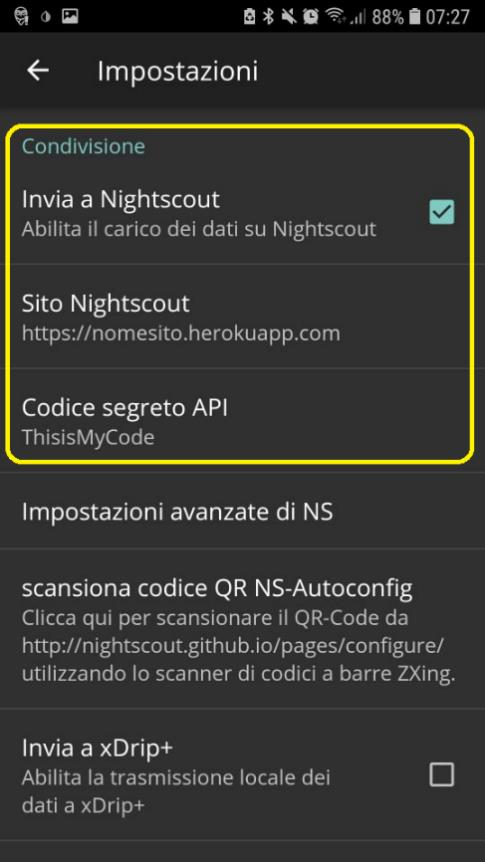

> ⚠️ **Questo è uno step cruciale: il 90% degli errori si verifica qui.** Se sbagli anche solo una maiuscola nella password, il database non riceverà nessuna glicemia.

In questa versione non è richiesto l'accesso a CareLink. Collegato il ContourNext Link 2.4, i dati vengono caricati su Nightscout a ogni lettura (ogni 5 minuti, intervallo non modificabile).

Il tempo della lettura si riferisce alla lettura del sensore da parte del microinfusore (anch'essa ogni 5 minuti). Oltre alla glicemia vengono riportati: lo stato del microinfusore (es. sospensione basale), boli e carboidrati somministrati con l'insulina residua (bolo semplice o prolungato), data di cambio sensore, set e insulina, profilo basale.

Per visualizzare i dati, accedi alla tua pagina Nightscout: `https://nomesito.herokuapp.com`

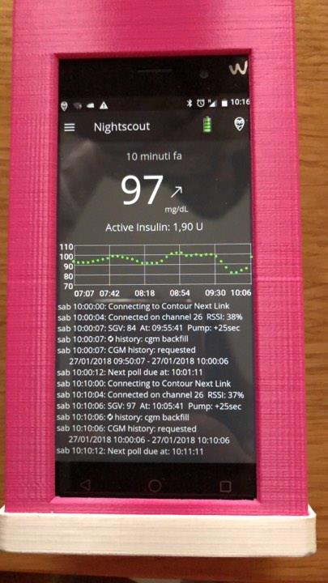

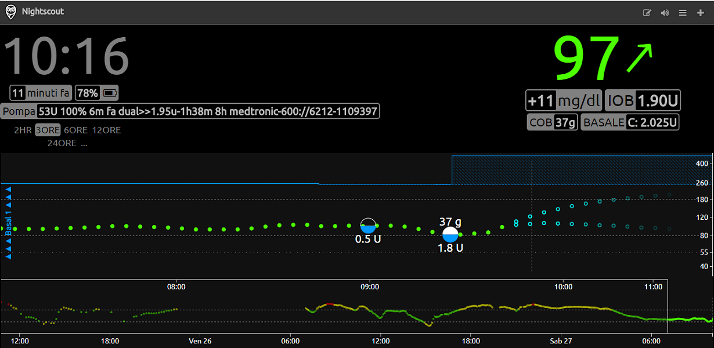

## Come vedere le glicemie da orologio con xDrip+

Usando l'app xDrip+ puoi visualizzare le glicemie direttamente su alcuni smartwatch senza usare Nightscout. Il collegamento funziona sia sul telefono principale sia su chi usa xDrip+ come follower.

- **Android Wear 2**: https://www.glicemiadistanza.it/huawei-watch-2-e-xdrip/
- **Sony Smartwatch 3 (SWR50)**: https://www.glicemiadistanza.it/sony-smartwatch-3-e-xdrip/
- **Fitbit Versa e Ionic** (anche per Nightscout): https://www.glicemiadistanza.it/fitbit-le-glicemie-di-dexcom-spike-xdrip-o-nightscout-su-smartwatch-versa-e-ionic/
- **Samsung Watch** (anche per Nightscout): https://www.glicemiadistanza.it/g-watch-per-smartwatch-samsung/
- **MiBand**: https://www.glicemiadistanza.it/miband-con-xdrip/
- **Amazfit**: https://www.glicemiadistanza.it/amazfit-band-5-con-xdrip/ — https://www.glicemiadistanza.it/amazfit-bip-lite-con-xdrip/

### Allarmi e widget

xDrip+ include un widget che mostra il valore glicemico e il grafico sulla home del telefono e sulla schermata di blocco. Gli allarmi sono personalizzabili per fascia oraria e giorno della settimana. Puoi impostarli dal menu **Impostazioni → Allarmi e avvisi**.

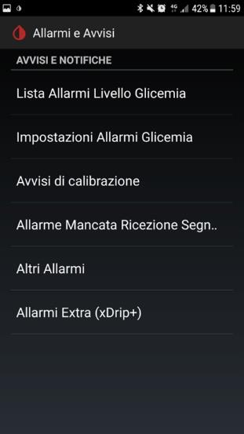

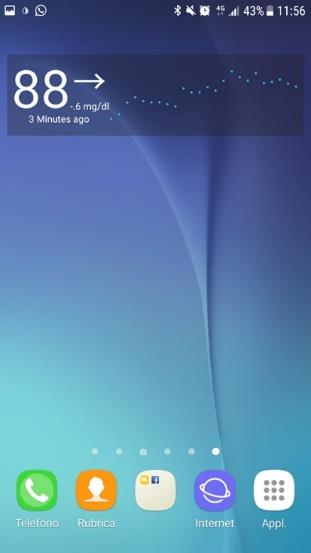

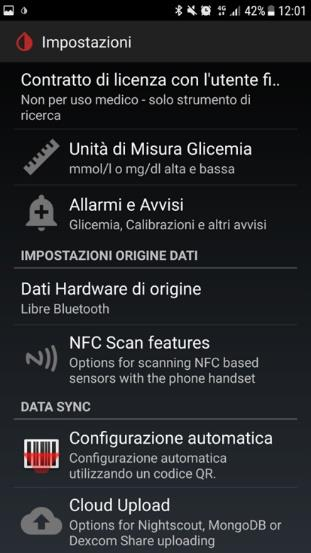
