# Aggiornare Nightscout su Heroku

Questa guida spiega come aggiornare un sito Nightscout ospitato su Heroku. Usa questi passaggi **solo per Heroku** (non per Azure o Google Cloud).

Adattato dalla [guida ufficiale Nightscout](https://nightscout.github.io/update/update/).

Per sapere qual è l'ultima versione disponibile: `https://github.com/nightscout/cgm-remote-monitor/releases`

**Prima di iniziare:**
- Usa un computer (non uno smartphone).
- Non cambiare dispositivo, browser o utente durante l'aggiornamento.
- Se hai problemi con Chrome, prova con Edge.

Per vedere la versione attuale del tuo Nightscout, clicca sul menu in alto a destra della tua pagina Nightscout e scorri verso il basso.

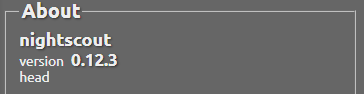

---

## 1. Aggiorna GitHub

1. Vai su `https://github.com/` e accedi con la tua email e password GitHub.

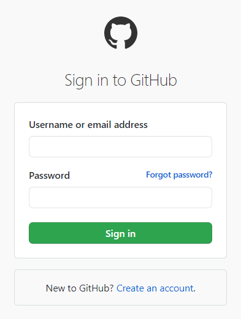

2. Seleziona il tuo progetto **cgm-remote-monitor**.

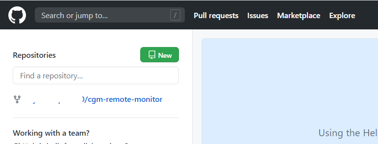

3. Controlla se c'è la scritta **"This branch is X commits behind nightscout:master"**.

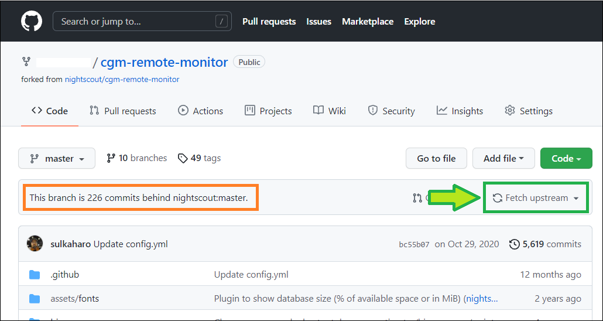

4. Se sì, clicca **Fetch upstream** → **Fetch and merge**.

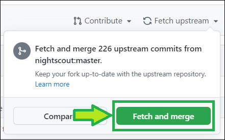

5. Dopo pochi istanti comparirà: **"This branch is up to date with nightscout:master"**.

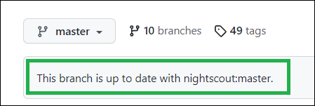

**Se hai difficoltà (metodo alternativo — redeploy):**
1. In GitHub, vai in **Settings** → scorri giù fino a **Danger Zone** → clicca **Delete this repository**.

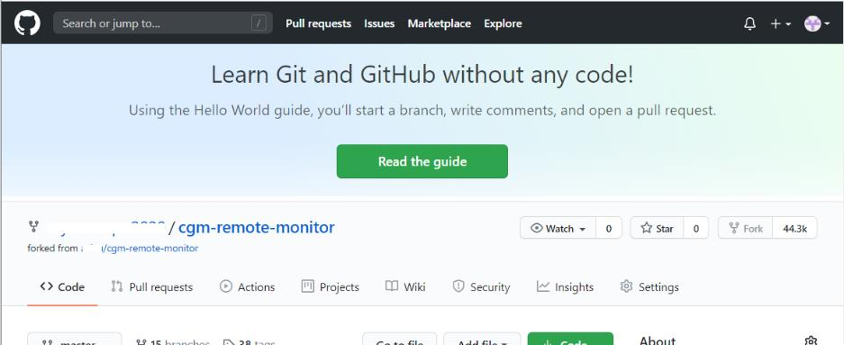

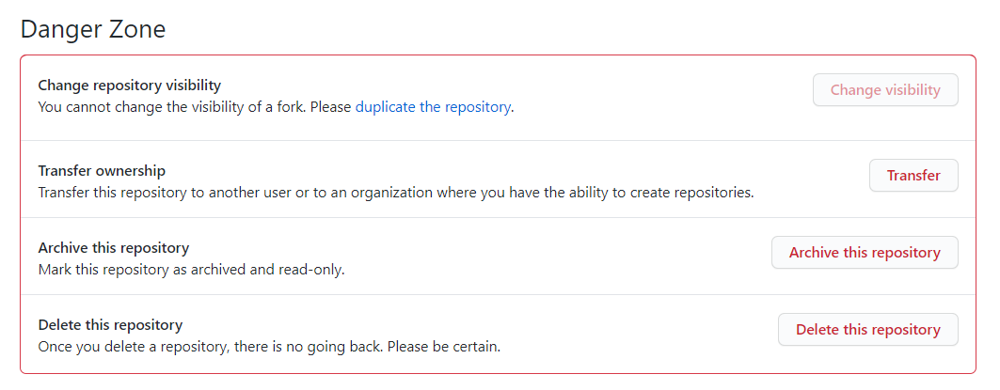

2. Copia il nome del progetto per confermare → clicca **I understand...**.

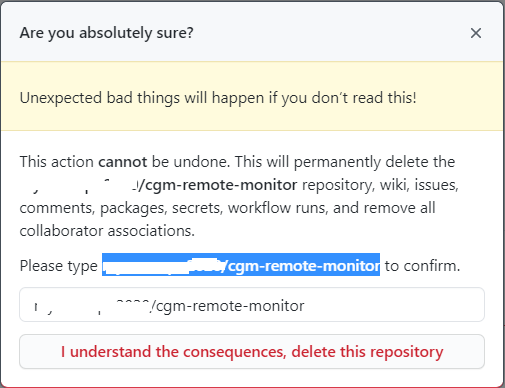

3. Vai su `https://github.com/nightscout/cgm-remote-monitor` e clicca **Fork**.

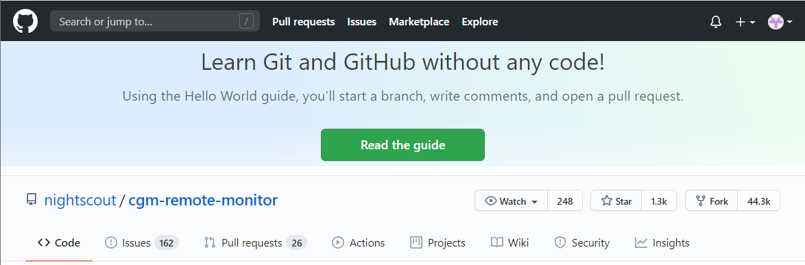

4. Aspetta il completamento e lascia GitHub aperto.

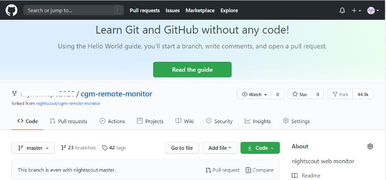

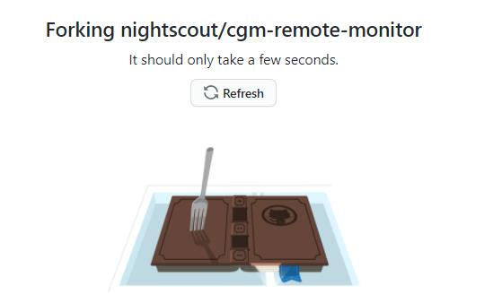

---

## 2. Esegui il deploy su Heroku

1. Apri un nuovo tab e vai su `https://id.heroku.com/login`. Inserisci email e password → **Log In**.

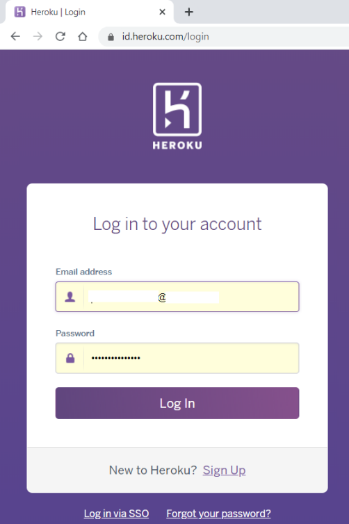

2. Seleziona la tua app Nightscout.

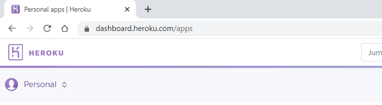

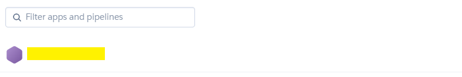

3. Vai in **Deploy**.

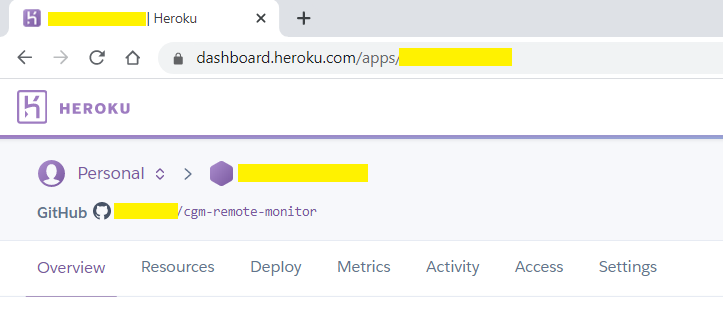

4. Clicca su **GitHub**.

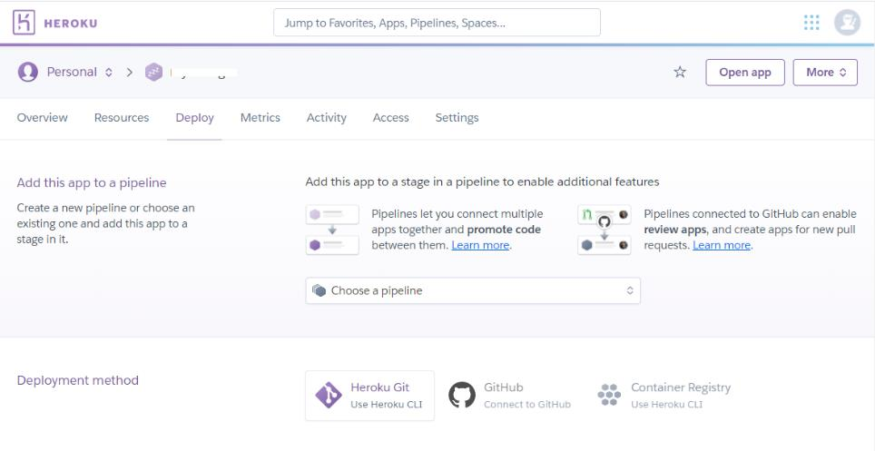

5. Se non sei ancora collegato a GitHub, clicca **Connect** e autorizza Heroku.

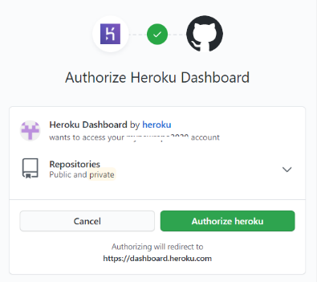

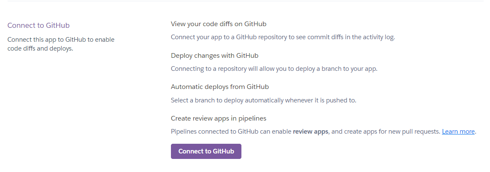

6. Verifica che la tua app **cgm-remote-monitor** sia collegata a GitHub. Se non lo è, cerca `cgm-remote-monitor` nel campo di ricerca e clicca **Connect**.

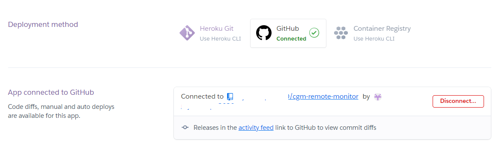

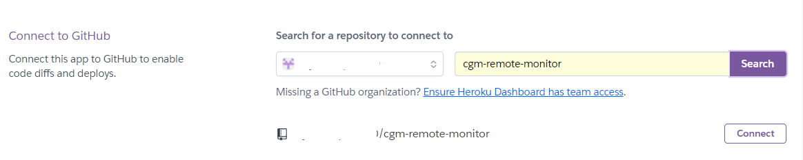

7. Scorri giù fino a **Manual deploy**, seleziona il ramo `master` e clicca **Deploy Branch**.

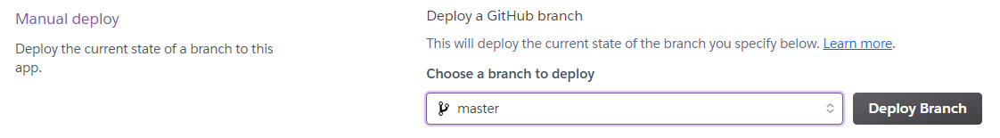

> ⚠️ **Attenzione**: Non uscire dalla pagina e non cliccare niente fino al completamento del deploy. Potrebbe richiedere più di 10 minuti.

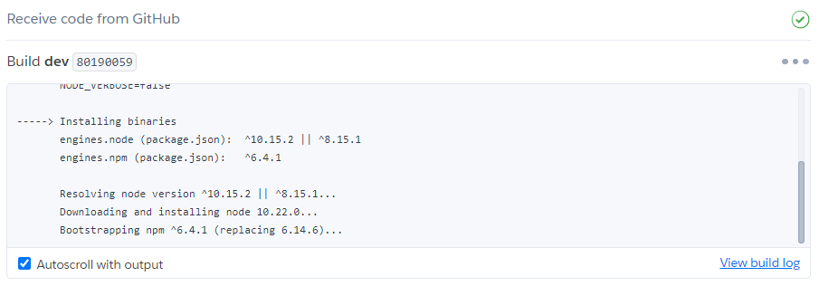

8. Al termine clicca **View**: il tuo sito si aprirà all'ultima versione.

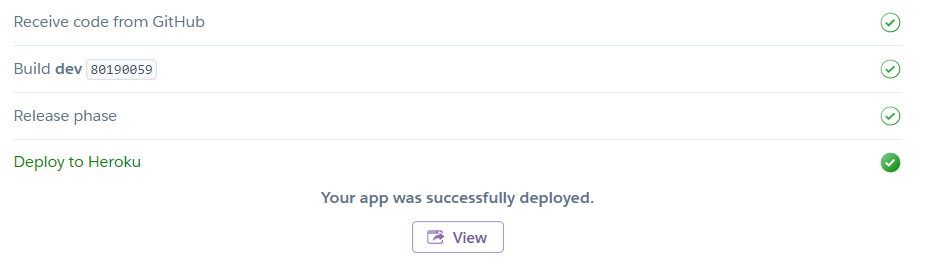

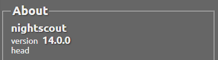

Se qualcosa va storto, puoi ripetere questi passaggi tutte le volte che vuoi.
