# Aggiornare Nightscout su Heroku

Questa guida spiega come aggiornare un sito Nightscout ospitato su Heroku. Usa questi passaggi **solo per Heroku** (non per Azure o Google Cloud).

Adattato dalla [guida ufficiale Nightscout](https://nightscout.github.io/update/update/).

Per sapere qual è l'ultima versione disponibile: [`https://github.com/nightscout/cgm-remote-monitor/releases`](https://github.com/nightscout/cgm-remote-monitor/releases)

**Prima di iniziare:**
- Usa un computer (non uno smartphone).
- Non cambiare dispositivo, browser o utente durante l'aggiornamento.
- Se hai problemi con Chrome, prova con Edge.

Per vedere la versione attuale del tuo Nightscout, clicca sul menu in alto a destra della tua pagina Nightscout e scorri verso il basso: troverai un riquadro **About** con la versione installata (in questo esempio, `0.12.3`, molto vecchia):

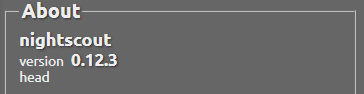

---

## 1. Aggiorna GitHub

1. Vai su [`https://github.com/`](https://github.com/) e clicca **Sign in** in alto a destra:

Accedi con la tua email e password GitHub:

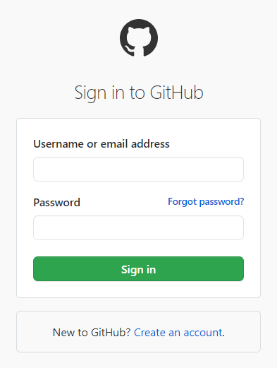

2. Seleziona il tuo progetto **cgm-remote-monitor** dall'elenco dei repository:

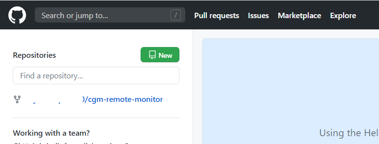

3. Controlla se c'è la scritta **"This branch is X commits behind nightscout:master"** (nell'esempio, 226 commit di ritardo):

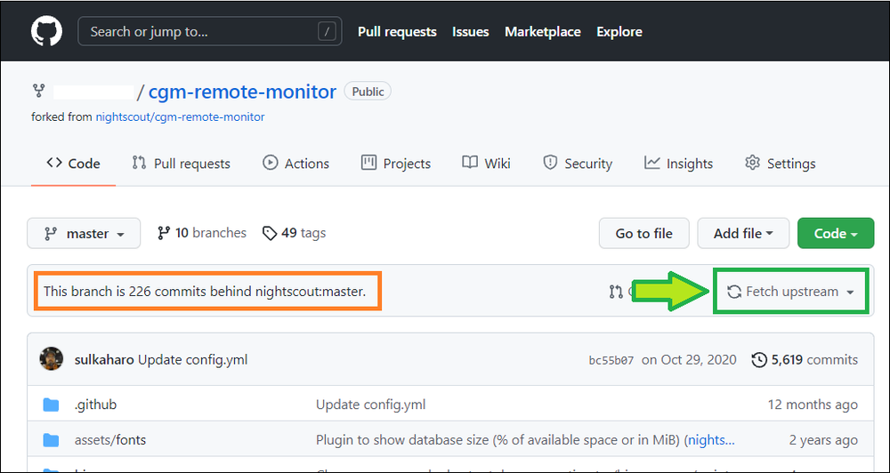

4. Se sì, clicca **Fetch upstream** → **Fetch and merge**:

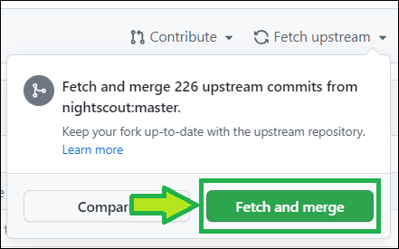

5. Dopo pochi istanti comparirà: **"This branch is up to date with nightscout:master"**:

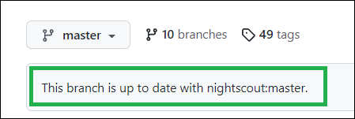

**Se hai difficoltà (metodo alternativo — redeploy):**
1. In GitHub, vai in **Settings** → scorri giù fino a **Danger Zone** → clicca **Delete this repository**:

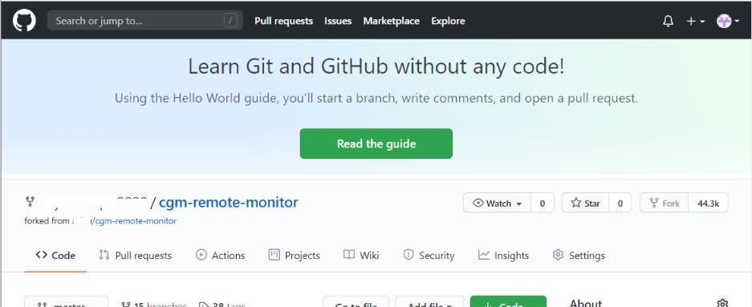

Ti verrà chiesto di confermare l'operazione (che non si può annullare):

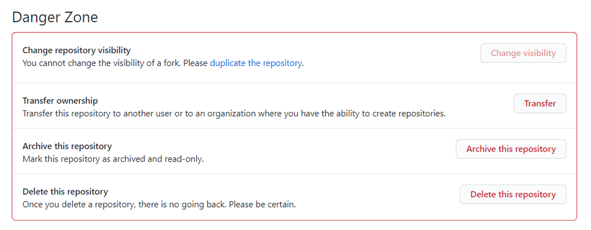

2. Copia il nome del progetto per confermare → clicca **I understand the consequences, delete this repository**:

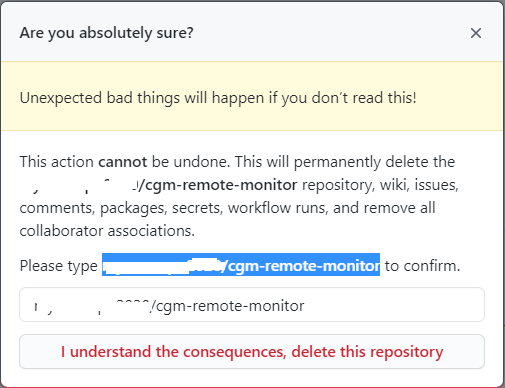

3. Vai su [`https://github.com/nightscout/cgm-remote-monitor`](https://github.com/nightscout/cgm-remote-monitor) e clicca **Fork**:

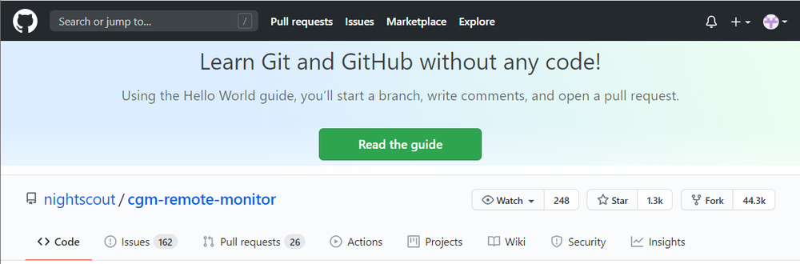

4. Aspetta il completamento dell'operazione di fork...

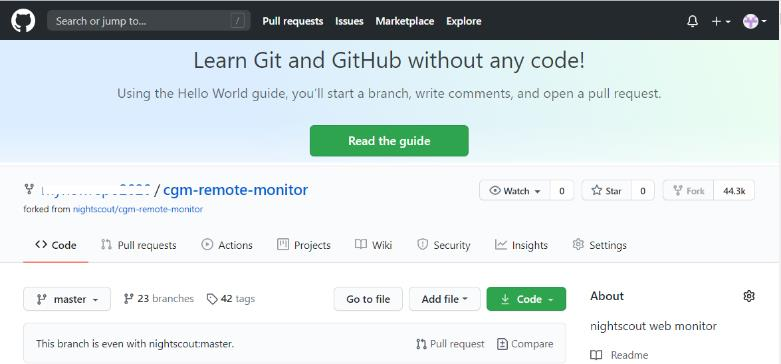

...e lascia GitHub aperto sulla pagina del tuo nuovo repository forkato:

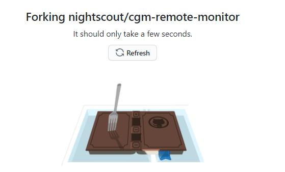

---

## 2. Esegui il deploy su Heroku

1. Apri un nuovo tab e vai su [`https://id.heroku.com/login`](https://id.heroku.com/login). Inserisci email e password → **Log In**:

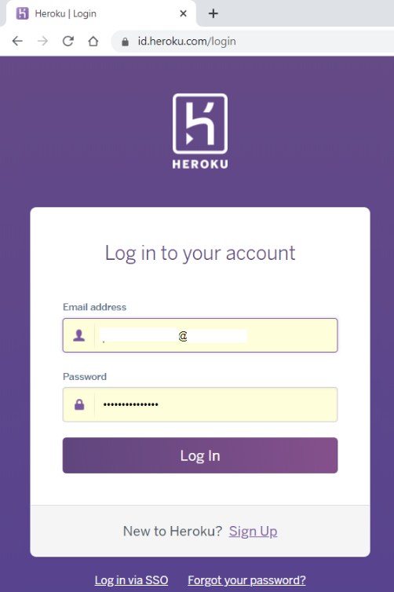

2. Nella lista delle app, apri il menu **Personal**:

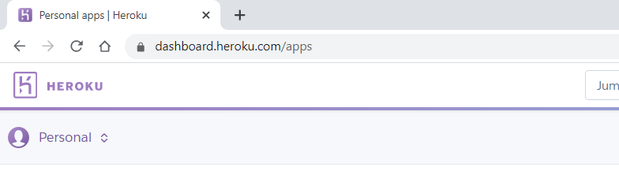

Seleziona la tua app Nightscout dall'elenco:

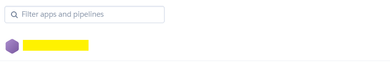

3. Vai in **Deploy**:

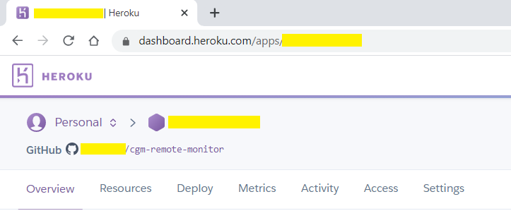

4. Scorri fino a **Deployment method** e clicca su **GitHub**:

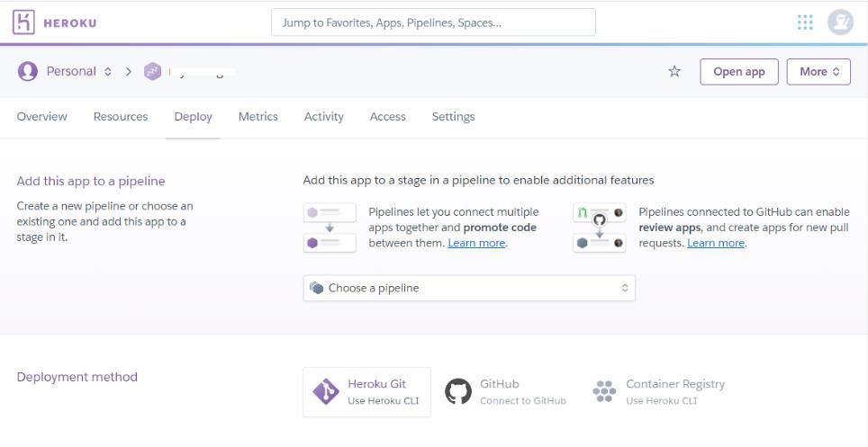

5. Se non sei ancora collegato a GitHub, clicca **Connect to GitHub**:

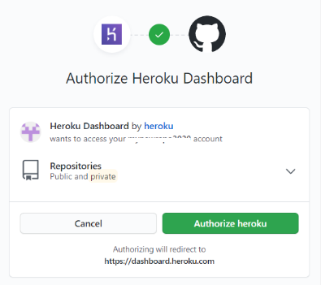

Autorizza l'accesso cliccando **Authorize heroku**:

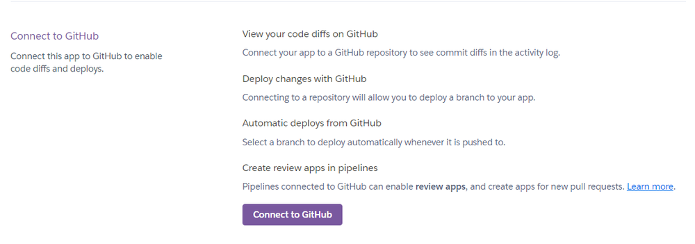

Una volta connesso, vedrai la conferma con il nome del repository collegato:

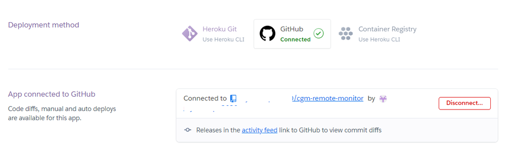

6. Verifica che la tua app **cgm-remote-monitor** sia collegata a GitHub. Se non lo è, cerca `cgm-remote-monitor` nel campo di ricerca:

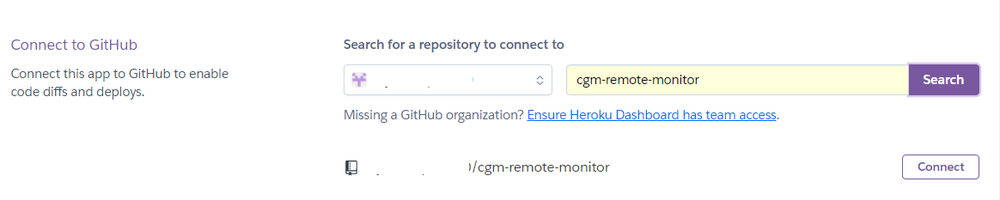

E clicca **Connect** accanto al repository trovato:

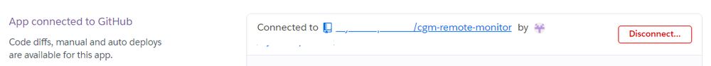

Vedrai la conferma "App connected to GitHub":

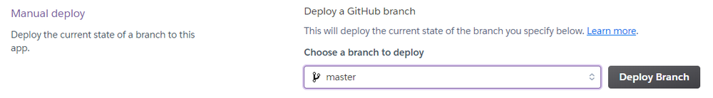

7. Scorri giù fino a **Manual deploy**, seleziona il ramo `master` e clicca **Deploy Branch**:

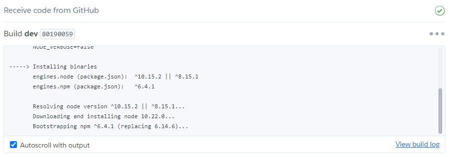

> ⚠️ **Attenzione**: Non uscire dalla pagina e non cliccare niente fino al completamento del deploy. Potrebbe richiedere più di 10 minuti.

Durante il deploy, la pagina mostra in tempo reale il log di compilazione (build):

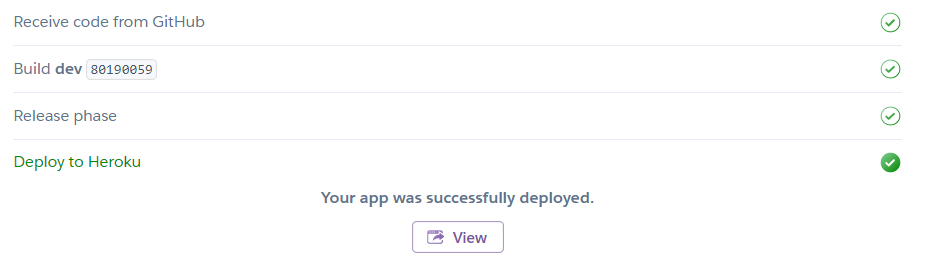

8. Al termine, tutte le fasi risulteranno completate con successo: clicca **View**, il tuo sito si aprirà all'ultima versione:

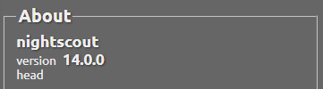

Nel riquadro **About** della tua pagina Nightscout vedrai ora il numero di versione aggiornato.

Se qualcosa va storto, puoi ripetere questi passaggi tutte le volte che vuoi.
