# Monitor Nightscout con M5Stack

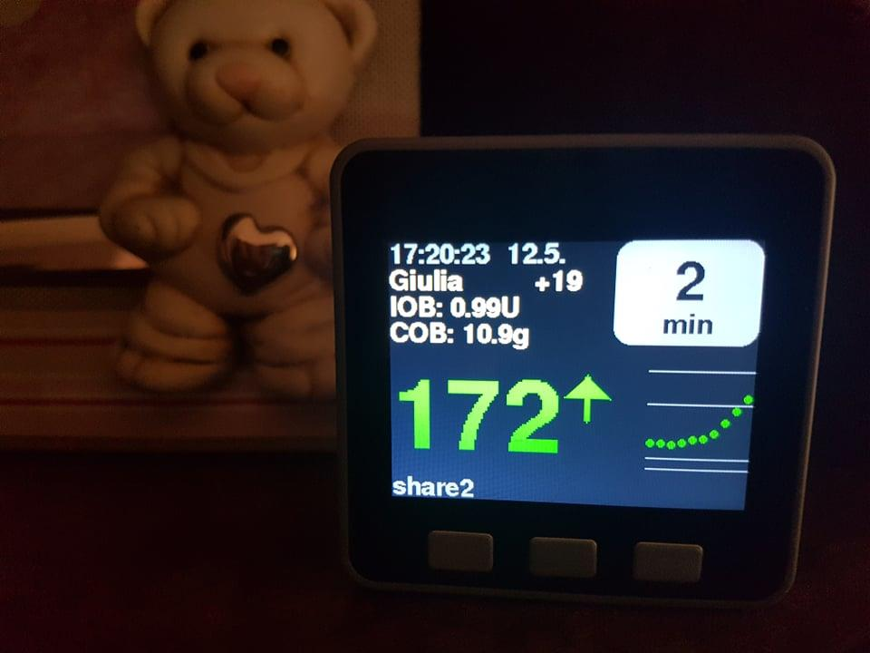

Questa guida spiega come configurare un **M5Stack** come display da tavolo per la glicemia, usando il progetto open source **M5_NightscoutMon** di Martin Lukasek.

Documentazione ufficiale: `https://github.com/mlukasek/M5_NightscoutMon/wiki`

> ℹ️ Funziona anche con Gluroo, direttamente da Dexcom Share e LLink.

**Requisiti:** computer Windows (necessario per la programmazione del dispositivo).

> ⚠️ L'utilizzo è a esclusiva responsabilità personale.

---

## 1. Materiale occorrente

- **M5Stack Basic** (ESP32): si trova su Amazon, eBay, Banggood, AliExpress. Prezzo indicativo 50–70€ (fine 2022).

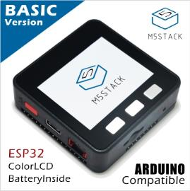

- Caricatore USB e cavo USB-C (il cavetto fornito con il kit è troppo corto per un uso pratico).
- La batteria inclusa dura poco (150mAh): se non aggiungi una batteria supplementare, tieni il dispositivo in carica.
- (Facoltativo) Scheda micro SD e batterie supplementari (aumentano l'autonomia a 7–8 ore con luminosità ridotta).

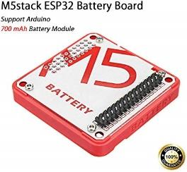

Per installare le batterie supplementari, apri delicatamente la parte anteriore dell'M5Stack con un coltello o un cacciavite piatto abbastanza largo.

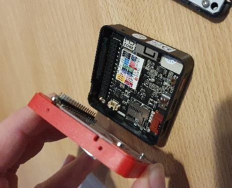

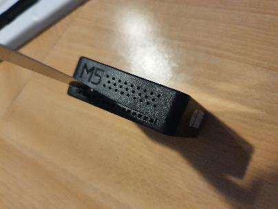

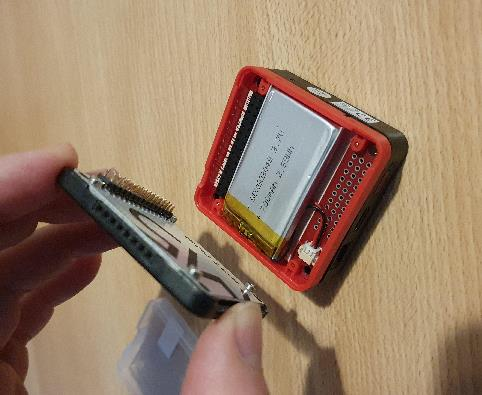

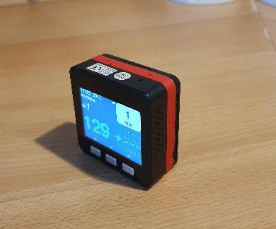

---

## 2. Installa il driver USB

1. Vai sul sito di Silicon Labs: `https://www.silabs.com/products/development-tools/software/usb-to-uart-bridge-vcp-drivers`
2. Scarica la versione per il tuo sistema operativo (Windows 64 bit per la maggior parte dei PC moderni).

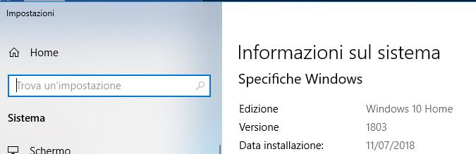

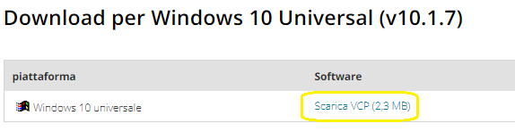

3. Nella cartella Download, fai clic destro sul file `.zip` → **Estrai tutto** → **Estrai**.

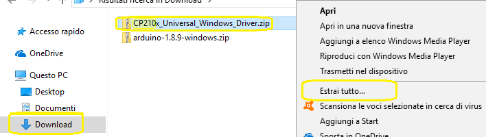

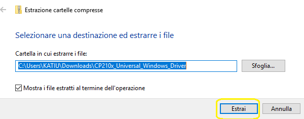

4. Nella cartella estratta, esegui il programma di installazione per la tua piattaforma (es. 64 bit).

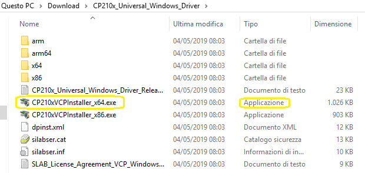

5. Clicca **Avanti** fino a **Fine**.

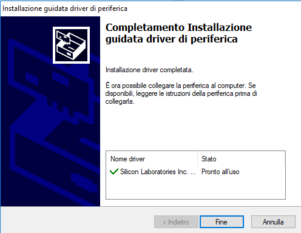

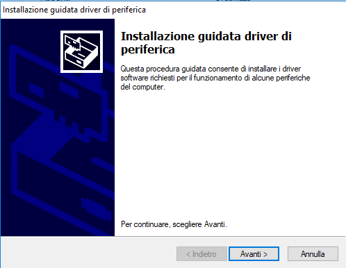

> ℹ️ Se hai già versioni precedenti del driver USB SiLabs, rimuovile prima per evitare conflitti.

---

## 3. Scarica il firmware M5_NightscoutMon

1. Vai su `https://github.com/mlukasek/M5_NightscoutMon` e seleziona l'ultima release.

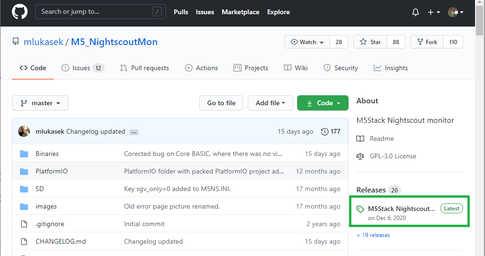

2. Nella sezione **Assets**, scarica il file corrispondente al tuo dispositivo:
   - **M5Stack Core (Basic)**: file con `CORE` nel nome
   - **M5Stack Core 2**: file con `CORE2` nel nome

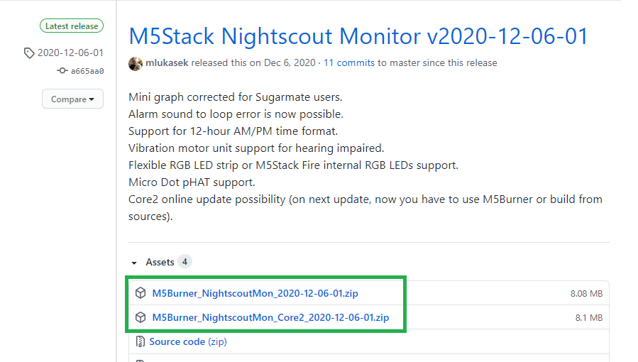

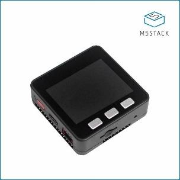

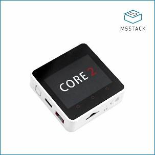

> ⚠️ Non scambiare i file: il firmware sbagliato non funzionerà.

3. Nella cartella Download, fai clic destro sul file `.zip` → **Estrai tutto** → imposta come destinazione `C:\` → **Estrai**.

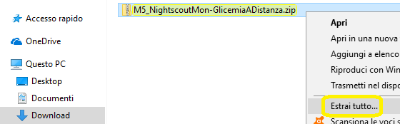

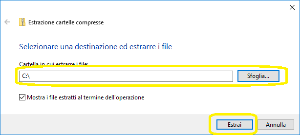

---

## 4. Programma l'M5Stack

1. Collega l'M5Stack al computer con il cavo USB. Il dispositivo esegue un autotest.

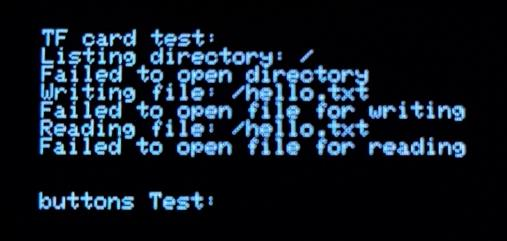

2. Apri **Gestione dispositivi** di Windows e verifica che l'M5Stack sia presente e annota il numero della porta COM (es. `COM3`).

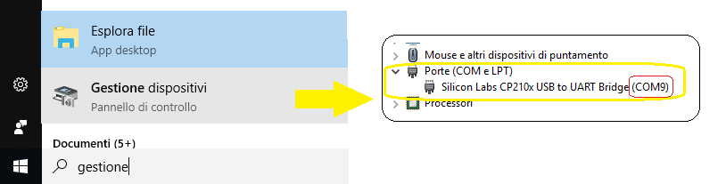

3. Vai nella cartella `C:\M5Burner_NightscoutMon_202x-xx-xx-xx` e avvia `M5Burner.exe`.

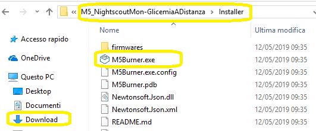

4. Se Windows Defender blocca l'esecuzione, clicca **Ulteriori informazioni** → **Esegui comunque**.

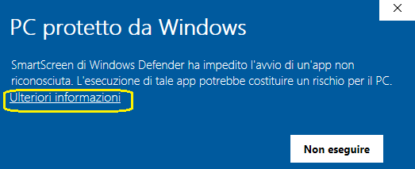

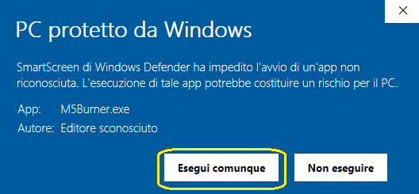

5. Nella finestra del programma:
   - Seleziona la porta COM annotata.
   - Imposta il baud rate a `921600`.
   - Seleziona il firmware **M5_NightscoutMon for 4MB flash**.

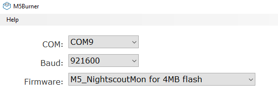

6. Clicca **Erase** e aspetta il completamento.

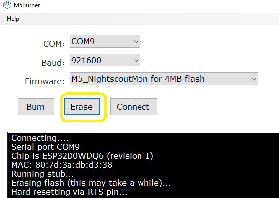

7. Clicca **Burn** e aspetta il completamento.

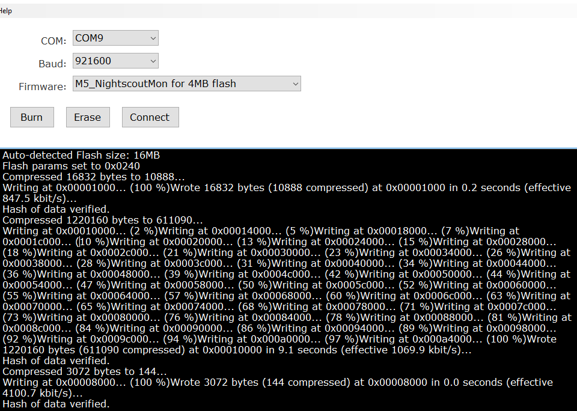

---

## 5. Collega al Wi-Fi

Dopo la programmazione, l'M5Stack si riavvierà e mostrerà una schermata con una rete Wi-Fi e una password temporanea.

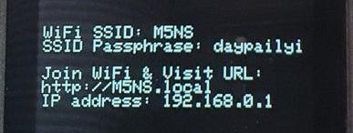

1. Dal tuo smartphone (qualsiasi), connettiti alla rete Wi-Fi **M5NS** usando la password mostrata sullo schermo.

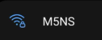

2. Apri un browser e vai all'indirizzo mostrato sullo schermo: `http://192.168.0.1`
3. Nella pagina di configurazione, scorri fino a **WiFi configuration** e clicca **edit**.

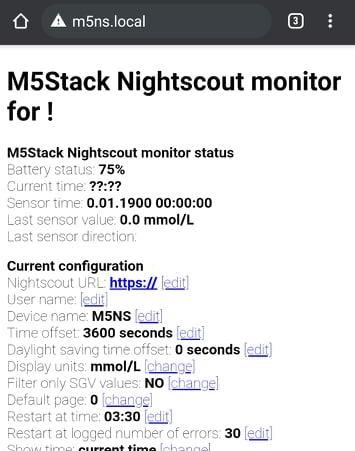

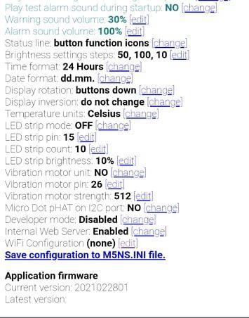

4. Seleziona la prima voce `[wlan1]`, poi la tua rete Wi-Fi di casa. Inserisci la password nel campo apposito e clicca **OK**.

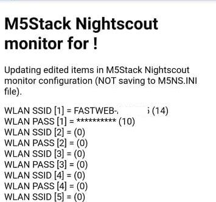

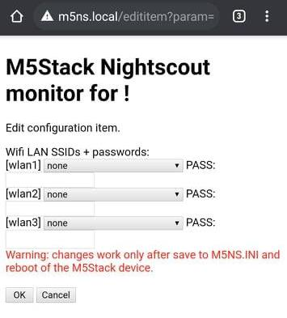

5. Clicca **Save configuration to M5NS.ini file**: il dispositivo si riavvierà e si connetterà alla tua rete Wi-Fi.

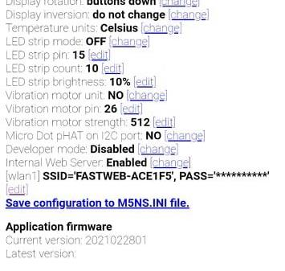

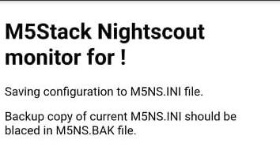

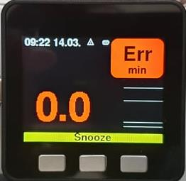

Se vedi un errore di Wi-Fi: tieni premuto il tasto sinistro e premi contemporaneamente il tasto rosso sul lato per riavviare. Tieni il tasto sinistro premuto fino alla schermata iniziale e ricomincia da questo paragrafo.

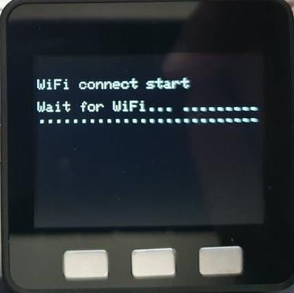

---

## 6. Configura M5Stack

Da un computer sulla stessa rete Wi-Fi, vai su `http://m5ns.local`

Se la pagina non si apre, premi il tasto destro dell'M5Stack fino alla quarta pagina e usa l'indirizzo IP mostrato (es. `http://192.168.1.114`).

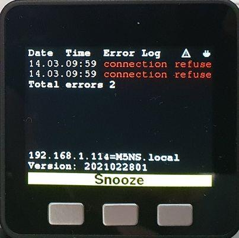

> ℹ️ La pagina di configurazione funziona solo se:
> - il nome del dispositivo è rimasto `M5NS` (non cambiato in `M5NS.ini`)
> - il server web è abilitato (`disable_web_server = 0`)
> - il computer/telefono è sulla stessa rete Wi-Fi

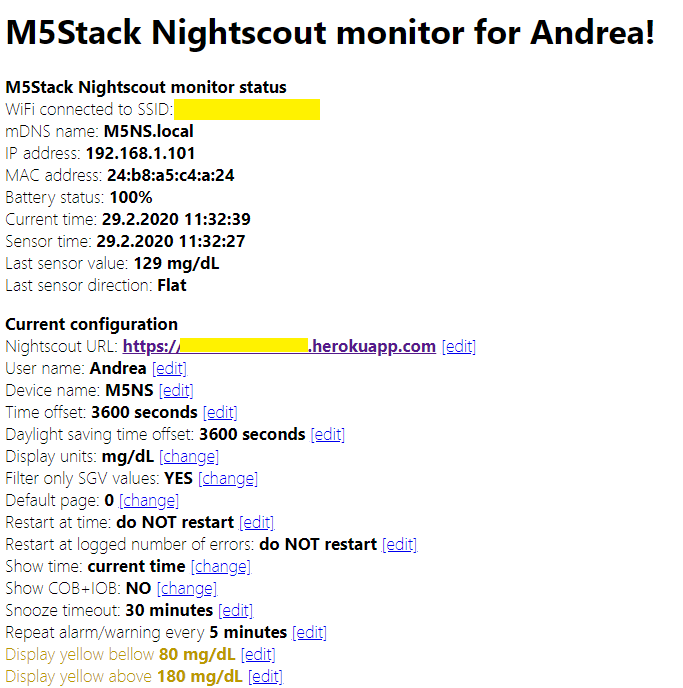

Clicca **edit** accanto ai valori che vuoi modificare. Le opzioni principali sono:

| Parametro | Descrizione |
|---|---|
| Nightscout URL | Il tuo indirizzo Nightscout (o Gluroo) |
| User name | Il nome mostrato sul display |
| Device name | Il nome per `http://M5NS.local` |
| Time offset | Fuso orario in secondi (Italia: `3600`) |
| Daylight saving time offset | Ora legale: `3600` in estate, `0` in inverno |
| Display units | `mmol/L` o `mg/dL` |
| Filter only SGV values | `NO` (per Nightscout); `YES` per Tomato |
| Default page | Quadrante all'avvio (0 = primo) |
| Restart at time | Orario riavvio automatico (es. `03:30`; `NORES` per disabilitare) |
| Restart at logged number of errors | Riavvio automatico dopo N errori (es. `30`) |
| Show time | Orario attuale o data dell'ultima misura |
| Show COB+IOB | Mostra carboidrati attivi e insulina attiva |
| Snooze timeout | Durata silenziamento allarmi (minuti) |
| Repeat alarm/warning every | Ripeti l'allarme ogni N minuti |
| Display yellow below/above | Soglie per il giallo (avvertimento) |
| Display red below/above | Soglie per il rosso (allarme) |
| Warning sound below/above | Soglie suoneria avvertimento |
| Alarm sound below/above | Soglie suoneria allarme |
| Warning sound when no reading for | Minuti senza lettura prima dell'avvertimento |
| Warning/Alarm sound volume | Volume (0 = silenzioso) |
| Brightness settings steps | Livelli di luminosità (es. `50, 100, 10`) |
| Time format | `24 Hours` o `12 Hours` |
| Display rotation | Orientamento dello schermo |

Una volta sistemate le impostazioni, clicca **Save configuration to M5NS.INI file**.

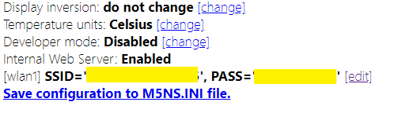

---

## 7. Aggiorna il firmware M5Stack

Nella pagina di configurazione web, scorri fino a **Application firmware**. Se è disponibile una versione più recente, clicca il link di aggiornamento: il dispositivo scaricherà e installerà il nuovo firmware automaticamente (meno di 5 minuti).

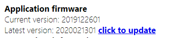

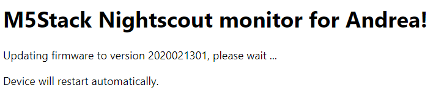

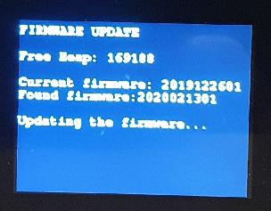

---

## 8. Usa i tasti dell'M5Stack

| Azione | Tasto |
|---|---|
| Quadrante successivo | Tasto sinistro |
| Snooze allarme | Tasto centrale |
| Cambia luminosità | Tasto destro |

Il quarto quadrante mostra gli ultimi 10 errori.

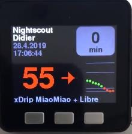

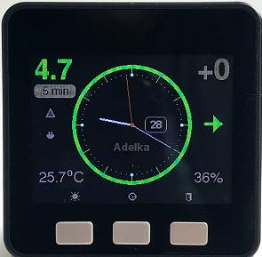

---

## 9. In caso di difficoltà

Se ci sono problemi, lascia il cavo USB collegato dopo la programmazione: potrai vedere i messaggi di diagnostica tramite la porta seriale con un programma come PuTTY o Termite.

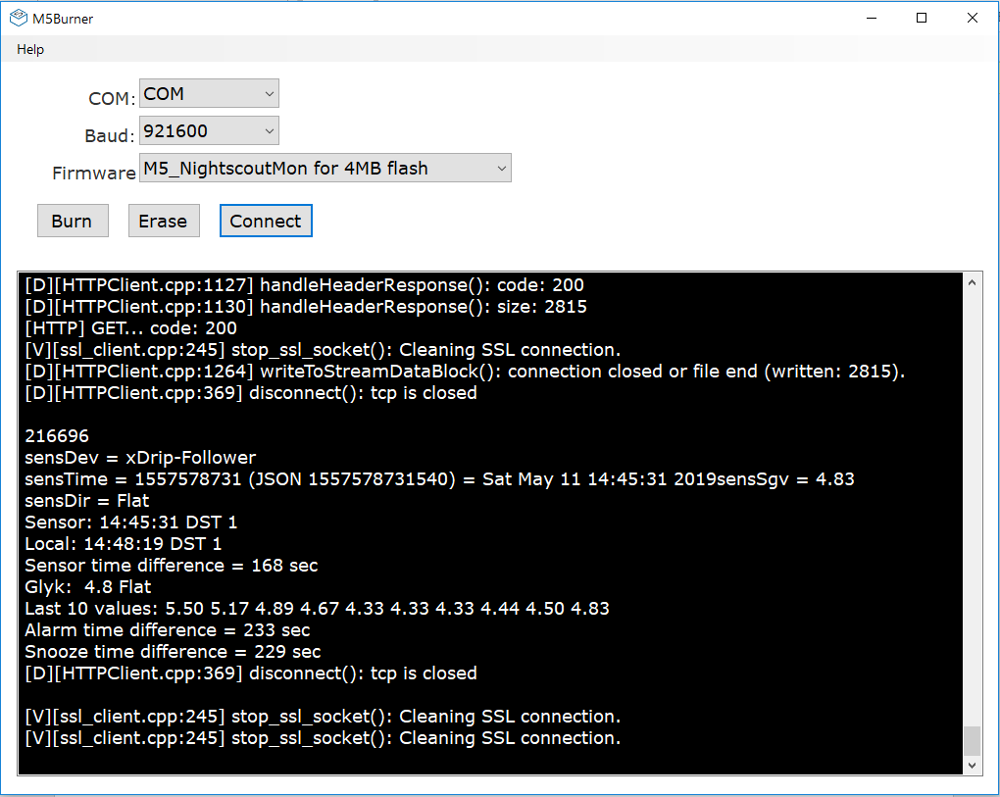
