# Monitor glicemia con M5Stack

Un M5Stack configurato come display da tavolo, con la glicemia sempre visibile:

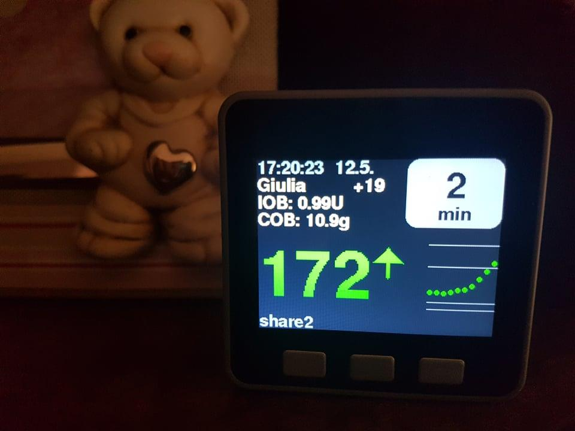

Questa guida spiega come configurare un **M5Stack** come display da tavolo per la glicemia. Puoi scegliere tra due firmware open source:

- **M5_NightscoutMon** (progetto originale di Martin Lukasek, aggiornato da Patrick Sonnerat): si collega al Wi-Fi di casa e legge i dati da Nightscout, Dexcom Share, LLink o Gluroo. Documentazione ufficiale: [`https://github.com/psonnera/M5_NightscoutMon/wiki`](https://github.com/psonnera/M5_NightscoutMon/wiki)
- **M5Stack_xDripMon**: riceve la glicemia direttamente dal telefono via Bluetooth, da xDrip (Android) o xDrip4iOS (iPhone). Niente Wi-Fi, niente cloud. Documentazione ufficiale: [`https://github.com/psonnera/M5Stack_xDripMon`](https://github.com/psonnera/M5Stack_xDripMon)

**Requisiti:** uno smartphone **Android** (Android 10 o superiore, con presa USB-C) — è il metodo più semplice e funziona per entrambi i firmware — oppure un computer (Windows o Mac): entrambi i firmware sono disponibili nell'elenco ufficiale di M5Burner.

> ⚠️ **Attenzione**: L'utilizzo è a esclusiva responsabilità personale.

---

## 1. I due firmware

| | M5_NightscoutMon | M5Stack_xDripMon |
|---|---|---|
| Collegamento | Wi-Fi di casa | Bluetooth, direttamente dal telefono |
| Sorgenti dati | Nightscout, Dexcom Share, LLink (follower), Gluroo | xDrip (Android), xDrip4iOS (iPhone) |
| Serve internet | Sì | No |
| Funziona fuori casa | Solo dove c'è un Wi-Fi configurato | Sì, basta il telefono nelle vicinanze |
| Configurazione | Pagina web dal telefono o dal computer | Menu direttamente sul dispositivo |
| Modelli supportati | Basic, Fire, Core2, CoreS3 | Basic recente (16 MB), Fire, Core2 — **non** CoreS3 |

In breve:

- **M5_NightscoutMon** fa per te se hai **Nightscout** (oppure usi Dexcom Share, LLink o Gluroo) e il display resterà dove c'è un Wi-Fi.
- **M5Stack_xDripMon** fa per te se usi già **xDrip** o **xDrip4iOS** e vuoi zero configurazione di rete: il telefono invia la glicemia direttamente al display.

Una volta individuato il tuo firmware, questi sono i passi da seguire:

**Percorso M5_NightscoutMon:**

1. [Procurati il materiale](#_2-materiale-occorrente)
2. Programma l'M5Stack [dal telefono Android](#_3-metodo-facile-—-programma-l-m5stack-dal-telefono-android) (più semplice) oppure [dal computer](#_4-metodo-alternativo-—-programma-da-computer-con-m5burner)
3. [Collegalo al Wi-Fi](#_5-m5-nightscoutmon-—-collega-al-wi-fi)
4. [Configuralo](#_6-m5-nightscoutmon-—-configura-il-dispositivo)
5. Quando ti serve: [aggiorna il firmware](#_7-m5-nightscoutmon-—-aggiorna-il-firmware) e [scopri tasti e quadranti](#_8-m5-nightscoutmon-—-tasti-e-quadranti)

**Percorso M5Stack_xDripMon:**

1. [Procurati il materiale](#_2-materiale-occorrente)
2. Programma l'M5Stack [dal telefono Android](#_3-metodo-facile-—-programma-l-m5stack-dal-telefono-android) (più semplice) oppure [dal computer](#_4-metodo-alternativo-—-programma-da-computer-con-m5burner)
3. [Configura il collegamento Bluetooth](#_9-m5stack-xdripmon-—-configura-il-collegamento-bluetooth)

> ℹ️ **Nota**: i quadranti e gli allarmi sono praticamente identici nei due firmware, e puoi passare dall'uno all'altro in qualsiasi momento riprogrammando il dispositivo.

---

## 2. Materiale occorrente

- **M5Stack Core Basic** (ESP32): lo trovi sul sito del produttore [`https://m5stack.com/collections/m5-core`](https://m5stack.com/collections/m5-core), su AliExpress o Amazon. Prezzo indicativo: 60–70 € spedito (metà 2026). Funzionano anche Core GRAY, GO, FIRE, Core2, CoreS3/S3SE e M5Tough, ma non offrono vantaggi per questo uso.

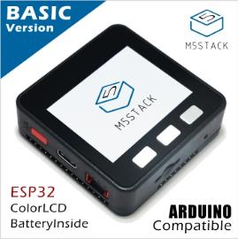

- **Caricatore USB** (indispensabile) e cavo USB-C: il cavetto fornito nel kit è corto e di tipo USB-A/USB-C; per programmare da telefono serve un cavo **USB-C/USB-C**.
- La batteria inclusa dura poco (150 mAh): se non aggiungi una batteria supplementare, tieni il dispositivo sempre in carica.
- (Facoltativo) Scheda micro SD (serve solo per gestire più configurazioni con M5_NightscoutMon; 8–16 GB bastano) e batterie supplementari, che aumentano l'autonomia a 7–8 ore con luminosità ridotta.

> ⚠️ **Attenzione**: M5Stack_xDripMon richiede un modello con 16 MB di memoria: Basic recente (v2.6/v2.7), Fire o Core2. Non funziona su CoreS3 né sui Basic più vecchi (4 MB).

> ℹ️ **Nota**: gli M5Stack Basic e Grey più recenti non digeriscono le micro SD SanDisk Ultra: usa una Kingston o una scheda senza marca.

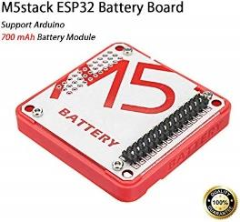

Per installare le batterie supplementari, apri delicatamente la parte anteriore dell'M5Stack con un coltello o un cacciavite piatto abbastanza largo, facendo leva ai lati del guscio:

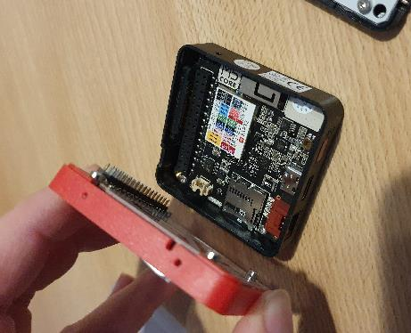

Solleva il pannello anteriore fino a staccarlo completamente:

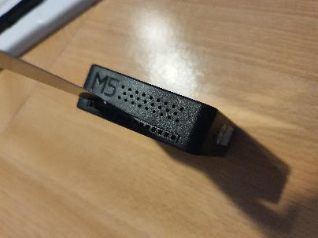

Inserisci le batterie supplementari nell'apposito vano:

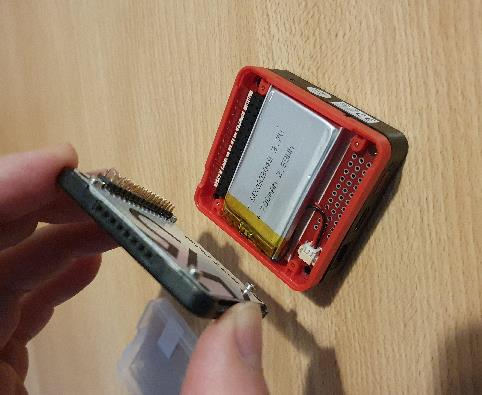

Richiudi il pannello anteriore fino a sentirlo scattare in posizione:

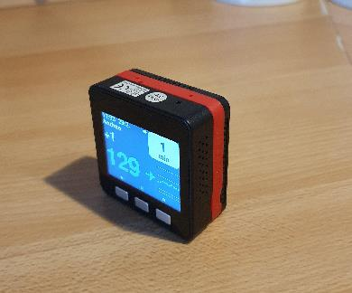

Ecco com'è fatto un M5Stack Core (Basic):

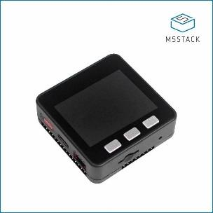

E questo invece è un M5Stack Core 2, riconoscibile dal frontale completamente touch:

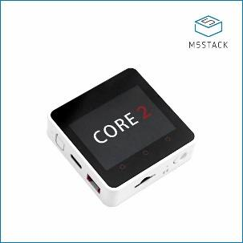

**Prossimo passo**: programma l'M5Stack [dal telefono Android](#_3-metodo-facile-—-programma-l-m5stack-dal-telefono-android) (consigliato) oppure [dal computer con M5Burner](#_4-metodo-alternativo-—-programma-da-computer-con-m5burner).

---

## 3. Metodo facile — Programma l'M5Stack dal telefono Android

Non serve nessun computer: basta uno smartphone Android (versione 10 o superiore) e un cavo USB-C/USB-C. Questo metodo funziona per **entrambi i firmware**.

1. Collega prima l'M5Stack a un caricatore USB, così si ricarica.
2. Sul telefono, installa l'app **M5Stack Loader** da [`https://github.com/psonnera/M5StackLoader/releases`](https://github.com/psonnera/M5StackLoader/releases) (in attesa della pubblicazione sul Play Store).
3. Collega l'M5Stack al telefono con il cavo USB-C. Quando Android chiede quale app usare per il dispositivo USB, scegli **M5Stack Loader**:

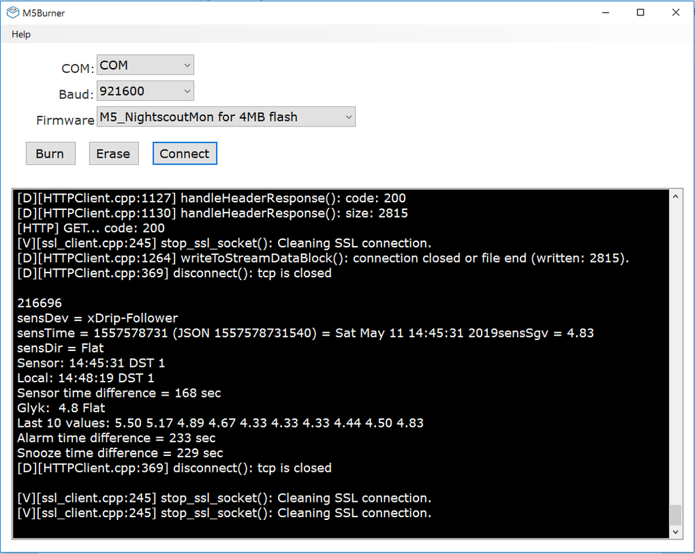

Autorizza l'accesso USB (**Consenti sempre** se non colleghi altri dispositivi ESP32 al telefono, oppure **Solo questa volta**) e tocca **OK**:

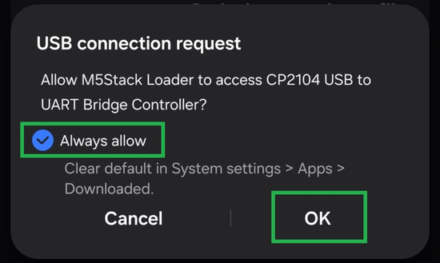

4. Concedi il permesso di **posizione** (**Mentre usi l'app**): Android lo richiede per elencare le reti Wi-Fi:

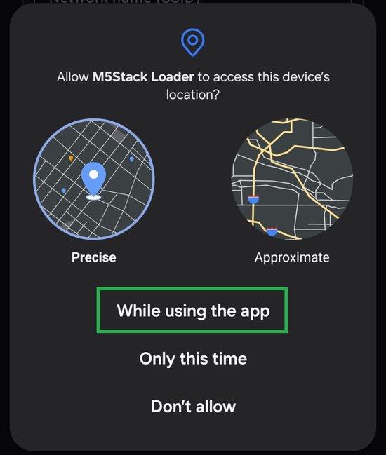

5. Alla domanda **What would you like to flash?** scegli il riquadro del firmware da installare: **M5 NightscoutMon** (il gufo, Wi-Fi) oppure **M5Stack xDripMon** (Bluetooth). Il terzo riquadro, per firmware personalizzati da GitHub, è riservato agli esperti:

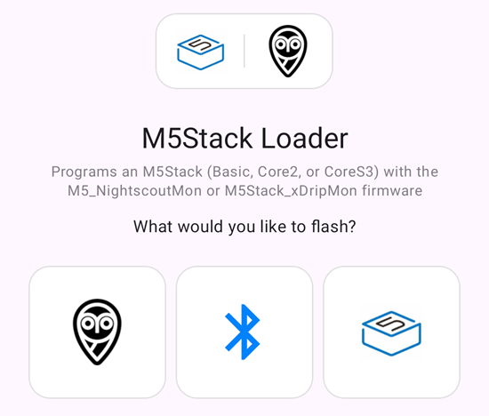

6. (Solo per M5_NightscoutMon, consigliato) Spunta **Set up Wi-Fi on the device** e inserisci la **password** della tua rete Wi-Fi: le credenziali vengono scritte nel dispositivo durante la programmazione, così si collegherà da solo alla rete (le credenziali non vengono inviate a nessun server). Se non la spunti, potrai configurare il Wi-Fi più tardi con il metodo descritto alla [sezione 5](#_5-m5-nightscoutmon-—-collega-al-wi-fi) di questa guida:

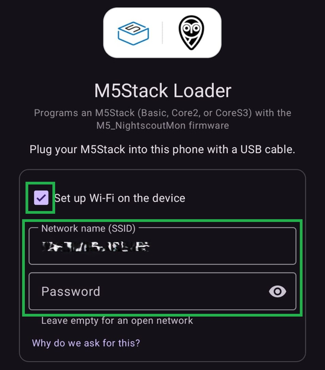

7. L'app riconosce da sola il modello di M5Stack e sceglie il firmware giusto: controlla il riepilogo e tocca **Flash firmware**:

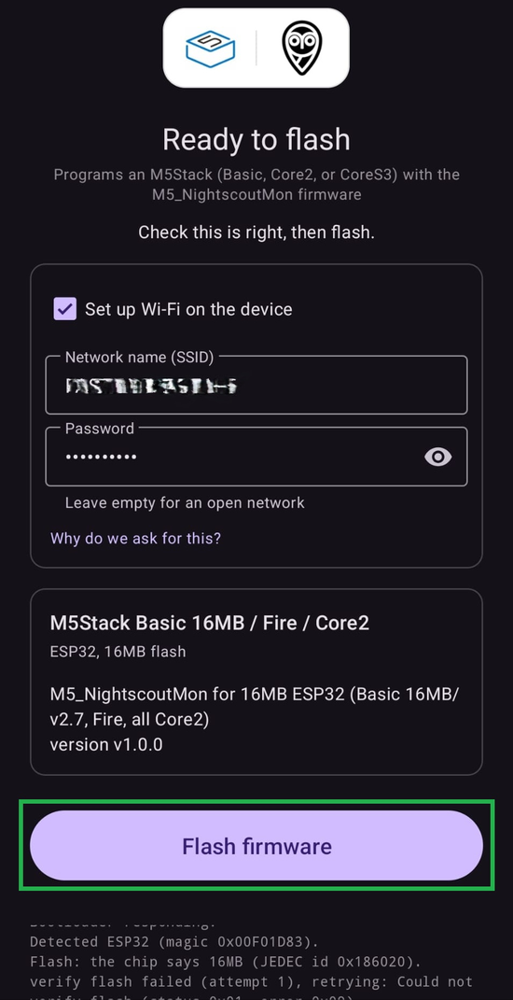

La barra può restare all'1% per una trentina di secondi, poi la scrittura dura circa 10 secondi: **non scollegare il cavo**:

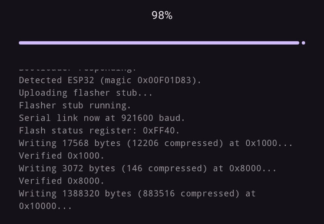

Alla fine il dispositivo si riavvia e puoi scollegarlo:

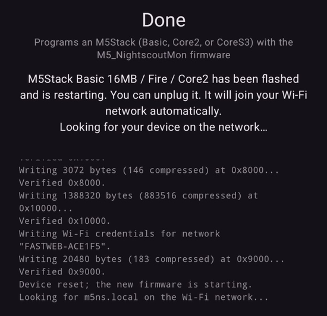

8. (Solo per M5_NightscoutMon) Tocca **Open device configuration**: l'app trova il dispositivo al suo indirizzo unico `m5ns-xxxx.local` e apre la pagina di configurazione (vedi la [sezione 6](#_6-m5-nightscoutmon-—-configura-il-dispositivo)):


9. (Solo per M5Stack_xDripMon) Alla prima accensione il dispositivo ti chiede da quale app riceverà la glicemia: continua con la [sezione 9](#_9-m5stack-xdripmon-—-configura-il-collegamento-bluetooth) di questa guida.

**Se qualcosa non va:**
- La programmazione non parte o si interrompe: prova con un altro cavo.
- Lo schermo resta nero: ripeti la programmazione (è molto difficile danneggiare un ESP32).
- Il dispositivo non si collega al Wi-Fi: la password era sbagliata; riprogramma oppure usa la configurazione Wi-Fi della [sezione 5](#_5-m5-nightscoutmon-—-collega-al-wi-fi).
- Non trovi la pagina di configurazione: premi ripetutamente il **tasto destro** dell'M5Stack fino alla pagina con il **codice QR di configurazione** e scansionalo (oppure usa l'indirizzo IP mostrato).

---

## 4. Metodo alternativo — Programma da computer con M5Burner

Entrambi i firmware sono pubblicati nell'elenco ufficiale di **M5Burner**, lo strumento di programmazione di M5Stack. La procedura è la stessa da Windows e da Mac: cambia solo il firmware da cercare.

> ℹ️ **Nota**: le schermate di questa sezione si riferiscono a Windows; su Mac le finestre sono un po' diverse, ma i passaggi sono gli stessi.

### Verifica il driver USB

1. Collega l'M5Stack al computer. Il dispositivo esegue un autotest:

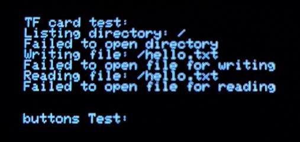

2. Apri **Gestione dispositivi** di Windows (clic destro sul pulsante Start → **Gestione dispositivi**) e guarda in **Porte (COM e LPT)**: se compare una porta COM (es. `COM3`), il driver è già presente e puoi passare a M5Burner. Annota il numero della porta:

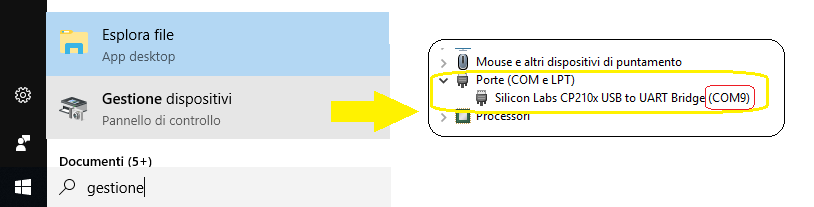

3. Se non compare nessuna porta, installa il driver da [`https://docs.m5stack.com/en/download`](https://docs.m5stack.com/en/download) (sezione **USB Driver**):
   - `CH9102_VCP_SER_Windows` per i Basic/Core2 recenti (chip CH9102)
   - `CP210x_VCP_Windows` per le unità più vecchie (chip CP2104), disponibile anche dal sito Silicon Labs: [`https://www.silabs.com/developer-tools/usb-to-uart-bridge-vcp-drivers`](https://www.silabs.com/developer-tools/usb-to-uart-bridge-vcp-drivers)

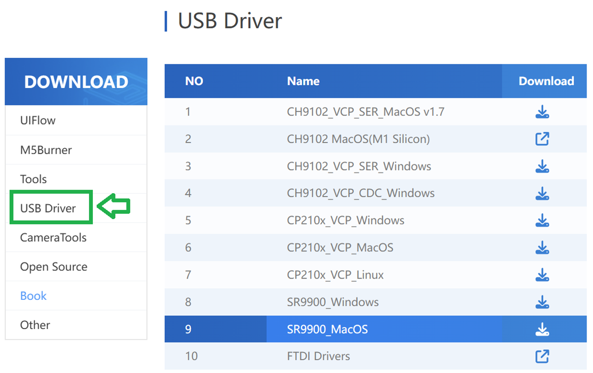

Nella cartella Download, estrai il file `.zip`, apri la cartella estratta ed esegui il programma di installazione per la tua piattaforma (x64 per la maggior parte dei computer), poi **Avanti**, **Accetta**, **Avanti**, **Fine**:

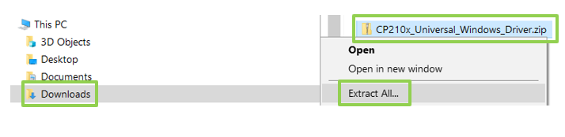

Ricollega l'M5Stack e controlla che la porta COM compaia in Gestione dispositivi.

> ℹ️ **Nota**: Se hai già versioni precedenti del driver USB SiLabs, rimuovile prima per evitare conflitti. Dopo l'installazione, scollega e ricollega il dispositivo.

**Su Mac** di solito non serve nessun driver (da macOS Catalina in poi). Per verificare, collega l'M5Stack, apri il **Terminale** e digita:

```bash
ls /dev/cu.*
```

Se compare una porta tipo `/dev/cu.usbserial-XXXX` o `/dev/cu.wchusbserial-XXXX`, sei a posto. Altrimenti installa il driver dalla stessa pagina M5Stack (`CH9102_VCP_SER_MacOS` per le unità recenti, `CP210x` per le più vecchie) e autorizzalo in **Impostazioni di Sistema** → **Generali** → **Elementi login ed estensioni**.

### Installa M5Burner e il firmware

1. Scarica **M5Burner** dalla pagina ufficiale [`https://docs.m5stack.com/en/uiflow/m5burner`](https://docs.m5stack.com/en/uiflow/m5burner): versione **Win x64** per Windows oppure **MacOS x64** per Mac:

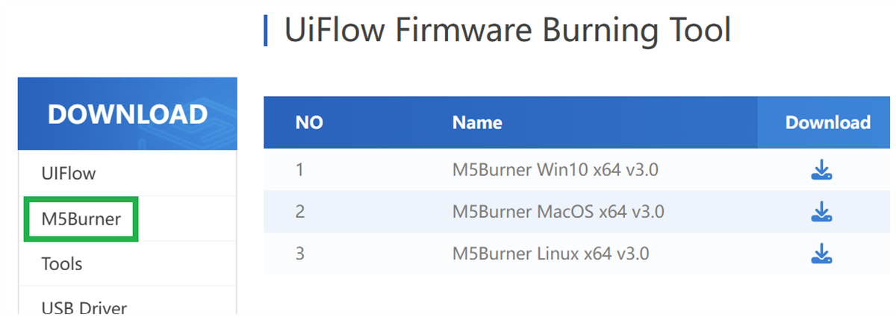

2. Su Windows, estrai lo zip in un percorso **senza spazi** (es. direttamente in `C:\`) e avvia `M5Burner.exe`. Su Mac, apri il file DMG e trascina M5Burner in **Applicazioni**; al primo avvio, se macOS lo blocca, aprilo con clic destro (Ctrl+clic) → **Apri**.
3. Se Windows Defender blocca l'esecuzione, clicca **Ulteriori informazioni**:

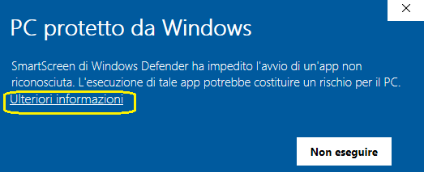

Poi clicca **Esegui comunque** (M5Burner è lo strumento ufficiale di M5Stack, è sicuro):

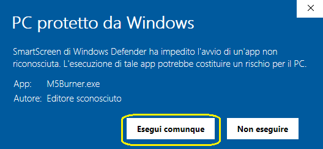

4. In M5Burner, nell'elenco **Device Type** a sinistra seleziona il tuo modello, poi cerca il firmware nella barra di ricerca in alto e clicca **Download** sul risultato. Per **M5_NightscoutMon** su Basic/Core/Gray, seleziona **CORE** e cerca `Nightscout`:

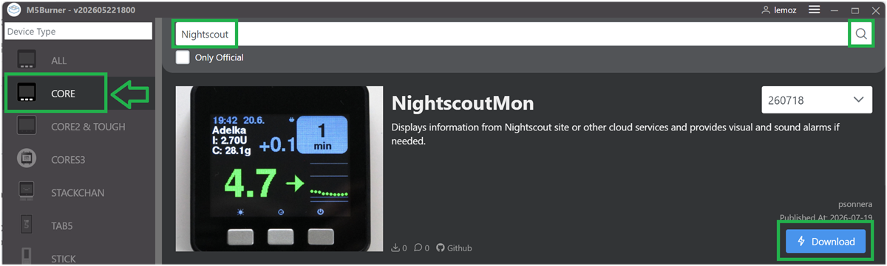

Per un Core2 o Tough, seleziona invece **CORE2 & TOUGH**:

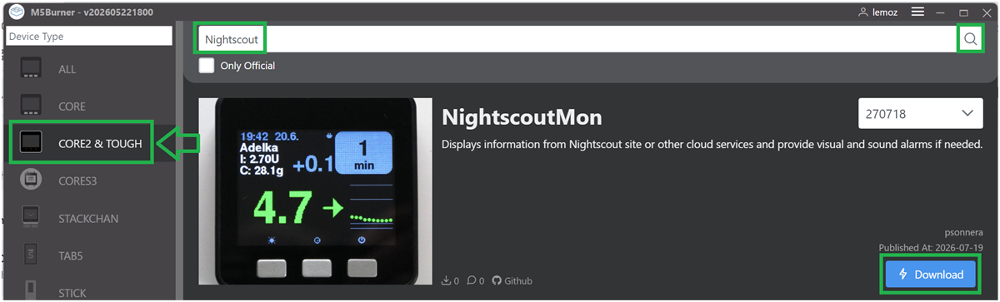

Per **M5Stack_xDripMon**, seleziona **CORE** (la stessa versione vale per tutti i modelli supportati) e cerca `xDrip`:

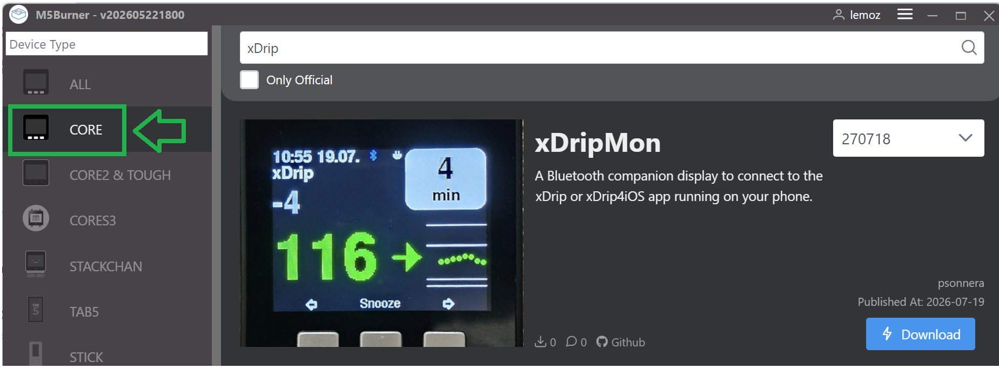

5. Una volta scaricato, sul firmware compaiono i pulsanti **Remove** e **Burn**: clicca **Burn**:

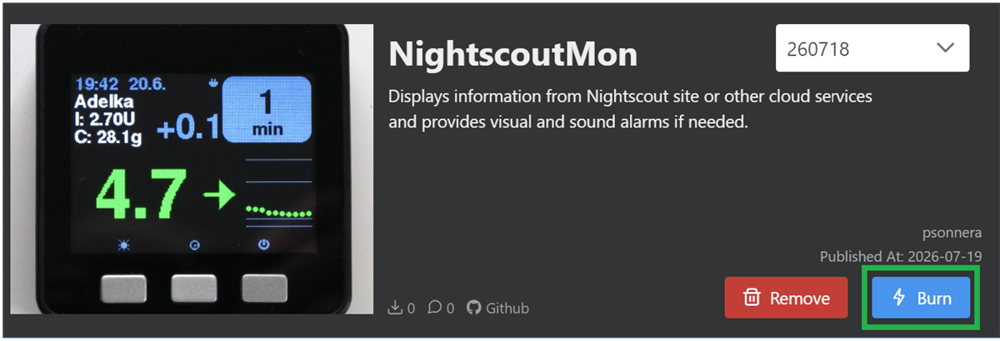

Al messaggio **Notice** sul firmware non ufficiale rispondi **Continue** (è normale: si tratta di firmware della comunità, non pubblicato da M5Stack):

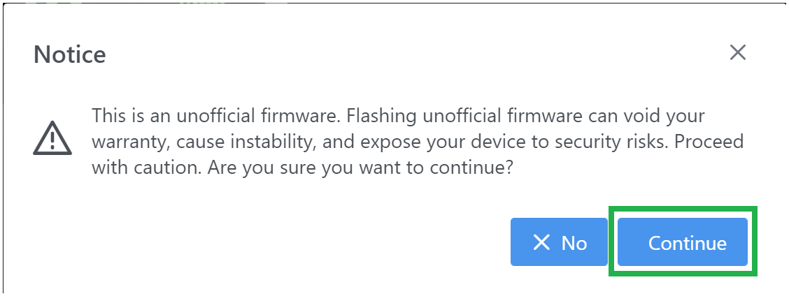

6. Nella finestra di scrittura, controlla che l'M5Stack sia collegato, seleziona la porta annotata prima (la porta **COM** su Windows, la porta `/dev/cu.…` su Mac), imposta il baud rate a `921600` e clicca **Start**:

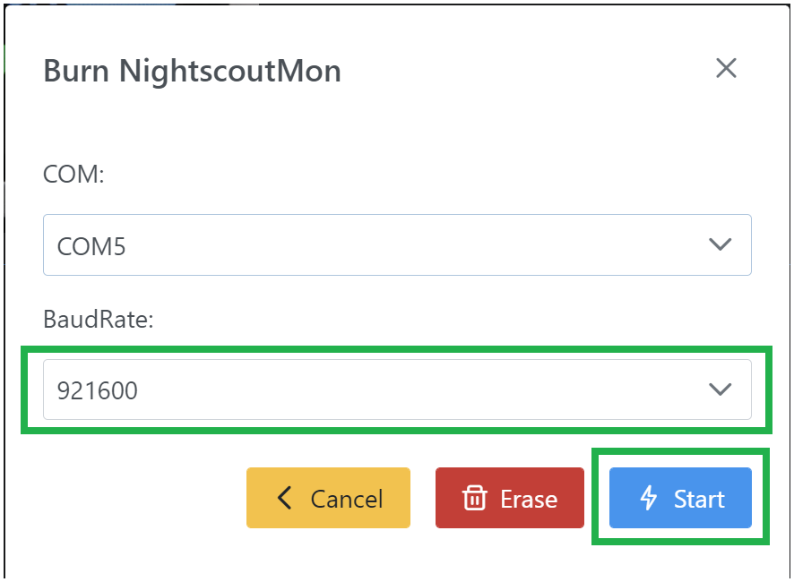

La scrittura del firmware mostra l'avanzamento:

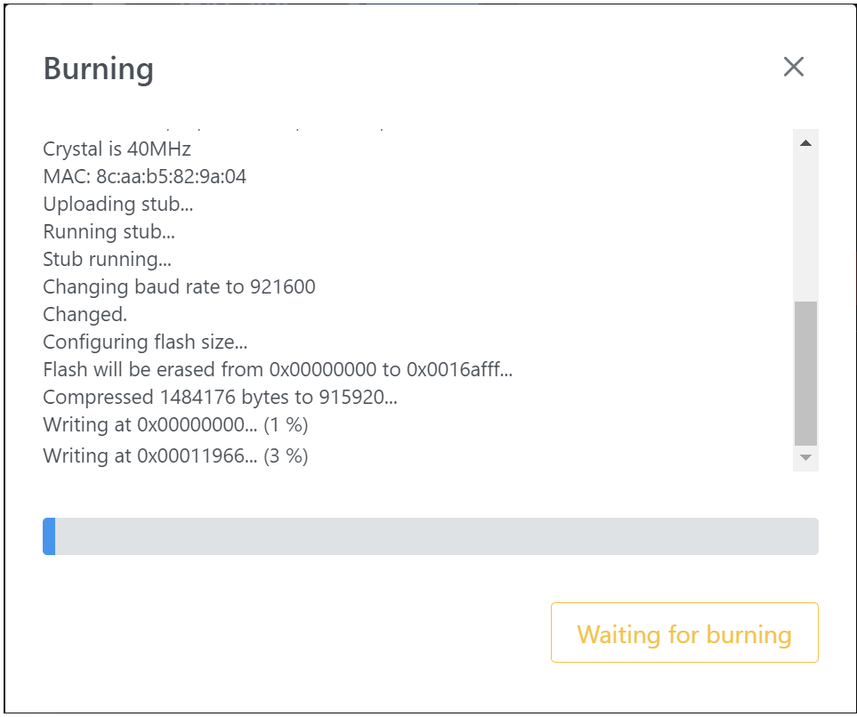

7. Al termine comparirà **"Burn successfully, click here to return"**: cliccalo per tornare a M5Burner:

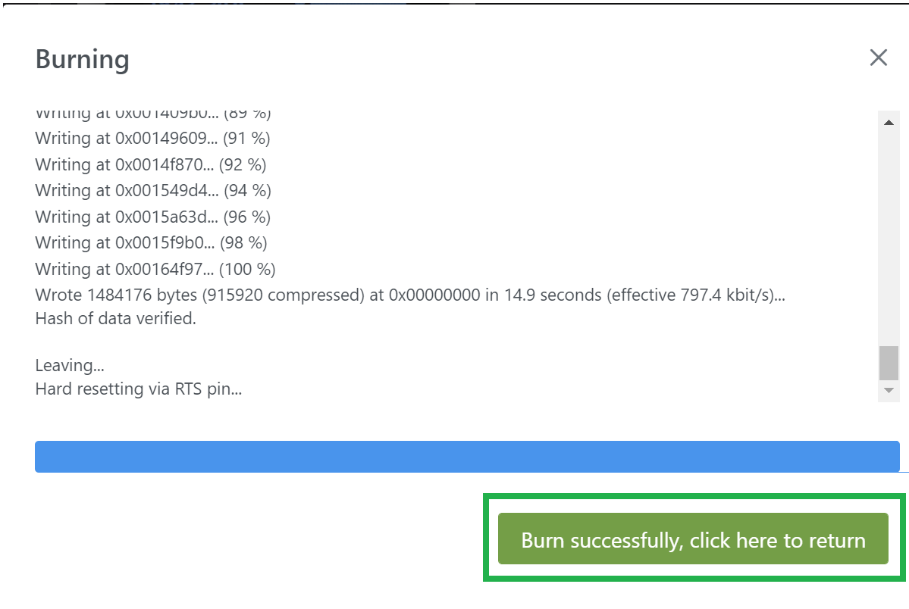

**Se la scrittura fallisce:** riprova con baud rate `115200`, cambia cavo o porta USB, e chiudi eventuali programmi che usano la porta.

**Prossimo passo**: con M5_NightscoutMon, [collega il dispositivo al Wi-Fi](#_5-m5-nightscoutmon-—-collega-al-wi-fi); con M5Stack_xDripMon, [configura il collegamento Bluetooth](#_9-m5stack-xdripmon-—-configura-il-collegamento-bluetooth).

---

## 5. M5_NightscoutMon — Collega al Wi-Fi

> ℹ️ **Nota**: le sezioni da 5 a 8 riguardano solo **M5_NightscoutMon**. Se hai installato M5Stack_xDripMon, salta alla [sezione 9](#_9-m5stack-xdripmon-—-configura-il-collegamento-bluetooth).

Se non hai già configurato il Wi-Fi durante la programmazione da Android, alla prima accensione l'M5Stack entra in modalità **SoftAP**: crea una propria rete Wi-Fi temporanea e mostra sullo schermo i dati per collegarsi:

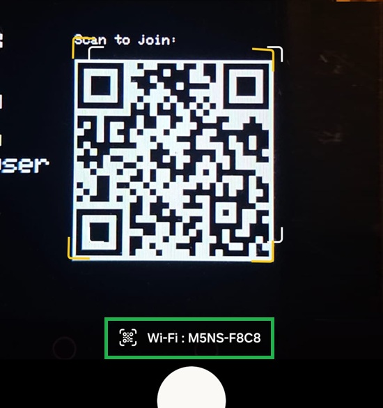

1. Dal tuo smartphone (qualsiasi), scansiona il codice QR oppure connettiti manualmente alla rete Wi-Fi mostrata, usando la password sullo schermo. Poiché questa rete non ha internet, il telefono ti avviserà: scegli **Connetti solo questa volta** (oppure **Connetti sempre**):

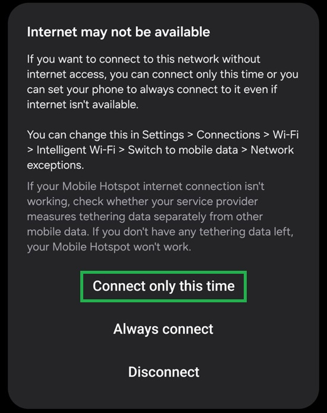

Attendi che il telefono si colleghi alla rete dell'M5Stack:

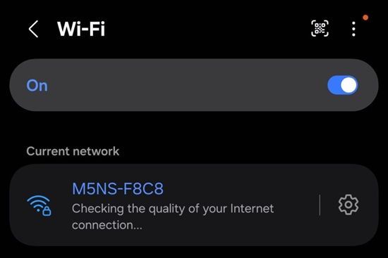

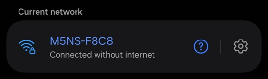

2. Apri un browser e vai a `http://m5ns-xxxx.local` (il nome esatto è quello della rete Wi-Fi mostrata sullo schermo) oppure a [`http://192.168.0.1`](http://192.168.0.1) — attenzione: **http**, non https. Il server del dispositivo è lento: abbi pazienza tra un clic e l'altro:

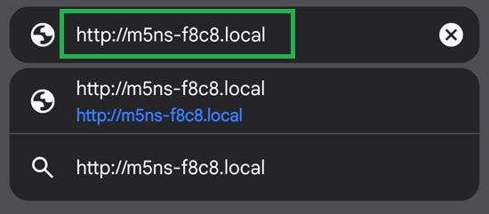

Si aprirà la pagina di configurazione dell'M5Stack (per ora conviene configurare solo il Wi-Fi):

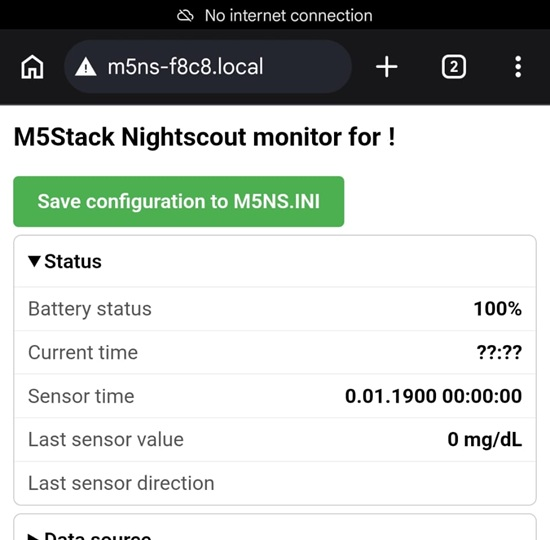

3. Scorri fino a **WiFi Configuration** e clicca **edit**:

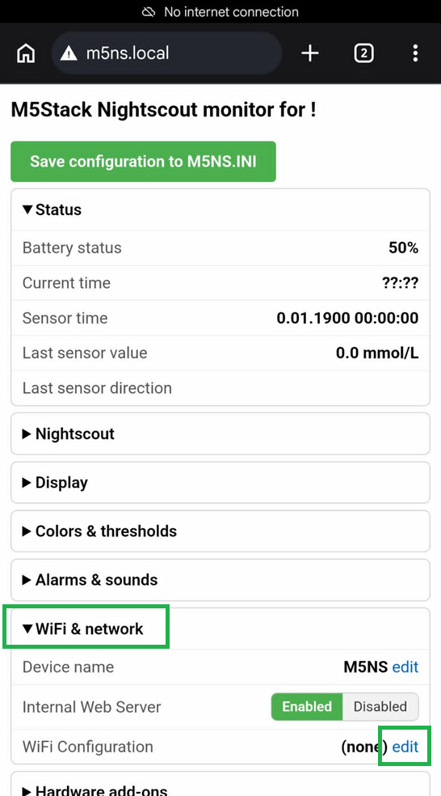

4. Seleziona la tua rete Wi-Fi dal menu a tendina (oppure digita il nome della rete a mano), inserisci la password nel campo sotto, scorri fino in fondo e clicca **Apply**:

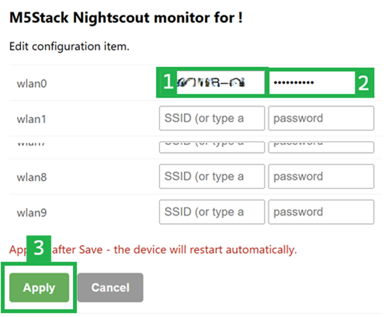

5. Le modifiche al Wi-Fi vengono riepilogate: attendi il ritorno al menu principale, poi clicca **Save configuration to M5NS.INI**. Il dispositivo si riavvierà e si connetterà alla tua rete Wi-Fi:

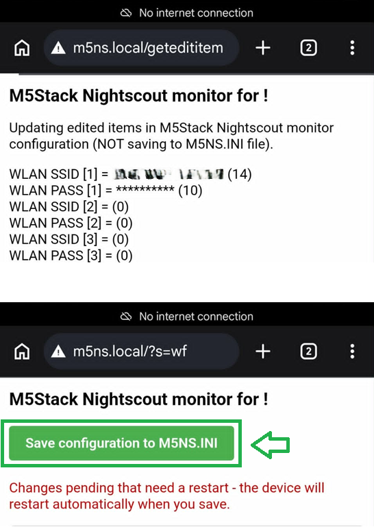

Al riavvio vedrai la schermata di avvio:

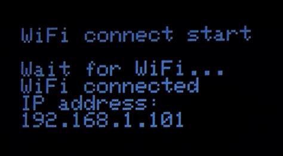

E poi il quadrante grafico:

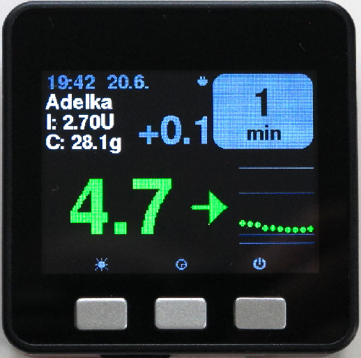

> ⚠️ **Attenzione**: se invece il dispositivo resta fermo su questa schermata, le credenziali Wi-Fi erano sbagliate: rientra in modalità SoftAP (vedi sotto) e correggile.

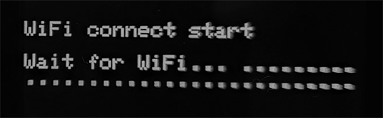

**Per rientrare in modalità SoftAP** in qualsiasi momento:
- **Basic/Core**: tieni premuto il **tasto sinistro**, premi il tasto rosso di reset sul lato e continua a tenere premuto il tasto sinistro finché non compare la schermata con il QR del Wi-Fi.
- **Core2**: premi il tasto di reset in basso a sinistra e tocca **CONFIG** sullo schermo durante il riavvio.

**Prossimo passo**: [configura il dispositivo](#_6-m5-nightscoutmon-—-configura-il-dispositivo).

---

## 6. M5_NightscoutMon — Configura il dispositivo

Da un computer o telefono sulla stessa rete Wi-Fi, vai su `http://m5ns-xxxx.local` — il nome esatto (le 4 cifre `xxxx` sono uniche per il tuo dispositivo) è mostrato nella pagina con il **codice QR di configurazione**: premi il **tasto destro** dell'M5Stack finché non compare, poi scansiona il QR o usa l'indirizzo IP indicato:

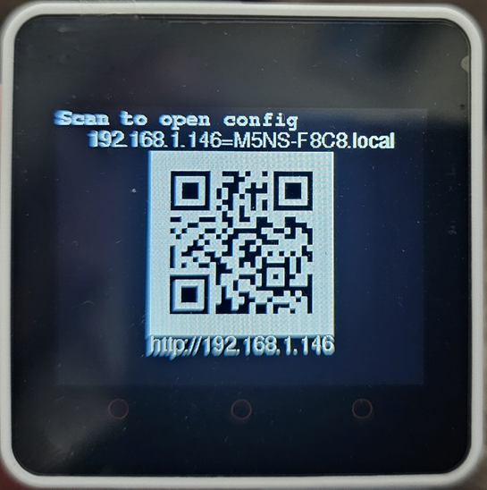

Se tutto è corretto, si aprirà la pagina di configurazione con lo stato del dispositivo e le impostazioni correnti:

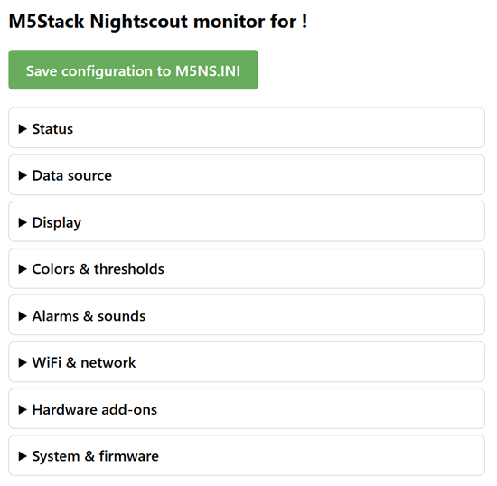

Clicca **edit** accanto ai valori che vuoi modificare. Le modifiche sono subito attive in memoria, ma per conservarle devi cliccare **Save configuration to M5NS.INI** in alto; le impostazioni che richiedono un riavvio (sorgente dati, nome dispositivo, reti Wi-Fi, fuso orario) mostrano un avviso rosso e il dispositivo si riavvia da solo al salvataggio:

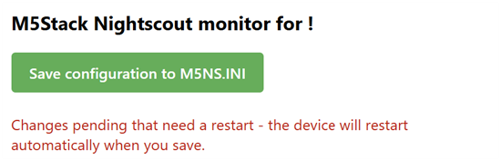

### Sorgente dati (una sola attiva)

| Sorgente | Impostazioni |
|---|---|
| **Nightscout** | **Nightscout URL** (es. `miosito.dominio.com`) e **Security token** (vuoto se il sito non è protetto) |
| **Dexcom Share** | **Dexcom account**: l'account che **condivide** (non quello follower) e il server (**US**, **Outside US** o **Japan**) |
| **LLink** | L'account **follower** (non l'account principale LView); lascia la regione su **Auto (detect)** |

> ⚠️ **Attenzione**: le credenziali Dexcom e LLink vengono salvate in chiaro nella memoria del dispositivo (o sulla micro SD).

### Altre impostazioni principali

| Parametro | Descrizione |
|---|---|
| Display units | `mg/dL` o `mmol/L` (vale anche per soglie e allarmi) |
| Default page | Quadrante all'avvio (i tasti permettono di cambiare pagina) |
| Status line | Riga di stato: info sensore, icone tasti, oppure info loop/basale |
| Display yellow below/above | Soglie per il giallo (avvertimento) |
| Display red below/above | Soglie per il rosso (fuori range) |
| Warning/Alarm sound below/above | Soglie delle suonerie di avvertimento e allarme |
| Warning sound when no reading for | Minuti senza lettura prima dell'avvertimento |
| Snooze timeout / Repeat alarm every | Silenziamento e ripetizione degli allarmi |
| Warning/Alarm sound volume | Volumi separati per avvertimento e allarme (0 = silenzioso) |
| Device name | Il nome per l'indirizzo `.local` |
| Time offset / DST offset | Fuso orario e ora legale in secondi (riavvio necessario) |
| Restart at time | Riavvio automatico giornaliero (es. `03:30`; `NORES` per disabilitare) |
| Restart after N errors | Riavvio automatico dopo N errori (0 = mai) |

La pagina permette anche di gestire più reti Wi-Fi memorizzate (fino a 9), gli accessori opzionali (striscia LED, motorino di vibrazione) e il **server web interno** (se lo disabiliti, la pagina non sarà più raggiungibile fino al prossimo riavvio in modalità configurazione).

Una volta sistemate le impostazioni, clicca **Save configuration to M5NS.INI** in cima alla pagina.

> ℹ️ **Nota**: per riportare il dispositivo alle impostazioni di fabbrica, vai su `http://m5ns-xxxx.local/clearconfigflash` e poi rifai la configurazione dalla modalità SoftAP.

> ℹ️ **Nota sulla micro SD**: al riavvio, se c'è una micro SD inserita il dispositivo usa e salva il file `M5NS.ini` sulla SD; senza SD usa la memoria interna. Utile per passare tra più configurazioni.

---

## 7. M5_NightscoutMon — Aggiorna il firmware

Gli aggiornamenti vengono scaricati direttamente dal repository GitHub del progetto: il dispositivo sceglie da solo la versione adatta al proprio modello.

Nella pagina di configurazione web, scorri fino a **Application firmware**. Clicca **Check for update**: se è disponibile una versione più recente, clicca **click to update**:

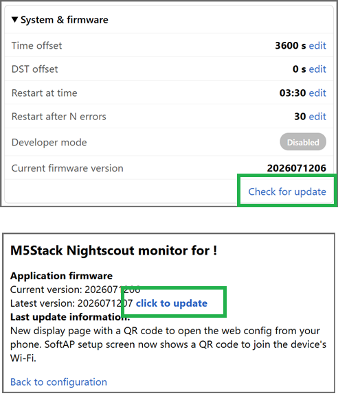

In alternativa puoi aggiornare direttamente dal dispositivo: premi il tasto destro fino alla pagina con il codice QR di configurazione; se c'è un aggiornamento disponibile, sopra il tasto centrale compare **UPDATE**: premilo:

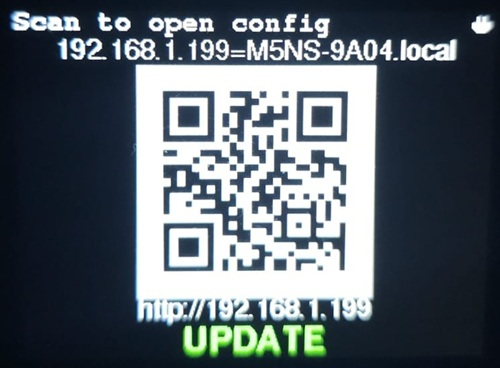

Il dispositivo scaricherà e installerà il nuovo firmware automaticamente (meno di 5 minuti), mostrando l'avanzamento sul display:

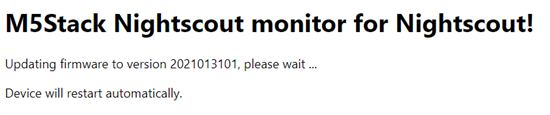

Attendi il completamento: al termine il dispositivo si riavvia da solo:

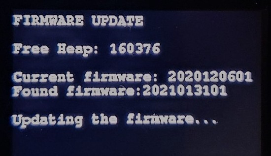

---

## 8. M5_NightscoutMon — Tasti e quadranti

| Azione | Tasto |
|---|---|
| Cambia luminosità (3 livelli) | Tasto sinistro |
| Snooze allarme (1x → 2x → 3x → 4x → off) | Tasto centrale |
| Quadrante successivo | Tasto destro |
| Spegni lo schermo | Tasto destro premuto per 4 secondi |

Con il tasto destro puoi scorrere tra i quadranti disponibili:

1. **Quadrante principale**: ora, data, glicemia con freccia di tendenza, mini-grafico delle ultime letture e IOB/COB (insulina e carboidrati attivi, se la sorgente li fornisce).
2. **Glicemia in grande**: valore ben visibile anche da lontano, con orologio grande.
3. **Orologio analogico**: con data, glicemia e delta; mostra anche temperatura e umidità se è collegato un sensore ambientale.
4. **Registro errori**: gli ultimi 10 errori registrati e il conteggio totale.
5. **Codice QR di configurazione**: per aprire la pagina web del dispositivo e installare gli aggiornamenti.

Ecco un esempio di quadrante numerico, con nome utente, orario, valore e freccia di tendenza:

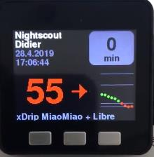

Ed ecco un esempio di quadrante circolare, con lancetta di tendenza e temperatura:

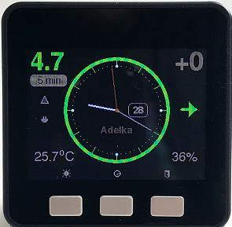

> ℹ️ **Nota**: il riquadro con i minuti trascorsi dall'ultima lettura cambia colore: grigio fino a 5 minuti (tutto ok), sfondo bianco tra 5 e 15 minuti (avvertimento), sfondo rosso oltre 15 minuti (nessun dato recente).

---

## 9. M5Stack_xDripMon — Configura il collegamento Bluetooth

Con questo firmware non c'è niente da configurare via web: il telefono con xDrip (Android) o xDrip4iOS (iPhone) invia la glicemia direttamente al dispositivo via Bluetooth, e tutte le impostazioni si regolano dal menu sul dispositivo stesso.

### Prima accensione: scegli la sorgente

Alla prima accensione (e dopo un factory reset) il dispositivo chiede da quale app riceverà i dati, prima ancora di attivare il Bluetooth:


- **Tasto sinistro (A)**: xDrip (Android)
- **Tasto destro (C)**: xDrip4iOS (iPhone)

La scelta viene memorizzata e non viene più richiesta; puoi comunque cambiarla in qualsiasi momento da **Menu** → **Data source** (il dispositivo si riavvia). Finché il telefono non si collega, il quadrante principale mostra `---` al posto del valore.

### Tasti e pagine

| Azione | Tasto |
|---|---|
| Pagina precedente / successiva | Tasto sinistro (A) / tasto destro (C) |
| Snooze allarme | Tasto centrale (B), pressione breve |
| Apri il menu impostazioni | Tasto centrale (B) dalla pagina **Log** |
| Indietro / annulla (nel menu) | Tasto centrale (B), pressione lunga |

Le pagine, in ordine: **quadrante principale** (glicemia, freccia di tendenza, mini-grafico e minuti dall'ultima lettura), **glicemia in grande**, **orologio analogico** e **Log** (gli eventi di connessione). Nel menu, le icone sopra i tasti indicano la funzione del momento (su/seleziona/giù, oppure meno/OK/più quando modifichi un valore).

Ecco il quadrante principale:

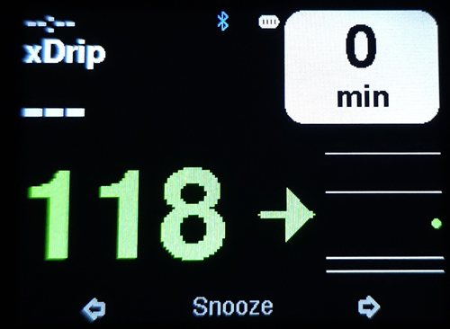

> ℹ️ **Nota**: come in M5_NightscoutMon, il riquadro dei minuti diventa bianco dopo 5 minuti senza letture e rosso dopo 15.

### Configura xDrip (Android)

In questa modalità l'M5Stack si presenta al telefono come un braccialetto Mi Band 2: xDrip lo trova, si autentica e gli invia ogni lettura.

**Metodo consigliato — codice QR.** Dopo aver scelto **xDrip (Android)** come sorgente, il dispositivo mostra un **codice QR** che contiene tutto il necessario (indirizzo Bluetooth e impostazioni Mi Band), così non devi digitare niente:

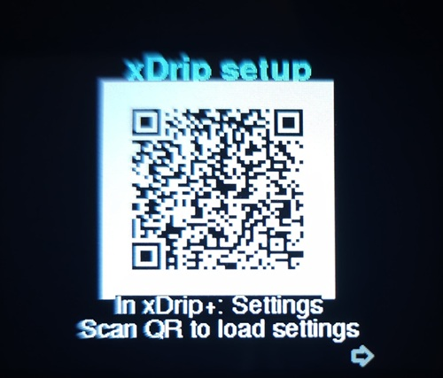

1. In xDrip, apri **Impostazioni** → **Configurazione automatica** (nella sezione **Sincronizzazione dati**) e tocca **Camera**:

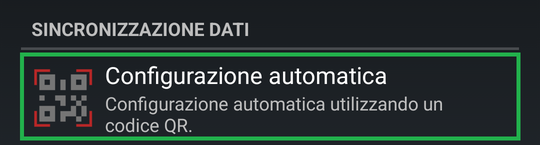

2. Inquadra il codice QR sullo schermo dell'M5Stack e conferma l'importazione:

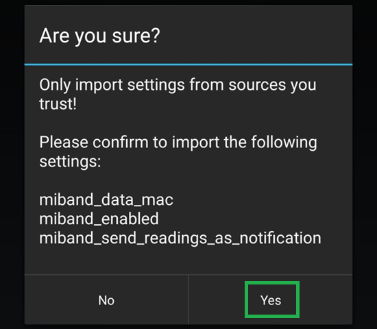

Quando l'autenticazione riesce, l'icona Bluetooth diventa blu fissa e nella pagina **Log** compare **auth OK**.

> ℹ️ **Nota**: se il codice QR non è più visibile, lo ritrovi in qualsiasi momento dal menu del dispositivo: **Bluetooth** → **xDrip Setup QR**.

**Prova subito il collegamento.** Per non aspettare il prossimo ciclo di 5 minuti, invia subito una lettura: in xDrip apri **Impostazioni** → **Caratteristiche Collegamenti Smart Watch** → **MiBand**, scorri fino a **Aggiorna la glicemia manualmente** e alla domanda **Aggiornare la glicemia ora?** tocca **Si**:

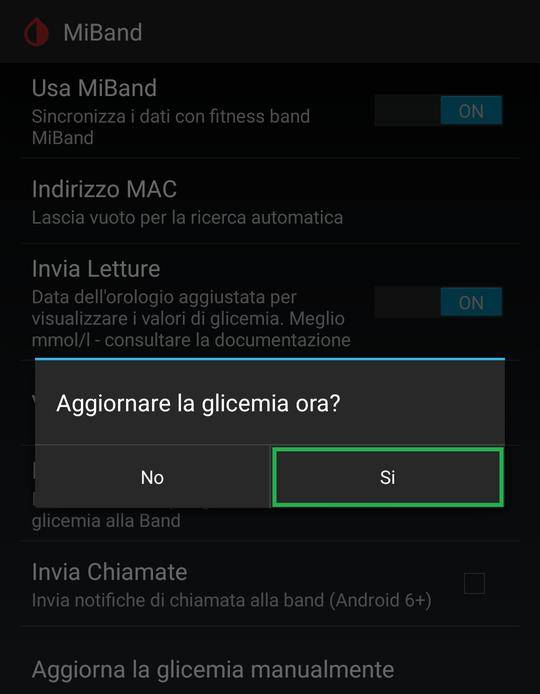

Il valore comparirà subito sul quadrante; per vedere freccia di tendenza e delta servono alcune letture in più.

**Se il QR non funziona — configurazione manuale.** In xDrip apri **Impostazioni** → **Caratteristiche Collegamenti Smart Watch** → **MiBand**:

1. Attiva **Usa MiBand** e lascia **vuota** la chiave di autenticazione (la genera xDrip):

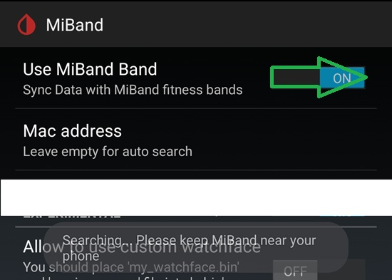

2. Se il campo **Indirizzo MAC** contiene un indirizzo di un abbinamento precedente, cancellalo completamente e tocca **OK** (vuoto = ricerca automatica), altrimenti xDrip continuerà a cercare il vecchio dispositivo:

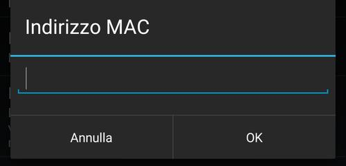

3. Con l'M5Stack acceso e vicino, xDrip lo trova da solo e compila l'indirizzo automaticamente:

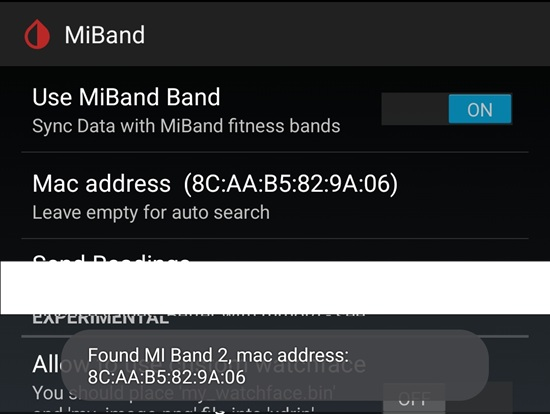

Poi prova il collegamento con **Aggiorna la glicemia manualmente** come descritto sopra.

> ℹ️ **Nota sull'orologio**: xDrip per Android non sincronizza l'ora: impostala da **Menu** → **Set time**. Il Core2 la mantiene anche da spento; sui modelli Basic e Fire (senza orologio interno a batteria) dovrai reinserirla dopo ogni spegnimento completo.

### Configura xDrip4iOS (iPhone)

1. Assicurati che la sorgente del dispositivo sia **xDrip4iOS** (tasto destro alla prima accensione, oppure **Menu** → **Data source**).
2. In xDrip4iOS, aggiungi un nuovo dispositivo Bluetooth di tipo **M5Stack**. La procedura ufficiale è descritta nella guida di xDrip4iOS: [`https://xdrip4ios.readthedocs.io/en/latest/connect/devices/`](https://xdrip4ios.readthedocs.io/en/latest/connect/devices/)
3. Accetta la richiesta di abbinamento: letture, freccia di tendenza, riconnessione e ora si sincronizzano automaticamente quando l'app si collega.

### Icona Bluetooth

L'icona Bluetooth sul display indica lo stato del collegamento:

- **Rossa lampeggiante**: non collegato (telefono lontano o app chiusa)
- **Blu lampeggiante**: collegato, autenticazione in corso
- **Blu fissa**: collegato e autenticato, i dati arrivano

### Menu impostazioni

Dalla pagina **Log**, premi il tasto centrale per aprire il menu:

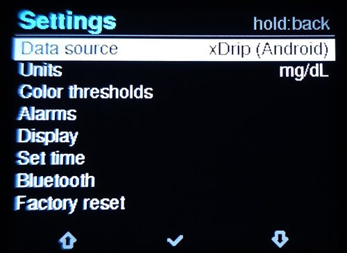

Le voci disponibili:

- **Data source**: passa tra xDrip (Android) e xDrip4iOS
- **Units**: `mg/dL` o `mmol/L`
- Soglie dei colori: giallo (avvertimento) e rosso (fuori range), per basso e alto
- Allarmi: soglie di avvertimento e allarme, suoni, durata dello snooze e timeout senza letture
- **Display**: personalizzazione dello schermo
- **Set time**: impostazione manuale dell'ora
- **Bluetooth**: parametri del collegamento e codice QR per xDrip
- **Factory reset**: torna alle impostazioni di fabbrica e richiede di nuovo la scelta della sorgente

Per impostare l'ora (**Set time**), modifica anno, mese, giorno, ora e minuti con i tasti **−** / **+**, confermando ogni campo con il tasto centrale; tienilo premuto per annullare:

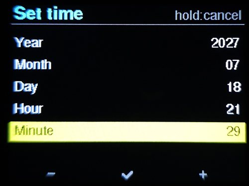

### Aggiorna il firmware

Per aggiornare M5Stack_xDripMon basta riprogrammare il dispositivo con una versione più recente, [dal telefono Android](#_3-metodo-facile-—-programma-l-m5stack-dal-telefono-android) o [dal computer](#_4-metodo-alternativo-—-programma-da-computer-con-m5burner): le impostazioni attuali vengono conservate, non dovrai riconfigurare niente.

---

## 10. In caso di difficoltà

- Se la programmazione fallisce, prova un altro cavo USB o un'altra porta; con M5Burner riprova a baud rate `115200`.
- Se lo schermo resta nero, ripeti semplicemente la programmazione: è molto difficile danneggiare un ESP32.
- **M5_NightscoutMon** — se non ricordi il nome `.local` del dispositivo, premi il tasto destro fino alla pagina con il codice QR di configurazione: mostra nome esatto e indirizzo IP.
- **M5_NightscoutMon** — il registro degli errori è visibile in uno dei quadranti (tasto destro per scorrerli) e nella pagina web di configurazione.
- **M5Stack_xDripMon** — se l'icona Bluetooth resta rossa lampeggiante: controlla che il telefono sia vicino, che xDrip/xDrip4iOS sia aperta e che le opzioni della [sezione 9](#_9-m5stack-xdripmon-—-configura-il-collegamento-bluetooth) siano attive; su Android verifica che xDrip non venga chiusa dal risparmio energetico e che il campo dell'indirizzo MAC in **Mi Band** sia vuoto o corrisponda al dispositivo attuale.
- **M5Stack_xDripMon** — se l'ora è sbagliata su Basic o Fire, reimpostala da **Menu** → **Set time** (dalla pagina **Log**, tasto centrale): questi modelli non hanno un orologio interno a batteria.
