# Monitor Nightscout con M5Stack

Un M5Stack configurato come display da tavolo, con la glicemia sempre visibile:

Questa guida spiega come configurare un **M5Stack** come display da tavolo per la glicemia, usando il progetto open source **M5_NightscoutMon** (progetto originale di Martin Lukasek, aggiornato da Patrick Sonnerat).

Documentazione ufficiale: [`https://github.com/psonnera/M5_NightscoutMon/wiki`](https://github.com/psonnera/M5_NightscoutMon/wiki)

> ℹ️ **Nota**: oltre a Nightscout, funziona anche direttamente con **Dexcom Share**, **LLink** (account follower) e **Gluroo**.

**Requisiti:** uno smartphone **Android** (Android 10 o superiore, con presa USB-C) — è il metodo più semplice — oppure un computer (Windows di preferenza).

> ⚠️ **Attenzione**: L'utilizzo è a esclusiva responsabilità personale.

---

## 1. Materiale occorrente

- **M5Stack Core Basic** (ESP32): lo trovi sul sito del produttore [`https://m5stack.com/collections/m5-core`](https://m5stack.com/collections/m5-core), su AliExpress o Amazon. Prezzo indicativo: meno di 60 € spedito (metà 2026). Funzionano anche Core GRAY, GO, FIRE, Core2, CoreS3 e M5Tough, ma non offrono vantaggi per questo uso.

- **Caricatore USB** (indispensabile) e cavo USB-C: il cavetto fornito nel kit è corto e di tipo USB-A/USB-C; per programmare da telefono serve un cavo **USB-C/USB-C**.
- La batteria inclusa dura poco (150 mAh): se non aggiungi una batteria supplementare, tieni il dispositivo sempre in carica.
- (Facoltativo) Scheda micro SD (serve solo per gestire più configurazioni; 8–16 GB bastano) e batterie supplementari, che aumentano l'autonomia a 7–8 ore con luminosità ridotta.

> ℹ️ **Nota**: gli M5Stack Basic e Grey più recenti non digeriscono le micro SD SanDisk Ultra: usa una Kingston o una scheda senza marca.

Per installare le batterie supplementari, apri delicatamente la parte anteriore dell'M5Stack con un coltello o un cacciavite piatto abbastanza largo, facendo leva ai lati del guscio:

Solleva il pannello anteriore fino a staccarlo completamente:

Inserisci le batterie supplementari nell'apposito vano:

Richiudi il pannello anteriore fino a sentirlo scattare in posizione:

Ecco com'è fatto un M5Stack Core (Basic):

E questo invece è un M5Stack Core 2, riconoscibile dal frontale completamente touch:

---

## 2. Metodo facile — Programma l'M5Stack dal telefono Android

Non serve nessun computer: basta uno smartphone Android (versione 10 o superiore) e un cavo USB-C/USB-C.

1. Collega prima l'M5Stack a un caricatore USB, così si ricarica.
2. Sul telefono, installa l'app **M5Stack Loader** da [`https://github.com/psonnera/M5StackLoader/releases`](https://github.com/psonnera/M5StackLoader/releases) (in attesa della pubblicazione sul Play Store).
3. Collega l'M5Stack al telefono con il cavo USB-C. Quando Android chiede quale app usare per il dispositivo USB, scegli **M5Stack Loader** e autorizza l'accesso USB (**Consenti sempre** oppure **Solo questa volta**), poi tocca **OK**.
4. Concedi il permesso di **posizione** (**Mentre usi l'app**): Android lo richiede per elencare le reti Wi-Fi.
5. (Consigliato) Spunta **Set up Wi-Fi on the device** e inserisci la **password** della tua rete Wi-Fi: le credenziali vengono scritte nel dispositivo durante la programmazione, così si collegherà da solo alla rete (le credenziali non vengono inviate a nessun server). Se non la spunti, potrai configurare il Wi-Fi più tardi con il metodo descritto al passo 4 di questa guida.
6. L'app riconosce da sola il modello di M5Stack e sceglie il firmware giusto: controlla il riepilogo e tocca **Flash firmware**. La barra può restare all'1% per una trentina di secondi, poi la scrittura dura circa 10 secondi: **non scollegare il cavo**. Alla fine il dispositivo si riavvia.
7. Tocca **Open device configuration**: l'app trova il dispositivo al suo indirizzo unico `m5ns-xxxx.local` e apre la pagina di configurazione (vedi passo 5).

**Se qualcosa non va:**
- La programmazione non parte o si interrompe: prova con un altro cavo.
- Lo schermo resta nero: ripeti la programmazione (è molto difficile danneggiare un ESP32).
- Il dispositivo non si collega al Wi-Fi: la password era sbagliata; riprogramma oppure usa la configurazione Wi-Fi del passo 4.
- Non trovi la pagina di configurazione: premi ripetutamente il **tasto destro** dell'M5Stack fino alla pagina con il **codice QR di configurazione** e scansionalo (oppure usa l'indirizzo IP mostrato).

---

## 3. Metodo alternativo — Programma da Windows con M5Burner

### Verifica il driver USB

1. Collega l'M5Stack al computer. Il dispositivo esegue un autotest:

2. Apri **Gestione dispositivi** di Windows (clic destro sul pulsante Start → **Gestione dispositivi**) e guarda in **Porte (COM e LPT)**: se compare una porta COM (es. `COM3`), il driver è già presente e puoi passare a M5Burner. Annota il numero della porta:

3. Se non compare nessuna porta, installa il driver da [`https://docs.m5stack.com/en/download`](https://docs.m5stack.com/en/download) (sezione **USB Driver**):
   - `CH9102_VCP_SER_Windows` per i Basic/Core2 recenti (chip CH9102)
   - `CP210x_VCP_Windows` per le unità più vecchie (chip CP2104), disponibile anche dal sito Silicon Labs: [`https://www.silabs.com/developer-tools/usb-to-uart-bridge-vcp-drivers`](https://www.silabs.com/developer-tools/usb-to-uart-bridge-vcp-drivers)

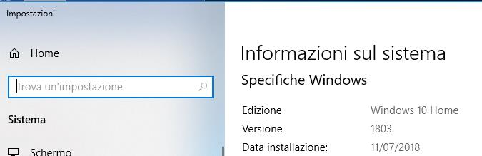

Clicca sul link di download della versione VCP (Virtual COM Port) indicata:

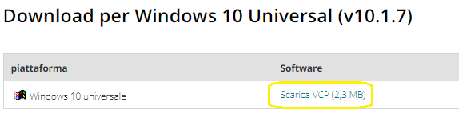

Nella cartella Download, fai clic destro sul file `.zip` → **Estrai tutto**:

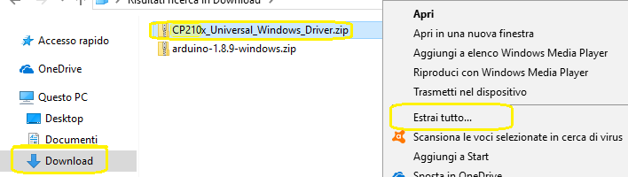

Conferma la destinazione e clicca **Estrai**:

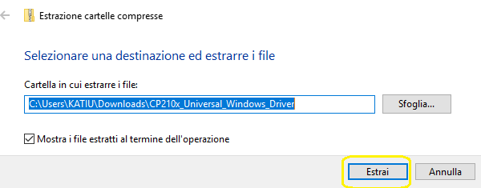

Nella cartella estratta, esegui il programma di installazione per la tua piattaforma (es. 64 bit):

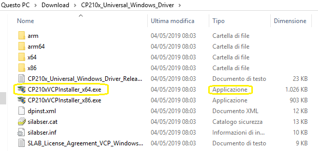

Clicca **Avanti** per procedere con l'installazione guidata:

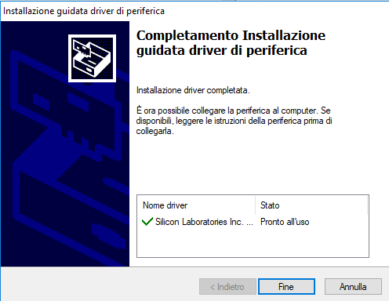

Clicca **Fine** per completare l'installazione del driver:

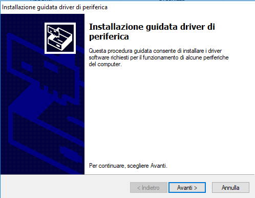

> ℹ️ **Nota**: Se hai già versioni precedenti del driver USB SiLabs, rimuovile prima per evitare conflitti. Dopo l'installazione, scollega e ricollega il dispositivo.

### Installa M5Burner e il firmware

1. Scarica **M5Burner** (versione **Win x64**) da [`https://docs.m5stack.com/en/uiflow/m5burner`](https://docs.m5stack.com/en/uiflow/m5burner).
2. Estrai lo zip in un percorso **senza spazi** (es. direttamente in `C:\`) e avvia `M5Burner.exe`.
3. Se Windows Defender blocca l'esecuzione, clicca **Ulteriori informazioni**:

Poi clicca **Esegui comunque**:

4. In M5Burner, nell'elenco **Device Type** a sinistra seleziona **CORE** (per Basic/Core/Gray) oppure **CORE2 & TOUGH** (per Core2/Tough).
5. Digita `Nightscout` nella barra di ricerca e premi Invio: sul risultato **NightscoutMon** clicca **Download**.
6. Clicca **Burn**: al messaggio sul firmware non ufficiale rispondi **Continue**, seleziona la porta **COM** annotata prima, imposta il baud rate a `921600` e clicca **Start**.
7. Al termine comparirà **"Burn successfully, click here to return"**.

**Se la scrittura fallisce:** riprova con baud rate `115200`, cambia cavo o porta USB, e chiudi eventuali programmi che usano la porta COM.

> ℹ️ **Nota per Mac**: M5Burner esiste anche per macOS (stessa pagina di download). A differenza di Windows, il firmware si scarica dalla sezione **USER CUSTOM** (in basso a sinistra) → **Share Burn**, inserendo il codice `0nPW6eAzC7GcnfWN` per Basic/Core oppure `1HgGY5jdSokZb7JK` per Core2. La procedura completa è descritta nella [pagina Mac del wiki](https://github.com/psonnera/M5_NightscoutMon/wiki/Mac).

---

## 4. Collega al Wi-Fi

Se non hai già configurato il Wi-Fi durante la programmazione da Android, alla prima accensione l'M5Stack entra in modalità **SoftAP**: crea una propria rete Wi-Fi temporanea e mostra sullo schermo i dati per collegarsi:

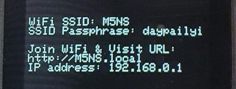

1. Dal tuo smartphone (qualsiasi), scansiona il codice QR oppure connettiti manualmente alla rete Wi-Fi mostrata, usando la password sullo schermo (il telefono avviserà che la rete non ha internet: scegli di restare connesso):

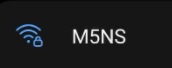

2. Apri un browser e vai all'indirizzo mostrato sullo schermo: [`http://192.168.0.1`](http://192.168.0.1) (attenzione: **http**, non https). Il server del dispositivo è lento: abbi pazienza tra un clic e l'altro.
3. Nella pagina di configurazione, scorri fino a **WiFi configuration**:

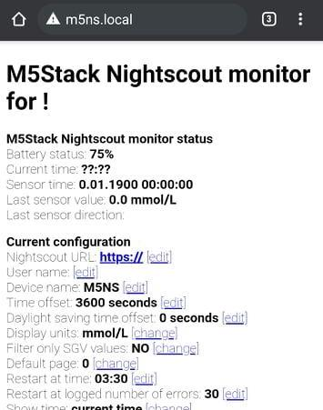

Clicca **edit** accanto alla voce `[wlan1]`:

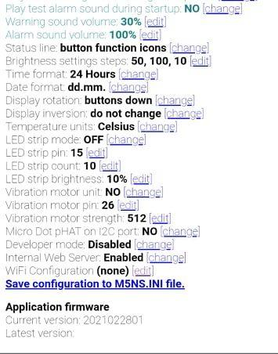

4. Seleziona la prima voce `[wlan1]`, poi la tua rete Wi-Fi di casa dal menu a tendina:

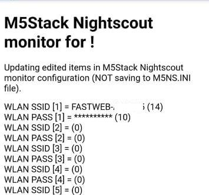

Inserisci la password nel campo apposito e clicca **OK**:

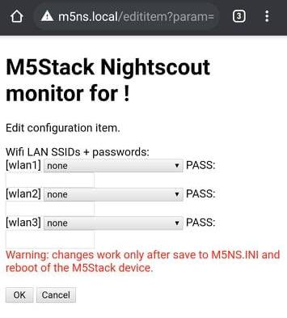

5. Torna al menu principale e clicca **Save configuration to M5NS.ini file**: il dispositivo si riavvierà e si connetterà alla tua rete Wi-Fi. Vedrai prima la conferma del salvataggio:

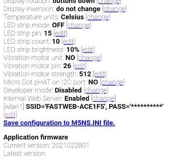

Poi la schermata di avvio della connessione Wi-Fi:

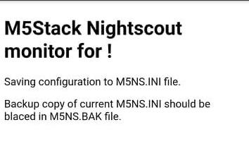

E infine il messaggio che conferma l'avvio della procedura di connessione:

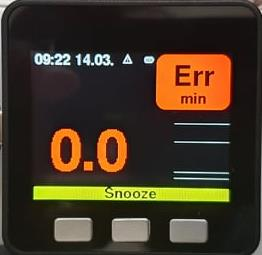

**Per rientrare in modalità SoftAP** in qualsiasi momento:
- **Basic/Core**: tieni premuto il **tasto sinistro**, premi il tasto rosso di reset sul lato e continua a tenere premuto il tasto sinistro finché non compare la schermata con il QR del Wi-Fi.
- **Core2**: premi il tasto di reset in basso a sinistra e tocca **CONFIG** sullo schermo durante il riavvio.

Ecco un esempio di schermata con errore di connessione registrato nel log:

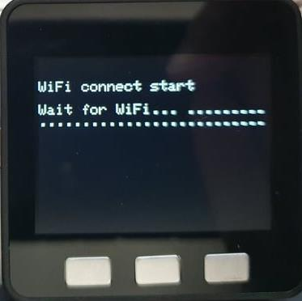

---

## 5. Configura M5Stack

Da un computer o telefono sulla stessa rete Wi-Fi, vai su `http://m5ns-xxxx.local` — il nome esatto (le 4 cifre `xxxx` sono uniche per il tuo dispositivo) è mostrato nella pagina con il **codice QR di configurazione**: premi il **tasto destro** dell'M5Stack finché non compare, poi scansiona il QR o usa l'indirizzo IP indicato:

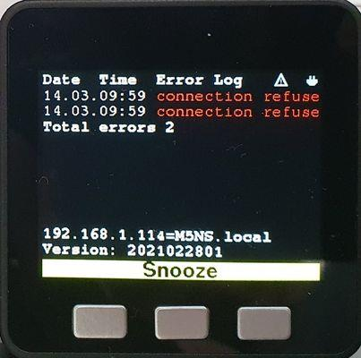

Se tutto è corretto, si aprirà la pagina di configurazione con lo stato del dispositivo e le impostazioni correnti:

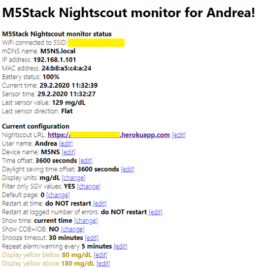

Clicca **edit** accanto ai valori che vuoi modificare. Le modifiche sono subito attive in memoria, ma per conservarle devi cliccare **Save configuration to M5NS.INI** in alto; le impostazioni che richiedono un riavvio (sorgente dati, nome dispositivo, reti Wi-Fi, fuso orario) mostrano un avviso rosso e il dispositivo si riavvia da solo al salvataggio.

### Sorgente dati (una sola attiva)

| Sorgente | Impostazioni |
|---|---|
| **Nightscout** | **Nightscout URL** (es. `miosito.dominio.com`) e **Security token** (vuoto se il sito non è protetto) |
| **Dexcom Share** | **Dexcom account**: l'account che **condivide** (non quello follower) e il server (**US**, **Outside US** o **Japan**) |
| **LLink** | L'account **follower** (non l'account principale LView); lascia la regione su **Auto (detect)** |

> ⚠️ **Attenzione**: le credenziali Dexcom e LLink vengono salvate in chiaro nella memoria del dispositivo (o sulla micro SD).

### Altre impostazioni principali

| Parametro | Descrizione |
|---|---|
| Display units | `mg/dL` o `mmol/L` (vale anche per soglie e allarmi) |
| Default page | Quadrante all'avvio (i tasti permettono di cambiare pagina) |
| Status line | Riga di stato: info sensore, icone tasti, oppure info loop/basale |
| Display yellow below/above | Soglie per il giallo (avvertimento) |
| Display red below/above | Soglie per il rosso (fuori range) |
| Warning/Alarm sound below/above | Soglie delle suonerie di avvertimento e allarme |
| Warning sound when no reading for | Minuti senza lettura prima dell'avvertimento |
| Snooze timeout / Repeat alarm every | Silenziamento e ripetizione degli allarmi |
| Warning/Alarm sound volume | Volumi separati per avvertimento e allarme (0 = silenzioso) |
| Device name | Il nome per l'indirizzo `.local` |
| Time offset / DST offset | Fuso orario e ora legale in secondi (riavvio necessario) |
| Restart at time | Riavvio automatico giornaliero (es. `03:30`; `NORES` per disabilitare) |
| Restart after N errors | Riavvio automatico dopo N errori (0 = mai) |

La pagina permette anche di gestire più reti Wi-Fi memorizzate, gli accessori opzionali (striscia LED, motorino di vibrazione) e il **server web interno** (se lo disabiliti, la pagina non sarà più raggiungibile fino al prossimo riavvio in modalità configurazione).

Una volta sistemate le impostazioni, clicca **Save configuration to M5NS.INI**:

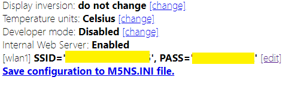

> ℹ️ **Nota**: per riportare il dispositivo alle impostazioni di fabbrica, vai su `http://m5ns-xxxx.local/clearconfigflash` e poi rifai la configurazione dalla modalità SoftAP.

> ℹ️ **Nota sulla micro SD**: al riavvio, se c'è una micro SD inserita il dispositivo usa e salva il file `M5NS.ini` sulla SD; senza SD usa la memoria interna. Utile per passare tra più configurazioni.

---

## 6. Aggiorna il firmware M5Stack

Nella pagina di configurazione web, scorri fino a **Application firmware**. Clicca **Check for update**: se è disponibile una versione più recente, clicca il link di aggiornamento:

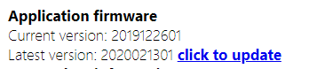

Il dispositivo scaricherà e installerà il nuovo firmware automaticamente (meno di 5 minuti); la pagina web mostra l'avanzamento:

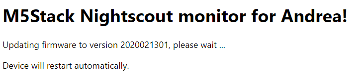

E anche il display dell'M5Stack mostra l'avanzamento dell'aggiornamento:

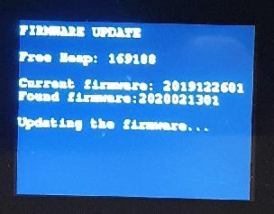

> ℹ️ **Nota**: puoi aggiornare anche direttamente dal dispositivo: premi il tasto destro fino alla pagina di configurazione; se c'è un aggiornamento disponibile, sopra il tasto centrale compare **UPDATE**: premilo.

---

## 7. Usa i tasti dell'M5Stack

| Azione | Tasto |
|---|---|
| Quadrante successivo | Tasto sinistro |
| Snooze allarme | Tasto centrale |
| Cambia luminosità / pagina configurazione | Tasto destro |

Con il tasto sinistro puoi scorrere tra i diversi quadranti disponibili. Ecco un esempio di quadrante numerico, con nome utente, orario, valore e freccia di tendenza:

Ed ecco un esempio di quadrante circolare, con lancetta di tendenza e temperatura:

---

## 8. In caso di difficoltà

- Se la programmazione fallisce, prova un altro cavo USB o un'altra porta; con M5Burner riprova a baud rate `115200`.
- Se lo schermo resta nero, ripeti semplicemente la programmazione: è molto difficile danneggiare un ESP32.
- Se non ricordi il nome `.local` del dispositivo, premi il tasto destro fino alla pagina con il codice QR di configurazione: mostra nome esatto e indirizzo IP.
- Il registro degli errori è visibile in uno dei quadranti (tasto sinistro per scorrerli) e nella pagina web di configurazione.
