# Monitor Nightscout Clock (Ulanzi TC001)

Questa guida spiega come configurare il dispositivo **Ulanzi TC001** come display della glicemia tramite Nightscout.

Il progetto si chiama **Nightscout Clock**, sviluppato da Artiom Kenibasov. Documentazione ufficiale: `https://github.com/ktomy/nightscout-clock`

> ℹ️ Funziona **solo con Nightscout** — non è compatibile con Dexcom Share diretto o altri servizi.

**Requisiti:** computer con Windows e porta USB disponibile.

> ⚠️ L'utilizzo è a esclusiva responsabilità personale.

---

## 1. Materiale occorrente

Serve un orologio **Ulanzi TC001**. Lo trovi su AliExpress o sul sito del produttore: `https://www.ulanzi.com`

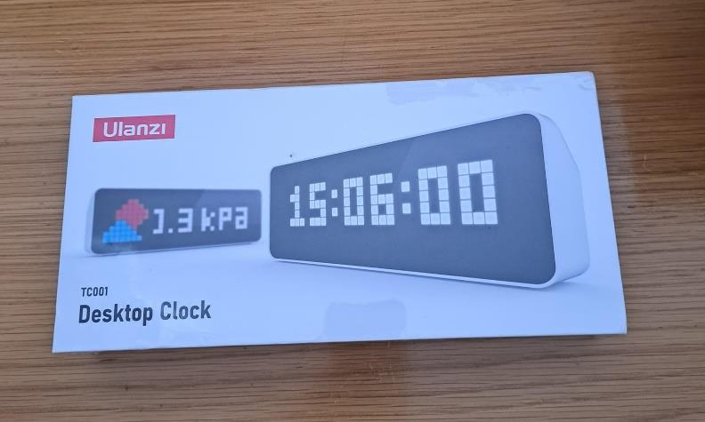

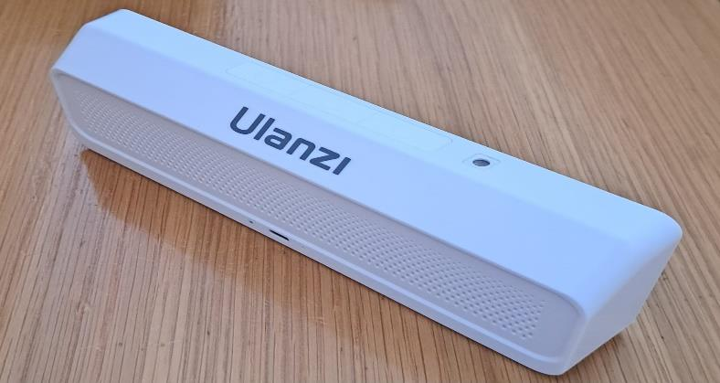

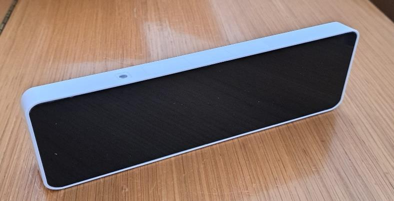

---

## 2. Installa il firmware

1. Collega il TC001 al computer con il cavo USB in dotazione.
2. Dal browser, vai sul sito del progetto GitHub: **ktomy/nightscout-clock** e clicca su **installing** (oppure naviga direttamente alla pagina di installazione del progetto).

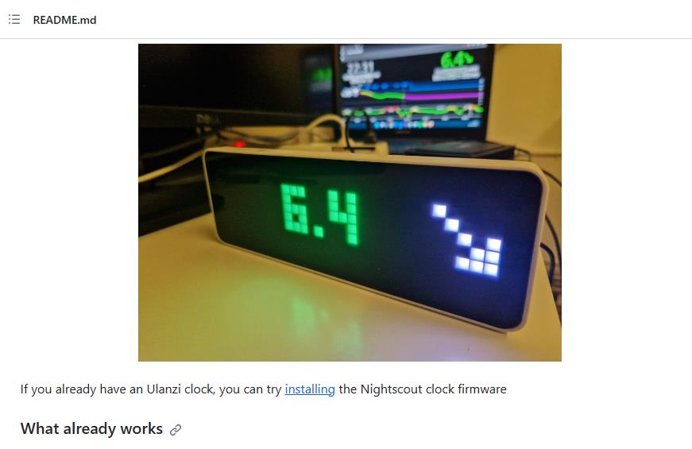

3. Clicca **CONNECT** nella pagina che si apre.

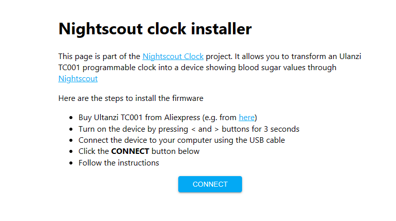

4. Se compare l'errore **"No port selected"**, clicca **TRY AGAIN** e verifica che il cavo sia ben inserito.

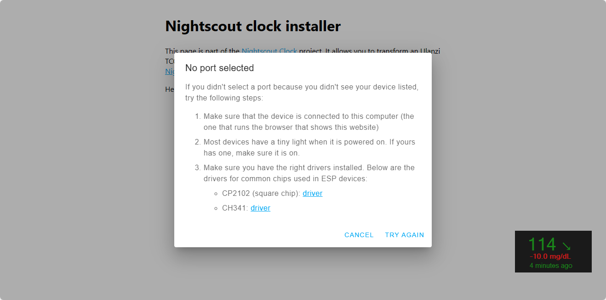

5. Nella finestra del browser, seleziona la porta USB del TC001 → clicca **Connetti**.

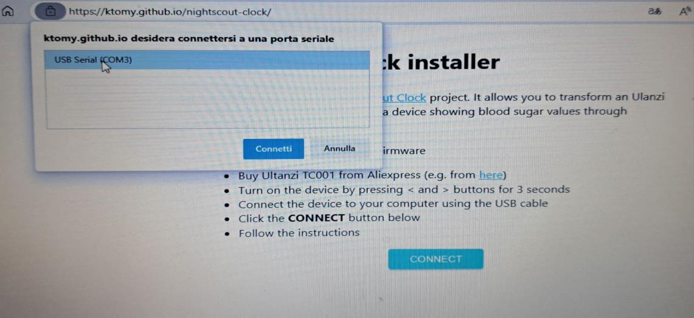

6. Se compare un secondo errore, clicca **OK** e poi **Connetti** di nuovo (se hai più porte USB prova a cambiare porta).

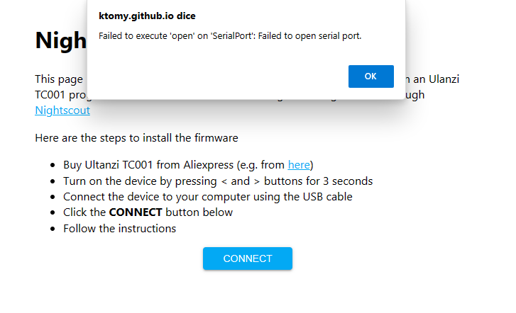

7. Quando il collegamento riesce, clicca **INSTALL NIGHTSCOUT CLOCK** e aspetta il completamento (pochi minuti).

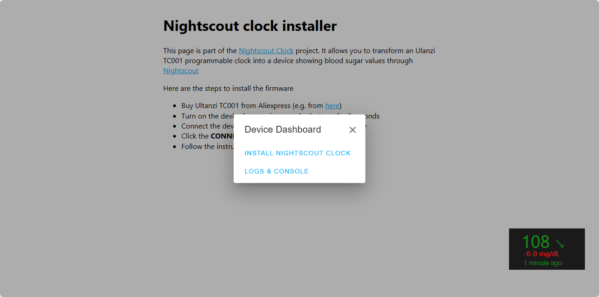

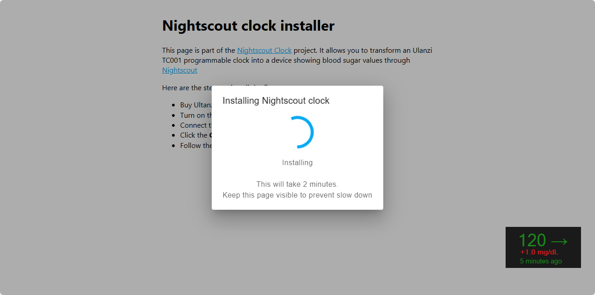

8. Clicca **NEXT**.

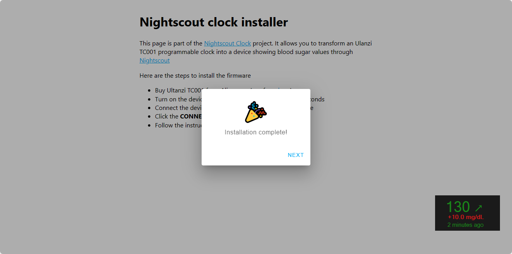

---

## 3. Collega il dispositivo al Wi-Fi

1. Il TC001 mostrerà una rete Wi-Fi chiamata `nsclock`. Collegati a questa rete dal telefono o dal computer, usando la password mostrata sullo schermo del dispositivo.

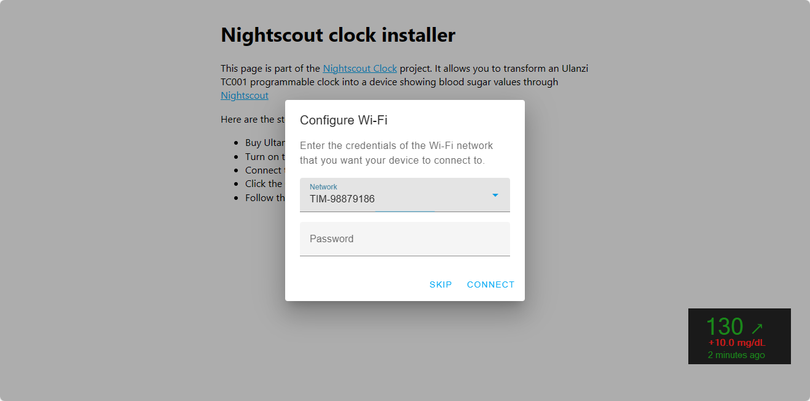

2. Apri un browser e vai all'indirizzo mostrato sullo schermo (di solito `http://192.168.1.X` dove `X` è indicato sul display).
3. Inserisci la password della tua rete Wi-Fi di casa e conferma.

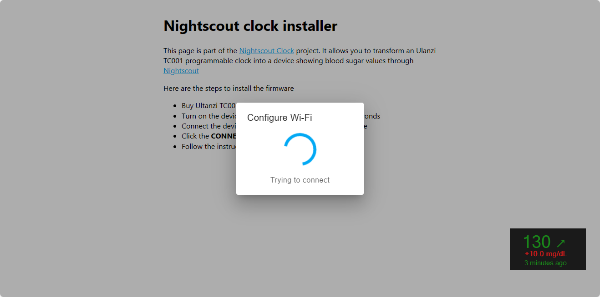

4. Il dispositivo si ricollegherà automaticamente alla tua rete Wi-Fi.

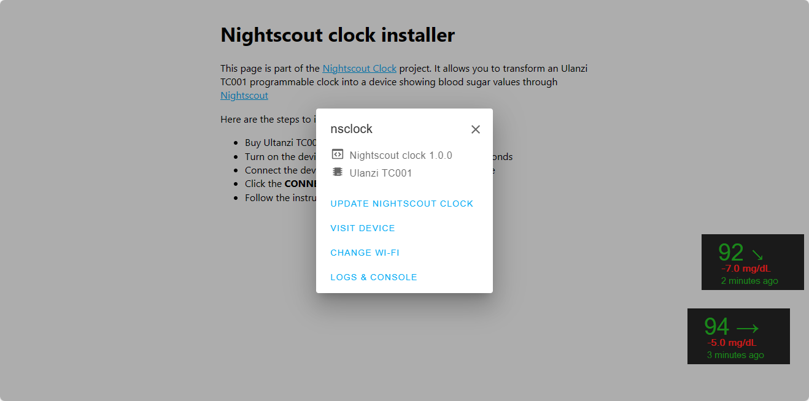

---

## 4. Configura il sito Nightscout

Dopo la connessione Wi-Fi, si aprirà la pagina di configurazione del dispositivo (oppure vai all'indirizzo IP mostrato sullo schermo del TC001, oppure naviga a `http://nsclock.local` se sei sulla stessa rete Wi-Fi).

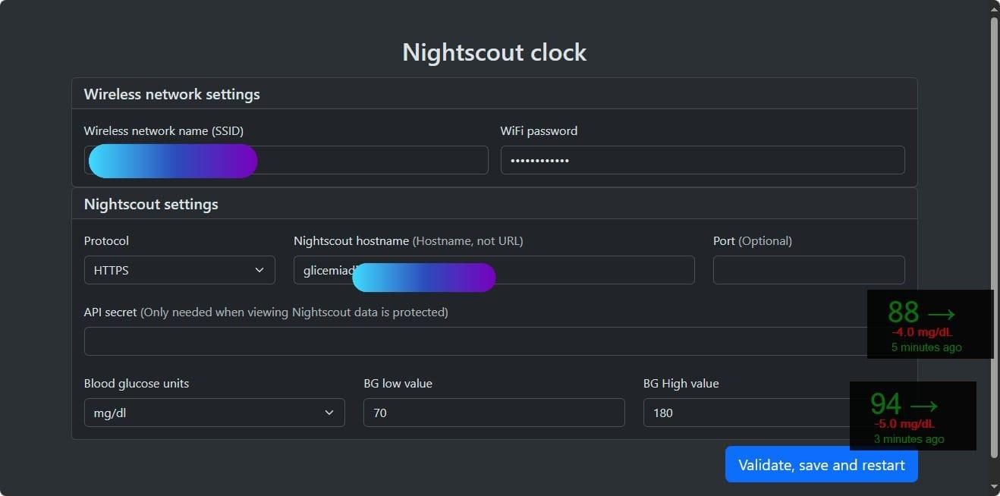

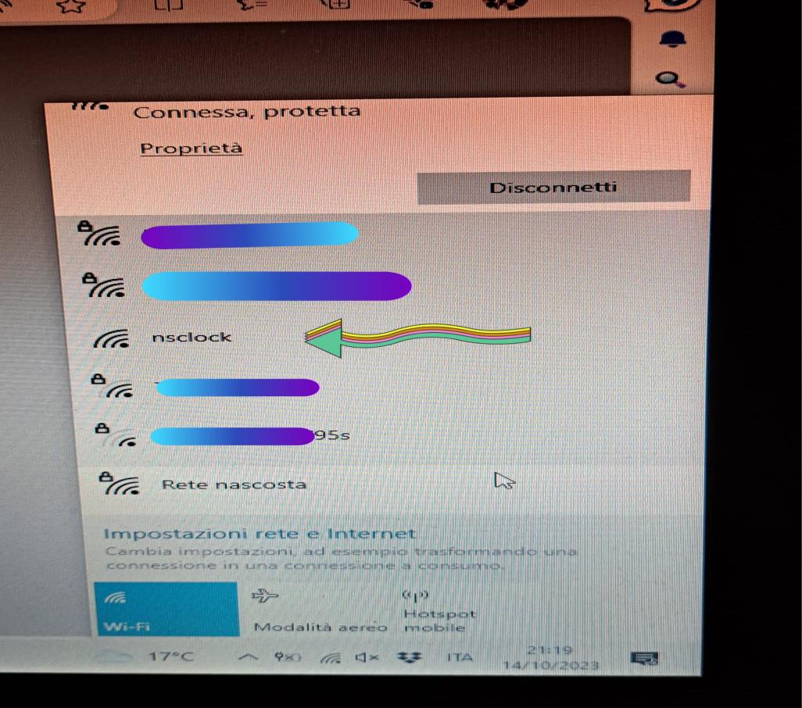

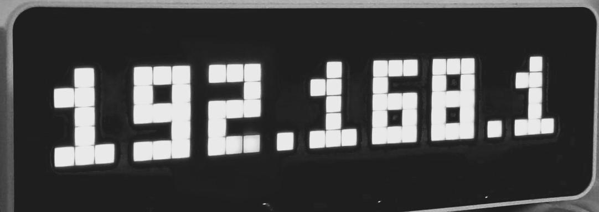

Compila i campi richiesti:
- **URL Nightscout** (il tuo indirizzo, es. `https://tuonightscout.azurewebsites.net`)
- **Valori TIR** (target range)
- **Unità di misura** (mg/dL)

Clicca **Validate, save and restart**: il dispositivo si riavvierà e la glicemia comparirà sul display.

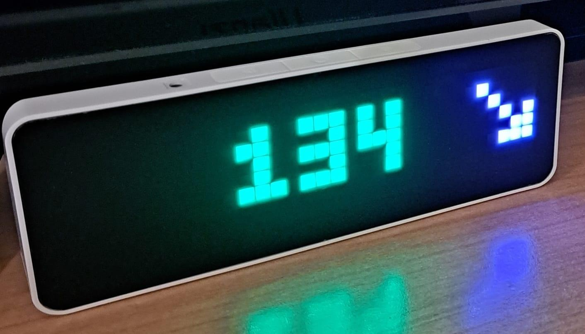

---

## 5. In caso di difficoltà

- Il quarto quadrante mostra gli ultimi 10 errori.
- Se il dispositivo non riesce a collegarsi, tieni premuto il tasto sinistro e premi contemporaneamente il tasto rosso sul lato per riavviare. Tieni premuto il tasto sinistro finché il dispositivo si ferma sulla schermata iniziale, poi ricomincia dalla configurazione Wi-Fi.
- Per la diagnostica avanzata: lascia il cavo USB collegato dopo l'installazione per vedere i messaggi di debug tramite una console seriale.

> ℹ️ Al momento non ci sono quadranti aggiuntivi e non è possibile impostare allarmi o regolare la luminosità direttamente dal dispositivo. Lo sviluppatore sta lavorando a nuove funzionalità.
