# Monitor Nightscout Clock (Ulanzi TC001)

Questa guida spiega come configurare il dispositivo **Ulanzi TC001** come display della glicemia tramite Nightscout.

Il progetto si chiama **Nightscout Clock**, sviluppato da Artiom Kenibasov. Documentazione ufficiale: [`https://github.com/ktomy/nightscout-clock`](https://github.com/ktomy/nightscout-clock)

> ℹ️ **Nota**: oltre a Nightscout, le versioni attuali del firmware supportano molte altre sorgenti dati: **Dexcom Share**, **LLink** (follower), **Medtrum EasyFollow**, **Juggluco**, **Gluroo** e il **web service di xDrip** sulla rete locale.

**Requisiti:** computer con porta USB e un browser Chrome o Edge (Windows, Mac o Linux).

> ⚠️ **Attenzione**: L'utilizzo è a esclusiva responsabilità personale.

---

## 1. Materiale occorrente

Serve un orologio **Ulanzi TC001**. Lo trovi su AliExpress o sul sito del produttore: [`https://www.ulanzi.com`](https://www.ulanzi.com)

La confezione originale, con il modello TC001 "Desktop Clock":

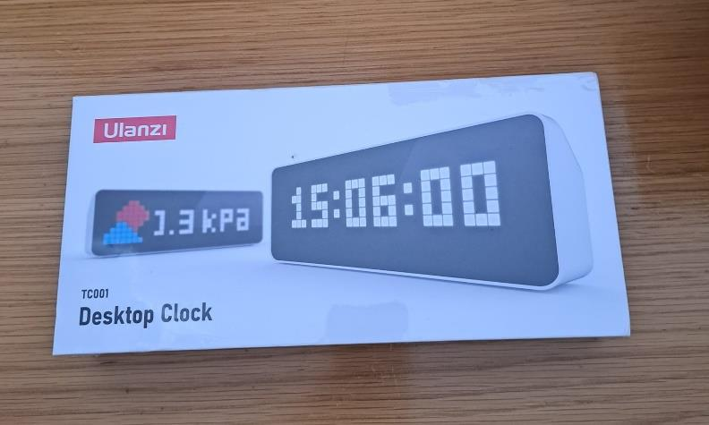

Il dispositivo visto dall'alto, con il logo Ulanzi e i tasti di controllo:

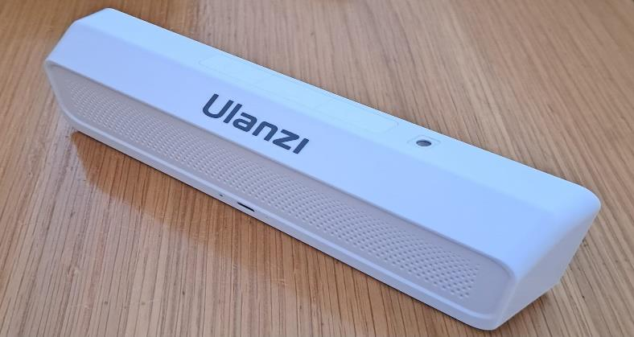

E il display frontale, dove verrà mostrata la glicemia:

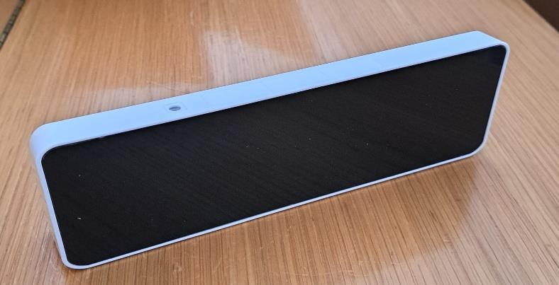

---

## 2. Installa il firmware

1. Collega il TC001 al computer con il cavo USB in dotazione.
2. Dal browser, vai sulla pagina di installazione [`https://ktomy.github.io/nightscout-clock/`](https://ktomy.github.io/nightscout-clock/) (la trovi anche dalla pagina GitHub del progetto, link **installing**):

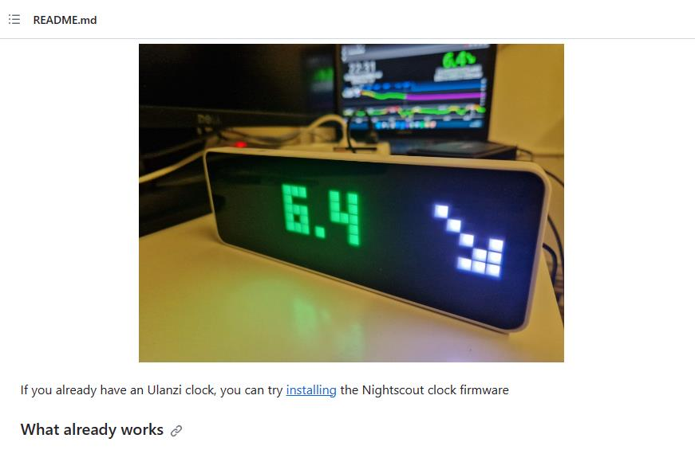

3. Nella pagina che si apre, clicca **CONNECT**:

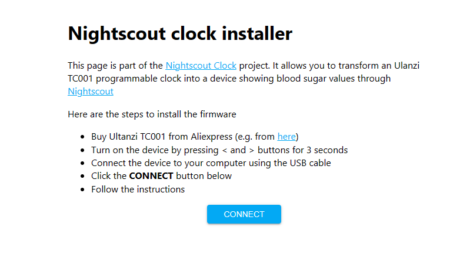

4. Se compare l'errore **"No port selected"**, clicca **TRY AGAIN** e verifica che il cavo sia ben inserito:

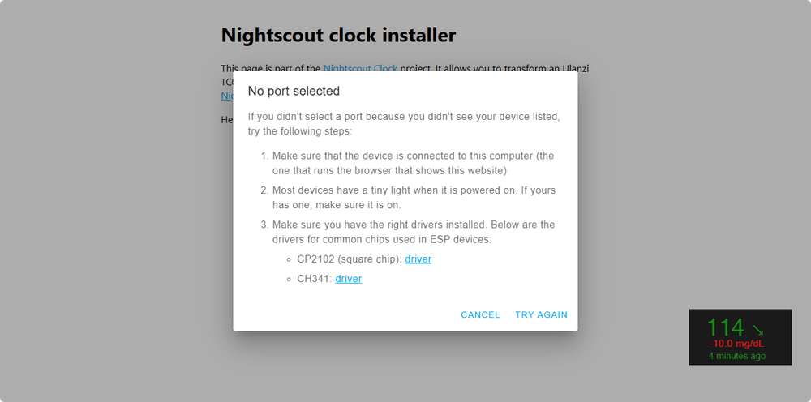

5. Nella finestra del browser, seleziona la porta USB del TC001 (es. `COM3`) → clicca **Connetti**:

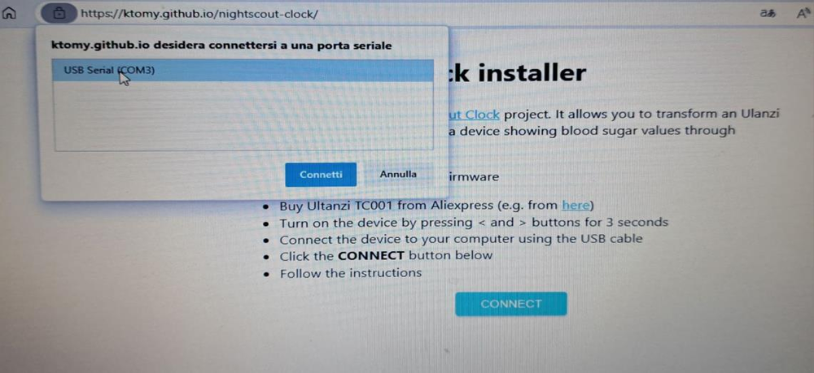

6. Se compare un secondo errore ("Failed to open serial port"), clicca **OK** e poi **Connetti** di nuovo (se hai più porte USB prova a cambiare porta):

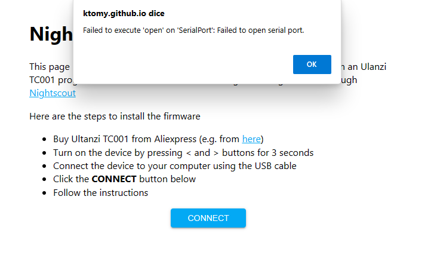

7. Quando il collegamento riesce, si apre il pannello del dispositivo: clicca **INSTALL NIGHTSCOUT CLOCK**:

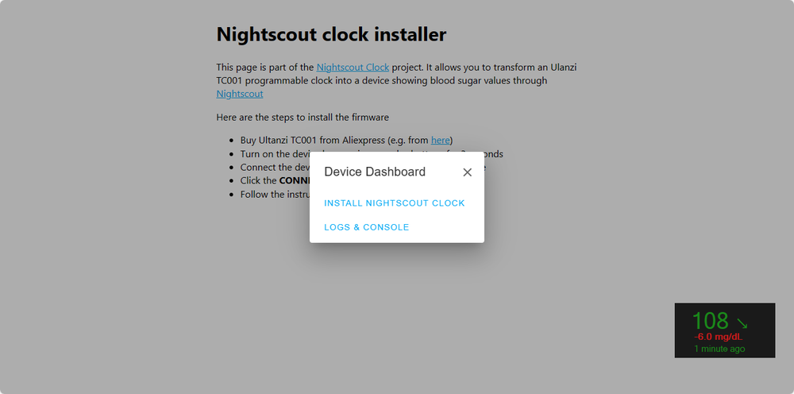

L'installazione richiede circa 2 minuti: mantieni la pagina visibile per non rallentare il processo:

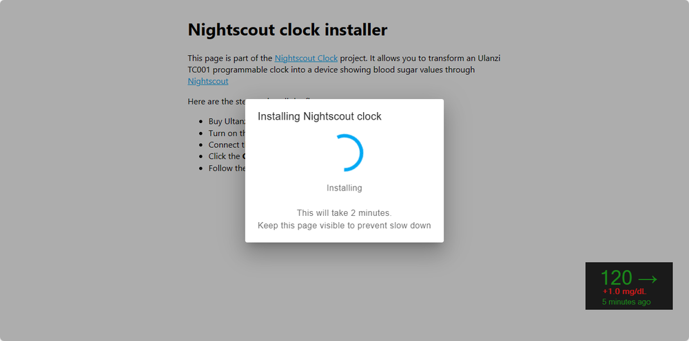

8. Al termine, clicca **NEXT**:

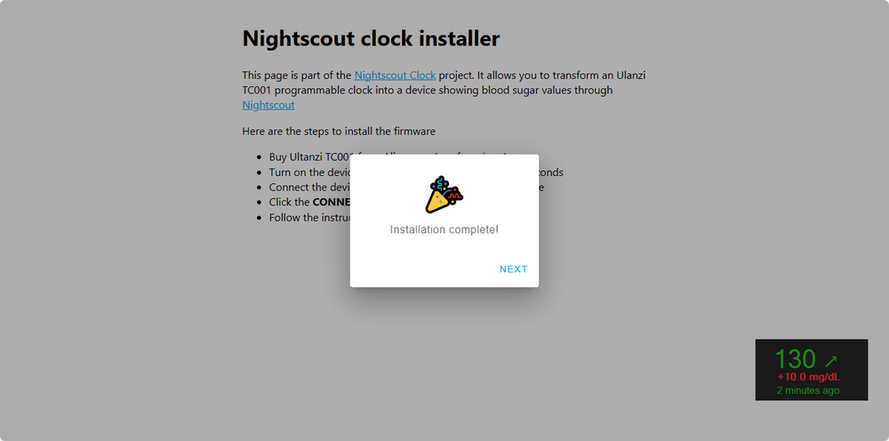

---

## 3. Configura il Wi-Fi dal browser

Dopo aver cliccato **NEXT**, il browser avvia automaticamente la configurazione Wi-Fi tramite lo stesso cavo USB — non serve collegarsi a una rete separata.

1. Il browser cerca le reti Wi-Fi disponibili nella zona:

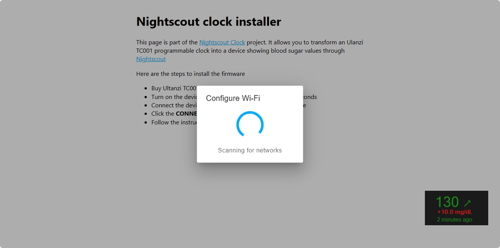

2. Seleziona la tua rete Wi-Fi di casa dal menu a tendina, inserisci la password e clicca **CONNECT**:

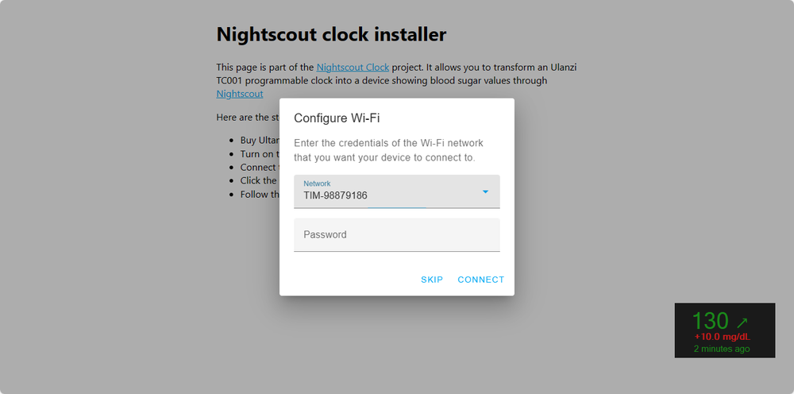

3. Il dispositivo tenta la connessione alla rete:

4. Una volta connesso, comparirà il pannello di controllo del dispositivo **nsclock**, con i link per aggiornare il firmware, aprire la pagina di configurazione o cambiare rete Wi-Fi:

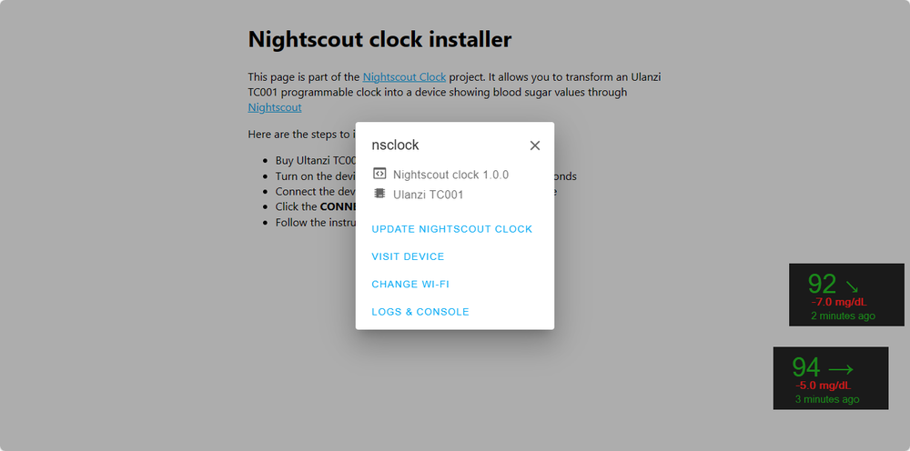

**Metodo alternativo**, se la configurazione Wi-Fi dal browser non funziona: il TC001 può mostrare una propria rete Wi-Fi temporanea chiamata `nsclock`. Collegati a questa rete dal telefono o dal computer:

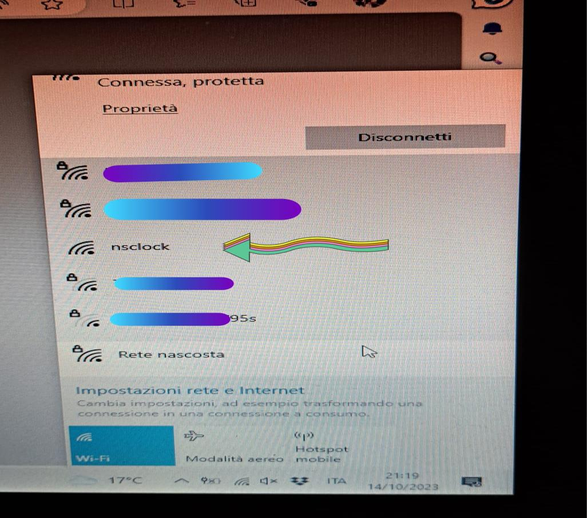

Poi apri un browser all'indirizzo IP mostrato sullo schermo del dispositivo:

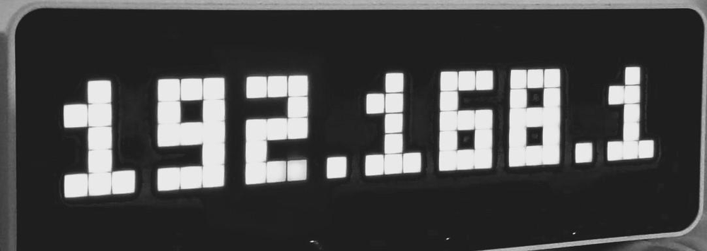

---

## 4. Configura il sito Nightscout

Dal pannello **nsclock**, clicca **VISIT DEVICE** (oppure vai all'indirizzo IP o a [`http://nsclock.local`](http://nsclock.local) se sei sulla stessa rete Wi-Fi) per aprire la pagina di configurazione:

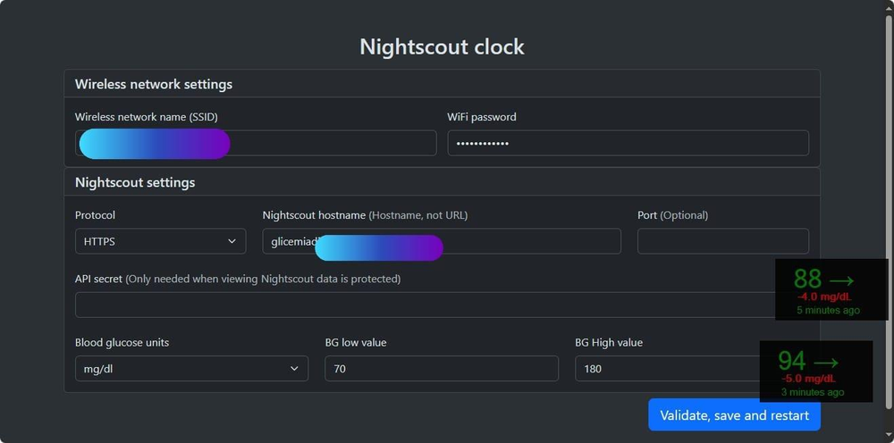

Compila i campi richiesti:
- **Sorgente dati** (Nightscout con URL ed eventuale token, oppure Dexcom Share, LLink, Juggluco, Gluroo, ecc.)
- **Valori TIR** (target range)
- **Unità di misura** (mg/dL o mmol/L)

Clicca **Validate, save and restart**: il dispositivo si riavvierà e la glicemia comparirà sul display:

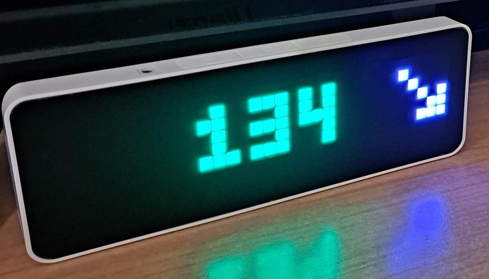

---

## 5. In caso di difficoltà

- Se il dispositivo non riesce a collegarsi, tieni premuto il tasto sinistro e premi contemporaneamente il tasto rosso sul lato per riavviare. Tieni premuto il tasto sinistro finché il dispositivo non si ferma sulla schermata iniziale, poi ricomincia dalla configurazione Wi-Fi.
- Per la diagnostica avanzata: lascia il cavo USB collegato dopo l'installazione per vedere i messaggi di debug tramite **LOGS & CONSOLE** nel pannello del dispositivo.

> ℹ️ **Nota**: le versioni attuali del firmware offrono **6 quadranti** diversi (valore semplice, cifre grandi, grafico 3 ore, grafico + valore, delta, ora + valore), **allarmi sonori** con soglie, snooze e melodie personalizzabili, **luminosità automatica** con modalità per stanze buie, avviso di dati vecchi e aggiornamento del firmware dalla stessa pagina di configurazione.
