# Creare un sito Nightscout gratuito su Google Cloud

Questa guida spiega come creare un sito Nightscout gratuito usando **Google Cloud** e uno script di installazione automatica creato dalla squadra di xDrip (Jon/@jamorham, Tzachi Dar e Navid Fo).

Documentazione ufficiale (in italiano): [`https://navid200.github.io/xDrip/docs/Nightscout/GoogleCloud.html`](https://navid200.github.io/xDrip/docs/Nightscout/GoogleCloud.html)

> ℹ️ **Nota**: Gratuito\*: richiede una carta di credito per creare l'account Google Cloud. Il servizio rimane gratuito entro i limiti previsti; possono capitare addebiti minimi (1–2 centesimi) causati da traffico automatico sul sito.

---

## 1. Crea un account Google Cloud

Usa un computer (non uno smartphone). Non cambiare browser o utente durante la procedura.

- Se hai un telefono Android hai già un account Google: puoi accedere direttamente.
- Se usi iPhone, crea un account gratuito su: [`https://accounts.google.com/signup/v2/createaccount?biz=false&cc=IT`](https://accounts.google.com/signup/v2/createaccount?biz=false&cc=IT)

Accedi con il tuo account Google:


1. Vai su [`https://cloud.google.com/free?hl=it`](https://cloud.google.com/free?hl=it) e clicca **Inizia Gratuitamente**.


2. Compila le informazioni richieste (Italia, Altro), accetta i termini di servizio (non le email di marketing) e clicca **CONTINUA**.


3. Seleziona un conto privato. Il codice fiscale non è obbligatorio.


4. Inserisci il tuo indirizzo.


5. Aggiungi una carta di credito: Google potrebbe addebitare €0 o fare una prenotazione di €1 per verificare la carta (non è un addebito reale).


Premi **AVVIA LA MIA PROVA GRATUITA**:


Se richiesto, premi **Continua** per verificare la carta in una nuova finestra:


6. Aspetta 5 minuti che Google Cloud prepari il tuo account: comparirà il messaggio **Impostazione della prova gratuita in corso**.


Se la pagina non si aggiorna, fai refresh:


Potresti dover completare la verifica del pagamento: clicca **Verifica ora**...


...trova l'addebito temporaneo tra le transazioni della tua carta e premi **Get code**...


...poi inserisci il codice a 6 cifre trovato e premi **Verify**:


La carta risulterà verificata: premi **Done**:


A verifica completata, vedrai la pagina di benvenuto **Ti diamo il benvenuto**: premi **CREA O SELEZIONA UN PROGETTO**.

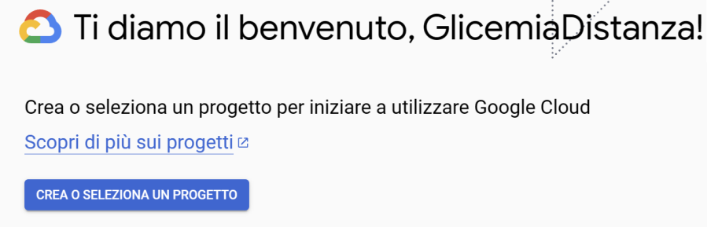

Riceverai un messaggio con il credito di prova disponibile e 4 brevi domande facoltative sul tuo utilizzo di Google Cloud: puoi rispondere **Altro** a tutte.

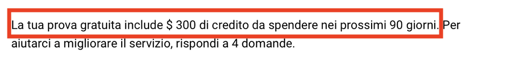

Domanda 1 — Cosa descrive meglio la tua organizzazione:

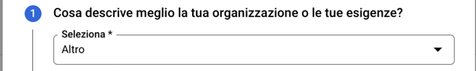

Domanda 2 — Cosa ti ha portato a Google Cloud:

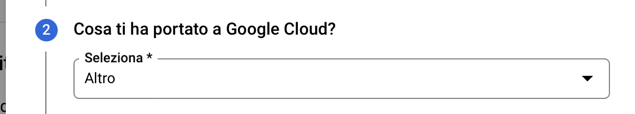

Domanda 3 — Cosa vorresti fare con Google Cloud:

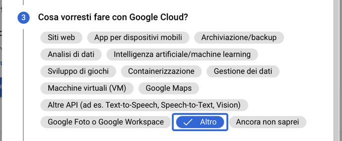

Domanda 4 — Cosa descrive meglio il tuo ruolo:

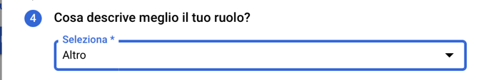

---

## 2. Crea un server virtuale (VPS)

1. Vai su [`https://console.cloud.google.com/welcome/new`](https://console.cloud.google.com/welcome/new) e clicca **CREA O SELEZIONA UN PROGETTO**.

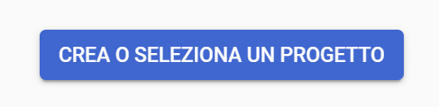

Si apre la finestra **Seleziona un progetto**:

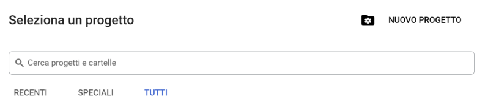

2. Clicca **NUOVO PROGETTO** in alto a destra. Dai un nome al progetto (non importante, qui ad esempio "Nightscout") → **CREA**.

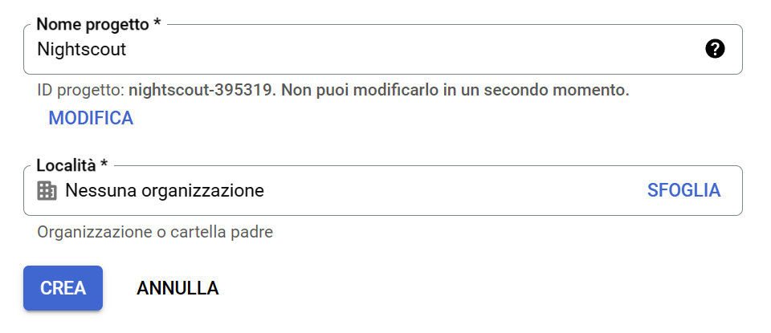

Attendi la conferma di creazione e clicca **SELEZIONA PROGETTO**:

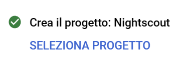

3. Seleziona il progetto appena creato dall'elenco.

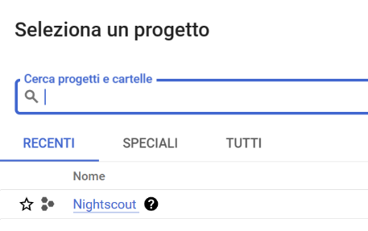

Confermi così di stare lavorando all'interno del progetto corretto (visibile in alto):

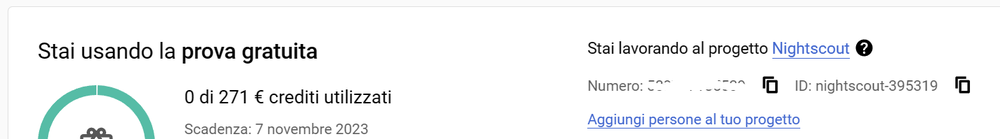

4. Scorri verso il basso e seleziona **Crea una VM**.

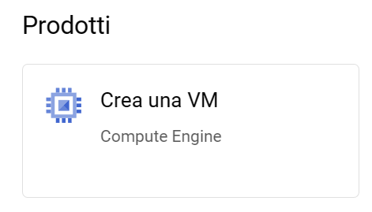

5. Abilita la **Compute Engine API** se richiesto, premendo **ABILITA**. Se Google chiede di verificare la carta, procedi.


Arriverai così alla pagina **Istanze VM**, ancora vuota: da qui premi **CREA ISTANZA** per configurare il server.

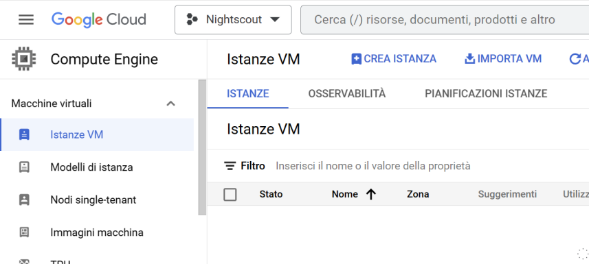

Nella pagina che si apre premi di nuovo **CREA ISTANZA**:

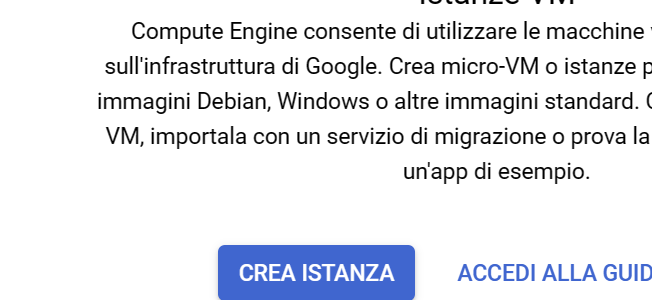

### Configurazione della VM

> ⚠️ **Attenzione**: Segui esattamente le istruzioni qui sotto. Errori nella configurazione potrebbero portare a costi imprevisti.

- **Nome**: non importante (qui ad esempio `nightscout`)

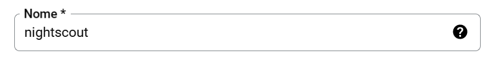

- **Regione**: scegli SOLO una di queste tre (le uniche gratuite):
  - `us-west1`

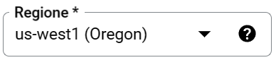

  - `us-central1`

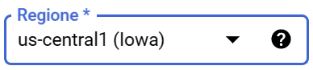

  - `us-east1`

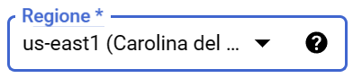

- **Zona**: non modificare
- **Configurazione macchina**: `e2-micro` (è l'unica gratuita)

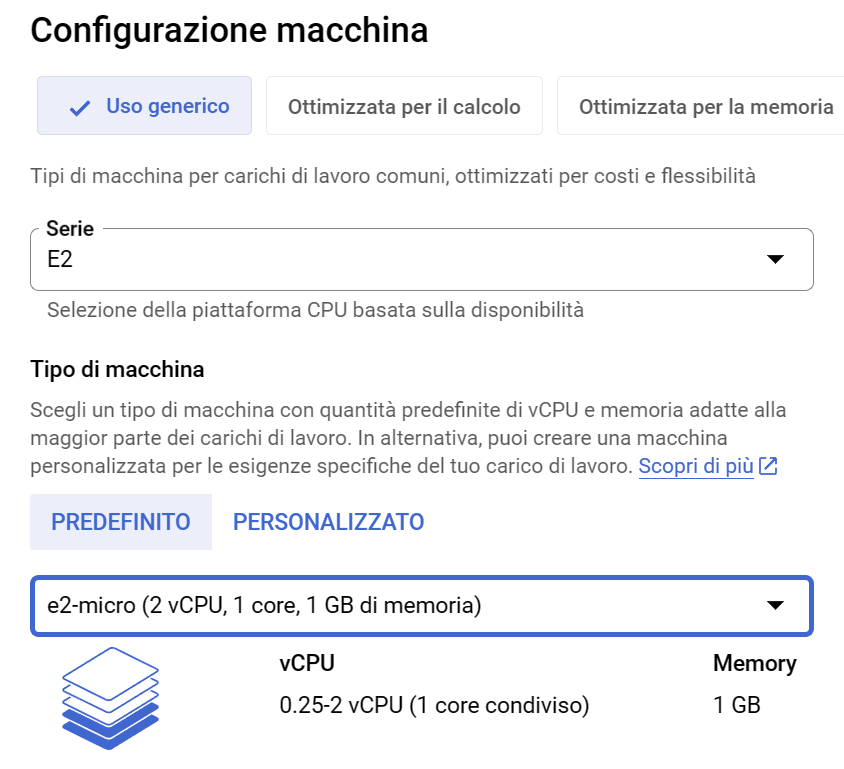

- **Disco di avvio**: clicca **CAMBIA** e seleziona esattamente:
  - Sistema operativo: **Ubuntu**
  - Versione: **20.04 LTS Minimal x86/64** (`amd64 focal minimal image`)

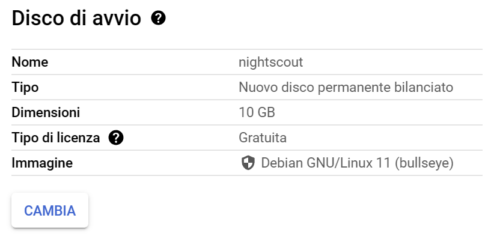

Nella stessa schermata scegli anche il tipo di disco e le dimensioni (i valori di default vanno bene), poi premi **SELEZIONA**:

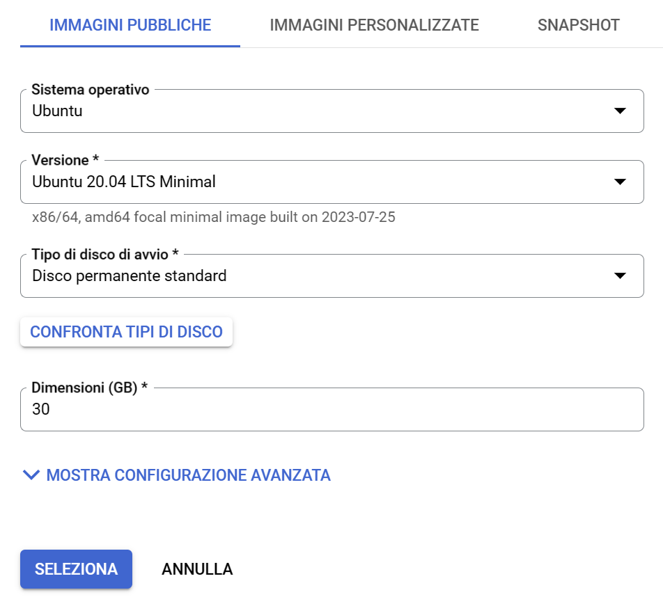

- **Firewall**: abilita sia **HTTP** che **HTTPS**

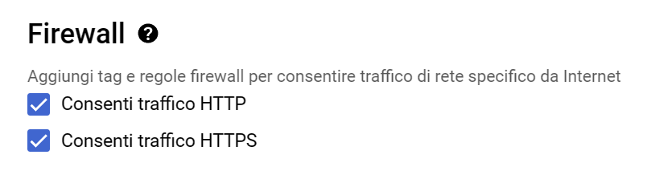

Verifica la stima mensile: non dovrebbe superare i 10$ (se supera, ricontrolla le impostazioni).

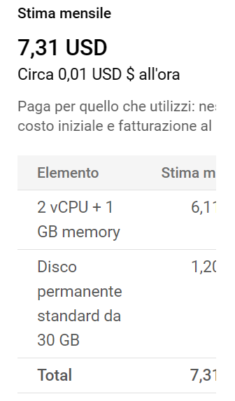

Clicca **CREA** e aspetta qualche minuto:

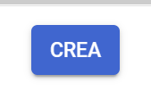

Il tuo server comparirà nell'elenco **Istanze VM** con un pallino verde (attivo) e il suo **IP esterno**:


Ogni volta che vuoi ritrovare questa pagina: [`https://console.cloud.google.com/compute/instances`](https://console.cloud.google.com/compute/instances)

---

## 3. Crea un nome per il tuo server

Google assegna solo un indirizzo IP numerico al tuo server. Per avere un indirizzo più facile da ricordare, usa il servizio gratuito FreeDNS.

1. Annota l'**indirizzo IP esterno** del tuo server dalla pagina delle istanze (es. `34.83.196.6`), visibile nella colonna **IP esterno**.

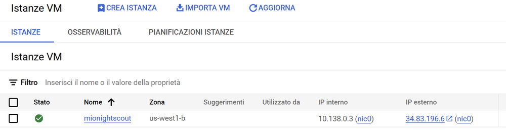

2. Vai su [`https://freedns.afraid.org/`](https://freedns.afraid.org/) → **Sign up Free**.
3. Compila i dati: nome utente, password (non perderla!) e un indirizzo email tuo (non usa e getta). Risolvi il captcha e clicca **Send activation email**.


4. Controlla la mail e clicca il link di conferma (se non arriva, controlla la cartella spam).


5. Accedi e clicca **Subdomains** nel menu **For Members**, poi **Add a subdomain**.


6. In **Subdomain**, scrivi il nome che vuoi dare al tuo sito Nightscout (scegli qualcosa che non sia già preso).
7. In **Domain**, scegli un dominio dalla lista (es. `mooo.com`).
8. In **Destination**, inserisci l'indirizzo IP esterno del tuo server Google Cloud.
9. Risolvi il captcha e clicca **Save**.


Il tuo sito Nightscout avrà ora un indirizzo come `mionightscout.mooo.com`.

---

## 4. Installa Nightscout

1. Torna su [`https://console.cloud.google.com/compute/instances`](https://console.cloud.google.com/compute/instances).
2. Clicca **SSH** sulla riga del tuo server per aprire un terminale.


3. Autorizza il collegamento sicuro premendo **Authorize** e aspetta che si apra la finestra del terminale.


La finestra del terminale si apre con il messaggio di benvenuto di Ubuntu:


4. Copia e incolla il comando seguente nel terminale (uno spazio dopo `curl`, uno prima e dopo il simbolo `|`):

   ```bash
   curl https://raw.githubusercontent.com/jamorham/nightscout-vps/vps-1/bootstrap.sh | bash
   ```


5. Premi Invio e aspetta. Lo script scarica e prepara l'ambiente, mostrando un primo avviso di attenzione:

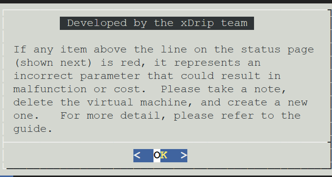

6. Quando lo script si ferma e mostra un menu con lo **Stato** del server, premi Invio per proseguire.
7. Controlla che nella parte superiore non ci siano errori in rosso. Se ce ne sono, cancella e ricrea il server.


8. Con le frecce, vai su **3 – Google Cloud setup** → **1 – Install Nightscout phase 1** → premi Invio per confermare.

Nel menu principale, seleziona **Google Cloud setup**:


Poi seleziona **Install Nightscout phase 1**:


Conferma di voler procedere con l'installazione (dura circa 15 minuti):


> ⚠️ **Attenzione**: La fase 1 dura circa 15 minuti. Non chiudere il terminale e non lasciarlo aperto senza proseguire (scadrà per timeout).

9. Quando la fase 1 termina, torna al menu → **Google Cloud setup** → **2 – Install Nightscout phase 2**.


10. Inserisci la tua **API_SECRET**: è la password della tua pagina Nightscout. Minimo 12 caratteri (lettere maiuscole, minuscole, numeri — no spazi o caratteri speciali).


11. Inserisci il tuo **login e password FreeDNS** (questo mantiene aggiornato il nome DNS). Usa le frecce per spostarti tra i campi.


12. Premi Invio per proseguire: questo passaggio può richiedere fino a 10 minuti.


Durante questa fase è normale vedere un errore temporaneo legato al certificato, mentre il sistema richiede il certificato HTTPS:


13. Premi Invio per riavviare il server. Aspetta 30 secondi, poi riaccedi tramite SSH.


Se provi a riconnetterti troppo presto, il browser mostrerà **Connessione non riuscita**: attendi qualche istante e premi **Riprova**.


14. Dal menu principale, vai in **1 – Status** e controlla che non ci siano elementi in rosso: **Mongo**, **NS proc**, **FreeDNS name and IP** e **Certificate** devono risultare validi.


Se tutto è a posto, torna al menu principale premendo **Return**:


---

## 5. Configura Nightscout

1. Apri un browser e vai all'indirizzo del tuo sito: [`https://tuonome.mooo.com`](https://tuonome.mooo.com)

Per prima cosa verifica che l'indirizzo scelto su FreeDNS punti davvero al tuo server:


Al primo accesso il sito può chiederti di autenticarti con l'API secret (**Device authentication**):


Il sito si aprirà mostrando l'orario e il menu laterale:


2. Clicca sul menu → **Profile Editor**.

Qui puoi controllare e modificare i parametri del tuo profilo (fuso orario, rapporto insulina/carboidrati, ecc.):


3. Imposta il fuso orario: **Europe/Rome**
4. Scorri in fondo, clicca **Authenticate**, inserisci l'API_SECRET...


...e conferma che lo stato mostri **Admin authorized**, poi premi **Save**:


5. Verifica lo stato in alto a destra: dopo il salvataggio comparirà un messaggio **Status: success**.


Se usi Dexcom Share, i dati appariranno entro qualche minuto. Per xDrip, Spike, xDrip4iOS ecc.: inserisci l'indirizzo del sito e l'API secret nell'app. Una volta connesso, il tuo sito mostrerà la glicemia in tempo reale:


**Connettere l'uploader:**

- **xDrip master:** vai in **Impostazioni → Cloud Upload → API Upload (REST)** e inserisci:
  ```
  https://tuaAPISecret@tuonome.mooo.com/api/v1
  ```

Apri il menu principale di xDrip e tocca **Impostazioni**:


Nelle impostazioni, tocca **Cloud Upload**:


Poi tocca **API Upload (REST)**:


Attiva **Abilitato** e incolla l'indirizzo nel campo **URL di base**:


- **xDrip4iOS / Bubble / Juggluco:** nell'URL inserisci solo l'indirizzo del sito senza il percorso `/api/v1`. Su xDrip4iOS, vai in **Settings → Nightscout**, attiva **Enable Nightscout?** e inserisci URL e API_SECRET:


Su Juggluco, vai in **Integration → Nightscout Share Server Upload**, attiva il toggle e inserisci **Url** e **Key**, poi premi **Save**:


In alternativa, nelle impostazioni di Juggluco tocca **Uploader** e inserisci **Nightscout Server URL** e **api_secret**, poi premi **Save**:


- **Dexcom Share come sorgente:** apri il terminale SSH → menu **4 – Nightscout setup** → **1 – Edit variables** → aggiungi le variabili:
  ```bash
  export BRIDGE_USER_NAME='tuo_utente_dexcom'
  export BRIDGE_PASSWORD='tua_password_dexcom'
  export BRIDGE_SERVER='EU'
  ```


  e aggiungi `bridge` nella variabile `ENABLE`. Salva con `Ctrl+O`, poi Invio, poi `Ctrl+X`. Riavvia il server. Ecco un esempio di file `/etc/nsconfig` completo, con le variabili Dexcom Share aggiunte in fondo:


---

## 6. Modificare le variabili (in seguito)

Per modificare o aggiungere variabili di Nightscout:
1. Apri il terminale SSH → menu **4 – Nightscout setup**.


Conferma di voler procedere: si aprirà l'editor di testo del terminale.


2. Scegli **1 – Edit variables using a text editor**. L'editor `nano` si apre. Usa le frecce per navigare (il mouse non funziona).


3. Il formato delle variabili è:
   ```bash
   export NOMEVARIABILE='valore'
   ```
4. Variabili utili:
   - `AR2_CONE_FACTOR='0'` — elimina le previsioni automatiche
   - `AUTH_DEFAULT_ROLES='readable'` — permette la visualizzazione senza login
   - `CUSTOM_TITLE='Superman'` — personalizza il titolo della pagina
   - `SCALE_Y='linear'` — scala verticale lineare
   - `TIME_FORMAT='24'` — orologio in formato 24 ore
   - `LANGUAGE='it'` — interfaccia in italiano
5. Salva con `Ctrl+O` → Invio → `Ctrl+X`. Riavvia il server dal menu principale, voce **7 – Reboot server (Nightscout)**, per applicare le modifiche.


---

## Appendice A — Eliminare il VPS

Se hai cambiato idea o hai sbagliato la configurazione:
- Vai in [`https://console.cloud.google.com/compute/instances`](https://console.cloud.google.com/compute/instances).
- Clicca i tre puntini a destra del tuo server → **Elimina** → conferma.


**Rimuovere la carta di credito:**
- Vai su [`https://console.cloud.google.com/billing`](https://console.cloud.google.com/billing) e apri **I miei account di fatturazione**.


- Seleziona il tuo account di fatturazione → **Panoramica dei pagamenti**.


- Scorri fino alla tua carta, in **Modalità di pagamento**...


...e premi **Rimuovi** accanto alla carta registrata:


