# Creare un sito Nightscout gratuito su Google Cloud

Questa guida spiega come creare un sito Nightscout gratuito usando **Google Cloud** e lo strumento di installazione automatica creato dalla squadra di xDrip (Jon/@jamorham e Tzachi Dar).

Documentazione ufficiale: [`https://google-cloud-nightscout.github.io/`](https://google-cloud-nightscout.github.io/)

> ℹ️ **Nota**: Gratuito\*: richiede una carta di credito per creare l'account Google Cloud. Il servizio rimane gratuito entro i limiti previsti; possono capitare addebiti minimi (1–2 centesimi al mese) causati da traffico automatico sul sito. **Un solo server gratuito per account Google**: per un secondo sito Nightscout serve un secondo account (va bene la stessa carta).

L'installazione completa richiede circa 90 minuti, divisi in sezioni: puoi fermarti alla fine di una sezione e riprendere più tardi.

> ⚠️ **Attenzione**: il server che creerai serve **esclusivamente** per Nightscout: non usarlo per altro. L'utilizzo è a esclusiva responsabilità personale.

---

## 1. Crea un account FreeDNS (il nome del tuo sito)

Il tuo sito avrà un indirizzo del tipo `mionightscout.dominio.com`, fornito dal servizio gratuito **FreeDNS**.

1. Vai su [`https://freedns.afraid.org/`](https://freedns.afraid.org/) → **Sign up Free**.
2. Compila i dati e **annotali con cura**:
   - **User ID**: solo lettere minuscole.
   - **Password**: NON usare questi caratteri: `$` `"` `'` `\` spazio `@` `/`
   - Un indirizzo email tuo (non usa e getta).
3. Risolvi il captcha e clicca **Send activation email**, poi conferma dal link ricevuto via mail (controlla anche lo spam).


4. Accedi e clicca **Subdomains** nel menu **For Members**, poi **Add**.

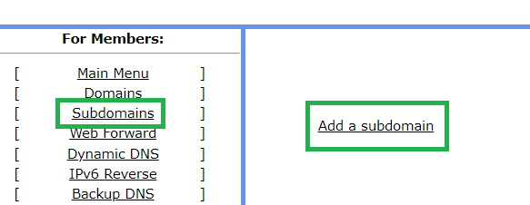

5. In **Subdomain**, scrivi il nome che vuoi dare al tuo sito (minuscole, senza caratteri speciali).
6. In **Domain**, scegli un dominio dalla lista. I primi della lista sono i più stabili, ma alcuni (es. `mooo.com`) sono usati da centinaia di migliaia di siti e possono risultare **bloccati dalle reti di scuole e uffici**: se ti serve l'accesso da lì, scegli un dominio meno diffuso. Puoi creare fino a 5 sottodomini gratuiti.
7. Lascia gli altri campi come proposti, risolvi il captcha e clicca **Save**.

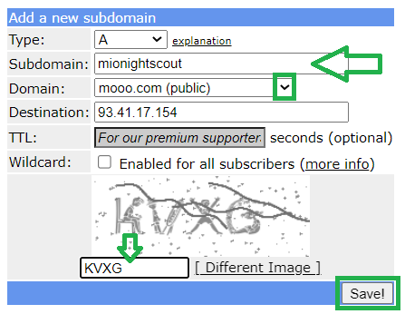

> ⚠️ **Attenzione**: FreeDNS disattiva gli account che non fanno **login almeno una volta ogni 6 mesi** — e con l'account dormiente il tuo Nightscout va offline. Metti un **promemoria ricorrente sul calendario**.

---

## 2. Crea un account Google Cloud

Usa un computer (non uno smartphone). Non cambiare browser o utente durante la procedura.

- Se hai un telefono Android hai già un account Google: puoi accedere direttamente.
- Se usi iPhone, crea un account gratuito su: [`https://accounts.google.com/signup/v2/createaccount?biz=false&cc=IT`](https://accounts.google.com/signup/v2/createaccount?biz=false&cc=IT)

Accedi con il tuo account Google:

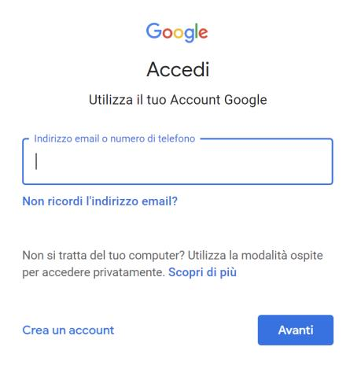

1. Vai su [`https://cloud.google.com/free?hl=it`](https://cloud.google.com/free?hl=it) e clicca **Inizia Gratuitamente**.

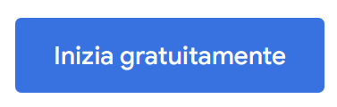

2. Compila le informazioni richieste (Italia, progetto **personale**), accetta i termini di servizio (non le email di marketing) e clicca **CONTINUA**.

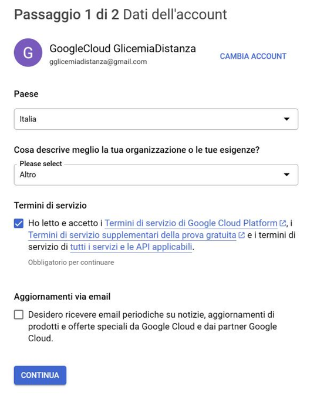

3. Seleziona un conto privato (**individual**). Il codice fiscale non è obbligatorio.

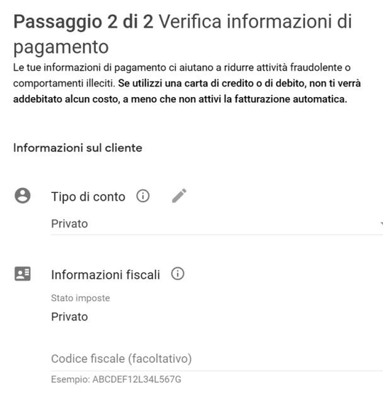

4. Inserisci il tuo indirizzo.

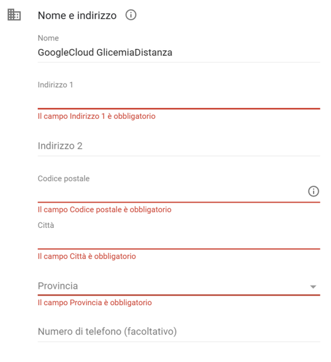

5. Aggiungi una carta di credito: Google potrebbe addebitare €0 o fare una prenotazione di €1 per verificare la carta (non è un addebito reale).

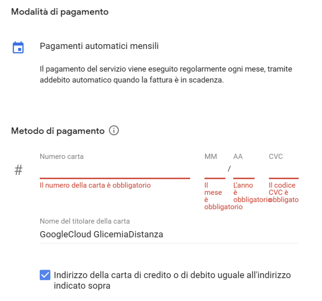

Premi **AVVIA LA MIA PROVA GRATUITA**:

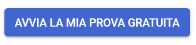

Se richiesto, premi **Continua** per verificare la carta in una nuova finestra:

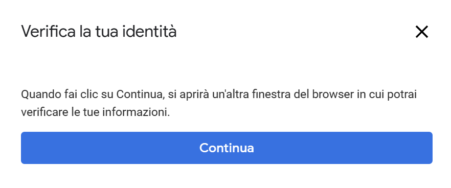

6. Aspetta qualche minuto che Google Cloud prepari il tuo account: comparirà il messaggio **Impostazione della prova gratuita in corso**.

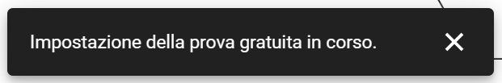

Se la pagina non si aggiorna, fai refresh:

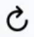

Potresti dover completare la verifica del pagamento: clicca **Verifica ora**...

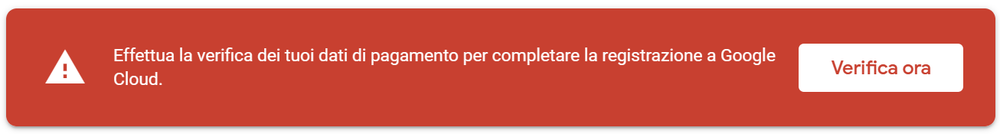

...trova l'addebito temporaneo tra le transazioni della tua carta e premi **Get code**...

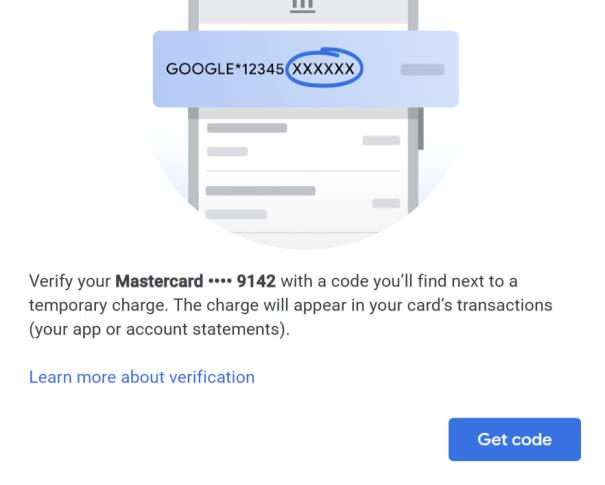

...poi inserisci il codice a 6 cifre trovato e premi **Verify**:

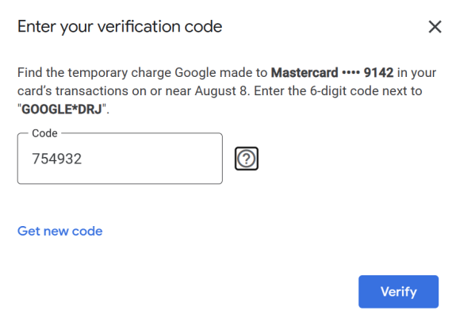

La carta risulterà verificata: premi **Done**:

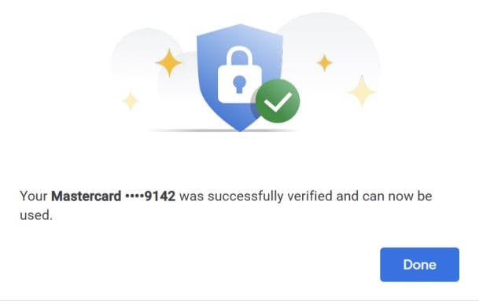

Alle eventuali domande facoltative sul tuo utilizzo di Google Cloud puoi rispondere **Altro**. Il progetto predefinito **My First Project** va benissimo: non serve crearne uno nuovo.

7. Dalla console ([`https://console.cloud.google.com`](https://console.cloud.google.com)), apri il menu e vai su **Compute Engine**, poi premi **ABILITA** per attivare il servizio:

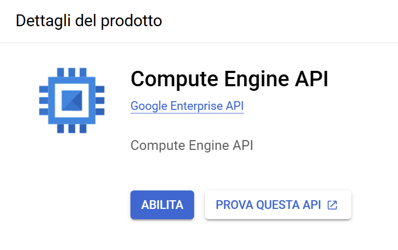

8. **Consigliato**: vai in **Fatturazione** e clicca **Esegui l'upgrade** → **Attiva**. Così, alla fine della prova gratuita, il server non verrà spento (il credito residuo della prova resta valido fino alla sua scadenza).

---

## 3. Crea il server virtuale (2 minuti)

La creazione del server è automatica, tramite un comando da copiare e incollare.

1. Vai su **Compute Engine → Istanze VM** e clicca il pulsante **Cloud Shell** (in alto a destra della console), poi **Autorizza**.
2. Copia e incolla questo comando nel Cloud Shell e premi Invio:

   ```bash
   curl https://raw.githubusercontent.com/jamorham/nightscout-vps/vps-2/create_vm.sh | bash
   ```

3. Accetta il nome proposto per il server (o scrivine uno tuo) e conferma. Lo script crea da solo la macchina giusta per il piano gratuito (tipo `e2-micro`, regione USA gratuita, Ubuntu 24.04, disco entro i 30 GB, firewall HTTP/HTTPS).

> ℹ️ **Nota**: se compare un errore di risorse non disponibili (es. `ZoneResourcePoolExhausted`), esegui semplicemente di nuovo il comando.

Il tuo server comparirà nell'elenco **Istanze VM** con un pallino verde (attivo):

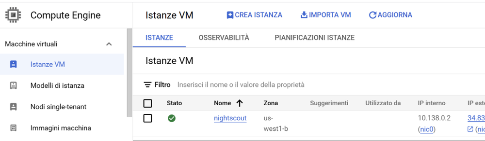

Ogni volta che vuoi ritrovare questa pagina: [`https://console.cloud.google.com/compute/instances`](https://console.cloud.google.com/compute/instances)

---

## 4. Installa Nightscout

### Preparazione (5–10 minuti)

1. Nella pagina [`https://console.cloud.google.com/compute/instances`](https://console.cloud.google.com/compute/instances), clicca **SSH** sulla riga del tuo server per aprire un terminale (consenti i pop-up se il browser li blocca; se compare un errore "Cloud Identity-Aware Proxy", clicca **Retry without Cloud Identity-Aware Proxy**).

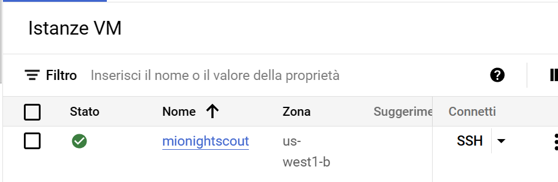

2. Autorizza il collegamento sicuro premendo **Authorize** e aspetta che si apra la finestra del terminale.

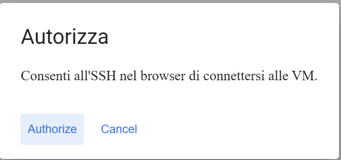

La finestra del terminale si apre con il messaggio di benvenuto di Ubuntu:

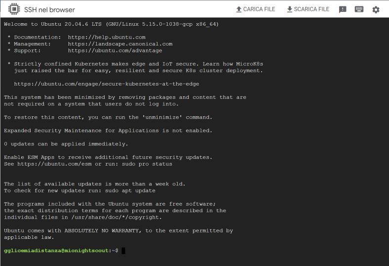

3. Copia e incolla il comando seguente nel terminale e premi Invio:

   ```bash
   curl https://raw.githubusercontent.com/jamorham/nightscout-vps/vps-2/bootstrap.sh | bash
   ```

> ⚠️ **Attenzione**: non incollare mai questo comando su un altro computer: è pensato solo per il server appena creato.

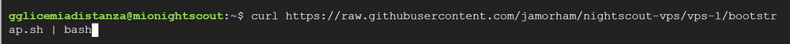

4. Alla fine compare una pagina di **Stato** che verifica il server. Controlla che **sopra la riga orizzontale** non ci siano voci in rosso: se ce ne sono, il server è stato creato male — eliminalo e ricrealo (passo 3). Le voci in rosso **sotto** la riga sono normali a questo punto.

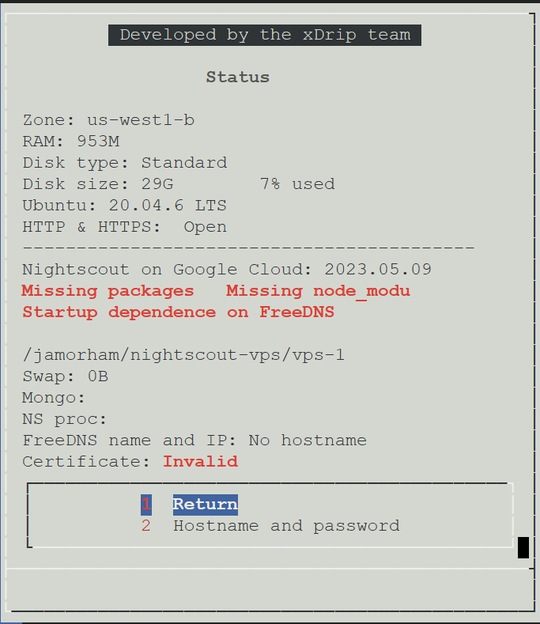

Premi Invio: si apre il menu principale, che da ora comparirà a ogni collegamento SSH (se lo chiudi, digita `menu` per riaprirlo). Non rimpicciolire la finestra del terminale.

### Fase 1 (15–20 minuti)

Con le frecce, vai su **Google Cloud setup** → **Install Nightscout Phase 1** → premi Invio per confermare.

Nel menu principale, seleziona **Google Cloud setup**:

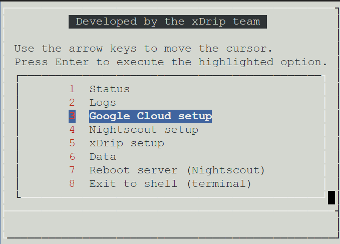

Poi seleziona **Install Nightscout phase 1**:

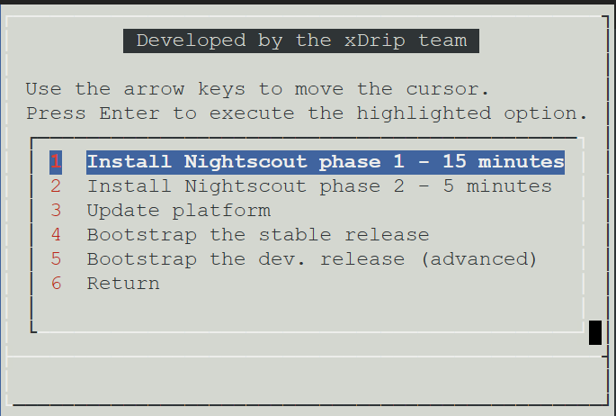

Conferma di voler procedere con l'installazione:

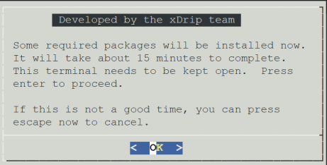

> ℹ️ **Nota**: qualche messaggio di errore durante la fase 1 è normale. Se il terminale SSH si disconnette, ricollegati e riesegui la fase 1: le fasi si possono ripetere senza danni.

### Fase 2 (10–15 minuti)

Quando la fase 1 termina, torna al menu → **Google Cloud setup** → **Install Nightscout Phase 2**.

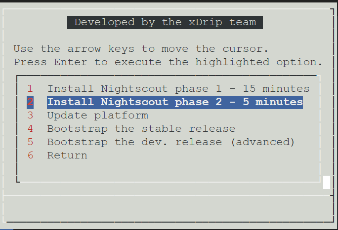

Ti verranno chiesti, nell'ordine:

1. La tua **API_SECRET**: è la password principale della tua pagina Nightscout. Minimo 12 caratteri; NON usare questi caratteri: `$` `"` `'` `\` spazio `@` `/` `%`

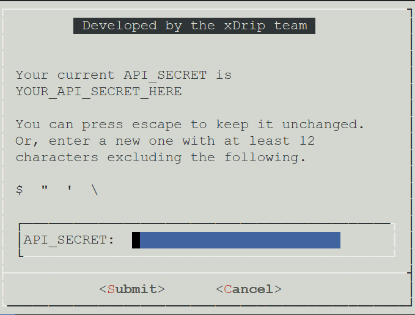

2. Il tuo **indirizzo email**: serve solo a Let's Encrypt (il certificato HTTPS, che si rinnova da solo) per eventuali avvisi.
3. Il tuo **User ID e password FreeDNS** (lo User ID, non l'email!). Se hai più sottodomini, digita le prime lettere di quello da usare. Usa le frecce per spostarti tra i campi.

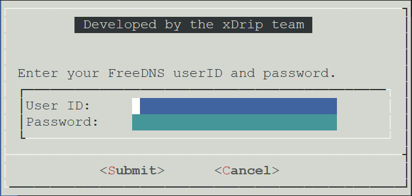

Premi Invio per proseguire: questo passaggio può richiedere fino a 10 minuti.

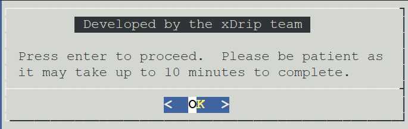

Durante questa fase è normale vedere un errore temporaneo legato al certificato, mentre il sistema richiede il certificato HTTPS:

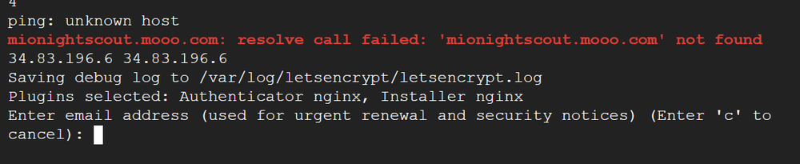

**Se qualcosa va storto nella fase 2:**
- Errore interno → esci e riprova la fase 2.
- Domanda su un **certificato esistente** → scegli l'**opzione 2**.
- **"Too many requests"** → il dominio scelto ha esaurito i certificati disponibili per oggi: crea un sottodominio su un **altro dominio** FreeDNS e riesegui la fase 2 (premi ESC alla domanda sull'API_SECRET per mantenere quella già impostata), oppure aspetta 24 ore.
- In generale: menu → **Reboot server**, aspetta 30 secondi, ricollegati e riesegui la fase 2.

Al termine, premi Invio per riavviare il server. Aspetta 30 secondi, poi riaccedi tramite SSH.

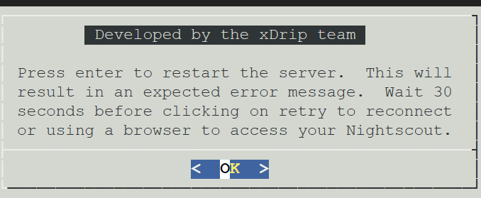

Se provi a riconnetterti troppo presto, il browser mostrerà **Connessione non riuscita**: attendi qualche istante e premi **Riprova**.

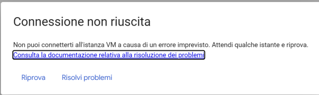

Dal menu principale, vai in **Status** e controlla che non ci siano elementi in rosso: **Mongo**, **NS proc**, **FreeDNS name and IP** e **Certificate** devono risultare validi.

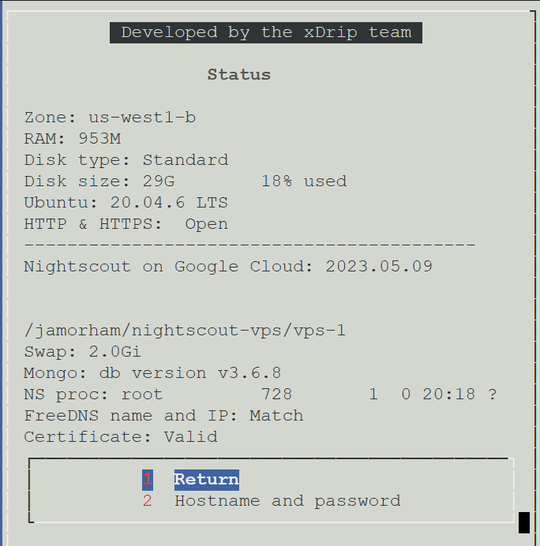

Se tutto è a posto, torna al menu principale premendo **Return**:

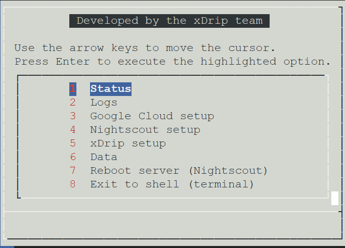

> ℹ️ **Nota**: se in futuro dimentichi l'indirizzo del sito, l'API_SECRET o le credenziali FreeDNS, le ritrovi nella pagina **Status** → **Login credentials**.

---

## 5. Configura Nightscout

1. Apri un browser e vai all'indirizzo del tuo sito (es. `https://mionightscout.dominio.com`).

Per prima cosa verifica che l'indirizzo scelto su FreeDNS punti davvero al tuo server:

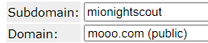

Al primo accesso il sito ti chiede di autenticarti: inserisci l'**API_SECRET** e spunta **Remember this device**:

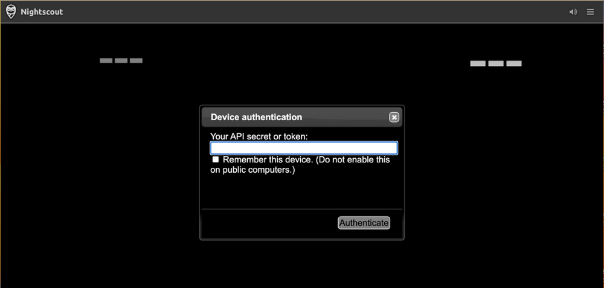

Il sito si aprirà mostrando l'orario e il menu laterale:

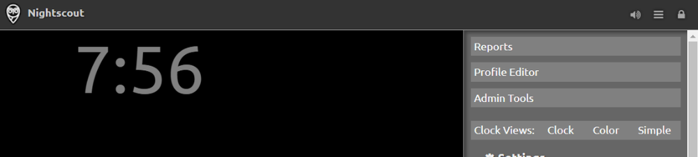

2. Alla prima apertura ti viene chiesto di compilare il **profilo** (fuso orario, rapporti insulina/carboidrati, ecc.): inserisci i valori reali oppure salva così com'è per ora (a volte serve salvare due volte).

Qui puoi controllare e modificare i parametri del tuo profilo:

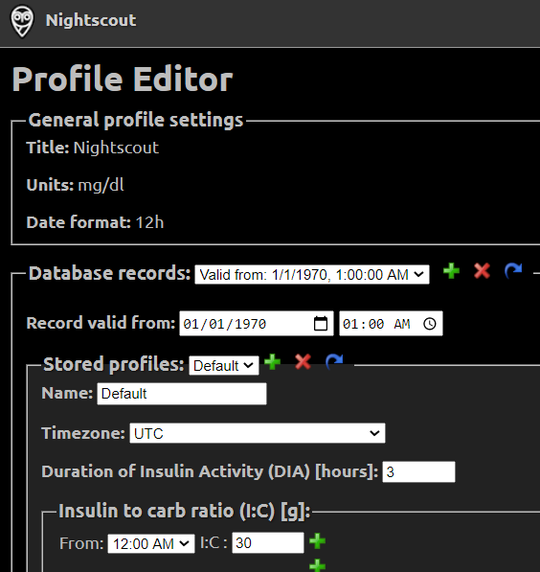

3. Imposta il fuso orario: **Europe/Rome**
4. Scorri in fondo, clicca **Authenticate**, inserisci l'API_SECRET...


...e conferma che lo stato mostri **Admin authorized**, poi premi **Save**:


5. Verifica lo stato in alto a destra: dopo il salvataggio comparirà un messaggio **Status: success**.


Una volta connesso l'uploader, il tuo sito mostrerà la glicemia in tempo reale:


**Connettere l'uploader:**

- **xDrip master — metodo rapido con QR**: nel terminale SSH, menu **xDrip setup** → **QR code to make xDrip master**. In xDrip, vai in **Impostazioni → Auto configura** e scansiona il codice QR mostrato nel terminale (attenzione: cancella gli eventuali indirizzi già configurati in xDrip).

- **xDrip master — metodo manuale**: vai in **Impostazioni → Cloud Upload → API Upload (REST)** e inserisci:
  ```
  https://tuaAPISecret@mionightscout.dominio.com/api/v1
  ```

Apri il menu principale di xDrip e tocca **Impostazioni**:

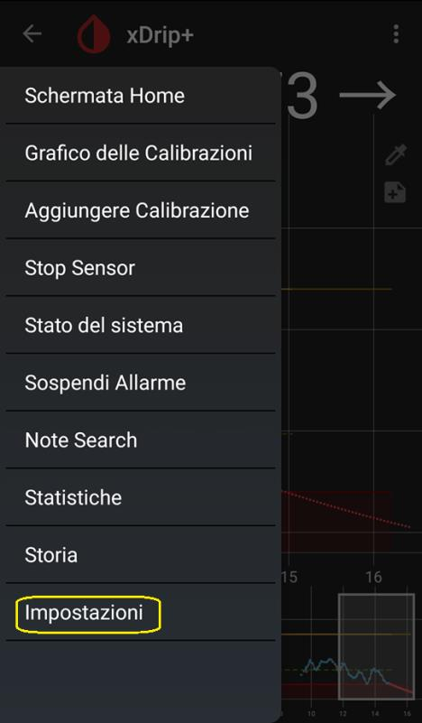

Nelle impostazioni, tocca **Cloud Upload**:

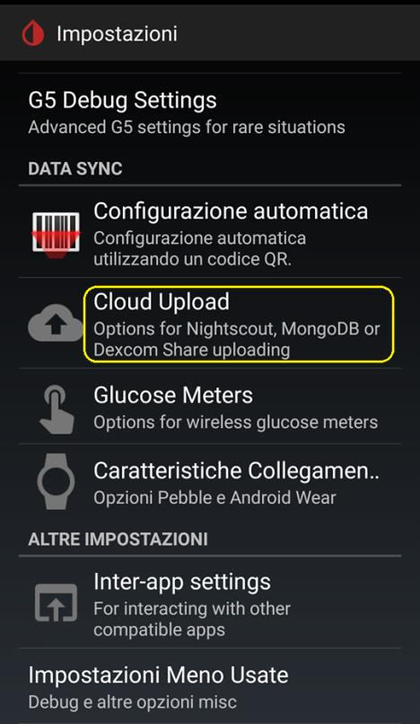

Poi tocca **API Upload (REST)**:

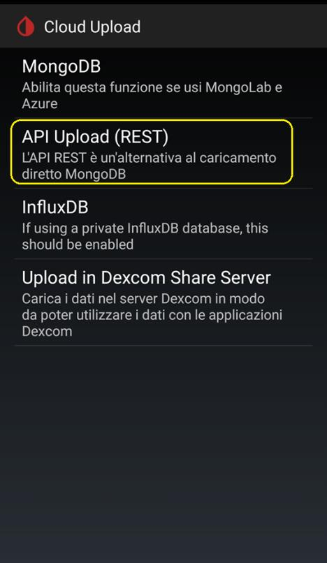

Attiva **Abilitato** e incolla l'indirizzo nel campo **URL di base**:

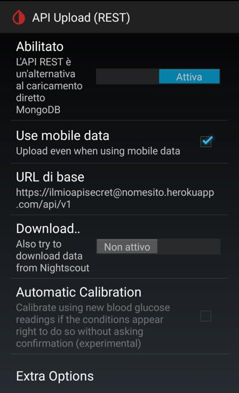

- **xDrip4iOS / Bubble / Juggluco:** nell'URL inserisci solo l'indirizzo del sito senza il percorso `/api/v1`. Su xDrip4iOS, vai in **Settings → Nightscout**, attiva **Enable Nightscout?** e inserisci URL e API_SECRET:

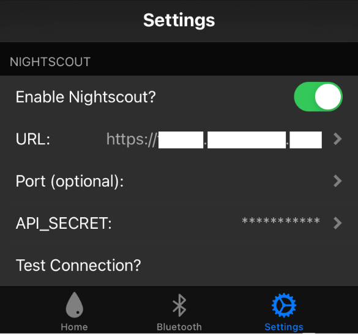

Su Juggluco, vai in **Integration → Nightscout Share Server Upload**, attiva il toggle e inserisci **Url** e **Key**, poi premi **Save**:

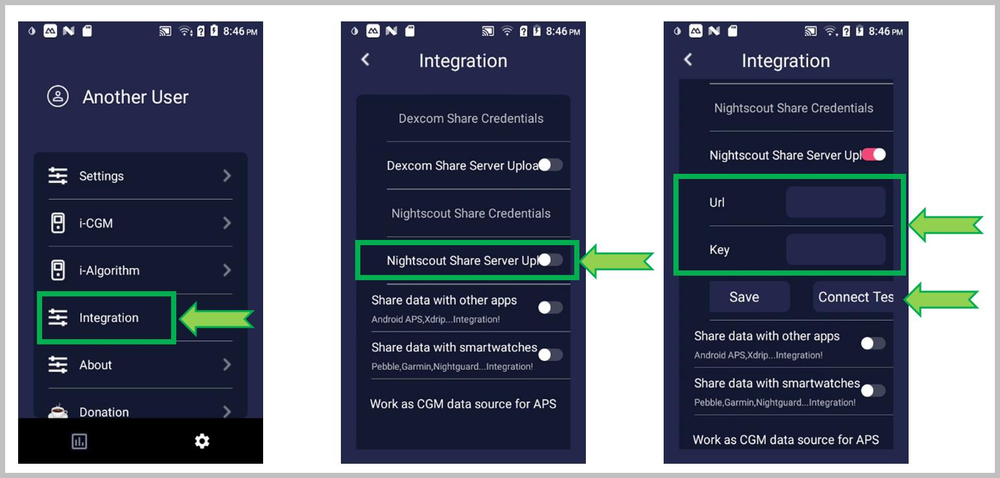

In alternativa, nelle impostazioni di Juggluco tocca **Uploader** e inserisci **Nightscout Server URL** e **api_secret**, poi premi **Save**:

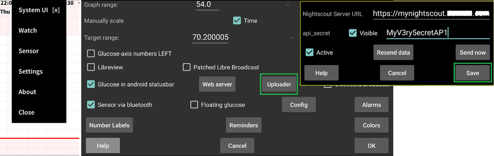

- **Dexcom Share come sorgente:** apri il terminale SSH → menu **Nightscout setup** → **Edit variables** → aggiungi le variabili:
  ```bash
  export BRIDGE_USER_NAME='tuo_utente_dexcom'
  export BRIDGE_PASSWORD='tua_password_dexcom'
  export BRIDGE_SERVER='EU'
  ```

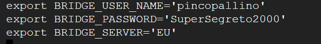

  e aggiungi `bridge` nella variabile `ENABLE`. Salva con `Ctrl+O`, poi Invio, poi `Ctrl+X`. Riavvia il server. Ecco un esempio di file di configurazione completo, con le variabili Dexcom Share aggiunte in fondo:

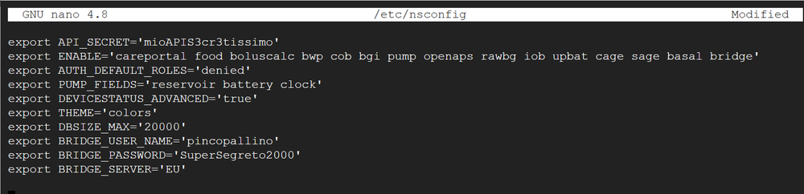

**Follower:** possono accedere dal browser con l'indirizzo del sito. Il modo più sicuro è creare per loro dei **token di sola lettura** (da **Admin Tools** del sito) invece di dare l'API_SECRET. Il sito è volutamente **non visibile senza login** (`AUTH_DEFAULT_ROLES` impostata su `denied`): oltre che per la privacy, questo protegge il piano gratuito dal traffico dei crawler.

---

## 6. Modificare le variabili (in seguito)

Per modificare o aggiungere variabili di Nightscout:
1. Apri il terminale SSH → menu **Nightscout setup**.

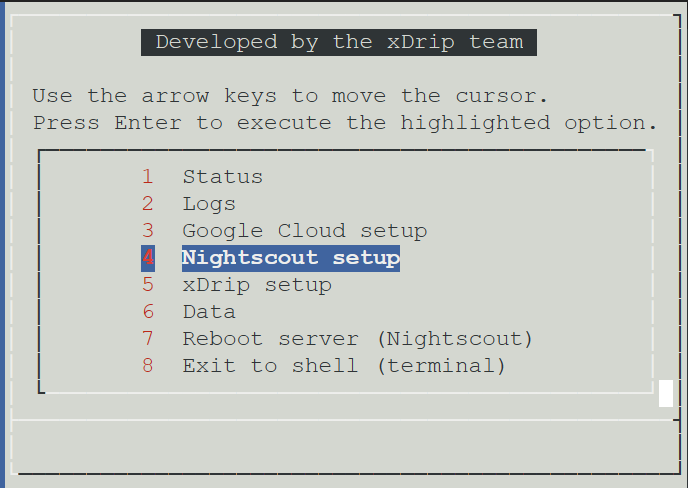

Puoi scegliere tra **Edit variables in a browser** (comodo: apre un link valido 15 minuti) oppure **Edit variables using a text editor**:

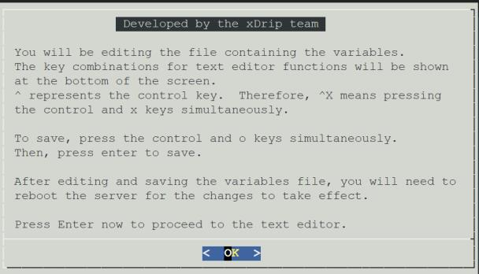

2. Con l'editor di testo si apre `nano`. Usa le frecce per navigare (il mouse non funziona).

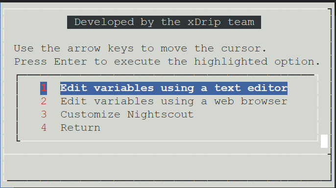

3. Il formato delle variabili è:
   ```bash
   export NOMEVARIABILE='valore'
   ```
4. Variabili utili:
   - `AR2_CONE_FACTOR='0'` — elimina le previsioni automatiche
   - `AUTH_DEFAULT_ROLES='readable'` — permette la visualizzazione senza login (sconsigliato, vedi sopra)
   - `CUSTOM_TITLE='Superman'` — personalizza il titolo della pagina
   - `SCALE_Y='linear'` — scala verticale lineare
   - `TIME_FORMAT='24'` — orologio in formato 24 ore
   - `LANGUAGE='it'` — interfaccia in italiano
5. Salva con `Ctrl+O` → Invio → `Ctrl+X`. Riavvia il server dal menu principale, voce **Reboot server**, per applicare le modifiche.

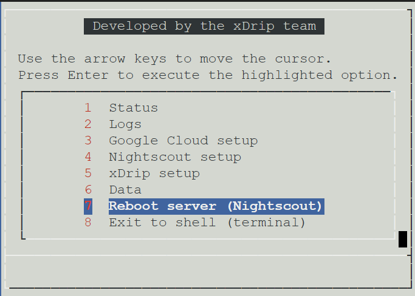

---

## 7. Manutenzione (due volte l'anno)

Il sistema si mantiene quasi da solo, ma due volte l'anno dedica 10 minuti a questi passaggi:

1. **Riavvia il server**: menu → **Reboot server** (il sito torna online entro 10 minuti).
2. **Fai un backup**: menu → **Data** → **Backup MongoDB and variables**: crea un unico archivio compresso con database e variabili.
3. **Scarica il backup** sul computer (pulsante **Download File** del terminale, inserendo il percorso completo del file) e conservalo su un cloud (es. Google Drive).
4. **Fai login su FreeDNS** ([`https://freedns.afraid.org/`](https://freedns.afraid.org/)) per mantenere attivo l'account.

Per **aggiornare** Nightscout e il sistema: menu → **Google Cloud setup** → **Update platform**, poi riavvia il server. La versione installata è visibile nel menu del sito → **About**.

> ⚠️ **Attenzione ai costi**: da aprile 2025 Google crea automaticamente una **pianificazione di snapshot** del disco insieme alle nuove VM, che costa circa 0,25 $ al mese. Per restare a costo zero: **Compute Engine → Snapshot** → elimina la pianificazione e gli snapshot esistenti. Controlla gli addebiti in **Fatturazione → Tabella dei costi**.

---

## Appendice A — Eliminare il VPS

Se hai cambiato idea o hai sbagliato la configurazione:
- Vai in [`https://console.cloud.google.com/compute/instances`](https://console.cloud.google.com/compute/instances).
- Clicca i tre puntini a destra del tuo server → **Elimina** → conferma.

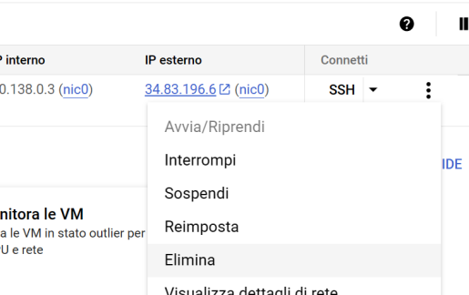

**Rimuovere la carta di credito:**
- Vai su [`https://console.cloud.google.com/billing`](https://console.cloud.google.com/billing) e apri **I miei account di fatturazione**.

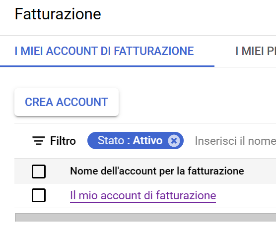

- Seleziona il tuo account di fatturazione → **Panoramica dei pagamenti**.

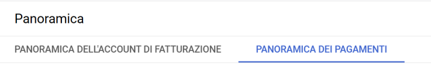

- Scorri fino alla tua carta, in **Modalità di pagamento**...

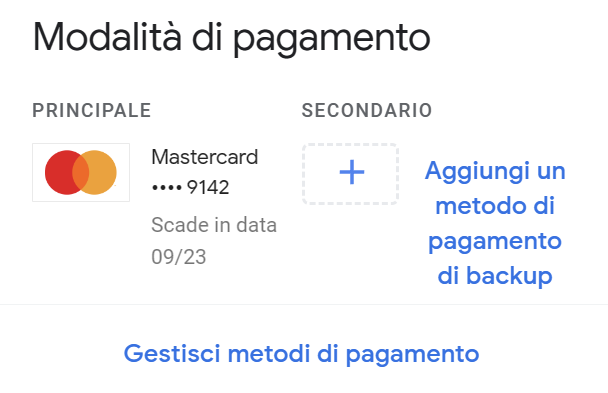

...e premi **Rimuovi** accanto alla carta registrata:

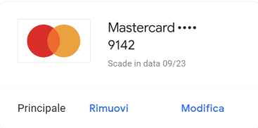
