# Nightscout su Ionos VPS

Questa guida spiega come creare un sito Nightscout su un **server virtuale privato (VPS) Ionos** al costo di circa 1€/mese (+IVA).

Nightscout nasce per essere distribuito su Linux. Questa soluzione usa uno script di installazione automatica che rende il processo relativamente semplice.

> ℹ️ **Limitazioni del VPS XS (1€/mese):** è adatto per la condivisione della glicemia e per uno smartwatch. **Non è adatto** per un circuito chiuso fai-da-te (Loop, iAPS, AAPS): la quantità di dati scambiata è troppa per un server così piccolo. Per quell'uso, un VPS di tipo S (4€/mese) sarebbe più appropriato — ma a quel prezzo esistono servizi Nightscout gestiti che offrono molto di più in modo più semplice.

---

## 1. Crea il server virtuale

1. Vai su [`https://www.ionos.it/server/vps`](https://www.ionos.it/server/vps).


E scegli il piano **VPS Linux XS** (1€/mese +IVA):

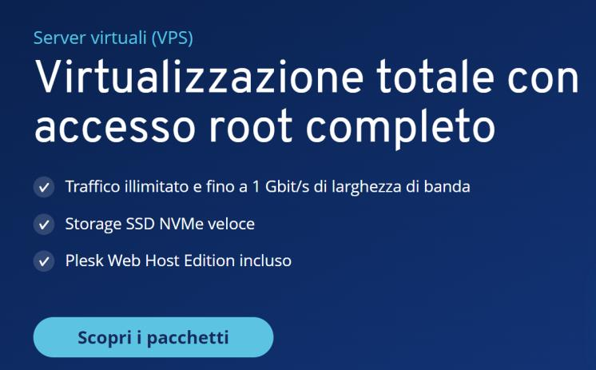

2. Seleziona **Linux Ubuntu 20.04** come sistema operativo. **Nessun'altra versione.**

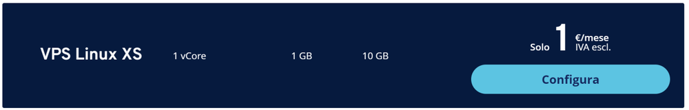

3. Non aggiungere backup cloud (costa in più e non è necessario): lascia selezionato **Nessuno**.

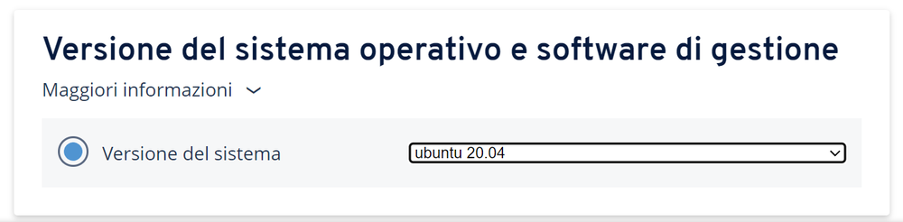

4. Verifica che il contratto sia mensile (il default potrebbe essere annuale) e controlla il riepilogo dell'ordine.

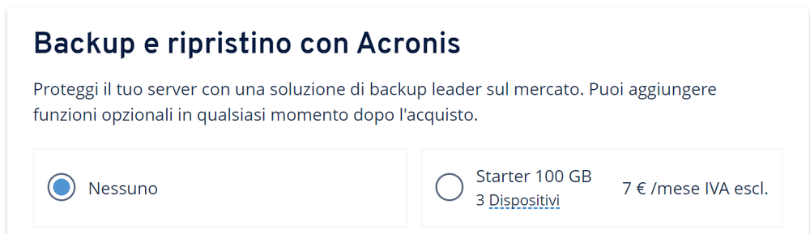

Se non sei ancora cliente Ionos, scegli **Continua come nuovo cliente**:

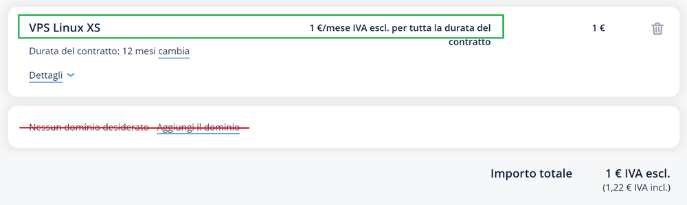

5. Crea un account Ionos con la tua email (non usa e getta): seleziona **Privato** come tipo di utilizzo.

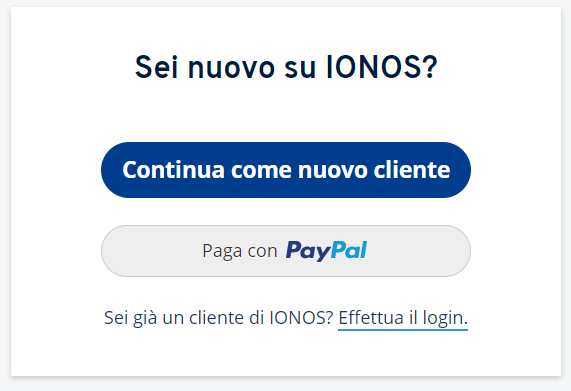

Scegli una password sicura (**non perderla**) e clicca **Vai alle opzioni di pagamento**.

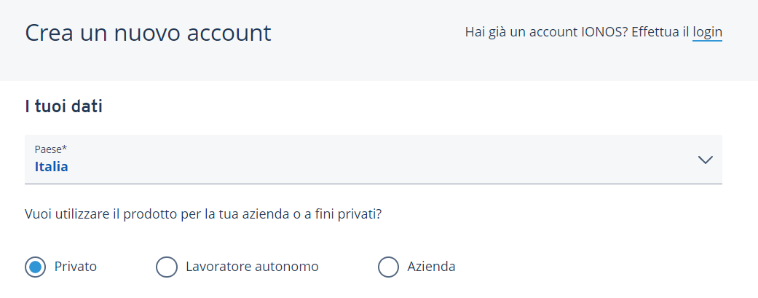

6. Scegli il metodo di pagamento che preferisci (carta di credito o PayPal).

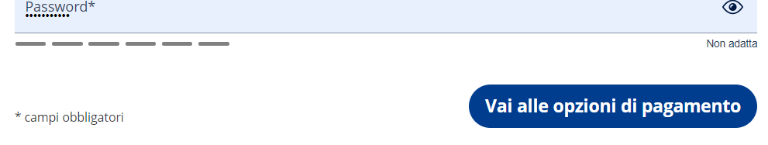

Controlla il riepilogo dell'ordine: il costo è di circa 1,22€/mese, fatturato mensilmente.

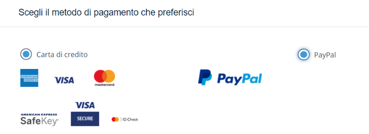

7. Accetta i termini e le condizioni e clicca **Ordina** per confermare.

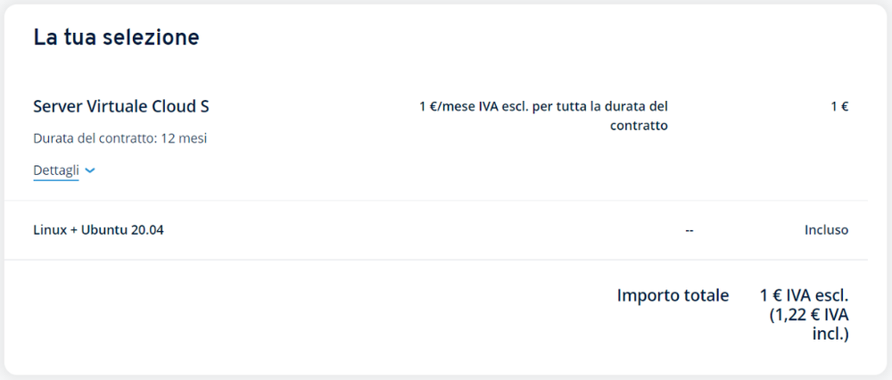

Vedrai la conferma con i prossimi passi:

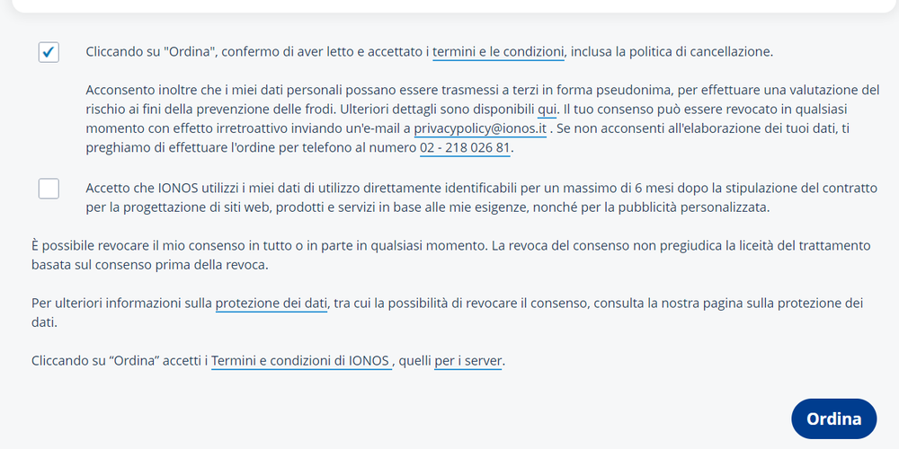

---

## 2. Recupera le credenziali del server

Dopo l'ordine, riceverai una mail da `supporto@ionos.it` di conferma del contratto, con il pulsante per accedere al pannello:

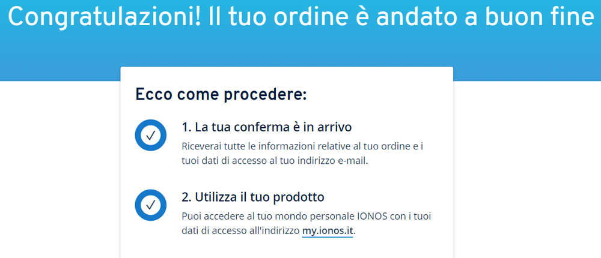

In questa mail troverai:
- L'**indirizzo IP** del server (es. `217.xxx.xxx.xxx`)
- Il **nome del server**
- La **password di root** (amministratore)

Per visualizzare la password nel pannello Ionos:
1. Apri la mail → clicca **Login** in alto a destra.

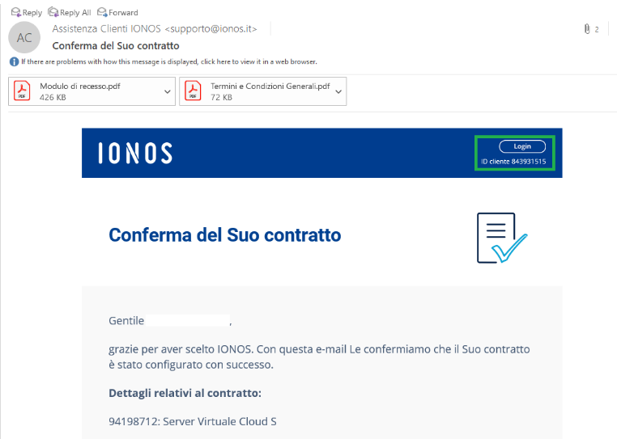

2. Vai in **Server & Cloud**.

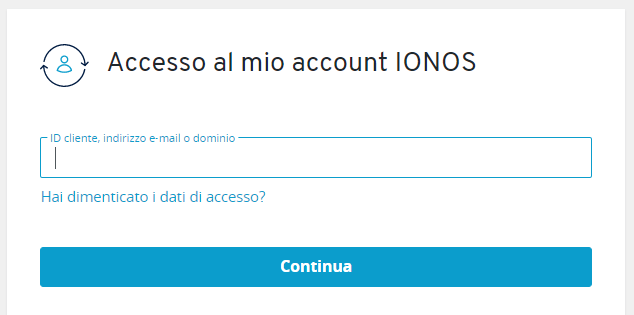

Seleziona il tuo VPS (chiamato "Nightscout") dall'elenco:

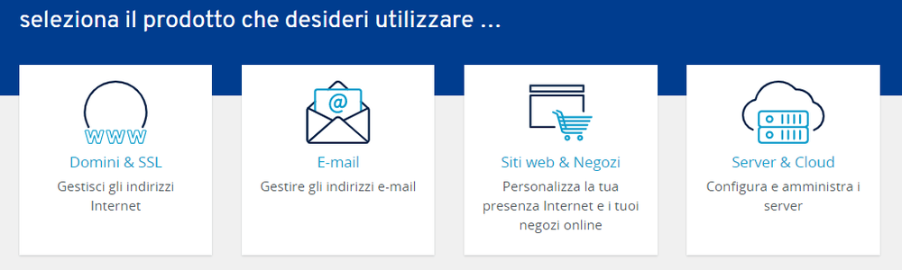

Nella sezione **Features** trovi l'indirizzo IP (**Host**), l'utente (**User: root**) e il nome del server (**DNS host name**):

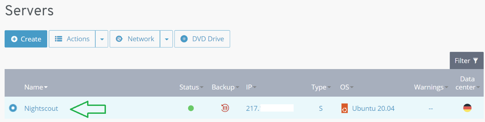

La stessa schermata in italiano, con le etichette **Indirizzo IP**, **Password di root** e **Nome del server**:

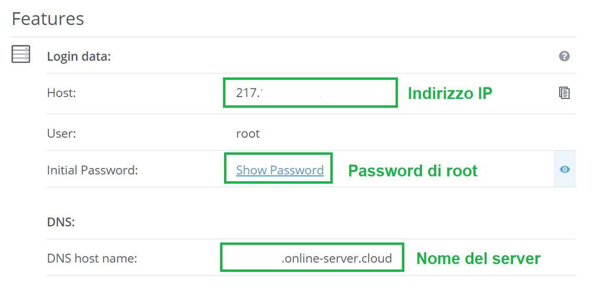

3. Clicca sull'icona "occhio" accanto alla password (**Visualizza password**) per visualizzarla e copiarla.

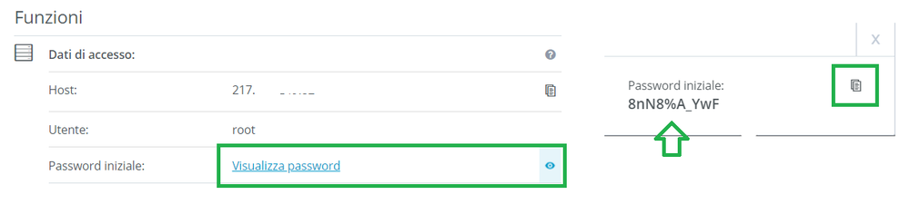

> ℹ️ **Nota**: Puoi chiedere assistenza remota a una persona di fiducia condividendo solo l'indirizzo IP e la password root.

---

## 3. Installa Nightscout

Apri un terminale sul tuo computer:
- **Windows**: apri **Prompt dei comandi** o **PowerShell**
- **Mac**: apri **Terminale**

Connettiti al server con SSH:
```bash
ssh root@217.xxx.xxx.xxx
```
(sostituisci `217.xxx.xxx.xxx` con il tuo indirizzo IP)

Se chiede conferma, digita `yes`. Poi inserisci la password di root.

Quando vedi il prompt `root@localhost:~#`, esegui questo comando (copialo dal browser, non riscriverlo a mano):

```bash
curl https://raw.githubusercontent.com/psonnera/NSDockVPS/ionos_it/boot.sh | bash
```

Lo script di installazione si avvierà, mostrando la schermata di benvenuto di Nightscout:

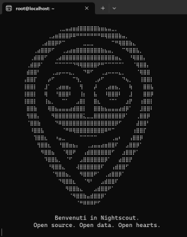

Accetta le condizioni di utilizzo premendo Invio:

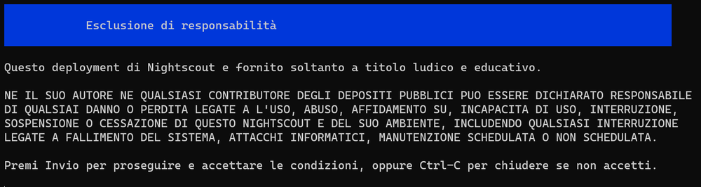

Lo script scaricherà i componenti necessari (l'installazione è automatica e dura meno di 10 minuti):

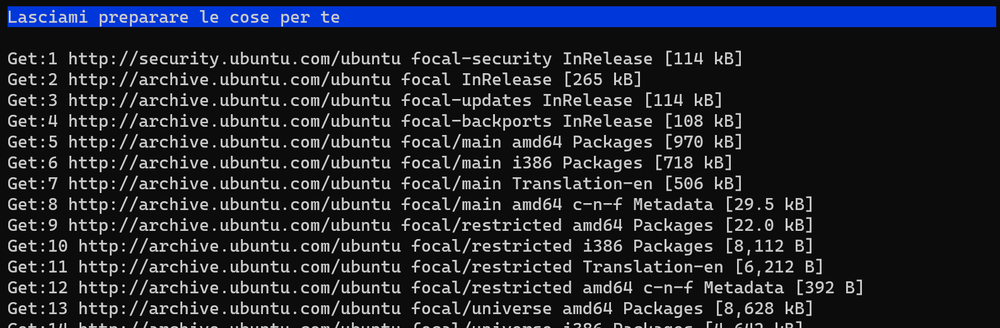

### Crea le credenziali Nightscout

Lo script si fermerà per chiederti di creare un **nome utente** (solo minuscole e numeri, niente spazi o caratteri speciali):

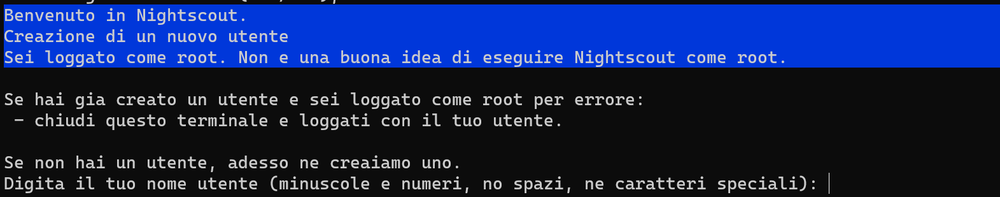

Poi ti chiederà una **password** (inseriscila due volte per conferma):

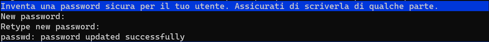

> ⚠️ **Attenzione**: Non perdere queste credenziali!

Lo script si fermerà e mostrerà un nuovo comando SSH con il tuo nome utente: annotalo, ti servirà per riconnetterti.

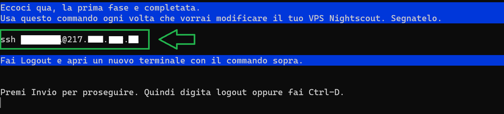

Premi Invio, poi digita `logout` (o premi `Ctrl+D`) per chiudere la sessione come root:

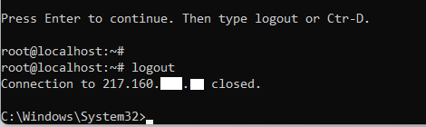

### Primo accesso con il nuovo utente

Apri una nuova finestra del terminale e usa il comando mostrato dallo script:
```bash
ssh tuonome@217.xxx.xxx.xxx
```

Conferma con `yes` se richiesto e inserisci la password:

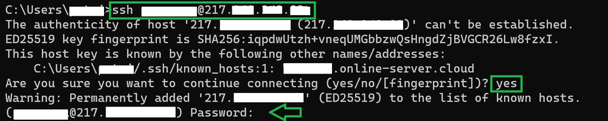

Il server chiederà di confermare la password una seconda volta (`sudo`):

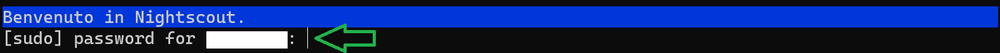

Poi ti chiederà un'email (per il servizio SSL del certificato — è molto improbabile che ti venga mandata una mail):

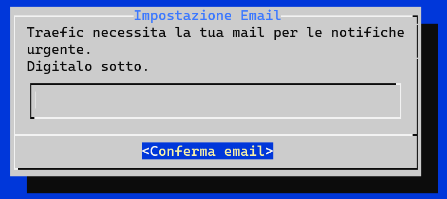

Infine scegli la **password del sito Nightscout** (API_SECRET): almeno 12 caratteri (minuscole, maiuscole, numeri). Non usare spazi o caratteri speciali come `|`, `:`, `,`, `@`, `/`.

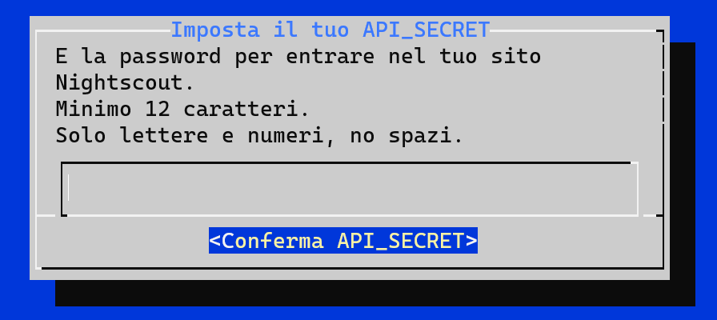

Si aprirà il menu principale **Nightscout Management**:

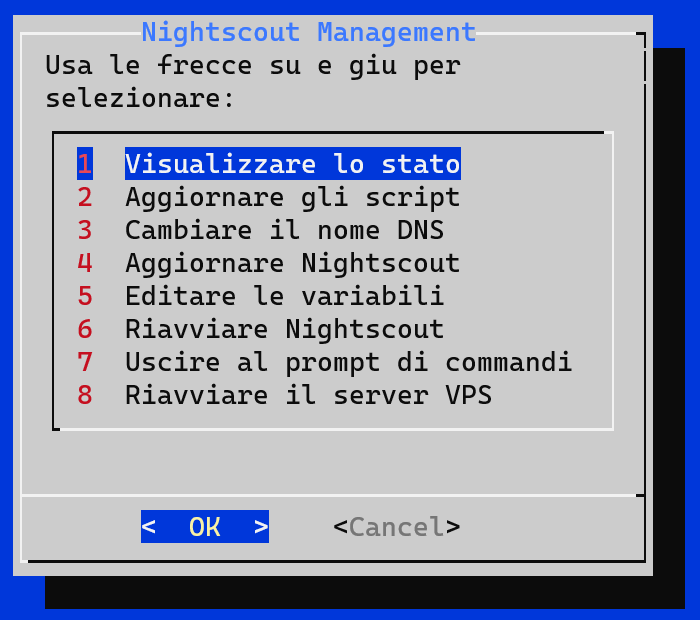

Vai in **1 – Visualizzare lo stato** e aspetta che tutto diventi verde (5–10 minuti): database, Nightscout, Traefik, servizio DNS e certificato HTTP/HTTPS.

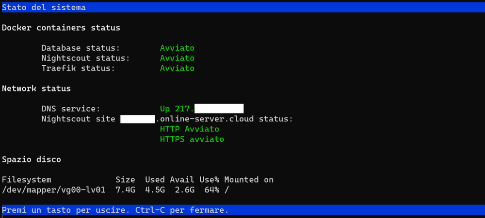

---

## 4. Apri il sito Nightscout

Nel browser, vai all'indirizzo del tuo server (sostituisci `123a456` con il tuo nome):
```
https://123a456.online-server.cloud
```

Trovi il nome esatto del tuo server nella sezione **DNS host name** vista al passo 2:

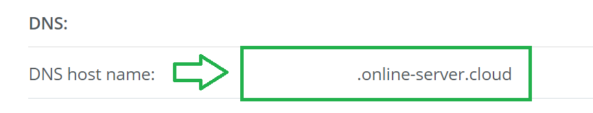

Se la pagina non si apre entro 10 minuti, dal menu SSH scegli **6 – Riavviare Nightscout**...

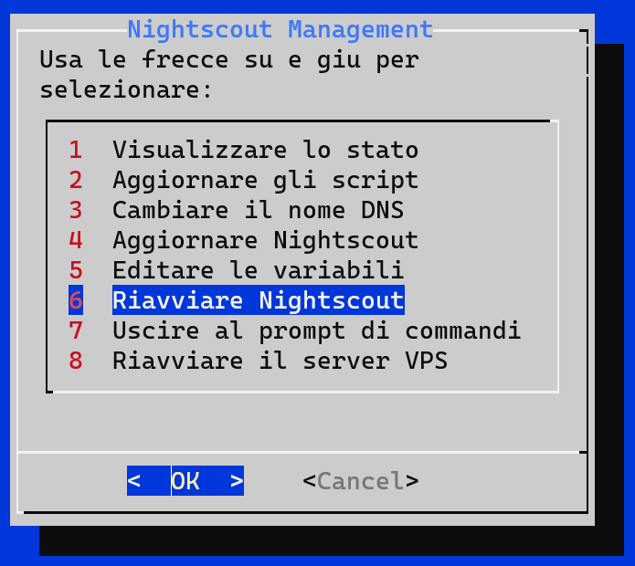

...aspetta 10 minuti (il riavvio mostra un contatore) e riprova.

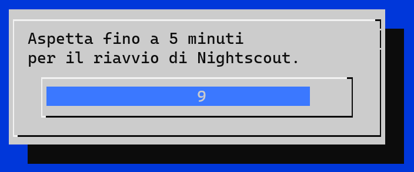

### Configura il profilo

1. Quando il sito si apre per la prima volta, ti verrà chiesto di creare un nuovo profilo: premi **OK**.

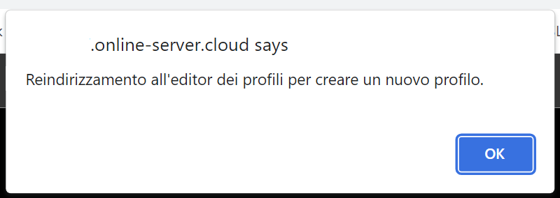

Si aprirà l'**Editor dei profili**:

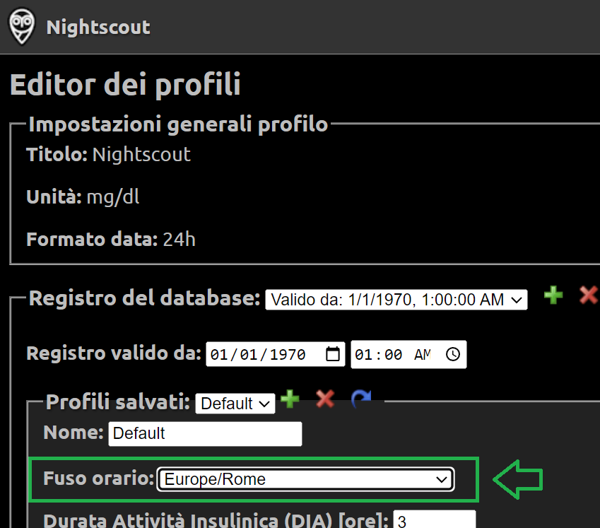

2. Imposta il fuso orario: **Europe/Rome**.

3. Scorri in fondo → **Autenticare** → inserisci l'API_SECRET nella finestra **Device authentication**...

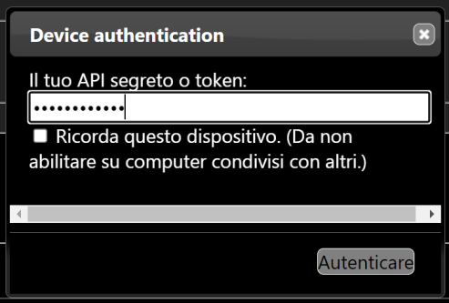

...lo stato passerà da **Non Autorizzato**...

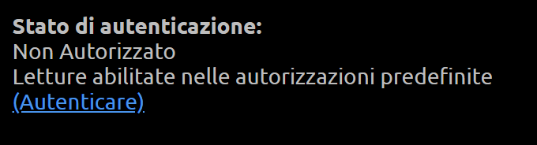

...a **Amministratore autorizzato**: premi **Salva**.

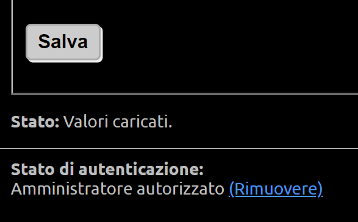

### Se usi Dexcom Share

Dal menu SSH:
1. Vai in **5 – Editare le variabili** → **6 – Dexcom share**.

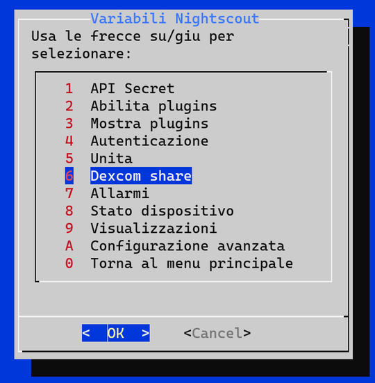

2. Inserisci nome utente, password (quelli del telefono master collegato al sensore) e server (**EU** o **US**).

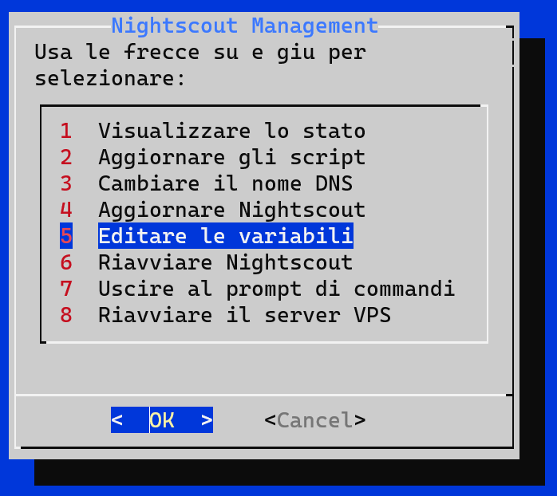

3. Premi Invio per salvare, poi torna al menu delle variabili:

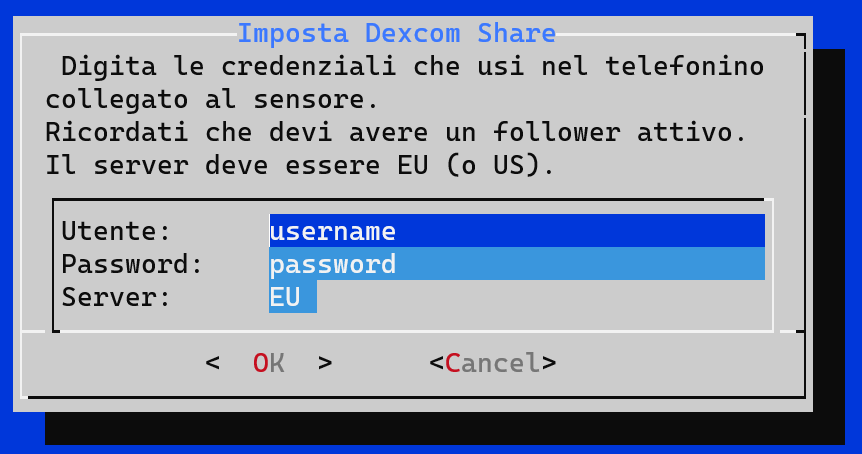

Per abilitare il plugin:
1. Vai in **2 – Abilita plugins** → seleziona **bridge (Dexcom share)** con la barra spaziatrice.

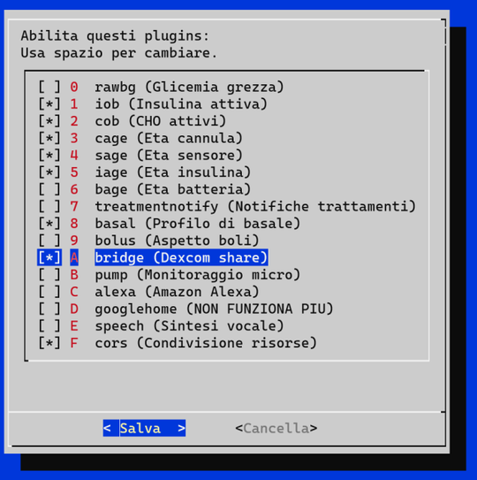

2. Premi **Salva**.
3. Torna al menu principale per validare le modifiche:

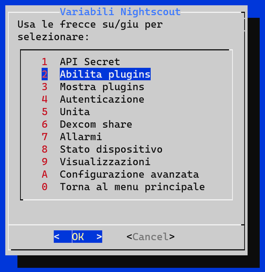

E scegli **6 – Riavviare Nightscout** per applicarle:

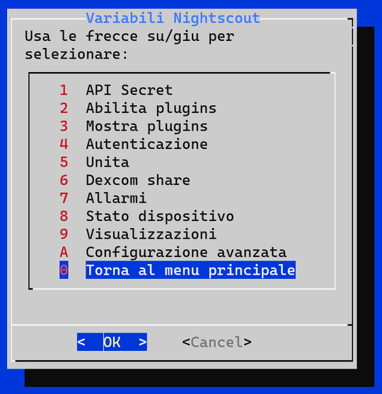

> ℹ️ **Nota**: È necessario avere almeno un follower attivo su Dexcom Share per vedere i dati in Nightscout (puoi invitare te stesso).

Se non vedi la glicemia entro 10 minuti, riavvia Nightscout dal menu (attendi il completamento della barra di avanzamento).

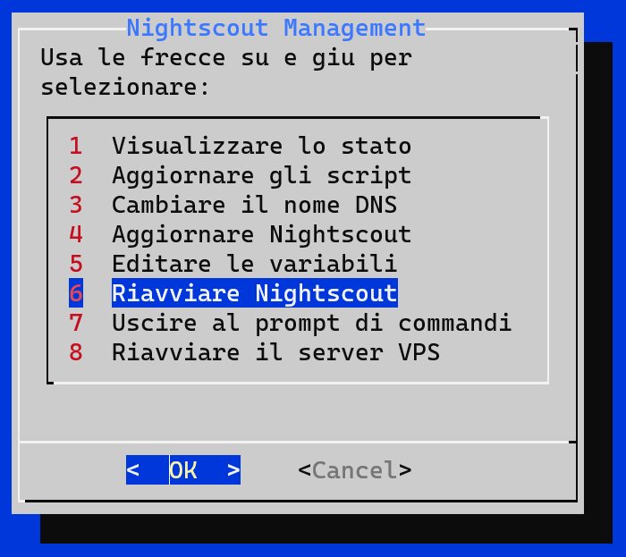

A questo punto il tuo sito mostrerà la glicemia in tempo reale, come in questo esempio:

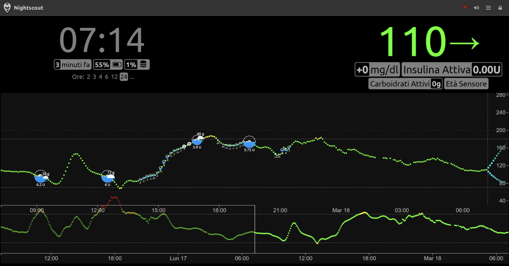

---

## 5. Crea un nome più facile da ricordare (opzionale)

Il nome predefinito del server Ionos è difficile da ricordare. Puoi creare un indirizzo più semplice con FreeDNS (gratuito).

1. Vai su [`https://freedns.afraid.org/`](https://freedns.afraid.org/) → **Sign up Free**.
2. Compila nome utente, password (non perderla!) e email. Risolvi il captcha e clicca **Send activation email**.

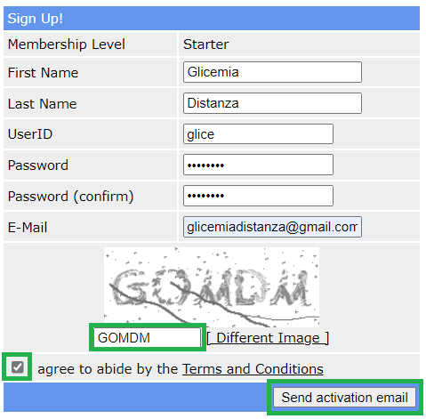

3. Controlla la mail e clicca il link di conferma:

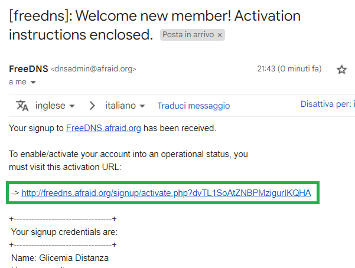

4. Accedi e clicca **Subdomains** → **Add a subdomain**.


5. In **Subdomain**: il nome che vuoi per il tuo sito.
6. In **Domain**: scegli un dominio dalla lista (es. `mooo.com`).
7. In **Destination**: l'indirizzo IP del tuo VPS Ionos.
8. Risolvi il captcha e clicca **Save**.


Il tuo sito sarà ora raggiungibile con il nuovo nome.

> ⚠️ **Attenzione**: Fai login su FreeDNS almeno ogni 6 mesi per mantenere attivo il tuo dominio gratuito (solo il login, nient'altro).
