# Nightscout Pro — Abbonamento a un sito Nightscout gestito

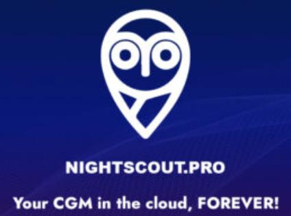

Nightscout Pro è un servizio di hosting Nightscout a pagamento, creato da Andy Low (sviluppatore web diabetico di tipo 1) nel dicembre 2022, nato dopo che Heroku ha abbandonato il piano gratuito.

Il vantaggio principale è la semplicità: non devi costruire o mantenere nulla. Gli aggiornamenti sono automatici. L'abbonamento parte da 4€/mese o 40€/anno.

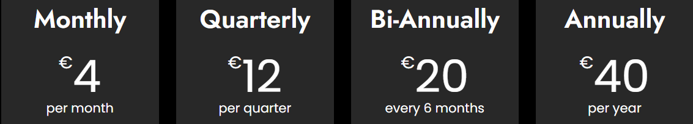

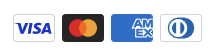

Per saperne di più su Nightscout: `https://nightscout.github.io/`

---

## 1. Crea un account

1. Vai su `https://nightscout.pro/` e clicca **START MY CLOUD**.

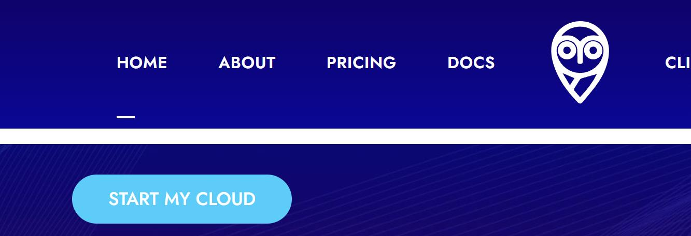

2. Inserisci il tuo indirizzo email (non usa e getta) e crea una password → **Sign Up**.

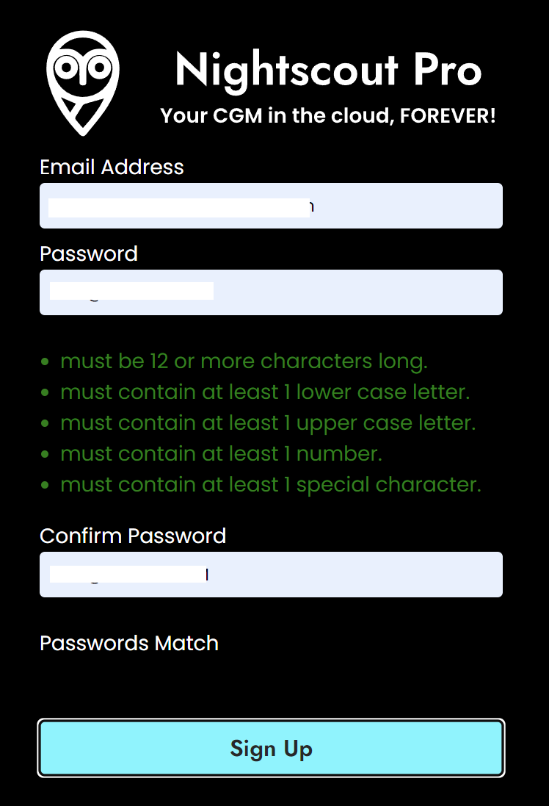

3. Da questo momento puoi accedere a `https://my.nightscoutpro.com/` con queste credenziali.

---

## 2. Crea il tuo sito Nightscout

1. Clicca **CREATE A NEW NIGHTSCOUT SITE**.

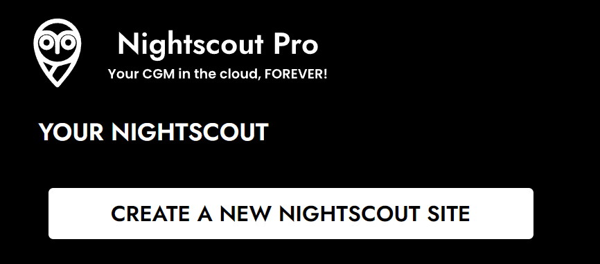

2. Scegli il tipo di abbonamento:

   | Piano | Consiglio |
   |---|---|
   | Mensile | Se vuoi provare prima di impegnarti |
   | Trimestrale / Semestrale | Risparmio graduale |
   | Annuale | Il più conveniente sul lungo periodo |

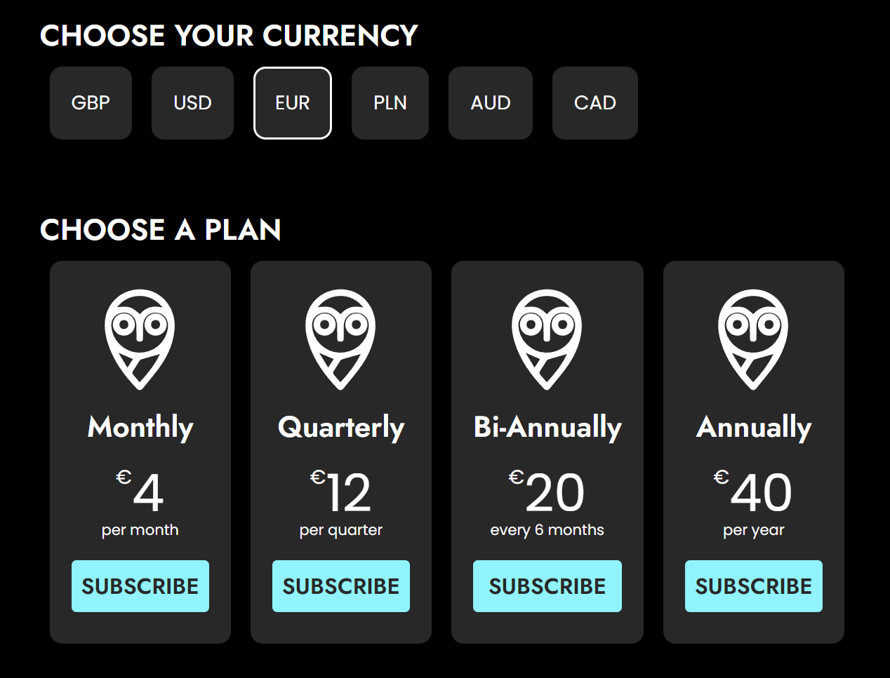

3. Clicca **SUBSCRIBE** per il piano scelto e inserisci una carta di credito per il pagamento.

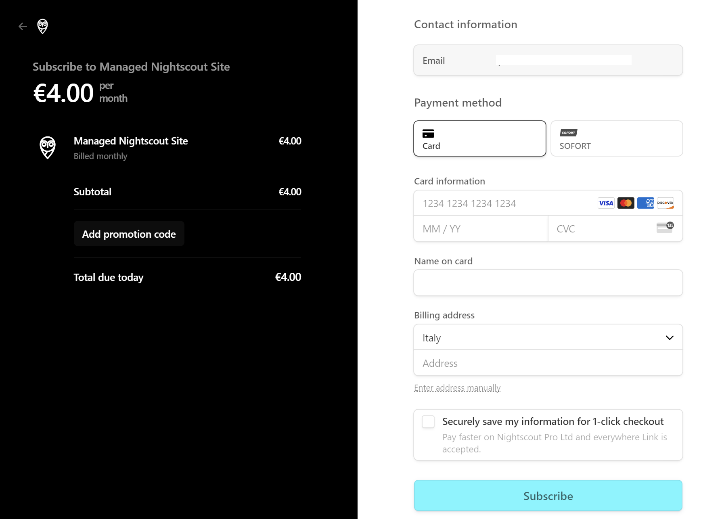

4. Scegli un nome per il tuo sito (solo lettere minuscole, numeri e trattino `-`). Se il nome è già in uso, scegline un altro.

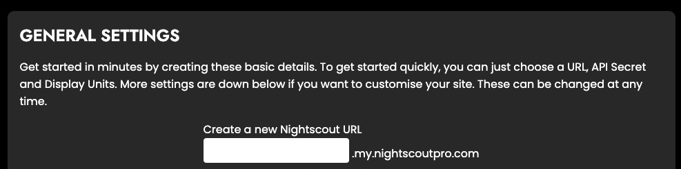

5. Scegli la **password del sito** (`API_SECRET`):
   - Almeno 12 caratteri (lettere maiuscole, minuscole, numeri)
   - Caratteri speciali consentiti: `!`, `-`, `_`
   - Vietati: spazi e caratteri `%`, `&`, `@`, `"`, `\`, `/`
6. Seleziona le unità di misura (mg/dL) e clicca **CREATE NIGHTSCOUT**.

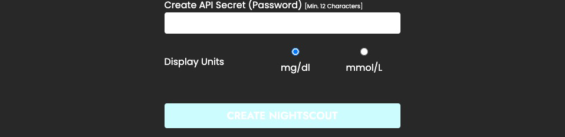

Il tuo sito è pronto.

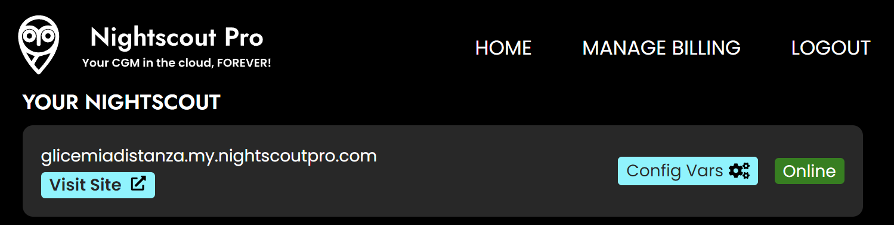

---

## 3. Configura il sito

1. Configura le variabili extra in **Config Vars** (organizzate per categoria).

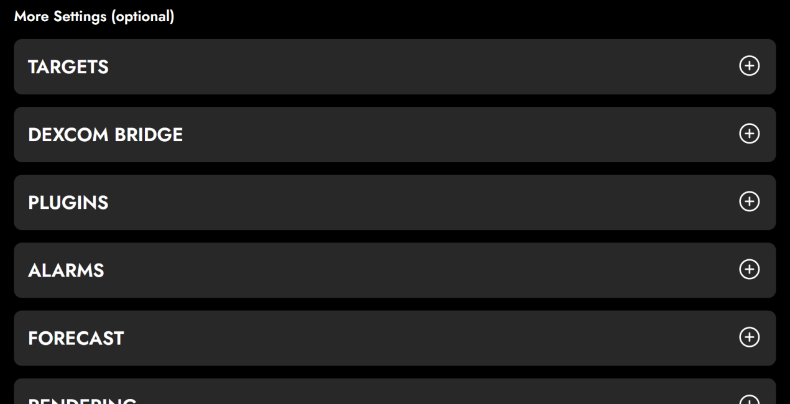

2. Se usi **Dexcom Share** come sorgente dati: inserisci login e password in **Dexcom Bridge** (sono le credenziali dell'app master collegata al sensore). Lascia il server impostato su `EU`.

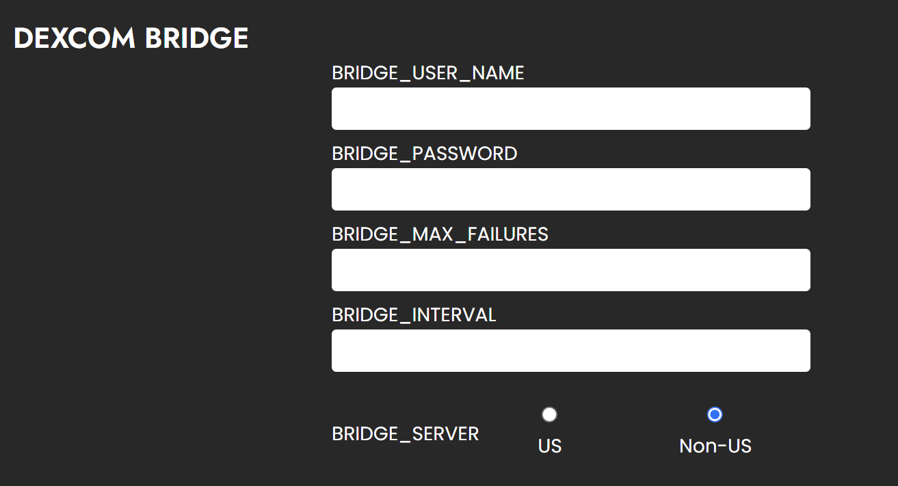

3. Clicca **Visit Site** per aprire il tuo sito Nightscout.

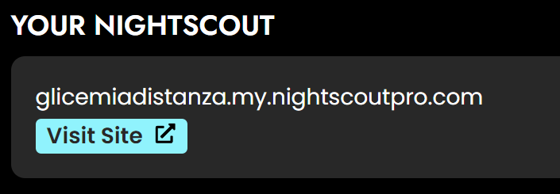

### Imposta il profilo

1. Nel menu del sito, seleziona **Profile Editor**.

2. Imposta il fuso orario: **Europe/Rome**

3. Scorri in fondo, clicca **Authenticate**, inserisci la tua `API_SECRET`, poi **Update** e **Save**.

Se usi Dexcom Share, i dati appariranno entro qualche minuto. Per xDrip+, xDrip4iOS, Spike, ecc.: inserisci l'indirizzo del tuo sito e l'`API_SECRET` nell'app.

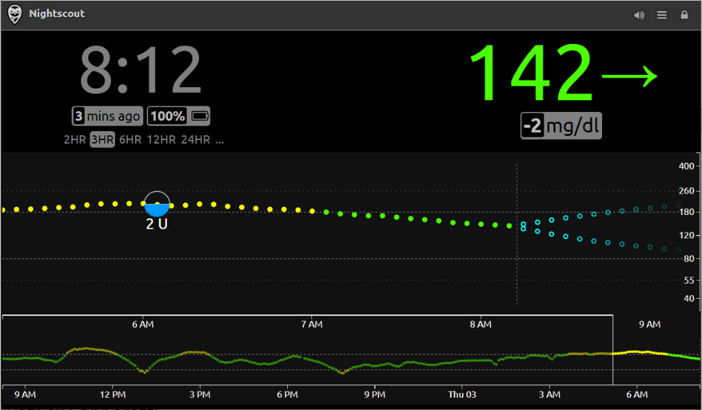
