# Nightscout Pro — Abbonamento a un sito Nightscout gestito

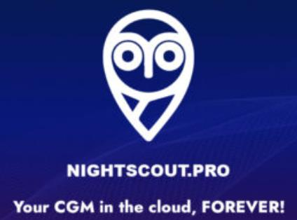

Nightscout Pro è un servizio di hosting Nightscout a pagamento, creato da Andy Low (sviluppatore web diabetico di tipo 1) nel dicembre 2022, nato dopo che Heroku ha abbandonato il piano gratuito.

Il vantaggio principale è la semplicità: non devi costruire o mantenere nulla. Gli aggiornamenti sono automatici. L'abbonamento parte da 4€/mese o 40€/anno, con piani anche trimestrali e semestrali:

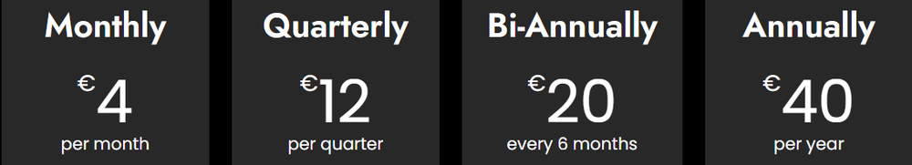

Il pagamento accetta le principali carte di credito:

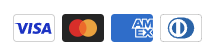

Per saperne di più su Nightscout: [`https://nightscout.github.io/`](https://nightscout.github.io/)

---

## 1. Crea un account

1. Vai su [`https://nightscout.pro/`](https://nightscout.pro/) e clicca **START MY CLOUD**:

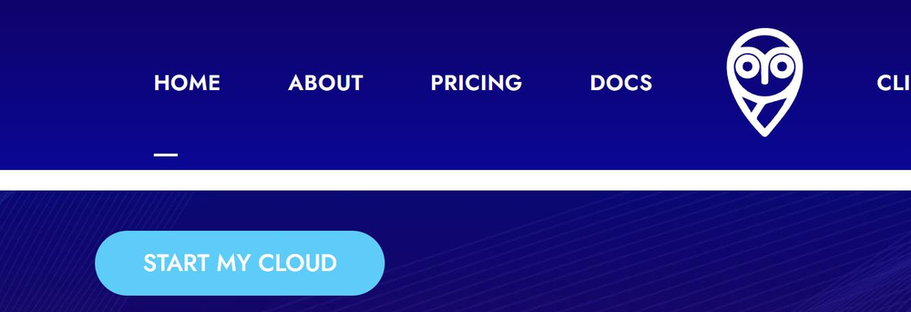

2. Inserisci il tuo indirizzo email (non usa e getta) e crea una password che rispetti i requisiti mostrati (minimo 12 caratteri, con maiuscole, minuscole, numeri e un carattere speciale) → **Sign Up**:

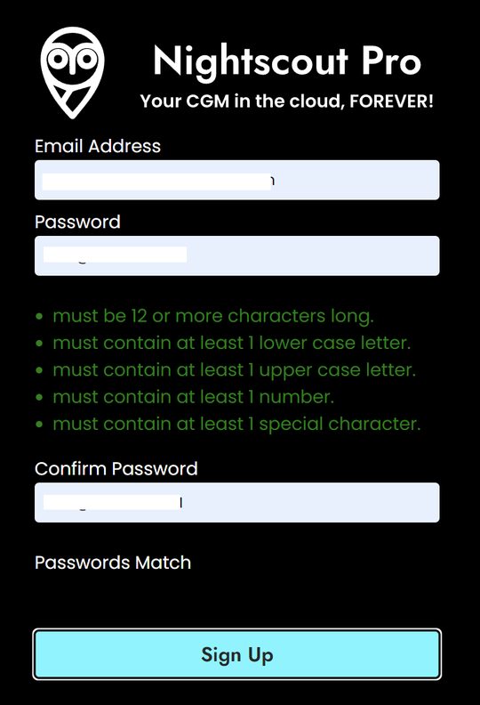

3. Da questo momento puoi accedere a [`https://my.nightscoutpro.com/`](https://my.nightscoutpro.com/) con queste credenziali.

---

## 2. Crea il tuo sito Nightscout

1. Clicca **CREATE A NEW NIGHTSCOUT SITE**:

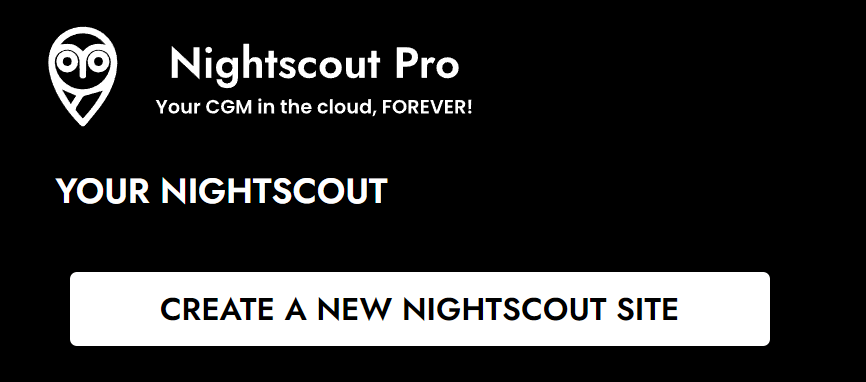

2. Scegli la valuta e il tipo di abbonamento:

   | Piano | Consiglio |
   |---|---|
   | Mensile | Se vuoi provare prima di impegnarti |
   | Trimestrale / Semestrale | Risparmio graduale |
   | Annuale | Il più conveniente sul lungo periodo |

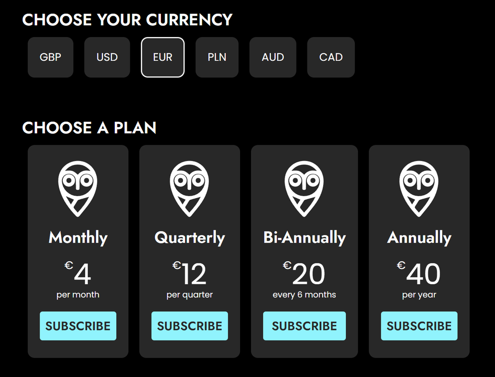

3. Clicca **SUBSCRIBE** per il piano scelto e inserisci una carta di credito per il pagamento:

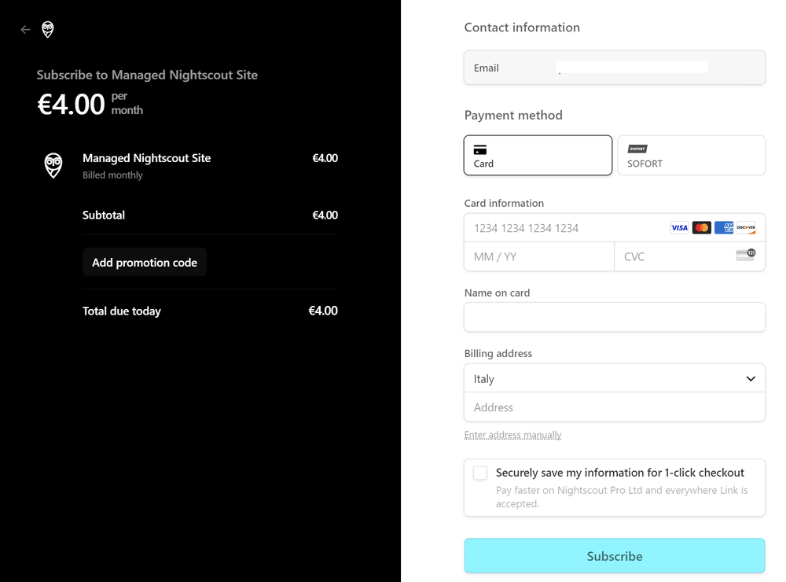

4. Scegli un nome per il tuo sito (solo lettere minuscole, numeri e trattino `-`). Se il nome è già in uso, scegline un altro:

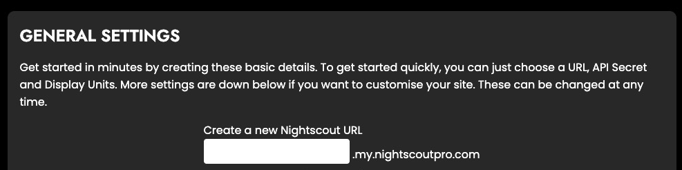

5. Scegli la **password del sito** (`API_SECRET`, minimo 12 caratteri) e le unità di misura (mg/dL o mmol/L), poi clicca **CREATE NIGHTSCOUT**:

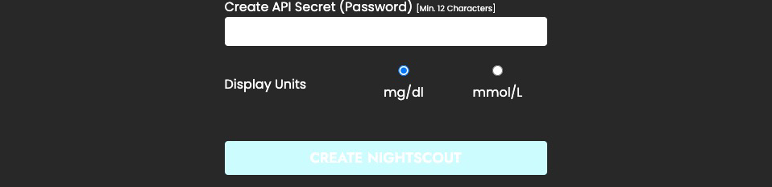

Il tuo sito è pronto: comparirà l'indirizzo con il pulsante **Visit Site** e lo stato **Online**:

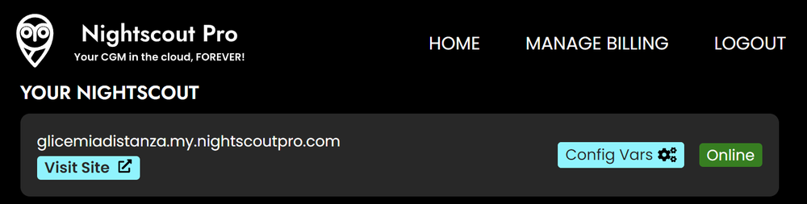

---

## 3. Configura il sito

1. Se vuoi personalizzare ulteriormente il sito, apri **Config Vars**: troverai le impostazioni extra organizzate per categoria (Targets, Dexcom Bridge, Plugins, Alarms, Forecast, Rendering...):

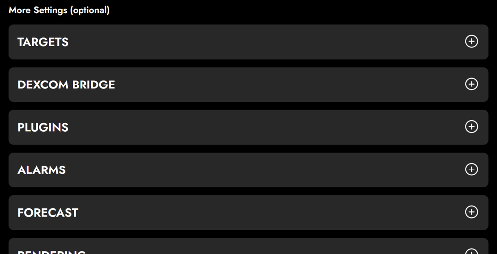

2. Se usi **Dexcom Share** come sorgente dati: apri la sezione **Dexcom Bridge** e inserisci login e password in `BRIDGE_USER_NAME` e `BRIDGE_PASSWORD` (sono le credenziali dell'app master collegata al sensore). Lascia `BRIDGE_SERVER` impostato su `Non-US`:

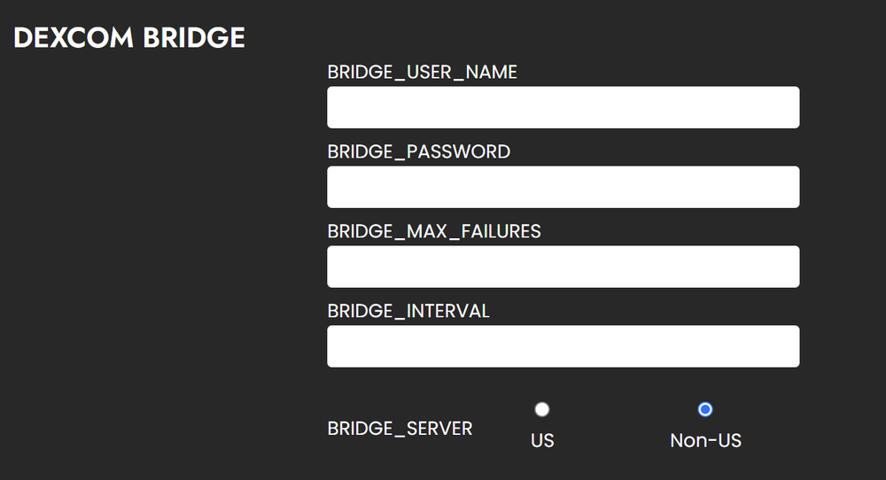

3. Torna alla pagina principale e clicca **Visit Site** per aprire il tuo sito Nightscout:

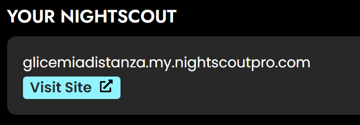

### Imposta il profilo

1. Nel menu del sito, seleziona **Profile Editor**:

2. Imposta il fuso orario: **Europe/Rome** (nell'esempio è mostrato `UTC`, da modificare):

3. Scorri in fondo, clicca **Authenticate**, inserisci la tua `API_SECRET` nella finestra **Device authentication**:

Clicca **Update**: lo stato di autenticazione passerà da "Unauthorized" ad "Admin authorized":

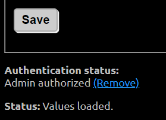

Clicca **Save**: ti verrà chiesto conferma del salvataggio nel nuovo formato del profilo...

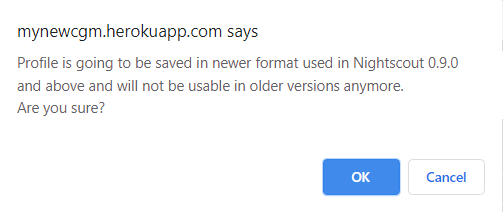

...e vedrai il messaggio di conferma **Status: success**:

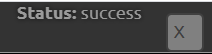

Se usi Dexcom Share, i dati appariranno entro qualche minuto. Per xDrip, xDrip4iOS, Spike, ecc.: inserisci l'indirizzo del tuo sito e l'`API_SECRET` nell'app. Ecco come apparirà il tuo sito Nightscout una volta che i dati iniziano ad arrivare:

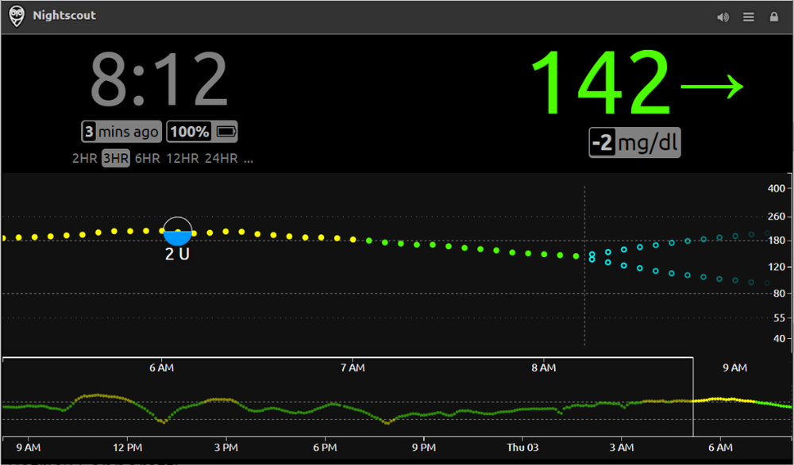
