# NS10BE (ZehnBe) — Abbonamento a un sito Nightscout gestito

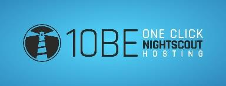

NS10BE è un servizio di hosting Nightscout creato da Martin Schiftan. Nasce come servizio gratuito basato su donazioni, ma a causa dell'elevato numero di utenti è diventato un abbonamento mensile (massimo 5€/mese). La quota serve a coprire la manutenzione dei server: il ricavato in eccesso viene devoluto alla comunità open source, principalmente al progetto AAPS.

Usare NS10BE significa avere Nightscout funzionante senza costruirlo da zero: aggiornamenti automatici, database da 2 GB (non si riempie facilmente), nessuna migrazione da una piattaforma all'altra.

Per saperne di più su Nightscout: `https://nightscout.github.io/`

---

## 1. Crea un account

1. Vai su `https://ns.10be.de/en/index.html` e clicca **Create an account**.

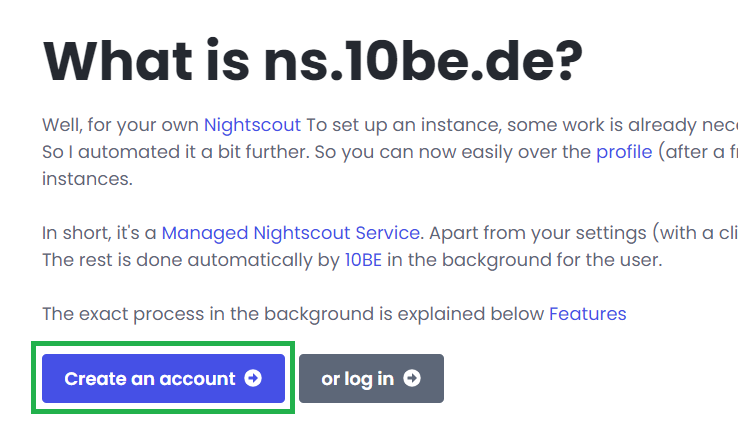

2. Inserisci un nome utente (inventalo tu), il tuo indirizzo email e il paese di residenza.

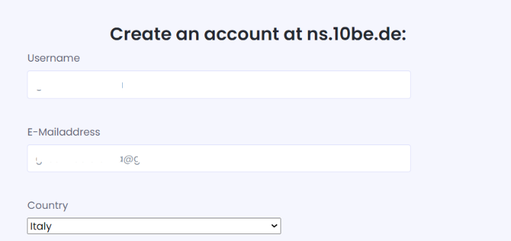

3. Leggi e accetta le condizioni di utilizzo (il servizio non è medico, è solo software di gestione delle informazioni).

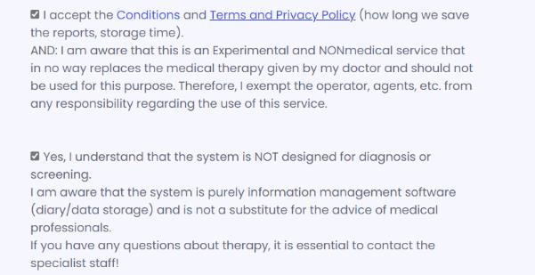

4. Risolvi il captcha e clicca **Create an account now for free**.

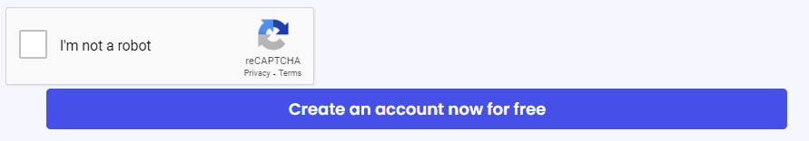

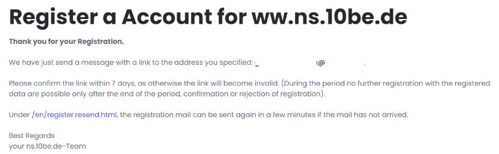

5. Controlla la tua email: riceverai un link di verifica. Se non arriva, controlla la cartella spam.

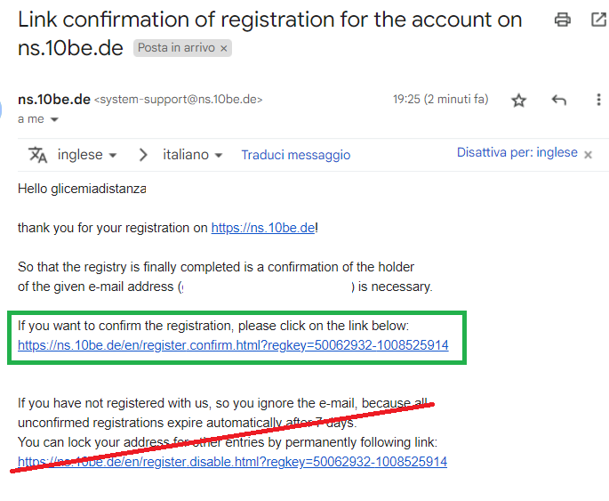

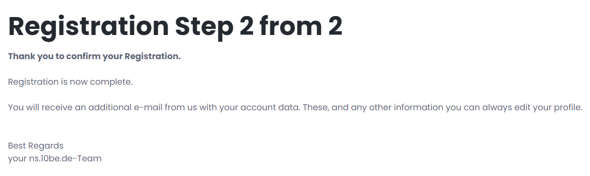

6. Dopo la verifica, controlla di nuovo la mail: troverai la password per il primo accesso.

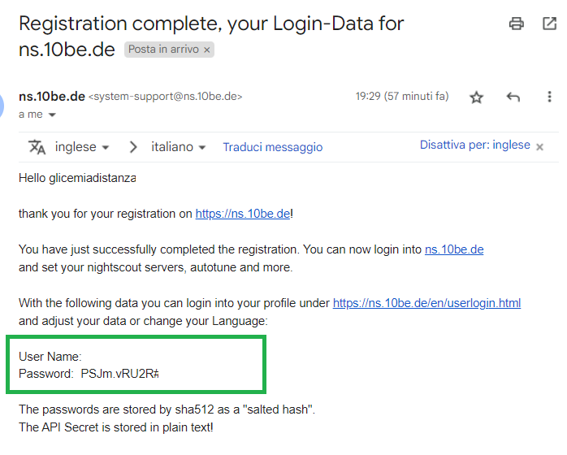

7. Accedi dal link in alto a destra nel sito con le credenziali ricevute.

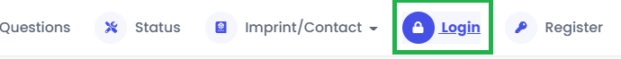

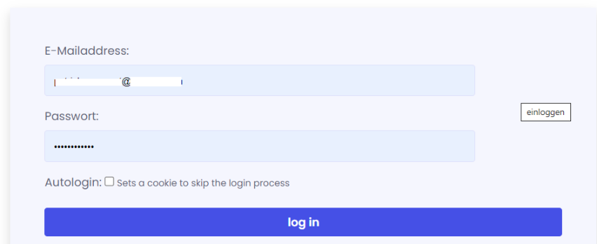

---

## 2. Crea il tuo server Nightscout

1. Nella tua home page, vai in **Server** e clicca **+Create Server**.

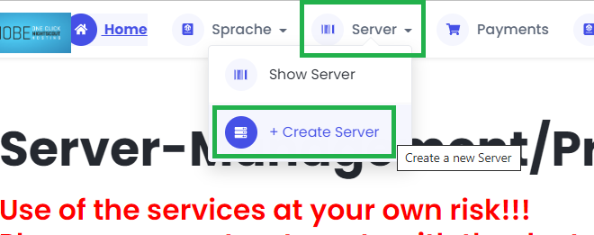

2. Accetta il trattamento dei dati (GDPR) e conferma di aver compreso lo scopo del servizio.

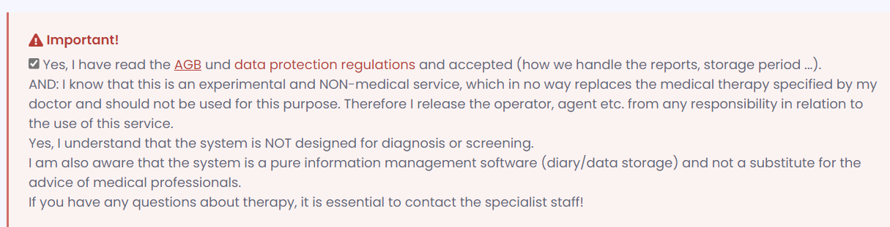

3. Scegli un **nome** per il tuo sito (solo minuscole, numeri e `-`). Se è già occupato, scegline un altro.
4. (Facoltativo) Inserisci un **Display-Name** per personalizzare il titolo della pagina.
5. Scegli la **API Password** (almeno 12 caratteri, meglio solo lettere e numeri — evita `!`, `#`, `%`, `&`, `/`, `=`).

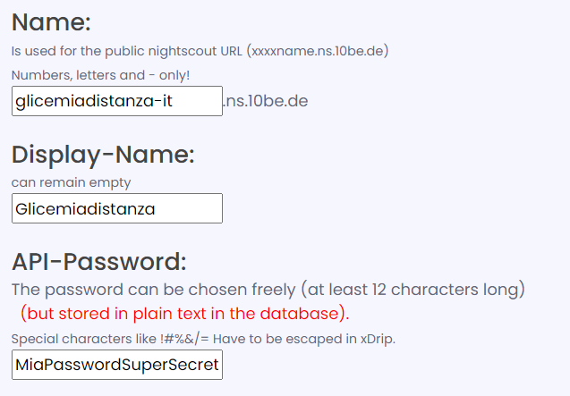

6. Se usi Spike o Loop, abilita **Without port**.

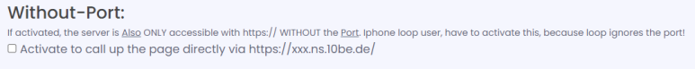

7. Imposta l'orologio su 24 ore, le soglie di allarme e la lingua (italiano) solo se lo sai fare — altrimenti lascia i valori predefiniti.

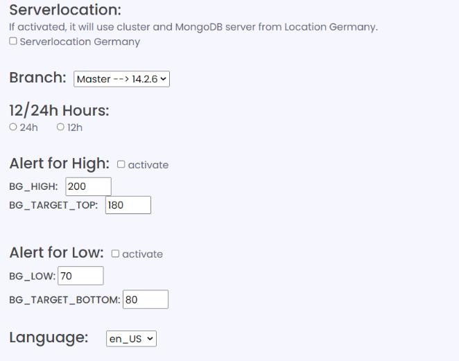

**Se usi Dexcom Share come sorgente dati:**
- Compila il campo **Login** e **Password** con le credenziali dell'app master collegata al sensore.
- Lascia il server impostato su `EU`.

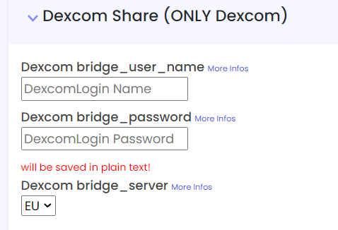

**Se usi un FSL 3 tramite LView:**
- Inserisci le credenziali di un follower LLink (non quelle dell'account LView).
- Seleziona il server corretto per il tuo paese o `EU`.

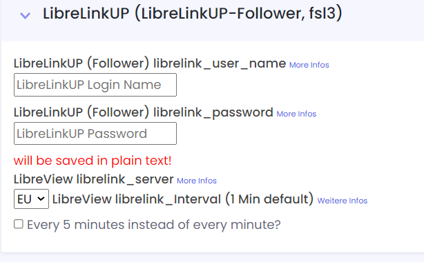

8. Clicca **Save server**.

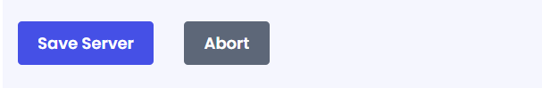

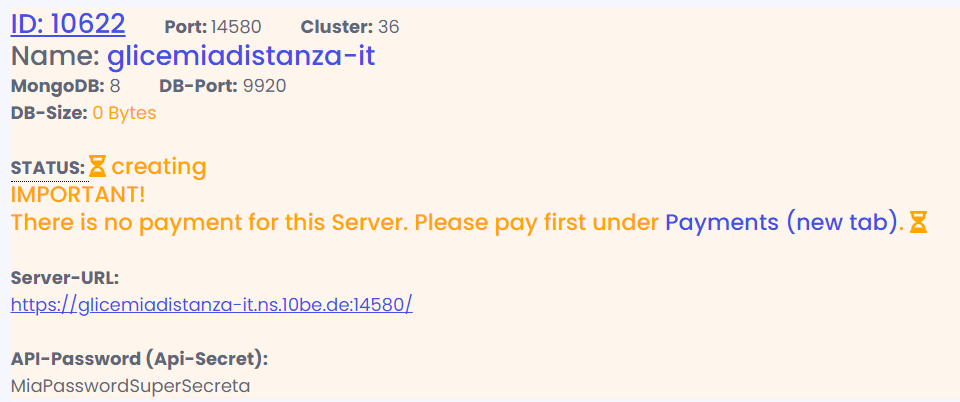

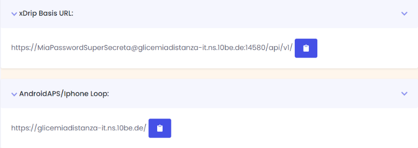

---

## 3. Attiva l'abbonamento

Il server è creato ma non ancora attivo: devi inserire un metodo di pagamento.

1. Segui il link che appare in pagina per il pagamento.

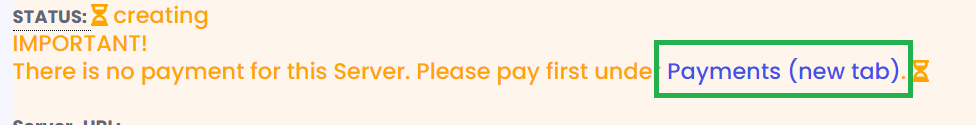

2. Scegli la durata dell'abbonamento: più mesi paghi, minore è il costo mensile. Per una prova, prendi solo un mese.

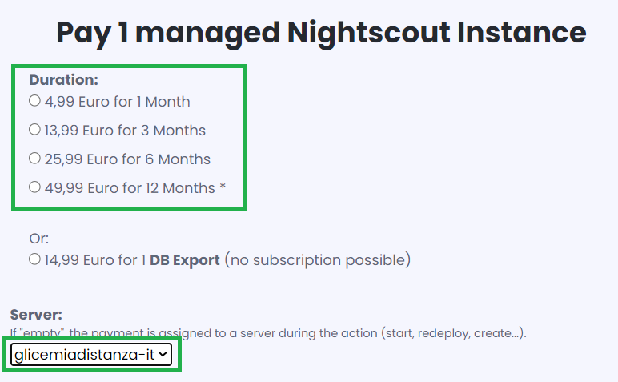

3. Seleziona se vuoi una **sottoscrizione automatica** (rinnovo automatico) o il pagamento singolo (dovrai ricordartelo alla scadenza — riceverai comunque una mail di avviso).

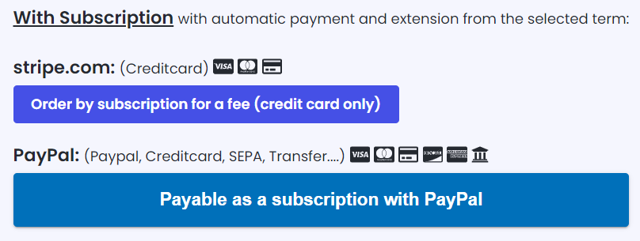

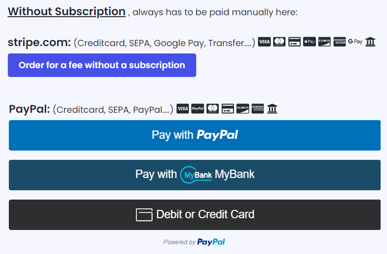

4. Verifica che il server selezionato sia quello appena creato prima di pagare.

---

## 4. Apri e configura il sito

1. Vai in **Server** e clicca il nome del tuo server.

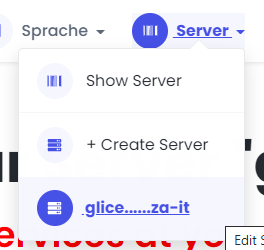

2. Seleziona il link del sito per aprire Nightscout.

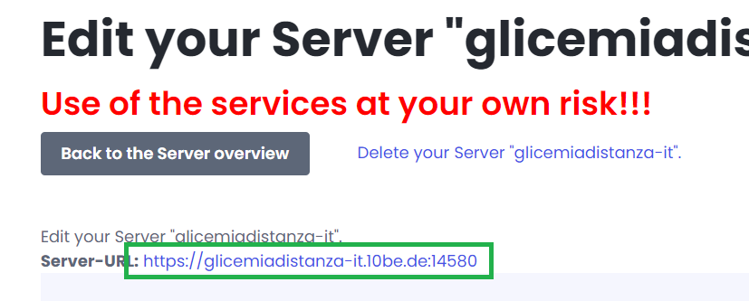

3. Clicca sul menu → **Profile Editor**.

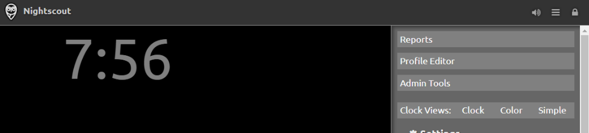

4. Imposta il fuso orario: **Europe/Rome**

5. Scorri in fondo, clicca **Authenticate**, inserisci l'API secret, poi **Update** e **Save**.

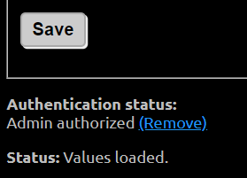

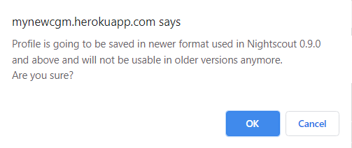

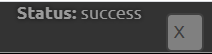

Se usi Dexcom Share, i dati appariranno entro qualche minuto. Per xDrip+, xDrip4iOS, Spike, ecc.: inserisci l'indirizzo del tuo sito e l'API secret nell'app.

