# NS10BE (ZehnBe) — Abbonamento a un sito Nightscout gestito

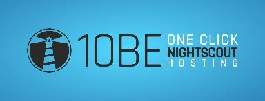

NS10BE è un servizio di hosting Nightscout creato da Martin Schiftan. Nasce come servizio gratuito basato su donazioni, ma a causa dell'elevato numero di utenti è diventato un abbonamento mensile (massimo 5€/mese). La quota serve a coprire la manutenzione dei server: il ricavato in eccesso viene devoluto alla comunità open source, principalmente al progetto AAPS.

Usare NS10BE significa avere Nightscout funzionante senza costruirlo da zero: aggiornamenti automatici, database da 2 GB (non si riempie facilmente), nessuna migrazione da una piattaforma all'altra.

Per saperne di più su Nightscout: [`https://nightscout.github.io/`](https://nightscout.github.io/)

---

## 1. Crea un account

1. Vai su [`https://ns.10be.de/en/index.html`](https://ns.10be.de/en/index.html) e clicca **Create an account**:

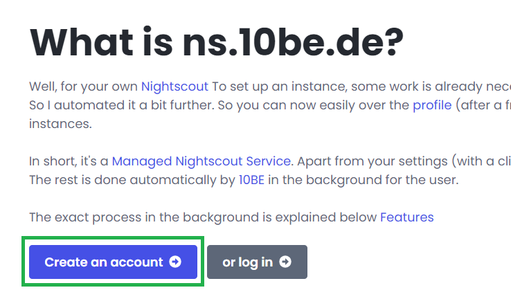

2. Inserisci un nome utente (inventalo tu), il tuo indirizzo email e il paese di residenza:

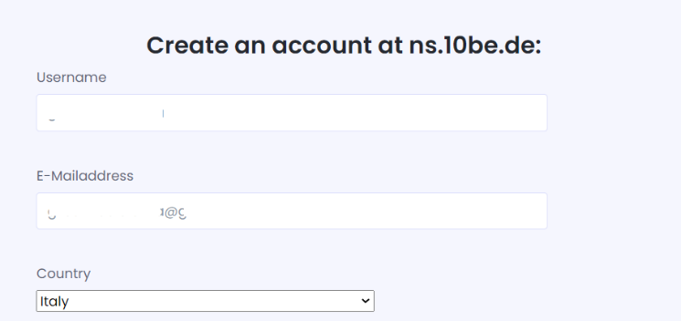

3. Leggi e accetta le condizioni di utilizzo (il servizio non è medico, è solo software di gestione delle informazioni):

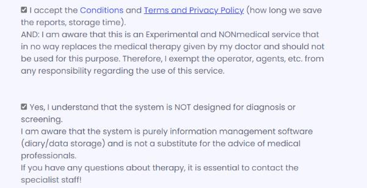

4. Risolvi il captcha **I'm not a robot** e clicca **Create an account now for free**:

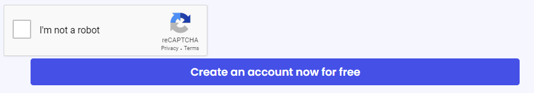

Vedrai la conferma che l'email di verifica è stata inviata:

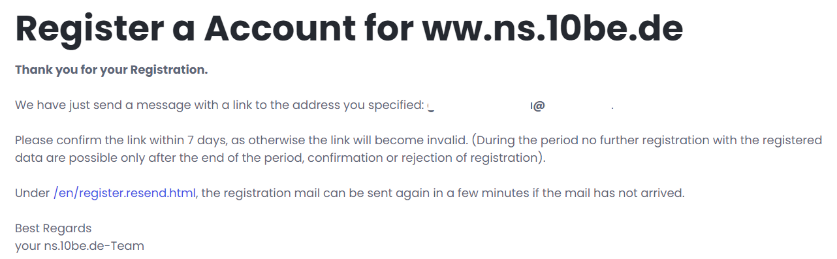

5. Controlla la tua email: riceverai un link di verifica. Se non arriva, controlla la cartella spam. Clicca sul link nell'email per confermare la registrazione:

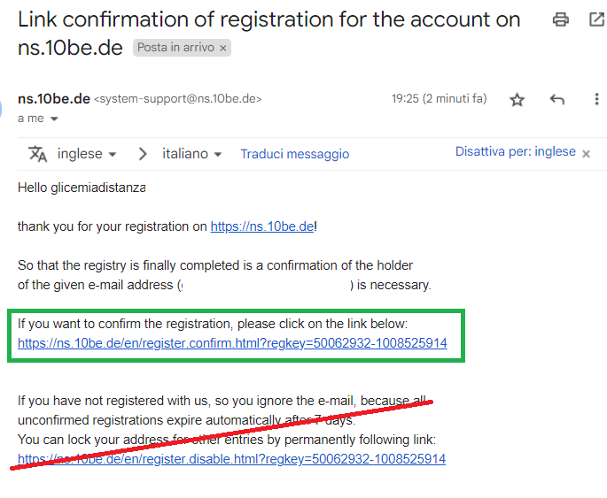

Vedrai la conferma del completamento della registrazione:

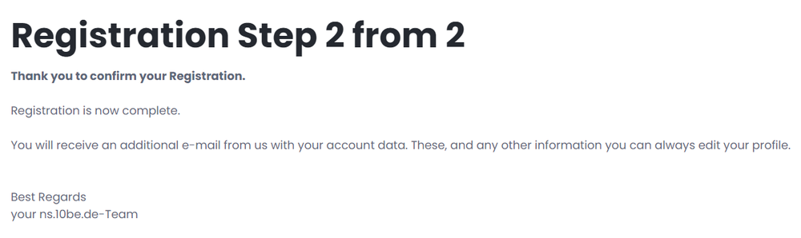

6. Dopo la verifica, controlla di nuovo la mail: troverai il nome utente e la password per il primo accesso:

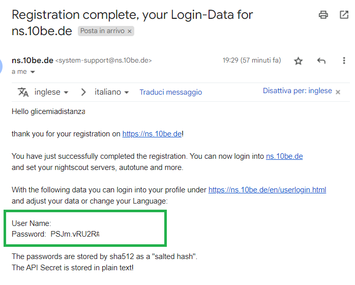

7. Accedi dal link **Login** in alto a destra nel sito:

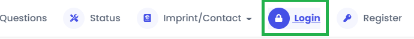

Inserisci l'email e la password ricevute via mail e clicca **log in**:

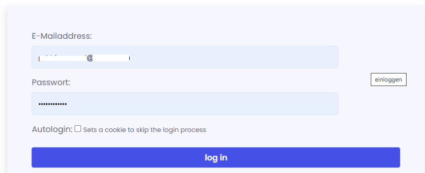

---

## 2. Crea il tuo server Nightscout

1. Nella tua home page, vai in **Server** e clicca **+Create Server**:

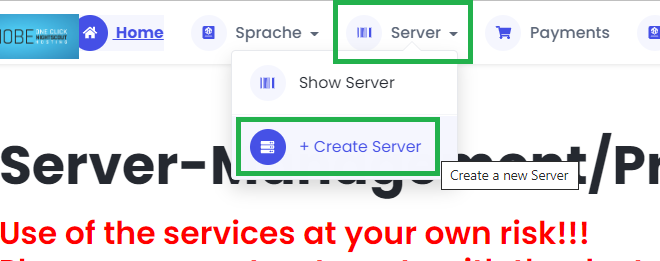

2. Accetta il trattamento dei dati (GDPR) e conferma di aver compreso lo scopo del servizio:

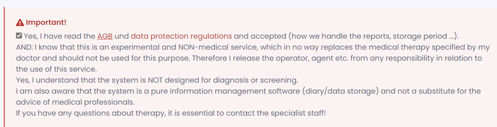

3. Scegli un **nome** per il tuo sito (solo minuscole, numeri e `-`; se è già occupato, scegline un altro), (facoltativo) un **Display-Name** per personalizzare il titolo della pagina, e l'**API Password** (almeno 12 caratteri, meglio solo lettere e numeri — evita `!`, `#`, `%`, `&`, `/`, `=`):

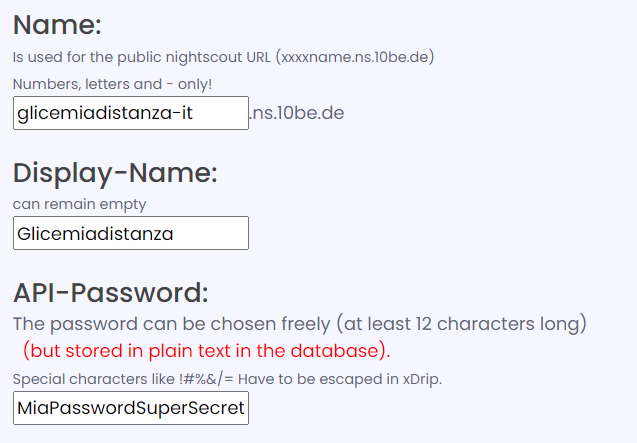

4. Se usi Spike o Loop, abilita **Without port**:

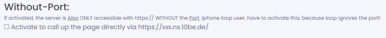

5. Imposta l'orologio su 24 ore, le soglie di allarme e la lingua (italiano) solo se lo sai fare — altrimenti lascia i valori predefiniti:

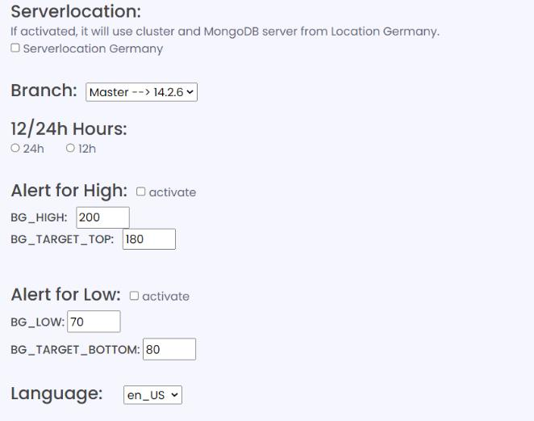

**Se usi Dexcom Share come sorgente dati:**
- Compila il campo **Login** e **Password** con le credenziali dell'app master collegata al sensore.
- Lascia il server impostato su `EU`.

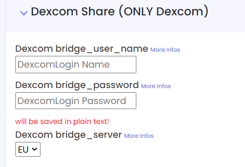

**Se usi un FSL3 tramite LView:**
- Inserisci le credenziali di un follower LLink (non quelle dell'account LView).
- Seleziona il server corretto per il tuo paese o `EU`.

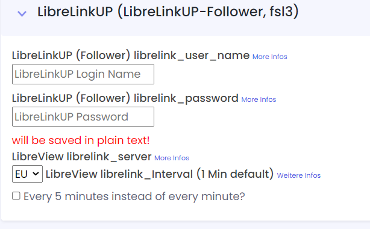

6. Clicca **Save Server**:

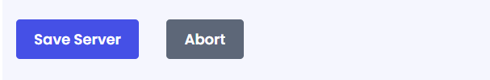

Il server viene creato con lo stato **creating**: da questa schermata trovi anche l'indirizzo del sito e l'API secret appena impostata (attenzione: il pagamento non è ancora attivo):

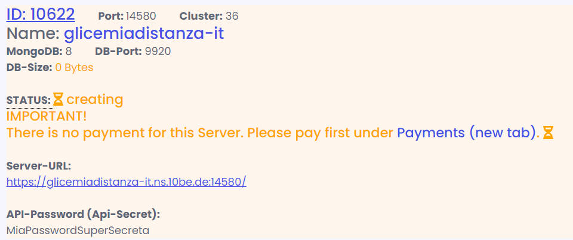

Più in basso nella stessa pagina trovi anche gli indirizzi già pronti per xDrip e per AndroidAPS/iPhone Loop, con l'API secret già inclusa nell'URL:

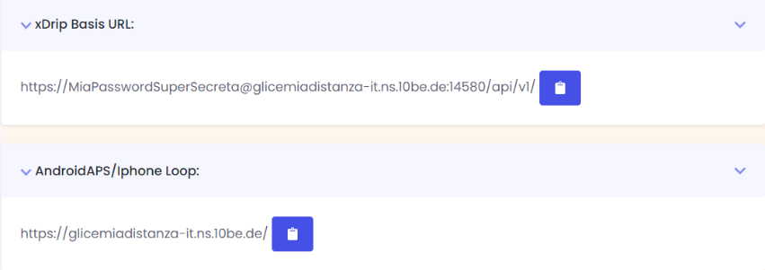

---

## 3. Attiva l'abbonamento

Il server è creato ma non ancora attivo: devi inserire un metodo di pagamento.

1. Segui il link **Payments (new tab)** che appare in pagina:

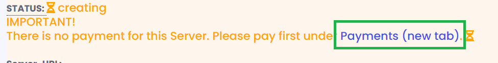

2. Scegli la durata dell'abbonamento e verifica che il server selezionato sia quello appena creato: più mesi paghi, minore è il costo mensile — per una prova, prendi solo un mese:

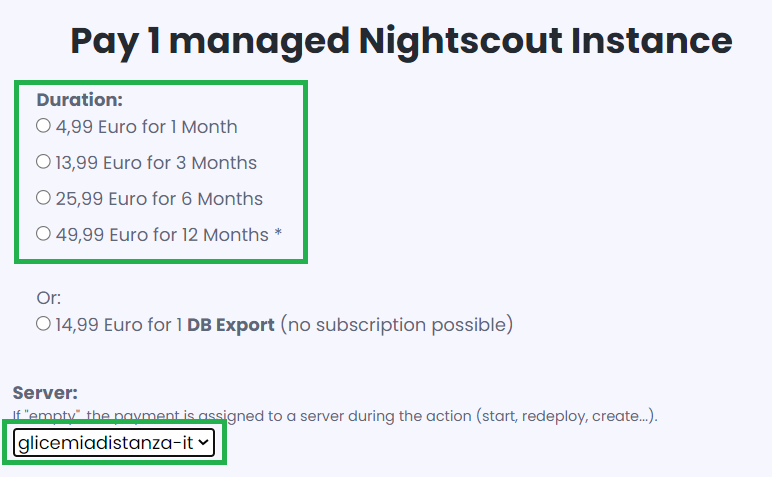

3. Seleziona se vuoi una **sottoscrizione automatica** (rinnovo automatico tramite Stripe o PayPal)...

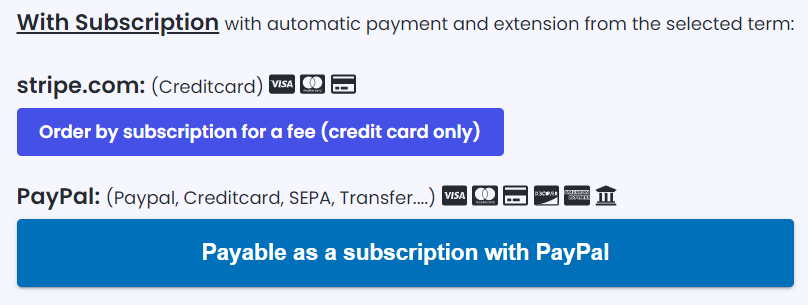

...oppure il pagamento singolo (dovrai ricordartelo alla scadenza — riceverai comunque una mail di avviso):

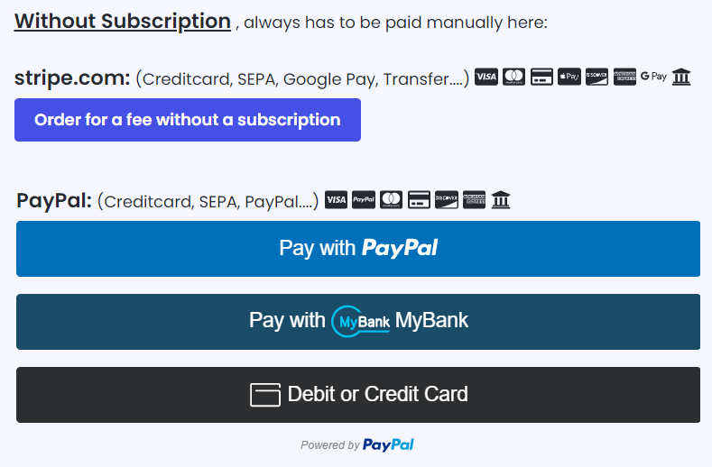

---

## 4. Apri e configura il sito

1. Vai in **Server** e clicca il nome del tuo server:

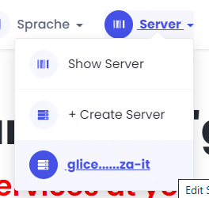

2. Nella pagina di modifica del server, seleziona il link **Server-URL** per aprire Nightscout:

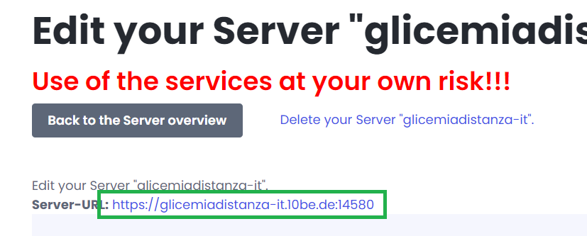

3. Sul sito Nightscout, clicca sul menu → **Profile Editor**:

4. Imposta il fuso orario: **Europe/Rome** (nell'esempio è mostrato `UTC`, da modificare):

5. Scorri in fondo, clicca **Authenticate**, poi inserisci l'API secret nella finestra **Device authentication**:

Clicca **Update**: lo stato di autenticazione passerà da "Unauthorized" ad "Admin authorized":

Clicca **Save**: ti verrà chiesta conferma del salvataggio nel nuovo formato del profilo...

...e vedrai il messaggio di conferma **Status: success**:

Se usi Dexcom Share, i dati appariranno entro qualche minuto. Per xDrip, xDrip4iOS, Spike, ecc.: inserisci l'indirizzo del tuo sito e l'API secret nell'app. Ecco come apparirà il tuo sito Nightscout una volta che i dati iniziano ad arrivare:

