# Sentinel Pro — Guida utenti

**Versione:** 0.1.2  
**Traduzione e adattamento:** glicemiadistanza.it (by Ryan Chen)

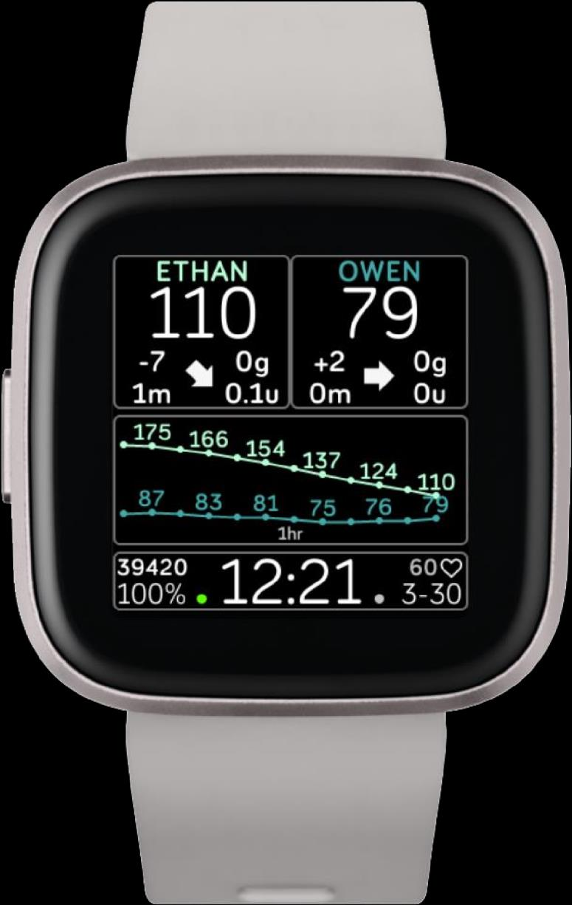

## 1. Caratteristiche

**Sorgenti dati supportate:** Nightscout, Dexcom Share, xDrip+, Diabox

**Orologi supportati:** Versa, Versa 2, Versa Lite, Ionic

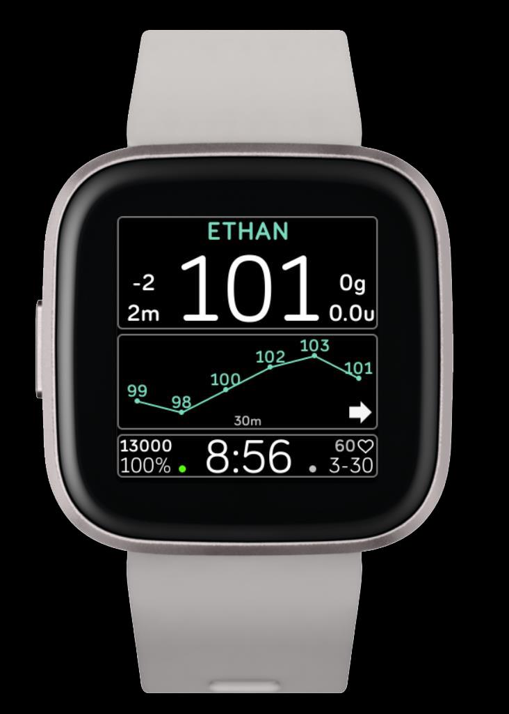

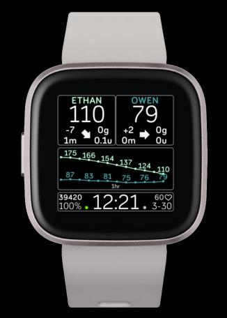

**Funzionalità principali:**
- Monitoraggio da 1 a 3 persone
- Integrazione con Nightscout Careportal
- Visualizzazione di: CHO attivi, ultimo bolo, insulina attiva (IOB), ultimo controllo capillare
- Grafico della glicemia: 30 min, 1h, 2h
- Contapassi giornalieri e battito cardiaco

**Allarmi:**
- Allarme glucosio alto
- Allarme glucosio basso
- Allarme Delta crescente (soglia definita dall'utente)
- Allarme Delta calante (soglia definita dall'utente)
- Allarme freccia in su (tendenza)
- Allarme freccia in giù (tendenza)
- Allarme dati vecchi (soglia definita dall'utente)
- Allarme Ninja (nuovo): nessun messaggio pop-up né tasto di conferma

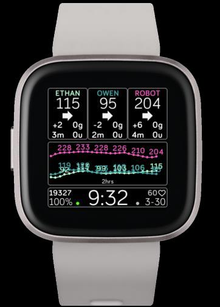

## 2. Visualizzazione del quadrante

Gli elementi principali del quadrante sono:

- **Glicemia da sensore** — visualizzabile in mg/dL o mmol/L
- **Carboidrati attivi (COB)** — dati provenienti da Nightscout
- **Delta glicemico** — differenza tra 2 valori glicemici consecutivi
- **Insulina attiva (IOB)** — dati provenienti da Nightscout
- **Tempo dall'ultima lettura** — *[testo non recuperabile dalla conversione PDF — consultare la documentazione originale di Sentinel]*
- **Freccia di tendenza** — direzione e velocità di variazione della glicemia

- **Contapassi (STEPS)** — passi giornalieri
- **Grafico** — visualizzabile a 30 min, 1h o 2h
- **Battito cardiaco**
- **Data**
- **Batteria orologio**
- **Indicatore di connessione** — mostra la richiesta e ricezione dati tra orologio e telefono

- **Ora** — formato 12HR o 24HR

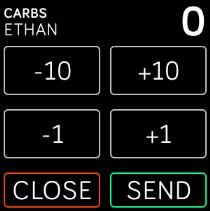

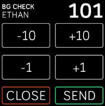

- **Trattamenti Nightscout** — invio trattamenti tramite Careportal

## 3. Funzioni principali

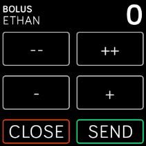

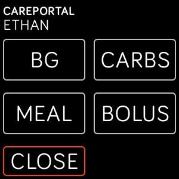

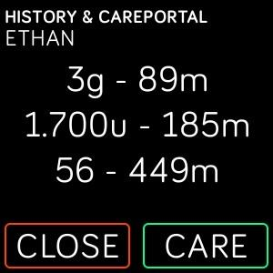

- **Tasto Account**: accesso allo storico (history) e a Nightscout Careportal per l'inserimento dei trattamenti.

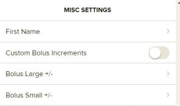

- **Tasto Grafico**: cambia il grafico tra 30 min, 1h e 2h.

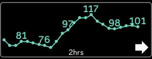

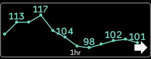

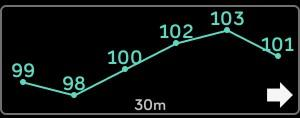

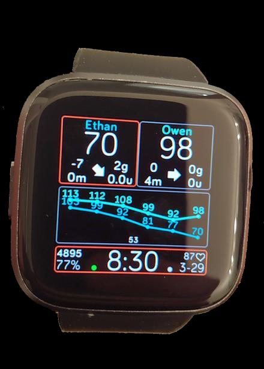

- **Allarme Ninja**: annulla tutti gli altri allarmi. Si imposta nelle impostazioni dell'app del telefono. Durante un allarme attivo, tieni premuto il pulsante per attivare la funzione Ninja. Il quadrato verde sul quadrante indica che l'allarme Ninja è attivo.

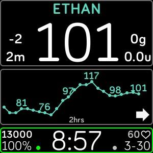

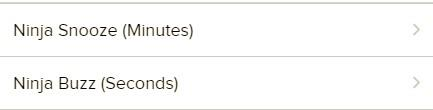

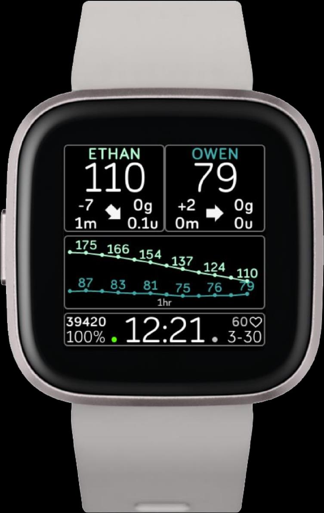

## 4. Indicatori — Connessione e comunicazione

### Stato Peersocket (canale di comunicazione orologio ↔ telefono)

| Stato Peersocket | Modalità | Operazione |
|---|---|---|
| APERTO | Usa messaggi | Richiesta dati / Ricezione dati |
| CHIUSO | Trasferimento file | Richiesta dati / Prova trasferimento files |
| ERRORE | — | Fallimento richiesta |
| NESSUN STATO | — | Standby |

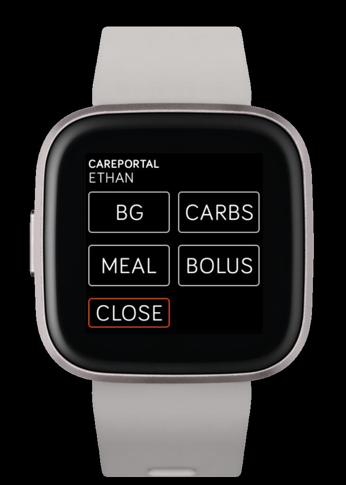

### Uso con Nightscout protetto da token

1. Vai alla tua pagina Nightscout e clicca su **NS-DatiMongo**. Copia il token generato.

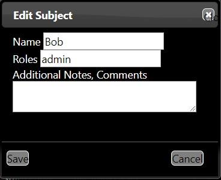

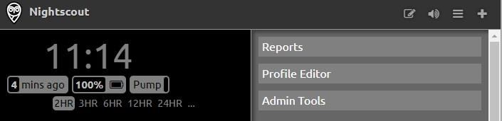

2. Incolla il token nelle impostazioni del quadrante del telefono, nel campo **NS Careportal Token**, e salva.

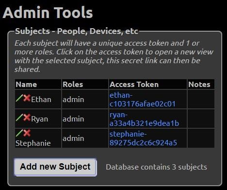

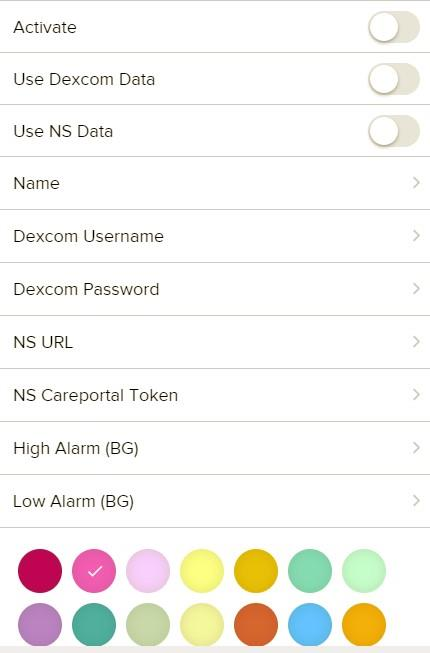

3. Premi **Aggiungi nuovo soggetto**, scrivi il nome e nel campo **ruoli** scrivi `admin`.

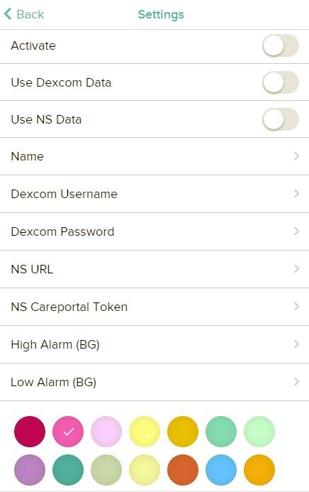

4. Copia il codice sotto **Gettone d'accesso**.

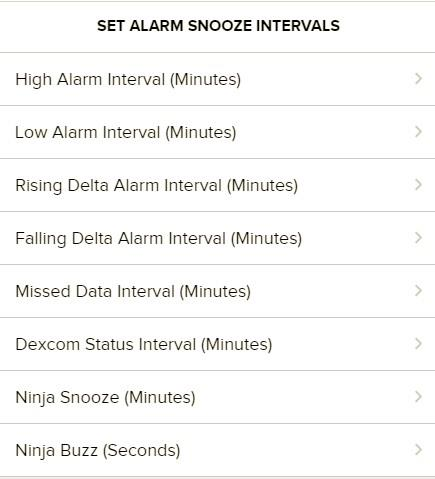

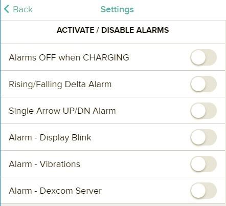

## 5. Careportal

- Prima imposta tutto, poi abilita **Activate**.

- Si possono usare contemporaneamente sia Dexcom Share che Nightscout: in questo modo avrai le glicemie da Dexcom e i trattamenti da Nightscout tramite NS Careportal.

- È presente un allarme automatico se Dexcom Share non è disponibile.

- Nell'URL di Nightscout, non inserire `/` alla fine: usa solo `.com`.

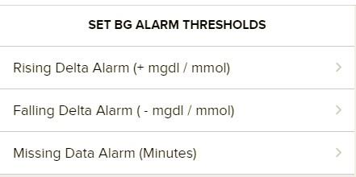

- Ogni account ha le proprie soglie di allarme.

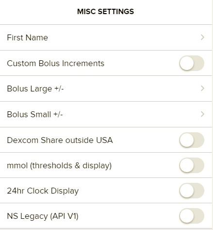

- Se usi Dexcom Share come sorgente dati, devi attivare la condivisione (Share) dall'app Dexcom.

- Dal telefono master, assicurati di avere almeno un telefono follower attivo.

> ⚠️ Prima di usare il quadrante, prenditi il tempo di inserire tutti i dati nelle impostazioni.

## Informazioni e supporto

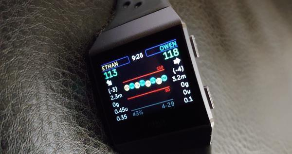

Il quadrante Sentinel per il Fitbit è stato creato da Ryan Chen, papà di due bambini con diabete di tipo 1 (Ethan e Owen). Il progetto è ancora in sviluppo. Per domande o commenti, pubblica nella pagina Facebook del gruppo Sentinel:

`https://www.facebook.com/groups/3185325128159614/`

> ⚠️ *Questo quadrante è solo per supporto e non deve essere usato per prendere decisioni mediche.*

Preparati a eventuali errori di connessione che si verificheranno di tanto in tanto. Per risolvere i problemi più comuni:
1. Cambia quadrante e poi torna al quadrante Sentinel.
2. Se il problema persiste, riavvia l'app del telefono o il telefono stesso.

**Versioni disponibili:** Sentinel Pro, Sentinel Classic, Sentinel One, Sentinel Basic

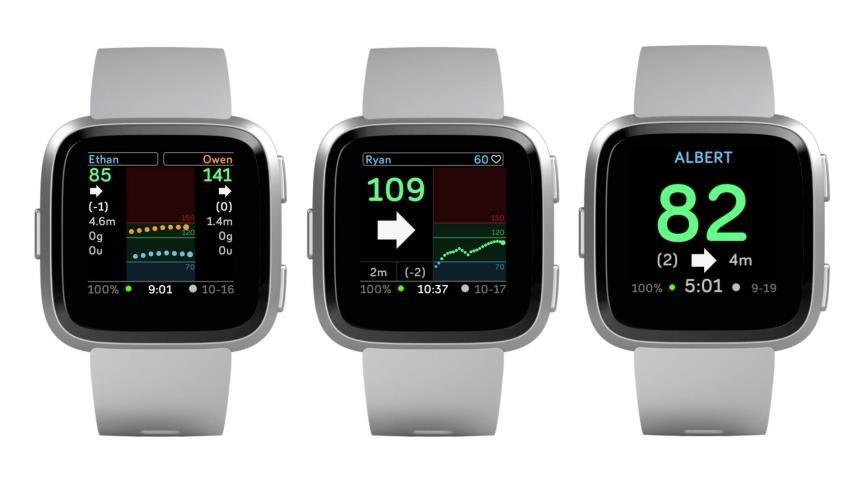

Sentinel è gratuito per tutti. Per supportare il progetto: `https://paypal.me/ryanwchen`
