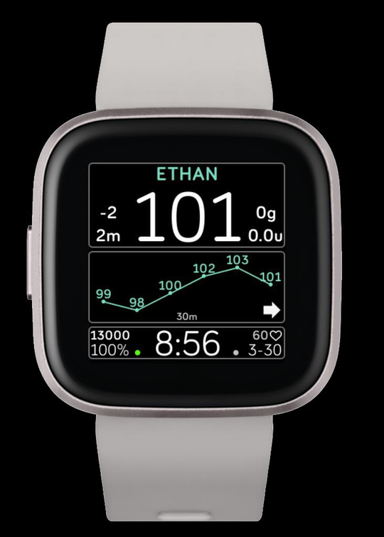
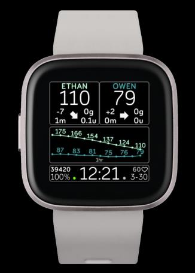
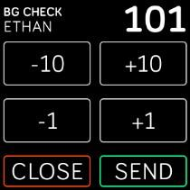
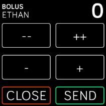
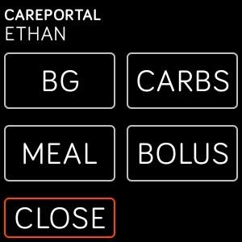
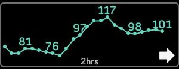
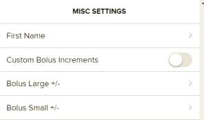
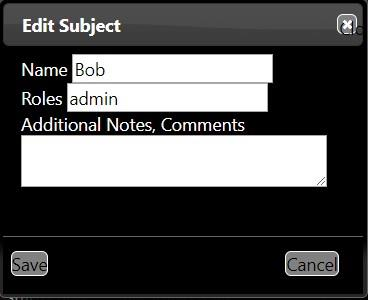
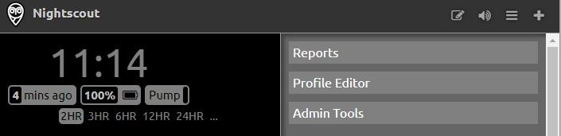
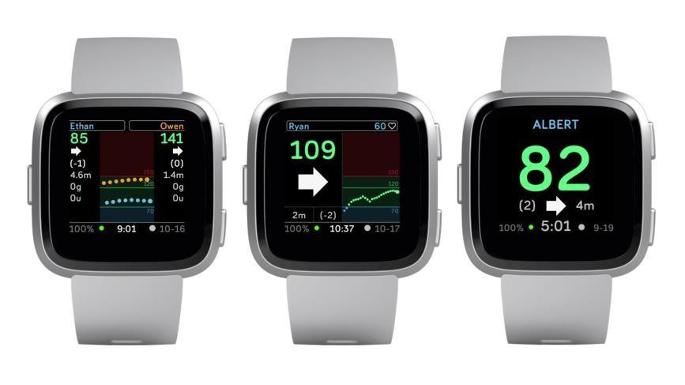

# Sentinel Pro — Guida utenti

> ⚠️ **Attenzione**: Sentinel ormai è a pagamento.

**Versione:** 0.1.2  
**Traduzione e adattamento:** glicemiadistanza.it (by Ryan Chen)

Il quadrante Sentinel Pro può mostrare fino a 3 persone monitorate insieme, con glicemia, grafico e trend di ognuna:

## 1. Caratteristiche

**Sorgenti dati supportate:** Nightscout, Dexcom Share, xDrip, Diabox

**Orologi supportati:** Versa, Versa 2, Versa Lite, Ionic

Se monitori una sola persona, il quadrante dedica più spazio al grafico (qui a 30 minuti):

Con due persone monitorate il quadrante si divide a metà, ognuna con il proprio grafico a 1 ora:

**Funzionalità principali:**
- Monitoraggio da 1 a 3 persone
- Integrazione con Nightscout Careportal
- Visualizzazione di: CHO attivi, ultimo bolo, insulina attiva (IOB), ultimo controllo capillare
- Grafico della glicemia: 30 min, 1h, 2h
- Contapassi giornalieri e battito cardiaco

Con 3 persone monitorate contemporaneamente (qui Ethan, Owen e un profilo di prova "Robot"), lo spazio per ciascun grafico si riduce ulteriormente:

**Allarmi:**
- Allarme glucosio alto
- Allarme glucosio basso
- Allarme Delta crescente (soglia definita dall'utente)
- Allarme Delta calante (soglia definita dall'utente)
- Allarme freccia in su (tendenza)
- Allarme freccia in giù (tendenza)
- Allarme dati vecchi (soglia definita dall'utente)
- Allarme Ninja (nuovo): nessun messaggio pop-up né tasto di conferma

## 2. Visualizzazione del quadrante

Gli elementi principali del quadrante sono:

- **Glicemia da sensore** — visualizzabile in mg/dL o mmol/L
- **Carboidrati attivi (COB)** — dati provenienti da Nightscout
- **Delta glicemico** — differenza tra 2 valori glicemici consecutivi
- **Insulina attiva (IOB)** — dati provenienti da Nightscout
- **Tempo dall'ultima lettura** — *[testo non recuperabile dalla conversione PDF — consultare la documentazione originale di Sentinel]*
- **Freccia di tendenza** — direzione e velocità di variazione della glicemia
- **Contapassi (STEPS)** — passi giornalieri
- **Grafico** — visualizzabile a 30 min, 1h o 2h
- **Battito cardiaco**
- **Data**
- **Batteria orologio**
- **Indicatore di connessione** — mostra la richiesta e ricezione dati tra orologio e telefono
- **Ora** — formato 12HR o 24HR

**Trattamenti Nightscout** — dal quadrante puoi inviare trattamenti a Nightscout tramite Careportal, senza dover usare il telefono. Ecco le schermate di inserimento:

- Inserimento carboidrati (**CARBS**):

- Controllo capillare (**BG CHECK**):

- Inserimento bolo (**BOLUS**):

- Menu **CAREPORTAL** da cui scegliere il tipo di trattamento (BG, CARBS, MEAL, BOLUS):

- Riepilogo **HISTORY & CAREPORTAL**: mostra l'ultimo carico di carboidrati, l'insulina e la glicemia inseriti, con il tempo trascorso:

- Quando l'invio va a buon fine, il quadrante conferma con **CAREPORTAL ENTRY RECEIVED**:

## 3. Funzioni principali

Il grafico può essere richiamato a 3 diverse ampiezze. A 2 ore:

A 1 ora:

A 30 minuti:

- **Tasto Account**: accesso allo storico (history) e a Nightscout Careportal per l'inserimento dei trattamenti. Nelle impostazioni del telefono puoi anche personalizzare gli incrementi del bolo (**MISC SETTINGS**):

- **Tasto Grafico**: cambia il grafico tra 30 min, 1h e 2h (vedi le tre schermate qui sopra).

- **Allarme Ninja**: annulla tutti gli altri allarmi. Si imposta nelle impostazioni dell'app del telefono. Durante un allarme attivo, tieni premuto il pulsante per attivare la funzione Ninja. Il quadrato verde sul quadrante indica che l'allarme Ninja è attivo:

Nelle impostazioni del telefono puoi regolare la durata dello snooze e del buzz del Ninja:

Ecco il quadrante Sentinel Pro visto direttamente su un Fitbit Versa al polso, con due persone monitorate:

E lo stesso quadrante fotografato su un altro dispositivo, per confronto:

## 4. Indicatori — Connessione e comunicazione

L'intestazione della tua pagina Nightscout mostra l'orario dell'ultimo dato, quanto tempo fa è arrivato (**4 mins ago**), la batteria del sensore/pompa e il pulsante **Pump**:

### Stato Peersocket (canale di comunicazione orologio ↔ telefono)

| Stato Peersocket | Modalità | Operazione |
|---|---|---|
| APERTO | Usa messaggi | Richiesta dati / Ricezione dati |
| CHIUSO | Trasferimento file | Richiesta dati / Prova trasferimento files |
| ERRORE | — | Fallimento richiesta |
| NESSUN STATO | — | Standby |

### Uso con Nightscout protetto da token

1. Vai alla tua pagina Nightscout e clicca su **NS-DatiMongo**, poi su **Admin Tools**:

2. Premi **Aggiungi nuovo soggetto** (**Add new Subject**), scrivi il nome e nel campo **Roles** scrivi `admin`:

3. Salva: il nuovo soggetto compare nella tabella **Subjects**, ognuno con il proprio **Access Token**:

4. Copia il token del soggetto che vuoi usare e incollalo nelle impostazioni del telefono, nel campo **NS Careportal Token**, insieme all'indirizzo di Nightscout (**NS URL**) e alle soglie di allarme:

La stessa schermata di impostazioni, vista scorrendo dall'inizio:

## 5. Careportal

- Prima imposta tutto, poi abilita **Activate**.
- Si possono usare contemporaneamente sia Dexcom Share che Nightscout: in questo modo avrai le glicemie da Dexcom e i trattamenti da Nightscout tramite NS Careportal.
- È presente un allarme automatico se Dexcom Share non è disponibile.
- Nell'URL di Nightscout, non inserire `/` alla fine: usa solo `.com`.
- Ogni account ha le proprie soglie di allarme. Puoi impostare gli intervalli di ripetizione (**SET ALARM SNOOZE INTERVALS**) per ogni tipo di allarme:

Puoi attivare o disattivare singolarmente ogni allarme (**ACTIVATE / DISABLE ALARMS**), incluso lo spegnimento automatico durante la carica:

E puoi impostare le soglie numeriche degli allarmi Delta e dati mancanti (**SET BG ALARM THRESHOLDS**):

- Se usi Dexcom Share come sorgente dati, devi attivare la condivisione (Share) dall'app Dexcom.
- Dal telefono master, assicurati di avere almeno un telefono follower attivo.

Nelle impostazioni varie (**MISC SETTINGS**) trovi anche le unità mmol, l'orologio a 24 ore e la compatibilità con Nightscout in modalità legacy (API v1):

> ⚠️ Prima di usare il quadrante, prenditi il tempo di inserire tutti i dati nelle impostazioni.

## Informazioni e supporto

Il quadrante Sentinel Pro indossato su un Fitbit Ionic, con le barre di soglia allarme visibili sotto ogni valore:

Il quadrante Sentinel per il Fitbit è stato creato da Ryan Chen, papà di due bambini con diabete di tipo 1 (Ethan e Owen). Il progetto è ancora in sviluppo. Per domande o commenti, pubblica nella pagina Facebook del gruppo Sentinel:

[`https://www.facebook.com/groups/3185325128159614/`](https://www.facebook.com/groups/3185325128159614/)

> ⚠️ *Questo quadrante è solo per supporto e non deve essere usato per prendere decisioni mediche.*

Preparati a eventuali errori di connessione che si verificheranno di tanto in tanto. Per risolvere i problemi più comuni:
1. Cambia quadrante e poi torna al quadrante Sentinel.
2. Se il problema persiste, riavvia l'app del telefono o il telefono stesso.

**Versioni disponibili:** Sentinel Pro, Sentinel Classic, Sentinel One, Sentinel Basic. Ecco alcuni esempi di configurazioni diverse (monitoraggio doppio, singolo con nome e cuore, singolo minimale):

Sentinel è gratuito per tutti. Per supportare il progetto: [`https://paypal.me/ryanwchen`](https://paypal.me/ryanwchen)
