# Sentinel One — Guida utenti

> ⚠️ **Attenzione**: Sentinel ormai è a pagamento.

**Versione:** 1.0  
**Traduzione e adattamento:** glicemiadistanza.it (by Ryan Chen)

Sentinel One è un quadrante per Fitbit pensato per il monitoraggio di una singola persona, con glicemia, freccia di tendenza e grafico ben in vista:

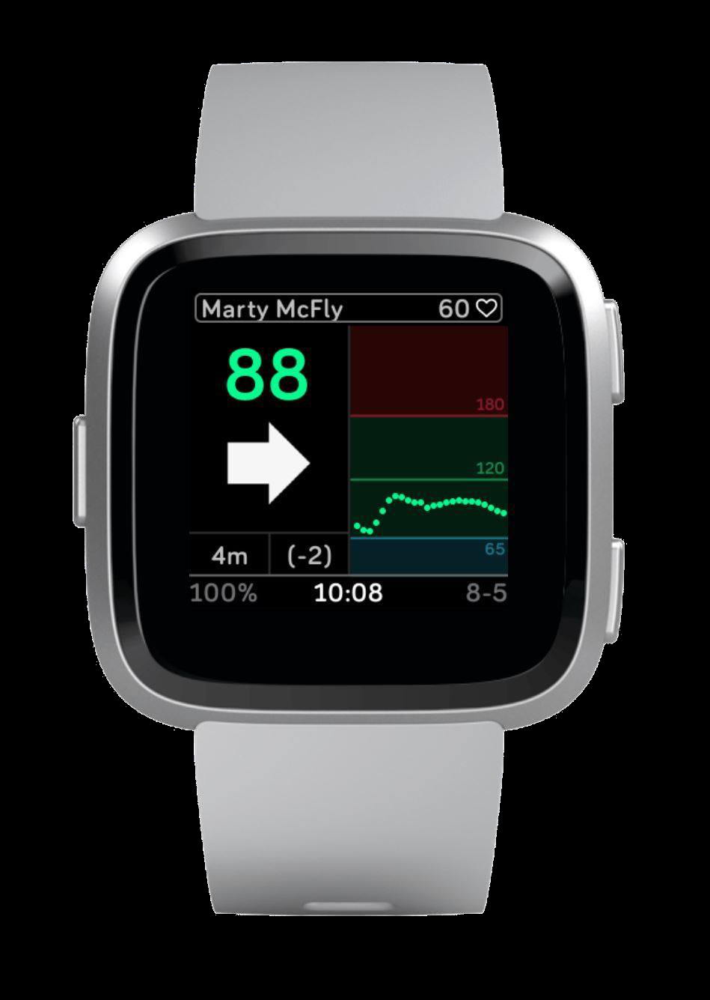

## 1. Compatibilità

**Smartwatch supportati:** Fitbit Ionic, Sense, Versa/Versa 2, Versa Lite

## 2. Perché Sentinel One?

Sentinel One è stato creato pensando ai bambini con diabete. Offre:
- Aspetto pulito e minimalista
- Supporto per Nightscout Careportal
- Icone semplici e intuitive

L'icona goccia di sangue richiama subito il controllo della glicemia, anche per i bambini più piccoli:

L'obiettivo è che anche a scuola, in classe, il quadrante sia facile da leggere e da usare in autonomia:

## 3. Installazione

> ⚠️ **Nota per gli utenti di xDrip:** un aggiornamento recente dell'app Fitbit blocca i dati da xDrip. Devi installare la versione `3.58` e disabilitare gli aggiornamenti automatici. Scarica la versione precedente da [`https://fitbit.it.aptoide.com/versions`](https://fitbit.it.aptoide.com/versions). Se usi Nightscout o Dexcom Share, questo passaggio non è necessario.

Con il telefonino abbinato al Fitbit, vai al link corrispondente al tuo orologio per installare il quadrante:

- **Sentinel PRO** (Versa 2 e precedenti): [`https://gallery.fitbit.com/details/22b3679c-3bed-4408-985b-0a9f35102207`](https://gallery.fitbit.com/details/22b3679c-3bed-4408-985b-0a9f35102207)
- **Sentinel ELITE** (Sense & Versa 3): [`https://gallery.fitbit.com/details/cf8b889b-b193-4893-abf8-90031d85fe3b`](https://gallery.fitbit.com/details/cf8b889b-b193-4893-abf8-90031d85fe3b)
- **Sentinel ESSENTIAL** (Versa 2, Versa, Ionic, Versa Lite): [`https://gallery.fitbit.com/details/fcd215cc-913f-4345-8d4b-a50e4bf26e0a`](https://gallery.fitbit.com/details/fcd215cc-913f-4345-8d4b-a50e4bf26e0a)
- **Sentinel X**: [`https://gallery.fitbit.com/details/9d579c8f-57e8-434b-9494-d0213c8064af`](https://gallery.fitbit.com/details/9d579c8f-57e8-434b-9494-d0213c8064af)
- **Sentinel Basic X**: [`https://gallery.fitbit.com/details/690a4c2a-7f9d-4aa7-9b9a-9b92dd4dbf6a`](https://gallery.fitbit.com/details/690a4c2a-7f9d-4aa7-9b9a-9b92dd4dbf6a)
- **Sentinel One X**: [`https://gallery.fitbit.com/details/0ce56270-984f-4c55-b495-649b3071ec36`](https://gallery.fitbit.com/details/0ce56270-984f-4c55-b495-649b3071ec36)

1. Apri il link dal telefono: si apre la pagina della galleria Fitbit con il quadrante e il tasto **OPEN APP**.

2. Tocca la miniatura del quadrante per vederne i dettagli, poi premi **Select** per installarlo sull'orologio.

3. Una volta installato, il tasto mostra **Selected**: da qui puoi accedere anche a **Settings** e **Permissions**.

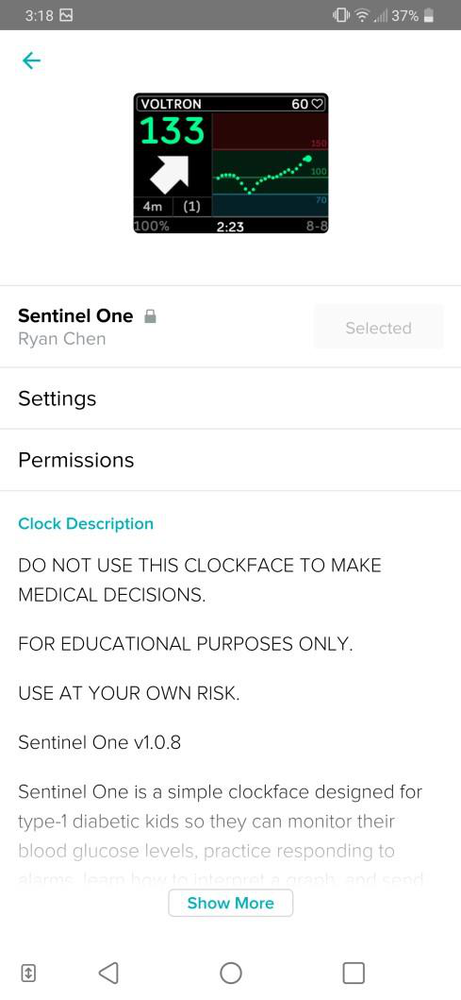

4. Tocca **Settings** per aprire la schermata di configurazione, dove inserirai la tua sorgente dati (Nightscout, Dexcom Share o xDrip+):

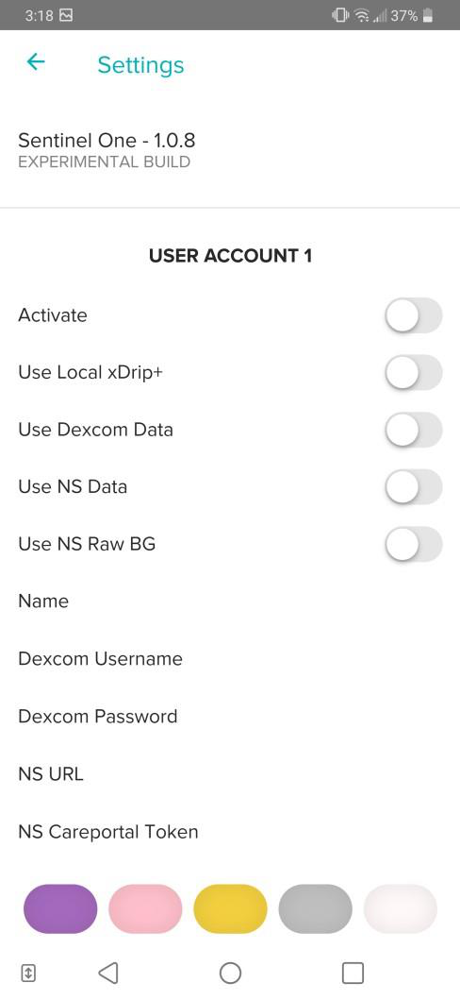

## 4. Impostazioni — Sorgenti dati

Sentinel One supporta 4 combinazioni di sorgenti dati: **Nightscout**, **Dexcom Share**, **Nightscout + Dexcom Share** e **xDrip+ / Diabox** (in locale o con upload su Nightscout). In ognuna di queste modalità, dalla schermata **Settings** attivi (**Activate**) l'account e i soli toggle della sorgente che vuoi usare, poi inserisci nome, credenziali o indirizzo richiesti.

Per usare Nightscout, se vuoi anche inviare trattamenti dal quadrante, crea un soggetto con ruolo `admin` in **Admin Tools** sulla tua pagina Nightscout e copia il relativo **Access Token**:

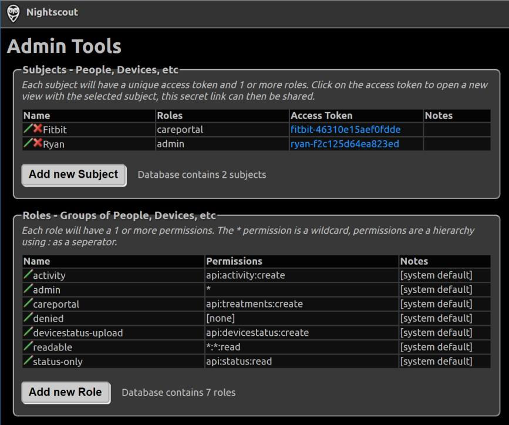

Per Dexcom Share, verifica che la condivisione (**Condivisione**) sia attiva sull'app Dexcom e che ci sia almeno un follower connesso:

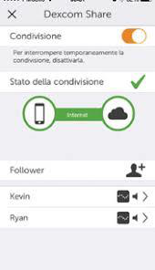

Ecco la schermata di configurazione con **Use Local xDrip+** attivato, la modalità da scegliere se leggi i dati direttamente da xDrip+ senza passare da Nightscout:

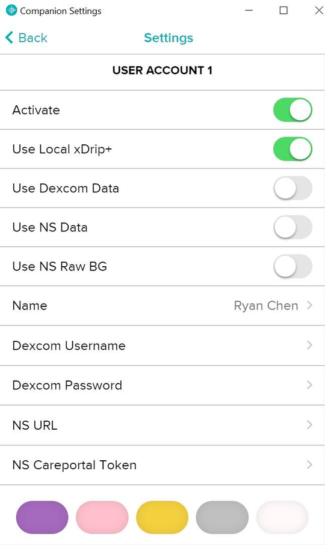

E qui la stessa schermata con **Use NS Data** e **Use NS Raw BG** attivati, per leggere da Nightscout includendo i dati grezzi del sensore:

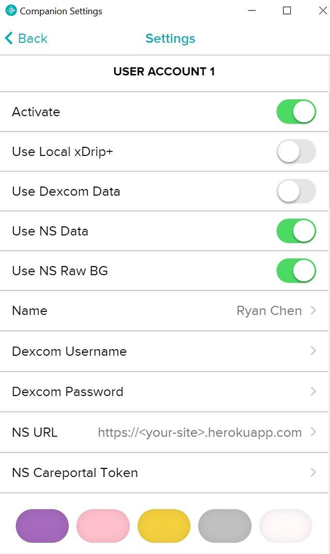

### xDrip / Diabox

**Sorgente dati:** `Local Web Server`

### xDrip con Nightscout (xDrip & NS)

**Sorgente dati:** `Uploader to NS`

## 5. Allarmi

### Abilitare e disabilitare gli allarmi

Le opzioni disponibili sono:
- Allarmi disabilitati durante la carica
- Allarme salita o discesa veloce
- Allarme salita o discesa
- Lampeggio del display per un allarme
- Vibrazione per un allarme

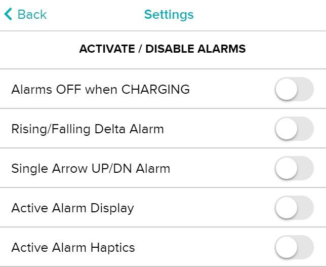

### Soglie di allarme e silenziamento

Nelle impostazioni imposti le soglie di allarme per glicemia alta, bassa e per il Delta:

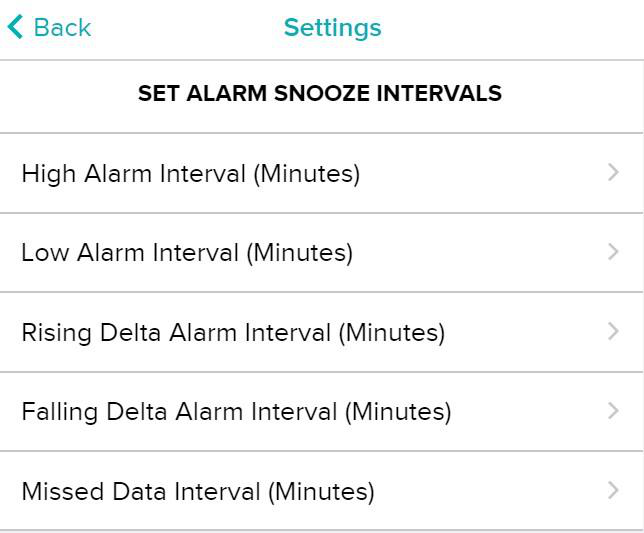

E gli intervalli di ripetizione (snooze) per ciascun tipo di allarme, così da non essere avvisato troppo spesso per lo stesso evento:

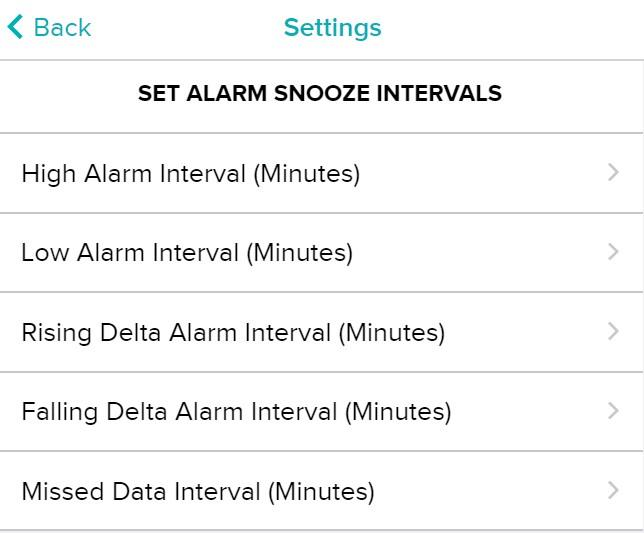

## 6. Impostazioni Careportal

> ⚠️ **Importante per gli utenti fuori dagli USA:** nelle impostazioni Careportal, assicurati di avere abilitato il server internazionale.

Le impostazioni disponibili sono:
- Nome visualizzato per i trattamenti in Careportal
- Abilita/Disabilita NS Careportal
- Abilita/Disabilita le note in NS Careportal
- Abilita/Disabilita il battito cardiaco in NS Careportal

Dal quadrante puoi scegliere di inviare un **Messaggio** oppure un trattamento tramite **Careportal**:

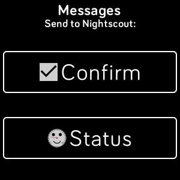

Se scegli **Message**, puoi mandare a Nightscout una semplice conferma di lettura (**Confirm**) o il tuo stato (**Status**):

Scegliendo **Status**, indichi cosa stai facendo in quel momento: mangiare, essere in classe, fare attività fisica o sentirti in ipoglicemia:

Oppure confermi di aver finito uno spuntino, il glucosio, un pasto o un succo:

Se invece scegli **Careportal**, puoi inviare un controllo glicemico (**BG CHECK**), un pasto (**MEAL**), i carboidrati (**CARBS**) o un bolo (**BOLUS**):

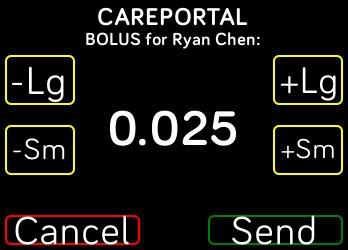

Ogni voce apre un tastierino numerico dedicato. Ad esempio, per i carboidrati:

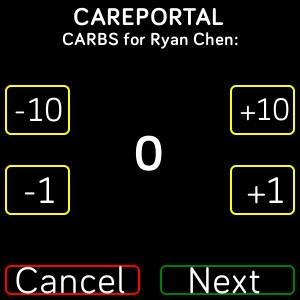

Per il controllo glicemico:

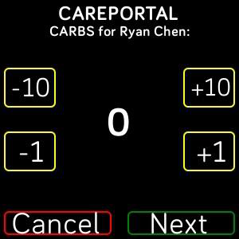

E per il bolo:

Una volta inviato, Nightscout riceve la notifica in tempo reale — qui ad esempio uno **Status** di ipoglicemia (**"Ryan reports feeling LOW!"**), con il grafico aggiornato subito dopo:

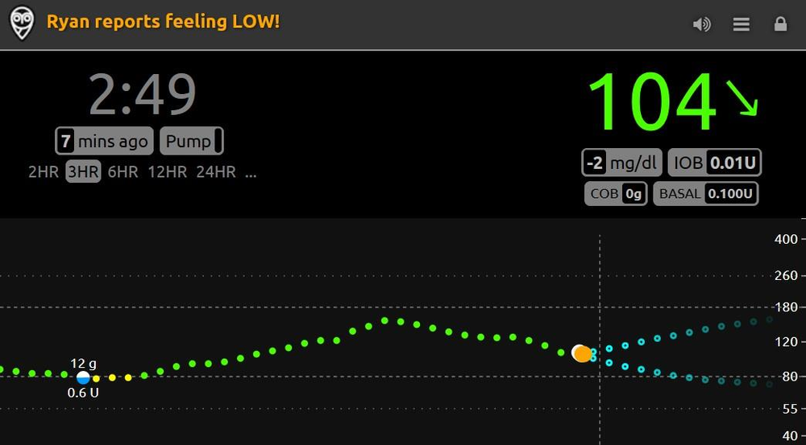

## 7. Navigazione

### Come tornare alla pagina delle impostazioni

Se hai bisogno di modificare le impostazioni del quadrante in un secondo momento:

1. Apri l'app **Fitbit** sul telefono, nella schermata **Today**.

2. Tocca l'icona del tuo orologio (in alto a destra) per aprire la sua pagina dei dettagli.

3. Tocca **Clock Faces**.

4. Tocca il quadrante attivo (qui mostrato come **VOLTRON**, il nome dell'account impostato) per aprirne i dettagli.

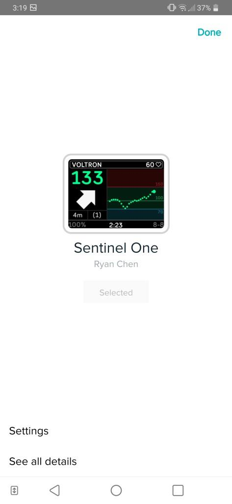

5. Nella pagina del quadrante, tocca **Settings** per tornare alla schermata di configurazione con tutte le sorgenti dati e gli allarmi.

## Avviso legale

> ⚠️ *Sentinel One è a solo scopo informativo. Non usarlo per prendere decisioni mediche. L'uso è a proprio rischio. Questo quadrante è ancora in sviluppo. Per aggiornamenti e supporto, unisciti al gruppo Facebook Sentinel: [`https://www.facebook.com/groups/3185325128159614`](https://www.facebook.com/groups/3185325128159614)*

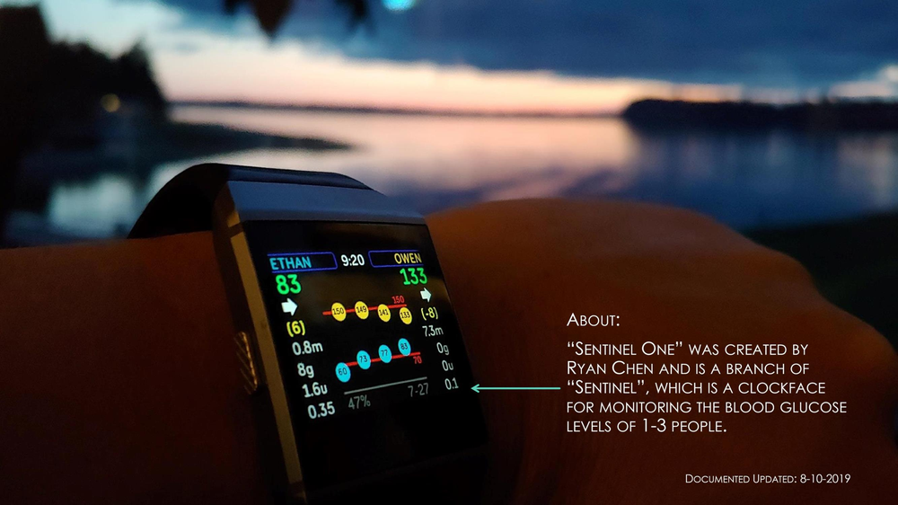
