# Sugarmate — Follower di Dexcom, Nightscout e Gluroo

**Sugarmate** è un'app che aggrega i dati di glicemia da diverse sorgenti e li visualizza su iPhone, iPad, Android, Apple Watch, Apple CarPlay, Amazon Alexa e altro.

Sorgenti dati supportate: Dexcom Share, Nightscout, Gluroo.

Sito ufficiale: `https://www.sugarmate.io/`

> ⚠️ **Attenzione**: L'utilizzo è a esclusiva responsabilità personale.

---

## 1. Crea un account Sugarmate

1. Vai su `https://www.sugarmate.io/` e clicca **Registrati**.

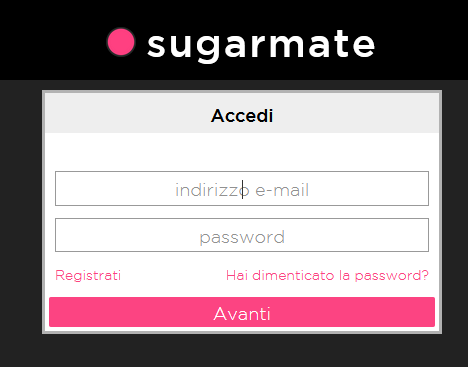

2. Accetta le condizioni di utilizzo e seleziona il paese di residenza.

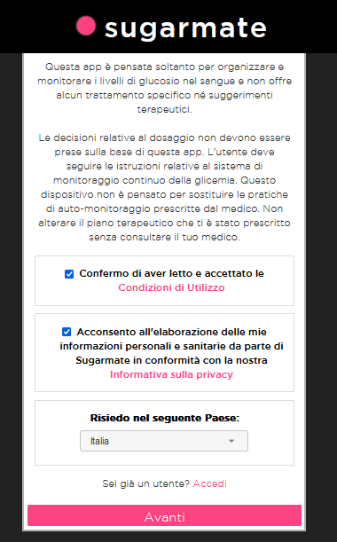

3. Inserisci email e password, poi clicca **Avanti**.

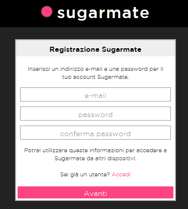

---

## 2. Aggiungi la sorgente dati Dexcom

Se usi un sensore Dexcom e hai almeno un follower Dexcom attivo nell'app Dexcom Follow:

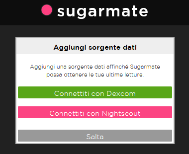

1. Clicca **Connetti con Dexcom**.

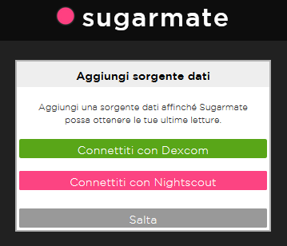

2. Accetta le autorizzazioni e clicca **OK**.

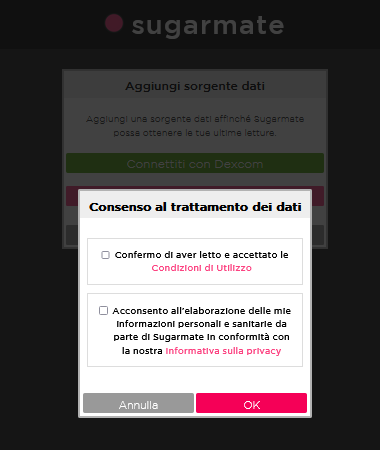

3. Clicca **Avanti** e accedi con le tue credenziali Dexcom.

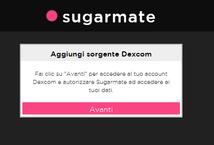

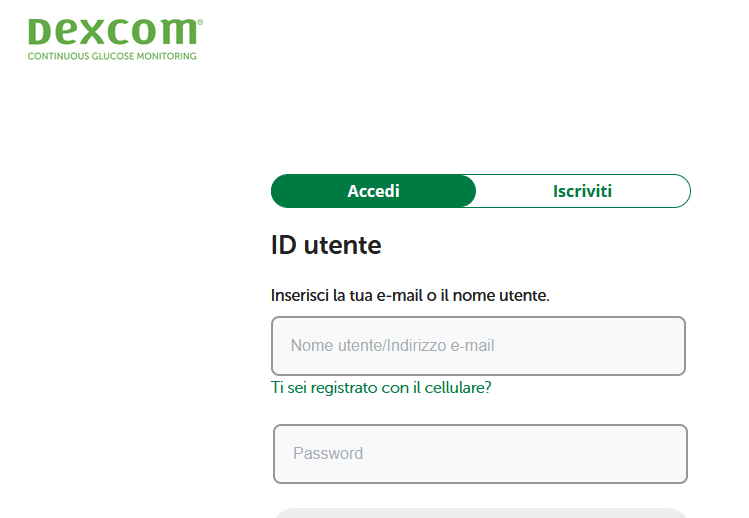

Comparirà la schermata **Sorgente aggiunta correttamente**. Entro qualche minuto vedrai la glicemia in Sugarmate.

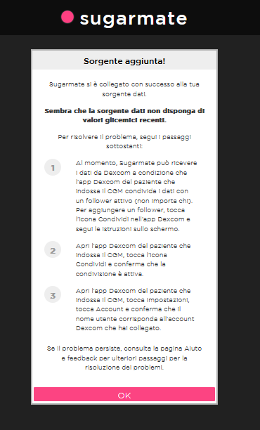

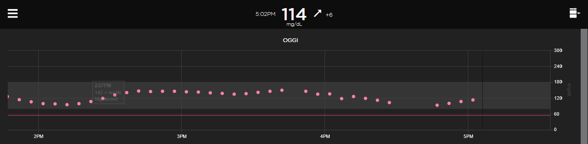

---

## 3. Aggiungi la sorgente dati Nightscout o Gluroo

1. Clicca **Connetti con Nightscout**.

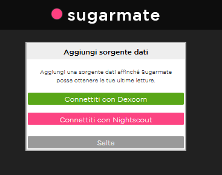

2. Accetta le autorizzazioni e clicca **OK**.

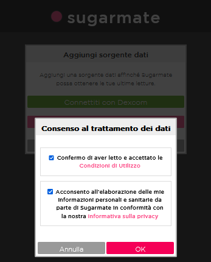

3. Inserisci il tuo **indirizzo Nightscout o Gluroo** nel campo **URL di Nightscout**.
4. Inserisci la tua **API_SECRET** nel campo **Token di autenticazione**.

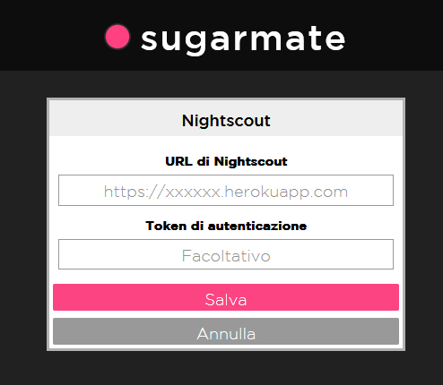

Comparirà la schermata **Sorgente aggiunta correttamente**. Entro qualche minuto vedrai la glicemia in Sugarmate.
