# Sugarmate — Follower di Dexcom, Nightscout e Gluroo

**Sugarmate** (oggi "Sugarmate by Tandem", di proprietà di Tandem Diabetes Care) è un'app che aggrega i dati di glicemia da diverse sorgenti e li visualizza su iPhone, iPad, Android, Apple Watch, Apple CarPlay e sull'app web [`https://app.sugarmate.io/`](https://app.sugarmate.io/).

Sorgenti dati supportate: Dexcom Share, Nightscout, Gluroo e (in alcuni paesi) Tandem Source. Puoi usare **una sola sorgente dati alla volta**.

Sito ufficiale: [`https://www.sugarmate.io/`](https://www.sugarmate.io/)

> ℹ️ **Nota**: dal 1° gennaio 2025 la skill Alexa e l'app per Mac di Sugarmate sono state dismesse e non funzionano più. L'app per Android invece esiste dal 2025 ed è disponibile sul Play Store.

> ⚠️ **Attenzione**: L'utilizzo è a esclusiva responsabilità personale.

---

## 1. Crea un account Sugarmate

1. Vai su [`https://www.sugarmate.io/`](https://www.sugarmate.io/) e clicca **Registrati**.

Nel modulo **Accedi**, clicca il link **Registrati** in basso a sinistra:

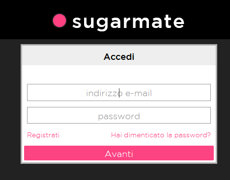

2. Accetta le condizioni di utilizzo e seleziona il paese di residenza.

Spunta le due caselle di consenso, scegli **Italia** come paese e clicca **Avanti**:

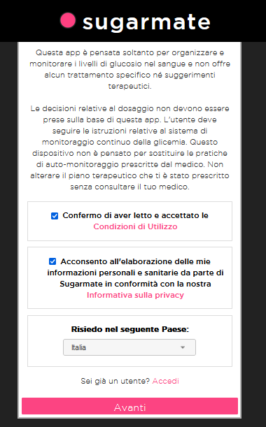

3. Inserisci email e password, poi clicca **Avanti**.

Nel modulo **Registrazione Sugarmate**, inserisci email, password e conferma della password:

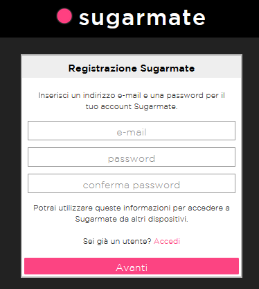

---

## 2. Aggiungi la sorgente dati Dexcom

Se usi un sensore Dexcom e hai almeno un follower Dexcom attivo nell'app Dexcom Follow:

Dopo la registrazione compare la schermata **Aggiungi sorgente dati**, con le due opzioni Dexcom e Nightscout:

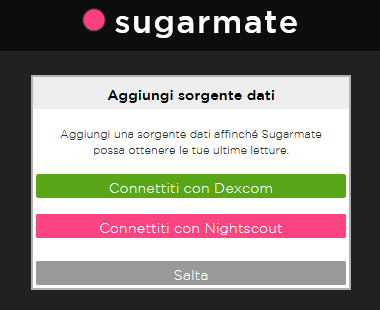

1. Clicca **Connettiti con Dexcom**.

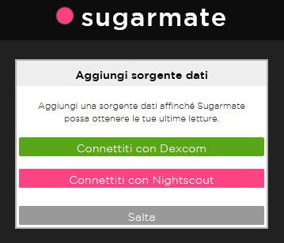

2. Accetta le autorizzazioni e clicca **OK**.

Nel riquadro **Consenso al trattamento dei dati**, spunta le due caselle e clicca **OK**:

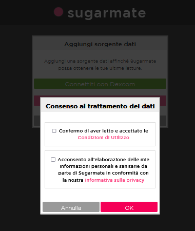

3. Clicca **Avanti** e accedi con le tue credenziali Dexcom.

Il riquadro **Aggiungi sorgente Dexcom** ti reindirizza all'accesso Dexcom: clicca **Avanti**:

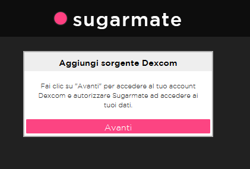

Nella pagina di accesso Dexcom, inserisci nome utente (o email) e password del tuo account:

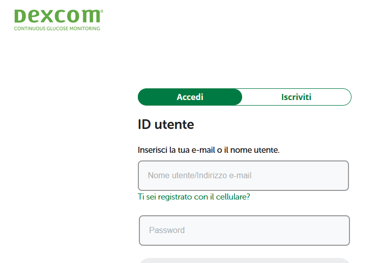

Comparirà la schermata **Sorgente aggiunta correttamente**. Entro qualche minuto vedrai la glicemia in Sugarmate.

> ℹ️ **Nota**: Se compare l'avviso "la sorgente dati non dispone di valori glicemici recenti", segui i passaggi indicati: serve almeno un follower attivo nell'app Dexcom del paziente, con la condivisione attiva.

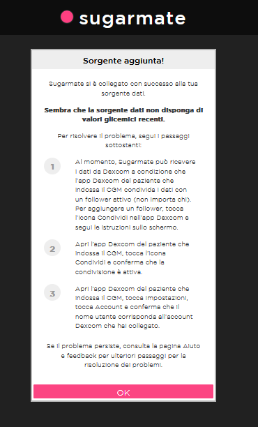

Quando tutto funziona, il grafico di Sugarmate mostra le glicemie in arrivo dalla sorgente:

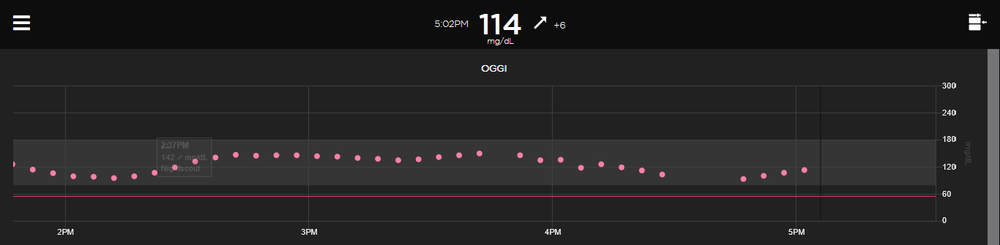

---

## 3. Aggiungi la sorgente dati Nightscout o Gluroo

1. Clicca **Connettiti con Nightscout**.

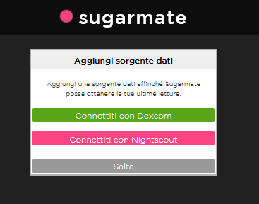

2. Accetta le autorizzazioni e clicca **OK**.

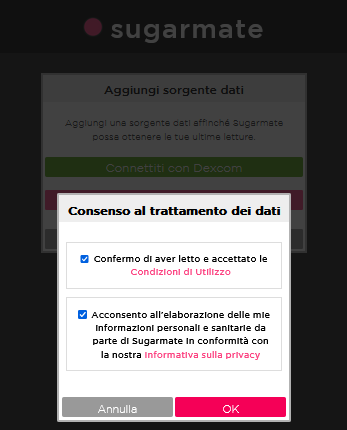

3. Inserisci il tuo **indirizzo Nightscout o Gluroo** nel campo **URL di Nightscout**.
4. Inserisci la tua **API_SECRET** nel campo **Token di autenticazione**.

Compila i due campi del modulo **Nightscout** e clicca **Salva**:

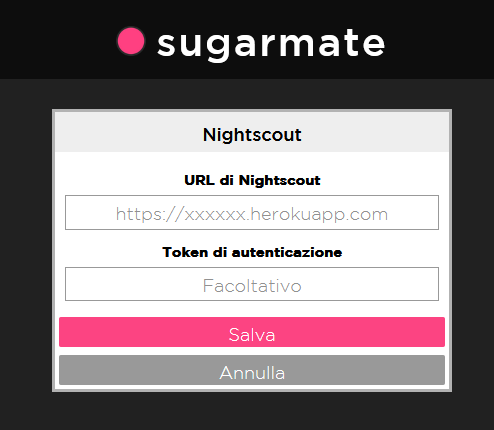

Comparirà la schermata **Sorgente aggiunta correttamente**. Entro qualche minuto vedrai la glicemia in Sugarmate.
