# Glicemia Dexcom su Apple Watch del follower con Sugarmate

**Sugarmate** è un'app che usa il calendario di Apple per portare le glicemie di Dexcom (G6 o G7) sull'Apple Watch del follower, in tempo reale (ritardo di circa 10 secondi).

> ℹ️ **Nota**: il metodo del calendario è ancora oggi quello ufficiale: Sugarmate non ha una complicazione propria per l'Apple Watch perché Apple limita gli aggiornamenti delle complicazioni normali, mentre quella del Calendario non ha questo limite.

> ℹ️ **Nota**: Questa guida è dedicata ai **follower** di Dexcom. L'app Dexcom ufficiale (G6 o G7) mostra la glicemia sullo smartwatch solo sul dispositivo master (quello che legge il sensore), non sui follower. Sugarmate risolve questa limitazione condividendo la glicemia tramite il calendario di iCloud, sfruttando l'account Dexcom Share comune a tutte le versioni del sensore.

Tutta la procedura si esegue sull'**iPhone del follower**, tranne i passaggi in cui è necessario il dispositivo master con l'app Dexcom Mobile.

Autori: Maurizio Frijia e Mimmo Longobardi.

---

## 1. Abilita l'autenticazione a due fattori sull'ID Apple

Se hai già l'autenticazione a due fattori attiva, salta direttamente al punto 2.

1. Apri **Impostazioni** sull'iPhone del follower:

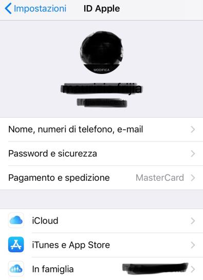

2. Tocca il tuo nome in alto per accedere all'account iCloud.
3. Vai in **Password e sicurezza**.

Nella pagina **ID Apple**, tocca **Password e Sicurezza**:

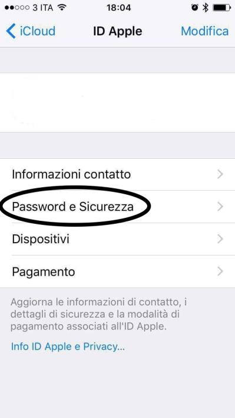

4. Seleziona **Attiva autenticazione a due fattori** e segui le istruzioni.

Tocca **Abilita l'autenticazione a due fattori**:

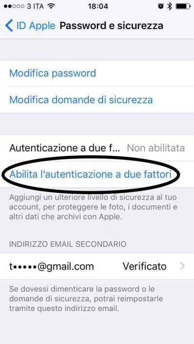

Se il telefono non ha ancora un codice di blocco, l'app te ne chiede uno prima di procedere:

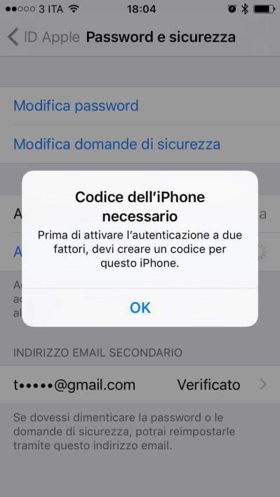

Leggi la spiegazione su come funziona l'autenticazione a due fattori e tocca **Continua**:

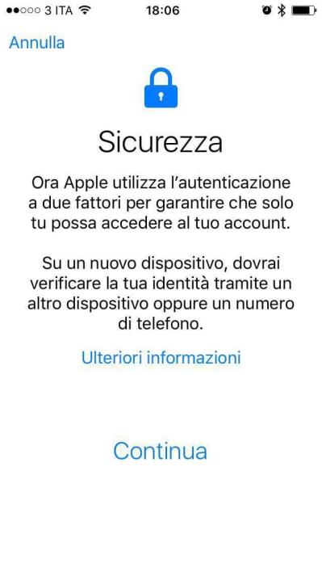

Inserisci un numero di telefono da usare per la verifica via SMS o chiamata:

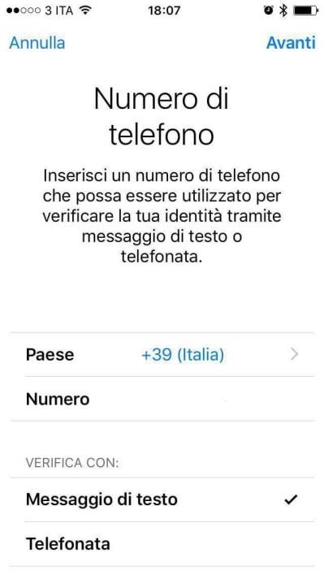

Inserisci la password del tuo ID Apple per confermare l'attivazione:

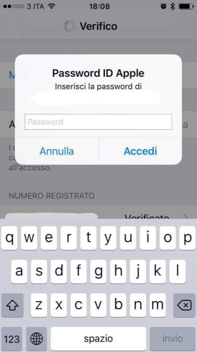

A operazione completata, la voce **Autenticazione a due fattori** risulta **Abilitata**:

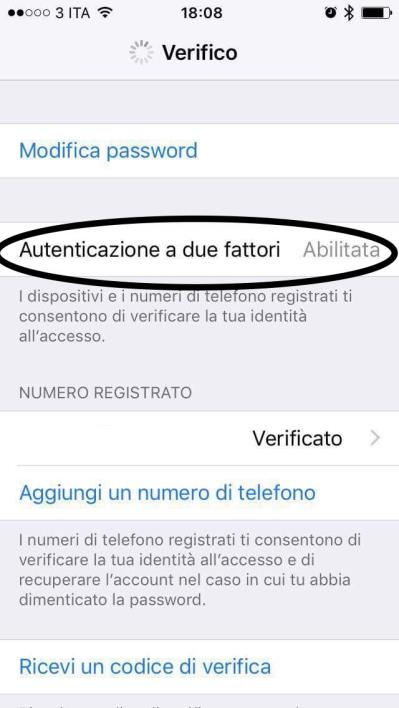

Dopo l'attivazione, torna alle impostazioni iCloud e assicurati che la voce **Calendari** sia spuntata. Altrimenti non potrai condividere il calendario con Sugarmate.

Torna in **Impostazioni** e tocca **iCloud**:

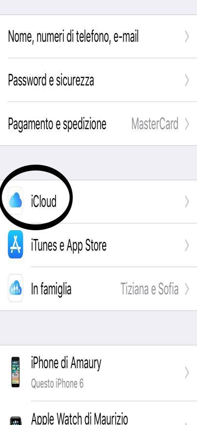

Nella pagina iCloud, verifica che l'interruttore accanto a **Calendari** sia attivo:

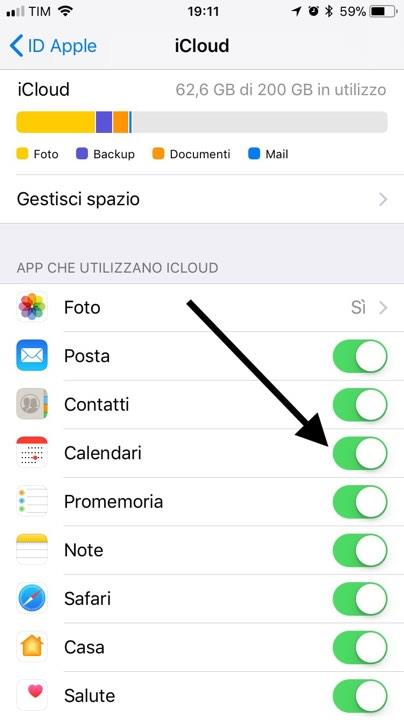

---

## 2. Genera una password specifica per l'app

Sugarmate non è un'app Apple, quindi non può accedere al tuo account iCloud con la tua password normale. Devi generare una password dedicata.

1. Da un browser, vai su [`https://appleid.apple.com/`](https://appleid.apple.com/) e accedi con il tuo ID Apple.

Inserisci il tuo ID Apple e la password sulla pagina di accesso:

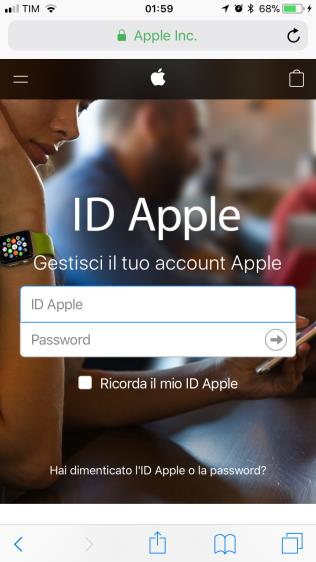

2. Inserisci il codice di verifica a due fattori quando richiesto.

Se accedi da una nuova posizione, ti viene chiesto di confermare l'accesso: tocca **Consenti**:

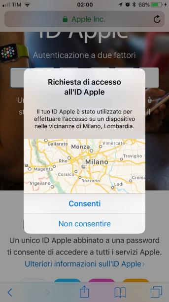

Un codice di verifica viene inviato ai tuoi dispositivi Apple registrati:

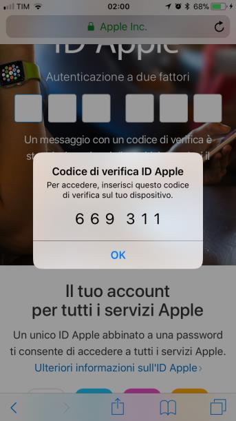

Inserisci il codice ricevuto nei sei riquadri per completare l'accesso:

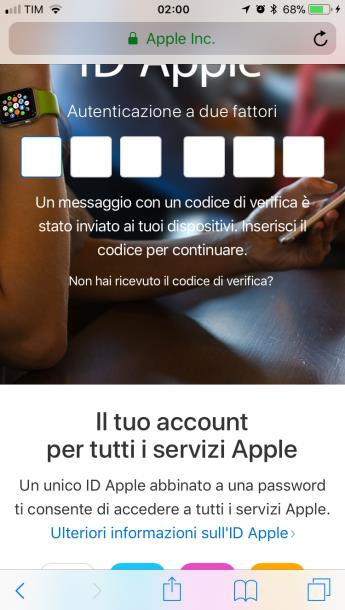

3. Vai in **Sicurezza → Password specifiche per app** e clicca **Genera password**.

Dalla pagina principale del tuo account, tocca **Sicurezza**:

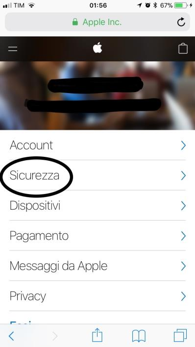

In fondo alla pagina **Sicurezza**, tocca **Genera password** sotto **Password specifiche per le app**:

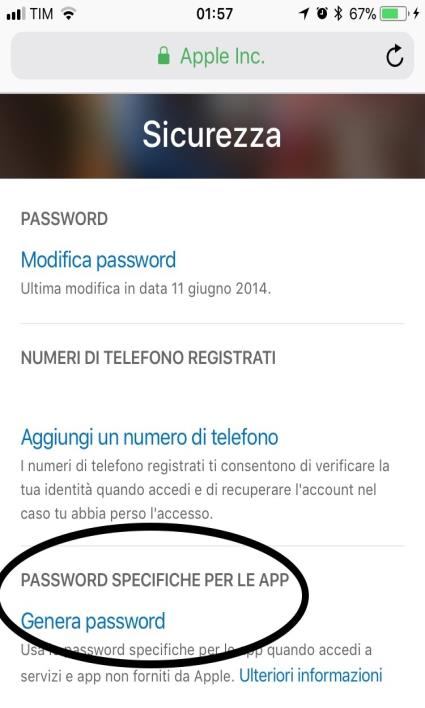

4. Inserisci un'etichetta descrittiva (es. `Sugarmate`) e clicca **Crea**.

Compare un campo vuoto dove inserire un'etichetta per riconoscere questa password (es. "Bollette" nell'esempio):

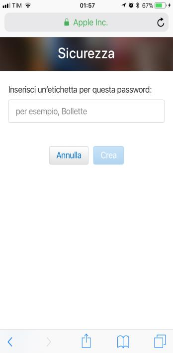

Digita un'etichetta descrittiva, ad esempio `sugarmate`, e tocca **Crea**:

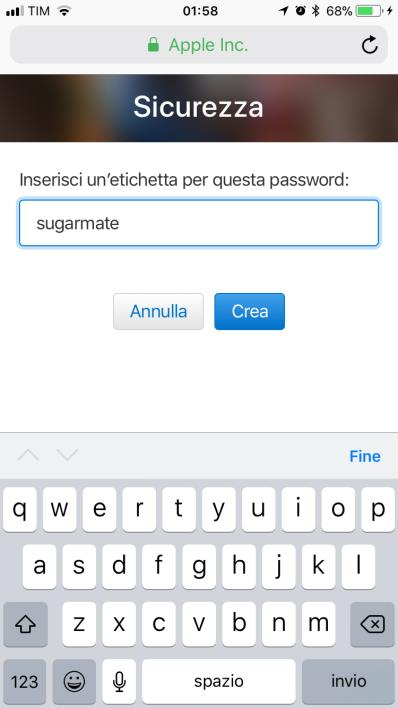

5. **Copia la password generata** — ti servirà nel passo 5.

Viene generata la password specifica per l'app: copiala e conservala:

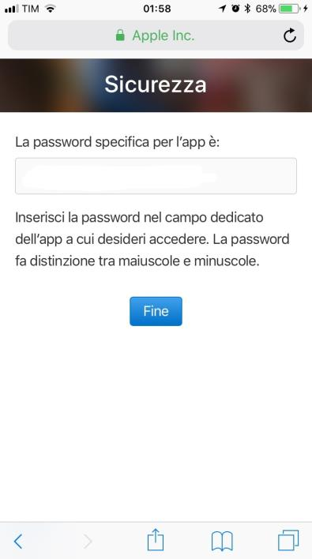

---

## 3. Condividi il calendario con Sugarmate

1. Apri l'app **Calendario** sull'iPhone del follower.

2. Tocca **Calendari** in basso.

Nella vista annuale, tocca **Calendari** in basso al centro:

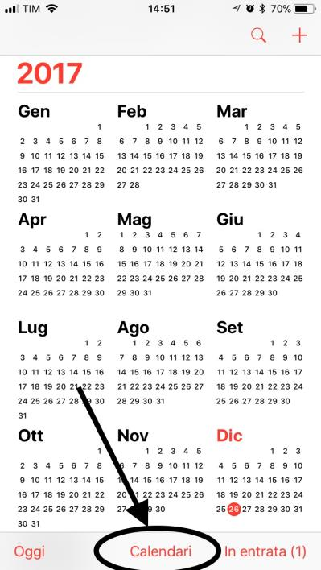

3. Tocca la **i** accanto a uno dei calendari esistenti (oppure crea un nuovo calendario e tocca la sua **i**).

Nell'elenco dei calendari, tocca l'icona **i** accanto a un calendario esistente, oppure **Aggiungi calendario** per crearne uno nuovo:

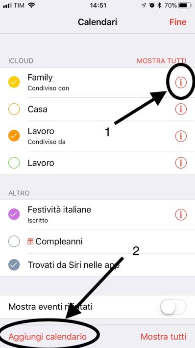

4. Tocca **Aggiungi persona** e inserisci l'email di una persona con cui condividere il calendario. Assicurati che il contatto abbia un'email valida nel profilo.

Nella schermata **Modifica calendario**, tocca **Aggiungi persona** sotto **Condiviso con**:

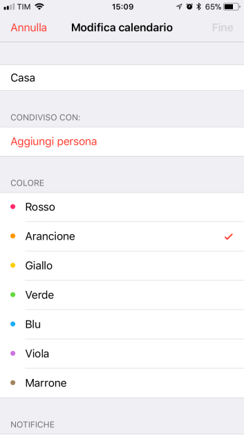

5. Segui la procedura e conferma la notifica che apparirà sugli altri dispositivi. Se la notifica non arriva, trovala nell'app Calendario sotto **In entrata**.

Se non ricevi subito la notifica di condivisione, controlla la voce **In entrata** in basso a destra nell'app Calendario:

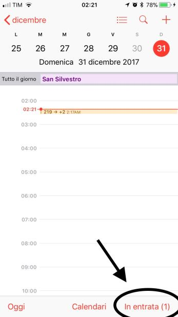

---

## 4. Installa e configura Sugarmate

Scarica Sugarmate dall'App Store: [`https://itunes.apple.com/us/app/sugarmate/id1111093108?mt=8`](https://itunes.apple.com/us/app/sugarmate/id1111093108?mt=8)

Apri l'app. **Copia l'indirizzo email** che apparirà tra le prime schermate — ti servirà nel passo successivo.

Alla prima apertura, l'app mostra una schermata di benvenuto: tocca **Get Started**:

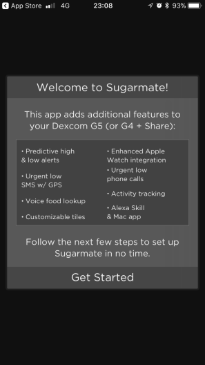

Conferma di aver letto le condizioni d'uso e tocca **OK**:

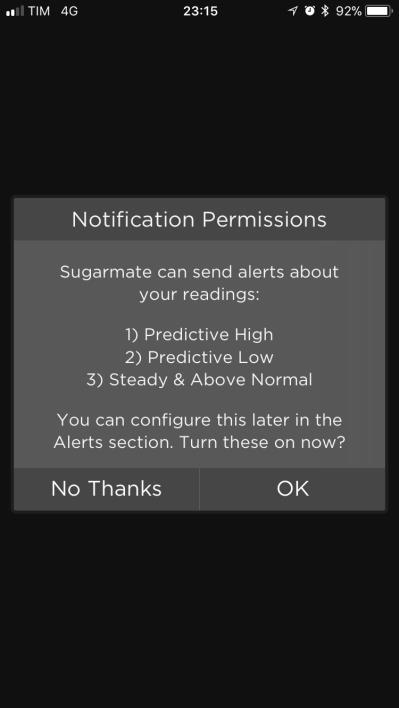

L'app mostra l'indirizzo email da aggiungere come follower nell'app Dexcom: copialo toccandolo:

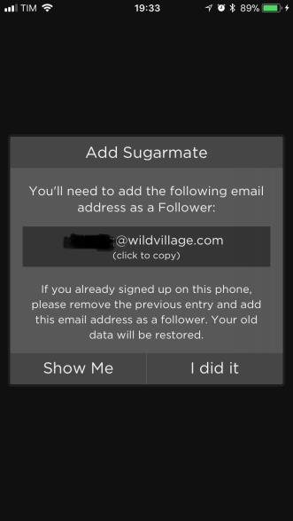

---

## 5. Aggiungi Sugarmate come follower su Dexcom

> ⚠️ **Attenzione**: nelle versioni attuali dell'app la sorgente Dexcom non si aggiunge più con l'email follower mostrata in queste schermate, ma accedendo direttamente con il **tuo account Dexcom** da **Menu → My Account → Data Source → Dexcom** (la condivisione deve essere attiva nell'app Dexcom del master). La procedura aggiornata è descritta nella guida [Sugarmate follower di Dexcom, Nightscout e Gluroo](sugarmate-follower-di-dexcom-nightscout-gluroo). I passi restanti di questa guida (calendario e Apple Watch) restano validi.

**Sul dispositivo master** (quello con l'app Dexcom Mobile, G6/G7):

- Apri l'app Dexcom, tocca il triangolo in alto a destra, poi il pulsante per aggiungere un follower.
- Inserisci l'email copiata da Sugarmate al passo precedente e invia l'invito.

Nella sezione **Dexcom Share**, aggiungi Sugarmate all'elenco dei **Follower**:

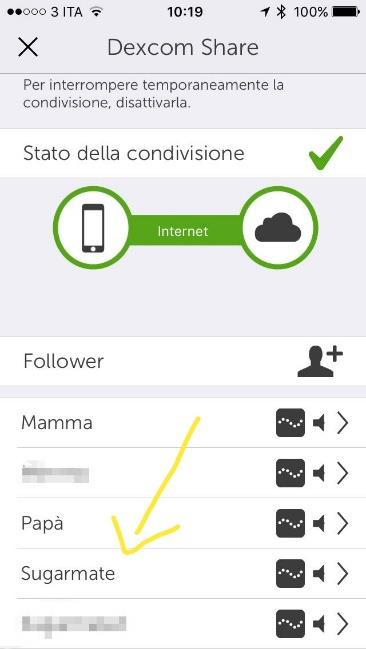

Torna sull'iPhone del follower nell'app Sugarmate e tocca **I did it** per confermare l'invito.

Se richiesto, consenti a Sugarmate di inviarti notifiche:

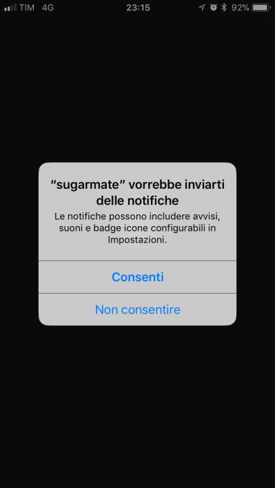

L'app chiede anche il permesso di inviare avvisi specifici per i valori glicemici (alto/basso previsto): puoi confermare o rimandare la scelta:

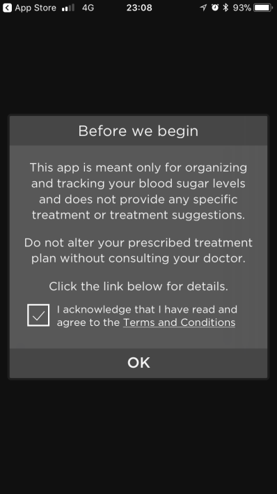

Quando richiesto, inserisci la **password specifica per l'app** generata al passo 2.

La configurazione iniziale termina con questo messaggio: tocca **Let's go!** per iniziare a usare Sugarmate (oppure **Watch** per passare subito alla configurazione dell'Apple Watch):

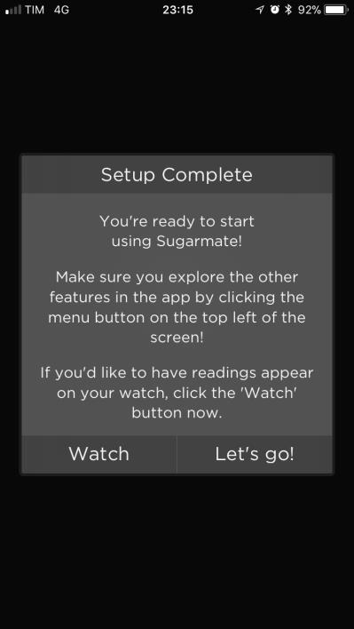

A questo punto atterri sulla schermata principale **Alerts**, con le soglie di avviso già preimpostate:

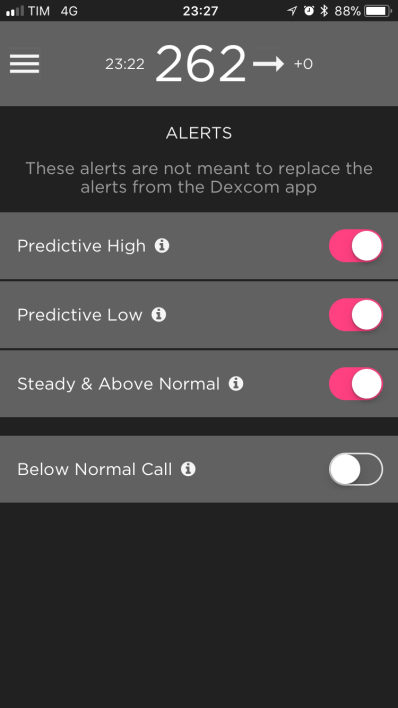

---

## 6. Collega il calendario

Dal menu laterale dell'app, vai in **Other Platforms**: qui trovi la sezione dedicata all'integrazione con **Apple Watch**:

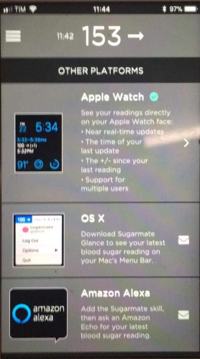

Nella schermata Apple Watch di Sugarmate, scorri fino a **ADD A CALENDAR**, inserisci la tua email iCloud e la password specifica per l'app generata al passo 2.

Aprendo la sezione **Apple Watch** trovi le istruzioni numerate e, più in basso, il pulsante **ADD A CALENDAR**:

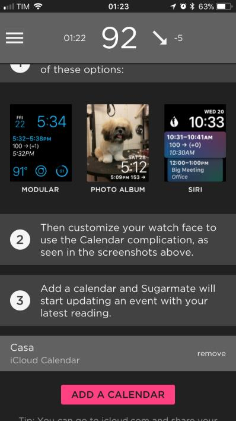

Clicca **ADD A CALENDAR** e seleziona il calendario condiviso al passo 3.

Toccando **ADD A CALENDAR** l'app ti avvisa che ti servirà il tuo ID Apple e la password specifica per l'app appena generata:

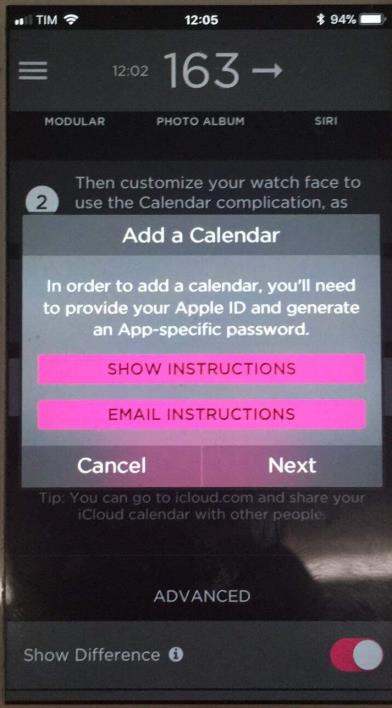

Sugarmate riceverà le glicemie come follower e le inserirà nel calendario condiviso. Dopo circa 5 minuti inizieranno ad apparire notifiche sull'iPhone con il valore glicemico e la freccia di tendenza.

> ℹ️ **Nota**: Se non vuoi le notifiche sull'iPhone: vai in **Impostazioni → Notifiche → Calendario** e disabilita **Consenti notifiche**.

---

## 7. Configura Apple Watch

1. Apri l'app **Apple Watch** sull'iPhone del follower.

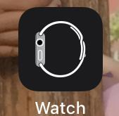

2. Vai in **Notifiche → Calendario** e scegli se duplicare o personalizzare le notifiche sull'orologio.

Nella schermata principale dell'app Apple Watch, tocca **Notifiche**:

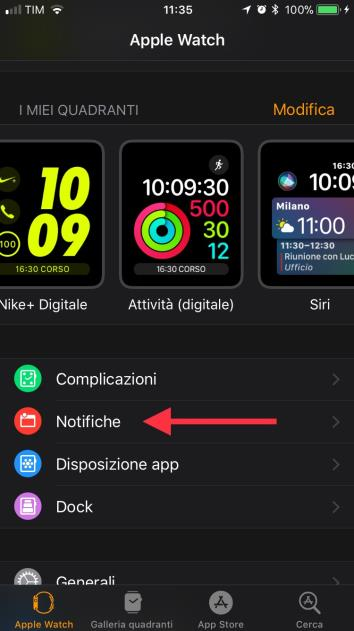

Nell'elenco delle app, tocca **Calendario**:

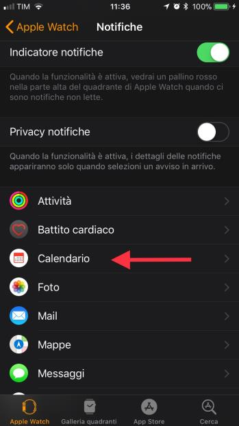

Scegli se **Duplicare iPhone** o **Personalizzare** le notifiche del calendario sull'orologio:

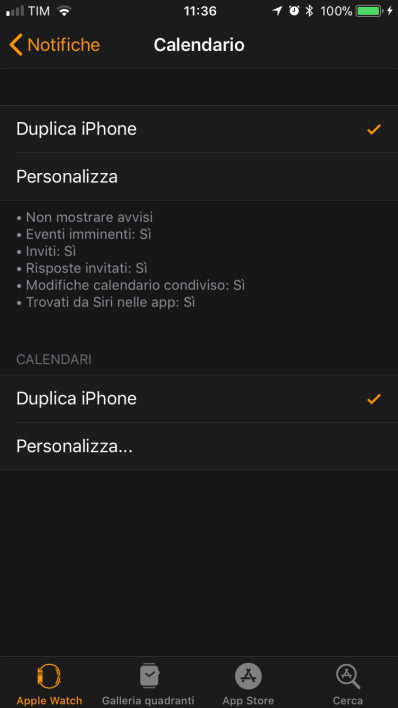

### Aggiunta del calendario nel quadrante

1. Scegli un quadrante da **I miei quadranti** o aggiungine uno dalla **Galleria quadrante**.

Nella schermata principale, scegli un quadrante da **I miei quadranti** o toccando **Galleria quadranti** in basso:

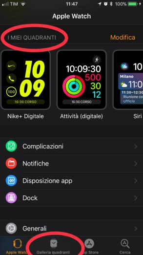

2. Scorri fino a **Complicazioni** e seleziona la sezione in basso per inserire il calendario.

Nella configurazione del quadrante, assegna **Calendario** a una delle complicazioni disponibili (qui la posizione "In basso"):

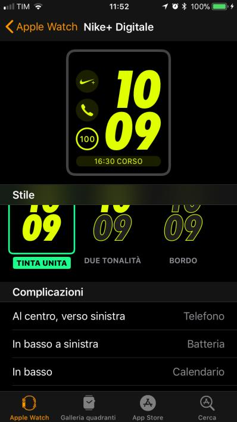

3. Scorri fino a **Imposta come quadrante** e conferma.

Inizialmente comparirà "Nessun evento". Dopo qualche minuto il calendario si aggiornerà con il valore glicemico corrente.

Sul quadrante, la complicazione mostra ora la glicemia aggiornata direttamente dal calendario condiviso:

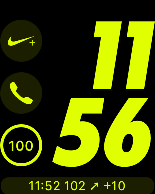

---

## 8. Allarme per ipoglicemia (opzionale)

Sugarmate può chiamarti in caso di ipoglicemia grave, anche se il telefono è in silenzioso.

1. Dal menu di sinistra in Sugarmate, vai in **Alert → Below Normal Call**.

Apri il menu laterale e tocca **Alerts**:

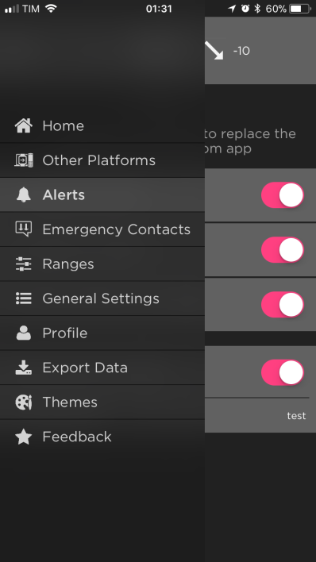

Nella schermata **Alerts**, individua l'interruttore **Below Normal Call** (inizialmente disattivato):

Attivandolo, l'app ti avvisa che si tratta di una funzione sperimentale e ti chiede conferma:

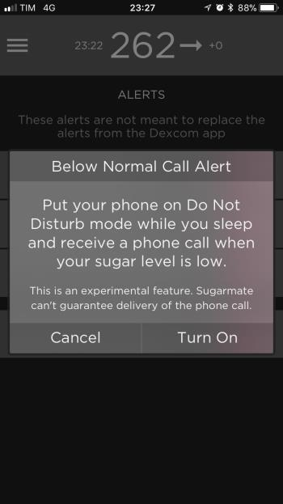

2. Aggiungi il numero mostrato nella sezione (1) ai contatti del telefono.

Compaiono le istruzioni con il numero da salvare in rubrica e i tre passaggi da seguire:

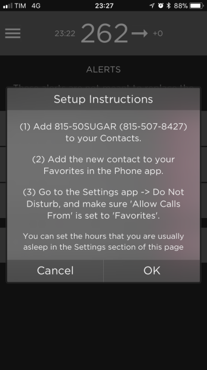

3. Aggiungilo anche ai **Preferiti** nell'app Telefono.

Dopo averlo salvato, aggiungi il contatto **815-50SUGAR** ai **Preferiti** dell'app Telefono:

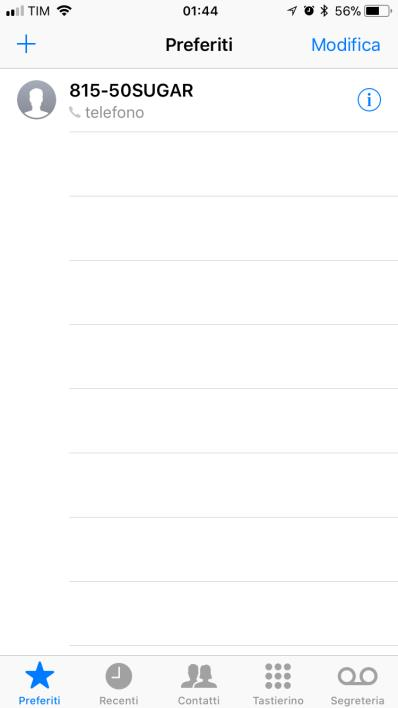

4. In **Impostazioni → Non disturbare**, abilita la chiamata anche con il telefono in silenzioso per i **Preferiti**.

Vai in **Impostazioni → Non disturbare**:

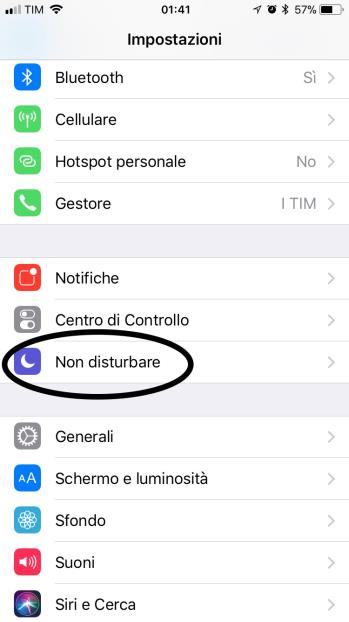

Imposta **Consenti chiamate da** su **Preferiti**, così la chiamata di allarme suonerà anche a telefono silenzioso:

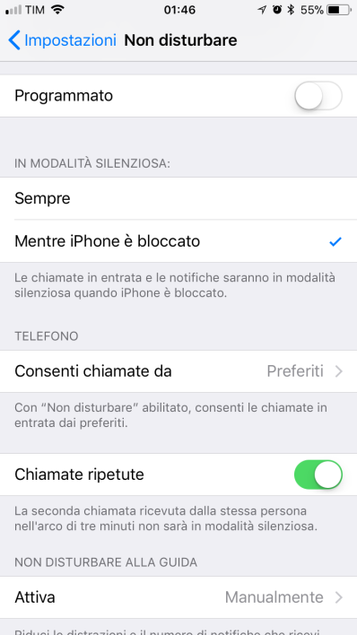

> ℹ️ **Nota**: Se attivi anche gli avvisi via SMS, l'app ti chiederà di registrare e confermare il tuo numero di telefono. Inserisci il numero quando richiesto...

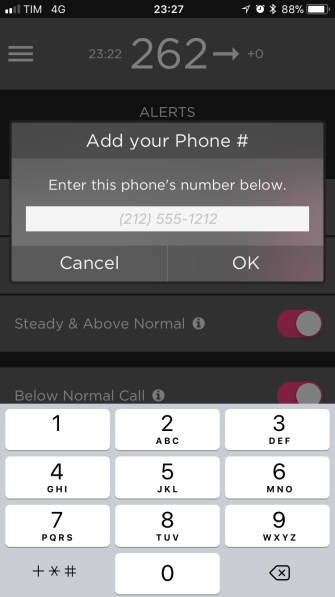

...riceverai un SMS con un link di conferma da toccare...

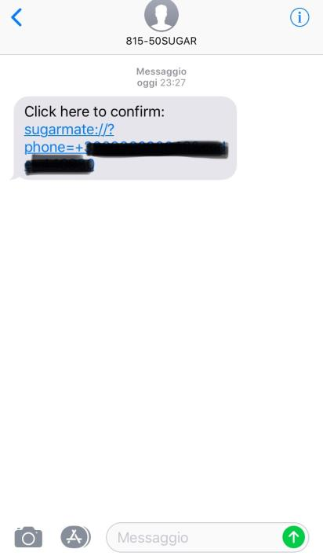

...e l'app confermerà che il numero è stato verificato:

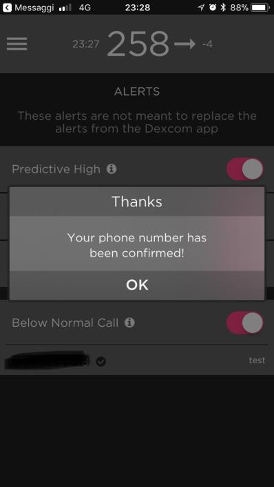

> ℹ️ **Nota**: La funzione **Emergency Contacts** (localizzazione GPS in caso di ipo grave) potrebbe non essere disponibile in Italia. Per attivarla, contatta lo sviluppatore.
