# Calibrare il FSL con xDrip+

Questa guida offre spunti di riflessione sulla calibrazione del FSL (sensore di glucosio a scansione) con xDrip+. Il sensore FSL non è concepito per essere calibrato dall'utente: le informazioni riportate non possono quindi essere utilizzate a fini medici. L'utilizzo è soggetto all'assunzione di esclusiva responsabilità personale.

> ⚠️ xDrip+ **NON DEVE ESSERE UTILIZZATO PER PRENDERE DECISIONI MEDICHE**. È solo uno strumento di ricerca, fornito "così com'è" senza garanzie di alcun tipo. Qualsiasi parte del sistema può fallire in qualsiasi momento. Chiedi sempre il parere di un operatore sanitario qualificato. L'intero rischio riguardo alla qualità e alle prestazioni del programma è a carico dell'utente.

## 1. Cosa consiglia un fornitore di sensori

La molecola di glucosio, in condizioni di stabilità glicemica, impiega circa 5–10 minuti per oltrepassare la membrana capillare e giungere nel liquido interstiziale (il fluido sottocutaneo misurato dal sensore). Per confrontare i valori occorre quindi attendere sempre 5–10 minuti dopo aver effettuato la puntura del dito, poi scansionare nuovamente il sensore. La procedura deve essere ripetuta almeno 3 volte in condizioni di stabilità glicemica (freccia orizzontale sul sensore).

Se i livelli di glucosio variano rapidamente (frecce verticali), le letture del sensore potrebbero non riflettere accuratamente i valori del sangue. In questi casi il test capillare è necessario — così come quando il sistema rileva un'ipoglicemia o i sintomi percepiti non corrispondono alle letture.

- **Iperglicemia rapida**: il sensore può mostrare un valore più alto rispetto alla capillare (es. capillare 230 mg/dL, sensore 300 mg/dL con freccia in salita).
- **Ipoglicemia rapida**: il sensore tende a mostrare valori più bassi (es. capillare 70 mg/dL, sensore 40 mg/dL con freccia in discesa o `LO`).

In tutti questi casi, verifica se i sintomi percepiti sono compatibili con il valore del sensore e — in caso di dubbio — esegui una capillare prima di prendere qualsiasi decisione terapeutica.

Alcune situazioni possono interferire con le letture: sanguinamento durante l'applicazione, sensore non ben adeso alla cute, alcuni farmaci (in particolare aspirina o supplementi a base di vitamina C). Il sensore deve essere rimosso prima di sottoporsi a radiazioni magnetiche o elettromagnetiche forti (raggi X, risonanza magnetica, TAC).

## 2. Disclaimer

Prima di cominciare, ricorda quello di importante che hai accettato all'installazione di xDrip+. Alcuni hanno utilizzato xDrip+ senza aver capito come calibrare — non hanno mai verificato con una misura capillare la loro glicemia reale, sono finiti in pronto soccorso e la FDA ha emesso avvertimenti contro l'uso fai-da-te. Questo sarebbe probabilmente accaduto anche con un Dexcom, un Guardian o qualsiasi altro sistema.

> ⚠️ **Avvertimento legale**
>
> NON utilizzare o fare affidamento su questo software per scopi o decisioni mediche. NON fare affidamento su questo sistema per allarmi in tempo reale o dati critici. NON usarlo come sostituto del giudizio sanitario professionale. Tutti i software e i materiali sono forniti a scopo informativo soltanto come prova di concetto. Qualsiasi parte del sistema può fallire in qualsiasi momento. Segui sempre le istruzioni del produttore del sensore. Questo software non è associato né approvato da alcun produttore di apparecchiature. L'utilizzo è interamente a proprio rischio. Utilizzando questo software, l'utente accetta di avere più di 18 anni e di aver letto, compreso e accettato tutto quanto sopra.


## 3. Capillare contro interstiziale: perché calibrare

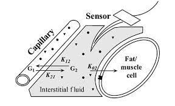

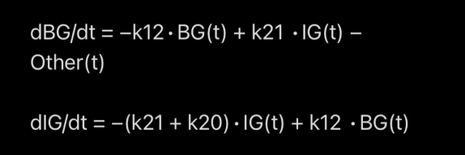

La glicemia arteriosa, capillare, venosa e quella interstiziale non sono sempre identiche. Per questo il valore misurato dal sensore FSL non coincide sempre con quello del glucometro, soprattutto quando la glicemia non è stabile. Il ritardo può andare da 3 a 12 minuti, dipende da molti parametri — uno importante è l'idratazione.

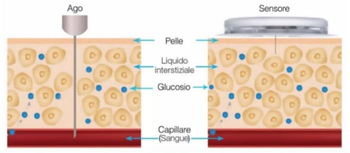

Quello che chiamiamo "calibrare" sfrutta il fatto che, a glicemia stabile, dopo un certo tempo, la concentrazione di glucosio tende a essere simile anche nel liquido interstiziale. Il sensore non legge direttamente la concentrazione in mg/dL: rileva una corrente elettrica derivata da una reazione chimica, che chiamiamo **valore grezzo**. Per calcolare la glicemia reale è necessario un fattore di correzione, ottenuto tramite una misura capillare. Questa è la calibrazione: fornire un riferimento accurato per far corrispondere meglio la lettura al valore reale della glicemia.

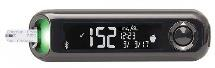

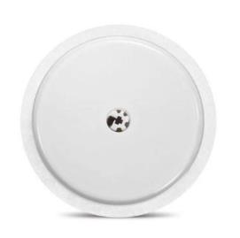


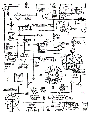

L'app e il lettore ufficiali non richiedono calibrazione perché questa viene eseguita in fase di fabbricazione del dispositivo: nel sensore sono già iscritti i parametri necessari all'algoritmo proprietario per generare il valore della glicemia.

## 4. Non voglio calibrare

Purtroppo non ci sono molte soluzioni per evitare di calibrare il FSL 1 con xDrip+. L'unica è l'uso del plugin esterno OOP1 (Out Of Process algorithm, algoritmo esterno al processo principale) che fornisce a xDrip+ una lettura calibrata simile a quella del lettore. OOP1 non è però compatibile con la maggior parte dei telefoni con Android 9 e versioni successive, cioè ormai praticamente tutti.

Con FSL 2, il plugin OOP2 permette di generare un valore simile al lettore senza calibrare, selezionando l'opzione **No calibration**. Questa soluzione è consigliata a chi non riesce a calibrare. È comunque possibile usare OOP2 come per un FSL 1 selezionando **Calibrate based on raw**, oppure ritoccare la calibrazione automatica con **Calibrate based on glucose**. Con FSL 2 non è necessario calibrare e in alcune configurazioni non è nemmeno possibile farlo.

Segui questa guida per installare e configurare un algoritmo OOP con xDrip+:
<https://www.glicemiadistanza.it/usare-un-algoritmo-esterno-con-xdrip/>

## 5. Parametri di controllo di xDrip+

Per iniziare, disabilita le opzioni di calibrazione automatica. Abilita invece le **tabelle di dati di calibrazione**: saranno molto utili per monitorare le calibrazioni in xDrip+.

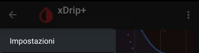


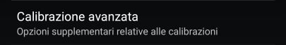

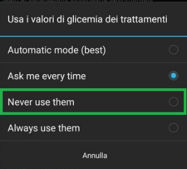

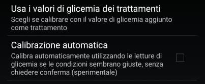

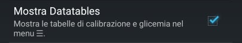

Vedrai quindi due voci aggiuntive nel menu di xDrip+: il grafico delle calibrazioni e la tabella dei dati.

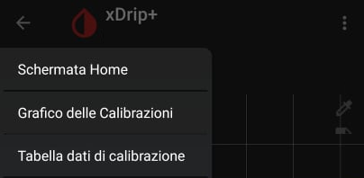

**Come leggere il grafico delle calibrazioni**

Il grafico mostra come xDrip+ interpreta i dati grezzi e genera il valore calibrato.

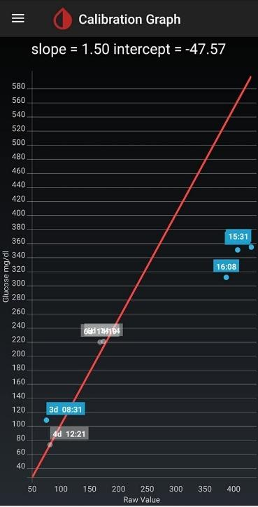

- **Slope** (pendenza): è la pendenza della riga rossa. Più il numero è alto, più una piccola variazione della glicemia grezza viene amplificata. Di solito sta tra `0.8` e `1.2`. Un valore di `1.5`, ad esempio, indica un problema.
- **Intercept** (offset): è il valore minimo misurabile dal sensore calibrato, cioè un offset da aggiungere alla glicemia grezza. Se il valore supera `40`, xDrip+ rifiuta la calibrazione per sicurezza (non si riuscirebbe a rilevare un'ipoglicemia).

Nel grafico:
- Asse verticale: glicemia calibrata
- Asse orizzontale: glicemia grezza
- Punti **blu**: calibrazioni effettuate. Se non sono valide (perché danno slope o intercept impossibili), la curva non ci passa vicino.
- Punti **grigi**: vecchie calibrazioni non più utilizzate.

La formula applicata è:

```
valore reale = glicemia grezza × slope + intercept
```

- `slope` amplifica o attenua le variazioni
- `intercept` sposta la curva su o giù

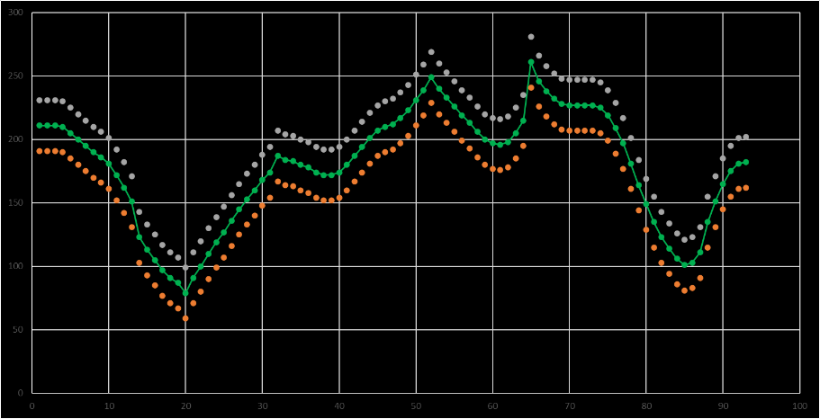

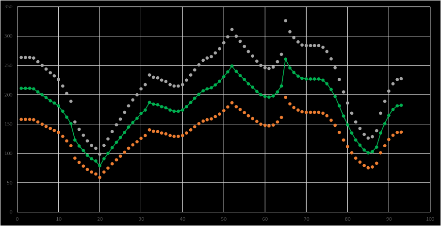

**Come leggere la tabella dei dati di calibrazione**

La tabella mostra ogni calibrazione e come ha modificato slope e intercept. Per ogni valore puoi vedere la glicemia grezza e il valore di calibrazione. Un valore diventa rosso se non è valido (regole di sicurezza di xDrip+) o se è stato disabilitato (tieni premuto il dito su un punto per disabilitarlo).

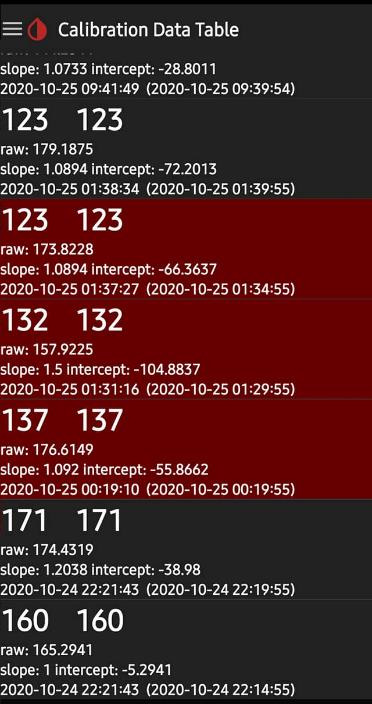

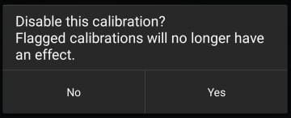

Quando ti accorgi che una calibrazione è errata e crea problemi, puoi disabilitare il punto corrispondente nella tabella.

**Resettare tutte le calibrazioni**

Se vuoi cancellare tutte le calibrazioni e ricominciare da capo, vai nella schermata di stop sensore, ma **non fermare il sensore**: resetta solo le calibrazioni. Così risparmierai le 3 prime misure richieste prima della calibrazione. Ovviamente, è necessaria una glicemia stabile nel range.

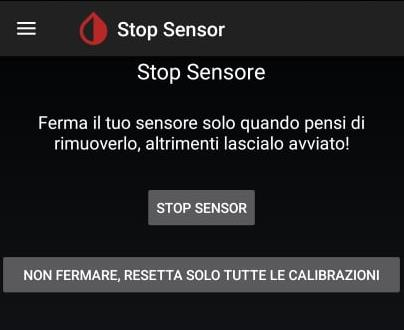

## 6. Metodo 1 – Calibrazione semplice

Dal menu di xDrip+, vai in **Impostazioni** → **Impostazioni Meno Usate** → **Calibrazione avanzata** e imposta le opzioni come indicato di seguito.


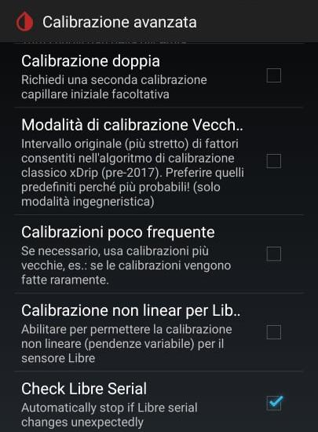

Disabilita la **pendenza variabile** (slope variabile): questa opzione semplifica la calibrazione perché fissa la pendenza della curva a `1`. Con la pendenza fissa, basta un solo valore per calibrare.

Cosa significa pendenza fissa? Significa che con una buona calibrazione (glicemia stabile!) a 100 mg/dL, avrai valori accurati indicativamente tra 70 e 130 mg/dL. L'accuratezza diminuisce man mano che la glicemia si allontana dal valore di calibrazione.

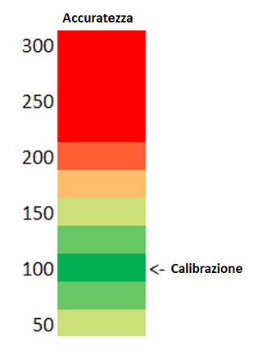

> ⚠️ È fondamentale essere accurati nelle ipoglicemie: un allarme corretto può salvarti la vita. In caso di iperglicemia, esegui sempre un pungidito per correggere.

## 7. Metodo 2 – Calibrazione avanzata

> ⚠️ Questo metodo non è disponibile con FSL 2 e l'app patchata.

Verifica che sia abilitata la **pendenza variabile** in **Impostazioni** → **Impostazioni Meno Usate** → **Calibrazione avanzata**.

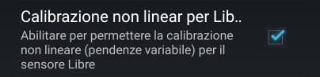

Con la pendenza variabile servono due buone calibrazioni (entrambe a glicemia stabile!) nel range: una nel range basso e una nel range alto (per esempio a 100 mg/dL e a 175 mg/dL). In questo modo avrai valori accurati indicativamente tra 75 e 200 mg/dL.

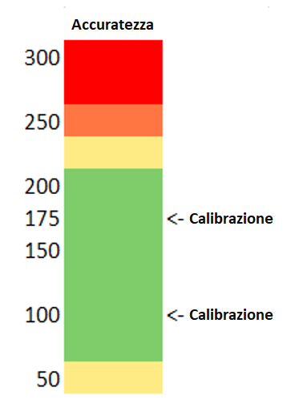

## 8. Quando calibrare

### Prima regola: GLICEMIA STABILE

Stabile significa che non cambia di più di 1 mg/dL al minuto — in xDrip+ meno di 5 mg/dL tra due letture consecutive. Di solito al risveglio la glicemia è abbastanza stabile.

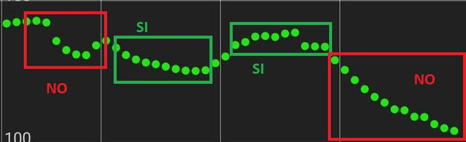

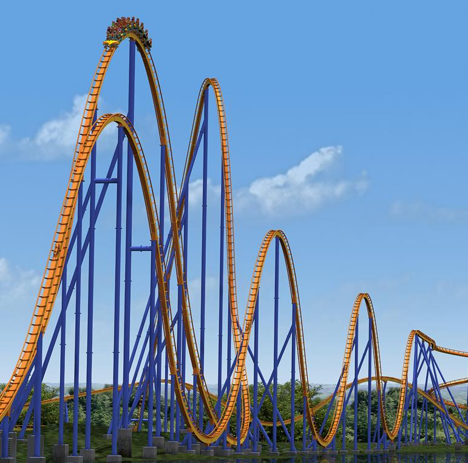

Calibrare a glicemia non stabile è come cercare di indovinare a che altezza sarà un treno in piena discesa, e usare quel valore come riferimento per decisioni di sicurezza. Non è una buona idea.


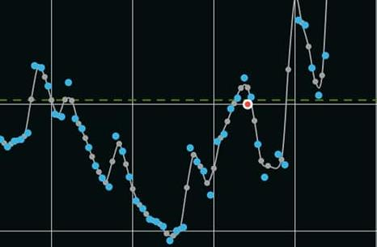

**Consigli pratici per avere una glicemia stabile al cambio sensore:**

1. Inserire il sensore almeno 4 ore prima di avviarlo (anche la sera prima). Questo riduce l'effetto del trauma di inserimento che rende la glicemia molto instabile.
2. Avviare il nuovo sensore quando scade quello vecchio, ma non usarlo subito. Aspettare qualche ora che si stabilizzi la lettura. Nel frattempo, il vecchio sensore si può ancora leggere con la scansione NFC di xDrip+.

### Seconda regola: GLICEMIA NEL RANGE

Il FSL fornisce risultati migliori nel range. L'accuratezza si riduce man mano che la glicemia si allontana dai valori centrali.

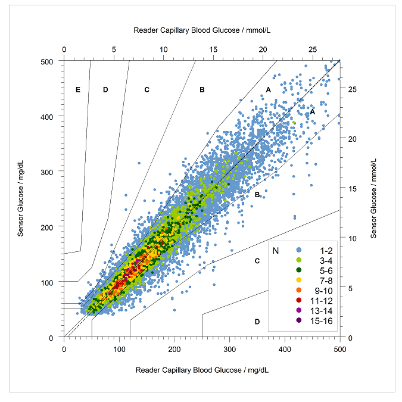

Calibra tra 80 e 180 mg/dL. Sopra 200 mg/dL non è una buona idea.

> ⚠️ `HIGH` e `LO` non sono valori numerici: non calibrare mai quando il sensore mostra questi valori. Non calibrare mai quando la glicemia è completamente piatta da troppo tempo: potrebbe indicare un sensore bloccato.

A dover scegliere tra glicemia nel range e stabilità, meglio la misura a glicemia stabile.

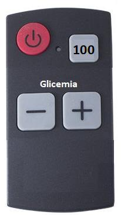

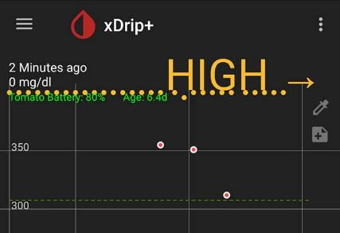

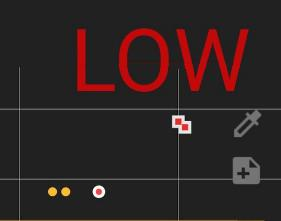

## 9. La prima calibrazione

Sensore cambiato, inserito da più di 4 ore e già avviato da più di un'ora: la glicemia si vede con l'app del fornitore o con il lettore e non sembra troppo diversa da quella del sensore precedente, che era ben calibrato. Inizializza il sensore in xDrip+. È un'operazione puramente logica, non interferisce in alcun modo con il sensore fisico.


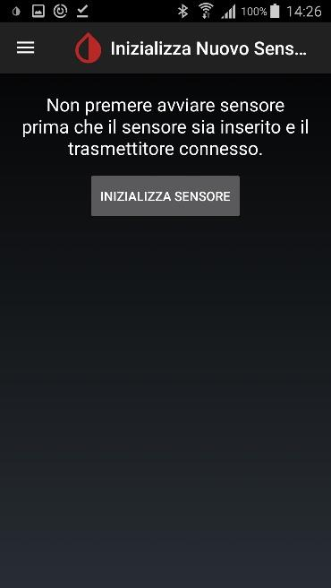

xDrip+ chiede quando è stato avviato il sensore: inserisci l'ora alla quale lo hai avviato con l'app o il lettore. Se non lo hai avviato oggi, seleziona **NON OGGI**.

Seleziona prima l'ora (quadrante esterno per le ore prima di mezzogiorno, quadrante interno dopo mezzogiorno), poi i minuti.

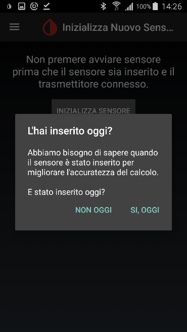

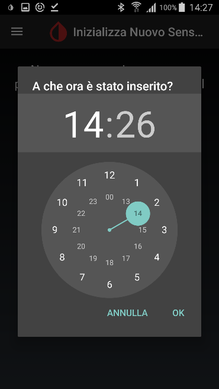

Parte la raccolta dati preliminare. Questa procedura è un'eredità legata al sensore Dexcom: nel nostro caso non è strettamente necessaria, ma non si può evitare. Ci vorranno 3 misure in circa 15 minuti.

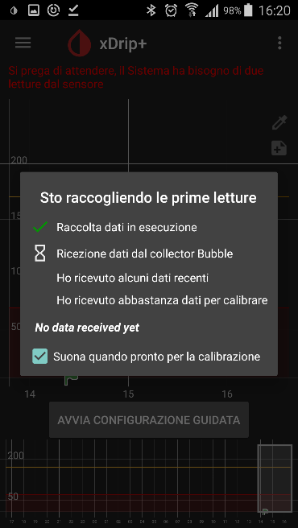

Una volta ricevute le 3 misure, il sistema chiede un valore capillare. Chiede 2 valori (sempre per eredità Dexcom). Puoi inserire lo stesso valore se hai fatto una misura capillare di buona qualità (mani pulite, campione sufficiente, glucometro di riferimento — usa sempre lo stesso strumento).

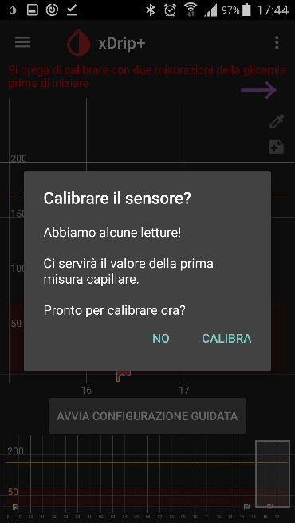

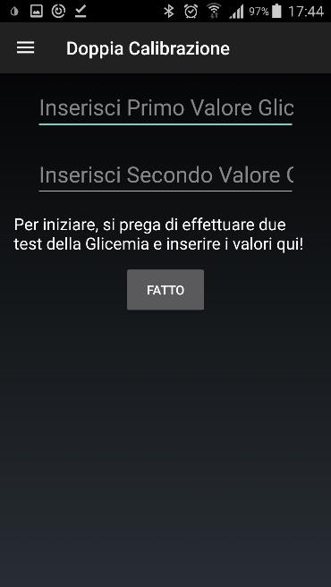

Puoi disabilitare la richiesta di due valori in **Impostazioni** → **Impostazioni Meno Usate** → **Calibrazione avanzata** → **Calibrazione doppia**.

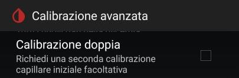

Dopo aver inserito il valore, aspetta 10 minuti per verificare se la prima calibrazione è andata a buon fine.

## 10. La regola dei 10 minuti

xDrip+ introduce un ritardo programmato di 10 minuti tra capillare e sensore. Questo significa che il valore inserito comparirà nel grafico nel futuro.

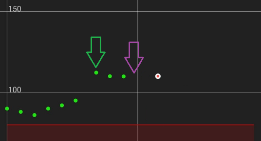

Dopo 10 minuti, la curva cercherà di adeguarsi al valore della calibrazione — è importante che la glicemia sia rimasta stabile!

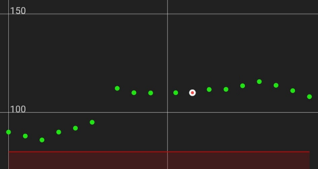

Hai calibrato con la glicemia in forte discesa o forte salita? Pazienza: al prossimo periodo di calma glicemica sistemerai gradualmente. Nel frattempo, osserva le letture con una certa diffidenza. Se la prima calibrazione era errata, probabilmente avrai una differenza abbastanza costante tra la glicemia reale e il valore indicato.

In qualsiasi momento puoi ricominciare la prima calibrazione con **Stop sensore** → **Avviare un nuovo sensore**. Oppure puoi disabilitare i punti nella tabella delle calibrazioni: xDrip+ ti farà rifare la prima calibrazione.

## 11. Calibrazioni successive

Disabilita la calibrazione automatica. Le prime due regole rimangono sempre valide:

1. Glicemia stabile
2. Glicemia nel range (solo range basso per il metodo semplice)

A queste se ne aggiungono altre:

3. Verifica a piacere, ma calibra solo se la glicemia differisce di più del 15% rispetto alla lettura del sensore. Troppe calibrazioni rendono xDrip+ instabile: meglio poche, di buona qualità.

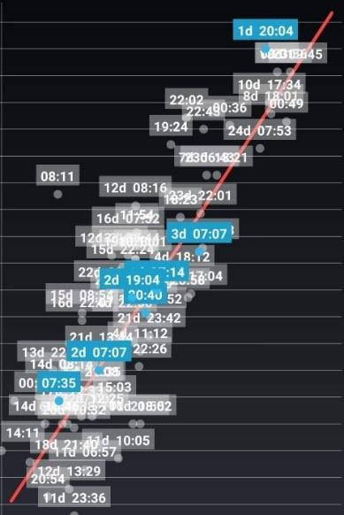

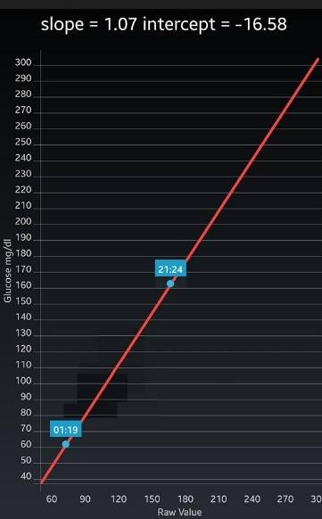

4. Non insistere. Quando xDrip+ non accetta le calibrazioni, riparti da capo o verifica il sensore.

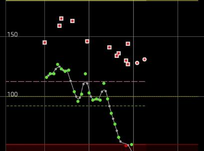

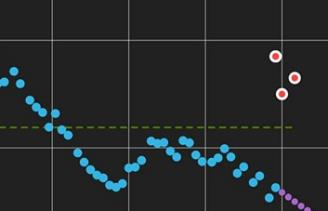

**Trucco pratico per le calibrazioni successive**

Per verificare se la glicemia rimarrà stabile dopo una calibrazione, a glicemia stabile (per esempio la mattina) fai un pungidito di verifica e inserisci il valore in xDrip+ come **trattamento** (simbolo siringa). Aspetta che il tuo punto nel futuro venga raggiunto dalla curva glicemica: così puoi verificare se la glicemia è rimasta stabile.

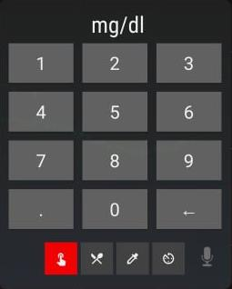

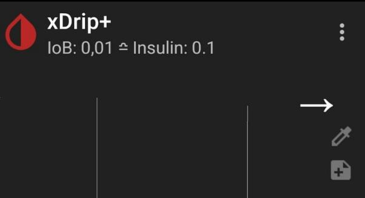

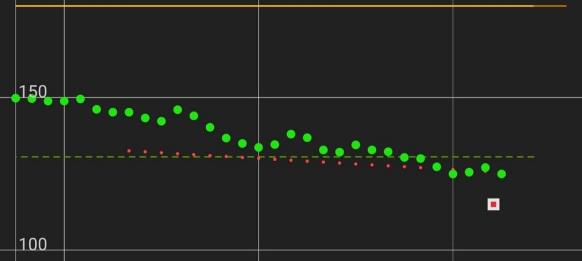

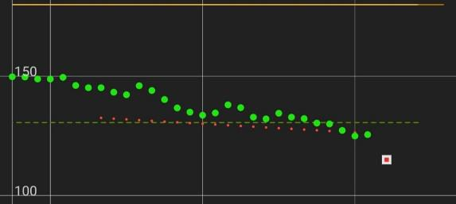

Se la glicemia è andata avanti abbastanza stabile, tocca il punto di trattamento, guarda in fondo allo schermo e scegli **MISURA CAPILLARE**, poi scegli **CALIBRATE**. Hai appena trasformato una verifica capillare in una calibrazione.

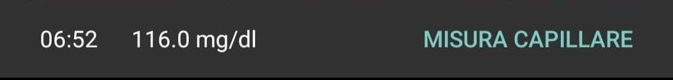

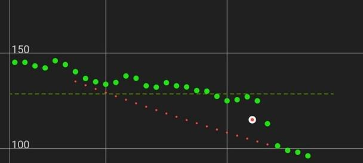

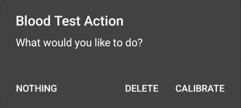

Se non ti piace il risultato, apri la tabella di calibrazione, tieni premuto il punto della calibrazione e disabilitalo. Il punto rimane come trattamento e la curva torna alla calibrazione precedente.

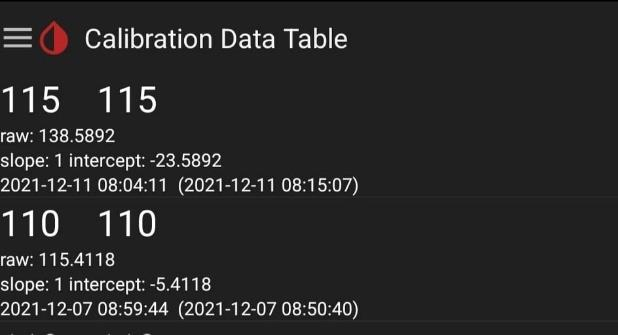


## 12. Ho calibrato e adesso ho perso il segnale


Molto probabilmente l'ultima calibrazione ha portato il valore `intercept` sopra `40`. È pericoloso: xDrip+ non permette di visualizzare la glicemia perché potrebbe non rilevare le ipoglicemie. Per verificarlo, guarda la tabella delle calibrazioni.


**Soluzione:** **Stop sensore** → **Avviare il sensore** per cancellare tutte le calibrazioni.

## Addendum – Perché calibrare non è uno scherzo

Il grafico qui sotto è un caso simile a quello che ha generato l'avvertimento della FDA contro l'uso delle app fai-da-te con il FSL 1. L'utente xDrip+ non aveva capito che quando un sensore si blocca in `LO`, calibrare non è una buona idea — soprattutto se la differenza tra il valore grezzo e quello calibrato è di 250 mg/dL. Ancora peggio se quel sensore alimenta un sistema di erogazione di insulina fai-da-te.


Un secondo caso identico ha riguardato un paziente ricoverato in chetoacidosi con un sensore guasto che era stato comunque calibrato.


> ⚠️ **NON FIDARTI MAI CIECAMENTE.** Verifica almeno una volta al giorno con una capillare. Queste persone sono rimaste per ore in glicemia bassa o alta senza mai fare una capillare. Se la glicemia sembra troppo bella o troppo piatta, deve essere un segnale di allarme.


