# CareLink follower con xDrip+

Questa guida passo passo spiega come visualizzare la glicemia di CareLink (la piattaforma cloud Medtronic per la gestione del diabete) con xDrip+.

Funziona con i seguenti dispositivi quando la glicemia è disponibile in CareLink (richiede un telefono master che la invia su internet):

- Guardian Connect
- Microinfusore 7xxG

Ringraziamo Bence Szász per questo lavoro. È necessario un telefono Android con versione 5 o superiore.

> ⚠️ **Attenzione**: Potrebbe non funzionare se hai abilitato l'autenticazione a due fattori (2FA) in CareLink.

## 1. Installare xDrip+

Segui la guida base per installare xDrip+, selezionando l'ultimo pre-release:
`https://www.glicemiadistanza.it/installare-lapp-xdrip-per-android/`

## 2. Configurare il follower CareLink

1. Vai in **Menu** → **Impostazioni** → **Dati Hardware di Origine**.
2. Seleziona **CareLink Follower**.
3. Conferma la scelta e seleziona il paese (**Italia**).
4. Se ci sono più pazienti in CareLink, digita il nome del paziente. Altrimenti lascia vuoto.
5. Effettua il login in CareLink.

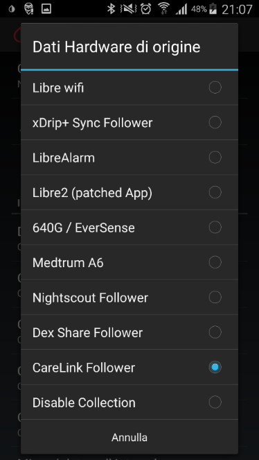

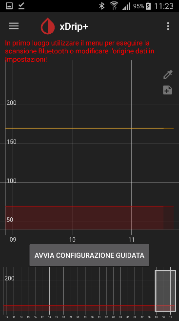

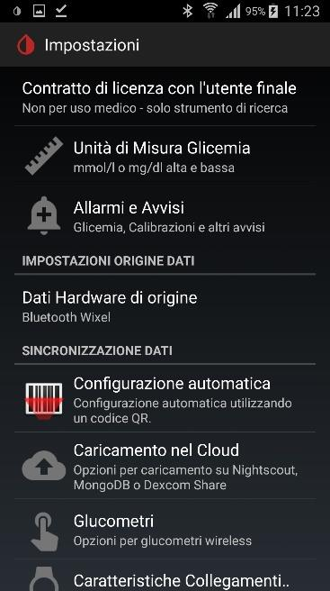

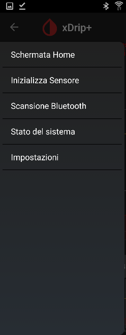

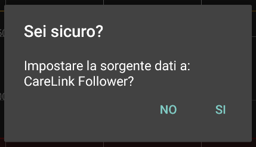

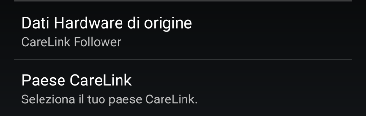

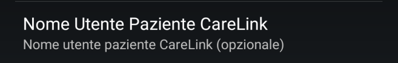

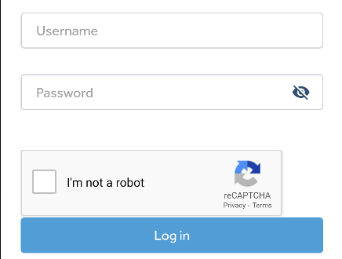

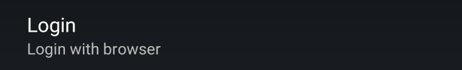

> ⚠️ **Attenzione**: Dovrai effettuare nuovamente il login ogni volta che spegni il telefono.

Per eventuali modifiche, sono disponibili diverse opzioni nel menu di xDrip+. Non ridurre i valori di **Grace Period** né di **Missed data poll interval**.

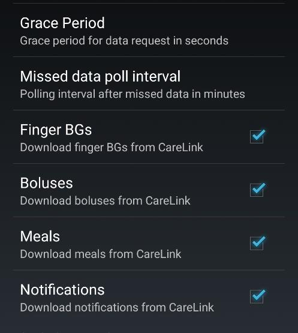

La glicemia dovrebbe comparire entro 5 minuti. Se non succede nulla, vai in **Stato del sistema** → **CareLink Follower** e verifica se ci sono errori.

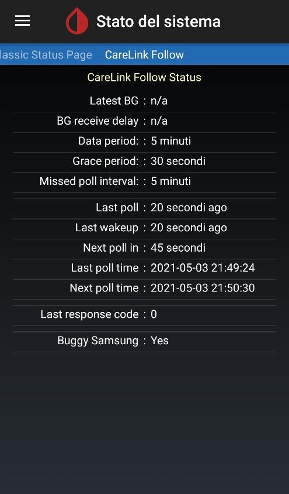

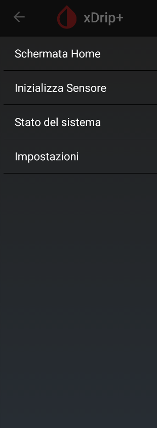

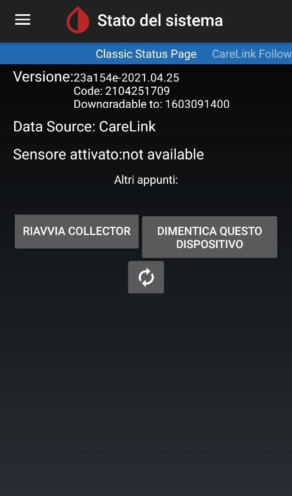

Se non arrivano dati e le credenziali sono corrette, disabilita il follower CareLink per evitare che blocchi completamente la condivisione. Verifica anche che l'app Medtronic sia impostata per sincronizzarsi con CareLink.

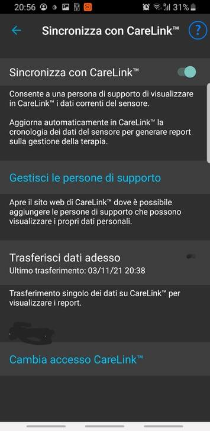

## 3. Come vedere le glicemie dall'orologio direttamente con xDrip+

Usando xDrip+ puoi visualizzare le glicemie direttamente su alcuni smartwatch senza usare Nightscout. Il collegamento funziona sia sul telefono principale sia su chi usa xDrip+ come follower.

- **Android Wear OS:** `https://www.glicemiadistanza.it/android-wear-os-come-impostare-un-quadrante-con-lapp-dexcom-master-xdrip-glimp-o-aaps/`
- **Fitbit Versa e Ionic:** `https://www.glicemiadistanza.it/fitbit-le-glicemie-di-dexcom-spike-xdrip-o-nightscout-su-smartwatch-versa-e-ionic/`
- **Samsung Watch:** `https://www.glicemiadistanza.it/g-watch-per-smartwatch-samsung/`
- **Xiaomi MiBand e Amazfit:** `https://www.glicemiadistanza.it/smartwatch-e-smartband-xiaomi-e-amazfit-collegato-a-xdrip-con-watchdrip/`

## Contatti

glicemiadistanza@gmail.com
