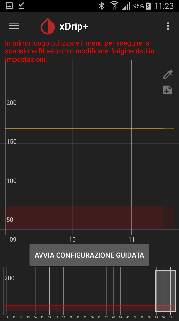
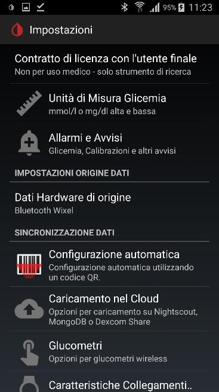
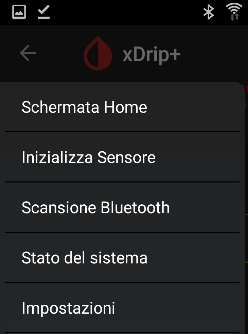
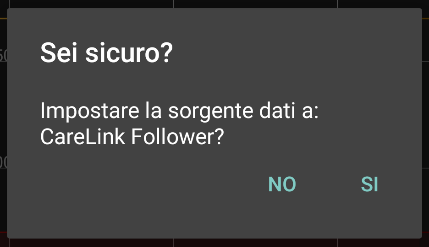
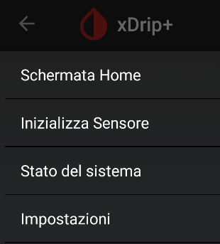

# CareLink follower con xDrip

Questa guida passo passo spiega come visualizzare la glicemia di CareLink (la piattaforma cloud Medtronic per la gestione del diabete) con xDrip.

Funziona con i seguenti dispositivi quando la glicemia è disponibile in CareLink (richiede un telefono master che la invia su internet):

- Guardian Connect
- Microinfusore 7xxG

Ringraziamo Bence Szász per questo lavoro. È necessario un telefono Android con versione 5 o superiore.

> ⚠️ **Attenzione**: Potrebbe non funzionare se hai abilitato l'autenticazione a due fattori (2FA) in CareLink.

## 1. Installare xDrip

Segui la guida base per installare xDrip, selezionando l'ultimo pre-release:
`https://www.glicemiadistanza.it/installare-lapp-xdrip-per-android/`

## 2. Creare un account CareLink Care Partner

Prima di configurare xDrip, occorre creare un account "Care Partner" su CareLink e collegarlo a quello del paziente: solo così xDrip potrà leggere i dati tramite il CareLink Follower.

1. Vai sul sito di CareLink e seleziona **Create an Account**.

2. Durante la registrazione, seleziona il tipo di account **Care Partner** (permette di visualizzare i dati del paziente, ricevere e gestire le notifiche testuali).

3. Completa il modulo con le informazioni di accesso (username, password, email).

4. Una volta creato l'account, vai in **Connect to Patient Account** e inserisci lo username del paziente per richiedere l'accesso ai suoi dati.

5. Il paziente riceverà una notifica della richiesta di collegamento (**You have 1 new care partner request(s)**) nel proprio account CareLink.

6. Il paziente deve approvare la richiesta dalla sezione **Care Partners**, premendo **Approve**.

7. Infine, sul telefono del paziente (app Guardian Connect o app del microinfusore), vai nel menu e seleziona **Sync to CareLink**.

8. Attiva l'interruttore **Sync to CareLink** per consentire l'invio automatico dei dati del sensore a CareLink.

## 3. Configurare il follower CareLink

1. Vai in **Menu** → **Impostazioni** → **Dati Hardware di Origine**.
2. Seleziona **CareLink Follower**.
3. Conferma la scelta e seleziona il paese (**Italia**).
4. Se ci sono più pazienti in CareLink, digita il nome del paziente. Altrimenti lascia vuoto.
5. Effettua il login in CareLink.

> ⚠️ **Attenzione**: Dovrai effettuare nuovamente il login ogni volta che spegni il telefono.

Per eventuali modifiche, sono disponibili diverse opzioni nel menu di xDrip. Non ridurre i valori di **Grace Period** né di **Missed data poll interval**.

La glicemia dovrebbe comparire entro 5 minuti. Se non succede nulla, vai in **Stato del sistema** → **CareLink Follower** e verifica se ci sono errori.

Se non arrivano dati e le credenziali sono corrette, disabilita il follower CareLink per evitare che blocchi completamente la condivisione. Verifica anche che l'app Medtronic sia impostata per sincronizzarsi con CareLink.

## 4. Come vedere le glicemie dall'orologio direttamente con xDrip

Usando xDrip puoi visualizzare le glicemie direttamente su alcuni smartwatch senza usare Nightscout. Il collegamento funziona sia sul telefono principale sia su chi usa xDrip come follower.

- **Android Wear OS:** `https://www.glicemiadistanza.it/android-wear-os-come-impostare-un-quadrante-con-lapp-dexcom-master-xdrip-glimp-o-aaps/`
- **Fitbit Versa e Ionic:** `https://www.glicemiadistanza.it/fitbit-le-glicemie-di-dexcom-spike-xdrip-o-nightscout-su-smartwatch-versa-e-ionic/`
- **Samsung Watch:** `https://www.glicemiadistanza.it/g-watch-per-smartwatch-samsung/`
- **Xiaomi MiBand e Amazfit:** `https://www.glicemiadistanza.it/smartwatch-e-smartband-xiaomi-e-amazfit-collegato-a-xdrip-con-watchdrip/`

## Contatti

glicemiadistanza@gmail.com
