# CareLink follower con xDrip

Questa guida passo passo spiega come visualizzare la glicemia di CareLink (la piattaforma cloud Medtronic per la gestione del diabete) con xDrip.

Funziona quando la glicemia è disponibile in CareLink (richiede un telefono master che la invia su internet):

Ringraziamo Bence Szász per questo lavoro. È necessario un telefono Android con versione 8 o superiore.

> ⚠️ **Attenzione**: Potrebbe non funzionare se hai abilitato l'autenticazione a due fattori (2FA) in CareLink.

Lo schema generale del collegamento: l'app del paziente (Guardian Connect o microinfusore) invia i dati a CareLink, che li rende disponibili a un account "follower" collegato, letto infine da xDrip:

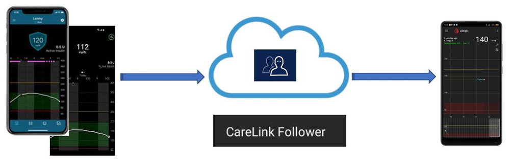

## 1. Installare xDrip

Segui la [guida base per installare xDrip](../xdrip/installare-xdrip-android), selezionando l'ultimo pre-release.

## 2. Creare un account CareLink Care Partner

Prima di configurare xDrip, occorre creare un account "Care Partner" su CareLink e collegarlo a quello del paziente: solo così xDrip potrà leggere i dati tramite il CareLink Follower.

1. Vai sul sito di [CareLink](https://carelink.medtronic.eu/) e seleziona **Create an Account**:

2. Durante la registrazione, seleziona il tipo di account **Care Partner** (permette di visualizzare i dati del paziente, ricevere e gestire le notifiche testuali):

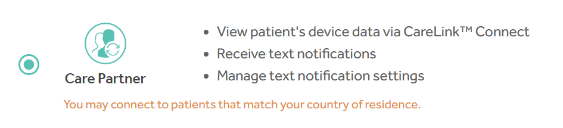

3. Completa il modulo con le informazioni di accesso (username, password, email):

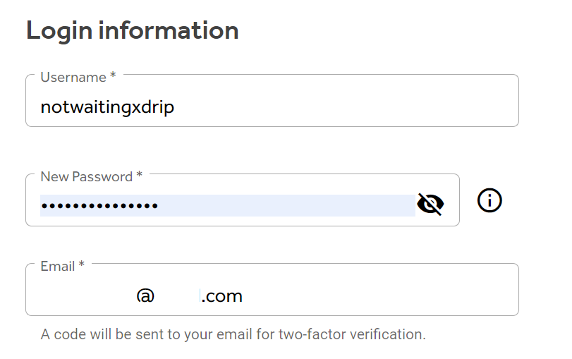

4. Una volta creato l'account, vai in **Connect to Patient Account** e inserisci lo username del paziente per richiedere l'accesso ai suoi dati:

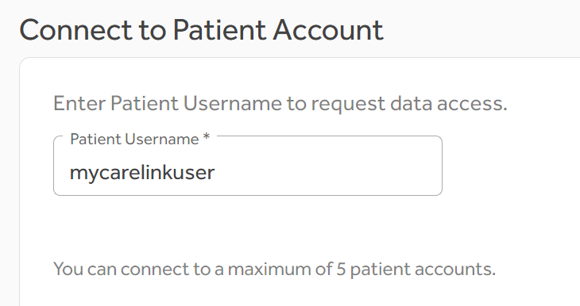

5. Il paziente riceverà una notifica della richiesta di collegamento (**You have 1 new care partner request(s)**) nel proprio account CareLink:

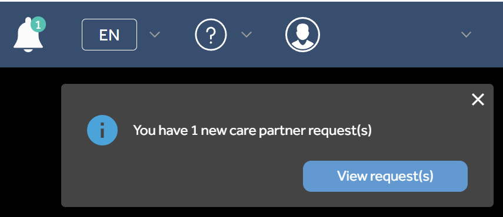

6. Il paziente deve approvare la richiesta dalla sezione **Care Partners**, premendo **Approve**:

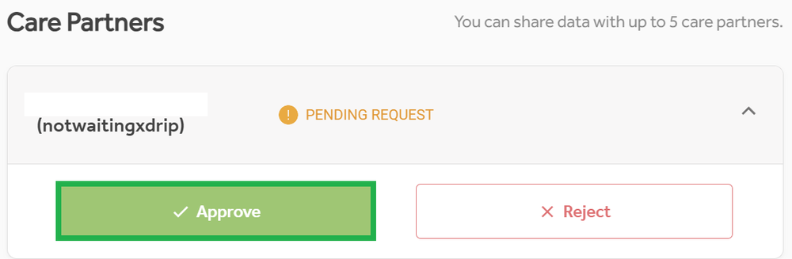

7. Infine, sul telefono del paziente (app Guardian Connect o app del microinfusore), apri il menu delle impostazioni del dispositivo e seleziona **Sync to CareLink**:

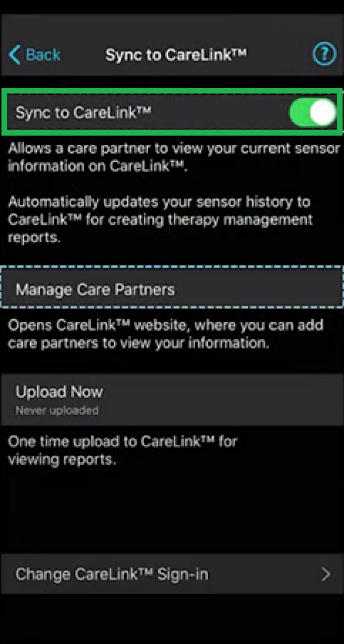

8. Attiva l'interruttore **Sync to CareLink** per consentire l'invio automatico dei dati del sensore a CareLink:

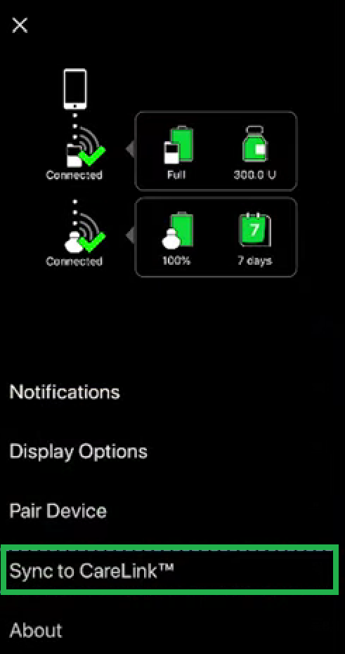

## 3. Configurare il follower CareLink

1. Apri il menu principale toccando l'icona ☰ in alto a sinistra. Si apre il menu con le voci principali, tra cui **Impostazioni**:

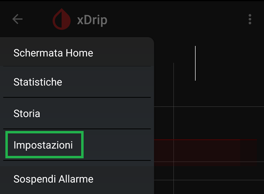

2. Vai in **Impostazioni** → **Dati Hardware di Origine** (inizialmente mostrerà la sorgente precedente, ad esempio "Bluetooth Wixel"):

3. Seleziona **CareLink Follower** dall'elenco:

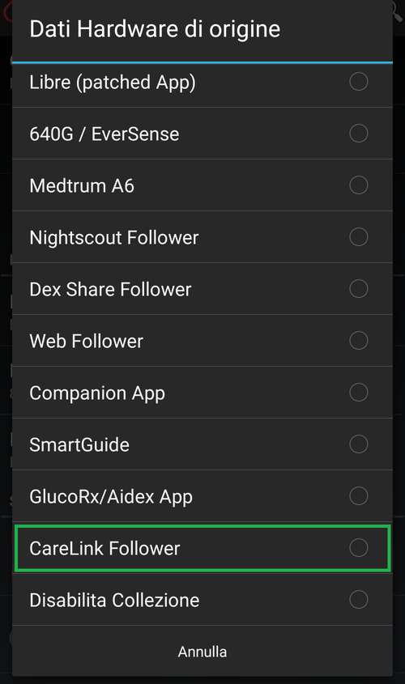

4. Seleziona il **Paese CareLink** (Italy):

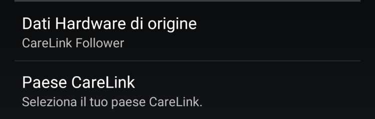

5. **Solo** se ci sono più pazienti in CareLink, digita il **Nome Utente Paziente CareLink**.
   Altrimenti lascia vuoto:

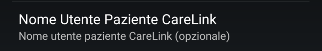

6. Tocca **Login** per aprire il modulo di accesso:

Effettua il login in CareLink con le tue credenziali di Care Partner:

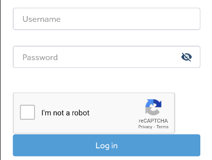

Per eventuali modifiche, sono disponibili diverse opzioni nel menu di xDrip. Non ridurre i valori di **Periodo di grazie** né di **Intervallo richiesta dati mancanti**:

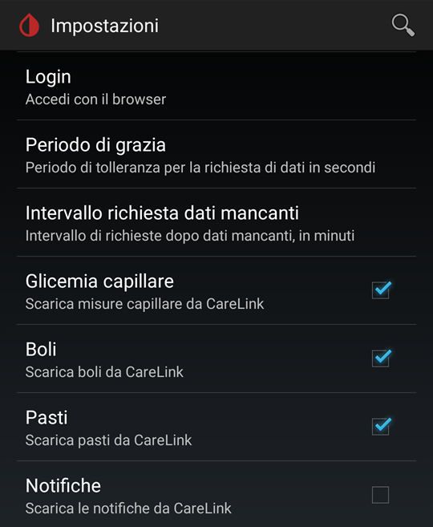

La glicemia dovrebbe comparire entro 5 minuti. Se non succede nulla, vai in **Menu → Stato del sistema**:

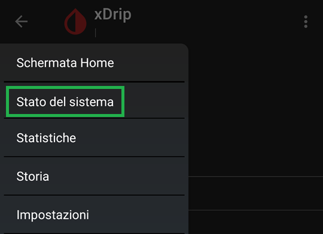

Nella pagina **Stato del sistema**, verifica che la **Sorgente Dati** risulti impostata su **CareLink**:

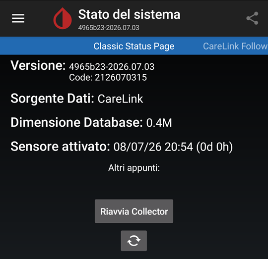

Poi apri la scheda **CareLink Follow** (compare dopo il primo accesso) per controllare eventuali errori nei dettagli del collegamento (orario dell'ultimo tentativo, prossimo tentativo, codice di risposta):

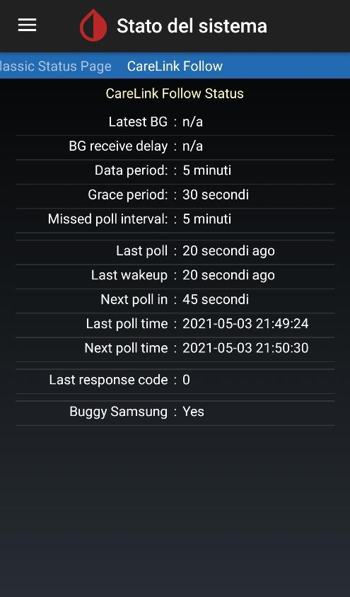

Se non arrivano dati e le credenziali sono corrette, disabilita il follower CareLink per evitare che blocchi completamente la condivisione. Verifica anche che l'app Medtronic sia impostata per sincronizzarsi con CareLink:

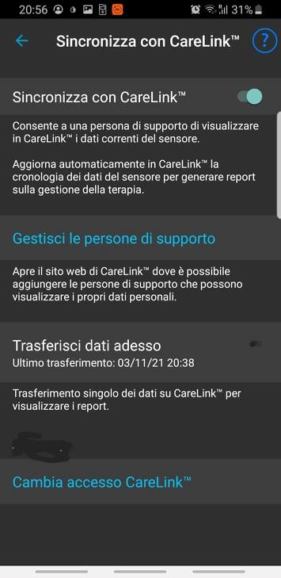

